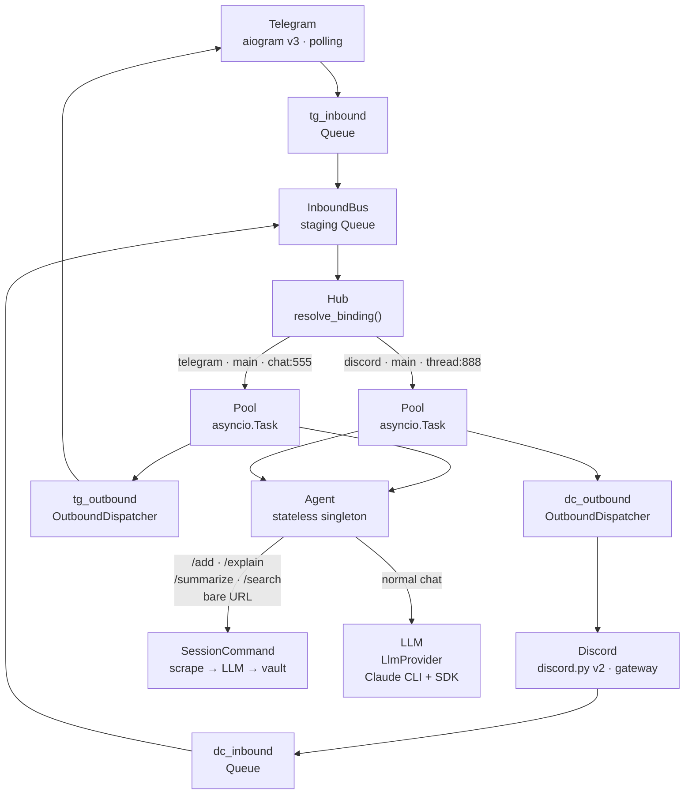

# Lyra

**Personal AI agent engine** — hub-and-spoke, asyncio, multi-channel.

[](https://github.com/Roxabi/lyra/actions/workflows/ci.yml)


[](LICENSE)

Lyra runs 24/7 on your own hardware, connects Telegram and Discord to specialized AI agents, and routes every conversation through isolated per-scope pools. No cloud lock-in. No subscription. Your data stays on your machines.

## Why

Most personal AI assistants are cloud-hosted: your data leaves your machine, your conversations are stored on someone else's servers, and the service disappears the moment a company pivots.

Lyra exists to run on your own hardware — a Raspberry Pi, a home server, anything always-on — and connect your preferred chat platforms (Telegram, Discord) to AI agents you control. No API keys sold to third parties. No subscription. No lock-in. When you want a different model, you swap it in TOML.

It's for developers who want a persistent personal AI without giving up ownership of their data or infrastructure.

## How it works

1. **Channel adapters** (Telegram, Discord) normalize incoming messages and push them into per-platform bounded asyncio queues.
2. **The Hub** routes each message to the right agent via typed `(platform, bot_id, scope_id)` bindings — one pool per conversation scope (chat, thread, channel).
3. **The Agent** processes the message, calls the LLM, and sends the response back through the outbound dispatcher to the originating channel.

## Architecture



## Features

### Channels & Routing

| Feature | Detail |
|---------|--------|
| **Channels** | Telegram (aiogram v3 · polling + webhook) · Discord (discord.py v2 · gateway) |
| **Routing** | Typed `RoutingKey(platform, bot_id, scope_id)` · wildcard `*` per channel · scope = chat / thread / channel |
| **Concurrency** | Sequential per scope (`asyncio.Task`) · parallel across scopes and platforms — zero config |
| **Backpressure** | Bounded queue (100) → immediate ack + blocking `await put()` |

### AI & Agents

| Feature | Detail |
|---------|--------|
| **LLM** | LlmProvider protocol: Claude CLI + Anthropic SDK drivers · smart routing (complexity-based model selection) · Ollama (Phase 2) |
| **Agents** | Stateless singleton · isolated per-scope pools · AgentStore (SQLite) · TOML seeds · N agents × N bots via `config.toml` |
| **Memory** | 5 levels: working (L0 compaction ✅) → session → episodic → semantic (SQLite + FTS5 + fastembed ✅) → procedural · cross-session recall via `[MEMORY]`/`[PREFERENCES]` blocks |
| **Session commands** | `/add <url>` (scrape → LLM → vault) · `/explain <url>` · `/summarize <url>` · `/search <query>` · bare URL auto-rewrite → `/add` |

### Security & Voice

| Feature | Detail |
|---------|--------|
| **Auth** | AuthMiddleware + TrustLevel per adapter (owner/trusted/public/blocked) · RoutingContext outbound verification |
| **Voice** | STT via voicecli library (faster-whisper `large-v3-turbo` + personal vocab · InboundAudioBus → STTService) · TTS via voicecli (Qwen-fast) — OGG/Opus · waveform · Discord voice bubble |
| **Security** | Prompt injection guard · sandboxed skills · least-privilege tool permissions · hmac webhook verification |

## Quick start

```bash
# 1. Install
uv sync && source .venv/bin/activate

# 2. Tokens — create .env with your bot token(s)
cat > .env <<'EOF'
TELEGRAM_TOKEN=your-telegram-bot-token
TELEGRAM_WEBHOOK_SECRET=any-random-secret
DISCORD_TOKEN=your-discord-bot-token   # omit if not using Discord
EOF

# 3. Auth config — tell Lyra which bots to run and who owns them
cp config.toml.example config.toml
# Edit config.toml: set your Telegram/Discord user ID in [[auth.telegram_bots]] / [[auth.discord_bots]]

# 4. Run
lyra start

# Or see all commands
lyra --help
```

> See [QUICKSTART.md](docs/QUICKSTART.md) for the full setup — bot creation, agent TOML, environment variables, and sending your first message.

## Configuration

All configuration is via `.env` (copy `.env.example` to get started). Key variables:

**Telegram**

| Variable | Required | Description |
|----------|----------|-------------|
| `TELEGRAM_TOKEN` | ✅ | Bot token from [@BotFather](https://t.me/BotFather) |
| `TELEGRAM_BOT_USERNAME` | optional | Bot username (e.g. `lyra_bot`) — defaults to `lyra_bot` |
| `TELEGRAM_WEBHOOK_SECRET` | ✅ | Any random string — used to verify webhook payloads |
| `TELEGRAM_ADMIN_CHAT_ID` | optional | Chat ID that receives owner-level trust |

**Discord**

| Variable | Required | Description |
|----------|----------|-------------|
| `DISCORD_TOKEN` | ✅ | Bot token from Discord Developer Portal |
| `DISCORD_AUTO_THREAD` | optional | Auto-create threads for replies (`true`/`false`) |

**LLM & Config**

| Variable | Required | Description |
|----------|----------|-------------|
| `ANTHROPIC_API_KEY` | ✅ (SDK driver) | Anthropic API key (not needed for Claude CLI driver) |
| `LYRA_CONFIG` | optional | Path to `config.toml` — default: `config.toml` |

**Voice (optional)**

| Variable | Default | Description |
|----------|---------|-------------|
| `STT_MODEL_SIZE` | `large-v3-turbo` | Whisper model size (`small`, `medium`, `large-v3-turbo`) |
| `STT_DEVICE` | `auto` | `cpu`, `cuda`, or `auto` |

Agent behaviour (tools, model, system prompt) is managed via **AgentStore** (`~/.lyra/auth.db`, SQLite). TOML files in `src/lyra/agents/` are seed sources — import them with `lyra agent init`. Use `lyra agent edit` to modify agents at runtime without touching TOML.
See [QUICKSTART.md](docs/QUICKSTART.md) for the full walkthrough.

## CLI reference

```bash
lyra start                        # start all configured adapters
lyra agent init                   # seed DB from TOML files (first-time setup)
lyra agent init --force           # overwrite existing DB rows with TOML
lyra agent list                   # list all agents in DB (name, backend, model, assigned bots)
lyra agent show <name>            # full config for one agent
lyra agent edit <name>            # edit an agent interactively in DB
lyra agent validate <name>        # validate agent schema + constraints
lyra agent assign <name> --platform telegram --bot <bot_id>
lyra agent delete <name>          # refuses if bot still assigned
lyra agent create                 # create a new agent (writes directly to DB)
lyra config show                  # display parsed config.toml
lyra config validate              # check tokens + env vars are set
lyra --version
```

**Telegram-only or Discord-only**: simply omit `[[telegram.bots]]` or `[[discord.bots]]` from `config.toml`. Lyra starts with whichever adapters are configured — a missing platform logs a warning and is skipped.

### In-chat commands

Send these directly in Telegram or Discord:

| Command | Description |
|---------|-------------|
| `/add <url>` | Scrape URL → LLM summary → save to vault |
| `/explain <url>` | Scrape URL → plain-language explanation |
| `/summarize <url>` | Scrape URL → bullet-point summary |
| `/search <query>` | Full-text search over vault |
| `<url>` (bare) | Auto-rewritten to `/add <url>` |
| `/clear` | Reset conversation history |
| `/voice <text>` | Send voice reply — prompt routes through LLM then TTS (`voicecli`) |
| `/help` | List all available commands |

> See [COMMANDS.md](docs/COMMANDS.md) for the full command reference, workspace commands, and how to add plugins.

## Operations (Makefile)

Machine connection is configured in `.env` (see `.env.example`):

```bash
MACHINE1_HOST=mickael@192.168.1.16
MACHINE1_DIR=~/projects/lyra
```

| Command | Description |
|---------|-------------|
| `make lyra` | Start both adapters locally (telegram + discord) |
| `make lyra stop` | Stop both adapters |
| `make lyra reload` | Restart both adapters |
| `make lyra status` | Status of both adapters |
| `make lyra logs` | Tail lyra_telegram stdout |
| `make telegram` | telegram adapter only (start\|stop\|reload\|logs\|errors) |
| `make discord` | discord adapter only (start\|stop\|reload\|logs\|errors) |
| `make deploy` | Deploy to Machine 1 (pull main + test + restart) |
| `make remote stop` | Stop Lyra on Machine 1 |
| `make remote status` | Check Machine 1 service status |
| `make remote logs` | Tail Machine 1 stdout logs |
| `make test` | Run tests |
| `make lint` | Run ruff linter |
| `make format` | Auto-format with ruff |

## Structure

```
src/lyra/
  core/       — hub, pool, agent, message, memory, auth, bus, command router
  adapters/   — channel adapters (Telegram, Discord, CLI)
  agents/     — agent implementations + TOML seed configs
  llm/        — LlmProvider protocol, drivers (CLI, SDK), smart routing
  stt/        — STTService (faster-whisper)
  tts/        — TTS pipeline (voicecli, OGG/Opus)
  commands/   — command handlers (echo, pairing, search)
  monitoring/ — health checks + escalation
tests/        — pytest-asyncio + pytest-cov (core, adapters, llm, cli)
docs/         — ARCHITECTURE.md, ROADMAP.md, QUICKSTART.md, 24 ADRs
```

> See [ARCHITECTURE.md](docs/ARCHITECTURE.md) for the full file-by-file breakdown.

## Documentation

| Doc | Description |
|-----|-------------|
| [QUICKSTART.md](docs/QUICKSTART.md) | From zero to first message in 5 minutes |
| [ARCHITECTURE.md](docs/ARCHITECTURE.md) | Hub design, memory model, hardware, key decisions |
| [vision.md](docs/vision.md) | Why Lyra exists and what it is not |
| [ROADMAP.md](docs/ROADMAP.md) | Phase 1/2/3 scope, priorities, timeline |
| [COMMANDS.md](docs/COMMANDS.md) | Command router — slash commands, external tool integration pattern |
| [GETTING-STARTED.md](docs/GETTING-STARTED.md) | Machine 1 (Ubuntu Server) hardware setup |
| [DEPLOYMENT.md](docs/DEPLOYMENT.md) | Production service management on Machine 1 (supervisord, logs, firewall) |
| [ADRs](docs/architecture/adr/) | 24 architecture decision records with full rationale |
| [CONTRIBUTING.md](CONTRIBUTING.md) | Branching model, commit conventions, adding adapters and agents |

## Contributing

See [CONTRIBUTING.md](CONTRIBUTING.md) — branching model, commit conventions, adding adapters and agents.

## License

MIT
