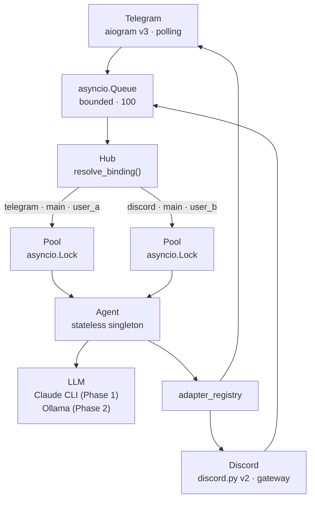

# Lyra

**Personal AI agent engine** — hub-and-spoke, asyncio, multi-channel.


Lyra runs 24/7 on your own hardware, connects Telegram and Discord to specialized AI agents, and routes every conversation through isolated per-user pools. No cloud lock-in. No subscription. Your data stays on your machines.

## How it works

1. **Channel adapters** (Telegram, Discord) normalize incoming messages and push them into a bounded asyncio queue.
2. **The Hub** routes each message to the right agent via typed `(platform, bot_id, user_id)` bindings, and runs it inside an isolated per-user pool with an `asyncio.Lock`.
3. **The Agent** processes the message, calls the LLM, and sends the response back through the adapter registry to the originating channel.

## Architecture



## Features

| Feature | Detail |
|---------|--------|
| **Channels** | Telegram (aiogram v3 · polling + webhook) · Discord (discord.py v2 · gateway) |
| **Routing** | Typed `RoutingKey(platform, bot_id, user_id)` · wildcard `*` per channel |
| **Concurrency** | Sequential per user (`asyncio.Lock`) · parallel across users — zero config |
| **Backpressure** | Bounded queue (100) → immediate ack + blocking `await put()` |
| **LLM** | Claude Code CLI (Phase 1) · Ollama OpenAI-compatible API (Phase 2) |
| **Agents** | Stateless singleton · isolated per-user pools · TOML config per agent |
| **Memory** | 5 levels: working → session → episodic → semantic (SQLite + BM25) → procedural |
| **Security** | Prompt injection guard · sandboxed skills · least-privilege tool permissions |

## Quick start

```bash
# 1. Install
uv sync

# 2. Configure
cat > .env <<'EOF'
TELEGRAM_TOKEN=your-telegram-bot-token
TELEGRAM_WEBHOOK_SECRET=any-random-secret
DISCORD_TOKEN=your-discord-bot-token
EOF

# 3. Run
python -m lyra
```

> See [QUICKSTART.md](docs/QUICKSTART.md) for the full setup — bot creation, agent TOML, environment variables, and sending your first message.

## Structure

```
src/lyra/
  core/
    message.py      — Message, RoutingKey, Platform, Response
    hub.py          — Hub (bus + adapter registry + bindings)
    pool.py         — Pool (history + asyncio.Lock per user)
    agent.py        — AgentBase, Agent config, ModelConfig
    cli_pool.py     — Claude CLI subprocess pool
  adapters/
    telegram.py     — aiogram v3 adapter (polling + webhook)
    discord.py      — discord.py v2 gateway adapter
  agents/
    simple_agent.py       — Claude CLI agent implementation
    lyra_default.toml     — default agent config (model, tools, system prompt)
tests/
  core/             — unit + integration tests (pytest-asyncio)
docs/
  ARCHITECTURE.md   — full technical spec and decisions
  ROADMAP.md        — priorities and scope
  QUICKSTART.md     — developer setup guide
  vision.md         — design principles and constraints
  architecture/adr/ — architecture decision records
```

## Documentation

| Doc | Description |
|-----|-------------|
| [QUICKSTART.md](docs/QUICKSTART.md) | From zero to first message in 5 minutes |
| [ARCHITECTURE.md](docs/ARCHITECTURE.md) | Hub design, memory model, hardware, key decisions |
| [vision.md](docs/vision.md) | Why Lyra exists and what it is not |
| [ROADMAP.md](docs/ROADMAP.md) | Phase 1/2/3 scope, priorities, timeline |
| [GETTING-STARTED.md](docs/GETTING-STARTED.md) | Machine 1 (Ubuntu Server) hardware setup |
| [DEPLOYMENT.md](docs/DEPLOYMENT.md) | Production service management on Machine 1 (systemd, logs, firewall) |
| [ADRs](docs/architecture/adr/) | 8 architecture decision records with full rationale |
| [CONTRIBUTING.md](CONTRIBUTING.md) | Branching model, commit conventions, adding adapters and agents |
