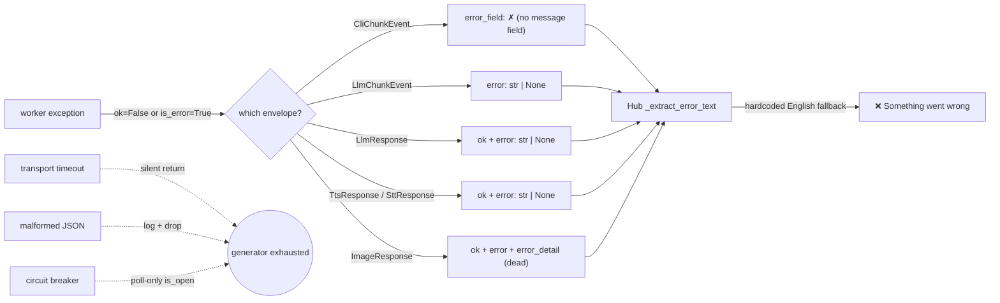
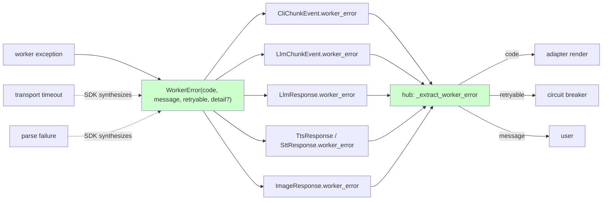

## Problem

A user sends a message to the bot. The worker fails — clipool times out, the LLM crashes, voice synthesis hits a quota. The user sees a bare `❌` or _"Something went wrong. Please try again."_ — no indication of what failed, whether to retry, or whether they need to wait.

The user-visible symptom is the surface of a deeper structural gap. After auditing the NATS surface (issue body originally framed it as "patch CliChunkEvent" — F-lite — and the audit upgraded it to F-full):

- **6 NATS reply envelopes carry 4 different error contracts.** `LlmChunkEvent.error: str`, `LlmResponse.ok + error: str`, `CliChunkEvent.is_error` _(no message field)_, `Tts/SttResponse.ok + error: str`, `ImageResponse.ok + error + error_detail` _(error_detail dead — never populated)_, `CliControlAck.ok` _(no message)_.
- **3 SDK silent-drop sites in `roxabi-nats`.** `NatsDriverBase._stream_gen` returns silently on timeout (caller sees "exhausted"). `NatsAdapterBase._dispatch` logs and drops malformed JSON. The circuit breaker is poll-only (`is_open()`), no event on open/half-open.
- **Divergent error shapes inside one driver.** `NatsLlmDriver.complete()` returns `LlmResult(error=…, retryable=…)`; `NatsLlmDriver.stream()` yields `ResultLlmEvent(is_error=True, error_text=…)`. Different field names, different timeout strings, same conceptual failure.
- **Zero structured error telemetry.** A bare ❌ in Telegram is the only production signal. Regressions are invisible.

## Outcome

Successful rollout means:

1. **A user who triggers a worker failure sees a message that tells them what went wrong and whether to retry** — not a bare ❌ or generic English fallback. (Underlying mechanism: hub extracts `WorkerError.message` and passes `code` to the adapter.)
2. **An operator can grep one structured field to count error types per domain** — e.g. `worker_error_received_total{code="cli.auth"}` rises when CLI sessions expire. (Underlying mechanism: hub + workers populate `worker_error.code`; adoption counters expose them.)
3. **Transport-layer failures** (timeout, parse error) become observable events instead of silent generator exhaustion — at minimum on the driver side.
4. **Adoption is measurable.** Counters report which domains are populating `worker_error` and which still rely on the legacy `error_text` shim. Phase transitions become metric-gated, not judgment calls.
5. **No breaking change.** Every step is additive per ADR-049 (`extra="ignore"` forward-compat). `CONTRACT_VERSION` stays at `"1"`. Cross-repo (voiceCLI, imageCLI) skew is tolerated.
6. **Future workers (#988 harness, future agentic workers) inherit the contract** — the question "how do I report an error from my worker?" has one documented answer.

## Appetite

**~2-week feature cycle for #1016 (P1 + P2)**, with P3 + P4 deferred to child issues:

| Phase | Timebox | Scope |
|---|---|---|
| ADR | ~1 day | _Unified WorkerError envelope across NATS reply contracts._ Cites both PoVs; declared normative on the code registry; supersedes worker→hub portion of ADR-006. |
| **P1** | ~3 days | `WorkerError` model + 5-envelope additive field + code registry (Python `KNOWN_CODES` dict + `error-codes.md` + CI sync check) + delete `ImageResponse.error_detail` + adoption counters in each process. Tests for additive contract compatibility. |
| **P2** | ~3 days | `clipool_worker` + `NatsLlmDriver` populate `worker_error`; hub `_extract_worker_error` helper; tests; **48h soak in prod with telemetry** before deleting the legacy `error_text` shim. |
| Buffer | ~3 days | Review iterations, doc updates (CLAUDE.md hygiene), CHANGELOG. |
| _P3 (child)_ | _separate_ | _SDK driver-side synthesis (`_stream_gen` timeout / parse / no-responders → terminal `WorkerError` event). `_dispatch` documented as out-of-scope. Refactor of `NatsLlmDriver` to use `NatsDriverBase` (duplicate heartbeat logic) is also P3 territory._ |
| _P4 (child)_ | _separate_ | _voiceCLI + imageCLI workers populate `worker_error`. Coordinated cross-repo PRs._ |

## Shapes

Four mutually-exclusive architectural directions surfaced. Listed in increasing scope; the recommended fit is Shape B.

### Shape A — Per-domain narrow patch

The original F-lite proposal: add `error_text: str | None` to `CliChunkEvent` only. Other domains stay unchanged. Future workers each invent their own field.

**Trade-offs:**
- **Pro:** Smallest possible change; ships in a single short PR.
- **Pro:** Zero coordination cost across domains.
- **Con:** Doesn't address the 3 SDK silent-drop sites — transport timeouts remain invisible.
- **Con:** Codifies the inconsistency: each domain keeps its own naming (`error`, `error_text`, `event_type="error"`, `error_detail`).
- **Con:** Future workers (#988) re-litigate the field name. The architectural decision gets distributed across N PRs.
- **Con:** Hub fallback stays hardcoded English. No `code` for i18n. No `retryable` for circuit-breaker.

**Rough scope:** XS. **Verdict:** rejected. The audit changes the cost/value calculus — fixing one domain costs almost the same as fixing all 5 once we already understand the shape.

### Shape B — Additive `WorkerError` on 5 reply envelopes (recommended)

Single canonical model in `roxabi-contracts`. Optional `worker_error: WorkerError | None` field added to each of the 5 reply envelopes. Open string codes governed by a registry. SDK synthesizes `WorkerError(code="transport.*", …)` on driver-side timeouts/parse failures (P3, child issue). `is_error` / `ok` remain alongside; `worker_error` is additive.

**Trade-offs:**
- **Pro:** One contract, one extractor, one fallback path, uniform telemetry.
- **Pro:** Additive only — fully compatible with ADR-049 (`extra="ignore"`); no `CONTRACT_VERSION` bump; cross-repo skew tolerated.
- **Pro:** Open-string codes + registry avoid forcing version bumps every time a new code is added.
- **Pro:** Foundation for adapter i18n (P6) and structured retry policy (separate concern) ships free.
- **Pro:** Future worker authors have one documented answer.
- **Con:** Touches 5 schemas at once — coordination cost higher than Shape A.
- **Con:** ADR required (≥2 packages, new cross-cutting pattern, supersedes worker→hub portion of ADR-006).
- **Con:** Registry discipline is a soft requirement — open strings can accumulate undiscoverable codes if unmaintained.

**Rough scope:** L (≈2-week cycle for #1016 P1+P2; P3/P4 spawn child issues).

### Shape C — Tagged-union envelope wrapper

Wrap every reply in a generic `WorkerReply<T> { ok: bool, payload: T | None, error: WorkerError | None }`. Type-level invariant: `ok = (error is None)`. All 6 reply contracts become `WorkerReply<...>` instantiations.

**Trade-offs:**
- **Pro:** Strongest typing — invariant enforced at the type system level.
- **Pro:** Eliminates `is_error` / `ok` ambiguity by construction.
- **Con:** **Breaking change.** Existing wire format changes shape. ADR-049 forbids this without coordinated cross-repo upgrade. Triggers `CONTRACT_VERSION` bump.
- **Con:** Migration is a multi-week effort across `lyra`, `voiceCLI`, `imageCLI` simultaneously. Cross-repo skew window forces deploy ordering.
- **Con:** Pydantic generics with discriminated unions add cognitive overhead; existing consumers (test doubles per ADR-049 §3-guards) all need rewriting.
- **Con:** Solves a typing-elegance problem at runtime cost; the actual user pain (no error message reaching the user) is solvable without it.

**Rough scope:** XL. **Verdict:** rejected. Cost out of proportion to incremental gain; violates additive-only constraint; no PoV endorsed it.

### Shape D — Separate error subject (out-of-band channel)

Workers publish errors on a parallel NATS subject (`lyra.errors.<domain>.<bot>`) instead of on the reply envelope. Hub subscribes to both reply and error subjects. Reply contracts stay unchanged.

**Trade-offs:**
- **Pro:** Reply contracts truly untouched (additive at the messaging level rather than schema level).
- **Pro:** Errors can be observed by other consumers (logging pipeline, future OTel) without parsing reply payloads.
- **Con:** Loses temporal correlation — a streaming chunk can finish "successfully" while the error subject delivers a terminal failure with no ordering guarantee. Race window in the hub.
- **Con:** Doubles the subscription topology — every adapter needs an additional subject and ACL grant. Topology-first ACL schema (#993) needs revisiting.
- **Con:** `trace_id` correlation across two subjects requires explicit linking; current envelopes already carry `trace_id` for in-band correlation.
- **Con:** Doesn't solve the `LlmResult.error` vs `ResultLlmEvent.error_text` divergence inside the same driver — the in-process API is still inconsistent.

**Rough scope:** M. **Verdict:** rejected. Solves observability for external consumers but introduces ordering and ACL complexity disproportionate to the in-band path of Shape B; OTel (#667) is the right layer for cross-cutting observability later.

## Fit Check

Recommended: **Shape B — additive `WorkerError` on 5 reply envelopes**.

Constraint elimination:
- **ADR-049 additive-only** → kills Shape C (breaking) outright.
- **3 SDK silent-drop sites + cross-domain inconsistency** → kills Shape A (per-domain patch leaves them unsolved).
- **Temporal correlation requirement + ACL/subscription cost** → kills Shape D (out-of-band).
- **F-full appetite + ADR threshold met** → Shape B fits the budget; the multi-domain reach is in scope.

Why Shape B specifically wins on edges:

| Edge | Shape B answer |
|---|---|
| Will old voiceCLI replies (no `worker_error` field) crash the hub? | No. `extra="ignore"` (ADR-049) makes absent optional fields non-failures. |
| Will deleting `ImageResponse.error_detail` (dead field) break consumers? | No. Audit confirmed zero call sites. Cleanup belongs to P1, not deferred. |
| Can hub know which deploys have the field without bumping `CONTRACT_VERSION`? | Yes. Log `roxabi_contracts.__version__` at startup; dashboards key off package semver. |
| Is the legacy `error_text` shim safe to delete in P2? | Only if P1's `worker_error_populated_total` counter is non-zero AND legacy `error_text` counter = 0 for 48h in prod. Hard gate. |
| Does SDK synthesis violate package layering? | No. `roxabi-nats` already imports from `roxabi-contracts` per ADR-049 (compat shim). Driver-side synthesis stays inside the existing arrow. |
| Why no `_dispatch` synthesis? | No reply subject available in the worker-receive code path. Documented constraint, not a goal. |

### Decisions locked in this analysis

These were initially listed as open questions; the architect + devops PoVs already resolved them. Spec does not need to re-litigate:

- **Counter backend: structured logs** (zero-infra; Prometheus deferred to OTel epic #667).
- **Code registry storage: both** Python `KNOWN_CODES` dict + Markdown table; CI check enforces sync.
- **`WorkerError.message` non-empty** — Pydantic `min_length=1`. (Empty message defeats the purpose.)
- **`is_error` / `ok` retained** alongside `worker_error` — invariants are load-bearing; no deprecation.
- **`CliControlAck` excluded** from `worker_error` adoption — no error path uses it.
- **SDK synthesis driver-side only** — `_dispatch` lacks reply subject; documented constraint.

## Files Impacted

| Layer | File(s) | Phase | Change |
|---|---|---|---|
| Contracts | `packages/roxabi-contracts/src/roxabi_contracts/errors.py` | P1 | **new** — `WorkerError` model + `KNOWN_CODES` dict |
| Contracts | `packages/roxabi-contracts/src/roxabi_contracts/cli/models.py` | P1 | add `worker_error` to `CliChunkEvent` |
| Contracts | `packages/roxabi-contracts/src/roxabi_contracts/llm/models.py` | P1 | add `worker_error` to `LlmChunkEvent`, `LlmResponse` |
| Contracts | `packages/roxabi-contracts/src/roxabi_contracts/voice/models.py` | P1 | add `worker_error` to `TtsResponse`, `SttResponse` |
| Contracts | `packages/roxabi-contracts/src/roxabi_contracts/image/models.py` | P1 | add `worker_error` to `ImageResponse`; **delete** `error_detail` |
| Docs | `packages/roxabi-contracts/docs/error-codes.md` | P1 | **new** — canonical Markdown registry mirroring `KNOWN_CODES` |
| CI | `packages/roxabi-contracts/scripts/check_codes_sync.py` | P1 | **new** — assert `KNOWN_CODES` ↔ `error-codes.md` parity |
| Workers | `src/lyra/adapters/clipool/clipool_worker.py` | P2 | populate `worker_error` in `_handle_cmd_streaming` / `_handle_cmd_blocking` exception paths |
| Drivers | `src/lyra/llm/drivers/nats_driver.py` | P2 | populate `worker_error`; converge `complete()` and `stream()` error shape |
| Hub | `src/lyra/core/processors/stream_processor.py` | P2 | call `_extract_worker_error`; delete hardcoded English fallback |
| Hub | `src/lyra/core/cli/cli_streaming_parser.py` | P2 | populate `worker_error` from upstream CLI parsing |
| Hub | `src/lyra/core/messaging/events.py` | P2 | thread `WorkerError` through `ResultLlmEvent` (or replace `error_text` once shim deleted) |
| Hub helper | `src/lyra/core/messaging/error_extractor.py` (or similar) | P2 | **new** — single `_extract_worker_error(reply) -> WorkerError \| None` helper |
| Telemetry | each process startup (`src/lyra/cli/_bootstrap_*.py`) | P1 | log `roxabi_contracts.__version__` |
| Telemetry | shared metrics module (TBD location) | P1 | structured-log counters: `worker_error_received_total{code,domain}`, `worker_error_populated_total{domain}` |
| ADR | `docs/architecture/adr/{NNN}-worker-error-envelope.mdx` | prereq | **new** — supersedes worker→hub portion of ADR-006 |
| Tests | `tests/contracts/test_worker_error.py` | P1 | new model, additive-compat, registry, JSON round-trip |
| Tests | `tests/integration/test_clipool_worker_error.py` | P2 | end-to-end: worker exception → `worker_error` populated → hub extracts → adapter renders |
| Tests | existing test doubles per ADR-049 §3-guards | P1 | extend `FakeTtsWorker`, `FakeSttWorker`, etc. to populate `worker_error` |

≈ 15 source files, 1 ADR, 3+ test files. Scope confirms F-full.

## Risks & Open Questions

### Risks

1. **48h soak gate is human-attention-dependent.** P2 shim deletion waits on a metric reading someone has to watch. **Mitigation: write the gate condition as an executable one-liner that prints `PASS` or `FAIL` based on log-counter readings — runnable any time, not a manual judgment call.** Document the command in the ADR. Without this, the gate can sit open for days.
2. **Registry drift.** Open-string codes accumulate without enforcement. Mitigation: P1 ships both `KNOWN_CODES` (Python dict) and `error-codes.md` plus a CI check (`check_codes_sync.py`) asserting they stay in sync. New code without registry update fails CI.
3. **`NatsLlmDriver` predates `NatsDriverBase`** (architect-flagged). Duplicate heartbeat / `_any_worker_alive` logic. Touching `nats_driver.py` for P2 risks bumping into this. Mitigation: spec calls out the file as touchable for `worker_error` only; refactoring to `NatsDriverBase` is out-of-scope here, flagged for P3.
4. **Cross-repo coordination for P4.** voiceCLI / imageCLI pin `roxabi-contracts` by tag in their `pyproject.toml`. P4 means PRs in those repos. Mitigation: P4 is a child issue, not in #1016 scope.

### Open Questions for Spec

| Q | Recommended answer |
|---|---|
| Hub-side helper location (`core/messaging/` vs `core/processors/`)? | `core/messaging/` (transport concern, not stream processing) — code-layout call appropriate for spec |
| Initial code list per domain — exact strings? | Use frame proposal as starting set; ADR locks them. Spec should write the final list. |
| `WorkerError.detail` size cap? | ≤2KB to avoid log bloat. Open per architect's "registry discipline" point. |

## Out of Scope

| Item | Why excluded | Where it lives |
|---|---|---|
| OTel instrumentation | `WorkerError` is the transport contract; OTel is the observability layer that wraps it. | #667 |
| Adapter i18n via `code` lookup | Foundation ships in P1 (the `code` field exists); locale mapping is its own surface. | Separate epic / P6 |
| Retry orchestration at the hub | `retryable` is exposed; circuit-breaker policy + backoff schedules are a separate concern. | Future work |
| `_dispatch` synthesis (worker-receive direction) | No reply subject available in the SDK code path. Not solvable without changing the request envelope. | Documented constraint |
| Deprecating `is_error` / `ok` flags (was Phase 5) | `@model_validator` invariants depend on `ok`. Removal forces coordinated cross-repo deploy for ~zero value. | **Struck** |
| `CliControlAck` adoption | No error path uses it. Speculative addition forbidden. | Excluded |
| Migrating non-NATS error paths (HTTP, internal exceptions) | This issue covers worker→hub NATS replies only. | Out of bounds |
| P3 — SDK transport synthesis | Different scope shape; deserves its own issue + review. | Child issue (post-#1016) |
| P4 — voice/image worker adoption | Cross-repo PRs; coordinated upgrade. | Child issue (post-#1016) |
| Refactoring `NatsLlmDriver` to use `NatsDriverBase` | Duplicate heartbeat logic; not load-bearing for #1016. | Flagged for P3 |

## Expert Input

Architect and devops PoVs were captured before this analysis was written; both reached **endorse with modifications** independently and converged on Shape B. Their substantive points are reflected in the Shapes trade-offs, the Fit Check edge table, the locked decisions, and the Open Questions table — no separate point-by-point recap below.

## Next Step

`/spec --issue 1016` — pin acceptance criteria, lock the remaining open questions (helper location, exact code list, detail size cap), define slice boundaries between P1 and P2 (P3/P4 deferred to child issues), and write the shim-deletion gate as an executable check.

The ADR (`docs/architecture/adr/{NNN}-worker-error-envelope.mdx`) is a hard prerequisite to spec acceptance; it can be written in parallel with the spec but must be merged first.
