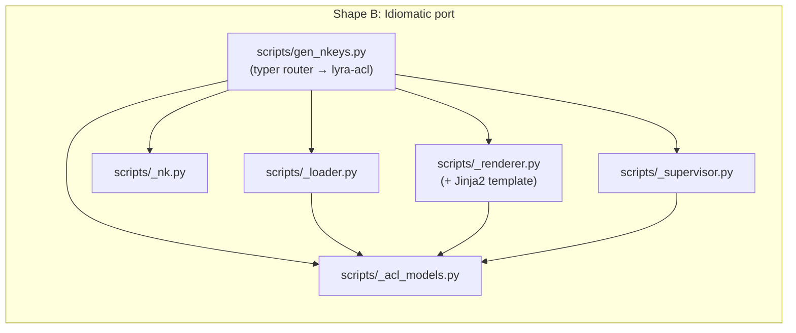
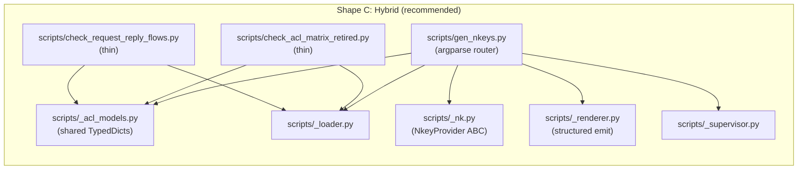

## Source

Issue #1017 — direct quote (problem statement):

> `deploy/nats/gen-nkeys.sh` has grown from a key-generation script
> into a full program responsible for: parsing `acl-matrix.json` (via
> `jq`), filtering retired identities, deriving inbox grants from
> `request_reply_flows`, validating identity existence, charset, and
> lifecycle fields, generating `auth.conf` (templating), calling `nk`
> CLI for key generation, emitting merged authconf, warning on retired
> seeds on disk. … Shellcheck (band-aid) would catch ~4/11. The root
> cause is **bash is the wrong language for ACL/identity logic**.

Triggering audit: 2026-05-01 code-quality sweep across PRs #975–#1013.
The "bash" recurring-bug-class was named in
`memory/project_recurring_bug_classes.md` based on that audit.

## Problem

`deploy/nats/gen-nkeys.sh` (702 LOC bash) sits on the critical path of
NATS authorization for the production hub-spoke. Of 11 distinct
safety bugs found, ~7 are jq-semantic or logic bugs that a typed
language would make impossible by construction:

- `jq //` coerces `false` → `true` (silent ACL regression, #993).
- `jq -r` returns the literal string `"null"` for absent fields.
- Missing identity-existence guard hard-crashes jq mid-render.
- `check_derived_output` never exercises the mutated path it claims
  to validate (test-discrimination failure).
- Bash `return` >255 truncates mod-256 (`check_flows` falsely passes
  on ≥256 failures).
- `2>/dev/null` swallows jq errors silently.
- No subject-charset allowlist before NATS subject interpolation.

The frame establishes the structural fix (typed Python with rule-level
unit tests). This analysis grounds the frame against the actual code,
surfaces the implementation shapes, and pins the open spec-level
decisions.

## Outcome

A Python port that:

- Exposes every existing operator-facing mode unchanged (table below).
- Renders `auth.conf` semantically equivalent to bash output for every
  fixture in `tests/scripts/fixtures/`, plus a real-NATS authorization
  e2e test required on every PR.
- Has a paired negative test for every validation/derivation rule,
  with the test failing if the guard is removed.
- Replaces all bash callers (Makefile, CI, runbook) atomically.
- Deletes the bash originals in the same PR.

## Appetite

F-full. Estimated effort: 3–5 working days (issue body retains the
two CI validators in scope per #1017's acceptance criteria).

- Port + module split + console-script wiring: ~1.5 days
- Unit tests + parity fixtures + falsification gate + real-NATS e2e: ~1.5 days
- CI / Makefile / runbook sweep + bash deletion: ~0.5 day
- Review + revisions: ~0.5–1 day

## Findings

### Mode catalog (full enumeration — frame missed three)

The frame enumerated `--regen-authconf`, `--emit-merged-authconf`,
`--show`, `--fix-perms`, `--regenerate`. The actual mode surface in
`gen-nkeys.sh:236–246`:

| Flag | Root? | Writes | Notes |
|------|-------|--------|-------|
| (no flag) | yes | seeds + `/etc/nats/nkeys/auth.conf` + **mirror to `~/.lyra/nkeys/auth.conf`** (`gen-nkeys.sh:681`) | Full provisioning; dual-write |
| `--show` | yes | reads `/etc/nats/nkeys/auth.conf` | root-owned 0640 |
| `--fix-perms` | yes | chown/chmod system + user paths | |
| `--template-only` | no | stdout | dummy pubkeys, T1.4 |
| `--regenerate` `[--yes]` | yes | atomic backup + wipe + regen | rotates keys |
| `--regen-authconf` | no | `~/.lyra/nkeys/auth.conf` | re-render, no rotation |
| `--validate-supervisor` | no | none (asserts deploy wiring) | reads `deploy/conf.d/` + `deploy/quadlet/` |
| `--emit-merged-authconf` | no | `~/.lyra/nkeys/auth.conf` (merged lyra+voicecli) | ADR-055 D4 |
| `--matrix <path>` | (combines) | — | JSON-path override |

Two-version JSON support (`gen-nkeys.sh:81`): `acl-matrix.json`
`version: "1"` or `"2"`. Both preserved in the port for parity, even
though prod is on `"2"` (`acl-matrix.json:1`).

`ensure_nk` (`gen-nkeys.sh:582–657`) — auto-downloads + SHA-256-verifies
the `nk` binary on first run if absent. **Decision: dropped** (see
Open Decisions §1). The Python port hard-fails with an install hint.
This side-steps #1007 (an active bug in the bash checksum path) and
removes a binary-download code path from the deploy script.

### Files impacted

**Source code (port):**

| Bash | Python | LOC bash | Role |
|---|---|---:|---|
| `deploy/nats/gen-nkeys.sh` | `scripts/gen_nkeys.py` + `scripts/_acl_models.py` + `scripts/_loader.py` + `scripts/_nk.py` + `scripts/_renderer.py` + `scripts/_supervisor.py` | 702 | core |
| `scripts/check-acl-matrix-retired.sh` | `scripts/check_acl_matrix_retired.py` | 33 | sibling validator |
| `scripts/check-request-reply-flows.sh` | `scripts/check_request_reply_flows.py` | 125 | sibling validator |

**Callers (sweep):**

- `Makefile:197` — `--emit-merged-authconf` (no sudo, correct)
- `Makefile:271` — `--regen-authconf` over SSH on prod (no sudo, fixed by `886f2a40`)
- `Makefile:331` — `nats-regen-authconf` target (no sudo, correct)
- `.github/workflows/ci.yml:70` — `check-acl-matrix-retired.sh`
- `.github/workflows/ci.yml:73` — `check-request-reply-flows.sh`
- `.pre-commit-config.yaml` — **no addition** (per DevOps: latency cost
  not worth it; CI-only is correct).
- `docs/ops/nats-identity-retirement.md:49,111` — stale `sudo`, drop.
- `docs/ops/nkey-rotation.md:63` — `sudo --show` (correct, `--show` reads `/etc/nats/`).
- `docs/ops/nkey-rotation.md:105` — stale `sudo`, drop.
- `pyproject.toml [project.scripts]` — add umbrella `lyra-acl` + 3 thin aliases.
- `deploy/quadlet/*.container` — no `gen-nkeys` references confirmed.

**Tests (new):**

- `tests/scripts/conftest.py` — `FakeNkeyProvider`, fixture matrices.
- `tests/scripts/test_loader.py` — `load_matrix` invariants + negatives.
- `tests/scripts/test_renderer.py` — every emit rule + golden parity.
- `tests/scripts/test_supervisor.py` — supervisor/quadlet wiring.
- `tests/scripts/test_check_acl_matrix_retired.py` — sibling validator.
- `tests/scripts/test_check_request_reply_flows.py` — sibling validator.
- `tests/scripts/test_parity_e2e.py` — real-NATS authorization gate
  (REQUIRED on every PR; uses CI-pinned `nats-server 2.10.22` binary
  per `ci.yml:29-41`, NOT a container).
- `tests/scripts/fixtures/*.json` — frozen `acl-matrix.json` variants.
- `tests/scripts/fixtures/*.golden.conf` — expected renderings.

### Internal complexity hotspots

`load_matrix` (`gen-nkeys.sh:58–145`) is the bug-magnet zone:
- 65+ lines of jq invocations.
- Per-identity per-field `has($f)` checks (would-be silent omissions).
- Hardcoded owner enum: `lyra | voicecli | imagecli | reserved` (line 89).
- `version` allowlist: `"1" | "2"` (line 81).
- Duplicate `(requester, responder)` pair check.
- Five output globals: `IDENTITIES[]`, `PUB_ALLOW`, `SUB_ALLOW`,
  `OWNER`, `ALLOW_RESPONSES`.

Python port → `_loader.py` returns a single `LoadedMatrix` TypedDict
(or frozen dataclass) bundling all five fields. Negative tests
mutate the *parsed model* (per the frame's falsification gate),
not the JSON file or the subprocess output.

`render_auth_conf` (`gen-nkeys.sh:263–284`, `emit_user`
`gen-nkeys.sh:176–192`) is bash heredoc emitting NATS HOCON-ish
(curly-brace blocks, no quotes around bareword keys, comments with `#`):

```bash
cat <<USER
    {
      nkey: "${pubkey}"
      # ${name}
      permissions: {
        publish:   { allow: [${PUB_ALLOW[$name]:-}] }
        subscribe: { allow: [${SUB_ALLOW[$name]:-}] }
        allow_responses: ${allow_resp}
      }
    }
USER
```

Python port renders via structured emit (Shape C — see Shapes).

`--validate-supervisor` (`gen-nkeys.sh:197–224`) is structurally *not*
key-generation — it asserts `deploy/quadlet/*.container` files wire
`NATS_NKEY_SEED_PATH` for every owner==lyra identity (`deploy/conf.d/lyra-*.conf`
was deleted in #1036; supervisord scaffolding retired). It only lives in
`gen-nkeys.sh` because it needs `IDENTITIES[]` from `load_matrix`. Shape C splits
it into its own module (`_supervisor.py`).

## Shapes

### Shape A — Minimal port

- **CLI:** `argparse` (stdlib).
- **Rendering:** f-string heredoc-style.
- **Parity:** hand-written NATS-conf parser → unit-test compares
  parsed structures against frozen golden fixtures. **No real-NATS
  test.**
- **Console scripts:** three flat entries — `lyra-genkeys`,
  `lyra-check-acl-retired`, `lyra-check-flows`.
- **Models:** per-script duplicate types.
- **`--validate-supervisor`:** stays inside `gen_nkeys.py`.
- **Files:** 4 — `_models`, `_nk`, `_renderer`, `gen_nkeys`.

**Trade-offs:**
- Pro: smallest diff; closest to current bash; zero new deps.
- Con: no real-NATS confidence — parity is parser-vs-parser.
- Con: types duplicated across files — drift risk.
- Con: `--validate-supervisor` is a deploy validator, not key-gen;
  keeping it in `gen_nkeys.py` perpetuates the conflation.

**Rough scope:** M

### Shape B — Idiomatic port

- **CLI:** `typer` (already a runtime dep).
- **Rendering:** Jinja2 template `auth.conf.j2`. (Jinja2 is **not** an
  existing dep — would add it.)
- **Parity:** parser **+** real-NATS e2e via container runtime.
- **Console scripts:** one umbrella `lyra-acl ...`; no aliases —
  command-line muscle memory changes.
- **Models:** shared `_acl_models.py`.
- **`--validate-supervisor`:** moves to `_supervisor.py`.
- **Files:** 6.



**Trade-offs:**
- Pro: end-to-end typed; rich parity gate.
- Con: largest delta; adds Jinja2 + container-runtime test infra.
- Con: typer in `scripts/` softens the no-import-from-lyra invariant.
- Con: subcommand-only UX rewrites runbooks.

**Rough scope:** L

### Shape C — Hybrid (recommended)

- **CLI:** `argparse` (stdlib — keep `scripts/` lean, no runtime-dep
  coupling).
- **Rendering:** structured emit — `_renderer.py` builds a typed
  intermediate (per-identity dicts) then a small `serialize()`
  function emits the HOCON-ish format. Pure-Python, no Jinja2.
- **Parity:** hand-written NATS-conf parser **+** real-NATS e2e using
  the **`nats-server` binary already pinned in CI**
  (`ci.yml:29–41`, version `2.10.22`, sha256-verified, installed at
  `/usr/local/bin/nats-server`). Test boots via
  `subprocess.Popen(["nats-server", "-c", <rendered>, "-ms", "8222"])`,
  polls `localhost:8222/healthz`, asserts publish/subscribe authorization
  per identity. **No container runtime needed** — ~200ms startup vs
  5–10s for podman/docker. **REQUIRED on every PR** (not opt-in,
  else parity gate is illusory).
- **Console scripts:** one umbrella `lyra-acl` with subcommands +
  three thin aliases (one per current bash filename) that just
  inject the subcommand string and delegate. Pyproject entries:

  ```toml
  [project.scripts]
  lyra-acl              = "scripts.gen_nkeys:main"
  lyra-genkeys          = "scripts.gen_nkeys:alias_genkeys"
  lyra-check-acl-retired = "scripts.gen_nkeys:alias_check_retired"
  lyra-check-flows      = "scripts.gen_nkeys:alias_check_flows"
  ```

  Aliases have no logic, no argparse — they `sys.argv.insert(1, "<sub>")`
  and call `main()`. Operator typing in the runbook stays
  bash-identical.
- **Models:** shared `scripts/_acl_models.py` reused by
  `gen_nkeys.py` + sibling validators.
- **`--validate-supervisor`:** lives in `scripts/_supervisor.py`,
  exposed via `lyra-acl validate-supervisor`.
- **Files:** 6 — `_acl_models`, `_loader`, `_nk`, `_renderer`,
  `_supervisor`, `gen_nkeys` (CLI router) + 2 sibling thin scripts.
- **`ensure_nk` dropped** — Python hard-fails with install hint if
  `nk` absent on `$PATH`. Removes ~75 LOC and a binary-download
  code path; side-steps #1007.
- **`sudo` invocation pattern (runbook + Makefile):** root-required
  modes use `sudo env "PATH=$PATH" lyra-acl <sub>` (or
  `lyra-acl <sub>`-with-sudoers-secure-path-fix). Default
  `sudo` strips `~/.local/bin` and `.venv/bin` via `secure_path`,
  silently failing the venv shim. Documented explicitly in
  spec + runbook.



**Trade-offs:**
- Pro: real-NATS authorization e2e gate (the strongest signal "Python
  port is safe to merge"); uses an already-pinned CI binary, zero new
  infra.
- Pro: shared models — no drift across executables.
- Pro: zero new deps.
- Pro: console-script aliases preserve operator muscle memory.
- Pro: `--validate-supervisor` lives in its own file; clean separation.
- Con: hand-written HOCON-ish parser is project-first work (~80 LOC).
- Con: structured-emit rendering is more code than f-strings, less
  expressive than Jinja2; sweet spot but deliberate.

**Rough scope:** M+

## Fit Check

Constraints from frame, mapped to shapes:

| Constraint | A | B | C |
|---|:-:|:-:|:-:|
| Drop-in CLI parity | ✓ | partial | ✓ via aliases |
| Semantic-equivalence parity | weak | strong | strong |
| `SUDO_USER` resolution | ✓ | ✓ | ✓ |
| TypedDict not Pydantic | ✓ | ✓ | ✓ |
| `NkeyProvider` ABC | ✓ | ✓ | ✓ |
| `scripts/` ↛ `src/lyra/` | ✓ | weak | ✓ |
| Falsification gate | ✓ | ✓ | ✓ |
| 300-line file cap | ✓ | ✓ | ✓ |
| No long-lived parallel paths | ✓ | ✓ | ✓ |
| No new deps | ✓ | ✗ | ✓ |
| Real-NATS authorization gate | ✗ | ✓ | ✓ |

**Recommended: Shape C.** Strongest parity gate (real-NATS e2e via
the CI-pinned `nats-server` binary), zero new deps, preserves operator
command lines via aliases. Shape A's parser-vs-parser parity does
not authorize anything; the bash-version frame demands semantic
equivalence which only a real-NATS test delivers. Shape B's typer +
Jinja2 + container runtime is project-first infra cost for marginal
gain over C.

## Open spec-level decisions (Shape C accepted)

1. **`acl-matrix.json` `version: "1"` support**: prod is on `"2"`
   today; keep `"1"` parsing for parity, or drop and assert no v1
   fixture is in active use? **Recommend keep for parity** (cost is
   ~10 LOC of conditional branch logic).
2. **HOCON-ish parser implementation**: write a 2-pass minimal
   recursive-descent parser (~80 LOC) targeting the exact subset
   bash emits, or a regex-based field extractor (smaller, less
   robust). **Recommend recursive-descent** — the parser is the
   parity gate's foundation; brittle here means false positives in
   tests.
3. **e2e fixture identity count**: real-NATS test boots once and
   asserts authorization for one identity per role-class (operator,
   adapter, worker, retired-must-be-absent), or per-identity? Trade
   test runtime vs coverage. **Recommend role-class** (4 assertions,
   ~3s total).
4. **Console-script alias names**: confirmed as
   `lyra-genkeys`, `lyra-check-acl-retired`, `lyra-check-flows` —
   one alias per current bash filename, exact-match operator typing.
   Umbrella is `lyra-acl`.

## Rollout sequence (within the same PR)

The frame's "no parallel paths" stance is preserved by ordering
commits, not by feature flags:

1. **Commit 1 — Land Python alongside bash.** New files in `scripts/`
   + new tests in `tests/scripts/`. Bash originals untouched. CI
   green proves the Python port works in isolation.
2. **Commit 2 — Wire the parity gate.** Add `test_parity_e2e.py`
   that boots `nats-server` against both bash- and Python-rendered
   `auth.conf` and asserts identical authorization outcomes. CI
   green proves semantic equivalence on the frozen fixture set.
3. **Commit 3 — Swap the callers.** `Makefile`, `ci.yml`, runbook
   docs (`nats-identity-retirement.md`, `nkey-rotation.md`),
   `pyproject.toml`. Stale-sudo cleanup folded into this commit
   (3 lines). CI green proves the swap doesn't regress.
4. **Commit 4 — Delete the bash originals.** `gen-nkeys.sh`,
   `check-acl-matrix-retired.sh`, `check-request-reply-flows.sh`.
   Drops the parity test from CI (it has done its job). One final
   green CI run proves nothing was forgotten.

This four-commit sequence gives a clean revert story: any commit can
be backed out independently up to the bash deletion. After Commit 4,
revert means re-applying bash from git history.

## Sequencing / dependencies

| Issue | Relationship | Action |
|---|---|---|
| #1007 (nk checksum bug in `ensure_nk`) | We dropped `ensure_nk` from the port → no inheritance. | None on this PR. **#1007 should be re-evaluated** — if `ensure_nk` is no longer reachable, can it be deleted in #1017's Commit 4 instead of fixed? Check with #1007 owner. |
| #1014 (narrow `$JS.API.>` grants) | Touches `acl-matrix.json` content, not script. | Independent — can run in parallel. |
| #955 (auto regen-authconf post-merge) | Depends on `lyra-acl regen-authconf` being a callable console script. | **Block #955 on #1017** — explicitly. |
| #1023 (enforce negative test per guard, repo-wide) | This PR is the reference implementation. | Land #1017 first or together. |
| #693 (Quadlet/autodeploy epic) | Quadlet container specs do not call `gen-nkeys.sh` directly (confirmed via `grep deploy/quadlet/`). | No conflict. |

## What gets retired

- Recurring-bug-class audit entry "bash"
  (`memory/project_recurring_bug_classes.md`) — fully retired by this
  PR (all three named bash scripts ported and deleted).
- #1007 may close as "obsolete" if `ensure_nk` deletion is accepted.
- #955 becomes unblocked.

## Risks (refined)

- **Real-NATS test flakiness.** `nats-server` startup race. Mitigation:
  poll `:8222/healthz` with timeout (~3s); treat startup failure as
  test infra error, not assertion failure.
- **`SUDO_USER` resolution silent regression.** `Path.home()` masking.
  Mitigation: explicit unit test with `os.environ` patched to simulate
  sudo invocation, asserting resolved seed dir is *not* `/root/.lyra/...`.
- **`sudo` PATH sanitization.** Default `secure_path` drops venv
  shim. Mitigation: runbook + Makefile use
  `sudo env "PATH=$PATH" lyra-acl <sub>` for root-required modes;
  spec documents this explicitly.
- **Owner enum drift.** Currently `lyra | voicecli | imagecli |
  reserved` in bash + JSON. Mitigation: centralize as `Literal`
  alias in `_acl_models.py`; drift becomes a pyright error.
- **HOCON-ish parser correctness.** Project-first parser for a
  format that is "JSON-ish but not". Mitigation: fixture set covers
  every observed syntactic shape; recursive-descent shape (per
  Decision #2) prevents regex brittleness.
- **`ensure_nk` removal regression on fresh boxes.** A new operator
  setting up from scratch must install `nk` manually. Mitigation:
  `_nk.py` raises with an exact-paste install command; runbook /
  GETTING-STARTED.md gets a one-line update.
