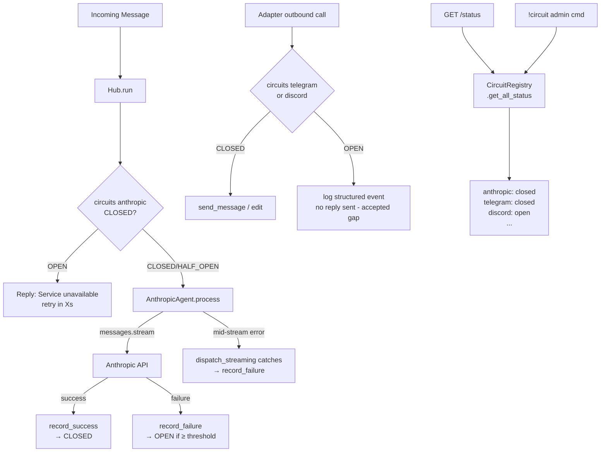

## Source

> Issue #104: When Anthropic API fails (rate limit, 503, timeout), Lyra has no recovery mechanism. Errors cascade to all users. No backoff or retry logic. No user-facing feedback about service state.
>
> User expansion (2026-03-09): "I think we should also have a circuit breaker for the hub or for Telegram and Discord. Each of our services should have a circuit breaker with a status that we can check."

## Problem

Lyra currently has no resilience layer for external service failures:

- **Anthropic API**: `AnthropicAgent.process()` catches all exceptions with a broad `except Exception` and logs — but never opens a circuit. A rate limit storm causes every incoming message to hit the API and fail.
- **Telegram Bot API**: `TelegramAdapter` makes outbound calls via aiogram (send message, edit message). If Telegram's API degrades, messages silently fail. Users see no feedback; the hub keeps dispatching.
- **Discord API**: Same pattern — outbound discord.py calls in `DiscordAdapter` have no resilience.
- **Status visibility**: No `/status` endpoint, no admin command, no observability into which services are healthy.

The hub's bounded queue (size=100) provides backpressure but is not circuit-aware — it cannot stop accepting messages when downstream services are all failing.

## Outcome

A service-level circuit breaker system where:

- Each service (Anthropic, Telegram, Discord, Hub) has its own named `CircuitBreaker` instance held in a `CircuitRegistry` injected into the Hub and adapters
- Consecutive failures open a circuit → new calls fail fast; the user receives: *"Service unavailable — try again in 42s"* (where `42s = recovery_timeout − elapsed_since_opened`)
- HALF_OPEN state allows exactly **one** probe call (guarded by an `asyncio.Lock`); success closes the circuit, failure resets the open timer
- Mid-stream failures (e.g. Anthropic 503 mid-token-stream) count as circuit failures — caught in `dispatch_streaming()` error handler
- When an outbound adapter circuit (Telegram/Discord) is OPEN, the Hub logs a structured event; no reply is sent (no fallback channel — accepted gap for MVP)
- Admin command `!circuit` (admin-only users) returns current state of all circuits in chat
- `GET /status` (unauthenticated, internal network only) returns JSON health of all circuits
- Config-driven per service via a global `[circuit_breaker.<name>]` TOML section (separate from agent config), read at startup
- Full async-native, no blocking; all state transitions unit-tested

## Appetite

1–2 week cycle. Generic `CircuitBreaker` class is reusable; 3 integration points are well-defined.

## Shapes

### Shape 1: Targeted LLM-only circuit breaker

A single `LLMCircuitBreaker` in `core/llm_circuit.py` wrapping only the Anthropic API path.

**Trade-offs:**
- Pro: Minimal scope, exactly what issue #104 requested
- Con: Adapter failures still cascade silently
- Con: Non-reusable — adapter CBs need a second implementation later

**Rough scope:** M

---

### Shape 2: Generic circuit breaker + per-service instances (Recommended)

A single `CircuitBreaker` class in `core/circuit_breaker.py`. `CircuitRegistry` holds named instances injected into `Hub.__init__`. Each service gets its own CB:

- `circuits["anthropic"]` — checked by Hub **before** calling `agent.process()` (Option B — see Wrapping note)
- `circuits["telegram"]` — wraps outbound `send()` / `send_streaming()` in `TelegramAdapter`
- `circuits["discord"]` — wraps outbound `send()` / `send_streaming()` in `DiscordAdapter`
- `circuits["hub"]` — tracks consecutive message processing failures in `Hub.run()`; when OPEN, adapters reject incoming messages before enqueuing (Telegram returns HTTP 503 from webhook; Discord drops at the gateway event handler)



**Config (global `config/circuits.toml` or `lyra.toml` `[circuit_breaker]` section):**
```toml
[circuit_breaker.anthropic]
failure_threshold = 3
recovery_timeout = 60   # seconds before HALF_OPEN probe

[circuit_breaker.telegram]
failure_threshold = 5
recovery_timeout = 30

[circuit_breaker.discord]
failure_threshold = 5
recovery_timeout = 30

[circuit_breaker.hub]
failure_threshold = 10  # consecutive message processing failures
recovery_timeout = 60
```

**Trade-offs:**
- Pro: Single reusable class — no duplication across services
- Pro: Unified status covers all external services
- Pro: Config-driven per service
- Con: ~8 files touched; adapter integration requires careful handling of existing broad-except

**Rough scope:** M-L

---

### Shape 3: Hub-aware circuit broker with backpressure

Extends Shape 2 — Hub stops consuming from the queue when all circuits are open (true backpressure).

**Trade-offs:**
- Pro: Avoids queue exhaustion under total outage
- Con: Significant hub changes, regression risk; the 100-slot bounded bus already provides natural backpressure
- Con: Over-engineered for current scale

**Rough scope:** L-XL

---

## Fit Check

**Eliminated:** Shape 3 — backpressure via the bounded bus is sufficient; hub changes add regression risk.

**Recommended: Shape 2** — Generic `CircuitBreaker` + `CircuitRegistry` injected into Hub.

### Key implementation decisions

**Wrapping the async streaming call (Option B chosen):**
`AnthropicAgent.process()` is an async generator (`yield` inside). The Hub receives an `AsyncIterator` — it does not directly call `messages.stream()`. Two options:
- Option A: CB guards `async with ... as stream:` *inside* `AnthropicAgent.process()`. Requires narrowing the existing broad `except Exception` (line ~144) to exclude `CircuitOpenError`, otherwise the CB signal is swallowed.
- **Option B (chosen):** Hub checks `registry["anthropic"].is_open()` *before* calling `agent.process()`. On OPEN: skip agent, send fast-fail reply immediately. On failure from `dispatch_streaming()`: call `registry["anthropic"].record_failure()`. Cleaner decoupling — no CM wrapping, no generator exception threading.

**Mid-stream failures:** `dispatch_streaming()` in `hub.py` catches exceptions from the streaming iterator. This handler will call `registry["anthropic"].record_failure()` — mid-stream errors count as circuit failures.

**HALF_OPEN concurrency:** `CircuitBreaker` holds an `asyncio.Lock` for the probe slot. First call through acquires the lock and probes; concurrent calls in HALF_OPEN state are rejected (fast-fail) until the probe resolves.

**Broad-except in adapters:** Both `TelegramAdapter.send_streaming()` and `DiscordAdapter.send_streaming()` have broad `except Exception` blocks that absorb errors. The CB integration must either wrap at a higher level (before the try/except) or narrow the existing handlers to re-raise after recording failures.

**CB config placement:** A global `[circuit_breaker]` TOML section — not inside agent TOML — because circuits span all agents and adapters. Read at startup in `__main__.py` alongside other global config.

**`/status` endpoint location:** Added to `TelegramAdapter`'s FastAPI app (it already owns the `app` instance). Route: `GET /status` → `{"services": {"anthropic": "closed", "telegram": "closed", "discord": "open"}, "timestamp": "..."}`. No auth — assumed internal network only.

**`!circuit` admin command:** Registered in `CommandRouter` with an admin guard (check user against an admin allowlist in config). Returns a formatted table of all circuit states.

**Files impacted:**

| File | Change |
|------|--------|
| `src/lyra/core/circuit_breaker.py` | **New** — `CircuitBreaker`, `CircuitRegistry`, `CircuitOpenError`, `CircuitState` enum |
| `src/lyra/core/hub.py` | Inject `CircuitRegistry`; check `circuits["anthropic"]` before `agent.process()`; `record_failure()` in error handlers; track processing failures for `circuits["hub"]` |
| `src/lyra/agents/anthropic_agent.py` | Narrow existing broad `except Exception` to exclude `CircuitOpenError`; no CB logic here (Option B) |
| `src/lyra/adapters/telegram.py` | Check `circuits["hub"]` before `bus.put()` (return HTTP 503 if OPEN); wrap outbound `send()` / `send_streaming()` in `circuits["telegram"]`; add `GET /status` route |
| `src/lyra/adapters/discord.py` | Check `circuits["hub"]` before enqueuing; wrap outbound `send()` / `send_streaming()` in `circuits["discord"]` |
| `src/lyra/core/command_router.py` | Register `!circuit` admin command |
| `src/lyra/__main__.py` | Load `[circuit_breaker]` config; build `CircuitRegistry`; inject into Hub and adapters |
| `tests/test_circuit_breaker.py` | **New** — state transition tests (CLOSED→OPEN→HALF_OPEN→CLOSED/OPEN), HALF_OPEN concurrency, mid-stream failure, hub circuit |
