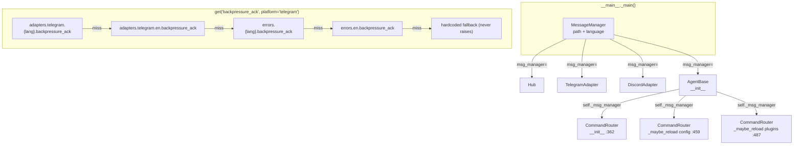

## Source

Issue #105 (Epic #101 — Phase 0 Bot core parity):
> "User-facing strings are hardcoded across 4 files: `telegram.py`, `discord.py`, `message.py`, `command_router.py`. No i18n, no per-adapter formatting, no way to change messages without code changes."

## Problem

Lyra has no centralized message registry. User-facing strings live directly in source code across multiple files — duplicated between adapters, impossible to translate without code changes, and prone to drift as the adapter count grows.

**Full inventory of hardcoded strings found in codebase:**

| String | File | Line | Context |
|--------|------|------|---------|
| `"Processing your request…"` | `adapters/telegram.py` | 243 | Backpressure ack (bus full) |
| `"…"` (placeholder) | `adapters/telegram.py` | 317 | Streaming placeholder |
| `" [response interrupted]"` | `adapters/telegram.py` | 347 | Stream error append |
| `GENERIC_ERROR_REPLY` (via import) | `adapters/telegram.py` | 349 | Stream fallback |
| `"Processing your request…"` | `adapters/discord.py` | 186 | Backpressure ack (bus full) |
| `"…"` (placeholder) | `adapters/discord.py` | 272, 276 | Streaming placeholder |
| `" [response interrupted]"` | `adapters/discord.py` | 297 | Stream error append |
| `GENERIC_ERROR_REPLY` (via import) | `adapters/discord.py` | 299 | Stream fallback |
| `GENERIC_ERROR_REPLY = "Something went wrong…"` | `core/message.py` | 11 | Module-level constant |
| `"Unknown command: {command_name}. Type /help…"` | `core/command_router.py` | 116–118 | Unknown command reply |
| `"Available commands:"` | `core/command_router.py` | 133 | Help header |
| `"Lyra is currently unavailable. Please try again in {retry_secs}s."` | `core/hub.py` | 300–302 | Circuit open reply |
| `GENERIC_ERROR_REPLY` (3× via import) | `core/hub.py` | 278, 341, 368 | Agent/dispatch errors |

**Key discovery:** `GENERIC_ERROR_REPLY` is a module-level export from `core/message.py` imported by `hub.py`, `telegram.py`, and `discord.py`. Removing it is a public API break; migration requires keeping it as an alias.

**Key discovery:** `tomllib` is already imported in `__main__.py` — zero new dependencies required.

**Key discovery (hot-reload risk):** `CommandRouter` is constructed in three places inside `AgentBase` — `__init__` (line 362), `_maybe_reload()` on config change (line 459), and `_maybe_reload()` on plugin hot-reload (line 487). Any injection approach that does not thread `msg_manager` through `AgentBase` will silently lose it on every hot-reload.

## Outcome

Translators can add a new language by editing a TOML file — no Python changes required. Adapters produce platform-appropriate phrasing (e.g., Telegram uses edit-in-place placeholders while Discord uses replies). The active language is set per-agent in TOML and takes effect on next startup. All user-facing strings are covered for EN and FR. Existing tests continue to pass without modification.

Sample TOML structure (what contributors will edit):

```toml
# src/lyra/config/messages.toml

[errors.en]
generic           = "Something went wrong. Please try again."
unknown_command   = "Unknown command: {command_name}. Type /help for available commands."
unavailable       = "Lyra is currently unavailable. Please try again in {retry_secs}s."

[errors.fr]
generic           = "Une erreur s'est produite. Réessaie."
unknown_command   = "Commande inconnue : {command_name}. Tape /help."
unavailable       = "Lyra est indisponible. Réessaie dans {retry_secs}s."

[adapters.telegram.en]
backpressure_ack  = "Processing your request…"
stream_placeholder = "…"
stream_interrupted = " [response interrupted]"

[adapters.telegram.fr]
backpressure_ack  = "Traitement de ta requête…"
stream_placeholder = "…"
stream_interrupted = " [réponse interrompue]"

[adapters.discord.en]
backpressure_ack  = "Processing your request…"
stream_placeholder = "…"
stream_interrupted = " [response interrupted]"

[adapters.discord.fr]
backpressure_ack  = "Traitement de ta requête…"
stream_placeholder = "…"
stream_interrupted = " [réponse interrompue]"
```

Key resolution order (normative):
1. `adapters.{platform}.{lang}.{key}` — platform + language match
2. `adapters.{platform}.en.{key}` — platform match, EN fallback
3. `errors.{lang}.{key}` — global key for language
4. `errors.en.{key}` — global key, EN fallback
5. Hardcoded English literal (compile-time constant) — final safety net

## Appetite

1-week cycle (Phase 0 task, well-bounded scope).

---

## Shapes

### Shape 1: Constructor injection via AgentBase — follows `circuit_registry` pattern exactly

Create `src/lyra/core/messages.py` with `MessageManager`. Load once in `__main__._main()`, inject into `AgentBase`, `Hub`, and both adapters as optional `msg_manager: MessageManager | None = None` — identical to how `circuit_registry` is injected today.

**CommandRouter wiring commitment (required by hot-reload):** `CommandRouter` is rebuilt by `AgentBase._maybe_reload()` at lines 459 and 487 — once on config change, once on plugin hot-reload. Wiring `msg_manager` only in `__main__` would silently lose it on every reload. The only safe path: add `msg_manager` to `AgentBase.__init__`, store as `self._msg_manager`, and forward to all three `CommandRouter(...)` call sites inside `agent.py`. This is a 4-line change to `agent.py`.

**Hub exception handler safety:** Hub's three `GENERIC_ERROR_REPLY` usages (lines 278, 341, 368) are all inside `except` blocks. Calling `msg_manager.get()` there introduces a new failure surface. Implementation must guarantee `get()` is no-raise: wrap in `try/except` with hardcoded fallback, or pre-validate TOML keys at startup.

```python
# core/messages.py
class MessageManager:
    def __init__(self, path: str | Path, language: str = "en") -> None:
        with open(path, "rb") as f:
            self._templates = tomllib.load(f)
        self.language = language

    def get(self, key: str, platform: str | None = None, **kwargs: str) -> str:
        """Never raises — returns hardcoded English fallback on any error."""
        try:
            # Resolution: platform+lang → platform+en → global+lang → global+en → fallback
            ...
        except Exception:
            return _HARDCODED_FALLBACKS.get(key, "")
```

```python
# __main__._main() — new lines
msg_manager = MessageManager(_resolve_messages_path(), language=...)
agent = _create_agent(agent_config, cli_pool, ..., msg_manager=msg_manager)
tg_adapter = TelegramAdapter(..., msg_manager=msg_manager)
dc_adapter = DiscordAdapter(..., msg_manager=msg_manager)
hub = Hub(..., msg_manager=msg_manager)
```

**`messages.toml` load resolution (normative, follows `_load_circuit_config` pattern):**
1. `LYRA_MESSAGES_CONFIG` env var
2. `messages.toml` alongside `lyra.toml` in cwd
3. Bundled `src/lyra/config/messages.toml`

**Trade-offs:**
- Pro: Identical injection pattern to `circuit_registry` — no new patterns.
- Pro: `| None` fallback → all 19 existing tests pass unchanged.
- Pro: Hot-reload safe when threaded through `AgentBase` (4 lines in `agent.py`).
- Pro: `get()` is no-raise by design → exception handlers in Hub remain safe.
- Con: 6 constructors updated (Hub, TelegramAdapter, DiscordAdapter, CommandRouter, AgentBase, concrete agents).
- Con: `GENERIC_ERROR_REPLY` stays as alias in `message.py` until follow-up removal.

**Rough scope:** M

---

### Shape 2: Hub-owned MessageManager (adapter access via `self._hub`)

Hub holds `self.messages: MessageManager | None`. Adapters already hold `self._hub` — they read messages via `self._hub.messages.get(...)`. CommandRouter has no Hub reference, so it still needs direct injection or a Hub ref added.

**Trade-offs:**
- Pro: Only Hub and CommandRouter constructors change (adapters get it for free).
- Con: CommandRouter wiring asymmetry — adapters use Hub, CommandRouter needs a direct param. Not a clean pattern.
- Con: Hub-as-message-service conflates bus routing with string presentation.
- Con: `AgentBase` hot-reload problem is identical — `msg_manager` must still thread through AgentBase; only 2 of the 5 constructors are simplified.

**Rough scope:** S (fewer constructor changes vs. Shape 1, but the hot-reload fix is identical in both)

---

### Shape 3: Module-level singleton

A global `lyra.core.messages.init(path, language)` called at startup. All modules import and call `lyra.core.messages.get(...)`.

**Trade-offs:**
- Pro: Zero constructor changes anywhere.
- Con: Global mutable state breaks test isolation.
- Con: Contradicts Lyra's established DI discipline throughout the codebase.
- Con: Import-time side effects complicate module loading order.

**Rough scope:** S (fewer lines, but carries hidden test-isolation cost)

---

## Fit Check



**Shape 1 wins:**

1. **Pattern consistency** — matches `circuit_registry` injection exactly; contributors know this pattern.
2. **Hot-reload safe** — threading through `AgentBase` covers all three `CommandRouter` build sites. Option (b) "wire in `__main__`" is eliminated because it misses lines 459 and 487 in `agent.py` — a silent bug on every reload.
3. **Exception-handler safe** — `get()` is no-raise by design; Hub exception handlers remain correct.
4. **Shape 2 eliminated** — asymmetric wiring (adapters via Hub, CommandRouter direct) is a design smell. The hot-reload fix cost is identical to Shape 1.
5. **Shape 3 eliminated** — global state contradicts DI discipline; test isolation cost is unacceptable.

**`GENERIC_ERROR_REPLY` disposition:** Keep as a string-literal alias in `message.py` (`GENERIC_ERROR_REPLY = "Something went wrong. Please try again."`) until a follow-up issue removes it. Create that follow-up issue at implementation time so it does not get lost.

### Files impacted

| File | Change | Notes |
|------|--------|-------|
| `src/lyra/config/messages.toml` | **NEW** | EN + FR templates |
| `src/lyra/core/messages.py` | **NEW** | `MessageManager` class; no-raise `get()` |
| `src/lyra/core/agent.py` | Update | Add `msg_manager` param; store + forward to 3 CR sites |
| `src/lyra/core/hub.py` | Update | Add `msg_manager` param; replace 3 usages (all in except blocks) |
| `src/lyra/core/command_router.py` | Update | Add `msg_manager` param; replace 3 usages |
| `src/lyra/adapters/telegram.py` | Update | Add `msg_manager` param; replace 3 usages |
| `src/lyra/adapters/discord.py` | Update | Add `msg_manager` param; replace 3 usages |
| `src/lyra/__main__.py` | Update | Load + inject `MessageManager` at startup |
| `src/lyra/core/message.py` | Keep as-is | Retain `GENERIC_ERROR_REPLY` alias (backward compat) until follow-up |
| `tests/core/test_messages.py` | **NEW** | Template loading + key resolution + substitution tests |
