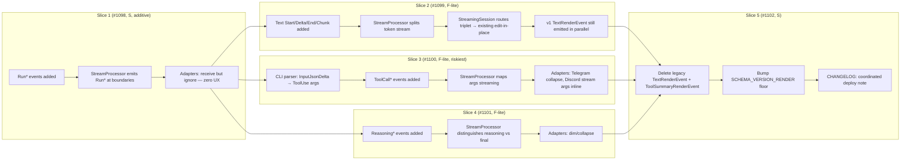

## Source

Frame #1096 — back-port 4 AG-UI modeling improvements (Run lifecycle, Text triplet, ToolCall split, Reasoning typed) into Lyra's internal `RenderEvent` hierarchy. Triggered by AG-UI protocol comparison: AG-UI's event taxonomy (~20 events) is structurally richer than Lyra's 2-event hierarchy on four dimensions where Lyra's modeling is information-poor.

## Problem

Lyra's `RenderEvent` hierarchy in `src/lyra/core/messaging/render_events.py` ships two types:

```python
TextRenderEvent(text, is_final, is_error)             # V1: NOT streamed; accumulated, emitted once at turn end
ToolSummaryRenderEvent(files, bash_commands, ...)     # post-hoc snapshot, throttled mid-turn + final
```

Concrete information loss observed in code:

| Surface | Today | Loss |
|---|---|---|
| `TextRenderEvent` | single-shot at `is_final=True`; intermediate `is_final=False` flushed only when `show_intermediate=true` and pre-tool text exists | ¬message_id correlation, ¬start/end brackets, ¬role declaration, adapters can't pre-allocate UI containers |
| `ToolSummaryRenderEvent` | accumulated across all tool calls into one bucketed snapshot (`files`, `bash_commands`, `web_fetches`, `agent_calls`, `silent_counts`) | ¬per-call args streaming, ¬per-call result, ¬tool_call_id, args fully discarded by current parser |
| `LlmEvent.ToolUseLlmEvent` | `input: dict` field exists but `events.py:42-44` comment confirms: "input is empty at ContentBlockStart time; full input dict is populated via InputJsonDelta events but **V1 only tracks tool name/id**" | args never reach StreamProcessor → can't render args to user |
| Run lifecycle | implicit — turn = inbound→pool→outbound, `trace_id` from TraceMiddleware | ¬explicit boundaries on bus, ¬error-event distinct from final-text-with-is_error, ¬step decomposition |
| Reasoning | streaming path: pre-tool text routed via `TextRenderEvent(is_final=False)` (`stream_processor.py:182-185`); non-streaming path: `on_intermediate` callback dispatches `⏳`-prefixed text turns (per ARCHITECTURE.md) | reasoning conflated with assistant output, adapters cannot suppress/dim/reformat selectively |

## Outcome

Internal `RenderEvent` model becomes as expressive as AG-UI's, **without** adopting AG-UI as a wire format:

- New events: `RunStarted/Finished/Error`, `Text{Start,Delta,End,Chunk}`, `ToolCall{Start,Args,End,Result}`, `Reasoning{Start,Delta,End}`. ~12 new types added to `core/messaging/render_events.py`.
- StreamProcessor emits the new richer stream; LlmEvent layer extends to surface tool args via `InputJsonDelta` parsing.
- Adapters (Telegram, Discord) maintain user-visible parity through migration (collapse new events back to existing edit-in-place algorithm where rich rendering is not yet justified).
- Future AG-UI HTTP/SSE adapter (separate epic) maps internal events 1:1 to AG-UI wire events at the edge.
- Schema bumps coordinated across slices; floor raised in Slice 5 with deprecated v1 paths removed.

Success ¬prescribes adapter UX changes — gates on event surface richness only.

## Appetite

Per frame: F-full epic split into 5 child slices (#1098–#1102) + 1 ADR (#1097). Each slice F-lite or smaller. Total wall time ~2–3 weeks of incremental shipping with merge gates after each slice.

## Existing code surfaces (impact map)

| File | Lines (today) | Slice touching | Nature of change |
|---|---|---|---|
| `src/lyra/core/messaging/render_events.py` | 117 | 1, 2, 3, 4, 5 | Add ~12 new event dataclasses; 2 new `SCHEMA_VERSION_*` constants per slice; deprecate/remove v1 in Slice 5 |
| `src/lyra/core/messaging/events.py` | 81 | 3 | Extend `ToolUseLlmEvent` (args streaming) or add `ToolUseDeltaLlmEvent` |
| `src/lyra/core/processors/stream_processor.py` | 308 | 1, 2, 3, 4, 5 | Cross-cutting refactor: emit Run lifecycle, split text into triplet, route ToolCall events, distinguish reasoning from final text |
| `src/lyra/core/cli/cli_streaming_parser.py` | unread (read in Slice 3 analysis) | 3 | **Unknown** — must parse `InputJsonDelta` events from Claude CLI NDJSON → emit ToolUse args deltas |
| `src/lyra/llm/drivers/cli.py` | 86 | 3 | Update `stream()` contract if ToolUseLlmEvent shape changes |
| `src/lyra/adapters/shared/_shared_streaming_emitter.py` | unread | 1, 2, 3, 4 | `StreamingSession` consumes new event triplet — collapse to existing edit-in-place where rich rendering not implemented |
| `src/lyra/adapters/shared/_base_outbound.py` | unread | 1, 2, 3, 4 | `OutboundAdapterBase` event dispatch surface |
| `src/lyra/adapters/telegram/telegram_outbound.py` | unread | 1, 2, 3, 4 | Consume new events; render parity with v1 |
| `src/lyra/adapters/discord/discord_outbound.py` | unread | 1, 2, 3, 4 | Consume new events; richer rendering optional |
| `src/lyra/adapters/clipool/*` | n/a | none direct | Worker side already only deals in LlmEvent — unchanged |
| `tests/core/messaging/*`, `tests/core/processors/*`, `tests/adapters/*` | n/a | all | Coverage extension per slice |

**Net file impact: ~10–12 files + tests across `core/messaging`, `core/processors`, `core/cli`, `llm/drivers`, `adapters/shared`, `adapters/telegram`, `adapters/discord`.**

## Critical unknowns

### U1 — CLI `InputJsonDelta` parsing (Slice 3 blocker)

**Claim:** Claude CLI emits `InputJsonDelta` events that stream tool-use args incrementally, similar to the SDK. (Reference: `events.py:42-44` comment + SDK behavior.)

**Status:** unverified in Lyra code path. `CliStreamingParser` in `core/cli/cli_streaming_parser.py` currently parses tool start (name+id) only — args dict stays empty. Whether the CLI subprocess actually outputs `input_json_delta`-style chunks in its NDJSON, and what their exact shape is, must be confirmed before Slice 3 is plannable.

**Confidence:** Low. Need to either (a) inspect a real CLI NDJSON capture from a tool-using session, or (b) read the parser + `cli_streaming.py` to see what events are silently dropped today.

**Resolution:** Slice 3 begins with a sub-analysis (`artifacts/analyses/1100-toolcall-cli-instrumentation.mdx`) that captures real NDJSON output and documents the delta shape. Optional spike via `EnterWorktree` if needed.

### U2 — Reasoning text vs final text discrimination (Slice 4)

**Claim:** Pre-first-tool-call text + inter-tool text = "reasoning"; post-last-tool-call text = "final answer".

**Status:** Heuristic. StreamProcessor today routes pre-tool text through `TextRenderEvent(is_final=False)` *only* when `show_intermediate=true`. Whether this maps cleanly onto Reasoning events depends on:

- Does Claude CLI emit explicit `thinking_delta` events (extended thinking) that we could trust as reasoning markers? Or do we have to keep using positional heuristics?
- For agents with `show_intermediate=false`, do we still produce Reasoning events (suppressed by default at adapter layer) or skip them entirely at the source?

**Resolution:** Slice 4 sub-analysis. Likely outcome: positional heuristic is sufficient + adapter suppression flag; extended thinking explicit support is Phase 2.

### U3 — Schema bump cadence and coexistence

**Claim:** Each slice that introduces a new wire event type bumps a `SCHEMA_VERSION_*` constant. v1 paths can coexist with v2 within a slice; final cleanup in Slice 5.

**Status:** Today, schema versions are per-event-type:

```python
SCHEMA_VERSION_TEXT_RENDER_EVENT = 1
SCHEMA_VERSION_TOOL_SUMMARY_RENDER_EVENT = 1
```

Adding new event types adds new constants. Existing constants stay at 1 unless their wire shape changes. So:

- Slice 1 (Run lifecycle): adds `SCHEMA_VERSION_RUN_*` constants. v1 events untouched. Additive only.
- Slice 2 (Text triplet): introduces `SCHEMA_VERSION_TEXT_*` for new triplet, keeps `SCHEMA_VERSION_TEXT_RENDER_EVENT=1` for the legacy single-shot. Coexistence period.
- Slice 3 (ToolCall split): introduces `SCHEMA_VERSION_TOOL_CALL_*`. Legacy `ToolSummaryRenderEvent` stays.
- Slice 4 (Reasoning): adds `SCHEMA_VERSION_REASONING_*`. Additive.
- Slice 5: deletes legacy types, no constants to bump (only the deprecated wire is removed).

**Confidence:** High. Pattern is per-event constant, additive within an envelope. Confirmed by reading `render_events.py:22-23`.

## Shapes

### Shape 1 — Big-bang internal refactor

Replace `TextRenderEvent` + `ToolSummaryRenderEvent` with the full v2 hierarchy in one PR. StreamProcessor + adapters refactored together. Single coordinated deploy.

**Pros:**
- Simpler mental model — no coexistence period
- No deprecated paths cluttering the codebase between slices

**Cons:**
- Massive blast radius (~12 files + tests in one PR)
- Hard to review — multiple architectural concerns conflated
- Single failure point — any unknown discovered late forces full rework
- ¬independent merge; the entire epic is one merge-or-revert unit
- Violates Lyra's epic culture (cf. ADR-032 which itself shipped as 5 phases)

**Rough scope:** XL

### Shape 2 — Slice-by-slice with v1/v2 coexistence (recommended)

Each child slice ships its new event types alongside v1 paths. StreamProcessor and adapters route both v1 and v2 events during the migration. v1 paths deprecated and removed in Slice 5 (cleanup + schema floor bump).

**Pros:**
- Each slice independently mergeable to staging — matches `/dev` pipeline + global-patterns Section 5
- Parity tests possible per slice (v1 output unchanged, v2 output validated)
- Low blast radius per merge (~2–3 files + tests)
- Slice 1 (Run lifecycle, S, additive only) acts as canary — risk-free first step
- Slice 3's CLI instrumentation unknown isolated to one slice
- Aligns with ADR-032's 5-phase rollout precedent
- Recurring-bug-class memory says "no falsification step in any gate" → small slices = small falsification surfaces

**Cons:**
- Temporary surface area inflation (v1 + v2 events visible in `render_events.py` for 2–3 weeks)
- Adapters may need a dispatch shim to route both event types — extra `isinstance` branches in `StreamingSession`
- Schema bump coordination across multiple deploys (one bump per slice that touches the wire)

**Rough scope:** L (epic) / S–M per slice

**Sketch:**



### Shape 3 — Pure additive (v1 stays forever)

Add v2 events on top of v1, never remove v1. Both emitted indefinitely.

**Pros:**
- Lowest risk — no deprecation, no schema floor bump, no coordinated deploy
- Adapters can opt in to v2 events when ready

**Cons:**
- Permanent dual-emission overhead (StreamProcessor emits both for every turn)
- No clean state — `render_events.py` accumulates dead types
- Future maintainers face two competing models with no migration signal
- Counter-cultural — ADR-032 chose Option A specifically to avoid this kind of bifurcation
- v1's information loss is preserved indefinitely — defeats the back-port

**Rough scope:** M (less code, but higher long-term debt)

## Fit Check

**Recommended: Shape 2.**

| Constraint (from frame) | Shape 1 | Shape 2 | Shape 3 |
|---|---|---|---|
| Each slice independently mergeable | ✗ — single PR | ✓ | ✓ |
| Vertical thin slices | ✗ | ✓ | ✗ — no cleanup |
| Schema-version coordination, loud-fail discipline | ✓ but big-bang | ✓ — per-event bumps | ✓ but never raise floor |
| Slice 3 CLI unknown isolated | ✗ — late discovery risk | ✓ — analyze-then-build | ✓ but unknown propagates |
| Adapter parity preserved | ✗ — risky | ✓ — coexistence buys parity | ✓ |
| Foundation-extending (ADR-032), not replacing | partial — replaces in one shot | ✓ — extends per slice | ✗ — stuck with v1 |
| Recurring-bug-class meta (small falsifiable steps) | ✗ | ✓ | partial |
| Cultural alignment (ADR-032 5-phase precedent) | ✗ | ✓ | ✗ |

Shape 1 is eliminated by review-ability + risk. Shape 3 is eliminated by the "no dead surface long-term" stance and because it preserves the information-loss problem that motivated the epic in the first place. Shape 2 is the only configuration where every constraint clears.

**Slice 1 specifically should run first as a near-zero-risk warm-up** — it adds Run lifecycle events that adapters can ignore. It validates the schema-bump + coordinated-deploy mechanics before Slice 2/3/4 take on real semantic work.

## Open questions for Spec phase

1. **Reasoning routing:** Pre-tool text (currently flushed as `TextRenderEvent(is_final=False)` when `show_intermediate=true`) → should StreamProcessor reroute to `ReasoningDelta` events instead, or should both be emitted (v1 + v2 coexistence)? The latter doubles the wire but keeps parity bulletproof.
2. **`message_id` correlation:** AG-UI's Text triplet uses a message_id to bracket Start/Delta/End. Lyra has `trace_id` per turn. Use trace_id as message_id, or mint a separate per-text-block id (allowing multiple text blocks per turn — which AG-UI supports)?
3. **`tool_call_id` correlation:** `ToolUseLlmEvent.tool_id` already exists — direct map. No new ids needed.
4. **`runId` vs `trace_id`:** runId = trace_id verbatim, or runId = synthesized UUID with trace_id as a free-form `metadata.trace_id`? Mapping affects observability tooling.
5. **Adapter dispatch shim:** During coexistence, does `StreamingSession` route v1 + v2 separately, or does it consume v2 and synthesize v1 internally for downstream that haven't migrated? (Probably the former — explicit routing is auditable.)
6. **Test parity strategy:** Should each slice include a "same input → same final user-visible output" test against a v1 baseline capture? Recommended yes — this is the falsification step the recurring-bug-class memory calls for.

## Unresolved concerns (carry-over)

- **Slice 3 sub-analysis is mandatory before implementation.** U1 must resolve before `/spec` on #1100. Recommend `/dev #1100` triggers its own `/analyze` cycle that captures a real CLI NDJSON sample.
- **Coordinated-deploy testing:** Lyra has no automated multi-process integration test that catches schema-mismatch failures across `lyra_hub` + `lyra_telegram` + `lyra_discord`. Today this is verified manually. Each slice's coexistence period mitigates the risk but does not eliminate it. Worth flagging in Slice 5 spec as a follow-on hardening item.
- **Expert review pending.** This analysis was authored without architect/doc-writer parallel review. Recommend at least one architect pass before `/spec` to validate the StreamProcessor refactor surface and the coexistence dispatch design.

## Recommendation

**Adopt Shape 2.** Proceed to `/spec --issue 1096` to draft acceptance criteria + breadboard the StreamProcessor coexistence dispatch + slice ordering contract. Begin slice-level work with `/dev #1097` (ADR) → `/dev #1098` (Slice 1, the canary).
