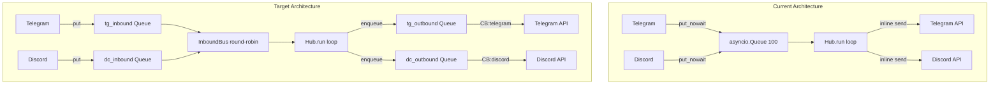

## Source

GitHub issue #112: "refactor(hub): conversation-scoped sessions + per-channel inbound/outbound queues + per-session Task"

## Problem

The Hub's architecture serializes all work per-user and shares a single inbound/outbound path across platforms:

1. **RoutingKey uses `user_id`** (hub.py:55-68) — pool key is `{platform}:{bot_id}:{user_id}`. Same user in multiple chats gets one pool, one lock, one history.
2. **Single `asyncio.Queue(100)` bus** (hub.py:94) — both adapters call `self._hub.bus.put_nowait(hub_msg)` (telegram.py:245, discord.py:190). Cross-channel flooding is unmitigated.
3. **Inline dispatch** (hub.py:235-264) — `dispatch_response`/`dispatch_streaming` call `adapter.send()` inline. Slow Telegram API blocks Discord responses.
4. **`asyncio.Lock` per pool** (pool.py:26-28, hub.py:370) — `async with pool.lock:` serializes entire user. No per-turn timeout, no cancellation.

## Outcome

1. Same user can have parallel conversations in different chats/threads with independent histories
2. Inbound flooding on one platform cannot starve another platform's inbound queue (per-channel backpressure)
3. Outbound delivery failure/slowness on one platform does not block responses for the other (independent outbound paths)
4. A stuck or slow turn can be cancelled (`/stop`) or timed out without freezing the user's next message
5. User gets a fresh conversation thread when @mentioning the bot in a Discord channel

## Appetite

1 cycle (~1 week). This is foundational infra — blocking #123, #83, #67.

## Shapes

### Shape 1: Full in-place refactor (issue design)

Implement all 5 sub-systems in one PR as specified in the issue:
1. `scope_id` replaces `user_id` in RoutingKey
2. `InboundBus` with per-platform queues + round-robin
3. `OutboundDispatcher` with per-platform outbound queues + circuit breakers
4. Per-session `asyncio.Task` replaces `asyncio.Lock`
5. Discord thread auto-creation on @mention

**Trade-offs:**
- Pro: Single coherent change, no intermediate inconsistent states
- Pro: Matches the issue design exactly — no design drift
- Con: Large PR (~15-20 files), harder to review
- Con: If one sub-system has issues, entire PR is blocked

**Rough scope:** L

### Shape 2: Phased delivery (3 sub-PRs)

Split into sequential PRs:
1. **PR A:** `scope_id` routing + scope extraction helpers (RoutingKey, resolve_binding, adapters, tests) — the smallest atomic unit
2. **PR B:** InboundBus + OutboundDispatcher (queue split, round-robin, circuit breaker wiring)
3. **PR C:** Per-session Task + Discord thread auto-creation

**Intermediate state after PR A (before PR B):** The system runs with scope_id-based pool keys but a single shared bus. This is a valid and stable state — it fully delivers outcome 1 (parallel conversations) while outcomes 2-3 (platform isolation) remain unaddressed. CI passes, no shims needed. Adapters still call `hub.bus.put_nowait()` and `dispatch_response()` still calls `adapter.send()` inline. The only observable difference is that pool_id format changes from user-scoped to conversation-scoped.

**Escalation trigger:** If PR B turns out to require modifying the same hub.py sections as PR A significantly (e.g. `run()` loop restructuring needed for both scope_id and InboundBus), collapse B into A retroactively.

**Trade-offs:**
- Pro: Each PR is reviewable (~5-7 files), merge-safe, independently testable
- Pro: PR A unblocks #123 immediately (stabilized RoutingKey with scope_id)
- Con: 3 review cycles, longer wall clock
- Con: Must maintain backward compat at each boundary

**Rough scope:** L (total), S-M per PR

### Shape 3: Scope-only (minimal viable change)

Only implement sub-system 1 (scope_id routing). Leave bus split, outbound queues, and Task replacement for a follow-up issue.

**Trade-offs:**
- Pro: Smallest blast radius, fastest to merge
- Pro: Solves the core problem (user=session conflation)
- Con: Does NOT solve cross-channel flooding or inline dispatch blocking
- Con: Defers 60% of the issue's acceptance criteria

**Rough scope:** M

## Architecture

### Concurrency model: Task replacement for Lock

Three options exist for replacing `asyncio.Lock` with `asyncio.Task`:

| Option | Serialization | Timeout | Cancellation | Pool changes |
|--------|--------------|---------|--------------|-------------|
| **A. Per-scope task + per-scope queue** | Pool gains an internal `asyncio.Queue`; a long-lived task per active scope consumes from it sequentially | `asyncio.wait_for` on each item | Cancel the scope task | Pool adds `_task` and `_inbox` fields |
| **B. Task-per-message, cancel prior** | Hub cancels in-flight task before creating new one | Implicit via cancellation | Natural | Pool adds `_current_task` field |
| **C. Task-per-message + lock preserved** | Lock inside the task | `asyncio.wait_for(pool.lock.acquire(), timeout)` | Cancel the task holding the lock | Minimal Pool changes |

**Recommended: Option A** (per-scope task with per-scope queue). It preserves sequential processing within a conversation (critical for history consistency), adds timeout via `asyncio.wait_for` on each dequeue-process cycle, and enables `/stop` by cancelling the scope task. Option B breaks history ordering. Option C adds timeout but doesn't improve the fundamental lock-per-user problem.

### InboundBus: round-robin pattern

`asyncio.wait` with `FIRST_COMPLETED` on bare `queue.get()` coroutines has cancellation leak issues (pending futures accumulate). The correct pattern is **per-platform feeder tasks**:

- One `asyncio.Task` per platform queue, each calling `await platform_queue.get()` in a loop and re-enqueuing to a single internal staging queue
- `Hub.run()` consumes from the staging queue (same single-consumer loop as today)
- Feeder tasks provide natural fairness: whichever platform has messages ready, its feeder enqueues first

This avoids the `asyncio.wait` pitfalls entirely and keeps `Hub.run()` as a simple single-queue consumer.

## Fit Check

**Shape 2 (phased delivery) is the best fit.**

Shape 1 risks a massive, hard-to-review PR that blocks on the slowest sub-system. Shape 3 leaves too many acceptance criteria unmet. Shape 2 gives incremental value: PR A alone unblocks #123 (which only needs stabilized RoutingKey/Pool), while PR B and C follow naturally.

However, the issue is designed as a single coherent unit and the user may prefer Shape 1 for simplicity. Both Shape 1 and 2 reach the same end state.

### Files impacted

| File | Change |
|------|--------|
| `src/lyra/core/hub.py` | RoutingKey.user_id → scope_id, InboundBus, OutboundDispatcher, run() refactor, _is_rate_limited key change |
| `src/lyra/core/pool.py` | Replace `_lock: asyncio.Lock` with per-scope Task + internal queue |
| `src/lyra/core/message.py` | scope extraction helpers on Message or PlatformContext |
| `src/lyra/adapters/telegram.py` | Use `inbound_bus.put()`, scope_id in normalize, thread-aware send |
| `src/lyra/adapters/discord.py` | Use `inbound_bus.put()`, scope_id in normalize, thread auto-creation |
| `src/lyra/__main__.py` | Wire InboundBus, OutboundDispatchers, update binding registration, health endpoint |
| `tests/core/test_hub.py` | Update all RoutingKey/pool_id fixtures, new tests for InboundBus/Outbound |
| `tests/adapters/test_telegram.py` | Update bus.put_nowait → inbound_bus.put |
| `tests/adapters/test_discord.py` | Update bus.put_nowait → inbound_bus.put |
| `tests/test_main.py` | Update binding wiring assertions |
| `tests/test_health_endpoint.py` | Update queue_size to aggregate per-platform depths |

### Key risks

1. **RoutingKey ripple** — `RoutingKey.user_id` is referenced in hub.py (resolve_binding, _is_rate_limited, run loop), both adapters, and ~15 test fixtures. Renaming to `scope_id` requires updating every reference. Mitigated by: RoutingKey is a NamedTuple, pyright will catch all misses.
2. **Rate-limiting key type change** — `_rate_timestamps` (hub.py:107) is `dict[RoutingKey, deque[float]]`. After scope_id change, the key must change to `(Platform, str, str)` tuple using `msg.user_id` (not scope_id), or a plain `str` key like `msg.user_id`. The type annotation and `_is_rate_limited` body both need updating — pyright will NOT catch the semantic error if the key type remains RoutingKey, since it would silently become scope-scoped.
3. **Pairing gate uses `msg.user_id`** — hub.py:303 calls `self._pairing_manager.is_paired(msg.user_id)`. This is correct and should NOT change. But the pairing gate also constructs a RoutingKey at hub.py:275 for logging — this must use scope_id after the change.
4. **`resolve_binding` wildcard line 176** — the wildcard path synthesizes `concrete_pool_id` via `RoutingKey(msg.platform, msg.bot_id, msg.user_id).to_pool_id()`. After refactor this MUST use scope_id, not user_id. Missing this silently preserves the entire user=session conflation for all wildcard-resolved users (which is every user in the current config).
5. **InboundBus round-robin fairness** — per-platform feeder tasks (see Architecture section) avoid `asyncio.wait` cancellation leak pitfalls. Getting this wrong silently starves one platform. Mitigated by: feeder-task pattern with single staging queue.
6. **Outbound circuit breakers already exist in adapter send()** — telegram.py:267-274, discord.py:213-220. Moving CB checks to OutboundDispatcher means removing them from adapter.send() to avoid double-checking.
7. **Pool identity change** — pool_id format changes from `telegram:main:tg:user:123` to `telegram:main:chat:98765`. Existing pools in memory are ephemeral (no persistence), so no migration needed.
8. **Health endpoint queue metric** — `__main__.py:174` exposes `hub.bus.qsize()`. After InboundBus, `hub.bus` no longer exists. The health endpoint must aggregate per-platform queue sizes or report a sum. This is a small but observable API contract change.
9. **Discord thread auto-creation is a UX decision** — creating a thread on @mention changes how users experience the bot (a thread appears they didn't request). This needs explicit product confirmation: default-on vs. opt-in (config toggle). The analysis flags the MANAGE_THREADS permission but the UX implication is the bigger question.
10. **Wildcard binding semantic change** — `resolve_binding` currently gives each user one pool. After scope_id change, each *conversation* gets a pool. A user switching chats gets a fresh history. This is intended behavior but is a silent change from the user's perspective — test coverage should verify this explicitly.
