## Source

> "Slice 5a of epic #1096. Coordinated v2-only cutover + codec hardening, kept
> together because both touch `render_event_codec.py` heavily. Split from #1102
> per 1190 codec consensus (2026-05-14, panel: architect/backend-dev/
> security-auditor, 3-0 high confidence). Sibling: #1191 (integration test,
> truly orthogonal)."
>
> — issue #1192 body

## Problem

Today the streaming render-event surface has two unfinished moves layered on
each other:

1. **v1 is still alive.** `stream_processor.py` dual-emits the v1
   `TextRenderEvent(is_final=False/True)` alongside the v2 triplet
   (`TextStart/Delta/End/Chunk`) at five sites (`stream_processor.py:266, 336,
   365, 395, 402`). Six runtime paths still call `isinstance(event,
   TextRenderEvent)` — three in adapters/shared, three in core. The legacy
   `ToolSummaryRenderEvent` carries a ~150-line accumulator class plus a
   27-reference `tool_recap_format.py` formatter and two adapter embed paths
   (telegram + discord). `SCHEMA_VERSION_RENDER` cannot advance while v1 is
   on the wire.

2. **The codec is fragile.** `NatsRenderEventCodec.encode()` and `.decode()`
   in `src/lyra/nats/render_event_codec.py` are 16 + 16 hand-written if-elif
   branches across 412 lines (file-length exemption is set to the current
   412, i.e. the file is at its own exemption ceiling and any further growth
   trips the gate). Adding a new
   `RenderEvent` subtype requires touching the codec twice and silently
   reaches runtime if either side is forgotten (Slice 2 of #1096 had exactly
   this regression — PR #1190 hotfix). `nats_stream_decoder.py:122` reads
   `chunk.get("event_type", "text")` — an unknown or absent event_type
   silently routes to the text decoder. PR #1190 codec panel
   (architect/backend-dev/security-auditor, 3-0) named this as the file's
   structural weak spot and deferred the fix here.

The two pieces of work touch the same hot file and the same dispatch loop, so
splitting them would (a) require rewriting `render_event_codec.py` twice with
near-certain merge conflict, (b) cut against the panel's explicit guidance to
land the registry pattern as the v2 cutover, not as a follow-up.

## Outcome

When this slice ships:

- `render_event_codec.py` dispatches encode + decode via a single
  `dict[Type[RenderEvent], CodecBranch]` registry, with one branch per
  surviving `RenderEvent` subtype. Adding a new subtype is a single
  registry insertion + a passing completeness test, not 32 if-elif lines.
- v1 `TextRenderEvent` and `ToolSummaryRenderEvent` are gone from `src/` and
  `tests/`. The dual-emit shim in `stream_processor.py` is gone. All six
  consumer paths read the v2 triplet directly.
- `SCHEMA_VERSION_RENDER` floor bump (per-class version constants) is on
  the wire; receivers on older versions loud-fail by design. Hub +
  telegram + discord deploy together via coordinated rollout.
- `nats_stream_decoder.py:122` no longer defaults to `"text"` — unknown
  or absent event types log a warning and break the stream cleanly.
- The `# pyright: ignore[reportUnreachable]` override on `assert_never` is
  removed (registry construction makes that branch unreachable by
  construction, not by hand-written exhaustion).
- `render_event_codec.py` drops under 300 LOC; its entry in
  `tools/file_exemptions.txt` is removed (no exempting the gate per
  memory `audit_exit_codes_in_gates`).
- #1177 closes: S2 (3 stream_processor tests rewritten to assert v2 triplet
  directly), S3 (adapter snapshot gates landed **before** the v1 removal
  commit), N6 (`test_all_exports_complete` switches to dynamic
  `typing.get_args(RenderEvent)`).
- ADR-032 has a `superseded` banner and CHANGELOG carries a coordinated-
  deploy entry (documentation artifacts — not observable system state, but
  acceptance criteria nonetheless).

## Appetite

**~1 week** (5–7 working days), single F-full slice. Sized by file count
(~25 touched files) + commit-order discipline (#1177 S3 must land snapshots
BEFORE v1 removal) + multi-process deploy coordination. No throwaway spike
needed — the registry pattern is mechanical; the panel's verdict on its
shape is already in `artifacts/analyses/1190-codec-review-findings-consensus.mdx`.

**Implementation constraints (from expert review):**

- **Single dedicated worktree, no parallel agents.** Per memory
  `pre_commit_ruff_contaminates_shared_worktree` and
  `parallel_fixers_need_isolated_worktrees`: ~25 files of edits across
  codec + hub + adapters + tests is exactly the failure surface where a
  parallel agent's `pre-commit ruff` reformats files staged by another
  agent and commits drift silently. Sequential commits inside one worktree.
- **Every commit must be CI-green.** Shape 2 was selected partly for this
  property; the spec must encode it as a gate (no `--no-verify`, no
  `--amend` to fix mid-commit breakage — fix forward with a new commit).

## Files impacted

| File | Change |
|------|--------|
| `src/lyra/nats/render_event_codec.py` | Full rewrite to registry; per-class try/except for decode; drop assert_never pyright-ignore |
| `src/lyra/adapters/nats/nats_stream_decoder.py:122` | `chunk.get("event_type", "text")` → explicit `None → log.warning + break` |
| `src/lyra/core/messaging/render_events.py` | Delete `TextRenderEvent`, `ToolSummaryRenderEvent` classes + their constants from `__all__` |
| `src/lyra/core/messaging/tool_recap_format.py` | **DELETE** |
| `src/lyra/core/messaging/__init__.py` | Drop v1 re-exports |
| `src/lyra/core/__init__.py` | Drop v1 re-exports |
| `src/lyra/core/processors/stream_processor.py` | Drop 4 dual-emit sites (`TextRenderEvent(is_final=…)` yields at lines 266, 336, 365, 395, 402) |
| `src/lyra/adapters/shared/_shared.py` | Drop `ToolSummaryRenderEvent` import + `format_tool_summary_header` helper |
| `src/lyra/adapters/shared/_shared_streaming_state.py` | Drop `TextRenderEvent` v1 path (line 43) + `on_final_text` v1 handler (line 150) |
| `src/lyra/adapters/shared/_shared_streaming_emitter.py` | Drop dual-emit `isinstance(event, TextRenderEvent)` branches (lines 188, 270) + `ToolSummaryRenderEvent` recap path (line 245) |
| `src/lyra/adapters/telegram/telegram_outbound.py` | Drop `_format_tool_summary` + `ToolSummary` edit_trace path |
| `src/lyra/adapters/discord/discord_outbound.py` | Drop `_build_tool_embed` + `ToolSummary` edit_trace path |
| `src/lyra/core/pool/pool_processor_streaming.py` | Switch `isinstance(event, TextRenderEvent)` capture to v2 triplet accumulator |
| `src/lyra/core/hub/outbound/outbound_tts.py` | Switch v1 skip-for-voice to v2 type check |
| `src/lyra/core/hub/outbound/outbound_streaming.py` | Switch v1 text dispatch to v2 (`TextEnd` or `TextChunk` as terminal hook) |
| `src/lyra/core/hub/hub_protocol.py:53` | Docstring v1→v2 reference |
| `tools/file_exemptions.txt` | Remove `render_event_codec.py` line |
| `tests/nats/test_render_event_codec.py` | Registry-completeness test; add per-class decode-error abort tests; drop v1 branch tests |
| `tests/core/test_stream_processor.py` | S2 — rewrite `test_text_only`, `test_single_edit`, `test_single_edit_no_intermediate` to assert v2 triplet (drop `strip_run_lifecycle`); drop `test_dual_emit_*` cases |
| `tests/core/test_render_events.py` | N6 — `test_all_exports_complete` reads from `typing.get_args(RenderEvent)` dynamically |
| `tests/adapters/test_telegram_snapshots.py` (new) | S3 — single-block / multi-block / error snapshot before v1 removal |
| `tests/adapters/test_discord_snapshots.py` (new) | S3 — same for discord |
| `tests/adapters/test_shared.py` | Drop `test_drain_fallback_v1_and_v2_both_contribute_in_dual_emit` |
| `tests/adapters/test_streaming_emitter_toolcall_v2.py` | Drop v1 dual-emit assertions; keep v2 ToolCall test |
| `docs/architecture/adr/032-*.mdx` | `status: superseded` banner pointing to epic #1096 ADR |
| `CHANGELOG.md` | Coordinated-deploy entry (hub + telegram + discord must roll together) |

## Shapes

The structural choices are tightly constrained (both pieces of work rewrite the
same file). The real architectural debate is about commit ordering inside the
PR. Three shapes considered:

### Shape 1: cutover-first, hardening-last

Sequence:
1. Adapter snapshot tests + N6 dynamic exports test (test plumbing)
2. v1 consumers migrated to v2 (`stream_processor` dual-emit dropped, six
   consumer paths switched, telegram/discord `ToolSummary` removed)
3. v1 classes deleted (`TextRenderEvent`, `ToolSummaryRenderEvent`,
   `tool_recap_format.py`); `SCHEMA_VERSION_RENDER` floor bumped
4. `render_event_codec.py` rewritten to registry + decode try/except +
   `nats_stream_decoder.py:122` fix + drop exemption

**Trade-offs:**
- Pro: each commit is one cohesive concern (test, migration, deletion, refactor)
- Pro: the registry refactor sees only the v2 surface — no temporary v1 registry entries
- Con: `render_event_codec.py` is touched **twice** — first to delete the v1 branches in commit 3, then to restructure in commit 4. Two cache-busting touches on a hot file. The Slice 2 incident (PR #1190 prod) was exactly a codec touch that missed an exhaustiveness branch; doubling the touch count doubles the risk window.
- Con: between commit 3 and commit 4 the codec is in a half-shaped state (v2-only but still if-elif). Bisection inside that window is awkward.

**Rough scope:** L

### Shape 2: hardening-first, cutover-last  ← recommended

Sequence:
1. Adapter snapshot tests (#1177 S3) + N6 dynamic exports test — landed
   **first**, while v1 is still emitting, so the snapshots capture the
   pre-removal baseline
2. `render_event_codec.py` rewritten to registry (registry holds **both**
   v1 + v2 entries initially — pure structural refactor, zero behavior
   change) + `nats_stream_decoder.py:122` fix + per-class try/except for
   decode error propagation + drop pyright-ignore. Registry-completeness
   test added against current `RenderEvent` union (includes v1)
3. v1 cutover atomic commit: delete `TextRenderEvent`,
   `ToolSummaryRenderEvent`, `tool_recap_format.py`; remove v1 entries from
   the registry (mechanical — registry-completeness test guards it); drop
   dual-emit in `stream_processor.py`; migrate six consumers to v2; remove
   v1 imports from `__init__.py` chain; `SCHEMA_VERSION_RENDER` floor bump;
   S2 stream_processor test rewrites; telegram/discord ToolSummary removal;
   ADR-032 banner; CHANGELOG entry
4. File-exemption removal commit (after verifying < 300 LOC)

**Trade-offs:**
- Pro: `render_event_codec.py` is rewritten **exactly once**. The v1 cutover
  in commit 3 looks like *delete entries from a dict* + per-consumer migration,
  not a second if-elif edit. Smaller blast radius on the most fragile file.
- Pro: aligns with PR #1190 panel guidance (3-0, high confidence): the
  registry pattern IS the v2 cutover.
- Pro: commit-order discipline (#1177 S3 adapter snapshots BEFORE v1 removal)
  is preserved naturally — snapshots land in commit 1, v1 leaves in commit 3.
- Pro: registry-completeness test catches dangling v1 references at commit 3
  (test fails if a consumer was missed and still imports `TextRenderEvent`).
- Con: commit 2 carries v1 + v2 in the registry simultaneously (transient
  bloat). Acceptable — that state ships at most for one commit window inside
  the same PR and the test makes it a known-good state.
- Con: requires care that the per-class try/except added in commit 2 doesn't
  mask a regression that commit 3 would have exposed (mitigation: the panel
  consensus already specifies stream-abort-on-decode-error as the *desired*
  behavior, not a regression).

**Rough scope:** L

### Shape 3: single mega-commit

Everything in one commit — tests, registry, deletions, consumer migrations,
schema bump, doc updates.

**Trade-offs:**
- Pro: smallest absolute diff (no transient "registry-with-v1" intermediate)
- Con: violates #1177 S3's explicit commit-order discipline (snapshots BEFORE
  v1 removal) — there's no "before" anymore
- Con: ~25-file commit is functionally unreviewable; rolling back any single
  piece means rolling back the whole slice
- Con: cuts against memory `check_deleted_target_before_fixing` — large
  bundled deletions are exactly the surface where a strategic file gets
  silently reverted in a rebase
- Con: bisection between v1-still-alive and v1-gone is impossible

**Rough scope:** L (same diff size, higher review burden)

## Fit Check

```mermaid
flowchart TD
  S1[Shape 1: cutover-first] --> S1a[touch codec twice — risk doubled]
  S1 --> S1b[CI red between commits 3 and 4 — broken imports ✗]
  S2[Shape 2: hardening-first] --> S2a[touch codec once ✓]
  S2 --> S2b[registry-completeness gates v1 removal ✓]
  S2 --> S2c[snapshots land first ✓]
  S2 --> S2d[panel-aligned 3-0 ✓]
  S3[Shape 3: mega-commit] --> S3a[snapshot order broken ✗]
  S3 --> S3b[unreviewable ✗]
  S3 --> S3c[no bisection ✗]
  style S2 fill:#1a3a1a,stroke:#7fbf7f,stroke-width:3px
  style S3 fill:#3a1a1a,stroke:#bf7f7f
```

**Recommended: Shape 2 (hardening-first, cutover-last).**

Eliminations:
- Shape 3 eliminated by the **#1177 S3 commit-order constraint** (snapshots
  before v1 removal) and basic reviewability. Not viable.
- Shape 1 eliminated by **three** constraints stacked:
  1. **Codec hot-file constraint** — every avoidable touch is a Slice 2-style
     regression risk; PR #1190 panel verdict (registry-as-cutover, 3-0) says
     do it once.
  2. **CI-green-at-each-commit constraint** — in Shape 1's commit 3 the v1
     classes (`TextRenderEvent`, `ToolSummaryRenderEvent`) are deleted from
     `lyra.core.messaging.render_events` *before* the codec is restructured.
     `render_event_codec.py` still imports those names at that point, so the
     PR sits with broken imports between commit 3 and commit 4 — bisection
     inside that window is impossible and any CI-bound automation
     (`bisect`-driven regression hunts, semantic-release auto-bumps, branch
     protection's required-status-checks) breaks against that commit. Shape 2
     keeps every commit green by inverting the order: the codec is restructured
     into a registry *first* (commit 2), then v1 entries are removed from the
     registry atomically with the class deletions (commit 3).
  3. **Import-layers gate** — `.importlinter` declares `lyra.nats` higher than
     `lyra.core`, so `lyra.nats.render_event_codec` legally imports from
     `lyra.core.messaging.render_events` (downward dependency). Shape 1 leaves
     the codec importing names that no longer exist between commit 3 and
     commit 4 — `lint-imports` may pass (graph is structurally fine) but
     `pyright` and `python -c "import lyra.nats.render_event_codec"` will
     both fail. Shape 2 avoids this entirely.

The "see only v2 in the registry" benefit Shape 1 offers is worth less than
rewriting the file twice and breaking the PR's commit-by-commit green
property.

Shape 2 wins:
- Codec rewritten exactly once
- Commit-order discipline preserved naturally (snapshots → registry → cutover)
- Registry-completeness test acts as a deletion gate in commit 3 (any missed
  consumer trips the test)
- Aligned with the architect/backend-dev/security-auditor 3-0 consensus
- File-exemption removal is its own one-line commit at the end (easy to
  bisect if the LOC budget claim is wrong)

### Risks + mitigations

| Risk | Mitigation |
|------|-----------|
| Adapter snapshot tests (S3) bake in v1-specific output that survives v1 removal | Snapshots assert the user-visible *text* surface (telegram message body, discord embed content), not the underlying event shape. Re-record after commit 3 if any snapshot drifts. |
| Registry-completeness test passes against v1+v2, then v1 removal silently leaves a dangling v1 registry entry | The test enumerates `typing.get_args(RenderEvent)`. Commit 3 removes the union members; the test then asserts the registry shrank to match. |
| Per-class try/except added in commit 2 masks a regression that the panel wanted exposed | The panel's specified behavior **is** stream-abort-on-bad-chunk with log. The wrapper preserves that — the alternative was an uncaught `TypeError` aborting the whole codec call, which is worse. |
| `SCHEMA_VERSION_RENDER` floor bump deployed to hub before adapters → adapters reject every chunk | Coordinated deploy doc in CHANGELOG; ops rollout checklist (out-of-scope of this slice but called out in CHANGELOG). |
| `render_event_codec.py` still > 300 LOC after refactor → exemption removal commit reverts | LOC count is verifiable before commit 4. Worst case: commit 4 doesn't land and the exemption stays — slice still ships its primary value (registry + cutover). |
| New RenderEvent subtype lands in a parallel PR during this slice's review window | Registry-completeness test fails in CI on merge; the parallel PR rebases against this branch and adds its registry entry. |
| `nats_stream_decoder.py:122` fix ordering — if the `None → log.warning + break` branch is inserted *after* the existing `if event_type == "stream_error": break` guard, a malformed chunk with both no `event_type` AND `stream_error` semantics could mis-route | The fix order in commit 2 is strict: `event_type = chunk.get("event_type")` (no default) → `if event_type is None: log.warning + break` → THEN `if event_type == "stream_error": break` → THEN decode. Spec must encode this sequence; the test that ships with commit 2 must assert all three branches independently. |
| `pre-commit ruff` runs tree-wide on commit and reformats files outside the staged set (memory `pre_commit_ruff_contaminates_shared_worktree`) — ~25-file slice on a shared worktree is exactly the failure surface | Implement Shape 2 in a **single dedicated worktree**, **no parallel agents**. Before each commit, run `git diff --staged --name-only` to verify the staged set matches intent; if a parallel agent or background process introduces format drift, run `git checkout -- <untracked path>` to discard it before staging. |
| Commit 3 rollback drags commit 2 — commit 3 deletes v1 classes that the commit-2 registry still references; reverting commit 3 alone leaves dangling registry entries pointing at non-existent types | Document in spec: rollback path is `git revert <commit3> <commit2>` as a pair, or — for prod — pin `Image=` to a previous semver tag per `docs/ops/container-publishing.md` § Rollback recipe. Image rollback is the recommended prod path. |
| Coordinated 3-service deploy — `podman auto-update` fires per-container timers (up to 5 min apart) and does NOT respect Quadlet `After=` ordering, so a `SCHEMA_VERSION_RENDER` bump opens a multi-minute incompatibility window between the first restarted container and the last (per `docs/ops/container-publishing.md:148-149`) | CHANGELOG entry alone is **not** sufficient. Spec must mandate the manual atomic-restart procedure for schema-floor releases: `systemctl --user stop podman-auto-update.timer && podman pull … && systemctl --user restart lyra-hub lyra-telegram lyra-discord && systemctl --user start podman-auto-update.timer`. The container-publishing runbook needs a new section pinning this; spec references it by name. |
| File-exemption removal commit 4 ships before `render_event_codec.py` LOC is verified < 300 → CI fails on commit 4 | LOC verification (`wc -l src/lyra/nats/render_event_codec.py`) is a **pre-condition** for commit 4, not a fallback. If the count is ≥ 300, commit 4 does not land and the spec marks file-exemption removal as a follow-up. Spec encodes this as an explicit gate. |
| `__init__.py` v1 export removal trips `import-layers` config silently — `.importlinter` parses `#` as a path separator, not a comment (memory `annotation_grammar_portability`) | Post-deletion CI check required: `uv run lint-imports` green after commit 3. Spec adds this to the gate checklist for commit 3. |

### Out of scope (explicit)

- Integration test for the codec — owned by **sibling #1191** (split per
  architect's panel finding to keep slices truly independent).
- AGUI render-event modeling — parent epic **#1096**.
- Cross-project codec changes beyond `lyra` (`packages/roxabi-contracts/`
  only receives the `SCHEMA_VERSION_RENDER` constant bump, no new fields).
- Promote staging → main — `/promote` is standalone; this slice merges to
  staging.

## Expert Review Summary (4 reviewers, 2026-05-14)

| ρ | Verdict | Accepted into analysis | Forwarded to spec |
|---|---------|-----------------------|-------------------|
| architect | good w/ clarifications | Shape 1 elimination strengthened (3 stacked constraints inc. CI-green-at-each-commit + `.importlinter`); decoder line-122 fix ordering added to risks table; ruff pre-commit risk added to risks table | Exact exception tuple for per-class try/except; `ToolSummaryRenderEvent` hand-rolled decode path needs its own wrapper |
| product-lead | good | Outcome ADR/CHANGELOG re-tagged as documentation artifacts; open Q3 replaced with wire-compatibility scope (clipool + unified mode) | Deploy ownership + rollback procedure promoted to open Q2 |
| doc-writer | good (minor edits) | "five sites" fix; 412-line exemption ceiling note; `packages/roxabi-contracts` deploy implication noted | None — all editorial, applied inline |
| devops | needs improvement | All 5 findings folded into risks table + Appetite section: manual atomic-restart procedure, LOC pre-condition for commit 4, `lint-imports` check after commit 3, commit-3 rollback drags commit 2, single-worktree mandate | New section in `docs/ops/container-publishing.md` for schema-floor releases (in slice scope per devops review) |

## Open questions for spec

1. **Per-class `try/except` — exact exception tuple + ToolSummary hand-rolled
   path.** Panel finding #4 says abort-on-bad-chunk (stream-abort), not
   skip-and-continue. The wrapper must catch the exception set that
   `roxabi_nats._serialize.deserialize()` raises — at minimum `TypeError`,
   `ValueError`, `KeyError`. Open: does it also need `AttributeError` and
   `pydantic.ValidationError` (if any). And: the `ToolSummaryRenderEvent`
   decode branch at `render_event_codec.py:222-243` is hand-rolled (it
   constructs `FileEditSummary`/`SilentCounts` from `dict.get()` calls, not
   via `deserialize()`), so a generic deserialize wrapper does not cover it.
   For commit 2 this hand-rolled branch must get its own wrapper; for
   commit 3 the whole branch is deleted. Spec decides whether the wrapper is
   one shared decorator (`@safe_decode`) or per-branch inline `try/except`.
2. **Deploy ownership + rollback procedure for the schema-floor bump.**
   Coordinated 3-service deploy is operational, not just a CHANGELOG line.
   Who owns the rollout? What is the rollback path if hub deploys before an
   adapter (or vice versa)? Spec must (a) reference the manual atomic-restart
   runbook in `docs/ops/container-publishing.md` by section name, (b) note
   that `Image=` semver-tag rollback is the recommended prod path for commit
   3 (since commit 3 cannot be reverted alone — it drags commit 2). The
   container-publishing doc currently lacks a "schema-floor release" section;
   adding one is part of this slice's scope.
3. **Wire-compatibility scope beyond hub + telegram + discord.** The frame
   assumes a three-service rollout universe. Open: do `lyra-clipool`,
   `lyra start` (unified single-process mode), and any in-flight dev branch
   (CLIAdapter, future adapter scaffolding) participate in the
   `SCHEMA_VERSION_RENDER` floor handshake? If yes, the schema bump and the
   coordinated-deploy procedure must list them. If no (because clipool is
   LLM-driver-side and the unified mode runs hub+adapter in the same
   process), the spec must justify the exclusion in writing.
4. **`SCHEMA_VERSION_RENDER` — single floor constant, or per-class constants?**
   Today there are 16 per-class `SCHEMA_VERSION_*` constants. The cutover
   collapses two of them by deletion (`SCHEMA_VERSION_TEXT_RENDER_EVENT`,
   `SCHEMA_VERSION_TOOL_SUMMARY_RENDER_EVENT`). Per-class stays for v2.
   Spec confirms.
5. **ADR for this slice's registry pattern — new ADR, or addendum to ADR-032?**
   Editorial. Spec decides.
