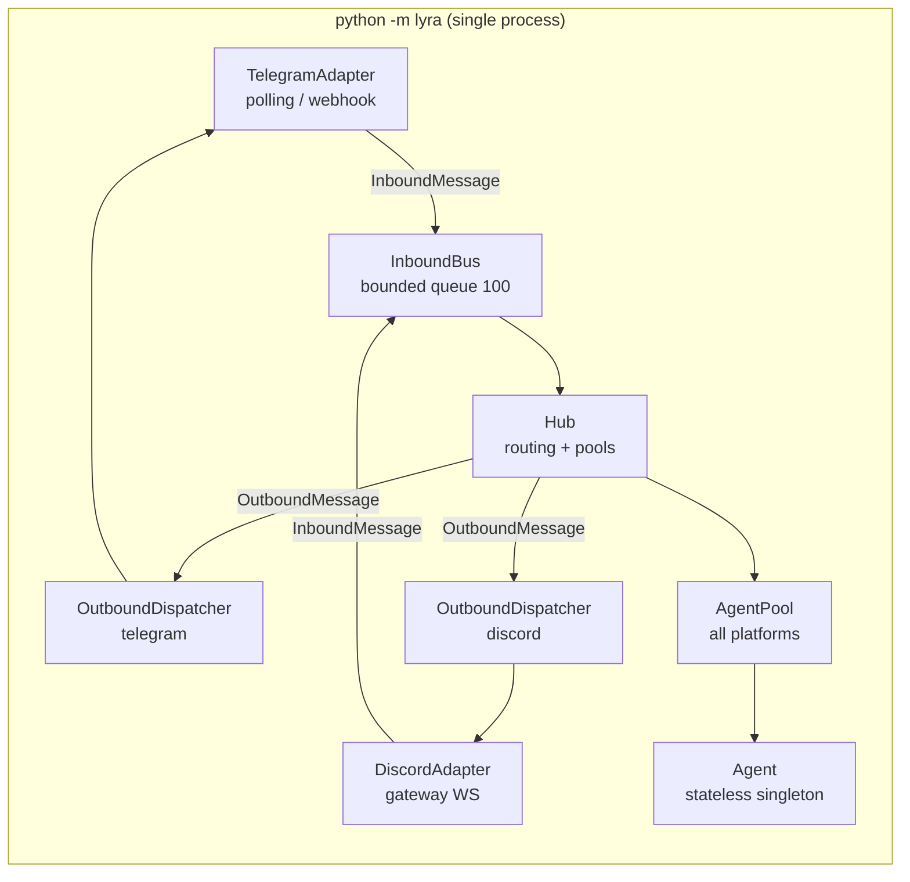

## Source

> Currently `python -m lyra` runs as a **single process** — Telegram adapter, Discord adapter,
> hub, and agent pool all share one process. Restarting any adapter requires taking down
> everything.
>
> — Issue #133

## Problem

`__main__.py` runs a single `asyncio` event loop that wires Hub + all adapters (Telegram +
Discord) + agent pools together. Supervisor manages one `[program:lyra]` process. A config
change, library update, or crash in any adapter forces a full daemon restart — silencing both
channels simultaneously.

Production (Machine 1) additionally lacks the voice daemons (`voicecli_tts`, `voicecli_stt`)
that are already running locally. Since Lyra handles Telegram voice messages today (via
`STTService`) and will have a voice interface in Phase 2, these services must be present on
Machine 1.

## Outcome

- Telegram and Discord adapters can each be restarted independently without the other going
  offline.
- Supervisor manages `lyra_telegram` and `lyra_discord` as first-class programs.
- `make telegram reload` / `make discord reload` work on both local and production.
- Production has `voicecli_tts` and `voicecli_stt` running under the same supervisord.

## Appetite

1-week cycle. The bootstrap refactor is surgical and low risk; the main time cost is
testing both processes end-to-end (webhook registration, TG polling, health endpoints)
and provisioning voiceCLI on Machine 1.

---

## Current Architecture (Data Flow)



---

## Shapes

### Shape 1: `--adapter` flag on `__main__.py` *(recommended)*

Add a CLI argument `--adapter {telegram,discord,all}` (default: `all`) to the existing
`__main__.py` entry point. `_bootstrap_multibot()` filters `tg_bot_auths` and
`dc_bot_auths` based on the flag — only the selected platform's adapters are started.
Hub, auth, and agent pool are initialized normally for the selected subset.

Each supervisor conf passes a different flag:

```
# lyra_telegram.conf
command=run.sh --adapter telegram   →  Hub + TelegramAdapters + AgentPool(tg)

# lyra_discord.conf
command=run.sh --adapter discord    →  Hub + DiscordAdapters + AgentPool(dc)
```

Health port conflict (both cannot bind `LYRA_HEALTH_PORT=8443`) is resolved by adding
`LYRA_TELEGRAM_HEALTH_PORT` and `LYRA_DISCORD_HEALTH_PORT` env vars (or setting different
defaults per conf).

**Code change surface:**

| File | Change |
|------|--------|
| `src/lyra/__main__.py` | Add `argparse` for `--adapter {telegram,discord,all}`; filter `tg_bot_auths`/`dc_bot_auths` in `_bootstrap_multibot`; skip `load_telegram_config()`/`load_discord_config()` in `_bootstrap_legacy` when excluded |
| `supervisor/conf.d/lyra_telegram.conf` | New — `command=run.sh --adapter telegram`, `environment=...LYRA_HEALTH_PORT=8443` |
| `supervisor/conf.d/lyra_discord.conf` | New — `command=run.sh --adapter discord`, `environment=...LYRA_HEALTH_PORT=8444` |
| `supervisor/conf.d/lyra.conf` | Retire (keep temporarily as `lyra_all.conf` for dev fallback, not registered in prod) |
| `supervisor/scripts/run.sh` | Change final line: `exec ... -m lyra "$@"` to forward positional args |
| `Makefile` | (1) Update `register` to symlink both new confs and remove old `lyra.conf` symlink; (2) add `telegram` and `discord` targets with own `ifeq` blocks |
| `lyra-stack/Makefile` | Add `telegram` and `discord` to the service name filter; add parser blocks for `TELEGRAM_CMD` / `DISCORD_CMD` |
| `.env.example` | Add `LYRA_HEALTH_PORT=8443` placeholder (split into per-process ports in the confs) |
| `docs/CONFIGURATION.md` | Document new supervisor programs and health ports |

> **Note:** `src/lyra/cli.py` does **not** need changes. `--adapter` flows through `sys.argv`
> automatically since supervisor invokes `python -m lyra` (not the `lyra` CLI script).
> The `lyra` CLI entrypoint is not used in the daemon path.

**Trade-offs:**

- Pro: Minimal code change — `_bootstrap_multibot` already splits TG/DC early in the
  function; filtering is 2-3 lines.
- Pro: `python -m lyra --adapter all` retains the monolithic dev mode (no supervisor
  needed for quick local hacking).
- Pro: No new modules, no new entry points in `pyproject.toml`.
- Pro: `run.sh` already sources `.env` — just forward `$@` to propagate the flag.
- Con: Hub is duplicated in memory (one instance per process). Acceptable at 32 GB RAM,
  negligible for 2-3 adapters.
- Con: Two agent pools with separate in-memory state. Pools are already isolated by
  `(platform, bot_id, scope_id)` — no cross-platform in-memory sharing exists today.
- Con: Two SQLite `AuthStore` and `PairingManager` connections. WAL mode handles concurrent
  reads cleanly; concurrent writes serialize and may return `SQLITE_BUSY` transiently. Write
  paths are adapter-isolated in practice — Telegram process only writes Telegram auth rows,
  Discord process only writes Discord auth rows — so contention is negligible at personal scale.

**Rough scope:** M (1-2 days)

---

### Shape 2: Separate module entry points

Create `src/lyra/telegram_main.py` and `src/lyra/discord_main.py` — each file has its
own `main()` that calls a shared `_bootstrap_platform(platforms=[...])` extracted from
`_bootstrap_multibot`. Add two new pyproject.toml scripts:
`lyra-telegram = "lyra.telegram_main:main"` and `lyra-discord = "lyra.discord_main:main"`.

**Trade-offs:**

- Pro: Completely isolated entry points — no shared `__main__.py` bootstrap path.
- Pro: Clearer intent (separate files = separate services).
- Con: Code duplication risk — any future change to `_bootstrap_multibot` must also be
  reflected in the extracted function, plus two entry point files.
- Con: Two new pyproject.toml entries, which means `uv sync` and `uv tool install`
  must be re-run on both machines after the change.
- Con: The dev monolith (`python -m lyra`) still exists unchanged, creating a divergence
  between dev mode (all adapters) and prod mode (separate scripts).
- Con: More files to maintain, no meaningful isolation benefit over Shape 1.

**Rough scope:** M (1-2 days, same effort but more files)

---

```mermaid
flowchart TB
    subgraph "Shape 1 — adapter flag"
        S1_TG[lyra_telegram process\npython -m lyra --adapter telegram]
        S1_DC[lyra_discord process\npython -m lyra --adapter discord]
        S1_TG --- S1_NOTE[same __main__.py\nfiltered by flag]
        S1_DC --- S1_NOTE
    end

    subgraph "Shape 2 — separate modules"
        S2_TG[lyra_telegram process\nlyra-telegram entry point]
        S2_DC[lyra_discord process\nlyra-discord entry point]
        S2_TG --- S2_NOTE[separate .py files\nshared _bootstrap_platform()]
        S2_DC --- S2_NOTE
    end
```

---

## Production Voice Daemons (Separate Deliverable)

The issue also requires `voicecli_tts` and `voicecli_stt` running on Machine 1.

VoiceCLI owns its own supervisor confs (`voiceCLI/supervisor/conf.d/`). The local lyra-stack
already has symlinks to them. Machine 1 needs:

1. `voiceCLI` cloned at `~/projects/voiceCLI` on Machine 1.
2. `cd ~/projects/voiceCLI && make register` — creates symlinks in lyra-stack's `conf.d/`.
3. Machine 1's confs must omit WSL-specific env vars (`WSL_INTEROP`) present in the local
   versions.

This is cleanest as a provisioning step (update `lyra-stack/scripts/provision.sh` for
Machine 1) rather than changes to the lyra repo itself. Treat as a parallel slice.

---

## Fit Check

**Shape 1 is recommended.** The `_bootstrap_multibot` function already separates
`tg_bot_auths` and `dc_bot_auths` into distinct lists before wiring — adding a filter
flag is a minimal, reversible change. The existing `run.sh` pattern (sources `.env`,
forwards to Python) trivially supports args. The Makefile `lyra` target pattern is
already generic enough to add `telegram` and `discord` as first-class targets.

Shape 2 is eliminated: it adds more files and a new pyproject.toml entry point without
any material benefit at this scale. The risk of drift between `telegram_main.py`,
`discord_main.py`, and `__main__.py` over time is not worth the cosmetic separation.

**Health port strategy:** The simplest solution is to default each conf to a different
port via env vars in the supervisor conf (e.g., `LYRA_HEALTH_PORT=8443` for telegram,
`LYRA_HEALTH_PORT=8444` for discord). Both health servers remain operational and
independent.

**Production voice daemons:** Treat as a separate provisioning slice to be done in
parallel with the adapter split. Does not block the supervisor conf changes.

**Key implementation steps (Shape 1):**

1. **`__main__.py`**: add `argparse` for `--adapter {telegram,discord,all}` (default: `all`).
   - `_bootstrap_multibot`: filter `tg_bot_auths` to `[]` when `--adapter discord`; filter
     `dc_bot_auths` to `[]` when `--adapter telegram`.
   - `_bootstrap_legacy`: skip `load_telegram_config()` + set `tg_auth=None` when discord-only;
     skip `load_discord_config()` + set `dc_auth=None` when telegram-only. Pattern differs from
     multibot path — the filter applies before `load_*_config()` is called, not after.

2. **`run.sh`**: change final exec line to `exec ... -m lyra "$@"` (forward positional args to
   Python). This and the `command=` flag in the new confs are a single atomic change — one without
   the other silently runs `--adapter all`.

3. **New supervisor confs** (both must include `stopasgroup=true killasgroup=true` from existing
   `lyra.conf`):
   - `lyra_telegram.conf`: `command=run.sh --adapter telegram`, inject `LYRA_HEALTH_PORT=8443`
     in the `environment=` line.
   - `lyra_discord.conf`: `command=run.sh --adapter discord`, inject `LYRA_HEALTH_PORT=8444`.
   - Concrete ports documented in `.env.example`.

4. **`Makefile` — register target**: update to symlink `lyra_telegram.conf` and `lyra_discord.conf`
   into `lyra-stack/conf.d/`, and remove the old `lyra.conf` symlink if present. A fresh machine
   clone runs `make register` once; if both new symlinks are not created, zero lyra processes
   will be registered.

5. **`Makefile` — new targets**: add `ifeq (telegram,$(firstword ...))` and `ifeq (discord,...)`
   blocks with a `TELEGRAM_CMD` / `DISCORD_CMD` variable each, mirroring the existing `lyra`
   target pattern.

6. **`lyra-stack/Makefile`**: add `telegram` and `discord` to the service filter list and add
   corresponding parser blocks so `make telegram reload` works from the global supervisor dir.

7. **Production provisioning (parallel slice)**: SSH to Machine 1, clone voiceCLI at
   `~/projects/voiceCLI`, run `make register` there. Validate that `.env` on Machine 1 contains
   no WSL-specific vars (`WSL_INTEROP`, `WSL_DISTRO_NAME`) before starting the voice services.
   Update `lyra-stack/scripts/provision.sh` with these steps.

8. **ADR**: document the hub-per-adapter process model as a first-class architectural decision.
   Key trade-off to record: cross-platform features (e.g., bridging a Telegram session with a
   Discord session) cannot use in-process state and would require a shared backing store or an
   IPC mechanism. Option B (hub as a service) is the named upgrade path for that scenario.
