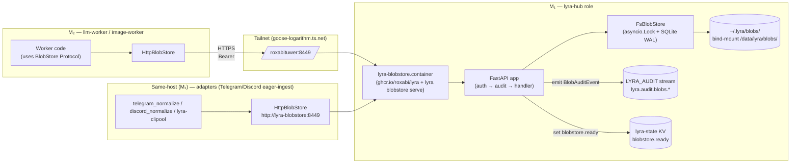

## Source

> "Slice V8 de l'épic #1061. Expose FsBlobStore via HTTP pour accès Protocol cross-host (per ADR-068 Ecosystem Service Plane). Implémente la décision Q1 (option b HTTP-fronted, ¬MinIO swap)."

GitHub issue #1330, body authored 2026-05-24, status OPEN, labels `size:F-full`, `P1-high`.

## Problem

`FsBlobStore` (single-host, `~/.lyra/blobs/`) is the only V1 implementation of the `BlobStore` Protocol. Cross-host workers running on M₂ (`llm-worker`, `image-worker`, future `voice-worker` if it ever moves) cannot reach the blobs that M₁ adapters ingest eagerly. The current ecosystem has zero production consumers wired (`grep` shows `FsBlobStore` referenced only inside `packages/roxabi-blobs/` itself), so V8 is the slice that makes the abstraction useful: HTTP transport for Protocol consumers + ops surface (auth, audit, readiness, backup runbook).

The grandfathered conventions (root at `~/.lyra/blobs/`, port `8449` adjacent to `8443` hub-health) and ADR pre-decisions (Q1 option b — HTTP-fronted FS, ¬MinIO swap; type=mount secret per ADR-054; audit β stream per ADR-068) compress most of the design space. Open variation lives in three areas: **packaging/deployment** (subcommand vs dedicated image vs side-process), **auth runtime** (middleware shape, rotation semantics), **audit schema** (new contract vs extend SecurityEvent).

## Outcome

After V8 ships:
- Any Protocol consumer on the same Tailnet (M₁ same-host or M₂ cross-host) can drop in `HttpBlobStore` instead of `FsBlobStore` with **zero call-site changes** beyond the construction site.
- Round-trip latency for cross-host put/get is in the same order as Tailnet RTT + FastAPI/uvicorn overhead (target: <50 ms for blobs ≤1 MB at p95; measured via Prometheus, not gated).
- The audit shape (`{subject, op, store_key, ts, result, …}`) is schema-stable across Phase 1 (`subject: "service:<token_holder>"`) and Phase 2 (`subject: "agent/<id>"` / `"user/<id>"`) — no migration when per-identity tokens land.
- Backup runbook (`SQLite .backup` → FS tarball → Restic→R2) is exercised once in a manual drill before V8 closes.

## Appetite

3–5 days (per issue body). F-full because it spans 6 concerns (service code, Quadlet unit, secret + auth, audit contract, client SDK, cross-host integration test) even though no individual concern is large.

## Shapes

### Shape A: Subcommand inside `ghcr.io/roxabi/lyra` image (issue body's choice) ← chosen

`lyra blobstore serve` typer subcommand boots a FastAPI app under uvicorn. New Quadlet unit `lyra-blobstore.container` reuses `Image=ghcr.io/roxabi/lyra:<v>` with `Exec=lyra blobstore serve`. Same hardening template as `lyra-hub.container` (`UserNS=keep-id:uid=1500,gid=1500`, `ReadOnly=true`, `DropCapability=all`, `Secret=…,type=mount`). Migration to a dedicated `ghcr.io/roxabi/blobstore` image is deferred until **both** Protocol v2 stabilises (#1334) **and** ≥3 cross-repo consumers exist (voice + image + llm) — three-strikes rule.

**Trade-offs:**
- Pro: zero new CI pipeline; FastAPI/uvicorn already in `pyproject.toml`; release cadence stays unified.
- Pro: same `roxabi.network` Quadlet network; same secret/audit/readiness conventions; ops surface ≡ existing units.
- Pro: keeps `roxabi-blobs` package transport-neutral — the HTTP **server** lives in `src/lyra/blobstore/`; only the **client** `HttpBlobStore` goes into the package (¬`lyra.*` imports, reusable cross-repo).
- Con: bloats the `lyra` image by ~0 MB (everything is already there) but couples the service's release cadence to lyra's. Acceptable while consumer count <3.
- Con: a `lyra` image security fix forces a blobstore restart even if the service code didn't change. Mitigated by `Restart=on-failure` + idempotent boot.

**Rough scope:** M (2–3d service + Quadlet + client; +1–2d audit + backup runbook + integration test).

### Shape B: Dedicated `ghcr.io/roxabi/blobstore` image now

New minimal image (alpine + python + roxabi-blobs + FastAPI). Own CI workflow. Own version stream.

**Trade-offs:**
- Pro: clean separation of concerns; smaller blast radius on image rebuilds.
- Pro: easier to extract repo later if blobstore goes standalone.
- Con: violates three-strikes (only 1 consumer in V8 — clipool eager-ingest is M₁-local + same-process so it stays on `FsBlobStore`; cross-host consumers come in #1066/#1067/#1308 *after* V8).
- Con: doubles CI surface (build, push, sign, autoupdate, secret rotation runbooks) for a single hop's benefit.
- Con: forces an early decision on whether the dedicated image is `python:3.12-slim` or `alpine`; current `lyra` image already settled this.

**Rough scope:** L — same V8 work + new CI pipeline + base-image hardening + provisioning script updates.

### Shape C: Side-process inside `lyra-hub.container`

Run uvicorn inside the existing `lyra-hub` container alongside `lyra hub`. One process tree.

**Trade-offs:**
- Pro: no new Quadlet unit; no new port to publish beyond `PublishPort` widening.
- Pro: hub already has the `~/.lyra/blobs/` volume mounted.
- Con: violates one-purpose-per-container; hub failure now also drops blob HTTP service (and vice-versa); restart semantics become coupled.
- Con: hot path (NATS message handling, JetStream consumers) shares the same memory/CPU with cold path (blob HTTP I/O). The hub `CPUQuota=200%` would have to grow.
- Con: secret separation is awkward — `lyra-nats-hub.seed` and `lyra_blobstore_token` end up in the same container; audit attribution muddies.
- Con: blocks the future migration to a dedicated image (Shape B as graduation path) since the service code is welded into hub startup.

**Rough scope:** S to implement but creates structural debt.

### Files Impacted (Shape A — chosen)

| File | New / Modified | Purpose |
|------|----------------|---------|
| `src/lyra/blobstore/__init__.py` | new | module marker |
| `src/lyra/blobstore/serve.py` | new | FastAPI app factory — boots NATS connect + `BlobAuditSink.provision(nc)` BEFORE app accepts requests; wires `FsBlobStore` + auth middleware + audit sink (degrades to logger if NATS unreachable at startup, same pattern as `JetStreamAuditSink`) |
| `src/lyra/blobstore/cli.py` | new | typer subcommand `lyra blobstore serve` |
| `src/lyra/blobstore/auth.py` | new | bearer token middleware — reads `/run/secrets/lyra_blobstore_token` once at startup; `hmac.compare_digest` |
| `src/lyra/blobstore/audit_sink.py` | new | `BlobAuditSink` — emits `BlobAuditEvent` to `lyra.audit.blobs.{op}` (reuses `LYRA_AUDIT` stream). Lives outside `infrastructure/` (no new infra subdir → no ADR needed per `infrastructure/CLAUDE.md` governance rule) |
| `src/lyra/blobstore/CLAUDE.md` | new | invariants for the new subdir (port, host topology, auth Phase 1/2 boundary, NATS-degraded mode) |
| `src/lyra/cli/__init__.py` | modified | register typer subcommand |
| `CLAUDE.md` | modified | add `src/lyra/blobstore/CLAUDE.md` row to the hygiene table |
| `.importlinter` | modified | add `lyra.blobstore` as a peer of `lyra.adapters` (peer-layer syntax `lyra.adapters \| lyra.blobstore`); enforces ¬import from `lyra.bootstrap` and ¬import-by `lyra.outbound/infrastructure/llm/nats/core/streaming/transport` |
| `packages/roxabi-blobs/src/roxabi_blobs/http_store.py` | new | `HttpBlobStore` Protocol implementation (httpx async). Only deps: `httpx`, `roxabi_blobs.{models,protocol,errors}`. **Zero `lyra.*` imports** — preserves package's cross-repo reusability invariant per `packages/roxabi-blobs/CLAUDE.md` |
| `packages/roxabi-blobs/src/roxabi_blobs/__init__.py` | modified | export `HttpBlobStore` |
| `packages/roxabi-contracts/src/roxabi_contracts/audit/blobs.py` | new | `BlobAuditEvent` contract (parallel to `SecurityEvent`, NOT extending — `SecurityEvent.skip_permissions` is semantically wrong for blob ops) |
| `packages/roxabi-contracts/src/roxabi_contracts/audit/__init__.py` | modified | re-export |
| `deploy/quadlet/lyra-blobstore.container` | new | Quadlet unit — `Image=ghcr.io/roxabi/lyra:staging-svc` (svc-runtime variant, requires `config.toml` bind-mount per `docs/ops/container-publishing.md`); see §Quadlet template clone below |
| `deploy/quadlet/blobstore.env.example` | new | env template + comments |
| `deploy/quadlet.toml` | modified | manifest entry (host role `lyra-hub` / M₁) |
| `deploy/CLAUDE.md` | modified | add `lyra-blobstore` row to unit-naming-convention table (6→7 containers) |
| `docs/architecture/adr/067-blobstore-abstraction-flat-fs-content-addressed.mdx` | modified | update redirect banner + note V8 implementation status; ¬change `status: accepted` |
| `docs/QUADLET-DEPLOYMENT.md` | modified | add `lyra_blobstore_token` row to the secret-layout table; rotation runbook (write to source file → `podman secret create --replace` → `systemctl --user restart` → `podman exec ... cat /run/secrets/...` verification → rollback path); backup runbook (`.backup` ordering + restore invariant on orphan shards) |
| `docs/CONFIGURATION.md` | modified | `blobstore.env` row in env-files table |
| `docs/architecture/storage.md` | modified | HTTP service section + cross-host access pattern + restore invariant note |
| `pyproject.toml` | modified | `httpx` already present; add `[project.scripts]` entry for `lyra-blobstore` if needed |
| `tests/blobstore/test_serve.py` | new | unit — auth pass/fail, put/get/exists/delete endpoints |
| `tests/blobstore/test_http_store.py` | new | unit — `HttpBlobStore` against ASGI in-process (`httpx.AsyncClient(transport=ASGITransport(app=...))`) |
| `packages/roxabi-blobs/tests/test_protocol_parametrized.py` | new | parametrized over `(FsBlobStore, HttpBlobStore)` — behavioural equivalence |
| `tests/blobstore/test_cross_host.py` | new | integration — `@pytest.mark.integration`, skipped when not on M₁ |

**Touch count:** ~24 files (new ≈13 / modified ≈11). Fits F-full envelope. No deletions.

### Server / Client topology (Shape A)



**Wiring per process (per ADR-067 §Wiring per process — canonical):** only the `lyra-blobstore` process uses `FsBlobStore` directly. Every other process (`lyra-hub`, `lyra-telegram`, `lyra-discord`, `lyra-clipool`, plus M₂ workers) constructs `HttpBlobStore` at bootstrap. Same-host clients use Quadlet DNS `http://lyra-blobstore:8449`; cross-host clients use Tailnet MagicDNS. Protocol shape is identical at the call-site.

### Audit shape

New contract `BlobAuditEvent` in `roxabi_contracts.audit.blobs`:

```python
class BlobAuditEvent(ContractEnvelope):
    kind: Literal["blobs.op"]
    subject: str            # Phase 1: "service:lyra-blobstore"
                            # Phase 2: "agent/<id>" | "user/<id>"
    op: Literal["put", "get", "exists", "delete", "head"]
    store_key: str | None   # null on put pre-write; present afterwards
    content_hash: str | None
    size: int | None
    result: Literal["ok", "not_found", "unauthorized", "error"]
    error_code: str | None  # taxonomy mirrors roxabi_blobs.errors
```

Subject pattern: `lyra.audit.blobs.{op}` (op in subject for selective consumers). `LYRA_AUDIT` stream already subscribes `lyra.audit.>` (see `src/lyra/infrastructure/audit/jetstream_sink.py:56`) — **no stream config change**.

The existing `JetStreamAuditSink` is `SecurityEvent`-typed. V8 introduces a parallel narrow sink `BlobAuditSink` in `src/lyra/blobstore/audit_sink.py` that publishes `BlobAuditEvent` to `lyra.audit.blobs.{op}`. Same degradation semantics (fall back to `lyra.security` logger when JetStream is unavailable).

### Auth Phase 1 design

- Single shared bearer token in Podman secret `lyra_blobstore_token` (`type=mount`, file at `/run/secrets/lyra_blobstore_token`, mode `0400`, owned `1500:1500` — same template as `lyra-nats-hub`).
- Middleware reads the secret file **once at startup** into memory; constant-time comparison (`hmac.compare_digest`) — mirrors `bootstrap/infra/health.py:_secrets_match` pattern.
- Unauthorized → `401` + empty body; audit row `result: "unauthorized"`, `subject: "anonymous"`.

**Rotation runbook (5 steps, runbook lives in `docs/QUADLET-DEPLOYMENT.md`):**

1. Write the new token to the host source file: `printf '%s' "$NEW_TOK" > ~/.lyra/blobstore.tok && chmod 0400 ~/.lyra/blobstore.tok` — keeps reinstall scripts idempotent.
2. `podman secret create --replace lyra_blobstore_token ~/.lyra/blobstore.tok` — updates the secret store.
3. `systemctl --user restart lyra-blobstore.service` — `type=mount` tmpfs files are bound at container init; restart is mandatory (ADR-054 §"`type=mount` secrets bound at init").
4. Verify: `podman exec lyra-blobstore sh -c 'head -c 8 /run/secrets/lyra_blobstore_token'` — first 8 chars of new token should match.
5. Rollback (if step 4 fails): re-run `podman secret create --replace lyra_blobstore_token ~/.lyra/blobstore.tok.prev` + restart — keep the prior `.prev` source file until rotation is confirmed successful.

### Backup atomicity (runbook only — no code in V8)

The known consistency hole (raised in `storage.md` Open Questions) is the `index.sqlite` ↔ blob-files snapshot order. V8 documents the correct order:

1. `sqlite3 ~/.lyra/blobs/index.sqlite ".backup '/tmp/blobstore-snapshot/index.sqlite'"` — atomic per SQLite `.backup` API.
2. `tar -cf - ~/.lyra/blobs/<sha[:2]> /tmp/blobstore-snapshot/index.sqlite | restic backup --stdin --stdin-filename blobstore.tar`.
3. Restore: extract tarball → both the snapshot DB and the FS shards land at the same logical instant → no dangling refs.

Step 1 must happen **before** step 2 (else a blob_refs row may point to a hash whose file landed mid-tarball — phantom row at restore time). Inverse order is the bug ADR-067 §Write order avoided in `put()`; the backup runbook has the same shape.

**Restore invariant (handles the no-write-quiesce case):** `FsBlobStore` uses a per-instance `asyncio.Lock`, not a global write-quiesce; a concurrent `put()` between step 1 (snapshot DB) and step 2 (tar FS) can leave a shard file in the tarball whose `blob_refs` row was NOT captured in the snapshot DB. The restore procedure handles this safely: after extraction, scan `~/.lyra/blobs/<sha[:2]>/<sha>` against `blob_refs.content_hash`; orphan shard files (no row) are discarded. Content-addressed orphans are *always* safe to discard — by definition, no consumer ever held a `store_key` pointing to them (the `put()` that wrote them never completed its `INSERT blob_refs`). The reverse — phantom row pointing to a missing file — is the unrecoverable bug that step ordering prevents.

### Quadlet template clone (Shape A unit shape)

Cloned from `deploy/quadlet/lyra-hub.container` with the following deltas:

| Setting | Value | Rationale |
|---------|-------|-----------|
| `Image=` | `ghcr.io/roxabi/lyra:staging-svc` | svc-runtime variant — requires `config.toml` bind-mount; same as hub/telegram/discord |
| `Exec=` | `lyra blobstore serve` | typer subcommand |
| `PublishPort=` | bind to Tailscale IPv4 (resolved at provision time via `tailscale ip -4`) — `<ts-ipv4>:8449:8449` | LAN exposure is unintentional surface — bearer token is the only auth; restrict to Tailnet. `0.0.0.0:8449` is the fallback if `tailscale0` is absent, accepted as documented residual risk. |
| `HealthCmd=` | `pgrep -f "lyra blobstore serve"` | mirrors hub pattern |
| `CPUQuota=` | `100%` | cold-path I/O; doesn't need hub's `200%` |
| `After=` / `Wants=` | `lyra-nats.service` (soft) | audit sink degrades to logger if NATS unreachable; service can start without NATS |
| `Volume=` | `%h/.lyra/blobs:/data/lyra/blobs:z` + `%h/.lyra/config.toml:/app/config.toml:ro,z` | content dir bind + config bind |
| `Secret=` | `lyra_blobstore_token,type=mount,target=lyra_blobstore_token,uid=1500,gid=1500,mode=0400` | ADR-054 |
| `Label=` | `io.containers.autoupdate=registry` | same autoupdate cadence as svc-runtime peers |
| `EnvironmentFile=` | `%h/.lyra/env/blobstore.env` | per Quadlet env convention |
| Hardening | `NoNewPrivileges=true`, `ReadOnly=true`, `DropCapability=all`, `UserNS=keep-id:uid=1500,gid=1500` | clones hub |

### Cross-host integration test

`tests/blobstore/test_cross_host.py` is marked `@pytest.mark.integration` and `@pytest.mark.skipif(not on_m1())` — runs only when the harness can reach `http://roxabituwer.goose-logarithm.ts.net:8449`. CI runs it nightly on M₁ (the same env that boots the staging Quadlet bundle). Unit tests cover all the non-network paths via ASGI in-process (`httpx.AsyncClient(transport=ASGITransport(app=...))`).

## Fit Check

**Shape A wins** on three independent axes:

1. **Three-strikes rule (ADR-073).** Only 1 consumer in V8; the next 3 (#1066 Discord, #1067 STT, #1308 Image) come *after* V8 closes. Shape B's dedicated image is the right end-state but premature now.
2. **Boundary cleanliness.** Shape A keeps `roxabi-blobs` transport-neutral on the **server side** (HTTP server lives in `src/lyra/blobstore/`), and exposes a transport-aware **client** (`roxabi_blobs.HttpBlobStore`) — symmetric with `FsBlobStore`. Shape C would weld blobstore code into hub bootstrap, blocking the eventual Shape B graduation.
3. **Ops convention compliance.** Existing Quadlet units already template `UserNS=keep-id:uid=1500,gid=1500`, `Secret=…,type=mount`, `Network=roxabi.network`, `EnvironmentFile=%h/...`. Shape A clones this template wholesale — Shape C breaks the one-purpose-per-container invariant; Shape B introduces a parallel image-hardening template that must be maintained separately.

Shape C is **eliminated**: violates the deploy/CLAUDE.md "one-purpose-per-container" pattern; muddles audit attribution; couples hub + blob restart semantics.

Shape B is **deferred** (not rejected): same code paths as Shape A, the only delta is the Quadlet `Image=` line and a CI pipeline. Migration trigger documented in the issue body (Protocol v2 stabilised + ≥3 cross-repo consumers).

## Risks (recorded; not blockers)

| Risk | Likelihood | Mitigation in V8 |
|------|------------|------------------|
| Bearer token leak in transit | low (Tailnet WireGuard) | document HTTPS reverse-proxy as Phase 2 hardening; out of V8 scope |
| `type=mount` secret rotation forgotten → stale tmpfs file | medium | runbook + checklist entry in `docs/QUADLET-DEPLOYMENT.md` |
| SQLite `.backup` ordering inverted in operator script | medium | runbook explicit; add a shell script `deploy/scripts/blobstore-backup.sh` that enforces the order (defer to V9 if scope creep) |
| Disk fills before MinIO trigger | low (manual watch | Prometheus `disk_used_pct` + ops dashboard hook (existing pattern) |
| Cross-host test flakes on Tailnet hiccup | low | marker isolation; retries with backoff in the integration test only |
| FastAPI/uvicorn version drift between hub-health and blobstore | low | both share the project `pyproject.toml` → single source of versions |
