## Source

Issue #1336 (Phase B follow-up to #1335) — "After Phase A removes all dead tool-display surfaces, this issue wires `ToolDisplayConfig` to the live tool-recap rendering path and resolves the circular-import workaround currently documented in `src/lyra/outbound/CLAUDE.md` §State + recap helpers."

Reviewers: `dev-core:axial-adr-review` + `dev-core:architect` (2026-05-24 audit conversation).

## Problem

Three coupled problems landed on the clean Phase-A foundation:

1. **Dead loader, hardcoded live path.** `_load_tool_display_config()` exists in `src/lyra/bootstrap/factory/config.py:225` but has **zero production callers** (only `tests/test_tool_display_config.py` imports it). The live recap path in `src/lyra/adapters/shared/_tool_recap.py` reads four module-level constants (`_BASH_DISPLAY_MAX = 80`, `_BASH_GROUP_THRESHOLD = 3`, `_FILES_GROUP_THRESHOLD = 3`, `_NAMES_THRESHOLD = 5`) and never consults `config.show`. Setting `[tool_display]` in `config.toml` does nothing.

2. **Circular import workaround.** `src/lyra/outbound/emitter.py` carries a `# Deferred imports — see the explanatory comment at the top of the file` block at the bottom of the module — runtime imports of `StreamState` (from `_shared_streaming_state`), `ToolRecapAccumulator` + `format_recap_lines` (from `_tool_recap`), AND `STREAMING_EDIT_INTERVAL` (from `lyra.outbound.throttle`) placed AFTER the class definitions. Three deferred lines total. The first two trigger the actual cycle: `lyra.adapters.shared/__init__.py` does an eager `from lyra.outbound.emitter import OutboundEmitter as StreamingSession` + `PlatformCallbacks` (lines 23–24), which triggers `outbound/emitter.py` load, which would re-enter `lyra.adapters.shared/__init__.py` (still mid-init) when importing `_tool_recap` or `_shared_streaming_state` — Python deadlocks on "partially initialized module." The third (`throttle.STREAMING_EDIT_INTERVAL`) is NOT cycle-driven (`throttle.py` imports only stdlib) but rides on the same deferred block; resolving the cycle must sweep it too or the `# noqa: E402` debris remains.

3. **Wrong-axis injection trap.** The naive fix — accept `ToolDisplayConfig` in `_make_emitter` on each platform — is exactly what `dev-core:axial-adr-review` flagged against ADR-073: 2 sibling sites today (`telegram.py:269`, `discord/adapter.py:251`), +1 per future adapter. Replacing dead wrong-axis code (deleted in Phase A) with live wrong-axis code defeats the whole Phase A→B sequence.

## Additional Discoveries

These surfaced during exploration and are architecturally significant enough to gate the spec; they are not buried sub-bullets.

- **Default-value mismatch (silent behavior change risk).** `ToolDisplayConfig.bash_max_len` defaults to **60** while `_BASH_DISPLAY_MAX` is **80**. `ToolDisplayConfig.names_threshold` defaults to **3** while `_NAMES_THRESHOLD` is **5**. Naive wiring silently changes bash display + file-name behavior. The frame's "Behavioral parity by default" constraint is at risk.
- **Conflated thresholds.** `_BASH_GROUP_THRESHOLD` and `_FILES_GROUP_THRESHOLD` are both `3` but semantically distinct (bash command count vs file count). `ToolDisplayConfig` exposes ONE `group_threshold`. The issue body explicitly maps both to `group_threshold`, but this conflates two concerns — a 3rd-party adopter who wants `_BASH_GROUP_THRESHOLD = 5` and `_FILES_GROUP_THRESHOLD = 2` can't express it.
- **Cycle is via TWO submodules, not one.** Both `_tool_recap.py` AND `_shared_streaming_state.py` are deferred-imported by `emitter.py`. Removing only the `_tool_recap` deferred line doesn't kill the workaround.
- **`StreamingSession` alias has wide reach.** 8+ sites reference `from lyra.adapters.shared import StreamingSession`/`PlatformCallbacks` (test files, error_handler docstrings). Any approach that removes the re-export must sweep these.
- **`OutboundAdapterBase` has NO `__init__`** (MRO constraint with `discord.Client`). Threading `ToolDisplayConfig` via base-class constructor is **impossible**; it must enter via concrete subclasses + be READ by the base. **Distinction matters:** the config is READ at ONE site (`OutboundAdapterBase.send_streaming`), but STORED at TWO sites (`TelegramAdapter.__init__`, `DiscordAdapter.__init__`). Per axial review, the store sites are unavoidable wiring (not axial drift); the single-read site IS the meaningful axial boundary.
- **`_route()` is the gate site for `config.show`.** Currently hardcodes silent vs loud routing (lines 100–119 of `_tool_recap.py`). `read/grep/glob` go to `_silent_*` counters; `web_fetch/web_search/agent` go to the loud lists. To honor `config.show.web_fetch = false`, `_route` must consult `config.show.get(key, False)` BEFORE bucketing.

## Outcome

After Phase B lands, the following observable conditions hold:

- Setting `bash_max_len = 200` in `config.toml [tool_display]` truncates bash recap lines at 200 chars (verified on Telegram + Discord).
- Setting `show.web_fetch = false` (or `show.web_search = false`, `show.agent = false`, `show.bash = false`, etc.) in `config.toml [tool_display]` suppresses the corresponding lines in the recap card on both Telegram + Discord. All keys defined in `ToolDisplayConfig._DEFAULT_SHOW` are honored, not just `web_fetch`.
- `src/lyra/outbound/emitter.py` has no `# Deferred imports` block — all imports are top-of-file.
- `OutboundAdapterBase`'s subclasses thread `ToolDisplayConfig` through **exactly one READ site** (`send_streaming` injection into emitter), not per-platform `_make_emitter` parameters. (Per-platform `__init__` STORE sites are unavoidable wiring under the MRO constraint and don't count as axis drift.)
- When `[tool_display]` is absent from `config.toml`, recap output is **byte-identical** to today's output.
- `_load_tool_display_config()` has a production caller in `src/lyra/bootstrap/factory/config.py` (or equivalent wiring point).
- Quality gates pass: `uv run pyright`, `uv run pytest`, `uv run ruff check .`, importlinter.

## Appetite

**1 sprint cycle (5–7 working days) targeted; 8–10 days realistic.** F-full work spans outbound + adapters/shared + bootstrap + tests + docs. Two structural decisions (cycle resolution + `ToolRecapAccumulator` home) gate the slicing, so the analysis must agree before the spec phase can carve clean slices.

**Scope cliff (per product-lead review):** if Open Question 1 (emitter config-acceptance shape — constructor arg vs settable attribute vs `run()` kwarg) is not resolved by **end of day 1 of spec**, fall back to **Shape 2** (Break cycle via import pruning) to preserve the timeline. Shape 2 has smaller blast radius and decouples the threading choice from the file-move sweep.

## Shapes

### Shape 1 — Relocate to outbound layer (architect-preferred)

**File moves:**
- `src/lyra/adapters/shared/_tool_recap.py` → `src/lyra/outbound/_tool_recap.py`
- `src/lyra/adapters/shared/_shared_streaming_state.py` → `src/lyra/outbound/_streaming_state.py`

**Cycle resolution:** Both modules now live under `outbound/`. `emitter.py` imports them with normal top-of-file imports. The full deferred-import block (3 lines — `_streaming_state`, `_tool_recap`, `throttle.STREAMING_EDIT_INTERVAL`) is dissolved; `throttle.STREAMING_EDIT_INTERVAL` was never cycle-driven but rides on the same block and gets promoted to top-of-file in the same sweep. `lyra.adapters.shared/__init__.py`'s re-exports of `OutboundEmitter as StreamingSession` and `PlatformCallbacks` continue to work — they trigger `outbound/emitter.py` load, which now loads cleanly (its submodule imports never re-enter `adapters/shared/`).

**Threading:** Concrete subclasses (`TelegramAdapter.__init__`, `DiscordAdapter.__init__`) accept `tool_display_config: ToolDisplayConfig` kwarg and assign to `self._tool_display_config`. Base class's `send_streaming()` (concrete on base, NOT overridden per platform) reads `self._tool_display_config` and passes it to the emitter:

```python
# In OutboundAdapterBase.send_streaming (one site, the "single threading point"):
emitter = self._make_emitter(original_msg, outbound)
emitter.tool_display_config = getattr(self, "_tool_display_config", ToolDisplayConfig())
await emitter.run(events)
```

`OutboundEmitter` constructs `ToolRecapAccumulator(config=self.tool_display_config)` inside `run()` (or `_make_recap_accumulator()` helper).

**Trade-offs:**
- **Pro:** `_tool_recap.py` aligns with its semantic owner — it's stage-axis logic, not adapter-shared utility. Future adapters never touch it. Matches `outbound/CLAUDE.md` §Purpose ("per-platform-agnostic stage composition").
- **Pro:** No `shared/__init__.py` surgery — the public API stays stable; existing `StreamingSession` callers still work.
- **Pro:** `_route()` config-gate is clean — `_tool_recap.py` is collocated with its consumer.
- **Con:** 2 file moves with downstream sweep — tests + `outbound/CLAUDE.md` §State + recap helpers + `adapters/CLAUDE.md` references all need updates.
- **Con:** `_shared_streaming_state.py` is renamed (`_streaming_state.py` per `outbound/` private convention) — git history readability cost.

**Rough scope:** **L** (~12–18 files touched, including 2 moves, 1 rename, 6 import-path updates, 4 test files, 2 CLAUDE.md updates).

### Shape 2 — Break cycle via import pruning (axial-preferred)

**No file moves.** `_tool_recap.py` and `_shared_streaming_state.py` stay in `adapters/shared/`.

**Cycle resolution:** Remove lines 23–24 + 31 from `src/lyra/adapters/shared/__init__.py`:
```python
# REMOVED:
from lyra.outbound.emitter import OutboundEmitter as StreamingSession
from lyra.outbound.emitter import PlatformCallbacks
# ...
"PlatformCallbacks",
"StreamingSession",
```

Force all callers to import directly: `from lyra.outbound.emitter import OutboundEmitter[, PlatformCallbacks]`. The cycle dies because `adapters/shared/__init__.py` no longer pulls `outbound/emitter.py` during its init.

**Sweep target:** 8 sites (5 test files + 3 docs/comments).

**Threading:** Same as Shape 1 — concrete subclasses store `self._tool_display_config`; base `send_streaming` injects into emitter.

**Trade-offs:**
- **Pro:** Smaller blast radius — one `__init__.py` change + 8 import-path updates. No file moves.
- **Pro:** Forces direct imports — clearer "where does X live" mental model (no aliases).
- **Pro:** `_tool_recap.py` stays where Phase A audit left it — minimal departure from the just-landed clean foundation.
- **Con:** `_tool_recap.py` lives in `adapters/shared/` even though `outbound/CLAUDE.md` claims it's stage-axis logic — semantic mismatch documented but unresolved.
- **Con:** `StreamingSession` alias dies (or stays as legacy local alias in error_handler docstring only) — minor migration ergonomics cost.
- **Con:** Doesn't fully realize the stage-axis ideal — the next axial reviewer may flag the residual semantic mismatch.

**Rough scope:** **M** (~10 files touched, 1 `__init__.py` edit, 8 import-path updates, 1 CLAUDE.md update).

### Shape 3 — Partial relocation (disqualified)

**File moves:**
- `src/lyra/adapters/shared/_tool_recap.py` → `src/lyra/outbound/_tool_recap.py` ONLY.

**Cycle resolution:** Move `_tool_recap` (the more-touched file, the one with config-gate work coming) to break the worst part of the deferred-import block. `_shared_streaming_state.py` keeps its current deferred-import status — the cycle there is structurally identical but lower-priority since `StreamState` is unchanged by Phase B.

**Trade-offs:**
- **Pro:** Minimal moves — only the file that's actively changing this PR.
- **Con:** Doesn't actually kill the deferred-import block — `_shared_streaming_state` remains a deferred import, just shorter. Frame constraint "no deferred-import band-aid: the circular-import resolution must be structural" is **partially violated**.
- **Con:** Half-measure — defers the real cleanup. The next outbound-touching PR will face the same mental model.

**Rough scope:** **M** (~10 files — 1 move, 5 import-path updates, 4 test files).

**Note on disqualification.** Shape 3 only meets the constraint "Resolve circular-import" if we interpret it loosely. Strict reading of "no band-aid" disqualifies it.

## Fit Check

```mermaid
flowchart TB
    subgraph current["Today (Phase A clean foundation)"]
      A1[lyra.adapters.shared/__init__.py<br/>re-exports OutboundEmitter, PlatformCallbacks]
      A2[lyra.outbound.emitter.py<br/>DEFERRED imports of ToolRecapAccumulator, StreamState]
      A3[lyra.adapters.shared/_tool_recap.py<br/>+ _shared_streaming_state.py]
      A1 -->|trigger init| A2
      A2 -.->|circular| A3
      A3 -->|requires shared/__init__ done| A1
    end

    subgraph s1["Shape 1 — Move-to-outbound"]
      B1[lyra.adapters.shared/__init__.py<br/>UNCHANGED re-exports]
      B2[lyra.outbound.emitter.py<br/>top-of-file imports]
      B3[lyra.outbound/_tool_recap.py<br/>+ _streaming_state.py]
      B1 -->|trigger init| B2
      B2 -->|normal import| B3
    end

    subgraph s2["Shape 2 — Remove-re-export"]
      C1[lyra.adapters.shared/__init__.py<br/>NO emitter re-exports]
      C2[lyra.outbound.emitter.py<br/>top-of-file imports]
      C3[lyra.adapters.shared/_tool_recap.py<br/>+ _shared_streaming_state.py]
      C2 -->|normal import| C3
      C1 -.->|no longer triggers| C2
    end
```



**Constraint alignment:**

| Constraint (from frame) | Shape 1 | Shape 2 | Shape 3 |
|---|---|---|---|
| Single threading point at `OutboundAdapterBase` | ✅ via base `send_streaming` | ✅ via base `send_streaming` | ✅ via base `send_streaming` |
| No deferred-import band-aid (structural fix) | ✅ kills both deferred lines | ✅ kills both deferred lines | ❌ keeps `_shared_streaming_state` deferred |
| Behavioral parity when `[tool_display]` absent | ⚠️ requires default-value fix (see below) | ⚠️ requires default-value fix | ⚠️ requires default-value fix |
| Stage-axis epic #1277 preserved | ✅ aligns with `outbound/` ownership | ⚠️ partial — semantic-mismatch residual | ⚠️ partial |
| Quality gates pass | feasible | feasible | feasible |

**Behavioral-parity sub-decision (orthogonal to shape choice):** The default mismatch (`bash_max_len: 60` vs `_BASH_DISPLAY_MAX = 80`; `names_threshold: 3` vs `_NAMES_THRESHOLD = 5`) means Phase B silently changes prod behavior unless we either:
- **(a) Update `ToolDisplayConfig` defaults** to match the constants (`bash_max_len = 80`, `names_threshold = 5`). One pyramid: live behavior is the SoT; config defaults follow.
- **(b) Keep `ToolDisplayConfig` defaults, accept the change** as an intentional improvement. Risk: prod recap looks different; bash now truncates at 60 chars (shorter); name-listing switches to count-only sooner.
- **(c) Add migration note + flag** — keep both defaults, surface in `CONFIGURATION.md`.

Recommended: **(a)** — silent behavior change is the worst outcome; align defaults to current live constants for parity. If we later want to lower `bash_max_len`, that's a separate, intentional change.

**Conflated-threshold sub-decision:** `_BASH_GROUP_THRESHOLD` and `_FILES_GROUP_THRESHOLD` map to the same `group_threshold` field. Both are `3` today, so today's behavior is preserved either way. Phase B can either:
- **Accept the conflation** (issue's mapping) — simpler config, but loses expressiveness.
- **Split** into `bash_group_threshold` + `files_group_threshold` in `ToolDisplayConfig` — keeps semantic distinction, asymmetric defaults (both `3` today, but independent going forward).

Recommended: **Accept the conflation** for Phase B — adding fields to the public config schema crosses a stability line and isn't required by any current use case. File a follow-up issue if a real ask materializes.

**Recommended shape: Shape 1 (Move-to-outbound).**

Reasoning:
- ✅ Fully kills the deferred-import band-aid (both lines), satisfying the "no band-aid" frame constraint strictly.
- ✅ Aligns `_tool_recap.py` semantically with the stage-axis layer it serves — `outbound/CLAUDE.md` already documents it as "stage composition" and lists `ToolRecapAccumulator` under §State + recap helpers as semantically owned by outbound.
- ✅ Preserves `shared/__init__.py` public API — zero sweep of `StreamingSession`/`PlatformCallbacks` callers. Tests + docs unchanged.
- ✅ Architect explicitly preferred this. Axial reviewer's objection ("proximity is enough") is a softer preference, not a hard constraint per the issue body.
- ⚠️ Larger scope (~L vs M) but the surgery is mechanical (file move + path update); no design ambiguity in the sweep.

**Shape 2 disqualifier:** the residual semantic mismatch (`_tool_recap.py` documented as stage-axis logic but living in `adapters/shared/`) is a smell the next outbound-touching PR will hit. Phase B is exactly when to fix it — clean foundation, narrow scope, two reviewers already agreed it should land here.

**Shape 3 disqualifier:** doesn't satisfy the strict reading of "no deferred-import band-aid." Half-measures here invite a Phase C.

## Files impacted (Shape 1 — preview)

> **Preview — assumes Shape 1 is the recommended outcome.** Detailed slicing belongs in the spec; this table is for sizing only.

| Path | Change |
|------|--------|
| `src/lyra/adapters/shared/_tool_recap.py` | DELETE (moved) |
| `src/lyra/outbound/_tool_recap.py` | NEW (moved + accepts `config: ToolDisplayConfig`; `_route` consults `config.show`; constants become defaults of `ToolDisplayConfig`) |
| `src/lyra/adapters/shared/_shared_streaming_state.py` | DELETE (moved) |
| `src/lyra/outbound/_streaming_state.py` | NEW (rename to drop `_shared_` prefix; private to outbound) |
| `src/lyra/outbound/emitter.py` | Remove deferred-import block (3 lines: `_tool_recap`, `_streaming_state`, `throttle.STREAMING_EDIT_INTERVAL`); top-of-file imports; accept `tool_display_config` attribute; construct accumulator with config |
| `src/lyra/adapters/shared/_base_outbound.py` | `send_streaming` reads `self._tool_display_config` (with `ToolDisplayConfig()` default) and injects into emitter |
| `src/lyra/adapters/telegram/telegram.py` | `__init__` accepts `tool_display_config` kwarg; assigns to `self._tool_display_config` |
| `src/lyra/adapters/discord/adapter.py` | `__init__` accepts `tool_display_config` kwarg; assigns to `self._tool_display_config` |
| `src/lyra/bootstrap/factory/config.py` | Production caller of `_load_tool_display_config` (currently zero prod callers) |
| `src/lyra/core/messaging/tool_display_config.py` | Update `bash_max_len: 60 → 80`, `names_threshold: 3 → 5` for behavioral parity (sub-decision (a)) |
| `src/lyra/bootstrap/wiring/bootstrap_wiring.py` **L64** | Pass `tool_display_config=` to `TelegramAdapter(...)` call (wired bootstrap, Telegram) |
| `src/lyra/bootstrap/wiring/bootstrap_wiring.py` **L170** | Pass `tool_display_config=` to `DiscordAdapter(...)` call (wired bootstrap, Discord) |
| `src/lyra/bootstrap/standalone/adapter_standalone.py` **L101** | Pass `tool_display_config=` to `TelegramAdapter(...)` call (standalone bootstrap, Telegram subprocess mode) |
| `src/lyra/bootstrap/standalone/adapter_standalone.py` **L260** | Pass `tool_display_config=` to `DiscordAdapter(...)` call (standalone bootstrap, Discord subprocess mode) |
| `src/lyra/outbound/CLAUDE.md` | Update §State + recap helpers — remove "live in `lyra.adapters.shared/`" claim; document config-driven thresholds |
| `src/lyra/adapters/CLAUDE.md` | Update references to `_tool_recap.py` location |
| `tests/test_tool_display_config.py` | Update default-value assertions (60→80, 3→5) |
| `tests/adapters/test_streaming_session_tool_recap.py` | Update import path of `ToolRecapAccumulator` |
| `tests/adapters/test_shared.py` | Update if it imports from `lyra.adapters.shared._tool_recap` |
| Plus 2–4 test files | Behavioral tests for new wiring (config-gated visibility, config-driven thresholds, default absence, standalone-vs-wired parity) |

**Per-platform bootstrap callsite count: 4** (per axial review). Both wired and standalone bootstrap paths must pass `tool_display_config=`, or `lyra adapter telegram` / `lyra adapter discord` subprocess mode becomes a silent no-op while `lyra start` works correctly. Add this asymmetry to the outcome verification.

## Open Questions (carried to spec)

1. **`OutboundEmitter` config-acceptance shape:** constructor arg vs settable attribute vs `run()` kwarg? Architect's lean: **settable attribute** set in `send_streaming` (keeps `_make_emitter` abstract signature stable — no new required kwarg pushed through both platforms' factory methods). Confirm in spec. **Time-boxed: must resolve by end of day 1 of spec phase, else fall back to Shape 2.**
2. **Where exactly should `_load_tool_display_config` be called?** `config.py` line ~225 builds the config object; the wiring point that hands it to adapters should be `bootstrap_wiring.py` AND `adapter_standalone.py` (both construct `TelegramAdapter`/`DiscordAdapter` — see Files impacted §; 4 callsites total). Verify in spec.
3. **`_shared_streaming_state.py` rename:** `_streaming_state.py` (drop the `_shared_` prefix) or keep the name? Cosmetic but worth deciding once.
4. **Test placement:** new tests for `_tool_recap.py` go to `tests/outbound/test_tool_recap.py` (new file) or `tests/adapters/test_streaming_session_tool_recap.py` (existing)? Probably new file aligning with new module location.
5. **`_make_emitter` signature stability:** does the abstract method signature stay unchanged (settable-attribute approach) or grow a `tool_display_config` kwarg (constructor-arg approach)? Architect strongly prefers the settable-attribute path — keeps `_make_emitter` per-platform implementations untouched and aligns with the "single READ site = `send_streaming`" axial commitment.
6. **`ToolRecapAccumulator(config=…)` instantiation point:** the emitter currently instantiates the accumulator at `OutboundEmitter.__init__` (line ~167) with zero args. With config support, the instantiation must EITHER defer to `run()` (after `send_streaming` sets `self.tool_display_config`) OR gate construction on the attribute being set. Spec must specify the exact ordering to avoid a "config arrived after accumulator was already built" race.
7. **Confirm #1396 (`make_typing_factory` refactor) is not in-flight on the same files** during the Phase B branch window — orthogonal but a stacked-PR collision would cost time. Spec recheck.

## Follow-up to file during spec phase

**Issue: split `group_threshold` into `bash_group_threshold` + `files_group_threshold`** — per axial review, mapping both `_BASH_GROUP_THRESHOLD` and `_FILES_GROUP_THRESHOLD` to a single `group_threshold` field bakes in a current coincidence as a schema constraint. The split is cheaper to make BEFORE the config schema is shipped to users. File this as a P3 follow-up issue during spec; don't wait for a user ask. Phase B itself accepts the conflation (smaller diff); the follow-up issue would do the schema split + migration as a separate small change.

## Glossary

For readers new to this codebase:

- **MRO constraint with `discord.Client`** — Python's method-resolution order means any class inheriting from `discord.Client` must let `discord.Client.__init__(intents=…)` run unobstructed; adding a custom `__init__` higher in the chain breaks cooperative init. This is why `OutboundAdapterBase` defines no `__init__` at all.
- **Stage-axis epic (#1277)** — the active architectural refactor (started 2026-05-20) pivoting Lyra from per-target axis (telegram-vs-discord-vs-cli silos) to stage-axis (composition by pipeline stage: formatter/throttle/error-handler/emitter). Phase A (#1335) + Phase B (this issue) are tool-display follow-ups landing on the clean stage-axis foundation.
- **ADR-073 target-axis-trap** — architectural decision forbidding per-platform injection of cross-cutting concerns (the "wrong axis" — duplicating logic across telegram/discord/… for something that's actually a stage concern). Naive per-platform `_make_emitter(tool_display_config=…)` is the canonical example.
- **"axial-preferred" / "architect-preferred"** — reviewer-persona labels from the 2026-05-24 audit conversation, not formal roles. `dev-core:axial-adr-review` is the agent that checks ADR-073 drift; `dev-core:architect` is the system-design agent.
