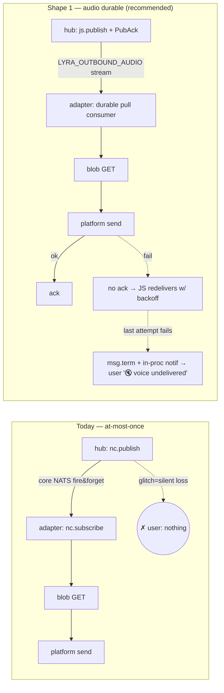

## Source

> Le hub publie les events audio outbound via core NATS (at-most-once). Un glitch réseau
> du subscriber = perte silencieuse, aucune notif user. (issue #1482)

Frame premise agreed (Model A): hub does durable-publish-once (`PubAck`), holds **no retry
state**; redelivery is **JetStream-owned**; the adapter is a durable consumer that **acks
after send-to-user succeeds**. Terminal failure → explicit user-notif.

## Problem

Outbound audio travels hub → NATS → adapter → blobstore GET → platform send. Today every
hop on the NATS leg is **core NATS, fire-and-forget**:

- Publish: `NatsChannelProxy.render_audio` → `await self._nc.publish(subject, payload)`
  (`src/lyra/nats/nats_channel_proxy.py:313`). No `PubAck`, no `Nats-Msg-Id`.
- Subscribe: `NatsOutboundListener.start` → `await self._nc.subscribe(subject, queue=…, cb=…)`
  (`src/lyra/adapters/nats/nats_outbound_listener.py:91`). No durable consumer, no ack, no
  persistence.

A subscriber TCP glitch drops the event with zero trace; the hub already logged `dispatched`
(publish-local success). The user gets neither audio nor an error.

The audio bytes are **not** lost — they are durable + content-addressed in `FsBlobStore`;
the wire payload is a `BlobRef` pointer (`OutboundAudio`, `src/lyra/core/messaging/message.py:161`).
The lost thing is the tiny pointer event. So the fix is: **persist + redeliver the event**.

## Outcome

Every outbound voice either reaches the user OR the user receives an explicit "voice
failed" message. Zero silent drops, verifiable under a TCP-glitch test. Hub holds no
per-message retry state.

## Appetite

1-week cycle. Audio-first; do not boil the ocean on all outbound types.

## Existing precedent (the spine to copy)

`TurnPublisher` is the in-repo α-pattern (ADR-075) and the template:

| Concern | Turns (exists) | Outbound audio (today) |
|---|---|---|
| Publish | `js.publish(SUBJECTS.turn_write)` + await PubAck (`transport/turn_publisher.py:60`) | `nc.publish()` fire-and-forget |
| Stream | `LYRA_TURNS` WorkQueue, `lyra.turns.>`, dup-window 60s (`stream_setup.py:37`) | **none** for `lyra.outbound.>` |
| Consumer | `turn-writer-v1` durable pull, AckExplicit, AckWait 60s, MaxDeliver 5 (`stream_setup.py:59`) | core `nc.subscribe()`, no ack |
| Idempotency | dup-window + DB `UNIQUE(platform, message_id)` | **none** |
| Subject contract | `roxabi_contracts.turns.SUBJECTS` | f-string in 2 places, no contract |

## Shapes

### Shape 1: Audio-only durable JetStream path (dedicated stream + consumer) — RECOMMENDED

Introduce delivery guarantee for **audio envelopes only**, leaving text/streaming on core
NATS untouched.

- **Publish**: audio publishes via `js.publish(...)` + `PubAck` + `Nats-Msg-Id = stream_id`
  (dedup key). Hub stays stateless — it just swaps `nc.publish → js.publish` on the audio
  branch of `NatsChannelProxy`.
- **Subject (decided)**: dedicated `lyra.outbound.audio.{platform}.{bot_id}`. Clean stream
  filter; no envelope-type sniffing. (Subject-vs-filter variant moved to open #1, but the
  shape commits to the dedicated subject.)
- **Stream**: new `LYRA_OUTBOUND_AUDIO` covering `lyra.outbound.audio.>`, **Limits retention**
  (see Decided D2 — Limits, not WorkQueue, because N×M per-bot subjects each need their own
  consumer and WorkQueue allows only one consumer per filter), dup-window 60s, mirroring
  `LYRA_TURNS` sizing otherwise.
- **Consume**: adapter adds a **second** listener — a JS durable pull consumer (AckExplicit,
  AckWait, MaxDeliver) for audio — alongside the existing core-NATS listener for text.
  Flow: pull → blob GET → platform send → **ack on send success**; any failure → no ack →
  JS redelivers with backoff.
- **Terminal (decided)**: on the final failed attempt the consumer calls **`msg.term()`**
  (ack-channel signal, NOT the max-deliveries advisory — see Decided D1) and, in-process,
  sends a lightweight "🔇 voice couldn't be delivered" notif to the user — mirroring the
  existing hub-side TTS-failure notif (`tts_dispatch.py:261-299`). No fallback-to-text:
  the text reply is **always dispatched before audio** (`tts_dispatch.py:189`), so the user
  already has the content; a bare notif suffices.
- **Idempotency**: dedup-window covers in-flight dup publishes; a consume-side sent-set keyed
  on `stream_id` guards the lost-ack window, with **TTL ≥ AckWait × MaxDeliver** (Decided D3).
- **GET-audit**: demoted to **observability only** — GET proves *fetch*, not *send-success*,
  so it cannot be the ack mechanism. Useful for redelivery-rate monitoring.

**Trade-offs:**
- Pro: smallest blast radius matching frame scope (audio-first); hub stays stateless; copies
  a proven in-repo pattern; text/streaming semantics untouched (no redelivery hazard).
- Pro: streaming text's "latest-edit-wins" semantics are preserved — stays at-most-once
  where redelivery would be *wrong*.
- Con: two parallel delivery paths in the adapter (core-NATS text + JS audio); subject-scheme
  divergence (`lyra.outbound.audio.*`, see Open #5 / ADR-035); adapter gains a JetStream API
  grant it lacks today (see Operational).

**Rough scope:** **L** (durable publish + JS consumer + ack-after-send + dedup + term-notif
+ ACL/stream provisioning + tests). Sliced for the 1-week appetite — see Fit Check.

### Shape 2: Whole-outbound JetStream migration (uniform)

Put **all** of `lyra.outbound.>` on a stream; migrate `NatsOutboundListener` from core
`nc.subscribe()` to a JS durable consumer for every outbound type (text, audio, edits).

**Trade-offs:**
- Pro: uniform — one delivery path, no dual-listener; subject scheme unchanged.
- Con: **streaming-text redelivery hazard (concrete)**: streaming replies emit a
  placeholder then a rapid sequence of edits. Under at-least-once redelivery, edit *N* can be
  redelivered *after* edit *N+2* has already rendered → the user sees the message **regress**
  to stale text, or a duplicate placeholder appears. "Latest wins" is correct for text and
  fundamentally incompatible with ordered redelivery. This is not tunable away.
- Con: largest blast radius — every outbound path changes at once.
- Con: over-scopes a 1-week appetite; couples the audio fix to a full transport rewrite.

**Rough scope:** XL — **deferred** (semantics conflict + appetite).

### Shape 3: GET-audit oracle + hub-side timeout (keep core NATS) — ELIMINATED

Keep core NATS publish/subscribe. Add a hub-side correlator that watches
`lyra.audit.blobs.get` for the published `store_key`; no GET within a timeout → fire
user-notif and/or republish.

**Trade-offs:**
- Pro: reuses the existing (currently unconsumed) GET-audit stream; no consumer migration.
- Con: **violates Model A** — the hub becomes stateful (per-message pending table + timers),
  re-implementing what JetStream gives for free, and loses its queue on hub restart.
- Con: GET proves *fetch*, not *send-success* — the adapter→user send can still fail after
  the GET, so this oracle is blind exactly where the user notices.
- Con: timeout tuning is a race (slow blobstore vs lost event indistinguishable).

**Rough scope:** M — but **eliminated** (premise conflict + blind spot).

## Fit Check

(Shape 3 omitted from the diagram: it keeps the Today topology and bolts a stateful hub-side
timer onto it — eliminated, so not drawn.)

**Recommended: Shape 1.** Only shape consistent with the Model A premise (hub stateless,
redelivery JS-owned) *and* the frame's audio-first scope. Shape 3 eliminated by the premise
(stateful hub) + the fetch≠send blind spot. Shape 2 deferred — over-scopes the appetite and
breaks streaming-text "latest wins".

### Out of scope (by design — not a gap to close)

- **Text / image outbound stay at-most-once intentionally.** Streaming text wants "latest
  wins"; redelivery would corrupt it (Shape 2 con). This is a deliberate semantic boundary.
- `render_audio_stream` / `render_voice_stream` are dropped over NATS today
  (`nats_channel_proxy.py:315`) — remain out of scope (Open #6).

### Slicing (1-week appetite → ship incrementally)

- **Slice 1 (core guarantee)**: contract subject + `LYRA_OUTBOUND_AUDIO` stream + ACL +
  hub `js.publish`+PubAck + adapter durable consumer + ack-after-send + dedup. Ships the
  delivery guarantee; redelivery covers transient glitches. Already an improvement over today.
- **Slice 2 (terminal notif)**: `msg.term()` on final failure + in-process "voice undelivered"
  notif. Closes the explicit-failure half of the Outcome.

### Decided (closed by expert review)

- **D1 — Terminal trigger = `msg.term()` + in-process emit**, NOT the max-deliveries advisory.
  The advisory (`$JS.EVENT.ADVISORY.CONSUMER.MAX_DELIVERIES.>`) is itself a best-effort
  core-NATS publish → a glitch on the advisory subscriber reproduces the exact silent-loss
  bug. `term()` rides the ack channel the consumer already owns.
- **D2 — Retention = Limits, not WorkQueue.** WorkQueue allows exactly one consumer per
  subject filter; with N bots × M platforms = N×M subjects each needing a consumer, Limits
  (with per-consumer `filter_subject`) is simpler and gives the same single-consumer-per-bot
  delivery guarantee.
- **D3 — Idempotency: `Nats-Msg-Id = stream_id` + consume-side sent-set, TTL ≥ AckWait ×
  MaxDeliver.** The sent-set is load-bearing for the post-dup-window crash-republish case,
  not belt-and-suspenders.
- **D4 — Notif UX = lightweight "voice undelivered", no fallback-to-text.** Text is always
  dispatched before audio (`tts_dispatch.py:189`); reuse the `_route_outbound` notif pattern
  (`tts_dispatch.py:294`).

## Operational impact (devops review)

- **Provisioning owner**: adapter bootstrap, via idempotent `ensure_stream`/`ensure_consumer`
  at startup — same pattern as `LYRA_TURNS` in `turn_writer_standalone.py:73` /
  `infrastructure/turn_writer/stream_setup.py`. NOT a manual script, NOT hub-owned.
- **Sizing (proposed)**: `LYRA_OUTBOUND_AUDIO` — MaxBytes ≈ **32 MiB** (BlobRef pointers are
  < 1 KB/event; far below LYRA_TURNS 256 MiB), MaxAge 24h, dup-window 60s. AckWait > 60s
  (audio send = blob GET + upload, slower than a turn write); MaxDeliver 5 (turns parity).
- **ACL changes (`deploy/nats/auth.conf`) — all require NATS container restart** (auth is a
  `type=mount` secret, not HUP-refreshable):
  1. Hub publish: add `lyra.outbound.audio.>`.
  2. Adapter subscribe: add `lyra.outbound.audio.{platform}.>` per adapter.
  3. Adapter JS API: add `$JS.API.CONSUMER.MSG.NEXT.LYRA_OUTBOUND_AUDIO.>` (+ CREATE/INFO —
     adapters today have only core `nc.subscribe`, **no JetStream grant**).
- **Deploy order (hard dependency)**: (1) update `auth.conf` → restart `lyra-nats` →
  (2) bootstrap stream (idempotent ensure at adapter boot) → (3) deploy hub w/ `js.publish` →
  (4) deploy adapters w/ pull consumer. Publishing to a JS subject with no stream / no ACL =
  `js.publish` error (NoResponders / permissions) — fail-fast, no silent loss.

### Acceptance-criteria seeds (for /spec)

1. TCP glitch mid-delivery → redelivered within AckWait → send succeeds on retry → audio
   delivered, **no duplicate** to user.
2. Adapter down at publish time → on restart, pending audio consumed + delivered (Limits
   retention holds it).
3. MaxDeliver exhausted (all attempts fail) → user receives explicit "voice undelivered"
   notif; no silent drop.
4. Lost-ack double-redeliver → `Nats-Msg-Id` + sent-set prevents double-send.
5. Hub publish succeeds even with no consumer online (no loss at publish).

### Files likely impacted (Shape 1)

| File | Change |
|---|---|
| `packages/roxabi-contracts/.../outbound/subjects.py` (new) | audio subject helper `lyra.outbound.audio.{platform}.{bot_id}` |
| `src/lyra/nats/nats_channel_proxy.py` | `render_audio`: `nc.publish` → `js.publish` + `Nats-Msg-Id`; needs JS handle |
| `src/lyra/adapters/nats/nats_outbound_listener.py` | add JS durable pull consumer for audio (2nd listener) + ensure_stream/consumer |
| `src/lyra/adapters/nats/nats_envelope_handlers.py` | ack-after-send; consume-side dedup; `term()` + notif on final fail |
| `infrastructure/turn_writer/stream_setup.py` (pattern source) | new `outbound_audio` stream-setup module mirroring it |
| `deploy/nats/auth.conf` | hub publish + adapter subscribe + adapter JS API grants |
| tests | TCP-glitch redelivery; ack-after-send; dedup; term-notif |

### Open sub-decisions for /spec

1. **Subject vs envelope filter**: dedicated `lyra.outbound.audio.*` (shape default) vs
   filtering audio on the existing subject. Default = dedicated.
2. **Exact AckWait value**: 90s? 120s? — bound by worst-case blob GET + platform upload.
3. **sent-set storage**: in-memory dict-with-TTL vs small SQLite (survives adapter restart?).
   Restart durability trades against simplicity.
4. **Notif i18n key**: reuse `_msg()` localized string for "voice undelivered".
5. **Subject naming vs ADR-035** (`lyra.{domain}.{qualifier}`): `lyra.outbound.audio.*`
   introduces a new axis → ADR update or naming justification; update outbound CLAUDE.md table.
6. **Streaming audio** (`render_audio_stream`/`render_voice_stream`): confirm out-of-scope.
