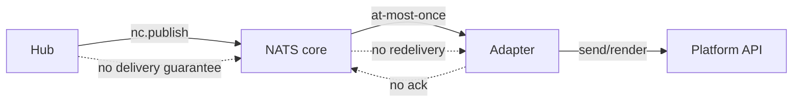
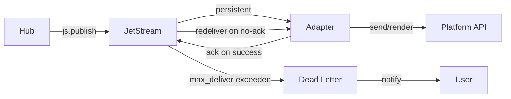

## Source

Issue #1482: "Le hub publie les events audio outbound via core NATS (at-most-once). Un glitch réseau du subscriber = perte silencieuse, aucune notif user."

## Problem

Hub-side `NatsChannelProxy` publishes outbound messages (text, audio, attachments, streaming chunks) via core NATS `nc.publish()` to `lyra.outbound.{platform}.{bot_id}`. The adapter-side `NatsOutboundListener` subscribes via `nc.subscribe()` (core NATS, at-most-once delivery). No delivery guarantee exists.

Confirmed causal chain:
- Hub publish succeeds locally → log shows "dispatched" → event may never reach subscriber
- Adapter network glitch → event silently lost
- No user notification → silent failure
- Current codebase has `OutboundErrorHandler` but it only handles errors *after* the adapter receives the message, not delivery failures

## Outcome

Outbound audio (and text/streaming) delivery is guaranteed: no silent loss, user notified on final failure. Same mechanism across Telegram and Discord. Observable via metrics: delivery success/failure rate, retry count, final-failure notification count.

## Appetite

1 sprint (2 weeks). Touching transport + adapter + bootstrap wiring.

## Shapes

### Shape 1: JetStream persistence + explicit ack + retry + user notification

**Description:**
1. Create a JetStream stream for outbound topics (`lyra.outbound.{platform}.{bot_id}`)
2. Hub publishes via `js.publish()` — persistence guarantee
3. Adapter subscribes via `js.subscribe()` with `manual_ack` + `max_deliver` (e.g., 3)
4. Adapter acks after successful processing (send to platform API succeeds)
5. On unacknowledged delivery, JetStream auto-redelivers
6. After `max_deliver` exhausted, publish to a dead-letter subject
7. Dead-letter consumer sends user-facing failure notification

**Trade-offs:**
- Pro: Full at-least-once delivery guarantee with bounded retry. JetStream already in stack. Backward-compatible transition possible (dual-publish during migration).
- Con: Most complex. Requires new stream bootstrap, ack discipline across all envelope types (send, audio, attachment, stream), dead-letter handling, user notification logic.
- Pro: Same mechanism covers text, audio, attachments, streaming.

**Rough scope:** L (3–4 files new, 4–5 files modified, bootstrap wiring)

**Files impacted:**
| File | Change |
|------|--------|
| `deploy/nats/bootstrap_streams.py` | Add `lyra-outbound` stream config |
| `src/lyra/nats/nats_channel_proxy.py` | Switch `nc.publish` → `js.publish` for outbound |
| `src/lyra/adapters/nats/nats_outbound_listener.py` | Switch `nc.subscribe` → `js.subscribe` with manual ack |
| `src/lyra/adapters/nats/nats_envelope_handlers.py` | Add ack after successful adapter dispatch |
| `src/lyra/bootstrap/factory/wiring_helpers.py` | Wire `JetStreamContext` into `NatsChannelProxy` and `NatsOutboundListener` |
| `src/lyra/outbound/error_handler.py` | Add failure notification callback |
| `src/lyra/adapters/telegram/telegram_outbound.py` | Add `send_failure_notification()` callback |
| `src/lyra/adapters/discord/discord_outbound.py` | Add `send_failure_notification()` callback |

### Shape 2: Ack + retry without JetStream persistence

**Description:**
1. Keep core NATS but switch to request-reply pattern
2. Hub publishes outbound messages and waits for adapter ack (with timeout)
3. Adapter replies with ack after successful processing
4. Hub retries on timeout (bounded retry with backoff)
5. After max retries, hub sends failure notification directly (hub has user context)

**Trade-offs:**
- Pro: No new JetStream streams needed. Simpler infra.
- Con: Hub must block waiting for ack — introduces latency and coupling. Request-reply is not natural for streaming (many chunks). Harder to implement for multi-chunk streaming.
- Con: Retry logic lives in hub, not NATS — more code, more bugs. No persistence across hub restart.

**Rough scope:** M (2–3 files new, 3–4 files modified)

**Files impacted:**
| File | Change |
|------|--------|
| `src/lyra/nats/nats_channel_proxy.py` | Add request-reply publish with timeout |
| `src/lyra/adapters/nats/nats_outbound_listener.py` | Add ack reply after dispatch |
| `src/lyra/adapters/nats/nats_envelope_handlers.py` | Wire reply into handlers |
| `src/lyra/outbound/error_handler.py` | Add hub-side retry + notification |

### Shape 3: JetStream persistence only (no explicit ack, no retry, no notification)

**Description:**
1. Convert outbound topics to JetStream stream
2. Hub publishes via `js.publish()` — persistence guarantee
3. Adapter subscribes via `js.subscribe()` with auto-ack
4. JetStream redelivers on subscriber disconnect
5. No explicit ack from adapter → no retry on processing failure
6. No user notification on final failure

**Trade-offs:**
- Pro: Minimal change. Eliminates silent loss from network glitches (the most common case). Single file change in bootstrap + proxy/listener.
- Con: Does NOT handle the case where subscriber receives message but fails to process it (e.g., Telegram API rate limit, blobstore fetch failure, malformed audio). Silent loss persists on non-network failures.
- Con: Does not meet the full issue requirement (ack + user notification).

**Rough scope:** S (1–2 files modified)

**Files impacted:**
| File | Change |
|------|--------|
| `deploy/nats/bootstrap_streams.py` | Add `lyra-outbound` stream config |
| `src/lyra/nats/nats_channel_proxy.py` | Switch `nc.publish` → `js.publish` |
| `src/lyra/adapters/nats/nats_outbound_listener.py` | Switch `nc.subscribe` → `js.subscribe` |

## Fit Check

**Shape 1 is recommended.**

- It is the only shape that satisfies all constraints: delivery guarantee + explicit ack + retry + user notification.
- JetStream is already in the stack (`TurnPublisher`, `JetStreamAuditSink`, `turn_writer`) — no new dependency.
- The bootstrap script `deploy/nats/bootstrap_streams.py` already exists and can be extended.
- The issue explicitly lists "JetStream pour outbound topics" as option 1 and "Ack explicite + retry" as option 2 — Shape 1 combines both.
- Shape 2 is rejected because request-reply is unnatural for streaming (many chunks per turn) and introduces hub-side coupling.
- Shape 3 is rejected because it doesn't handle processing failures and doesn't provide user notification — the core gap in the issue.

**Risk:**
- Ack discipline must be added to ALL envelope handlers (`handle_send`, `handle_audio`, `handle_attachment`, `handle_chunk`/`_drain_stream`). Missing any = silent loss path remains.
- Streaming is more complex: chunks must be acked individually or as a batch. Per-chunk ack adds overhead; batch ack risks reprocessing already-rendered chunks.
- Backward compatibility: during deploy, hub may be on new code (JetStream publish) while adapter is on old code (core NATS subscribe). Dual-publish or migration window needed.

## Mermaid: Current Flow (at-most-once)

## Mermaid: Shape 1 Target Flow (at-least-once + ack)

