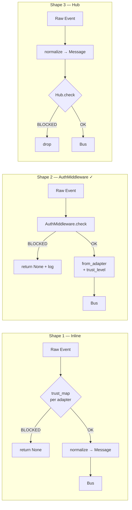

## Source

Issue #151 — *"feat(auth): AuthMiddleware + TrustLevel par adapter"*

> Implement AuthMiddleware at the Adapter level, before the Bus. The message is rejected at the source if the user is not authorized.
> — `docs/architecture/security-routing.md#auth`

## Problem

Without authentication, any Telegram or Discord user can send a message that reaches the InboundBus and triggers an LLM call. The hub itself does not filter by identity — `hub.py:register_adapter()` explicitly states: *"The adapter is responsible for authenticating"*.

The existing `trust: Literal["user", "system"]` field on `Message` is an internal marker (system vs user messages) with no authorization value: all Telegram/Discord messages receive `trust="user"` indiscriminately.

## Outcome

- Unauthorized messages are rejected **before** `_normalize()` — no resources consumed.
- Authorized messages carry an identity trust level propagated downstream for routing and command gating.
- Authorization config is loaded from the existing TOML config at startup.
- Rejections are logged (user_id, channel, timestamp).

## Appetite

1 dev cycle (~3–5 days). Tier F-full: shared infrastructure + 3 adapters + tests.

## Findings

### Message.trust vs TrustLevel

`trust: Literal["user", "system"]` on `Message` is orthogonal to `TrustLevel`:
- `trust="system"` — reserved for internal hub messages (not from an adapter)
- `TrustLevel` — authorization level of the external user

No conflict — both fields coexist. `TrustLevel` is a new additive field.

**Constraint:** `trust_level` must be passed into `from_adapter()` as a required parameter — not set post-construction. This ensures no `Message` object exists without a `trust_level` and keeps the `from_adapter()` factory as the single authorised construction path.

**Note:** `trust_level` must never be propagated into `msg.metadata` downstream.

### Integration points

| Adapter | Entry method | Line |
|---------|-------------|------|
| `TelegramAdapter` | `_on_message()` | ~363 |
| `TelegramAdapter` | `_on_voice_message()` | ~269 |
| `DiscordAdapter` | `on_message()` | ~162 |
| `CLIAdapter` | n/a | ∅ |

### CLIAdapter gap — included in scope

No `CLIAdapter` exists in `src/lyra/adapters/`. `cli_pool.py` is an LLM subprocess pool, not an inbound adapter.

**Decision:** create a minimal `CLIAdapter` stub as part of this issue. `TrustLevel.OWNER` hardcoded — no config section needed for CLI. Auth is a no-op (always OWNER), but the adapter is wired through the same `AuthMiddleware` interface for consistency.

`AuthMiddleware.from_config()` must handle a missing `[auth.cli]` section gracefully — return a fixed-OWNER middleware rather than raise.

### Config placement

`src/lyra/config/auth.toml` as a standalone file is unnecessary complexity for 4–8 lines of data. Prefer inline sections in the existing config file used by `__main__.py`:

```toml
[auth.telegram]
owner_users   = ["7377831990"]
trusted_users = ["7377831990"]
default       = "blocked"

[auth.discord]
trusted_roles = ["admin", "trusted"]
default       = "blocked"
```

One load path, one secrets surface, consistent with existing adapter credential management. Avoids a second `tomllib.load()` call and a separate file to provision on Machine 1.

### Config loading failure

**Security-critical edge case:** if the auth section is absent or malformed at startup, the system must **fail closed** (default = `BLOCKED`) — never fail open. `AuthMiddleware.from_config()` must raise `SystemExit` or default to `BLOCKED` if the section is missing when `default` is unset.

## Shapes

### Shape 1 — Inline guard per adapter (minimal)

Auth checked directly in each `on_message()` without a shared class. `TrustLevel` defined in `message.py`. Each adapter reads its own config section.

```python
# In TelegramAdapter._on_message()
user_id = str(msg.from_user.id) if msg.from_user else None
trust = self._trust_map.get(user_id, TrustLevel.BLOCKED)
if trust == TrustLevel.BLOCKED:
    return
hub_msg = self._normalize(msg, trust_level=trust)
```

**Trade-offs:**
- Pro: no new abstractions, straightforward
- Con: logic duplicated across 3 adapters; config loading repeated; hard to unit test
- Con: future extension (e.g. PUBLIC tier, role-based Discord) = 3 files to modify

**Scope:** S

---

### Shape 2 — AuthMiddleware base class (spec-aligned) ✓

New `AuthMiddleware` class in `src/lyra/core/auth.py`. Each adapter receives an injected instance. Auth fires before `_normalize()`.

```python
# src/lyra/core/auth.py
class TrustLevel(Enum):
    OWNER   = "owner"
    TRUSTED = "trusted"
    PUBLIC  = "public"
    BLOCKED = "blocked"

class AuthMiddleware:
    def __init__(self, trust_map: dict[str, TrustLevel], default: TrustLevel):
        self._trust_map = trust_map
        self._default = default

    def check(self, user_id: str | None) -> TrustLevel:
        if user_id is None:
            return self._default
        return self._trust_map.get(user_id, self._default)

    @classmethod
    def from_config(cls, config: dict, section: str) -> "AuthMiddleware":
        """Parse config[auth][section] → AuthMiddleware. Fails closed if missing."""
        ...
```

Adapter integration:
```python
# TelegramAdapter._on_message()
user_id = str(msg.from_user.id) if msg.from_user else None
trust = self._auth.check(user_id)
if trust == TrustLevel.BLOCKED:
    log.info("auth_reject user=%s channel=telegram", user_id)
    return
# trust_level passed into from_adapter() — not set post-construction
hub_msg = Message.from_adapter(..., trust_level=trust)
```

**Trade-offs:**
- Pro: spec-aligned; centralized logic; testable in isolation
- Pro: `trust_level` on `Message` ready for issues #routing and #commands
- Pro: shared config parsing; extensible (future: Discord roles, rate-limiting per tier)
- Con: new class + injection wiring in `__main__.py` for 3 adapters

**Scope:** M

---

### Shape 3 — Hub-level auth (post-normalize)

Auth in `Hub` or `InboundBus.put()` after `Message` is constructed.

```python
# In Hub.dispatch() or InboundBus
trust = self._auth_registry.check(msg.platform, msg.user_id)
if trust == TrustLevel.BLOCKED:
    return
```

**Trade-offs:**
- Pro: single implementation point
- Con: `_normalize()` runs for blocked messages — wasted work
- Con: **contra-spec** — issue and `security-routing.md` explicitly require rejection *before* the Bus
- Con: `user_id` already extracted in adapter; duplicates extraction or couples hub ↔ adapters

**Scope:** M (but wrong separation boundary)

## Fit Check



**Shape 2 retained.** Shape 3 eliminated (contra-spec; `Message` created wastefully). Shape 1 eliminated (duplication; not extensible).

Shape 2 is the only option that:
1. Rejects before `_normalize()` — no resources consumed
2. Centralises logic in a testable class
3. Propagates `trust_level` inside `Message` for downstream issues (#routing, #commands)
4. Integrates cleanly into existing `__main__.py` wiring

### Files impacted (Shape 2)

| File | Action |
|------|--------|
| `src/lyra/core/auth.py` | Create — `TrustLevel` enum + `AuthMiddleware` class |
| `src/lyra/core/message.py` | Modify — add `trust_level: TrustLevel` to `Message` + `from_adapter()` |
| `src/lyra/adapters/telegram.py` | Modify — `_on_message()`, `_on_voice_message()`, inject `_auth` |
| `src/lyra/adapters/discord.py` | Modify — `on_message()`, inject `_auth` |
| `src/lyra/__main__.py` | Modify — wire `AuthMiddleware.from_config()` for each adapter |
| `tests/test_auth.py` | Create — unit tests for `AuthMiddleware` + `from_config()` (incl. missing section) |
| `tests/test_adapters_auth.py` | Create — integration: verify `_normalize()` is **not called** for `BLOCKED` messages |

| `src/lyra/adapters/cli.py` | Create — minimal `CLIAdapter` stub with `TrustLevel.OWNER` hardcoded |

`AuthMiddleware.from_config()` handles absent `[auth.cli]` → returns `OWNER`-default middleware.
