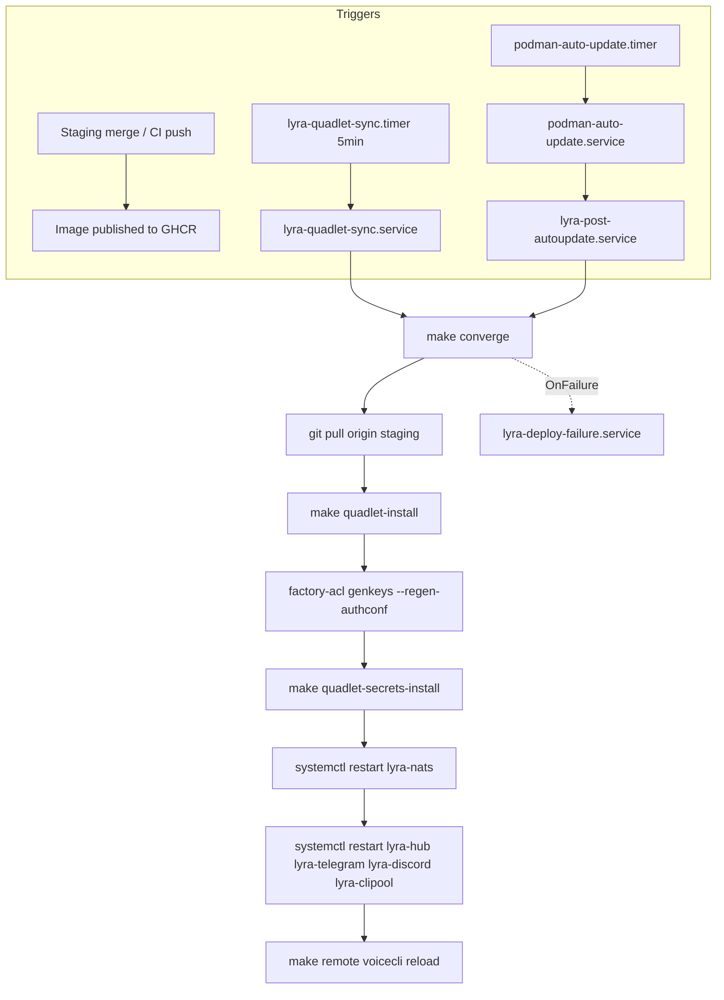

## Source

> Overlapping deploy paths today: deploy, full-deploy, quadlet-install, quadlet-sync-install, nats-regen-authconf, nats-setup, install.sh, provision.sh, lyra-quadlet-sync.sh, setup.py (28 make targets total). Image autoupdate (image-only) silently wins and leaves git/auth.conf/units stale — the root cause of the 2026-05-31 incident.
>
> Do: collapse to one `make deploy` (pull -> render -> regen auth.conf -> secrets -> restart, atomic), triggered on staging merge / from the autoupdate hook so config converges with code. Fix non-interactive PATH (.venv/bin for factory-acl/uv/lyra) so it runs headless without aborting half-applied.

— Issue #1578, 2026-05-31

## Problem

1. **Target proliferation:** The Makefile has 28 targets, with 9+ related to deploy/install. `deploy` and `full-deploy` are similar but differ in whether they regen auth.conf/secrets/restart. This creates operator confusion and the risk of using the wrong verb.

2. **Autoupdate gap:** `lyra-quadlet-sync.sh` runs every 5 minutes and only calls `make quadlet-install` when `deploy/quadlet/`, `Makefile`, or `tools/render_quadlet.py` changed. It does **not** detect image digest changes. `podman-auto-update.timer` (daily) restarts containers when the image changes, but leaves git checkout, auth.conf, and Quadlet units stale. This was the root cause of the 2026-05-31 incident.

3. **PATH fragility:** `lyra-quadlet-sync.service` sets `PATH=%h/.local/bin:/usr/local/bin:/usr/bin:/bin`. It does **not** include `.venv/bin`, where `factory-acl` (used by `nats-regen-authconf` and `full-deploy`) lives. Running headless causes "command not found" mid-deploy, leaving the system half-converged.

4. **voiceCLI convergence gap:** `full-deploy` currently pulls and installs `voiceCLI` units too. The new atomic verb must handle this or document the gap.

## Outcome

Any deploy trigger (staging merge, autoupdate, or manual operator action) converges the host to a single atomic verb: `make converge`. The host always matches HEAD after the verb completes. No half-applied states. No operator confusion about which target to run.

## Appetite

1-week cycle (single deploy/infrastructure change, no new services).

## Shapes

### Shape 1: Expand sync script to full converge

Modify `lyra-quadlet-sync.sh` to run the complete sequence (git pull → render → regen auth.conf → secrets → restart) instead of only `make quadlet-install`. Add image-digest change detection to the script. Fix PATH in `lyra-quadlet-sync.service`.

**Trade-offs:**
- Pro: Minimal file changes (1 script + 1 service file). Reuses existing 5-minute timer.
- Con: Still polling-based (5-minute latency). Script grows monolithic. No clear separation between "sync" and "deploy" semantics.

**Rough scope:** S

### Shape 2: New atomic `make converge` + wire sync and autoupdate to it

Create a new `make converge` target (renamed from `make deploy` to avoid collision with the existing remote SSH target) that is idempotent and atomic: `git pull → quadlet-install → nats-regen-authconf → secrets-install → restart`. Modify `lyra-quadlet-sync.sh` to call `make converge` (instead of `make quadlet-install`). Add a post-autoupdate systemd unit (`lyra-post-autoupdate.service`) that runs after `podman-auto-update.service` and calls `make converge`. Fix PATH in both service files. Deprecate `deploy`, `full-deploy`, and other overlapping targets. Add `flock` lockfile to prevent concurrent execution. Add `OnFailure` unit for failure notification.

**Trade-offs:**
- Pro: Clean separation — one verb, one semantics. Event-driven (sync timer + autoupdate). Idempotent and safe to run multiple times.
- Con: Requires creating a new systemd unit and understanding `podman-auto-update` integration. More moving parts.

**Rough scope:** M

### Shape 3: Make `converge` the only verb, delete the rest

Collapse `deploy`, `full-deploy`, `quadlet-install`, `quadlet-sync-install`, `nats-regen-authconf`, `nats-setup`, `install.sh`, `provision.sh`, `lyra-quadlet-sync.sh`, `setup.py` into a single `make converge` that handles all converge logic. Delete or alias the other 27 targets.

**Trade-offs:**
- Pro: Ultimate simplicity. One verb to rule them all.
- Con: High blast radius. Operator workflows (e.g. `make quadlet-install NO_RESTART=1`) break. Rollback impossible if the new target is buggy.

**Rough scope:** L

## Fit Check

**Recommended: Shape 2.**

- Shape 1 is too minimal — it doesn't solve the semantic confusion (28 targets remain) and the script becomes monolithic.
- Shape 3 is too aggressive — it breaks existing workflows and introduces high rollback risk.
- Shape 2 creates the single atomic verb while preserving existing targets during the transition. It wires both the sync timer and autoupdate to the same verb, ensuring config always converges with code.

**Constraint alignment:**
- Atomicity: `make converge` uses `set -euo pipefail` and stops on failure. No rollback yet (deferred), but failure state is clear — services are NOT restarted, leaving the host in a known pre-restart state.
- Headless: PATH fix includes `%h/projects/lyra/.venv/bin` explicitly in both service files.
- Staging merge + autoupdate: both call `make converge`.
- Non-breaking: existing targets remain (deprecated but functional) until the new verb is proven.
- Concurrency: `flock` lockfile (`/run/user/$(id -u)/lyra-deploy.lock`) prevents double-deploy.
- Failure notification: `lyra-deploy-failure.service` triggered by `OnFailure` sends notification.

## Files Impacted

| File | Role | Change |
|------|------|--------|
| `Makefile` | Define `make converge`, deprecate old targets, add `flock` | Modify |
| `deploy/lyra-quadlet-sync.sh` | Call `make converge` instead of `make quadlet-install` | Modify |
| `deploy/systemd/lyra-quadlet-sync.service` | Add `.venv/bin` to PATH | Modify |
| `deploy/systemd/lyra-post-autoupdate.service` | New unit: run `make converge` after `podman-auto-update` | Create |
| `deploy/systemd/lyra-post-autoupdate.timer` | New timer: check image digest and trigger deploy | Create |
| `deploy/systemd/lyra-deploy-failure.service` | New unit: `OnFailure` notification | Create |
| `deploy/CLAUDE.md` | Document new deploy verb and autoupdate wiring | Modify |
| `deploy/lib/deploy-common.sh` | New shared library: `flock` wrapper, PATH setup, failure hook | Create |

## Mermaid: Deploy Flow (Shape 2)

## Unresolved Concerns

1. **podman-auto-update integration:** `podman-auto-update.service` is a system unit (not user). A `OnSuccess` drop-in for the user instance may not fire. Verified approach: `lyra-post-autoupdate.timer` polls `podman images` digest against GHCR every 5 minutes (same cadence as sync), and `lyra-post-autoupdate.service` runs `make converge` when a change is detected.
2. **Atomicity edge case:** If `git pull` succeeds but `nats-regen-authconf` fails, the host has new code but stale auth. `make converge` stops before restart. No rollback mechanism yet (deferred). Operator must manually run `make nats-regen-authconf` and `make converge` again.
3. **Sudo in headless service:** `full-deploy` currently runs `sudo env "PATH=$$PATH" factory-acl genkeys --regen-authconf`. The new `make converge` must run `factory-acl` without sudo (or the service must have passwordless sudo for `factory-acl`). The `nats-regen-authconf` Makefile target already runs `factory-acl` without sudo, so this is consistent.
4. **`lyra bot init` fragility:** `make quadlet-install` runs `uv run lyra bot init`. Memory notes this currently throws pydantic validation errors on re-seed; a mid-deploy failure here leaves units copied but not verified. `make converge` must tolerate this step (e.g., `|| true` with explicit warning) or fix it first.
5. **voiceCLI convergence:** `make converge` should include `voiceCLI` pull + quadlet-install if `VOICE_DIR` is present. This is optional for the first iteration but should be documented.
