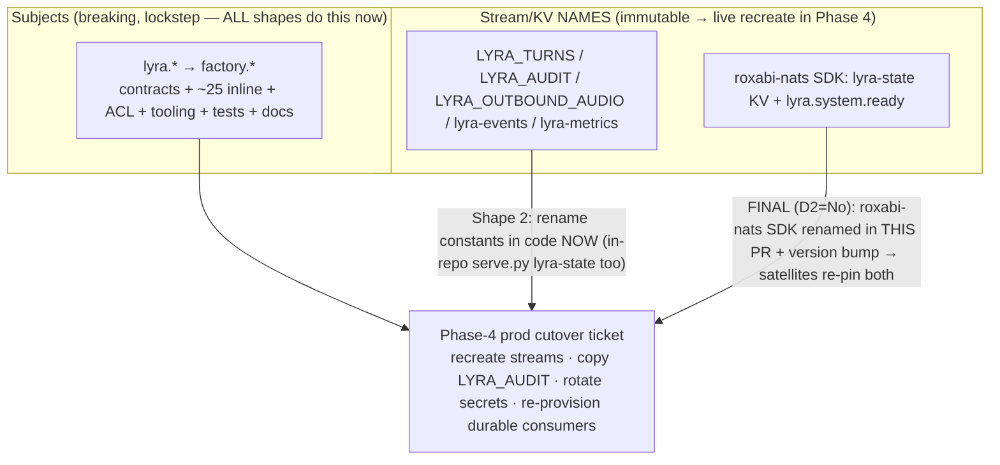

## Source

Issue #1670 (epic #1671, Phase 3): rename the wire contract `lyra.*` → `factory.*` across the
roxabi-contracts SSoT, the JetStream stream/KV identifiers, and the NATS ACL/auth config. Issue
body claims "**132** `lyra.*` subject literals across `src/roxabi_contracts/*/subjects.py`".

## Problem

The package/CLI/container identity is `factory.*` (PR #1669) but the NATS **wire** is still
`lyra.*`. Exact-match subjects mean a renamed publisher never reaches a `lyra.*` subscriber, so
the rename is breaking and must land in lockstep across peers.

## Outcome

Every `lyra.*` wire identifier in this repo + the roxabi-contracts package is renamed to
`factory.*`, contracts publishes ≥0.7.0, all in-repo gates stay green, and the change is
reviewable + Phase-4-cutover-ready — without losing `Literal` type-safety or audit history.

## Appetite

One focused F-full cycle for **code + contract + ACL + tooling + tests + docs**. The *live*
stream recreation / audit-history migration is the **Phase-4 prod-cutover runbook** (separate
ticket), not code shipped here.

---

## The crux — SUBJECTS are the wire; STREAM NAMES are server-internal

Read this first; the rest of the analysis depends on it.

| | Subjects (`lyra.X` → `factory.X`) | Stream/KV names (`LYRA_X` → `FACTORY_X`) |
|---|---|---|
| Cross-repo wire? | **Yes** — exact-match, breaking, must lockstep | Mostly **no** — server-internal (only `STREAM_AUDIO` leaks via contracts) |
| Mutable? | the literal is editable; a live stream's subject *filter* is updatable via `js.update_stream` | the stream **name is immutable** → recreate / drain / copy on the live server |
| When it must change | **now**, in lockstep with satellites | physically during the **Phase-4 maintenance window** |

Subjects are the breaking part. Stream names ride along in code but only physically change when
streams are recreated live in Phase 4.

---

## Scope Reality — the issue misframes scope in four ways

The "132 literals in `subjects.py`" framing is wrong in both directions, and four categories the
issue barely mentions dominate the effort. The critical one: stream names are immutable
server-side while subjects are not. All evidence agent-verified with file:line.

### Correction 1 — contracts package is small; the repo is large

- `roxabi-contracts/*/subjects.py` holds only **20 `Literal[...]` fields + 7 f-string builders
  ≈ 27 expressions** (not 132). `pyproject.toml:3` = `0.6.0`. Consumed as a **uv workspace
  member** (`pyproject.toml:81`, `uv.lock:1365`) — no in-repo version pin to bump; satellites
  pin in their own repos.
- The "132" is repo-wide (`src/`, `tests/`, `docs/`, ACL, fixtures).

### Correction 2 — ~25 inline wire-subject literals live OUTSIDE contracts

The issue's "code-side residue" names only `nats_bus.py`. Reality (all `[RENAME]`):

| Cluster | Files (file:line) | Subjects |
|---|---|---|
| clipool | `clipool_worker.py:36-38`, `hub_llm_client.py:33,42`, `llm/llm_client.py:34` | `lyra.clipool.{cmd,control,heartbeat}` |
| typing | `transport/typing_publisher.py:76`, `wiring_helpers.py:201,213`, `standalone_{telegram:120,discord:161}` | `lyra.typing.{platform}.{bot_id}` |
| outbound | `nats_channel_proxy.py:125,142,222,289`, `audio_publish.py:90`, `nats_outbound_listener.py:69`, `mint_failure_subscriber.py:47` | `lyra.outbound.{platform}.{bot_id}` |
| inbound | `nats_bus.py:67` (default arg) | `lyra.inbound` |
| gh | `mint_failure_subscriber.py:31` | `lyra.gh.mint_failure.>` |
| audit | `audit/jetstream_sink.py:19,56` | `lyra.audit.security`, `lyra.audit.>` |
| turns | `turn_writer/stream_setup.py:40,50` | `lyra.turns.write`, `lyra.turns.>` |
| outbound-audio | `outbound_audio/stream_setup.py:50`, `audio_consumer_bootstrap.py:27,85` | `lyra.outbound.audio.>` |

`scripts/check_subject_literals.py` (CI gate) is what keeps these honest.

### Correction 3 — streams/KV: only 1 of 4 is contract-sourced, and there are MORE than 4

| Identifier | Defined / created | Subjects | Retention | Source |
|---|---|---|---|---|
| `LYRA_TURNS` | `turn_writer/stream_setup.py:37,71` | `lyra.turns.>` | WorkQueue, 24h — **transient** | hardcoded in-repo |
| `LYRA_AUDIT` | `audit/jetstream_sink.py:55` | `lyra.audit.>` | Limits, **90d — DURABLE LOG** | hardcoded in-repo |
| `LYRA_OUTBOUND_AUDIO` | contracts `outbound/subjects.py:10` → `outbound_audio/stream_setup.py:70` | `lyra.outbound.audio.>` | 24h — transient buffer | **contracts** (`STREAM_AUDIO`) |
| `lyra-events` ⚠️ | `deploy/nats/bootstrap_streams.py:41` | `lyra.event.>` | 24h | hardcoded — **not in issue** |
| `lyra-metrics` ⚠️ | `deploy/nats/bootstrap_streams.py:49` | `lyra.metric.>` | 7d | hardcoded — **not in issue** |
| `lyra_outbound_audio_sent` (KV) ⚠️ | dedup, TTL 900s | — | transient | **not in issue** |
| `lyra-state` (KV) | `roxabi-nats/readiness.py:51,56` **AND** `blobstore/serve.py:70` | readiness keys | no-TTL, ephemeral | **SDK + in-repo** |

Notes:
- `monitoring/checks_audio.py:40` hardcodes a *duplicate* `LYRA_OUTBOUND_AUDIO` instead of
  importing `STREAM_AUDIO` → silently goes stale (latent bug 2).
- **`lyra-state` is referenced in BOTH `roxabi-nats/readiness.py` AND in-repo
  `blobstore/serve.py:70`.** The in-repo ref MUST be renamed here — deferring only the SDK side
  would leave hub writing `factory-state` while blobstore opens `lyra-state` (broken). The SDK
  side (`readiness.py`) is the only piece that needs a coordinated release (D2).

### Correction 4 — ACL pipeline + gates (issue half-right)

- `deploy/nats/acl-matrix.json` = hand-edited SSoT: **30 unique `lyra.*` subjects** (76 line
  occurrences, incl. `lyra.system.ready` — see SDK note below), `owner:"lyra"` on **6 identities**
  (hub, telegram-adapter, discord-adapter, clipool-worker, turn-writer, blobstore). Other owners
  (`voicecli`/`imagecli`/`reserved`) stay.
- **Two separate CI drift gates** (`ci.yml:93,96`), do not conflate:
  - `check-acl-authconf-drift.sh` → gates `deploy/nats/auth.conf`, regen via
    **`make nats-regen-authconf`** (`factory-acl genkeys`, reads acl-matrix.json + nkeys).
  - `check-acl-specs-drift.sh` → gates the spec sentinel block
    (`artifacts/specs/706-…mdx:25-92`, `<!-- acl-matrix:begin/end -->`) + fixture
    `tests/scripts/fixtures/v3-current.json`, regen via **`make nats-regen-specs`**
    (`render_acl_spec.py` + `render_acl_parity.py`).
  - The issue cited only `nats-regen-specs` — **both targets must run** or one gate breaks.
- **BLOCKING gate trap:** `render_acl_spec.py:31` hardcodes `SUBJECT_FILTERS=("lyra.",…)`. If
  acl-matrix is renamed but this tuple isn't patched to add `"factory."`, the spec renders
  *empty of factory subjects* and the drift gate **passes silently**. Patch it in the same commit.
- `tests/scripts/fixtures/v3-pre-grant-group.json` = **FROZEN** regression baseline — leave it.
- Other tooling: `check_subject_literals.py:176` (+ drop `lyra.inbound` from
  `subject_literals_allowlist.txt`), `code_inventory.py:299,318,601,677` (classifier prefix → add
  `factory.`), regenerate `docs/architecture/CURRENT.generated.md` via
  `tools/generate_architecture_snapshot.py` (architecture_snapshot gate), `smoke_llm_e2e.sh:17,113`.
  `doc_drift` / `hardcoded_constants` / `import_layers`: **no coupling**.
- Operational: `factory-nats.container:27` mounts auth.conf as `type=mount` secret → ACL change
  needs container **restart, not HUP**.

### A second cross-repo SDK wire subject (panel catch)

`roxabi-nats/readiness.py:29` hardcodes `READINESS_SUBJECT = "lyra.system.ready"` — subscribed/
published by every satellite that subclasses `NatsAdapterBase` (`wait_for_hub` /
`start_readiness_responder`). It is **a second wire identifier in the SDK**, alongside the
`lyra-state` KV. Both belong to the D2 `roxabi-nats` release sub-task. (`lyra.system.ready` also
appears in `acl-matrix.json` → the ACL side is renamed here; the SDK *constant* renames in the
sub-task.)

### Two latent bugs found

1. `auth.conf:25,34` grants `$JS.API.DIRECT.GET.LYRA_STATE.hub.ready`, but the KV bucket is
   `lyra-state` whose backing stream is `KV_lyra-state` → correct path
   `$JS.API.DIRECT.GET.KV_lyra-state.hub.ready`. Possibly broken today.
2. `checks_audio.py:40` hardcoded stream name diverging from contracts `STREAM_AUDIO`.

---

## Shapes

### Shape 1: Big-bang — one PR renames everything incl. the SDK

Rename contracts + inline subjects + stream-name constants + ACL + tooling + tests + docs **and**
the `roxabi-nats` SDK (lyra-state KV + `lyra.system.ready`) in one PR.

- **Pro:** atomic; nothing half-renamed.
- **Con:** very large PR; drags the `roxabi-nats` SDK release (which needs satellite re-pins) into
  this PR's critical path; couples release cadences that should stay independent.
- **Rough scope:** L–XL.

### Shape 2: Rename all subjects + all code constants now; defer ONLY the `roxabi-nats` SDK  ← recommended

Rename **all subjects** (contracts + ~25 inline + ACL + tooling + tests + docs) **and all in-repo
stream/KV name constants** (`LYRA_TURNS/AUDIT/OUTBOUND_AUDIO`, `lyra-events/metrics`,
`*_audio_sent`, **and `blobstore/serve.py` `lyra-state`**) so staging/test provision `FACTORY_*`
cleanly. **Defer only** the `roxabi-nats` SDK piece (`readiness.py` `lyra-state` KV +
`READINESS_SUBJECT`) to its own release-coordinated sub-task. The live stream recreation +
`LYRA_AUDIT` history copy = Phase-4 runbook ticket.

- **Pro:** keeps the breaking subject flip atomic; isolates the one genuine cross-package coupling
  (the SDK) without scope-inflating the PR; per-stream migration explicit; durable `LYRA_AUDIT`
  gets a named preservation plan.
- **Con:** the SDK sub-task becomes a formal **blocked-by** for Phase-4 (must be recorded).
- **Rough scope:** L.

### Shape 3: Subjects-only here, defer ALL stream-name renames to Phase 4

Rename only subjects; keep `LYRA_*`/`lyra-state` names; update live stream subject *filters* via
`js.update_stream` (confirmed in-repo at `turn_writer/stream_setup.py:84`).

- **Pro:** smallest change satisfying the breaking wire flip.
- **Con:** leaves split-brain naming (code says `LYRA_*`, wire says `factory.*`), notably
  `STREAM_AUDIO="LYRA_OUTBOUND_AUDIO"` in contracts; needs a follow-up issue. **Not loss-free:**
  messages published between the publisher flip and the `update_stream` call are dropped —
  acceptable for transient streams, **unsuitable for the 90-day `LYRA_AUDIT`** durable log.
- **Rough scope:** M–L.

---

## Fit Check

**Chosen: Shape 2's in-repo breadth + Shape 1's SDK inclusion (per D2=No).** All subjects + all
code/stream-name constants + the `roxabi-nats` SDK (lyra-state KV + `lyra.system.ready`) rename in
one PR; only the *live* stream recreation + `LYRA_AUDIT` history copy defer to the Phase-4 ticket.
The breaking subject flip stays atomic; the durable `LYRA_AUDIT` log gets a real preservation plan
(the trap Shape 1 risks and Shape 3 defers). Trade-off accepted: the satellite lockstep window now
re-pins roxabi-contracts **and** roxabi-nats together.

### Per-stream migration plan (Phase-4 runbook ticket — recorded here, executed there)

| Stream/KV | Strategy | Why / caveat |
|---|---|---|
| `LYRA_TURNS` → `FACTORY_TURNS` | drain-to-empty + delete + recreate | WorkQueue/24h; gate on `num_msgs==0` |
| `LYRA_OUTBOUND_AUDIO` → `FACTORY_OUTBOUND_AUDIO` | recreate on boot | 24h buffer, rebuildable |
| `lyra-events` / `lyra-metrics` | recreate on boot | observability, rebuildable |
| `*_audio_sent` / `lyra-state` KV | recreate | TTL/ephemeral |
| **`LYRA_AUDIT` → `FACTORY_AUDIT`** | **create-new + copy + verify count + delete old** | **90d security log — must NOT be lost.** ⚠️ Copied msgs keep their original `lyra.audit.*` subject in stored metadata (won't match `factory.audit.>`); audit consumers must replay by sequence, not key on `msg.Subject`. Document this. |

**Durable-consumer sequencing (runbook):** recreating a stream orphans its durable consumers
(`outbound-audio-{platform}-{bot_id}`, `turn-writer-v1`). Order: drain consumers → delete stream
→ recreate stream → restart pods to re-provision consumers; else in-flight durable messages are
lost.

**Auto-update interlock (load-bearing):** epic #1671 disabled `podman-auto-update.timer` on M₁ so
merge-to-staging does NOT auto-flip prod. This is the safety latch — Phase-4 must keep it disabled
until satellites are re-pinned, else `make converge` would run `factory-acl genkeys
--regen-authconf` + restart `factory-nats` automatically and break the (not-yet-migrated) peers.

---

## Decisions (resolved)

- **Stream-name constants in code:** rename **now**. Deferring leaves code saying `LYRA_*` after
  the wire says `factory.*` — split-brain with no safety gain.
- **Scope additions:** `lyra-events`, `lyra-metrics`, `lyra_outbound_audio_sent`, and in-repo
  `blobstore/serve.py` `lyra-state` are **all IN #1670** — they're `lyra.*` identifiers the CI
  subject/ACL gates would otherwise flag; excluding them = partial sweep.
- **Latent bugs 1 & 2:** **fix here** — both are single in-scope files.
- **D2 → NO split. The `roxabi-nats` SDK rename is IN this PR** — `readiness.py` `lyra-state` KV
  **+ `READINESS_SUBJECT="lyra.system.ready"`** rename here, with a `roxabi-nats` version bump.
  ⚠️ **Consequence:** the satellite lockstep now re-pins **both** roxabi-contracts 0.7.0 **and**
  the new roxabi-nats version. The satellite sub-issues (voiceCLI#189, llmCLI#105, imageCLI#104)
  must be updated to add the roxabi-nats re-pin to their cutover. (in-repo `blobstore/serve.py`
  lyra-state is renamed here too.)
- **D5 → YES.** `owner:"lyra"` → `owner:"factory"` on the 6 lyra-owned identities (hub,
  telegram-adapter, discord-adapter, clipool-worker, turn-writer, blobstore); others
  (`voicecli`/`imagecli`/`reserved`) unchanged.

## Files Impacted (summary)

contracts: 9 `subjects.py` + 8 tests + version · in-repo subjects: ~17 src files · streams:
`turn_writer/stream_setup.py`, `audit/jetstream_sink.py`, `outbound_audio/stream_setup.py`,
`deploy/nats/bootstrap_streams.py`, `checks_audio.py`, contracts `outbound/subjects.py`,
`blobstore/serve.py` (lyra-state) · ACL: `acl-matrix.json` + regen auth.conf (`nats-regen-authconf`)
+ spec sentinel + `v3-current.json` (`nats-regen-specs`) — NOT `v3-pre-grant-group.json` ·
tooling: `check_subject_literals.py`, `subject_literals_allowlist.txt`, `code_inventory.py`,
`render_acl_spec.py:31` (SUBJECT_FILTERS), `generate_architecture_snapshot.py` output,
`smoke_llm_e2e.sh` · tests: clipool/mint-failure/audio/loader/parity fixtures · docs:
`ARCHITECTURE.md`, `GETTING-STARTED.md`, ADRs, several CLAUDE.md · **SDK (in this PR, D2=No):**
`packages/roxabi-nats/` `readiness.py` (lyra-state KV + READINESS_SUBJECT) + version bump ·
**cross-repo follow-up:** update satellite sub-issues to re-pin roxabi-nats too · **Phase-4 ticket
(separate):** live stream recreate + LYRA_AUDIT copy + durable-consumer re-provision + secret rotation.

> CI coverage gap (devops): `bootstrap_streams.py` is an executable that talks to a live NATS
> server and is **not** run in CI — renamed stream configs there get no automated validation; flag
> for manual smoke in Phase-4. Also confirm committed `auth.conf` holds only public nkeys (drift
> gate normalizes to placeholder, but the file itself isn't scrubbed).
