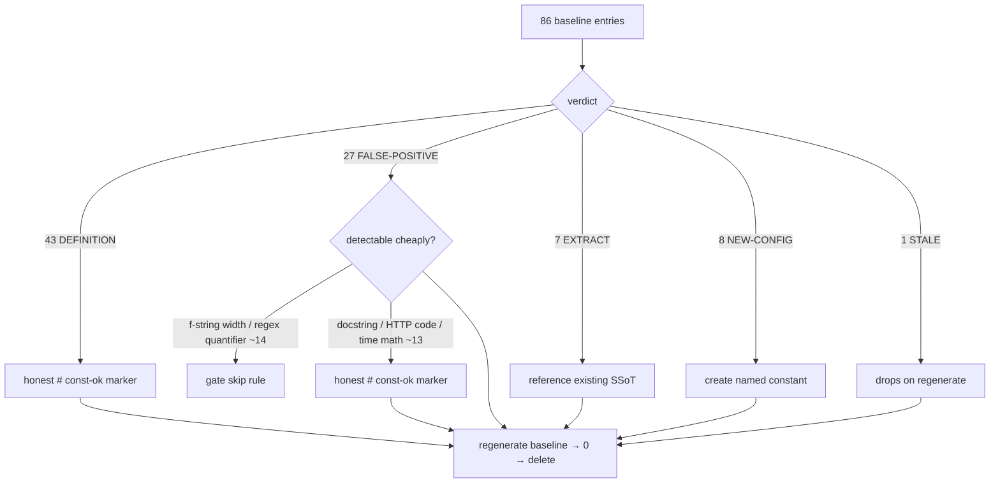

> **DECISION (approved 2026-06-02): Shape 3** — targeted safe gate skips (f-string format specs +
> regex quantifiers) + honest `# const-ok:` markers for definitions/prose + extract the 15 genuine
> magic numbers. Frame scope amended to permit the narrow `tools/check_hardcoded_constants.sh` change.

## Source

> The hardcoded-constant gate landed in #1654 with a committed baseline of 86 pre-existing numeric
> literals in `src/factory/core/` (`tools/hardcoded_constants_baseline.txt`). This issue burns that
> baseline down: extract each to a `Config` field or `Protocol` constant, removing its baseline entry,
> until the file is empty and can be deleted.
> **Done when:** `tools/hardcoded_constants_baseline.txt` has 0 active entries and the gate still exits 0 on a clean tree.

## Problem

A per-entry categorization of all 86 baseline lines (6 parallel readers, one per directory cluster)
overturns the framing premise. The baseline is **not** 86 un-extracted magic numbers — it is mostly
**gate false positives and already-named-constant definitions**:

| Verdict | Count | What it is |
|---|---:|---|
| **DEFINITION** | 43 | The flagged line *is* the canonical named constant — a module-level `UPPER_SNAKE = N`, a frozen-dataclass / Pydantic field default (`history_size: int = 50`), or a `Protocol` parameter default. It is already the single source of truth; the gate flags it only because the definition line literally contains `= <number>`. |
| **FALSE-POSITIVE** | 27 | Not a magic number at all: docstring prose (`"…(24 columns)"`, `"<12-char-hex>"`, `rate-limit (429)`), f-string column-alignment widths (`{'debounce_ms':<20}`), regex quantifiers (`\d{8,12}`), well-known HTTP status codes (`429`, `500`), and time-unit arithmetic (`< 60`, `< 3600`, `< 86400`). |
| **EXTRACT** | 7 | The genuine wins: a usage site duplicates a literal that already has a named home — point it at the SSoT. |
| **NEW-CONFIG** | 8 | A genuine magic literal with no named home — give it one. |
| **STALE** | 1 | `session_lifecycle.py:limit=500` — the source line is already `limit=TurnStoreConfig.COMPACT_TURN_FETCH_LIMIT`; the baseline entry is obsolete and drops on regeneration. |

**The gate's detection** (verified in `tools/check_hardcoded_constants.sh`) excludes only: pure-comment
lines, blanks, lines containing `Config.`/`Protocol.`, and lines with `# const-ok:`. It has **no**
awareness of docstrings, f-string format specs, definition sites, or regex quantifiers. So every one
of the 70 DEFINITION + FALSE-POSITIVE lines is, by the gate's own rules, a flagged line.

**Consequence:** only **~15 of 86** entries (EXTRACT + NEW-CONFIG) are the "extract to Config/Protocol"
work the issue describes. The other **~70** are a *gate-precision* problem. The frame's constraint
"changing the gate's detection logic is out of scope" is therefore in direct tension with the cheapest
correct fix, and the spec needs a steer on it.

## Outcome

`tools/hardcoded_constants_baseline.txt` reaches 0 active entries and is deleted; `check_hardcoded_constants.sh`
exits 0 on a clean tree; no runtime value changes; and the resolution of the 70 non-extraction entries
is *honest* — a definition is marked as a definition, a non-number is marked as a non-number, and a real
magic number is actually extracted. No magic number is `# const-ok:`-laundered at a usage site to dodge
extraction.

**Laundering vs. legitimate exemption** (the distinction the frame's "no bulk const-ok" rule is really
about):
- *Laundering* = `# const-ok:` on a **usage-site magic number** to avoid extracting it. ✗ Forbidden.
- *Legitimate* = `# const-ok:` on a **DEFINITION** (the named constant itself) or a **true non-number**
  (docstring / format width / regex). ✓ Honest and self-documenting.

All 43 DEFINITION + 27 FALSE-POSITIVE markers fall under *legitimate*. The 7 EXTRACT + 8 NEW-CONFIG are
real refactors. None are laundering.

## Appetite

1 cycle. The 70 marker/exemption entries are low-risk and near-mechanical once the policy is set; the
~15 real refactors carry the only behavioral risk and deserve the bulk of the review attention.

## Shapes

### Shape 1: Pure `# const-ok:` + targeted extraction (gate unchanged)

Mark all 43 DEFINITION + 27 FALSE-POSITIVE lines with honest `# const-ok: <reason>`; do the 7 EXTRACT +
8 NEW-CONFIG refactors; regenerate baseline → empty; delete it.

**Trade-offs:**
- Pro: strictly honors the frame ("no gate-logic change"); fast; the 70 markers are individually honest.
- Pro: zero risk of the gate going blind (no detection change → no new false-negatives).
- Con: ~70 `# const-ok:` comments land across core — visually noisy; a reviewer skimming sees a wall of exemptions.
- Con: treats the symptom. Every *future* config-constant definition and every new docstring number will
  re-trip the gate and need its own marker forever. The gate keeps crying wolf.

**Rough scope:** M

### Shape 2: Refine the gate to recognize definitions + non-numbers, then extract the residue

Teach `check_hardcoded_constants.sh` to skip (a) lines inside docstrings, (b) f-string format specs
(`:<N>`, `:>N`, `:Nd`), (c) regex quantifier context `{N,M}`, and (d) definition sites (module-level
`UPPER_SNAKE = N` and `name: type = N` field defaults). That structurally clears ~70 entries; only the
~15 genuine EXTRACT/NEW-CONFIG remain, which get refactored. Regenerate baseline → empty; delete it.

**Trade-offs:**
- Pro: fixes the root cause — gate precision. Few or zero `# const-ok:` markers. Future-proof.
- Pro: honors the *spirit* of #1654 (name real constants; stop flagging the cure).
- Con: explicitly out-of-scope per the approved frame — needs a frame amendment.
- Con: highest blast radius. "Is this line a definition / inside a docstring?" in bash/awk is fragile;
  a too-broad skip rule risks **false-negatives** that let real magic numbers through — defeating the
  gate. Needs careful fixtures + tests, and touches `tools/` (gate ownership, tools/CLAUDE.md).

**Rough scope:** L

### Shape 3: Targeted safe gate skips + honest markers + extraction (hybrid)  ← recommended

Split the 70 by *detection risk*:
- **Cheap, unambiguous, near-zero false-negative risk → fix in the gate:** f-string format specs
  (`{…:<N>}` / `:>N` / `:^N` / `:Nd`) and regex quantifiers (`{N,M}` / `{N,}`). These are syntactically
  distinct and account for the noisiest ~13–15 false positives (the `commands/builtin_commands.py`
  alignment block + `trace.py` regex). Add narrow, well-tested skip rules + fixtures.
- **Judgment / definition cases → honest `# const-ok:` markers:** the 43 DEFINITION lines (reliably
  detecting "definition" in bash is the fragile part of Shape 2, so don't) and the remaining FALSE-POSITIVE
  prose (docstrings, HTTP codes, time arithmetic). Each marker states *why* it is not a magic number.
- **Genuine work → refactor:** the 7 EXTRACT + 8 NEW-CONFIG.
- Regenerate baseline → empty; delete it.

**Trade-offs:**
- Pro: removes the worst, safest-to-detect noise structurally while keeping the risky definition-detection
  out of the gate; honest markers everywhere else; does the real extraction. Balanced risk.
- Pro: minimal `tools/` change (two narrow skip rules), well within test coverage.
- Con: still ~55 `# const-ok:` markers; still a (small) gate change → mild scope expansion vs. the frame.

**Rough scope:** M/L

## Fit Check

The decisive variable is **how much gate change the user will accept**, because ~70/86 entries are gate
precision, not extraction:

- **Frame-strict** → Shape 1. Defensible, ships fast, but bakes in permanent gate noise and ~70 markers.
- **Root-cause** → Shape 2. Best long-term gate, worst risk profile, needs a frame amendment and real
  test investment; a sloppy skip rule silently weakens the gate.
- **Balanced** → **Shape 3 (recommended)**. Fixes the two noisiest *unambiguous* categories in the gate
  (where false-negative risk is ~0), refactors the genuine 15, and uses honest markers for the rest. It
  delivers a materially cleaner result than Shape 1 without Shape 2's definition-detection fragility.

**Scope flag for /spec:** Shapes 2 & 3 touch `tools/check_hardcoded_constants.sh`, which the frame put
out of scope. If Shape 3 (or 2) is chosen, the spec must record a frame-scope amendment and the gate
change needs its own test fixtures. If Shape 1 is chosen, no frame change is needed.

**The 15 genuine refactors (highest-value, do regardless of shape):**

| Site | Action | Target |
|---|---|---|
| `agent/bot_models.py:if len(row) != 11` | reference | `schema/bot_schema.py:_N_BOT_COLS` |
| `agent/agent_builder.py:history_size=…get("history_size", 50)` | reference / let Pydantic default | `agent_config.py:history_size` |
| `commands/command_loader.py:data.get("priority", 100)` | reference | shared `_DEFAULT_PRIORITY` |
| `config/__init__.py` + `runtime_config.py:debounce_ms = 300` (×2) | reference | `LifecycleConfig.DEFAULT_DEBOUNCE_MS` |
| `messaging/bus.py:maxsize: int = 100` (Protocol) | reference | `BusConfig.DEFAULT_MAXSIZE` |
| `lifecycle/session_lifecycle.py:limit=20` | new field | `TurnStoreConfig.SUMMARY_TURN_LIMIT` |
| `agent/agent.py:token_budget=700` | new constant | `_IDENTITY_RECALL_TOKEN_BUDGET` |
| `agent/agent_refiner.py:max_turns: int = 20` | new constant | `_MAX_REFINER_TURNS` |
| `commands/session_commands.py:_truncate(…, 40)` | new constant | `_TITLE_RESUME = 40` |
| `config/__init__.py:max_merged_chars = 4096` (×2) + `debouncer.py:_MAX_MERGED_CHARS` | consolidate | `LifecycleConfig.MAX_MERGED_CHARS` |
| `runtime_config.py:> 5000 / > 50 / > 500` (validation bounds) | new constants | module-level `_MAX_*` |
| `persona.py` + `agent_config.py:_MAX_PROMPT_BYTES = 64*1024` | consolidate | one shared `MAX_PROMPT_BYTES` |

**Cross-file duplications to consolidate (not just mark):** `_MAX_PROMPT_BYTES = 64*1024` (persona.py +
agent_config.py) and `4096` max-merged-chars (debouncer.py + HubConfig + PoolConfig). Leaving these as
parallel `# const-ok:` definitions would mark *duplicated* SSoTs — better to unify to one constant.

### Files impacted (≈30 across the residue; concentrated set for the 15 refactors)

| Area | Files | Nature |
|---|---|---|
| `config/` | `bus_config, dispatch_config, lifecycle_config, memory_config, platform_config, turn_store_config, __init__, runtime_config` | mostly DEFINITION markers; new `MAX_MERGED_CHARS`, `SUMMARY_TURN_LIMIT`; `debounce_ms` refs |
| `agent/` | `agent_builder, agent_config, agent_models, agent, agent_refiner, bot_models, schema/bot_schema` | EXTRACT (`_N_BOT_COLS`, history_size), NEW-CONFIG (token_budget, max_turns), docstring FP |
| `commands/` | `builtin_commands, command_loader, session_commands` | f-string width (gate skip or marker), time-math markers, priority EXTRACT, `_TITLE_RESUME` |
| `cli/` | `cli_pool, cli_pool_send, cli_streaming_parser, protocol/*` | DEFINITION markers; one docstring FP |
| `hub/`, `lifecycle/` | `event_bus, hub, middleware_stt, outbound_errors, circuit_breaker, debouncer, session_lifecycle` | HTTP-code + docstring FP, DEFINITION markers, `MAX_MERGED_CHARS` consolidation, `SUMMARY_TURN_LIMIT` |
| `messaging/`, `stores/`, `processors/`, loose | `bus, inbound_bus, tool_display_config, pairing_config, identity_alias_store_protocol, _scraping, stream_text, stream_tool, persona, trace, tts_dispatch` | `BusConfig.DEFAULT_MAXSIZE` EXTRACT, regex FP, docstring FP, DEFINITION markers, `_MAX_PROMPT_BYTES` consolidation |
| `tools/` (Shapes 2/3 only) | `check_hardcoded_constants.sh` (+ test fixtures) | narrow skip rules for f-string widths / regex quantifiers |

## Appendix — Full per-entry verdict (86 entries)

DEFINITION (43): config/ — `bus_config.DEFAULT_MAXSIZE/QUEUE_DEPTH/STAGING_MAXSIZE`,
`dispatch_config.MAX_TRANSCRIPT_LEN`, `__init__.max_pools/rate_limit/rate_window`,
`lifecycle_config.CIRCUIT_RECOVERY_TIMEOUT/DEFAULT_DEBOUNCE_MS`,
`memory_config.DEFAULT_PREF_LIMIT/PREF_TOKEN_BUDGET/TOKEN_BUDGET`,
`platform_config.COMPACT_TAIL/DEFAULT_CONTEXT_TOKENS`, `turn_store_config.DEFAULT_GET_TURNS_LIMIT`;
agent/ — `agent_config.history_size`, `agent_config._MAX_PROMPT_BYTES`,
`bot_models.DEFAULT_THREAD_HOT_HOURS`, `bot_schema._N_BOT_COLS`; commands/ — `command_loader.priority`,
`session_commands._TITLE_MAX`; cli/ — `cli_pool_send.default_timeout/idle_ttl/read_buffer_bytes/reaper_interval`,
`cli_streaming_parser._BUS_BOUND_MESSAGE_MAX_LEN`, `cli_non_streaming.default_timeout`,
`cli_protocol_types.limit`, `cli_streaming.default_timeout`; hub+lifecycle/ — `event_bus.__init__.maxsize`,
`hub.BUS_SIZE`, `outbound_errors._NOTIFY_TS_REAP_THRESHOLD/_SCOPE_REAP_THRESHOLD`, `debouncer._MAX_MERGED_CHARS`;
misc — `tool_display_config.bash_max_len/throttle_ms`, `_scraping._SAFE_SCRAPE_MAX_CHARS`,
`stream_tool._MAX_CONTENT_BYTES`, `pairing_config._MAX_CODE_ATTEMPTS/rate_limit_window/session_max_age_days/ttl_seconds`,
`identity_alias_store_protocol.ttl_seconds`, `persona._MAX_PROMPT_BYTES`.

FALSE-POSITIVE (27): `agent_models` ×2 docstrings (24 columns); `builtin_commands` ×10 f-string widths;
`session_commands` ×3 time math (60/3600/86400); `cli_pool` docstring example; `event_bus` docstring
example; `middleware_stt` unit math (30000/1000); `outbound_errors` docstring 429 + `status==429 or >=500`;
`circuit_breaker` docstring example; `inbound_bus` ×2 docstring examples; `stream_text` ×2 docstrings
(<12-char-hex>); `trace` regex quantifier; `tts_dispatch` `len(text) < 10`.

EXTRACT (7): `agent_builder.history_size 50`; `bot_models.len(row)!=11`; `command_loader.get("priority",100)`;
`config/__init__.debounce_ms 300`; `runtime_config.debounce_ms 300`; `messaging/bus.maxsize 100`;
`session_lifecycle.limit=500` (already done → STALE, counted separately).

NEW-CONFIG (8): `agent.token_budget 700`; `agent_refiner.max_turns 20`; `config/__init__.max_merged_chars 4096`;
`runtime_config` validation bounds 5000 / 50 / 500; `session_commands._truncate 40`;
`session_lifecycle.limit=20` (SUMMARY_TURN_LIMIT).

STALE (1): `session_lifecycle.py:limit=500` — source already uses the named constant; drops on regenerate.
