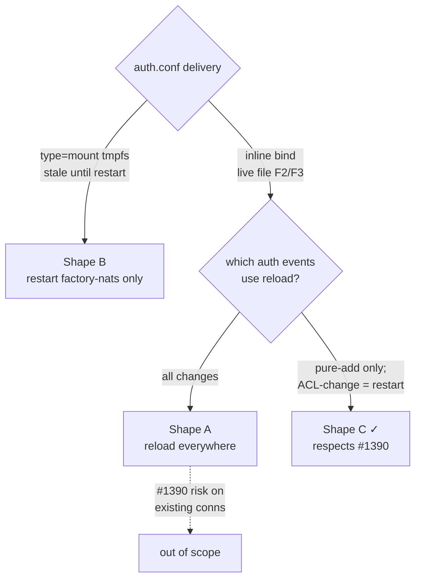

## Source

Issue #1719 (follow-up to #1718):

> Adding a NATS identity via `make nats-add-identity NAME=<x>` currently restarts `factory-nats`
> **and ALL clients** (`FACTORY_NATS_CLIENTS`) — see `Makefile:352-373`. […] This is a
> deploy-delivery property, NOT a NATS limitation: `nats-server` supports SIGHUP live config
> reload (`--signal reload`) without dropping connections.

## Problem

`make nats-add-identity NAME=<x>` (`Makefile:356-377`) restarts `factory-nats` **plus all 7**
`FACTORY_NATS_CLIENTS` (`Makefile:327`: hub, telegram, discord, clipool, turn-writer, gh-helper,
blobstore). Root cause: `auth.conf` is delivered as a Podman `type=mount` secret
(`factory-nats.container:28`), a tmpfs bind bound at container init. `podman secret create
--replace factory-nats-auth` updates the store but the in-container file stays **stale until
restart** — documented at `deploy/CLAUDE.md:143-146` and `docs/ops/nats-authconf-update.md:33-36`.
So a new identity's pubkey + ACL go live only after `factory-nats` restarts; clients are then
bounced too.

**Verified premise nuance:** the existing doc says SIGHUP "fails" *today* — but only because the
tmpfs path is stale (`nats-authconf-update.md:34`). nats-server's own reload is not the blocker;
the **delivery mechanism** is. Switching auth.conf off `type=mount` is precisely what re-enables
SIGHUP. The issue's premise is therefore consistent with the codebase, not contradicted by it.

## Outcome

`make nats-add-identity NAME=<x>` brings a new identity live with **zero forced restart of the 7
clients** and **no dropped connections** — ideally via a `systemctl --user reload` (SIGHUP) of
`factory-nats` alone, with existing server-side connections preserved.

## Appetite

1-week cycle (single-domain deploy change + one operator-gated spike). The unknown (SIGHUP
reliability under rootless Quadlet) is the only thing that could expand scope.

## Key Findings

| # | Finding | Evidence | Impact |
|---|---------|----------|--------|
| F1 | auth.conf carries **only public** material (`U…` nkeys + ACLs), no `S…` seeds | `deploy/nats/auth.conf` (14 user entries, all `nkey:`); frame:30 | tmpfs-isolation argument is weak for auth.conf → bind-mount is defensible |
| F2 | `nats-container.conf` already delivered via **inline bind mount**, proven on Podman 5.x | `factory-nats.container:20` (`Volume=%h/...:/etc/nats/nats.conf:ro,z`) | auth.conf can reuse this exact pattern |
| F3 | The "loop device setup" Podman-5.x failure was for **`.volume` wrappers**, NOT inline binds | `factory-nats.container:25-27` (ADR-054 Decision 5 comment) | inline bind sidesteps the historical failure — **key de-risk** |
| F4 | Explicit hardening invariant forbids volume-wrapped credentials | `deploy/CLAUDE.md:145` ("¬volume wrappers for credentials") | Option 1 needs an **ADR carve-out** for auth.conf (public) |
| F5 | nats config includes auth.conf by path; SIGHUP re-reads the config tree | `nats-container.conf:19` (`include "nkeys/auth.conf"`); `nats-authconf-update.md:34` | once the file is live (bind), SIGHUP picks up changes |
| F6 | **No `ExecReload=` exists.** Quadlet's generated `.service` defaults `systemctl reload` to signalling `MAINPID` (conmon), NOT nats-server → reload is silently a no-op today | `factory-nats.container:1-41` (no `ExecReload`); repo-wide grep = 0 hits | must **add** `ExecReload=podman kill --signal=HUP factory-nats`; nats-server is PID 1 (`Exec=nats-server`, line 29) so the signal then lands correctly |
| F7 | auth.conf re-render is **always full**, never patched | ADR-046 Inv.1 (`adr/046-...mdx:66`) | pure-add still re-renders whole file — compatible; render must be **atomic** (temp+rename) so SIGHUP never reads a half file |
| F8 | Dropping `factory-nats-auth` from `Secret=` requires **5** lockstep edits, not 3 | `factory-nats.container:28`; `quadlet.toml:7`; `deploy/generated/secrets-manifest.sh`; `deploy/secrets-policy.toml` (`nats-auth` entry, else `install.sh` still creates it); `Makefile:214` (`quadlet-secrets-install`) | `check_secrets_drift.sh` check (a) is subset-only → orphan in quadlet.toml not caught by (a); caught by (b). check (c) already excludes `factory-nats-auth` (lines 312,329) |
| F9 | `volumes_table` gate scans **only adapter templates**, not factory-nats | `tools/check_volumes_table.sh:116-121` | adding `Volume=` to factory-nats won't trip it… |
| F10 | …but `doc_drift` covers `docs/architecture/deployment.md` — Volumes table + "Credentials use type=mount" invariant (`deployment.md:225`) go stale | `tools/CLAUDE.md` scanned paths | docs must be updated in same PR |
| F11 | **Converge re-restarts within ≤5min.** `converge.sh` fingerprints `sha256sum auth.conf`; on drift it rotates the secret + restarts factory-nats + all 7 clients. The next `factory-post-autoupdate.timer` run undoes the SIGHUP win unless converge gets an auth-only **reload branch** | `deploy/converge.sh:41-78`, `deploy/lib/deploy-common.sh:51-55` | **blocking deliverable** — without it the win lasts only until next converge |
| F12 | SIGHUP reliability under **rootless** Quadlet is unverified — no repo evidence | both Explore agents; frame:33 | **spike on M₁ required** before committing |
| F13 | Inline single-file bind requires the host file to **exist before container start** — else Podman creates a *directory* at the target (fresh-deploy trap) | Podman bind-mount semantics; `nats-container.conf` is static so never hit this | provisioning must render auth.conf before `factory-nats` first start (guard in `quadlet-secrets-install`/`converge`) |
| F14 | `:z` relabels the **actual host file** (not a tmpfs copy); host processes (`factory-acl genkeys`, `podman secret create`, converge fingerprint) read it | `converge.sh:42,48`, `deploy-common.sh:52`; precedent `nats-container.conf:20` uses `:ro,z` and host reads fine | M₁ is Ubuntu (AppArmor, not SELinux → `:z` likely no-op) but spike must confirm host read access post-start |

## Shapes

### Shape A: Inline bind-mount auth.conf + SIGHUP live reload (full)

Replace `Secret=factory-nats-auth,type=mount,...` (`factory-nats.container:28`) with an inline
bind mount of the host file (same form as line 20):
`Volume=%h/.roxabi/factory/nkeys/auth.conf:/etc/nats/nkeys/auth.conf:ro,z`. Add
`ExecReload=/usr/bin/podman kill --signal=HUP factory-nats` (or `nats-server --signal reload`).
Rewrite `nats-add-identity` **and** `nats-regen-authconf` to `systemctl --user reload factory-nats`
— no restart of factory-nats, no client fan-out, for **both** add and ACL-change. Drop
`factory-nats-auth` from the 5 secret locations (F8). New ADR (F4). Reconcile converge (F11).

**Trade-offs:**
- Pro: full goal — zero client restart AND zero factory-nats restart AND zero connection drop.
- Pro: removes a whole class of operational disruption for *every* auth.conf change, not just adds.
- Con: applies SIGHUP to **ACL-change** path too, which #1390 (stale-subject-auth) flags as risky
  for existing connections — out of this issue's stated scope.
- Con: largest blast radius; overrides a hardening invariant; full converge reconciliation.

**Rough scope:** L

### Shape B: Keep type=mount, drop the client fan-out only (the rejected "simplest")

Leave auth.conf as `type=mount`. In `nats-add-identity`, restart **only** `factory-nats` and rely
on nats-py `allow_reconnect` (default True) for the 7 clients — delete the client restart loop
(`Makefile:372-377`).

**Trade-offs:**
- Pro: ~10-line Makefile diff; no ADR, no gate churn, no security change.
- Con: `factory-nats` still restarts → momentary **server-side drop** of all connections (clients
  reconnect, but it is not zero-drop); tmpfs staleness unaddressed. Fails the frame success
  criterion ("no dropped connections"). This is the alternative the frame already rejected.

**Rough scope:** XS

### Shape C: Inline bind-mount + SIGHUP for pure-add; restart retained for ACL-change (recommended)

Same delivery change as A (inline bind + `ExecReload=` + new ADR superseding ADR-055 + 5-place
secret drop), but **scope the reload path to the pure-add case** that #1719 targets:
- `nats-add-identity` (new identity, existing ACLs unchanged) → `systemctl --user reload` (SIGHUP),
  zero restart, zero client fan-out.
- `nats-regen-authconf` (ACL **changes**) → keep `restart factory-nats`. **Note:** nats-server
  itself SIGHUPs uniformly — it does *not* distinguish add from change. The reason to keep restart
  on the change path is purely **#1390 (stale-subject-auth) policy**, which flags re-evaluating an
  existing connection's permissions as risky. The issue scoped #1390 out (frame:43).
- converge (F11): auth-only drift → reload branch; structural drift → restart. **Required**, else
  the next timer run reverts the win.
- First-boot guard (F13): ensure auth.conf is rendered to the host path before `factory-nats`
  first start.

**Trade-offs:**
- Pro: hits the exact success criterion for the exact path #1719 targets, zero-drop.
- Pro: keeps the riskier ACL-change path on the proven restart mechanism → respects #1390 without
  needing to solve it here.
- Con: two code paths (add=reload, change=restart) — slightly more logic + tests.
- Con: still needs the ADR carve-out + the M₁ spike (shared with A).

**Rough scope:** M

## Fit Check

**Recommended: Shape C.** It is the smallest design that satisfies the frame's success criterion
(pure `nats-add-identity` → zero client restart, zero drop) while keeping the ACL-change path —
which #1719 explicitly scoped out (frame:43) and which #1390 flags as risky — on the proven
restart mechanism. The inline-bind insight (F2/F3) removes the main delivery risk; the inline-bind
pattern is already in production for `nats-container.conf`.

**Shape B eliminated:** it is the frame's rejected simplest-alternative — `factory-nats` still
bounces, so it fails "no dropped connections."

**Shape A deferred:** moving the ACL-change path onto SIGHUP pulls #1390 in-scope; defer to a
follow-up once the pure-add reload path is proven in prod.

**Hard prerequisites for C (and A):**
1. **New ADR superseding/amending ADR-055** (the authoritative credential-delivery record;
   `deploy/CLAUDE.md:197`). `deploy/CLAUDE.md:145` is downstream of the ADR — editing only CLAUDE.md
   would leave ADR-055 contradicting the code. The ADR carves out *public ACL bundles* (auth.conf,
   no `S…` seed material — F1) from the `type=mount` requirement to enable live reload; **private
   seeds stay `type=mount`** (unchanged). Also update the `factory-nats.container:25-27` ADR-054
   comment, which currently justifies the `Secret=` line being removed.
2. **Cheap pre-spike de-risk (no M₁ needed):** confirm Quadlet honors `ExecReload=podman kill
   --signal=HUP` (Quadlet 4.x+ supported); grep `nats:2.10.29-alpine` (`factory-nats.container:8`)
   release notes for any `include` re-read regression.
3. **M₁ spike** (operator-gated, rootless Podman 5.x) — checklist:
   - `systemd-analyze cat factory-nats.service | grep ExecReload` shows the HUP line.
   - `podman top factory-nats pid,comm` confirms nats-server is **PID 1**.
   - `ls -lZ` + `sha256sum ~/.roxabi/factory/nkeys/auth.conf` from host **before and after**
     container start (F14 relabel — host read must still exit 0).
   - `systemctl --user reload factory-nats` → `journalctl --user -u factory-nats` logs
     `"Reloading server configuration"` within ~2s (signal arrived).
   - add a test identity, atomic-render auth.conf (no restart), connect with its seed → **authenticates**.
   - existing client connection stays up across the reload (**zero drop** — C2).
   - `make converge` after a SIGHUP-only add does **not** escalate to full restart (depends on F11
     reload-branch landing first).
   If the spike fails → fall back to Shape B. This gates implementation (F12).

## Files Impacted (Shape C)

| File | Change |
|------|--------|
| `deploy/quadlet/factory-nats.container` | `Secret=factory-nats-auth,type=mount` → inline `Volume=` bind; add `ExecReload=podman kill --signal=HUP factory-nats`; update ADR-054 comment (L25-27) |
| `deploy/quadlet.toml` | drop `factory-nats-auth` from `[component.nats].required_secrets` (F8) |
| `deploy/generated/secrets-manifest.sh` | regenerate without `factory-nats-auth` (F8) |
| `deploy/secrets-policy.toml` | remove `nats-auth` policy entry (else `install.sh` recreates it — F8) |
| `Makefile` | `nats-add-identity` → reload (no client fan-out); `quadlet-secrets-install` (L214) drops auth.conf secret create + first-boot render guard (F13) |
| `deploy/converge.sh` + `deploy/lib/deploy-common.sh` | auth-only drift → **reload branch**; drop `podman secret create --replace factory-nats-auth` (F11) |
| `scripts/gen_nkeys.py` (`factory-acl genkeys`) | atomic write (temp + `os.rename`) to host auth.conf path (F7/C4) |
| `docs/architecture/deployment.md` | Volumes table row + "Credentials use type=mount" invariant carve-out (F10) |
| `deploy/CLAUDE.md` | hardening-invariant carve-out for auth.conf, downstream of the ADR (F4) |
| `docs/ops/nats-authconf-update.md` | rewrite the "Why restart and not SIGHUP" section for the new add path |
| `docs/architecture/adr/` | **new ADR** (primary artifact — supersedes/amends ADR-055) |
| tests | reload-path behavior test; secrets_drift + volumes fixtures |

## Open Concerns

- **C1 (blocking):** SIGHUP reload reliability under rootless Quadlet — `ExecReload=` is **missing
  wiring** (F6), not merely unverified. Must be added + spiked on M₁ (F12). Design collapses to
  Shape B if the spike fails.
- **C2:** `nats-server` SIGHUPs uniformly and (per docs) does not re-evaluate existing connections
  on a pure add — but the **zero-drop** claim must be observed directly in the spike.
- **C3 (blocking):** converge re-restart (F11) — the auth-only reload branch must land or the next
  timer run reverts the win within ≤5min.
- **C4:** atomic render (F7) — `gen_nkeys.py` must temp+rename so SIGHUP never reads a half file.
- **C5:** first-boot trap (F13) — auth.conf must exist on host before `factory-nats` first start,
  else Podman creates a directory at the mount target.
