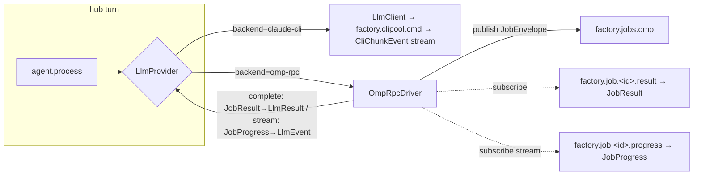

## Source

> #1807 spike (GREEN) + decision 2026-06-10 — **clipool is NOT retired**; runtime is a
> per-agent / per-job **choice**. Config-driven selection of the runtime backend
> (clipool/`claude -p` ⟷ `omp_rpc`); both coexist. — issue #1813

Frame chose **scope B (transport unification)** over selection-only.

## Problem

The live agent-turn flow is clipool-only; omp (#1812) is implemented but **no hub code
publishes to `factory.jobs.omp`** (`stream_setup.py:32` excludes it; only
`test_omp_worker.py:60` references it). There is no live path that routes a turn to omp.

The frame assumed the two runtimes had *divergent, irreconcilable* contracts. Exploration
**falsified the hard part of that premise**: the codebase already carries the unifying
abstraction.

### Discovery — the unification seam already exists

| Asset | Location | State |
|-------|----------|-------|
| `LlmProvider` Protocol (`complete` + `is_alive` req, `stream` optional/duck-typed) | `core/ports/llm.py:46` | ✅ exists; clipool + claude-cli implement it |
| `backend` selector field (`claude-cli` \| `nats` \| `omp-rpc`) | `ModelConfig` `llm_types.py:43,66`; `agents.backend` column NOT NULL default `claude-cli` | ✅ `omp-rpc` already a valid value |
| `ProviderRegistry` (backend→provider) | `llm/registry.py` | ⚠️ only `claude-cli`/`nats` wired → `omp-rpc` = `KeyError` |
| Provider consumption (stream-or-complete) | `src/factory/agents/simple_agent.py:238-251` (`getattr(provider,"stream")` + `model_cfg.streaming`) | ✅ `complete()`-only driver works with zero agent change |
| Per-agent config load → turn dispatch | `agent_db_loader.py:57` → `pool_processor.py:67` → `agent.process()` | ✅ `agent.config.llm_config.backend` reachable at turn time |

**`backend` IS the runtime selector.** Issue #1813 calls it `runtime`; the codebase already
calls it `backend`. Adding a second `runtime` column would be redundant. → **naming decision
below.**

### What is genuinely missing

1. **No `OmpRpcDriver`.** Build it as `OmpRpcDriver(NatsDriverBase)` (extends
   `roxabi_nats.NatsDriverBase`) **and** satisfies the `LlmProvider` Protocol
   (`core/ports/llm.py:46`): `complete(self, pool_id, text, model_cfg, system_prompt, *,
   messages=None)`, `is_alive(self, pool_id)`, `stream(self, pool_id, ...)`. Register
   `"omp-rpc"`→driver in `ProviderRegistry` (`KeyError` today). `pool_id` is **not** ignored —
   it keys the omp **native session** resume (see §4).
2. **No hub-side result consumer.** omp replies on `factory.job.<job_id>.result` (single
   `JobResult`) + `factory.job.<job_id>.progress` (`JobProgress` stream). The hub subscribes
   to neither (`omp_worker.py:115`, `_rpc_bridge.py:294`). The driver subscribes directly to the
   per-job subjects (the `job_id` is **hub-minted** → subjects are deterministic; not
   `JobEnvelope.reply_to`, which the worker ignores — Agent 2) and **tears the sub down on
   completion/error/timeout** (orphan-sub footgun). `NatsDriverBase` provides the ephemeral-inbox
   streaming + worker-freshness plumbing to reuse here.
3. **No CB/liveness on the omp path — it is a HUB-SIDE concern that does not exist yet.** The
   *worker* (#1812) needs none; the *driver* does, and there is no omp driver. Reuse
   `NatsDriverBase`: heartbeat-freshness (worker emits `factory.omp.heartbeat` every 30s,
   `omp_worker.py:40`) + per-chunk liveness (`timeout` = "liveness check, **not** a duration
   cap" — driver_base docstring) + `DEFAULT_MAX_TOTAL_DURATION` backstop (override high).
   **AC: no fixed per-turn cap** — cli/omp/llm turns can run very long; cut only on a
   silent/dead worker (heartbeat expired), never on elapsed turn time. (NB: the
   `NatsAdapterBase` `timeout=300.0` on the worker governs only `wait_for_hub`/readiness — and
   omp sets `wait_ready=False` — so it is **not** a turn cap; do not treat it as one.)
4. **Use omp's NATIVE session — do not hand-thread `messages[]`.** omp_rpc has a full session
   model (`session_id`, `switch_session(path)`, `provider_session_id`, `new_session(parent=…)`
   — `1807-omp-rpc-groundwork.md`), today **disabled** by `no_session=True`
   (`_rpc_bridge.py:147`). Design: enable native session, bridge factory `pool_id` → omp session
   (resume), exactly like clipool's provider-owned history — so omp retains multi-turn memory
   natively (NOT amnesiac), and the hub does NOT build `messages[]`. **Known gap (scoped in
   groundwork):** factory stores `session_id` strings in NATS KV but `switch_session()` takes a
   *file path* → need a `session_id→session_file` map or the `provider_session_id` kwarg. **AC:
   an omp agent remembers across turns.**
5. **`JobEnvelope.payload` enrichment** — today only `{"prompt": str}` (`omp_worker.py:130`). A
   real turn needs `prompt` + **session-resume ref** + `model_cfg` + `system_prompt` (at seed) —
   **not** full history (omp's session holds it, §4). The **only genuine contract change**
   (`roxabi-contracts` jobs payload), and **wire-breaking** per
   [[project-contract-required-field-wire-compat]]: lock-pinned omp + JetStream replay may carry
   old `{"prompt"}`-only envelopes → new fields **optional with defaults** on the consumer
   (`payload.get(...)`, default-mint), producer+consumer ship atomically, no required-field add.
   Result-side: `result_data` (`_rpc_bridge.py:289`) may be `str | dict | None` → driver
   **decides** `str(...)`/`data["result"]` extraction → `LlmResult.result: str`.

## Outcome

A turn can be executed by omp via a driver that satisfies `LlmProvider` and extends
`NatsDriverBase`, **streaming tokens** back (parity with clipool) and **remembering across
turns** via omp's native session — coexisting with `claude-cli`, default unchanged, flip gated
by a parity check. Runtime is selectable **both per-agent** (`backend` in `config.db`, the
default) **and per-job** (override at dispatch — mandatory, native job architecture: every omp
turn is a hub-minted `JobEnvelope`; omp is purely reactive). Selecting omp routes through the
**same Protocol seam** as clipool; no parallel turn-execution path is introduced.

## Appetite

F-full, **but de-risked** — the central unknown ("how to unify two contracts") is resolved by
the pre-existing `LlmProvider` Protocol + `NatsDriverBase`. Remaining work: a new
`OmpRpcDriver(NatsDriverBase)`, the payload contract extension, bootstrap wiring, the streaming
bridge, native-session resume (`pool_id`→omp session), per-job override, parity check, and
cross-layer tests. **Decision (user, overriding the panel's "defer streaming"): ship the full
Shape 2 + per-job in this issue** — both job execution and streaming, native job architecture.

## Shapes

### Shape 1 — `OmpRpcDriver` round-trip (no streaming yet)  ·  Rough scope: M  ·  **slice 1 of chosen path**

New `src/factory/llm/drivers/omp_rpc.py` = `OmpRpcDriver(NatsDriverBase)` impl `complete()` +
`is_alive()`. On `complete()`: mint `job_id`, publish enriched `JobEnvelope` (prompt +
session-resume ref + model_cfg + system_prompt) to `factory.jobs.omp`, subscribe to
`factory.job.<job_id>.result`, translate `JobResult` → `LlmResult`. Register `"omp-rpc"` in the
registry/bootstrap. Wire native-session resume (`pool_id`→omp session). Heartbeat-liveness via
`NatsDriverBase`.

**Trade-offs:**
- Pro: proves dispatch/result round-trip + native-session memory; reuses Protocol + `NatsDriverBase`; falls to `simple_agent`'s `complete()` branch (no agent change).
- Con: non-streaming — long turns render only on completion. **Not the final state — slice, not ship-stop.**

### Shape 2 — Shape 1 + streaming bridge  ·  Rough scope: L  ·  **CHOSEN (full scope this issue)**

Shape 1 **plus** `stream()`: subscribe to `factory.job.<job_id>.progress` while awaiting the
result; map `JobProgress.partial_text` → `TextLlmEvent`, `tool_name`/`tool_id` →
`ToolUseLlmEvent`, terminate on `JobResult` → `ResultLlmEvent`. Honors `model_cfg.streaming`.

**Trade-offs:**
- Pro: streaming UX parity with clipool; satisfies the coexistence intent fully.
- Pro: no contract change beyond Shape 1 — `JobProgress` already carries `partial_text`/`tool_*` (`jobs/models.py:71`).
- Con: subscription lifecycle/teardown footguns (orphaned subs); must yield terminal `ResultLlmEvent` or `StreamProcessor` never completes (`llm_client.py:137` pattern); **`JobProgress` carries only `partial_text`/`tool_name`/`tool_id` (`jobs/models.py:71-84`) — no `thinking`, tool-delta, or tool-result `LlmEvent` variants** (`llm` CLAUDE.md:85-88) → spec must enumerate the explicit `JobProgress`→`LlmEvent` mapping table (which variants map, which are dropped/approximated).

### Shape 3 — Symmetric unified job/result contract (the literal issue framing)  ·  Rough scope: XL

Refactor clipool to *also* speak `factory.jobs.clipool` + `JobResult`, making routing a pure
subject swap.

**Trade-offs:**
- Pro: subject symmetry the issue body literally describes.
- Con: **rewrites clipool's proven streaming path** → high regression risk; directly violates
  the "don't regress clipool UX" constraint; the `LlmProvider` Protocol *already* provides the
  unification, making this redundant churn. **Eliminated.**

## Fit Check

The `LlmProvider` Protocol + `NatsDriverBase` are the unification point — not a new wire
contract. That eliminates Shape 3 (redundant + violates the no-regression constraint).
**Decision: deliver the full Shape 2 (job + streaming) + per-job selection in this issue.**
Shape 1 is the internal **build order** (slice 1 → 2): land the round-trip + native-session
memory first, then layer the streaming bridge — but both ship under #1813. An Opus
architect+product panel recommended deferring streaming to a follow-up; the user explicitly
overrode that (job system *and* streaming, native job architecture). **Recommended: Shape 2,
built 1→2, per-job mandatory.**

> **Scope B is satisfied by the `LlmProvider` Protocol seam (pre-existing).** The frame chose B
> ("transport unification"); that unification is realized by wiring omp through `LlmProvider`,
> **not** by a new symmetric wire contract. Shape 3 (symmetric `factory.jobs.clipool` subjects)
> is **eliminated, not deferred** — do not re-introduce it in /spec.

## Naming (decision for /spec — bind explicitly)

`backend` already encodes the runtime. **Decision: `backend` is the canonical field**
(`backend="omp-rpc"` ≡ runtime=omp); do **not** add a redundant `runtime` column, do **not**
add a synonym alias. Bind the vocabulary in /spec:
- "runtime" is **prose/doc terminology only** → maps to the `backend` field.
- The CLI UX stays `factory agent patch <id> backend=omp-rpc` (no `runtime` verb) — else
  operators who read "runtime" in the issue/docs hunt for a nonexistent flag.

## Per-agent + per-job selection (both mandatory — decision for /spec)

#1807 ratified runtime as a "per-agent / **per-job**" choice — **per-job is in scope, not
deferred** (user). The wire is already job-native: each turn = a discrete hub-minted
`JobEnvelope` to `factory.jobs.omp` (queue-group → free replica); omp is purely reactive.
Two axes:
- **per-agent (default):** `backend` in `config.db` (`agents.backend`, `llm_types.py:43`).
- **per-job (override):** runtime selectable at dispatch, overriding the agent default for that
  turn — carried on the turn/job (a per-message/per-turn hint resolved in the dispatch path
  before the provider is chosen). /spec pins where the override rides (inbound metadata vs job
  payload) and the resolution precedence (job override > agent default > system default
  `claude-cli`).

## Parity check (decision for /spec — needs a binary AC)

The frame requires "parity check before flipping any default." Minimal definition for /spec to
turn into a binary AC:
- **(a) Signal:** a fixed golden-prompt set runs against both `claude-cli` and `omp-rpc`; pass
  = omp returns a non-error `LlmResult` with non-empty `result` for each (semantic-equivalence
  is out of scope — runtimes differ by design).
- **(b) Owner:** start as a **manual ops runbook** (`docs/`), not a CI gate (omp needs a live
  proxy + binary — not CI-reproducible; cf. the M₁-only omp deploy lessons).
- **(c) Flip procedure:** default stays `claude-cli`; flipping is a per-agent `backend` change,
  never a global default bump, until the runbook passes. Spec writes the AC + runbook stub.

### Files impacted

| File | Change | Layer |
|------|--------|-------|
| `packages/roxabi-contracts/.../jobs/models.py` | enrich `JobEnvelope.payload` (prompt + session-resume ref + model_cfg + system_prompt) — optional, wire-compat | contracts |
| `src/factory/llm/drivers/omp_rpc.py` *(new)* | `OmpRpcDriver(NatsDriverBase)` + `LlmProvider` — publish job, consume result/progress, stream bridge, native-session resume, heartbeat-liveness | llm/drivers |
| `src/factory/llm/registry.py` | register `"omp-rpc"` → driver | llm |
| `src/factory/bootstrap/factory/hub/*` | wire `OmpRpcDriver` (NATS conn, subjects, session map) at bootstrap | bootstrap |
| `src/factory/adapters/omp/_rpc_bridge.py` | flip `no_session=True`→native session; consume enriched payload; resume by `pool_id` | adapters/omp |
| dispatch path (per-job override resolution) — `core/hub` middleware/dispatch | resolve job-override > agent default | core/hub |
| parity-check runbook (ops) — golden-prompt omp vs clipool before default flip | `docs/` | ops |
| tests across contracts/driver/omp + integration round-trip + streaming + memory-across-turns | — | tests |

### Resolved by review (decisions baked above)

- `result_data` extraction (`str|dict|None`→`str`), `reply_to`-vs-direct-subscription,
  subscription teardown → §"What is genuinely missing" items 2–3.
- Parity-check definition → §Parity check. Naming/vocab → §Naming. Scope-B framing → Fit Check.
- `JobEnvelope.payload` wire-compat (optional fields + default-mint) → §missing item 3.

### Open concerns (carry to /spec)

- **`JobProgress`→`LlmEvent` mapping table** (Shape 2) — enumerate which variants map vs. drop.
- **Liveness, not duration cap** — `complete()`/`stream()` must NOT impose a fixed per-turn
  timeout (turns can run very long). Use `NatsDriverBase` heartbeat-freshness (`factory.omp.heartbeat`
  30s) + per-chunk liveness; raise `LlmUnavailableError`/error-`LlmResult` only on a silent/dead
  worker. /spec sets `max_total_duration` backstop high (or heartbeat-only).
- **Native-session resume bridge** — `session_id` (str, NATS KV) ↔ omp `switch_session(path)` gap;
  pick `session_id→file` map vs `provider_session_id` (1807 groundwork §9).
- **Axial review** — change crosses `core/ports`/`llm` ↔ `adapters/omp` ↔ `roxabi-contracts`;
  expect `dev-core:axial-adr-review`. Watch the `except Exception` rule if the driver adds broad
  handlers (would also pull `security-auditor`).
