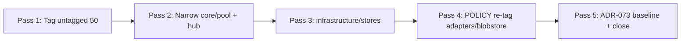

## Source

> **Origin:** `artifacts/analyses/architecture-structural-review-2026-06-10.md` F-1 (validated by Mickael 2026-06-11: burn down, NOT re-baseline).
>
> ADR-073 revisit trigger `boundary-broad-catch ≤ 30` tripped post-Phase 7 (#1284 closed 2026-05-31).
> Measured 2026-06-10: 150 sites / 91 files. Re-measured 2026-06-24: **168 sites / 102 files**.

## Problem

The broad-catch debt is **growing**, not shrinking. Since issue filing (2026-06-11), **401 commits**
landed on staging (61 touching `core/`, `inbound/`, `infrastructure/`). New features added catches
without burn-down:

| Source PR / feature | New/changed sites |
|---|---|
| #1812 / #1813 OmpWorker + OmpPool | `adapters/omp/` (5) |
| #1946 KV roster adapter | `infrastructure/stores/` |
| Telegram Rich Messages | `adapters/telegram/telegram_rich.py` (3) |
| #1931 adapter glue kit | adapter shared modules |
| #1989 WAL failure survival | stores + bootstrap |

### Current inventory (2026-06-24)

```sh
grep -r 'except Exception' src/factory/ --include='*.py' | wc -l   # 168
grep -rl 'except Exception' src/factory/ --include='*.py' | wc -l  # 102
grep -r 'DEBT:boundary-broad-catch' src/factory/ --include='*.py' | wc -l  # 57
```

| Layer | Sites | Files | DEBT-tagged | Issue priority |
|---|---:|---:|---:|---|
| **core/** | **47** | 30 | 25 | 🔴 1st |
| **inbound/** | 3 | 1 | 0 | 🔴 1st |
| **infrastructure/** | 21 | 13 | 1 | 🟠 2nd |
| adapters/ | 34 | 22 | 9 | 🟢 re-tag POLICY |
| blobstore/ | 9 | 3 | 0 | 🟢 re-tag POLICY |
| outbound/ + nats/ + transport/ | 11 | 7 | 0 | 🟢 boundary expected |
| cli/ + bootstrap/ + monitoring/ | 26 | 16 | 17 | 🟡 mixed |
| llm/ + tools/ + agents/ + agent_cmd/ | 17 | 10 | 6 | 🟡 mixed |

**Tagging gap:** 50 BLE001 suppressions in `src/factory/` are **UNTAGGED** per
`artifacts/quality-debt-report.json` — debt invisible to the ratchet. Breakdown of untagged:

| Layer | Untagged BLE001 |
|---|---:|
| adapters/ | 17 |
| blobstore/ | 9 |
| infrastructure/ | 7 |
| outbound/ | 4 |
| transport/ + tools/ + other | 13 |

### Core hotspots (N×M axial risk)

| Submodule | Sites | Risk |
|---|---:|---|
| `core/pool/` | **15** | `pool_observer.py` alone = 5 **untagged** — turn/session persistence errors swallowed |
| `core/hub/` | **9** | pipeline dispatch, middleware, circuit breaker — can hide stage violations |
| `core/cli/` | **7** | subprocess/PID — infra-in-core (F-3); couple to runtime-pluggable verdict |
| `core/agent/` | 4 | config reload, hot-reload commands |
| `core/commands/` | 3 | processor registry side-effect imports |
| `core/lifecycle/` | 2 | concept/preference extraction (non-fatal by design) |

Many `core/pool/` catches log-and-continue on TurnStore / message_index / turn_publisher failures —
masking infrastructure errors that should surface or propagate to a boundary.

## Outcome

- `grep -r 'except Exception' src/factory/ --include='*.py' | wc -l` ≤ **30**
- Every remaining site has **inline justification** (POLICY boundary or drained DEBT with narrow catch)
- **Zero** untagged BLE001 in `src/factory/`
- ADR-073 revisit-trigger baseline note updated with steady-state + measurement command
- Re-measure documented in closing PR

**Not success:** tagging 138 sites as DEBT without narrowing — bookkeeping compliance without
fixing axial risk (premise-invalid per frame Premise Validity).

## Appetite

3–5 PR cycles over ~2 sprints. Tag-first PR is low-risk (1 cycle); core/pool + core/hub narrowing
(2 cycles); infrastructure stores (1–2 cycles); ADR baseline update in final PR.

## Shapes

### Shape 1: Vertical slice burn-down (core-first)

PR sequence strictly by layer priority: `core/pool/` → `core/hub/` → rest of `core/` →
`inbound/` → `infrastructure/stores/` → boundary re-tag pass on adapters/blobstore.

**Trade-offs:**
- Pro: maximizes axial risk reduction early; each PR is reviewable (~15–20 sites max).
- Pro: aligns exactly with issue burn-down order.
- Con: untagged sites stay invisible until late PRs; early PRs harder to scope without tag baseline.
- Con: longest calendar time before grep count drops visibly.

**Rough scope:** L (4–6 PRs)

### Shape 2: Tag-first, then narrow

**Pass 1 (1 PR):** classify all 50 untagged BLE001 — `DEBT:boundary-broad-catch` for true debt,
`POLICY:boundary-broad-catch` (or inline justification) for adapters/blobstore/transport HTTP/NATS
boundaries. Regenerate `quality-debt-report` → honest baseline.

**Pass 2+:** narrow `core/pool/` and `core/hub/`; then infrastructure; drain DEBT slugs as slices
complete.

**Trade-offs:**
- Pro: immediate visibility; ratchet-ready; separates "classify" from "fix" — lowers review risk.
- Pro: clarifies true burn-down target (~71 sites in core+inbound+infra vs 168 gross).
- Con: grep count stays high after Pass 1 (tagging ≠ elimination).
- Con: POLICY taxonomy must be defined before Pass 1 to avoid re-laundering debt as POLICY.

**Rough scope:** M/L (3–5 PRs)

### Shape 3: Hybrid tag-first + core vertical (recommended)

Combine Shape 2 Pass 1 with immediate `core/pool/` + `core/hub/` narrowing in Pass 2 (same sprint).
Defer adapters/blobstore POLICY re-tag to Pass 3 once ≤30 math is clear.



**Trade-offs:**
- Pro: honest inventory after Pass 1; highest-risk modules fixed in Pass 2; boundary re-tag only
  after true debt reduced — avoids POLICY laundering.
- Pro: grep count drops materially by Pass 3; ADR update in Pass 5 with final measurement.
- Con: still multi-PR; per-site judgment in pool/hub cannot be fully mechanical.

**Rough scope:** L (4–5 PRs)

## Fix families (per-site playbook)

| Family | When | Action | Example |
|---|---|---|---|
| **Narrow** | Exception type known | Replace `Exception` with specific types | `sqlite3.Error`, `OSError`, `ValueError` |
| **Re-raise** | Catch masks stage boundary | Remove catch or move to adapter boundary | `pool_processor_exec` unhandled path |
| **Resilient boundary** | Non-fatal by design | Keep broad catch + inline justification | logging filter (`trace.py`), plugin load skip |
| **POLICY boundary** | HTTP/NATS/adapter I/O | Tag `POLICY:boundary-broad-catch` + reason | `blobstore/_handlers.py` → 500 mapping |
| **Drain DEBT** | After narrow/POLICY | Flip `artifacts/debt/boundary-broad-catch.md` sites | registry bookkeeping per #1162 |

### Files impacted (priority burn-down, ≥3 files)

| Slice | Files | Sites |
|---|---:|---:|
| core/pool | `pool_observer.py`, `pool_processor_exec.py`, `pool_processor.py`, `pool.py`, `pool_processor_streaming.py` | 15 |
| core/hub | `hub_dispatch.py`, `hub.py`, `hub_circuit_breaker.py`, `middleware/*.py`, `outbound_errors.py` | 9 |
| core/cli | `cli_pool_*.py`, `cli_streaming.py`, `cli_non_streaming.py` | 7 |
| infrastructure/stores | `turn_store_session.py`, `turn_store*.py`, `sqlite_base.py`, `active_jobs_refresher.py` | ~12 |
| inbound | `attachment_ingest.py` | 3 |

## Fit Check

**Recommended: Shape 3 (hybrid).**

| Shape | Eliminated by |
|---|---|
| Shape 1 | Untagged debt stays invisible too long; violates honest-measurement premise |
| Shape 2 alone | Delays axial fixes; tagging-only path is the frame's rejected simplest alternative |

Shape 3 satisfies frame constraints: burn-down (not re-baseline), core-first order, per-site
judgment, multi-PR safety. Pass 1 is the only PR where mechanical tagging may apply; Pass 2+
require code review with `dev-core:axial-adr-review` + `dev-core:security-auditor`.

**Budget math:** ~58 sites in adapters/blobstore/outbound/nats/transport are boundary candidates
for POLICY (may stay within ≤30). True elimination target: **~110 sites** in core+infra+mixed —
must narrow or re-raise, not re-tag alone.

**Open concerns (unresolved):**
- `core/cli/` catches may belong to runtime-pluggable extraction (#1812) — defer subprocess catches
  or narrow only the non-subprocess ones in this epic.
- `stream_processor.py` catch re-raises after RunErrorRenderEvent — verify not counted as debt.
- `pool_observer.py` 5 untagged catches: likely narrow to store/publisher-specific errors, not blanket
  `Exception`.