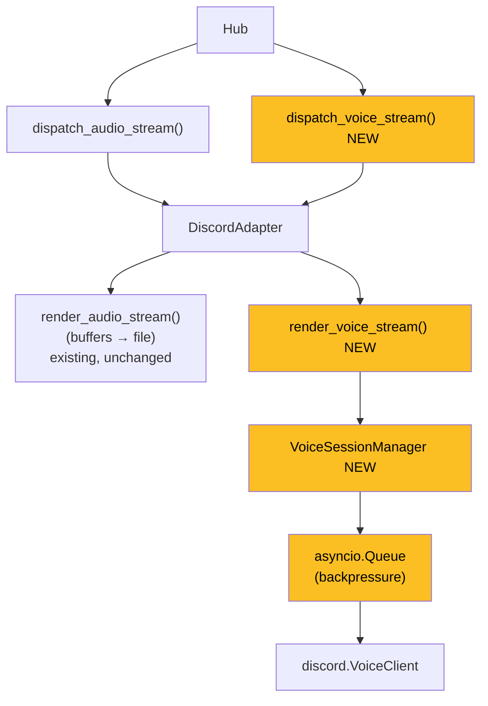

## Source

> Issue #185 — Real-time audio streaming support (Discord voice channels, Telegram voice chats). This is the most complex child of epic #139 — may need its own sub-epic.
> Blocked by #171 (InboundAudioBus) and #182 (OutboundAudio bus) — both now CLOSED.

## Problem

Lyra's current audio pipeline is **file-based and asynchronous**. Both `render_audio_stream()` methods (Discord and Telegram) call `buffer_audio_chunks()` which collects all `OutboundAudioChunk` pieces before sending a single file attachment. This is correct for voice note delivery but fundamentally incompatible with live voice channel streaming.

Three gaps block real-time voice:

1. **No VoiceClient integration.** `discord.VoiceClient` has no entry point in the codebase. `VoiceChannel` is detected in `normalize()` only to set a metadata field — Lyra cannot join, speak, or listen.
2. **No voice session state.** There is no per-guild session concept. discord.py enforces one `VoiceClient` per guild; without lifecycle management (join → stream → stay/leave), concurrent commands will race.
3. **No backpressure for live audio.** `OutboundAudioChunk` arrives at variable TTS rates. The VoiceClient's `play()` API is synchronous-callback-based; a queue is needed to pace delivery without blocking the event loop.

**Clarification on #232 overlap:** Issue #232 (`feat(voice): TTS in Discord`) routes TTS output through `render_audio_stream()` → `buffer_audio_chunks()` → `render_audio()` as a file attachment. This is NOT voice channel streaming — it sends an audio file to a text/thread channel. There is **no overlap** with #185. Both can proceed independently.

## Outcome

A user in a Discord voice channel can:
1. Send a text command (`!join` or `@Lyra join`) from the channel or a linked text channel → Lyra joins the voice channel.
2. Speak a voice command (or type) → Lyra processes and streams a TTS response **live** into the voice channel.
3. Lyra either leaves after the response (transient mode) or stays listening (persistent mode) depending on command.

The transport layer must:
- Be extensible for Telegram voice chats (deferred, but interface must not preclude it).
- Not break the existing buffered `render_audio_stream()` path (used by #232).

## Appetite

Sub-epic: 3 child issues (F-lite / F-lite / S). No single sprint can deliver end-to-end; infrastructure (VoiceSessionManager) lands first, then streaming, then inbound voice commands.

## Shapes

### Shape A: VoiceSessionManager in DiscordAdapter (Recommended)

Add a `VoiceSessionManager` class owned by `DiscordAdapter`. It manages `discord.VoiceClient` lifecycle per guild and exposes a streaming interface. Hub gets a new `dispatch_voice_stream()` path alongside the existing `dispatch_audio_stream()`.

```
Hub.dispatch_voice_stream(guild_id, chunks)
    → DiscordAdapter.render_voice_stream(guild_id, chunks)
        → VoiceSessionManager.stream(guild_id, chunks)
            → asyncio.Queue (backpressure)
            → VoiceClient.play() loop
```

**New components:**
- `VoiceSessionManager` (`adapters/discord_voice.py`) — join/leave/session state per guild, holds a reference to the `discord.Client` instance (passed at construction)
- `Hub.dispatch_voice_stream()` — platform-specific dispatch (not on Protocol)
- `render_voice_stream()` on `DiscordAdapter` (new method, not in `ChannelAdapter` Protocol)
- Command handler for `!join` / `!leave` in `on_message()`
- `on_voice_state_update` handler in `DiscordAdapter` — invalidates stale session map entries on forced disconnect

**Threading model note:** `VoiceClient.play()` drives an `AudioSource` from a `threading.Thread` — it does not `await` async queues. Backpressure must use `queue.Queue` (thread-safe stdlib) rather than `asyncio.Queue`. Implementation options: (a) an `AudioSource` subclass reading from `queue.Queue`, or (b) an async task draining `asyncio.Queue` → pipe → `AudioSource`. This must be resolved in the spec for child issue B.

**Runtime deps:** `discord.py[voice]` pulls in `PyNaCl` and requires `libopus` + `ffmpeg` binaries at runtime. Child issue A must include a provisioning step and a startup check that raises a clear error (not a silent `RuntimeError`) if binaries are missing.

**Unchanged:** `ChannelAdapter` Protocol, `render_audio_stream()`, `OutboundAudioChunk`, `InboundAudioBus`.

**Trade-offs:**
- Pro: Contained change, matches existing per-method dispatch pattern
- Pro: Easy to test VoiceSessionManager in isolation
- Pro: `ChannelAdapter` Protocol untouched — no risk to Telegram/CLI adapters
- Con: `dispatch_voice_stream()` is Discord-aware on the Hub (but so is `dispatch_audio_stream()` semantically — both are per-adapter)
- Con: Extending to Telegram later requires adding a parallel path

**Rough scope:** L (3 child issues: session manager, streaming render, hub dispatch + commands)

---

### Shape B: New VoiceChannelBus (new bus layer)

A new `VoiceChannelBus` alongside `InboundAudioBus`. Adapters register a voice session factory. Hub routes chunks via the bus; adapters drain and forward to platform.

```
Hub → VoiceChannelBus.put(guild_id, chunks)
    → Adapter drains → platform-specific stream
```

**Trade-offs:**
- Pro: Platform-agnostic — Telegram voice chat wires in cleanly later
- Pro: Mirrors the existing `InboundAudioBus` / `InboundBus` pattern
- Con: Over-engineers for Discord-only v1 — Telegram voice is deferred (and requires a completely different library: pytgcalls)
- Con: ~5 new components (bus, feeder tasks, session factory, registry, drain logic) vs. ~3 for Shape A
- Con: Hub session lifecycle (join/leave) still needs a separate mechanism regardless

**Rough scope:** XL (new bus + session registry + per-platform drain logic)

---

### Shape C: Extend OutboundAudioChunk with routing hint

Add `voice_channel_id: str | None` to `OutboundAudioChunk`. Existing `render_audio_stream()` routes to VoiceClient if set, otherwise buffers as file.

**Trade-offs:**
- Pro: Minimal protocol surface — one field addition
- Con: Leaks routing concerns (voice channel ID) into a message envelope type
- Con: Backpressure and session lifecycle still require VoiceSessionManager anyway
- Con: Semantically wrong — a chunk describes audio content, not its delivery channel

**Rough scope:** M (but wrong abstraction)

---

## Fit Check



**Shape A wins.** It matches the existing per-dispatch-type pattern on Hub (text / attachment / audio / audio-stream → each has its own dispatch + adapter method). Adding `dispatch_voice_stream()` + `render_voice_stream()` follows this pattern exactly. The `VoiceSessionManager` is a clean new class with a testable interface.

Shape B is architecturally elegant but premature — Telegram voice chat is deferred and requires a fundamentally different library (pytgcalls). Designing a shared bus around an unknown integration is speculative.

Shape C conflates routing with content — eliminated.

### Sub-epic child issues (recommended)

| # | Scope | Title | Tier |
|---|-------|-------|------|
| A | Infrastructure | `VoiceSessionManager` — guild lifecycle, join/leave, backpressure queue | F-lite |
| B | Streaming | `render_voice_stream()` + `dispatch_voice_stream()` — TTS chunk → VoiceClient pipe | F-lite |
| C | Commands | `!join` / `!leave` command handling + inbound voice routing | S |

### Files impacted (Shape A)

| File | Change |
|------|--------|
| `src/lyra/adapters/discord_voice.py` | **New** — VoiceSessionManager |
| `src/lyra/adapters/discord.py` | Add `render_voice_stream()`, `!join`/`!leave` command hooks |
| `src/lyra/core/hub.py` | Add `dispatch_voice_stream()` |
| `src/lyra/core/message.py` | No change needed — `guild_id` passed directly to `dispatch_voice_stream()`; no new envelope type required for v1 |
| `pyproject.toml` | Ensure `discord.py[voice]` dependency (Opus/FFmpeg) |
