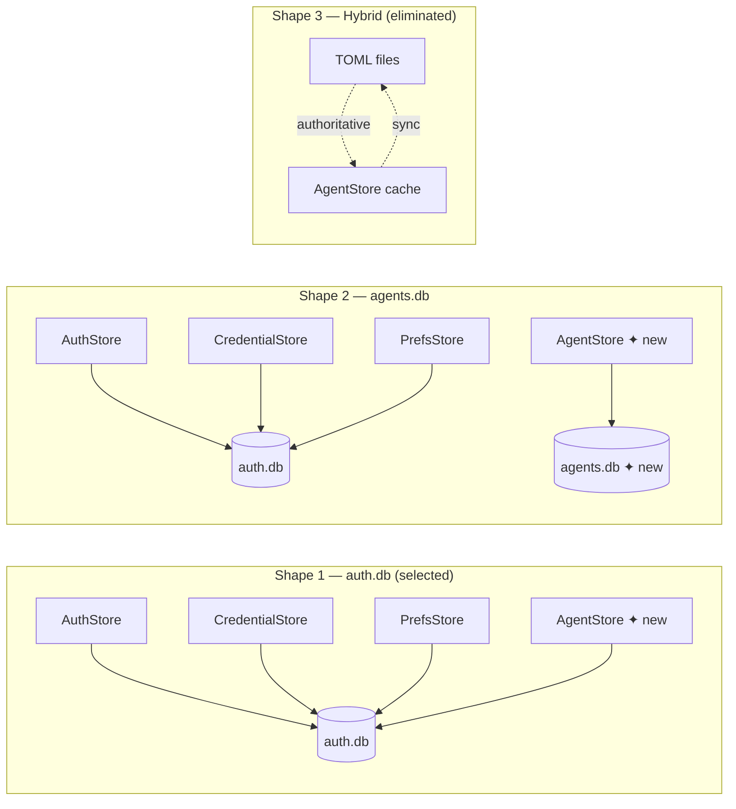

## Source

> Agent configuration in Lyra is fully static: each agent lives in a TOML file and bot↔agent
> associations are hardcoded in config.toml. Adding, editing, or deleting an agent requires a
> file edit + restart. The rest of Lyra's persistent state already lives in SQLite (auth.db).
> Agent management is the last holdout.
> — Frame #268

## Problem

Agent config is the only Lyra subsystem still file-backed. Adding or editing an agent requires:
1. Writing/editing a TOML file in `src/lyra/agents/` or `~/.lyra/agents/`
2. Editing `config.toml` to add/change the bot↔agent mapping
3. Restarting the hub

There is no programmatic CRUD, no runtime state visibility (pool count, last active), and no
way to reassign a bot to a different agent without a restart. The CLI (`lyra agent`) only wraps
TOML file I/O — six of the nine target commands don't exist yet.

## Outcome

- Operators can create, edit, delete, and reassign agents at runtime without editing files or
  restarting the hub. New conversations pick up the change immediately.
- `lyra agent list` shows all agents from a single authoritative source, with bot assignments
  and live status visible alongside config.
- Existing TOML files continue to work as seed input via `lyra agent init` — no manual
  migration or data re-entry required.
- Runtime state (pool count, last active) is visible without accessing logs or process state.

## Appetite

2-week sprint: 1 week for AgentStore + Hub bootstrap + migration CLI, 1 week for remaining
CLI commands, tests, and docs.

---

## Shapes

### Shape 1 — AgentStore in auth.db (join the shared Lyra DB)

Add an `AgentStore` class (same aiosqlite + WAL + write-through cache pattern as `AuthStore`,
`CredentialStore`, `PrefsStore`) targeting the existing `auth.db` file. Four new tables:
`agents`, `bot_agent_map`, `agent_runtime_state`, `agent_overrides`.

Hub startup: connect AgentStore → warm cache → load agent definitions from cache → create
Hub → register agents. `get_agent(name)` remains sync dict lookup — no change to Pool or Hub.

**Trade-offs:**
- Pro: Three existing stores already share auth.db (established precedent). No new file or
  infrastructure. Hub startup already opens auth.db for AuthStore + CredentialStore + PrefsStore
  — a fourth connection costs nothing extra under WAL mode.
- Pro: Consistent pattern — every new developer finds the same aiosqlite playbook.
- Con: auth.db grows further beyond its "auth" name (already contains credentials, user prefs
  — the name is aspirational at this point).
- Con: Larger schema in one file — schema inspection requires knowing all four stores.

**Rough scope:** L

### Shape 2 — AgentStore in agents.db (dedicated file)

Same AgentStore implementation, same pattern, but `Path("~/.lyra/agents.db")` instead of
`auth.db`. Hub startup opens a fifth DB connection.

**Trade-offs:**
- Pro: Cleaner conceptual separation — agents.db = agent config, auth.db = user grants/creds.
  Easier to backup agent config separately.
- Pro: Schema isolation — `agents.db` can be wiped/reset without touching auth grants.
- Con: Inconsistent with the precedent set by PrefsStore and CredentialStore (both in auth.db
  despite being broader than "auth"). Adds cognitive overhead to understand persistence layout.
- Con: Requires a new connection lifecycle in `__main__.py` startup sequence. Minor, but adds
  surface area.

**Rough scope:** L (same as Shape 1 — scope difference is negligible)

### Shape 3 — Hybrid: TOML primary + DB read cache

TOML files remain authoritative. `lyra agent init` syncs TOML → DB for querying. Writes
(create, edit, delete) update TOML files and re-sync to DB. DB is a read cache, not the source.

**Trade-offs:**
- Pro: Zero migration risk — TOML files still work if DB is corrupted.
- Con: Two sources of truth → sync bugs → cache invalidation complexity. The frame explicitly
  rejects this: "DB is authoritative thereafter."
- Con: Bot↔agent map must stay in config.toml (still requires restart to change). Doesn't
  deliver the core outcome.

**Rough scope:** XL (sync logic is deceptively complex)

---

## Fit Check

**Shape 1 (auth.db) is the right choice.**

The "auth.db is only for auth" intuition is already wrong — `CredentialStore` and `PrefsStore`
both live there. auth.db is Lyra's shared operational DB by convention, not by name. Adding
AgentStore as a fourth occupant is consistent, not an exception.

Shape 3 is eliminated: two sources of truth contradicts the frame's core constraint
("DB is authoritative thereafter").

Shape 2 is viable but adds inconsistency. The marginal benefit (schema isolation) doesn't
outweigh the cost of a third persistence file with its own lifecycle.



### DB schema (Shape 1)

Four tables added to auth.db:

```sql
-- Agent definitions (one row per agent, authoritative after init)
-- All config lives here as first-class columns — no secondary overrides table.
-- config.toml [agents.<name>] overrides are applied once at init/create time
-- and baked into the row. DB is the single source of truth thereafter.
CREATE TABLE IF NOT EXISTS agents (
    name              TEXT PRIMARY KEY,
    backend           TEXT NOT NULL CHECK(backend IN ('claude-cli','anthropic-sdk','ollama')),
    model             TEXT NOT NULL,
    max_turns         INTEGER NOT NULL DEFAULT 10,
    tools_json        TEXT NOT NULL DEFAULT '[]',   -- JSON array
    persona           TEXT,
    show_intermediate INTEGER NOT NULL DEFAULT 0,
    smart_routing_json TEXT,                        -- JSON object or NULL
    plugins_json      TEXT NOT NULL DEFAULT '[]',   -- JSON array
    memory_namespace  TEXT,
    cwd               TEXT,
    source            TEXT NOT NULL DEFAULT 'db' CHECK(source IN ('db','toml-seed')),
    created_at        TEXT NOT NULL DEFAULT (datetime('now')),
    updated_at        TEXT NOT NULL DEFAULT (datetime('now'))
);

-- Bot↔agent mapping — authoritative source for which agent serves each bot.
-- Replaces the `agent` field in [[telegram.bots]] / [[discord.bots]] config.toml
-- entries. config.toml `.agent` field is read only as a seed fallback on first boot.
CREATE TABLE IF NOT EXISTS bot_agent_map (
    platform    TEXT NOT NULL CHECK(platform IN ('telegram','discord')),
    bot_id      TEXT NOT NULL,
    agent_name  TEXT NOT NULL REFERENCES agents(name),
    updated_at  TEXT NOT NULL DEFAULT (datetime('now')),
    PRIMARY KEY (platform, bot_id)
);

-- Runtime state (pool count, liveness — updated by Hub events via AgentStore async calls)
CREATE TABLE IF NOT EXISTS agent_runtime_state (
    agent_name     TEXT PRIMARY KEY REFERENCES agents(name),
    last_active_at TEXT,
    updated_at     TEXT NOT NULL DEFAULT (datetime('now')),
    pool_count     INTEGER NOT NULL DEFAULT 0,
    status         TEXT NOT NULL DEFAULT 'idle' CHECK(status IN ('idle','active','error'))
);
```

### Bootstrap sequence change (Hub startup)

**Current** (`__main__.py`):
1. Parse config.toml → `TelegramBotConfig` / `DiscordBotConfig` with `.agent` field
2. Collect unique agent names from bot configs
3. `load_agent_config(name)` for each → reads TOML file
4. Create agents → `hub.register_agent(ag)` for each
5. Wire adapters using `bot_cfg.agent` to determine which agent serves each bot

**New** (`__main__.py`):
1. Parse config.toml → `TelegramBotConfig` / `DiscordBotConfig` (still needed for `bot_id`,
   credentials, `auto_thread`, etc. — only `.agent` field is superseded)
2. Connect `AgentStore(auth.db)` → warm cache (all agent rows + bot_agent_map loaded)
3. For each `(platform, bot_id)` from config.toml bots:
   - Look up `AgentStore.get_bot_agent(platform, bot_id)` from cache
   - Fallback: if no DB row, read `bot_cfg.agent` from TOML and seed the DB row
   - Fallback agent missing entirely → log error, skip adapter registration
4. Collect unique agent names from resolved map, load agent configs from AgentStore cache
5. Create agents → `hub.register_agent(ag)`
6. Wire adapters — `bot_cfg.agent` field from TOML is **ignored** post-migration; DB map is used
7. Orphaned DB rows (bot_agent_map entries for bots not in config.toml) are logged and skipped

config.toml `[agents.<name>]` overrides: applied **once** during `lyra agent init` or
`lyra agent create` — baked into the DB row. No overlay at runtime.

`get_agent(name)` stays sync dict lookup — Pool and Hub are unchanged.

### File impact

| File | Change | Size |
|------|--------|------|
| `src/lyra/core/agent_store.py` | **new** — AgentStore (4 tables, write-through cache) | L |
| `src/lyra/__main__.py` | **medium** — bootstrap AgentStore, load agents from DB | M |
| `src/lyra/cli.py` | **large** — 9 CLI commands (3 overhauled, 6 new) | L |
| `src/lyra/core/agent.py` | **minor** — keep `load_agent_config()` for migration path only | XS |
| `src/lyra/core/hub.py` | **none** — `get_agent()` unchanged | — |
| `src/lyra/core/pool.py` | **none** — no change | — |
| `tests/core/test_agent_store.py` | **new** — unit tests for AgentStore | M |
| `tests/test_cli.py` | **medium** — 6 new CLI command tests | M |

### Risks

1. **Migration edge case — TOML not parseable**: `lyra agent init` must be resilient to broken
   TOML files. It should skip with a warning, not abort.
2. **Bot↔agent map bootstrap — per (platform, bot_id) check, not per platform**: On first boot,
   the check for a missing mapping must be per `(platform, bot_id)` pair, not per platform
   (a Telegram-only deployment will have legitimately empty Discord rows). For each pair:
   - Row exists in `bot_agent_map` → use it.
   - Row missing + `bot_cfg.agent` set in config.toml → seed the DB and proceed.
   - Row missing + `bot_cfg.agent` absent from config.toml → log error, skip adapter.
   - Row exists but references an agent not in `agents` table → log error, skip adapter.
   - Row exists but config.toml no longer declares that bot_id → log warning, skip adapter
     (do not delete the DB row — operator may re-add the bot to config.toml later).
3. **In-flight pool agent_name**: Pools hold `agent_name` as a string set at creation time.
   Dynamic reassignment (via `lyra agent assign`) changes the DB/Hub cache, but in-flight
   pools are not re-assigned — they drain naturally. This is acceptable and matches the
   constraint ("live update" = takes effect on next pool creation).
4. **Circular delete guard**: `lyra agent delete` must refuse if any bot is assigned to that
   agent (`bot_agent_map` FK check).
