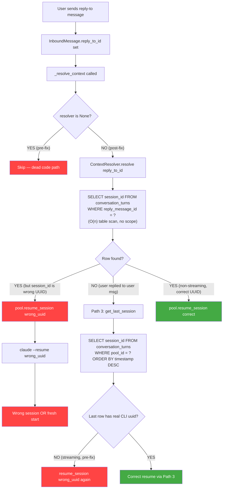
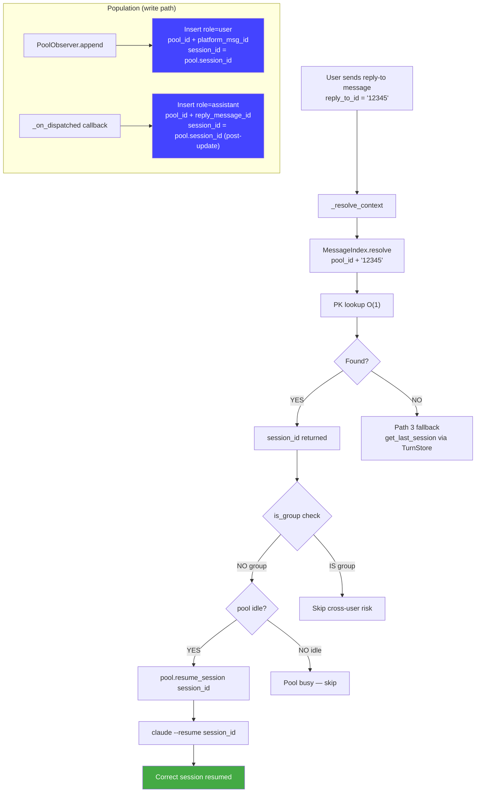

# Analysis: message_index for Session Routing (#341)

> Merged analysis — original architecture review + peer review corrections.
> Date: 2026-03-17

## Executive Summary

The `conversation_turns.reply_message_id` approach was built to serve two purposes simultaneously — turn auditing and session lookup — and fails at both under production conditions. The streaming `session_id` race condition means assistant turns are persisted with the wrong session UUID, and the `ContextResolver` was never wired into the bootstrap (the `if resolver is not None` guard was always `False`, so resolution was silently skipped). The proposed `message_index` table cleanly separates session routing from turn logging. The design is architecturally sound with the corrected schema `PRIMARY KEY (pool_id, platform_msg_id)`.

---

## 1. Why We Didn't Do This From The Start

### Original design intent

Session resumption (#318) was the last item shipped in the Phase 1b tail. The original framing was narrow: "wire `session_id` + `reply_message_id` for session resumption". It was conceived as a retrofit on the already-existing TurnStore (L1 raw turn logging, #67), not as a new subsystem.

The design assumption at #67 time was that the `reply_message_id` column — populated after an assistant turn is sent — could double as the index for "which session did this outbound message belong to?" Given that:

- Every assistant turn already writes `session_id` + `reply_message_id` to `conversation_turns`
- The query `WHERE reply_message_id = ?` returns a unique row (platform message IDs are unique per channel)
- No additional table migration was needed

...it appeared as a zero-cost extension of existing infrastructure.

### Constraints at the time

1. **Incremental delivery pressure.** Phase 1b was explicitly scoped to "ship the feature with the least new code." A new dedicated `message_index` table would have required a new store, a new connection, new Bootstrap wiring, and new population points — all while the module decomposition (#294–#312) was ongoing in parallel.

2. **Streaming was not the common path.** At the time #318 was designed, the AnthropicSdkDriver (non-streaming) was the stable path. Streaming via `ClaudeCliDriver` was a newer capability. The race condition was known but considered an edge case.

3. **ContextResolver as "close enough".** The `ContextResolver` class was written correctly but wired as `context_resolver: ContextResolver | None = None` in `Hub.__init__`. The intent was that bootstrap would pass one in, but `multibot.py` never did — the canonical "ship the interface, forget the wiring" mistake.

### Shortcuts taken and why

- **Dual-purpose column**: `reply_message_id` in `conversation_turns` serves two semantically distinct purposes: logging "which platform message did this turn produce?" and "given a platform reply-to target, which session should be resumed?". These are different queries with different cardinality and lifecycle requirements.
- **No user-side indexing**: `conversation_turns` has no index on `reply_message_id`. A lookup `WHERE reply_message_id = ?` is a full table scan (O(n) rows).
- **ContextResolver not instantiated**: `multibot.py` prior to the staged fix never created a `ContextResolver`. The class existed but `hub._context_resolver` was always `None`. The `_resolve_context` method in `message_pipeline.py` had `if resolver is not None:` — when resolver was `None`, the condition was `False`, the block was never entered, and resolution was silently skipped.

### The cascade of technical debt

```
#67: TurnStore ships — reply_message_id column added as audit field
  ↓
#318: "Session resumption" — ContextResolver built, queries reply_message_id
  ↓
#318: ContextResolver NOT wired in bootstrap (omission)
  ↓
Streaming race: session_id on assistant turns = wrong UUID (pre-dispatched value)
  ↓
Even if ContextResolver were wired: it would resolve to the wrong session_id
  ↓
Path 3 (last-active-session via get_last_session) also returns wrong UUID
  ↓
All three resume paths silently fail or resume the wrong session
```

---

## 2. Current System: What's Broken and Why

### The ContextResolver dead code story

`ContextResolver` was written, type-checked, unit-tested in isolation, and committed. But `multibot.py` never passed it to `Hub.__init__`. The Hub's `_context_resolver` field was always `None`. The `_resolve_context` method had:

```python
resolver = self._hub._context_resolver
if resolver is not None:     # <-- always False, block never entered
    resolved = await resolver.resolve(msg.reply_to_id)
```

The feature silently did nothing in all production deployments.

The staged fix in `multibot.py` adds `context_resolver = ContextResolver(db_path=...)` and passes it to `Hub.__init__`. This activates the call path — but the underlying data quality problem (wrong `session_id` values in the turns table) means the resolver now runs but returns stale or incorrect sessions.

**Additional concern**: `ContextResolver.resolve()` opens a new `aiosqlite.connect()` per call (one connection per reply-to message). With the staged fix now activating this code path, every reply-to message opens+closes a new SQLite connection. This is an immediate performance concern in the interim before `MessageIndex` replaces it.

### The conversation_turns.reply_message_id fragility

**Problem 1 — Only assistant turns have reply_message_id.** User turns are logged with `message_id=msg.id` but no `reply_message_id`. When a user replies to another user's message, the lookup returns nothing.

**Problem 2 — No index on reply_message_id.** The TurnStore schema has indices on `(session_id, timestamp)` and `(pool_id, timestamp)`. The lookup `WHERE reply_message_id = ?` is a full table scan.

**Problem 3 — Mixed concerns.** `conversation_turns` is a logging table (L1 audit trail). Using it as a routing index conflates "what happened?" (audit) vs. "which session to resume?" (routing). Different access patterns, retention policies, and consistency requirements.

**Problem 4 — No platform/bot_id scope.** `reply_message_id` is a bare `TEXT` with no `platform` or `bot_id` qualifier. Telegram message IDs are unique within a chat, not globally — `message_id = 1234` could exist in multiple different chats. The lookup returns the wrong session on collision.

**Problem 5 — User-side message IDs are not indexed.** The resolver only queries `reply_message_id` (outbound IDs). There is no path from an inbound `message_id` to a `session_id`.

### The streaming session_id race condition

The data flow for a streaming response:

```
pool_processor._process_one()
  result = agent.process(msg, pool, ...)   # returns AsyncIterator
  _outbound = OutboundMessage.from_text("")
  _outbound.metadata["_on_dispatched"] = _log_streaming_turn
  await pool._ctx.dispatch_streaming(msg, result, _outbound)
    → OutboundDispatcher spawns worker task (fire-and-forget)
    → dispatch_streaming() RETURNS IMMEDIATELY
  # <-- pool.session_id is still the old UUID here
  _stream_sid = getattr(result, "session_id", None)
  # <-- result.session_id is not set yet (iterator not consumed)
  if _stream_sid and pool.session_id != _stream_sid:
      pool.session_id = _stream_sid   # NOT reached — stream_sid is None
```

The `_log_streaming_turn` callback fires later, when the OutboundDispatcher worker finishes consuming the iterator:

```python
def _log_streaming_turn(outbound: OutboundMessage) -> None:
    _stream_sid = getattr(result, "session_id", None)  # NOW it's set
    if _stream_sid and pool.session_id != _stream_sid:
        pool.session_id = _stream_sid   # pool updated
    pool._observer.session_update_async(msg)
    pool._observer.log_turn_async(role="assistant", ...)
```

The staged fix moves `session_update_async(msg)` inside `_log_streaming_turn`. However:

- `log_turn_async` reads `pool.session_id` via a lambda at call time — this is correct since the pool update just happened.
- **`session_update_async` has a `_session_persisted` guard** that fires once per pool lifetime and becomes a no-op thereafter (only reset by `/clear`). So the fix is only correct for the **first turn** per pool. On subsequent turns, `session_update_async` is a no-op regardless of ordering. This is pre-existing behavior, not introduced by the fix.

**For non-streaming path**: `pool.session_id` is updated from `result.metadata["session_id"]` (line 275-277) BEFORE both `dispatch_response` and `session_update_async` are called. The `_log_turn` callback only calls `log_turn_async` (not `session_update_async`). `session_update_async` is called on line 296, outside the callback. The non-streaming path is already correct but for different reasons than the streaming path.

### Edge cases that fail today

| Scenario | Failure mode |
|----------|-------------|
| User replies to a bot message (streaming path, pre-fix) | `session_id` is a random UUID. Resume starts wrong session. |
| User replies to a bot message (non-streaming path) | Works only if ContextResolver is wired (post-fix). |
| User replies to another user's message | `reply_to_id` is an inbound ID. No lookup path. Path 3 fallback activates. |
| User replies to a bot message in a Telegram group | `is_group=True` guard skips resume (cross-user risk). Falls through to Path 3. |
| Two different Telegram chats produce the same message_id | `reply_message_id` collision. Wrong session resolved. |
| Pool is active when reply arrives | `pool.is_idle` check prevents resume. Correct guard, no feedback to user. |
| CliPool reaps the process (idle > idle_ttl) | `resume_session()` spawns new process with `--resume`. Only works if CLI session files still on disk. |
| Claude CLI session file deleted | `--resume` fails silently or starts fresh. No error surfaced to user. |

### Data flow diagram — current broken paths



---

## 3. Proposed Solution: message_index

### Schema (corrected)

```sql
CREATE TABLE message_index (
    pool_id          TEXT NOT NULL,   -- routing key (encodes platform:bot_id:scope_id)
    platform_msg_id  TEXT NOT NULL,   -- native Telegram/Discord message ID (always TEXT)
    session_id       TEXT NOT NULL,   -- Claude CLI session UUID
    role             TEXT NOT NULL,   -- 'user' | 'assistant'
    created_at       TEXT NOT NULL,
    PRIMARY KEY (pool_id, platform_msg_id)
);

CREATE INDEX IF NOT EXISTS idx_msgidx_pool_created
    ON message_index(pool_id, created_at);
```

> **Why `pool_id` as namespace**: `pool_id` encodes `platform:bot_id:scope_id` (confirmed in `hub_protocol.py:97-103`). This eliminates the Telegram cross-chat collision risk (Telegram IDs are per-chat, not global) without introducing a separate `scope_id` column. All population points already have `pool_id` available. The lookup in `_resolve_context` already has `pool_id` in scope.
>
> **Original schema had `PRIMARY KEY (platform, bot_id, platform_msg_id)`** — this was a bug. Telegram `message_id=1` can exist in multiple chats. The original analysis recommended adding `scope_id` as a new column, but `pool_id` already contains this information in canonical form.

**What the schema gets right:**

- **`pool_id` as namespace**: prevents Telegram cross-chat collisions, compact 2-column PK.
- **Both roles indexed**: covers user AND assistant messages. Enables reply-to-resume when a user replies to another user's message.
- **Separate concern**: decoupled from turn auditing. Can be optimized for lookup independently.
- **Correct session_id population timing**: populated at the point where the real CLI session_id is known (post-dispatch).

**Conflict policy**: `INSERT OR IGNORE` — preserves original session mapping on message edits (platform reuses same message_id).

### Population flow

Population requires two writes per exchange:

**1. User turns** — at `PoolObserver.append()` time:
- `pool_id` = `pool.pool_id`
- `platform_msg_id` = `str(msg.platform_meta["message_id"])`
- `session_id` = `pool.session_id` (pre-response value — the session the message belongs to)
- `role` = `'user'`

> **Wiring requirement**: `PoolObserver` currently only has `_turn_store: TurnStore | None` and `register_turn_store()`. Adding `MessageIndex` writes requires adding `_message_index: MessageIndex | None` and `register_message_index()` to `PoolObserver`, mirroring the `TurnStore` wiring pattern. This is wired via `Hub.set_message_index()` (parallel to `Hub.set_turn_store()`).

> **Known acceptable inconsistency**: The user-turn `session_id` is captured before the response. If the session_id changes mid-stream (first message after process spawn), the user-turn entry holds the old value. This is acceptable — the user message was processed under that session.

**2. Assistant turns** — in `_on_dispatched` callback:
- `pool_id` = `pool.pool_id`
- `platform_msg_id` = `str(outbound.metadata["reply_message_id"])`
- `session_id` = `pool.session_id` (post-update, guaranteed correct at callback time)
- `role` = `'assistant'`

> **Circuit-breaker edge case**: When the circuit breaker is open, `outbound_dispatcher.py` explicitly sets `reply_message_id = None` before firing `_on_dispatched`. The callback IS fired, but with a null `reply_message_id`. The assistant turn is NOT indexed. Path 3 fallback covers this gap (the user turn was already indexed at `append()` time).

**Non-streaming vs streaming paths:**
- **Non-streaming**: `pool.session_id` is updated from `result.metadata["session_id"]` (line 275-277) BEFORE `dispatch_response` is called. The `_log_turn` callback fires inside `dispatch_response`. `session_update_async` fires AFTER the callback (line 296). Ordering is correct.
- **Streaming**: `pool.session_id` is updated inside `_log_streaming_turn` callback, just before `log_turn_async`. Correct for session_id capture.

### Lookup flow

```python
async def resolve(pool_id: str, reply_to_id: str) -> ResolvedSession | None:
    """O(1) PK lookup — no table scan."""
    row = await db.execute_fetchone(
        "SELECT session_id FROM message_index "
        "WHERE pool_id = ? AND platform_msg_id = ? LIMIT 1",
        (pool_id, str(reply_to_id))
    )
    return ResolvedSession(session_id=row[0]) if row else None
```

> **Lookup requires `pool_id`**: The caller (`_resolve_context`) already has the current `pool_id` from the inbound message routing. This is correct because reply-to-resume only makes sense within the same pool (same platform + bot + scope).

### Data flow diagram — new path



---

## 4. Limits of the Proposed Solution

### What message_index will NOT solve

**1. Claude CLI session file lifetime.** `message_index` correctly stores/retrieves the `session_id` UUID. But `claude --resume <uuid>` requires the session file on disk. If Claude CLI prunes old session files, `--resume` starts fresh silently. This is an external-system reliability problem `message_index` cannot compensate for.

**2. In-flight session changes.** User turns indexed at `append()` time hold the pre-response `session_id`. If the session_id changes mid-stream (first message after process spawn), the user-turn entry holds the old value. This is a known acceptable inconsistency for a narrow edge case.

**3. Group chat cross-user risk.** The `is_group` guard in `_resolve_context` skips reply-to-resume for groups. `message_index` does not store `user_id`, so it cannot enforce "only resume if the replying user is the same as the session owner." Adding `user_id` to the schema would enable fine-grained group chat resume (Phase 2 enhancement).

**4. Reply chains and re-branching.** If a user resumes session S1, then S2 via different replies, then replies to S1 again — Lyra resumes S1 correctly from `message_index`, but the pool's `session_id` was overwritten when S2 was loaded. `message_index` returns the historical session_id, which is correct for the reply target. The pool state switching is the correct behavior.

**5. Non-CLI backends.** `AnthropicSdkDriver` has no session resume mechanism (history is sent inline). `message_index` is populated for SDK agents too, but Path 1 resume is a no-op. Not a regression — current behavior.

**6. `_session_persisted` interaction with `resume_session`.** When a session is resumed via reply-to, `pool.session_id` is updated but `_session_persisted` is NOT reset (only `/clear` resets it). The resumed session_id is never persisted via `session_update_async`. **Fix**: call `reset_session_persisted()` inside `Pool.resume_session()`.

### Edge cases to watch

| Edge case | Risk | Mitigation |
|-----------|------|-----------|
| Message deleted on platform after indexing | Orphaned entry; platform prevents replying to deleted message | Benign — entry never queried |
| Message edit on platform (same message_id) | PK conflict on re-insert | `INSERT OR IGNORE` preserves original session mapping |
| `reply_message_id` is None (circuit-breaker open) | Assistant turn not indexed; callback fires with null value | User turn still indexed; Path 3 fallback |
| `platform_msg_id` type mismatch (int vs string) | Silent mismatch `12345` vs `"12345"` | Normalize to `str()` in `MessageIndex.upsert()` method |
| Bot restart | In-memory `pool.session_id` resets to fresh UUID | Old `message_index` entries remain valid; new entries indexed under new UUID; `--resume new_uuid` starts fresh (expected behavior, not a regression) |
| First post-restart reply-to a pre-restart message | `message_index` returns old session_id | `--resume old_uuid` works if CLI session file exists |

### Cold start

On first deployment, `message_index` is empty. All incoming reply-to messages fall through to Path 3 (`get_last_session`) until fresh traffic populates the index. This is the expected cold-start behavior and **not a regression** — Path 1 is currently broken anyway. No backfill from `conversation_turns` (data quality is too poor).

---

## 5. Long-Term Scalability Assessment

### Will this hold for N platforms?

Yes. `pool_id` naturally partitions by `platform:bot_id:scope_id`. Adding a new platform requires ensuring the adapter populates `message_index` at the correct call points and that platform message IDs are unique within `(pool_id)`.

### Will this hold for N bots per platform?

Yes. `pool_id` encodes `bot_id`. Each bot's messages are isolated. No cross-bot contamination.

### Will this hold for high-volume usage?

At personal use (1–5 users, ~50 exchanges/day): ~200 rows/day, ~73,000 rows/year. SQLite handles this trivially. PK lookups are sub-millisecond. Disk < 10MB/year.

`aiosqlite` serializes writes through a single connection. Bottleneck at ~1,000–5,000 writes/second. Lyra's effective rate is orders of magnitude below this (bounded by LLM latency).

### Migration path

`message_index` is a pure key-value index. If needed:
1. Redis with TTL per entry (eliminates cleanup problem)
2. PostgreSQL with composite index (drop-in schema replacement)
3. In-memory LRU cache as hot-path layer above SQLite

None require changes to the `MessageIndex` interface.

---

## 6. Alternative Approaches Considered

### Why not just fix ContextResolver?

The staged diff wires `ContextResolver`, but it only addresses the dead code problem. Even wired, `conversation_turns`:
- Has no index on `reply_message_id` (O(n) scan)
- Has wrong `session_id` values for historical streaming turns
- Has no entries for user-side inbound messages
- Has the Telegram collision problem
- Opens a new SQLite connection per call

Wiring is necessary but not sufficient.

### Why not use the TurnStore directly?

Inherits all problems above. The deeper issue: `conversation_turns` stores the audit trail (grows forever); `message_index` stores the minimal routing key (can be cleaned up after 30 days). Different access patterns, retention policies, consistency requirements.

### Why not an in-memory cache?

Works for the common case but fails on:
1. Bot restart (cache lost)
2. Memory growth (unbounded unless capped)
3. Multi-process deployment (Phase 2)

Viable as a hot-path layer on top of SQLite, not as a replacement.

### Why not a graph-based approach?

Over-engineered. The access pattern is a single lookup: "given a message ID, what session was it in?" A graph adds complexity (traversal, cycle detection, node merging) with no benefit.

---

## 7. Recommendations

### Verdict: Go, with modifications

The `message_index` table is architecturally sound. It correctly separates routing from auditing and addresses all three root causes.

### Implementation order

1. **Write `MessageIndex` store** (`src/lyra/core/message_index.py`): `connect()`, `upsert()`, `resolve()`, `cleanup_older_than()`. Normalize `platform_msg_id` to `str()` in `upsert()`.
2. **Add to `StoreBundle`** in `multibot_stores.py` via `open_stores` context manager.
3. **Wire into Hub**: add `Hub.set_message_index()` with `_message_index.close()` in `Hub.shutdown()`. Trace lifetime ordering: `hub.shutdown()` must complete before `open_stores` exits.
4. **Wire into PoolObserver**: add `register_message_index()` mirroring `register_turn_store()`. Called from `Hub.set_message_index()`.
5. **Populate user turns** in `PoolObserver.append()`.
6. **Populate assistant turns** in `_on_dispatched` callbacks in `pool_processor._process_one()` (both streaming and non-streaming paths). Guard on `reply_message_id is not None`.
7. **Replace `_resolve_context` Path 1**: call `MessageIndex.resolve(pool_id, reply_to_id)` instead of `ContextResolver.resolve()`.
8. **Delete `context_resolver.py`**. Remove from `multibot.py` and `Hub.__init__`. Replace `Hub._context_resolver` with `Hub._message_index`.
9. **Fix `_session_persisted`**: call `reset_session_persisted()` inside `Pool.resume_session()`.

### Risk mitigation

| Risk | Mitigation |
|------|-----------|
| Telegram cross-chat collision | `pool_id` in PK encodes scope — collision impossible |
| Stale index after CLI session file deletion | Gate `resume_session` on session file existence check in `CliPool` |
| `_on_dispatched` fires with `reply_message_id = None` | Guard in `upsert()`: skip if `platform_msg_id` is None. User turn still indexed. |
| Wrong session_id in historical turns.db rows | Do NOT backfill from `conversation_turns` — start fresh |
| `_session_persisted` blocks re-persistence after resume | Reset flag in `Pool.resume_session()` |
| `hub.shutdown()` vs `StoreBundle` lifetime ordering | Document: `hub.shutdown()` must not call stores after `open_stores` exits |
| Cold start (empty table on first deploy) | Expected behavior; not a regression (Path 1 currently broken anyway) |
| Group chat multi-user sessions | Retain `is_group` guard until `user_id` added to schema |

### Open question

The `_session_resume_fn` in `Pool` is only wired for `ClaudeCliDriver`. Whether `message_index` should silently no-op for SDK agents (current behavior) or a future "resume via history replay" mechanism should be designed is a product decision. Current approach (no-op) is correct for Phase 1.
