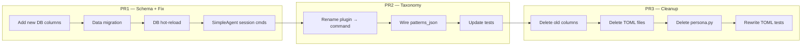

## Source

Issue #343 — `/add` returns "Unknown command" on both deployed bots. Investigation revealed config drift between TOML seed files and the DB, broken session command registration for `SimpleAgent`, and scattered voice/persona config across files.

## Problem

Agent configuration lives in three drifting sources (TOML, persona files, DB). Hot-reload reads TOML (stale), not DB (truth). The naming taxonomy conflates "plugins" (directory-based command handlers) with functional modules (`/add`, `/search`). Voice config is split across persona `[voice]` (decorative), `tts_json`, `stt_json`, and `i18n_language`. Session commands (`/add`, `/explain`, `/summarize`) only register for `AnthropicAgent`, not the deployed `SimpleAgent`.

## Outcome

- Single source of truth: DB for all agent config, no file-based indirection
- `/add`, `/explain`, `/summarize` work on both bots (claude-cli backend)
- Clean taxonomy: tools / commands / plugins / patterns
- Voice config unified in one `voice_json` column with shared `fallback_language`
- Hot-reload watches DB `updated_at`, not TOML mtime

## Appetite

2-week cycle. L-sized, κ=7, F-full tier.

## Shapes

### Shape 1: Big Bang Migration

All changes in one pass: schema migration, persona inline, voice merge, taxonomy rename, session command fix, TOML deletion, test rewrites.

**Trade-offs:**
- Pro: Clean cut, no transitional state, no backward compat shims
- Pro: Single PR to review, single merge
- Con: ~40 files touched, massive PR, hard to review
- Con: If anything breaks, hard to bisect
- Con: 50+ test cases need rewriting simultaneously

**Rough scope:** XL

### Shape 2: Layered Migration (3 PRs)

Split into logical layers that each leave the codebase working:

**PR1 — Schema + hot-reload + session fix** (critical path, unblocks `/add`):
- Add `persona_json`, `voice_json`, `patterns_json`, `fallback_language` columns (additive ALTER TABLE)
- Write data migration: read existing `persona` name → load `.persona.toml` → compose `persona_json`; merge `tts_json` + `stt_json` → `voice_json`; copy `i18n_language` → `fallback_language`
- Replace TOML mtime hot-reload with DB `updated_at` polling (inject `AgentStore` into `AgentBase`)
- Fix `SimpleAgent._register_session_commands()` — unblocks `/add`
- `agent_db_loader.py` reads new columns, falls back to old columns if new are NULL
- Old columns stay (deprecated, not removed)

**PR2 — Taxonomy rename**:
- `PluginLoader` → rename across codebase (classes, files, directories)
- `plugins_enabled` → `commands_enabled` in Agent config
- `src/lyra/plugins/` → `src/lyra/commands/`
- Session commands become "plugins" in the new taxonomy
- `patterns_json` wired into `CommandRouter.prepare()`
- Test renames follow code renames

**PR3 — Cleanup**:
- Delete old columns via table rebuild (12-step SQLite migration)
- Delete `src/lyra/agents/*.toml`, `~/.roxabi-vault/personas/*.persona.toml`
- Delete `persona.py`, old TOML loading path in `agent_loader.py`
- Delete `AgentTTSConfig`, `AgentSTTConfig` (replaced by `voice_json` parsing)
- Rewrite 50+ TOML-dependent tests to use `AgentRow`/direct `Agent()` construction

**Trade-offs:**
- Pro: Each PR is reviewable, testable, deployable independently
- Pro: PR1 alone unblocks `/add` immediately
- Pro: If taxonomy rename (PR2) gets messy, PR1 is already shipped
- Con: Transitional state with both old and new columns
- Con: 3 review cycles instead of 1

**Rough scope:** L (total), M per PR

### Shape 3: Minimal Fix + Defer Refactor

Only fix the immediate bugs, defer the architectural cleanup:

**PR1 — Session command fix only**:
- Add `_register_session_commands()` to `SimpleAgent` (10 lines)
- Unblocks `/add`, `/explain`, `/summarize`

**Defer everything else** to a future issue.

**Trade-offs:**
- Pro: Shipped in an hour, zero risk
- Con: Config drift remains, taxonomy stays confused, voice stays scattered
- Con: Creates a "good enough" state that never gets cleaned up

**Rough scope:** S

## Fit Check

**Shape 2 (Layered Migration)** is the best fit.

- Shape 1 is too risky — a 40+ file PR is unreviable and hard to bisect
- Shape 3 fixes the symptom but not the disease — config drift will bite again
- Shape 2 gives immediate value (PR1 unblocks `/add`) while committing to the full cleanup

### Files Impacted

| Domain | Files | PR |
|--------|-------|----|
| DB schema | `agent_schema.py`, `agent_models.py`, `agent_store.py` | PR1 |
| DB loader | `agent_db_loader.py`, `agent_builder.py` | PR1 |
| Hot-reload | `agent.py` (`_maybe_reload`, `__init__`) | PR1 |
| Session fix | `simple_agent.py` | PR1 |
| Agent factory | `agent_factory.py`, `multibot.py` (inject store) | PR1 |
| Persona compose | `persona.py` (new: inline from JSON) | PR1 |
| Voice config | `agent_config.py`, `voice_overlay.py`, `tts/__init__.py`, `audio_pipeline.py`, `hub_outbound.py` | PR1 |
| STT config | `stt/__init__.py` | PR1 |
| Messages | `messages.py`, `bootstrap/config.py` | PR1 |
| Plugin loader | `plugin_loader.py` → rename | PR2 |
| Plugin manager | `agent_plugins.py` → rename | PR2 |
| Command router | `command_router.py` (patterns, taxonomy) | PR2 |
| Plugin dir | `src/lyra/plugins/` → `src/lyra/commands/` | PR2 |
| Agent config | `agent_config.py` (`plugins_enabled` → `commands_enabled`) | PR2 |
| Builtins | `builtin_commands.py` (help text) | PR2 |
| TOML loader | `agent_loader.py` (delete) | PR3 |
| Seeder | `agent_seeder.py` (simplify) | PR3 |
| Persona file | `persona.py` (delete old, keep compose from JSON) | PR3 |
| CLI | `cli_agent_crud.py`, `cli_agent_create.py`, `cli_agent.py` | PR3 |
| Tests | 21 test files across all PRs | PR1-3 |

### Migration Strategy (SQLite constraints)

- **Add columns**: simple `ALTER TABLE ADD COLUMN` (existing pattern, idempotent)
- **Drop columns**: requires 12-step table rebuild (existing pattern in `memory_schema.py`)
- **Data migration**: run once at startup in `AgentStore.connect()` — read old columns, populate new, set a migration flag
- **Dual-read period**: `agent_db_loader.py` reads new columns first, falls back to old if NULL (PR1 → PR3 window)
