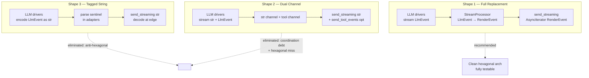

## Source

UX reflection on rendering Claude `tool_use` blocks in Telegram/Discord → generalised to full
architecture gap analysis. Trigger: tool calls are invisible to users in real time; the domain has
no event model between LLM and outbound.

Refs: `docs/architecture/target-architecture.md`, `docs/architecture/current-state.md`,
`docs/architecture/gap-analysis.md`

## Problem

`LlmProvider.complete()` buffers the entire LLM response. Tool-use blocks are processed internally
by drivers and never surface to the domain core. `ChannelAdapter.send_streaming()` receives only
`AsyncIterator[str]`, making real-time tool call visibility impossible.

Six concrete gaps block the hexagonal target:

| Gap | Missing | Complexity |
|-----|---------|------------|
| G1 | `LlmProvider.stream() → AsyncIterator[LlmEvent]` | M |
| G2 | `llm/events.py` — `TextLlmEvent \| ToolUseLlmEvent \| ResultLlmEvent` | S |
| G3 | `core/stream_processor.py` — aggregation, thresholds, throttle | M-L |
| G4 | `core/render_events.py` — `TextRenderEvent \| ToolSummaryRenderEvent` | S |
| G5 | `send_streaming(AsyncIterator[str])` → `AsyncIterator[RenderEvent]` | M |
| G6 | `[tool_display]` config section missing | S |

**Key finding from code exploration (gap doc omission):**
`hub_outbound.dispatch_streaming()` has a TTS tee that collects `str` chunks for voice synthesis.
Changing the stream type to `AsyncIterator[RenderEvent]` requires updating the tee to extract text
from `TextRenderEvent` — this adds `core/hub_outbound.py` to the blast radius.

Also: `ClaudeCliDriver.stream()` already exists and returns `AsyncIterator[str]` (text-only,
via `CliPool.send_streaming()`). The target replaces this with `AsyncIterator[LlmEvent]`, which
also means changing `SimpleAgent.process()`'s return type from
`Response | AsyncIterator[str]` → `Response | AsyncIterator[RenderEvent]`.

## Outcome

Tool calls are visible to users in real-time during streaming responses on Telegram and Discord.
`StreamProcessor` is fully unit-tested without network access. A new LLM adapter or outbound
channel only needs to speak `LlmEvent` / `RenderEvent` — no platform knowledge crosses the
hexagonal boundary.

## Appetite

**~5 dev days** across 5 independently-mergeable phases. P1 + P2 in parallel; P3 unblocked after
both; P4 after P3; P5 independent.

```
P1 (½ day) — Type definitions        llm/events.py + core/render_events.py
P2 (1 day)  — LLM driver stream()    base.py + sdk.py + cli.py + CliPool
P3 (2 days) — StreamProcessor        core/stream_processor.py + tests (~15 cases)
P4 (1 day)  — Outbound adapters      hub_outbound.py + hub_protocol.py + telegram + discord
P5 (½ day)  — Config + wiring        config.toml.example + bootstrap/config.py
```

## Shapes

### Shape 1: Full hexagonal replacement (recommended)

Replace the `str`-based streaming stack end-to-end:

1. `llm/events.py` — new frozen dataclasses: `TextLlmEvent | ToolUseLlmEvent | ResultLlmEvent`
2. `LlmProvider` protocol gains `stream() → AsyncIterator[LlmEvent]`
3. `AnthropicSdkDriver.stream()` — new method, exposes `tool_use` content blocks
4. `ClaudeCliDriver.stream()` — replaces current `AsyncIterator[str]` return type
5. `core/render_events.py` — new frozen dataclasses: `TextRenderEvent | ToolSummaryRenderEvent`
6. `core/stream_processor.py` — aggregation engine, config-driven, channel-agnostic
7. `ChannelAdapter.send_streaming()` — signature changes to `AsyncIterator[RenderEvent]`
8. `hub_outbound.dispatch_streaming()` — TTS tee updated to extract `TextRenderEvent.text`
9. `telegram_outbound.send_streaming()` — renders `ToolSummaryRenderEvent` via `editMessage`
10. `discord_outbound.send_streaming()` — renders `ToolSummaryRenderEvent` via embed update
11. `bootstrap/config.py` + `config.toml.example` — `[tool_display]` section

**Trade-offs:**
- Pro: Cleanest architecture — aligns exactly with hexagonal target
- Pro: StreamProcessor fully testable in isolation
- Pro: New adapters/providers only speak their own event type
- Con: 11 files touched across 4 layers — broadest blast radius
- Con: `SimpleAgent.process()` return type changes; pool/hub dispatch chain all updated
- Con: Voice TTS tee in `hub_outbound.py` must be adapted

**Rough scope:** L

---

### Shape 2: Additive dual-channel

Keep `send_streaming(AsyncIterator[str])` for text. Add a parallel optional method:

```python
# hub_protocol.py (additive)
async def send_tool_events(
    self,
    original_msg: InboundMessage,
    events: AsyncIterator[ToolSummaryRenderEvent],
) -> None: ...  # duck-typed optional
```

`SimpleAgent` emits str text chunks on one channel and dispatches a `ToolSummaryRenderEvent` stream
on a second. Adapters that support it implement `send_tool_events()`; others silently skip.

**Trade-offs:**
- Pro: Zero breaking changes to text streaming path
- Pro: TTS tee and str pipeline fully untouched
- Con: Two parallel event streams must be coordinated and multiplexed
- Con: Timing alignment is non-trivial — tool events and text chunks must interleave correctly
- Con: Doesn't achieve the hexagonal target; ChannelAdapter remains coupled to `str`
- Con: Permanent protocol bifurcation accumulates debt

**Rough scope:** M (fewer files, but coordination logic is subtle)

---

### Shape 3: Tagged string encoding (quick win / tech debt)

Encode tool events as specially-tagged strings in the existing `AsyncIterator[str]` stream:

```python
# e.g. "\x00TOOL_SUMMARY:{json}\x00" interleaved with text chunks
```

Outbound adapters decode: if chunk matches sentinel, render as tool summary; otherwise, text.

**Trade-offs:**
- Pro: Zero protocol changes — everything stays `AsyncIterator[str]`
- Pro: Smallest implementation surface
- Con: Parsing sentinel strings is fragile and leaky
- Con: Type safety is lost; all consumers must decode
- Con: Explicitly anti-hexagonal; domain logic bleeds into str encoding
- Con: TTS would synthesize tool-summary JSON as speech unless explicitly stripped

**Rough scope:** S (implementation) + XL (eventual cleanup debt)

## Fit Check



**Shape 3 eliminated:** Sentinel encoding is anti-hexagonal by definition. TTS corruption risk
alone disqualifies it.

**Shape 2 eliminated:** Dual-channel coordination has hidden complexity — text and tool events
must interleave at the right moments. The `hub_outbound.py` TTS tee still processes only str, so
the voice path remains broken. This shape doesn't close the hexagonal gap it claims to address.

**Shape 1 is the fit.** The blast radius (11 files, 4 layers) is real but bounded. Each phase is
independently mergeable, which de-risks the rollout. `complete()` stays intact with zero
regression on the non-streaming path. The existing `telegram_outbound.send_streaming()` — 135
lines of well-crafted debounce/fallback/overflow logic — can be adapted rather than rewritten; the
core structure (placeholder, edit-in-place, final publish) maps cleanly to `RenderEvent` types.

The TTS tee in `hub_outbound.py` — the only non-obvious impact — requires a small update: extract
`TextRenderEvent.text` instead of raw str chunks. This is contained.

### Files impacted — Shape 1

| Phase | File | Change |
|-------|------|--------|
| P1 | `llm/events.py` | **New** — LlmEvent dataclasses |
| P1 | `core/render_events.py` | **New** — RenderEvent dataclasses |
| P2 | `llm/base.py` | Add `stream()` to Protocol |
| P2 | `llm/drivers/sdk.py` | Implement `stream()` → `AsyncIterator[LlmEvent]` |
| P2 | `llm/drivers/cli.py` | Retype `stream()` → `AsyncIterator[LlmEvent]` |
| P3 | `core/stream_processor.py` | **New** — StreamProcessor + ToolDisplayConfig |
| P4 | `agents/simple_agent.py` | Return type `Response \| AsyncIterator[RenderEvent]` |
| P4 | `core/hub_protocol.py` | `send_streaming()` signature update |
| P4 | `core/hub_outbound.py` | TTS tee extracts `TextRenderEvent.text` |
| P4 | `core/outbound_dispatcher.py` | `AsyncIterator[str]` annotation update (type-only) |
| P4 | `adapters/telegram_outbound.py` | Render `ToolSummaryRenderEvent` |
| P4 | `adapters/discord_outbound.py` | Render `ToolSummaryRenderEvent` |
| P5 | `config.toml.example` | `[tool_display]` section |
| P5 | `bootstrap/config.py` | `_load_tool_display_config()` |

**Circuit-breaker asymmetry (to carry to spec):** `RetryDecorator` and `CircuitBreakerDecorator`
wrap `complete()` only. `stream()` is accessed via `getattr(self._provider, "stream", None)` in
`simple_agent.py`, bypassing the decorator stack. This asymmetry exists today and carries forward
unchanged — streaming has no CB protection. The spec must document this explicitly so the
implementor does not assume parity.
