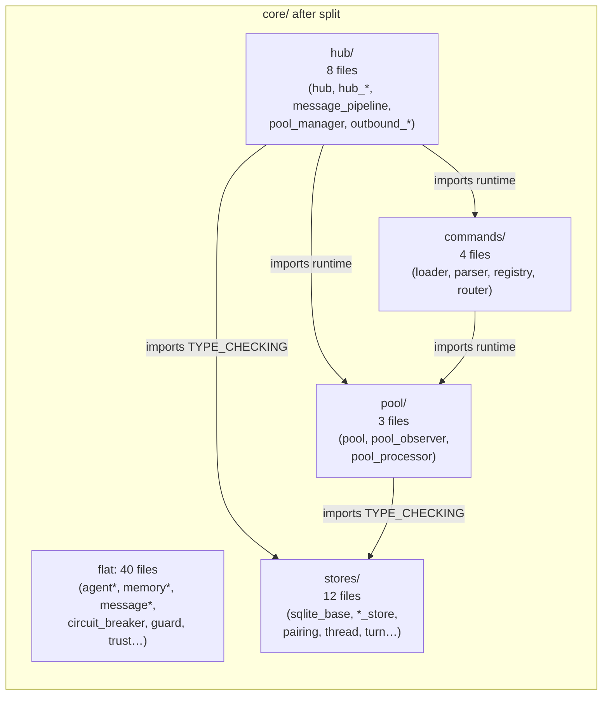
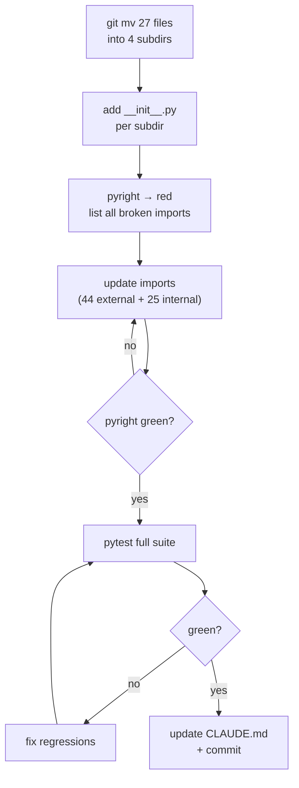

## Source

> `src/lyra/core/` contains 60+ files — 3× the recommended 20-file limit. Navigating,
> searching, and maintaining mental models in this directory is painful for both humans and
> AI agents.
> — Issue #395

## Problem

`src/lyra/core/` has **68 Python files** (71 directory entries including `CLAUDE.md`,
`processors/`, `__pycache__`). Every agent session that opens this directory must build a
mental model from a flat, undifferentiated list. The naming conventions already reveal four
natural clusters (`*_store.py`, `hub*.py`, `pool*.py`, `command*.py`) but they are invisible
as filesystem structure.

The immediate cost: Wave 1 CLAUDE.md agents (PR #407) flagged core/ as the top
context-overhead directory in every module doc they wrote. The ROADMAP refactoring policy
(PR #404) enforces a 20-file ceiling; core/ is 3.35× over it today.

## Outcome

`src/lyra/core/` is split into four named subdirectories. Each subdir has its own
`__init__.py` and is ≤12 files. All 44 external consumers and ~25 internal files import from
new paths. CI is fully green. `core/CLAUDE.md` is updated to reflect the new layout.

Note: after this split, 41 files remain flat in `core/` (agent cluster, memory cluster, etc.)
— still above 20. That remainder is follow-up scope (not this issue; see Wave 3+ refactoring
cadence in ROADMAP.md).

## Appetite

1 focused session, ~3–4 hours. Parallelisable into two worktrees (stores/ + hub/ in one;
pool/ + commands/ in the other) if needed.

## Critical Finding — Circular Dependency

**`pool_manager.py` and `message_pipeline.py` cannot go in `pool/`.**

Verified from import graph:

```
hub.py        → imports pool_manager, message_pipeline
pool_manager  → imports hub (circular with hub/)
message_pipeline → imports hub (circular with hub/)
```

If `pool_manager` and `message_pipeline` were placed in `core/pool/`, Python would see:
`core.hub` ↔ `core.pool` as a cross-package circular import. This breaks at import time.

**Resolution: both files belong in `core/hub/`** — they are already architecturally part of
the hub orchestration layer, not the pool primitive layer.

## Proposed Groupings

| Subdir | Files | Count |
|--------|-------|-------|
| `stores/` | sqlite_base, agent_store, agent_store_protocol, json_agent_store, auth_store, credential_store, message_index, pairing, pairing_config, prefs_store, thread_store, turn_store | **12** |
| `hub/` | hub, hub_outbound, hub_protocol, hub_rate_limit, **message_pipeline**, **pool_manager**, outbound_dispatcher, outbound_errors | **8** |
| `pool/` | pool, pool_observer, pool_processor | **3** |
| `commands/` | command_loader, command_parser, command_registry, command_router | **4** |
| **core/ flat (unchanged)** | agent*, auth, authenticator, audio_pipeline, builtin_commands, circuit_breaker, cli_pool*, debouncer, events, guard, identity, inbound_bus*, memory*, message*, persona, processor_registry, render_events, runtime_config, session_lifecycle, stream_processor, tool_display_config, trust, workspace_commands | **40** |

**Total moved: 27 files. core/ flat: 68 → 41 (+ 4 subdirs).**



## Shapes

### Shape 1: Full move + all-import updates ✅ Recommended

Move all 27 files into subdirs. Update every import site (44 external files, ~25 internal).
No stub shims. Pyright strict catches every missed import — build fails until all sites are
updated.

**Trade-offs:**
- Pro: Clean, no tech debt, no confusing stub layer
- Pro: Pyright acts as a completeness oracle — green CI = all imports updated
- Pro: `core/__init__.py` stays minimal (already re-exports 20 key symbols)
- Con: ~75 files to update (44 external + ~31 internal) — large PR, must be done atomically
- Con: Merge conflicts if any other branch touches core/ imports simultaneously

**Rough scope:** M (1 focused session, parallelisable)

### Shape 2: Stub-shim migration

Move files into subdirs. Keep stub files at old paths (`core/agent_store.py` → `from
lyra.core.stores.agent_store import *`). External consumers need no changes.

**Trade-offs:**
- Pro: Zero external churn — no consumer breakage
- Con: Adds 27 stub files; two sources of truth for every moved module
- Con: Future agents will find `core/agent_store.py` AND `core/stores/agent_store.py` —
  confusion guaranteed
- Con: Violates the entire goal (core/ still has 67 entries)

**Rough scope:** S (but creates M of debt)

### Shape 3: Stores-only incremental split

Move only `stores/` (12 files, no circular risk). Defer hub/pool/commands.

**Trade-offs:**
- Pro: Lowest risk — stores group has clean, one-directional dependencies
- Pro: Unblocks partial CLAUDE.md improvements
- Con: core/ goes from 67 → 55 — still 2.75× over limit
- Con: Wave 3 issues (#396, #397) remain partially blocked
- Con: hub/pool/commands still unsplit — deferred debt

**Rough scope:** XS (but incomplete)

## Fit Check

Shape 1 is the only option that fully closes the issue and unblocks Wave 3.

Shape 2 is an anti-pattern — it solves nothing structurally while adding 27 more files.

Shape 3 is safe but insufficient. The circular dep risk in hub/pool (which makes Shape 3
tempting) is **already resolved** by the grouping decision: pool_manager and message_pipeline
go into `hub/`, not `pool/`. Once that's understood, Shape 1 has no unresolved circular risk.

**Execution strategy for Shape 1:**

1. Move files (git mv — preserves history)
2. Add `__init__.py` to each subdir (minimal, exports key symbols)
3. Run `pyright` — red = import sites that need updating. Iterate.
4. Run `pytest` — green = done.
5. Update `core/CLAUDE.md` to describe new layout.

The import updates are mechanical (find+replace with verified patterns) but numerous. A
plan task that handles each subdir as a separate task file keeps this atomic and reviewable.



## Files Impacted (external, by package)

Counts from `grep -r 'from lyra.core' src/ --include="*.py" -l` on 2026-03-23.
`core/__init__.py` currently re-exports 20 key symbols (Hub, Pool, Agent, message types,
render events) — see `src/lyra/core/__init__.py`. Whether moved symbols are added to
`core/__init__.py` for backward compat during the PR window is an **open implementation
decision** to be resolved in the plan.

| Package | Files | Impact |
|---------|-------|--------|
| `adapters/` | 20 files | Import path updates |
| `bootstrap/` | 7 files | Import path updates |
| `agents/` | 2 files | Import path updates |
| `commands/` plugins | 4 files | Import path updates |
| `cli_*.py` | 5 files | Import path updates |
| `llm/` | 4 files | Import path updates |
| `tts/` | 1 file | Import path updates |
| `core/` internal | ~31 files | Import path updates |
