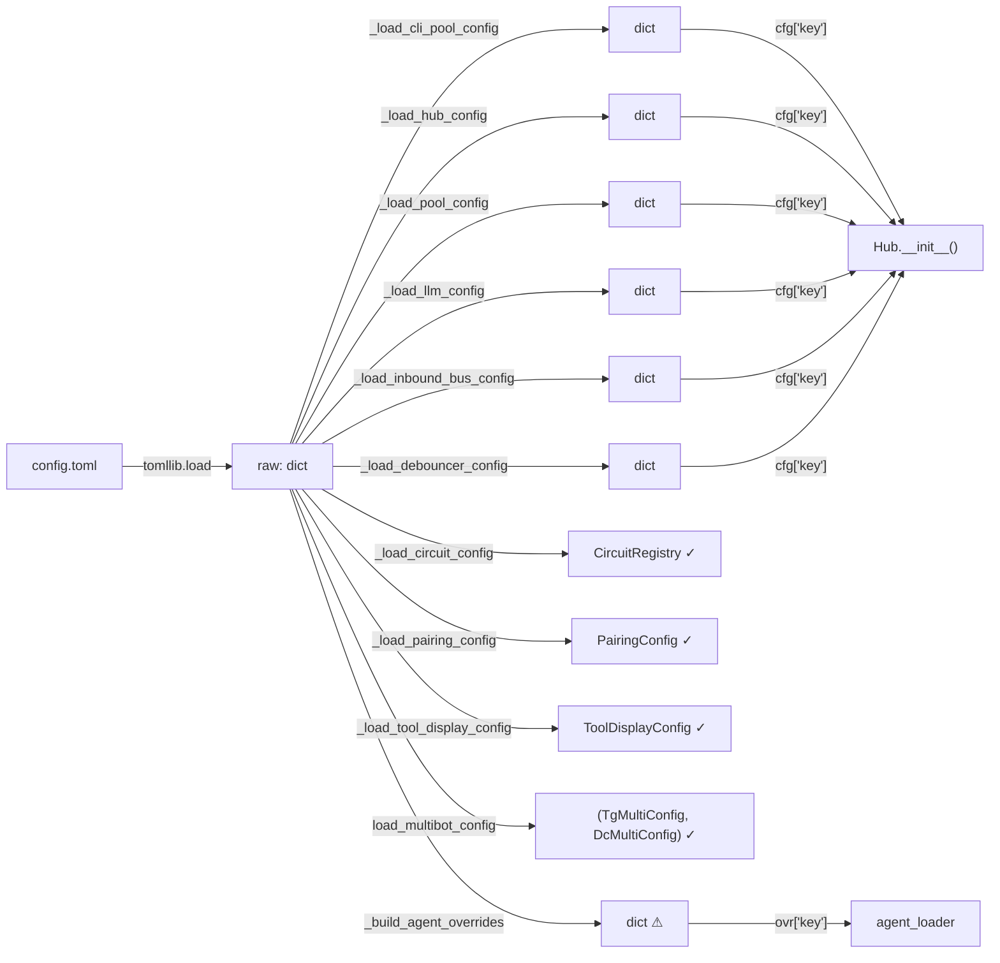

## Source

GitHub issue #411: "chore(types): Wave 4 — TypedDict annotation sprint (remove
Unknown-type pyright suppressions)". Triggered by PR #410 which enabled strict
pyright and suppressed 7 rules generating ~3,000 false positives.

## Problem

Config loading in Lyra uses bare `dict` returns at 8 sites in `bootstrap/config.py`.
These untyped dicts cascade through the entire codebase — every consumer that
accesses a config value via `cfg["key"]` produces an `Unknown` type that pyright
cannot track. Seven pyright rules are globally suppressed to mask this:

```
reportUnknownVariableType   = "none"
reportUnknownMemberType     = "none"
reportUnknownArgumentType   = "none"
reportUnknownParameterType  = "none"
reportMissingParameterType  = "none"
reportUnknownLambdaType     = "none"
reportMissingTypeArgument   = "none"
```

With these suppressed, pyright strict mode is toothless for an entire family of
type errors — new unsafe code passes CI silently.

### Config data flow (current)



**7 bare-dict-returning functions** are the primary source of cascading `Unknown` types:
6 section loaders (`_load_*_config()`) plus `_build_agent_overrides()` which merges
`[defaults]` + `[agents.<name>]` with workspace deep-merge logic.
4 loaders already return typed objects (but as dataclasses, not Pydantic).

### Existing config dataclasses to migrate (~25 classes, 12 files)

| File | Classes | Notes |
|------|---------|-------|
| `config.py` | TelegramBotConfig, DiscordBotConfig, TelegramMultiConfig, DiscordMultiConfig | Multi-bot schema |
| `adapters/telegram.py` | TelegramConfig | Token + webhook secret |
| `adapters/discord_config.py` | DiscordConfig | Token + auto_thread |
| `monitoring/config.py` | MonitoringConfig | TOML thresholds + env secrets; has `__post_init__` validation |
| `core/runtime_config.py` | EffectiveConfig, RuntimeConfig | RuntimeConfig has `.overlay()`, `.save()`, `.load()`, `.reset()` |
| `core/agent_config.py` | ModelConfig, SmartRoutingConfig, IdentityConfig, PersonalityConfig, ExpertiseConfig, VoiceConfig, PersonaConfig, AgentTTSConfig, AgentSTTConfig, AgentVoiceConfig, Agent | 11 classes; Agent is mutable, rest frozen |
| `tts/__init__.py` | TTSConfig | 3 optional fields from env |
| `stt/__init__.py` | STTConfig | model_size + detection params |
| `core/tool_display_config.py` | ToolDisplayConfig | Has `from_dict()`, `__post_init__` validation, `MappingProxyType` field |
| `core/stores/pairing_config.py` | PairingConfig | Has `from_dict()` |

### New Pydantic models needed (7 bare-dict functions)

| Function / TOML section | Current return | Keys |
|------------------------|---------------|------|
| `_load_cli_pool_config` / `[cli_pool]` | `dict` | idle_ttl, default_timeout, turn_timeout, reaper_interval, kill_timeout, read_buffer_bytes, stdin_drain_timeout, max_idle_retries, intermediate_timeout |
| `_load_hub_config` / `[hub]` | `dict` | pool_ttl, rate_limit, rate_window |
| `_load_pool_config` / `[pool]` | `dict` | max_sdk_history, safe_dispatch_timeout |
| `_load_llm_config` / `[llm]` | `dict` | max_retries, backoff_base |
| `_load_inbound_bus_config` / `[inbound_bus]` | `dict` | queue_depth_threshold, staging_maxsize, platform_queue_maxsize |
| `_load_debouncer_config` / `[debouncer]` | `dict` | default_debounce_ms, max_merged_chars |
| `_build_agent_overrides` / `[defaults]` + `[agents.<name>]` | `dict` | cwd, persona, workspaces (deep-merged), plus any agent-specific keys. **Not a simple section slice** — merges two TOML sections with workspace deep-merge logic that must be preserved. |

## Outcome

- All 7 suppressed pyright rules re-enabled with 0 errors in src + tests
- All config loaders return typed objects — callers use attribute access, not string-keyed `dict` access
- No bare `dict[str, Any]` or bare `dict` annotations at config loading sites
- `reportMissingTypeArgument` also clean (bare `dict`/`list`/`tuple` annotated with type args)

## Appetite

**2-week cycle** (F-full tier). While the recommended shape (Shape 2) is scoped at M,
the F-full tier is warranted by the breadth of impact: 18+ files to convert, 7
pyright rules to validate incrementally (each requiring a full CI pass), test
fixtures that construct config dataclasses positionally must all switch to keyword
args, and the `Agent` class migration decision (see Open Questions) may expand scope.

## Shapes

### Shape 1: Unified root `LyraConfig(BaseSettings)`

Replace `_load_raw_config()` + all 10 `_load_*_config()` functions with a single
Pydantic-settings root model:

```python
from pydantic_settings import BaseSettings, SettingsConfigDict

class LyraConfig(BaseSettings):
    model_config = SettingsConfigDict(toml_file="config.toml")

    cli_pool: CliPoolConfig = CliPoolConfig()
    hub: HubConfig = HubConfig()
    pool: PoolConfig = PoolConfig()
    llm: LlmConfig = LlmConfig()
    inbound_bus: InboundBusConfig = InboundBusConfig()
    debouncer: DebouncerConfig = DebouncerConfig()
    telegram: TelegramMultiConfig = TelegramMultiConfig()
    discord: DiscordMultiConfig = DiscordMultiConfig()
    circuit_breaker: CircuitBreakerConfig = CircuitBreakerConfig()
    admin: AdminConfig = AdminConfig()
    pairing: PairingConfig = PairingConfig()
    tool_display: ToolDisplayConfig = ToolDisplayConfig()
    monitoring: MonitoringConfig = MonitoringConfig()
    defaults: AgentDefaultsConfig = AgentDefaultsConfig()
    agents: dict[str, AgentOverrideConfig] = {}
```

**Trade-offs:**
- Pro: Single source of truth — one parse, full validation, env overlay via pydantic-settings
- Pro: Eliminates ALL 10 `_load_*_config()` functions
- Pro: Cleanest end-state for future config evolution
- Con: Biggest blast radius — `multibot.py`, `__main__.py`, and every consumer changes
- Con: `pydantic-settings` dependency (small, but adds to dep tree)
- Con: Some config sections (`[auth]`) have complex nested structures that need careful modeling
- Con: Risk of env var collisions (pydantic-settings reads env vars by default)

**Rough scope:** L

### Shape 2: Per-section Pydantic models (incremental)

Keep `_load_raw_config()` → `dict`. Replace each `_load_*_config()` function to
return a Pydantic BaseModel validated from the section dict:

```python
class CliPoolConfig(BaseModel):
    idle_ttl: int = 1200
    default_timeout: int = 1200
    turn_timeout: float | None = None
    # ...

def _load_cli_pool_config(raw: dict[str, Any]) -> CliPoolConfig:
    return CliPoolConfig.model_validate(raw.get("cli_pool", {}))
```

Migrate existing dataclass configs to Pydantic `BaseModel` in the same pass.

**Trade-offs:**
- Pro: Incremental — each section/file can be its own commit, independently testable
- Pro: Lower risk — each change is small and verifiable
- Pro: No `pydantic-settings` dependency needed (just `pydantic`)
- Pro: Consumers change minimally — `cfg["key"]` → `cfg.key` (attribute access)
- Con: `_load_raw_config()` still returns bare `dict` (passed to section loaders and `_build_agent_overrides()`, never consumed directly by business logic)
- Con: `_build_agent_overrides()` workspace deep-merge logic must be preserved in or alongside the Pydantic model
- Con: Slightly more boilerplate than Shape 1 (10 separate `_load_*` functions remain)
- Con: No env var overlay (but current code also doesn't have that via TOML)

**Rough scope:** M

### Shape 3: Root model + pydantic-settings (deferred)

Shape 2 first, then a follow-up PR consolidates all per-section models into
a root `LyraConfig(BaseSettings)`. This is Shape 1 achieved incrementally:

- **PR1:** Shape 2 — per-section models, dataclass→Pydantic migration, re-enable rules
- **PR2:** Consolidate section models into root `LyraConfig`, add `pydantic-settings`

**Trade-offs:**
- Pro: Gets type safety NOW without waiting for the full root model design
- Pro: PR2 is pure refactoring with no functional change — easy to review
- Con: Two passes over the same files (slightly more total effort)
- Con: PR1 consumers still use `_load_*_config()` functions that PR2 removes

**Rough scope:** M (PR1) + S (PR2)

## Fit Check

**Shape 2 is the best fit.** It targets the root cause directly: 7 bare-dict-returning
functions → typed models = pyright rules re-enabled. The per-section approach means
each file is a self-contained commit with its own test validation, which fits the
2-week appetite without requiring the L-scope restructuring of a root model. Shape 2
does not preclude consolidating into a root `LyraConfig(BaseSettings)` later — the
per-section models compose cleanly into a root model if/when that becomes valuable.

Shape 1 is the ideal end-state but its blast radius (every consumer changes at once)
is unnecessary for the type-safety goal. Shape 3 is Shape 2 + Shape 1 sequenced — if
Shape 1 is ever needed, it's a clean follow-up.

### Migration risks and mitigations

**RuntimeConfig** (`core/runtime_config.py`):
- `set_param()` and `.reset()` use `dataclasses.replace(rc, **{key: parsed})` →
  must become `rc.model_copy(update={key: parsed})`. Two call sites (lines 157, 245).
- `RuntimeConfig` is NOT frozen (`@dataclass` without `frozen=True`), but all mutations
  go through `replace()` / `model_copy()` — never direct attribute assignment. Safe to
  use `ConfigDict(frozen=True)` on the Pydantic model.
- `_DEFAULTS` dict is a parallel source of truth used in `.save()` and `.reset()`. Can be
  eliminated post-migration by deriving defaults from `model_fields[k].default` instead.
- `EffectiveConfig` is frozen, no methods — trivial migration.

**ToolDisplayConfig** (`core/tool_display_config.py`):
- `MappingProxyType` on the `show` field enforces read-only dict access for callers.
  `ConfigDict(frozen=True)` alone is NOT sufficient — it prevents reassigning `config.show`
  but does not prevent `config.show["bash"] = False` if the underlying type is plain `dict`.
- Migration: keep `MappingProxyType` as the field type + add a `@field_validator("show",
  mode="before")` that wraps incoming dicts in `MappingProxyType`. Or use
  `Annotated[MappingProxyType[str, bool], BeforeValidator(MappingProxyType)]`.
- `__post_init__` validation → `@field_validator` with `ge=1` constraints (cleaner than
  `@model_validator`). Note: Pydantic raises `ValidationError` (subclass of `ValueError`
  in v2) so callers catching `ValueError` still work.

**ModelConfig** (`core/agent_config.py`):
- `cwd: Path | None = field(default=None, compare=False)` — the `compare=False` means
  `cwd` is excluded from `__eq__`. This is load-bearing: `CliPool.send()` at line ~139
  compares `ModelConfig` instances to detect backend/model changes, and `cwd` must NOT
  trigger a mismatch warning.
- Pydantic has no direct equivalent of `compare=False`. Must override `__eq__` and
  `__hash__` on `ModelConfig` to exclude `cwd` from comparisons.

**SmartRoutingConfig** (`core/agent_config.py`):
- `routing_table: dict[Complexity, str]` uses `Enum` keys. Pydantic serialises enum keys
  as their values by default. Fine for in-memory use, but `AgentStore` serialises agent
  config to JSON columns — need `use_enum_values=True` or explicit validators for round-trip.

**MonitoringConfig** (`monitoring/config.py`):
- `__post_init__` validation → `@model_validator(mode='after')` or `@field_validator`
  with regex constraints. Clean migration.

**Agent** (`core/agent_config.py`):
- See **Open Questions** below — this is an explicit scope decision, not a resolved risk.

### Resolved Decisions

1. **Agent class → migrate now.** Include `Agent` (14 fields, mutable) in this issue's
   Pydantic migration. Use `ConfigDict(frozen=False)`. All test fixtures will need
   keyword-arg conversion. `Agent.__eq__` is preserved by Pydantic default behavior.
   This eliminates the largest source of `reportUnknownMemberType` hits from agent
   attribute access.

2. **`_build_agent_overrides()` → `AgentOverrideConfig` Pydantic model.** Keep the
   merge logic (defaults + agent-specific + workspace deep-merge) in the function body.
   Validate the merged result with `AgentOverrideConfig.model_validate(merged)` before
   returning. This types the boundary without restructuring the merge logic.

3. **No in-flight blockers.** Only 2 open PRs (Dependabot dep bumps, zero code overlap).
   Stashed #356 work has no file overlap with #411 scope. Safe to proceed.

**Rule re-enablement order** (lowest hit count first = fastest wins):

| Order | Rule | Est. effort |
|-------|------|------------|
| 1 | `reportMissingParameterType` (4 src) | XS — mostly test fixtures |
| 2 | `reportUnknownLambdaType` (6 src) | XS — isolated lambdas |
| 3 | `reportMissingTypeArgument` (bare dict/list) | S — annotate throughout. Note: `_load_raw_config()` bare `dict` return and `section: dict` locals in `bootstrap/config.py` need explicit type args even after Pydantic migration |
| 4 | `reportUnknownParameterType` (103 src) | M — function signatures |
| 5 | `reportUnknownArgumentType` (309 src) | M — call sites |
| 6 | `reportUnknownVariableType` (388 src) | L — broadest category |
| 7 | `reportUnknownMemberType` (463 src) | L — attribute access on dicts |

Rules 6 and 7 will see the biggest drop from the Pydantic migration (dict attribute
access is the primary source). After Shape 2 models are in place, most hits should
resolve automatically.

### Files impacted

| File | Change type |
|------|------------|
| `bootstrap/config.py` | Add 7 new Pydantic models (6 sections + `AgentOverrideConfig`), change return types, preserve workspace deep-merge logic |
| `bootstrap/multibot.py` | Change dict access → attribute access |
| `bootstrap/agent_factory.py` | Change `llm_cfg: dict` → typed model |
| `config.py` | 4 dataclass → Pydantic |
| `adapters/telegram.py` | TelegramConfig → Pydantic |
| `adapters/discord_config.py` | DiscordConfig → Pydantic |
| `monitoring/config.py` | MonitoringConfig → Pydantic |
| `core/runtime_config.py` | EffectiveConfig, RuntimeConfig → Pydantic |
| `core/agent_config.py` | 11 dataclass → Pydantic |
| `tts/__init__.py` | TTSConfig → Pydantic |
| `stt/__init__.py` | STTConfig → Pydantic |
| `core/tool_display_config.py` | ToolDisplayConfig → Pydantic |
| `core/stores/pairing_config.py` | PairingConfig → Pydantic |
| `core/agent_loader.py` | Consume typed overrides |
| `core/agent_builder.py` | Update `_build_smart_routing_from_dict`, `_build_tts_from_dict`, `_build_stt_from_dict`, `_build_commands_from_dict` — these accept and return bare `dict`, signatures need typed params |
| `core/agent_db_loader.py` | Produce Pydantic config objects |
| `__main__.py` | Consume typed config |
| `pyproject.toml` | Re-enable 7 rules, add pydantic-settings (optional) |
| `tests/` | Update all config construction: positional args → keyword args (Pydantic requires it), dict construction → model construction |
