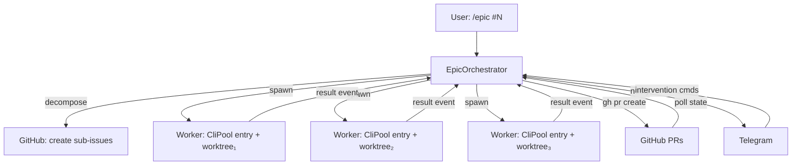
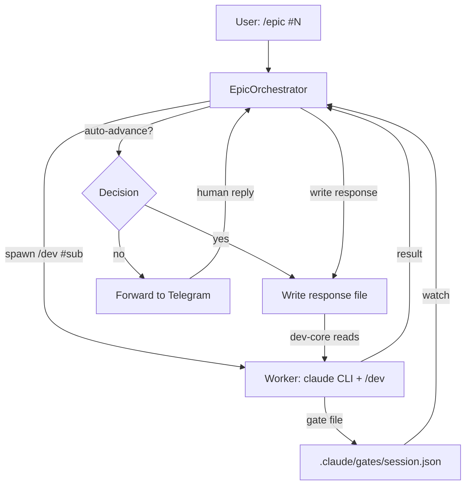
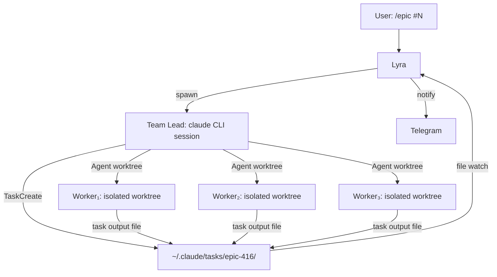

## Source

GitHub issue #416 — "Epic: Parallel sub-issue orchestration — spawn independent Claude Code sessions per sub-issue with completion signaling." Frame approved 2026-03-26 (F-full tier).

## Problem

Dev-core's `/dev #N` workflow is ~98% autonomous, but a human must click "continue" at every gate. For epics with multiple sub-issues, this means sequentially babysitting N parallel sessions. The human bottleneck prevents fire-and-forget epic execution.

**The critical blocker discovered during analysis:** dev-core gates use `AskUserQuestion`, which is **disabled in headless/channel mode**. Gates emit no machine-readable signals, have no auto-approve flag, and return only button-label text. This is an intentional design — gates are human safety checkpoints, not automation throughput. Any orchestration solution must address this fundamental constraint.

## Outcome

Mickael runs a single command on either machine (local or production). The orchestrator decomposes the epic into sub-issues, spawns parallel Claude Code sessions in isolated worktrees, drives each through the dev lifecycle, and notifies via Telegram at milestones. Human intervention is only needed for genuine decisions (spec approval, failed validation, merge conflicts that can't be auto-resolved). Total human time per epic drops from hours of gate-clicking to minutes of reviewing Telegram notifications.

## Appetite

Unbounded exploration. This is foundational infrastructure — get it right rather than ship fast.

## Research Findings

### 1. Lyra's Existing Infrastructure

**CliPool** (`src/lyra/core/cli_pool.py`, `cli_pool_worker.py`, `cli_protocol.py`):
- Manages persistent `claude --input-format stream-json` subprocesses, one per `pool_id`
- NDJSON stdin/stdout protocol with `send_and_read()` (request/response) and `StreamingIterator` (streaming)
- Idle reaper kills processes after configurable TTL (default 20min) if not locked
- Session resume via `--resume <session_id>` flag on respawn
- Env allowlist (`_SAFE_ENV_KEYS`): PATH, LANG, LC_ALL, LC_CTYPE, TMPDIR, HOME only — **ANTHROPIC_API_KEY not propagated**
- `_cwd_overrides` dict allows per-pool working directory (worktree support already exists)
- Process spawn uses `asyncio.create_subprocess_exec` with stdin/stdout/stderr pipes

**InboundBus** (`src/lyra/core/inbound_bus.py`):
- Per-platform bounded queues merging into single staging queue
- Hub.run() consumes staging queue → MessagePipeline → Pool → Agent → OutboundDispatcher
- AudioPipeline already acts as an internal message producer (re-enqueues transcribed audio with preserved trust_level)
- No direct inter-adapter communication — all messages flow through Hub
- **Rejected for orchestration signaling:** routing orchestration events through InboundBus would require fabricating authenticated `InboundMessage` objects with a synthetic platform and trust level, violating the security contract that all messages must be authenticated by an adapter with a verified `trust_level`. The trust model is immutable downstream — there is no legitimate way for an internal producer to elevate trust or fabricate an adapter-verified identity.

**Trust & Security** (`src/lyra/core/trust.py`, `authenticator.py`, `guard.py`):
- TrustLevel enum: OWNER > TRUSTED > PUBLIC > BLOCKED
- Adapters set trust_level once via Authenticator.resolve() — immutable downstream
- ChannelAdapter protocol requires `normalize()` to produce authenticated InboundMessage
- Security contract: all messages entering a Pool must be authenticated InboundMessage objects

### 2. Dev-Core Gate Mechanism

**How gates work today:**
- `/dev` presents AskUserQuestion with structured multi-choice options (e.g., "Approve | Revise")
- User selects one option, orchestrator matches button label text, advances state
- State persisted via artifact frontmatter (`status: approved`) or session-only map (Σ_s)
- Gate steps: frame, spec, plan (require approval). Auto-advance steps: triage, analyze, implement, pr, validate, review, fix, cleanup

**Why programmatic advancement is hard:**
- `AskUserQuestion` is disabled when `--channels` is active (headless mode)
- No structured JSON output from gates (button labels only)
- No `--yes` or `--auto-approve` CLI flag exists
- The dev-core skill explicitly states: "¬auto-advance phases. AskUserQuestion at each gate."
- Interactive tools auto-allowing was patched as a bug (empty answers bypassing prompts)

**Implication:** Any orchestrator that wants to drive /dev must either (a) bypass gates entirely, (b) add a new gate protocol, or (c) use a different orchestration substrate.

### 3. A2A Pattern Research

Six frameworks analyzed: Google A2A, OpenAI Agents SDK, CrewAI, AutoGen, Claude Agent SDK, Claude Code Agent Teams.

**Best fit for Lyra: Hybrid of AutoGen's actor model + Claude Code Agent Teams' task board, implemented natively in asyncio.**

| Pattern | Relevance | Why |
|---------|-----------|-----|
| AutoGen actor model | High | Lyra's Pool is already an actor (state + inbox + processing task). Async message passing = asyncio queues. |
| Agent Teams task board | High | Proven pattern for coordinating parallel Claude Code sessions. Dependency DAG, 2-5 workers sweet spot. |
| A2A Task state machine | Medium | submitted/working/completed/failed maps to sub-issue lifecycle. Agent Cards for capability discovery. |
| Swarm statelessness | Medium | Workers should receive self-contained prompts, not shared mutable state. |
| CrewAI Flows | Low | Event-driven state machine concept useful, but framework itself has reliability issues. |
| A2A protocol (HTTP) | Reject | Overengineered for same-machine, single-user orchestration. |

**Recommended primitives:**
- **TaskBoard** — in-memory asyncio primitive (not files). Tasks have states, ownership, dependencies, results.
- **Workers are CliPool entries** with separate cwds (git worktrees), focused prompts, self-contained context.
- **Single-level nesting** — workers cannot spawn their own workers (Agent SDK constraint, prevents runaway trees).
- **Concurrency cap** — 2-5 workers empirically validated by Anthropic's Agent Teams testing.

## Prior Art (Deep Dive)

Eight projects and resources analyzed in depth. Key findings organized by what to adopt.

### Validated Patterns (adopt)

**1. ComposioHQ/agent-orchestrator** (5.5k stars, built by 30 Claude instances in 8 days)
The closest production-grade match to Shape 1. Spawns Claude Code sessions in isolated worktrees, reactive CI fix loop (**84.6% self-fix rate** across 41 failures — PR #125 went 12 rounds with zero human intervention), reactive merge conflict resolution (send rebase prompt, escalate after 15min). Plugin architecture with 8 swappable slots (runtime, agent, workspace, tracker, SCM, notifier, terminal, lifecycle). Session state machine: `spawning → working → pr_open → ci_failed → merged → cleanup`. **No dependency graph** — tasks assumed independently parallelizable.

**2. Open Orchestra's Minimal Task API** (5-tool surface)
`task_start` (fire-and-forget) / `task_await` (event-driven, not polling) / `task_peek` (non-blocking status) / `task_list` / `task_cancel`. Job store: in-memory Map with 200-job cap, 24h TTL, waiter-callback pattern for await. Boomerang pattern for pausable/resumable workflows via `continueRunId`. Context pruning: 60% head / 40% tail with char budgets.

**3. VespeR's event-sourced architecture**
Event bus with SQLite persistence (persist-before-notify). Smart resume memory: on run completion, `extract_run_memory()` → `persist_run_memory()` → `build_context_pack()` with relevance scoring (recency decay, failed runs boosted). PTYController spawns claude CLI as subprocess, reads JSON stdout, uses SIGSTOP/SIGCONT for pause/resume. 240s timeout + runaway loop detection (8 repeated commands → abort).

**4. Anthropic's harness design principles**
- **Separate generator from evaluator** — models exhibit inflated self-assessment; a dedicated evaluator is "far more tractable"
- **Artifact-based handoffs** — agents are ephemeral, artifacts are persistent. Pass structured spec files, not long prompts.
- **Sprint contracts** — before work, agree on deliverables + testable success criteria
- **Context resets over compaction** for child sessions — each sub-issue starts clean

**5. A2A's `input-required` state**
Task state machine: `submitted → working → completed|failed|input_required`. The `input_required` state is the protocol's answer to the gate problem — agent pauses, signals what input it needs, client resumes with same taskId. Cleanly maps to Lyra's gate forwarding to Telegram. However, A2A as a protocol is overengineered for local orchestration and has low real-world adoption.

### Validated Architecture Decisions

| Decision | Validated by | Evidence |
|----------|-------------|----------|
| No dependency graph for MVP | ComposioHQ, TinyAGI/fractals | Both assume independent parallelism. Works for initial scaffolding; stubs bridge gaps. |
| Reactive CI fix (not proactive) | ComposioHQ | 84.6% self-fix rate with retry cap + escalation |
| Reactive conflict resolution | ComposioHQ | Send rebase prompt, escalate after timeout |
| Single-level nesting (depth=1) | Hermes (MAX_DEPTH=2), Agent SDK | Prevents runaway delegation trees |
| Max 3-5 concurrent workers | Hermes (MAX_CONCURRENT=3), Agent Teams (2-5) | Empirically validated sweet spot |
| Event-sourced state | VespeR | Persist-before-notify enables replay, resume, and notification |
| Separate generator/evaluator | Anthropic harness blog | Child session = generator. Separate verification step before marking done. |
| "Harness, not framework" | Vault #488 "L'ere des Harness" | Build natively in asyncio, don't adopt external frameworks |

### What NOT to Adopt

| Pattern | Source | Why not |
|---------|--------|---------|
| Heartbeat model (short bursts + resume) | Paperclip | Lyra wants persistent long-running workers, not periodic wakeups |
| Full A2A protocol (JSON-RPC/HTTP) | Google A2A | Overengineered for local subprocess orchestration; low adoption |
| File-based coordination | Claude Code Agent Teams | Wrong for asyncio-native; doesn't cross machines |
| Orchestrator-as-Claude-session | ComposioHQ | Lyra's orchestrator should be Python code (deterministic), not another LLM |
| Plugin architecture | ComposioHQ | Over-engineered for single-user MVP. Hardcode Claude Code + worktree + GitHub. |
| Two-phase daily cycle | Hermes Swarm custom deploy | Not a framework feature; was a custom build on top |
| org chart / governance | Paperclip | Single-user, no organizational hierarchy needed |

### Concrete Patterns to Adopt for Implementation

1. **CLI invocation** (from Paperclip + TinyAGI): `claude --dangerously-skip-permissions -p <prompt>` with prompt via stdin or arg. Parse `stream-json` output for session_id, usage, result. Delete `CLAUDECODE` env var to prevent nested detection.
2. **Task API** (from Orchestra): 5-tool surface — start/await/peek/list/cancel. Event-driven await via asyncio callbacks, not polling.
3. **Session state machine** (simplified from ComposioHQ): `spawning → working → pr_created → [ci_failed → fixing] → done | failed`
4. **Reactive CI fix loop** (from ComposioHQ): Detect failure via GitHub API, send fix prompt to child stdin (if alive) or re-spawn, cap at 2-3 retries, escalate to Telegram.
5. **Smart resume memory** (from VespeR): On child completion/failure, extract structured memory (touched files, test results, open issues). Parent uses these for aggregation and Telegram summaries.
6. **Two-phase completion** (from Anthropic): Child signals "done" (generator) → parent runs lightweight verification (evaluator): PR checks pass, tests green, issue criteria match. Only then mark closed.
7. **Context pruning** (from Orchestra): 60/40 head-tail retention with char budgets for orchestrator context across many children.

## Shapes

### Shape 1: Bypass Dev-Core — Direct Orchestration

The orchestrator skips `/dev` entirely. Instead of driving Claude Code through the dev-core lifecycle, it directly invokes the underlying operations: create worktree, spawn `claude` CLI with a focused task-specific prompt, create PR, run validation, etc.

**Important trade-off vs the frame's vision:** The frame envisions "auto-advances through dev-core gates where the answer is deterministic." Shape 1 takes a different approach — it bypasses gates entirely rather than auto-advancing them. This means no dev-core artifact trail (no frames, specs, plans per sub-issue), but also no gate protocol complexity. This is a deliberate product trade-off: speed and simplicity over traceability. Human review shifts to the PR level.

**How it works:**
1. Lyra reads the epic spec and decomposes into sub-issues (via LLM or structured parsing)
2. For each sub-issue, Lyra creates a git worktree and spawns a `claude` CLI subprocess
3. Each subprocess gets a **self-contained prompt**: "Implement feature X in this worktree. Create a branch, write code, write tests, commit."
4. Claude Code runs autonomously with `--dangerously-skip-permissions` and `--max-turns N`
5. When the subprocess completes (result event), Lyra reads the outcome and creates a PR via `gh`
6. Validation runs as a separate subprocess or direct command execution
7. Lyra monitors PR state via GitHub API polling
8. Telegram notifications at each milestone

**Gate handling:** No gates. The orchestrator IS the decision-maker. It decides what to build (from the epic spec), how to build it (from the prompt), and when it's done (from the result event). Human review happens at the PR level, not at dev-core gates.

**Exception path:** When a worker fails (non-zero exit, validation failure, `error_max_turns` warning in CliResult), the orchestrator marks the task as `failed` on the TaskBoard, sends a Telegram notification with the failure context ("Sub-issue #N+2 failed: 3 test failures in test_auth.py"), and continues other independent sub-issues. Dependent sub-issues are blocked until the failure is resolved. The human can reply via Telegram to retry, skip, or investigate.

**Mid-flight intervention:** The orchestrator exposes Telegram commands for the running epic: `/epic status` (show TaskBoard state), `/epic cancel #N+2` (kill worker subprocess, mark task cancelled), `/epic pause` (stop spawning new workers, let running ones finish), `/epic resume`. Killing a worker is `proc.terminate()` + `proc.kill()` after timeout — the same pattern CliPool already uses.

**Crash recovery:** On restart, the orchestrator reads durable state from SQLite (epic ID, task states, worktree paths, branch names). It checks which worktrees still exist (`git worktree list`), which branches have unpushed commits, and which PRs are open. Workers that were running are **not resumed** — they are re-spawned from scratch if the task is still `in_progress`. Worker sessions should not be auto-resumed because the conversation context may be stale; a fresh prompt with the current state of the worktree is more reliable.

**Architecture:**

**Trade-offs:**
- Pro: Simplest to implement — no dev-core modifications, no gate protocol design
- Pro: Workers receive focused prompts → better quality per-task than full /dev lifecycle
- Pro: Orchestrator has full control over lifecycle, timing, and error handling
- Pro: No dependency on dev-core internals — works even if dev-core changes
- Con: Loses dev-core's structured lifecycle (frame → spec → plan → implement → review)
- Con: No artifact trail (no frames, specs, plans for sub-issues) — traceability shifts to PRs
- Con: Review happens at PR level only — no pre-implementation quality gates
- Con: Must reimplement validation, review, fix logic outside dev-core

**Rough scope:** L — New EpicOrchestrator, TaskBoard, worker lifecycle management, GitHub integration, Telegram notifications. But no dev-core changes.

### Shape 2: Modify Dev-Core Protocol — Machine-Readable Gates

Add a structured gate protocol to dev-core that allows programmatic gate detection and response injection. The orchestrator drives `/dev` normally but intercepts gates via a machine-readable contract.

**Two sub-variants exist with very different complexity profiles:**

**2a — Designed-in structured signals:** Dev-core emits gate signals as structured JSON via a dedicated channel (gate file per worktree, or a new NDJSON annotation type). The signal format is designed from the start — no parsing of freeform LLM output. This is the clean version.

**2b — Parse existing output:** The orchestrator parses Claude Code's streaming output to detect AskUserQuestion invocations and infer gate state. This is fragile because LLM output is non-deterministic. This sub-variant is not recommended.

**How 2a works:**
1. Dev-core skills write a **gate file** (e.g., `.claude/gates/{session_id}.json`) when reaching a gate
2. Gate file format: `{"gate": "frame-approval", "step": "frame", "options": ["approve", "revise"], "context": {...}, "artifact_path": "..."}`
3. The orchestrator watches gate files via `asyncio` file watcher or polling
4. For auto-advanceable gates, the orchestrator writes a **response file** that dev-core reads
5. For human-required gates, the orchestrator forwards to Telegram and waits
6. Human response routes back through Lyra → response file → dev-core resumes

**Gate classification (from dev-core analysis):**

| Gate | Auto-advance? | Rationale |
|------|--------------|-----------|
| triage | Always | Size/priority assignment is deterministic |
| frame approval | Never | Scope definition requires human judgment |
| spec approval | Configurable | If epic spec was pre-approved, sub-issue specs can auto-approve |
| plan approval | Configurable | If spec is tight enough, plan can auto-approve |
| implement | Always | No gate (auto-advance step) |
| PR creation | Always | No gate |
| validate | Always | Runs automatically, reports results |
| review | Forward to human | Review findings need human judgment |
| fix | Configurable | High-confidence fixes auto-apply, low-confidence escalate |

**Exception path:** Same as Shape 1 for worker failures. Additionally, gate-level failures (e.g., spec rejected by human via Telegram) can be handled gracefully: the orchestrator writes a "revise" response, and dev-core re-enters the step.

**Mid-flight intervention:** Richer than Shape 1 — the human can intervene at any gate, not just at task level. Via Telegram: approve a spec, request revision to a plan, skip a step. The gate forwarding mechanism naturally supports this.

**Crash recovery:** Same as Shape 1, plus gate files persist on disk. On restart, the orchestrator checks for pending gate files and re-presents them.

**Architecture:**

**Trade-offs:**
- Pro: Preserves dev-core's full lifecycle — frames, specs, plans, reviews all generated
- Pro: Artifact trail for every sub-issue (full traceability)
- Pro: Gate classification is configurable — tune automation level per project/epic
- Pro: Human can intervene at any gate via Telegram (richest intervention model)
- Con: Requires modifying dev-core (new gate file protocol, skill changes)
- Con: Dev-core is a third-party plugin (roxabi-plugins) — changes affect all users
- Con: File-based gate signaling adds I/O overhead and a new failure mode
- Con: Claude Code's `AskUserQuestion` behavior must be extended to support response injection
- Con: stdin injection to a running Claude Code session is complex (stream-json input format)

**Rough scope:** XL — Dev-core protocol changes + orchestrator + gate classification engine + Telegram interaction loop. Highest complexity but most powerful result.

### Shape 3: Claude Code Agent Teams — Native Coordination

Use Claude Code's built-in Agent Teams system as the coordination substrate. Lyra spawns a Team Lead claude session that creates a team, assigns tasks, and coordinates workers. Lyra's role reduces to: trigger the team, monitor progress via filesystem, and forward notifications to Telegram.

**How it works:**
1. Lyra receives `/epic #N` and spawns a single `claude` CLI session as Team Lead
2. The Team Lead prompt includes the epic spec and instructions to use `TaskCreate` and `Agent` tools
3. Claude Code's native Agent Teams system handles: task board creation, worker spawning, file-based mailbox coordination, dependency DAG
4. Lyra monitors the filesystem at `~/.claude/tasks/{team-name}/` for task status changes
5. When tasks complete/fail, Lyra reads the output and sends Telegram notifications
6. Workers operate in isolated worktrees (Claude Code already supports `isolation: "worktree"` on Agent tool)

**Exception path:** Team Lead LLM decides how to handle worker failures. Lyra has limited visibility — it can detect task state changes but cannot influence the Team Lead's decisions. Exception handling is non-deterministic (LLM judgment).

**Mid-flight intervention:** Very limited. Lyra could write to the Team Lead's mailbox file, but the Team Lead processes mailbox messages on its own schedule. No real-time cancellation of workers.

**Crash recovery:** File-based — task files persist. But Claude Code sessions themselves are lost; the Team Lead must be re-spawned and re-read the task board state. Recovery is partial and fragile.

**Architecture:**

**Trade-offs:**
- Pro: Least implementation effort — Claude Code already handles parallel worker coordination
- Pro: Worktree isolation is built-in (`isolation: "worktree"` parameter on Agent tool)
- Pro: Battle-tested by Anthropic (2-5 workers, 5-6 tasks each sweet spot)
- Pro: No dev-core modifications needed
- Pro: Workers can use any dev-core skills natively (they're full Claude Code sessions)
- Con: File-based coordination is slow and fragile for asyncio (polling vs events)
- Con: Lyra has limited visibility into worker state (must parse task output files)
- Con: Team Lead is an LLM making coordination decisions — less deterministic than code
- Con: Gate problem persists for workers — they'll still hit AskUserQuestion prompts
- Con: No Lyra Channels integration — notifications must be implemented via filesystem watching
- Con: Cross-machine orchestration is harder (filesystem is local to spawning machine)

**Rough scope:** M (best-case, assumes Claude Code Agent Teams behaves predictably) / L (realistic, given production wrangling needed for gate problem and limited visibility)

## Fit Check

### Constraint Alignment

| Constraint | Shape 1 (Bypass) | Shape 2 (Protocol) | Shape 3 (Agent Teams) |
|------------|:-:|:-:|:-:|
| Lyra-only (no new deps) | ✅ | ✅ | ✅ |
| Local + production | ✅ | ✅ | ⚠️ File-based, local only |
| Reuse dev-core worktrees | ⚠️ Own worktree mgmt | ✅ | ✅ Built-in |
| Single supervisord | ✅ Asyncio task | ✅ Asyncio task | ⚠️ Separate claude processes |
| API key propagation | Must solve | Must solve | ✅ Claude Code handles |
| Concurrency cap | Must implement | Must implement | ⚠️ Claude Code's own limits |
| Session resumption | Must implement | Inherited from /dev | ⚠️ File-based recovery |
| Cross-machine signaling | Must implement | Must implement | ❌ Filesystem is local |
| Exception path | ✅ Full control | ✅ Gate-level + task-level | ⚠️ LLM-dependent |
| Mid-flight intervention | ✅ Task-level Telegram cmds | ✅ Gate-level + task-level | ⚠️ Mailbox-based, slow |
| Crash recovery | ✅ SQLite + re-spawn | ✅ SQLite + gate files | ⚠️ Partial, fragile |

### Shape Elimination

**Shape 3 (Agent Teams) is eliminated** for production use because:
1. Cross-machine orchestration is a hard requirement — filesystem coordination doesn't cross machines
2. File-based polling is architecturally wrong for Lyra's asyncio-native design
3. Workers still hit AskUserQuestion gates with no programmatic advancement
4. Lyra has minimal visibility/control over worker lifecycle
5. Exception handling and mid-flight intervention are non-deterministic

However, Shape 3's **worker isolation pattern** (worktree per Agent) is worth adopting as an implementation detail in other shapes.

### Shape 1 vs Shape 2

| Criterion | Shape 1 (Bypass) | Shape 2 (Protocol) |
|-----------|:-:|:-:|
| Time to first working version | ✅ Weeks | ❌ Months |
| Artifact trail (traceability) | ❌ None | ✅ Full |
| Dev-core ecosystem alignment | ❌ Parallel system | ✅ Extends existing |
| Gate classification flexibility | ❌ No gates | ✅ Per-gate policy |
| Fragility | ✅ Low (direct control) | ⚠️ Medium (designed-in 2a) / ❌ High (parsed 2b) |
| Maintenance burden | ⚠️ Own lifecycle code | ⚠️ Dev-core coupling |
| Cross-machine support | ✅ Lyra-native | ✅ Lyra-native |
| Exception handling | ✅ Direct | ✅ Direct + gate-level |
| Mid-flight intervention | ✅ Task-level | ✅ Task + gate level |

### Recommendation: Shape 1 as MVP, Shape 2 as future version

**Shape 1 is strongly validated by prior art.** ComposioHQ/agent-orchestrator proves this exact approach works at scale — spawning Claude Code in isolated worktrees with reactive CI fixing (84.6% self-fix rate) and conflict resolution. TinyAGI/fractals validates recursive decomposition + parallel worktree execution. The ecosystem consensus ("harness, not framework") validates building natively in Lyra.

**Start with Shape 1 (Bypass)** — it delivers autonomous epic execution fastest with the least risk. The orchestrator directly manages worktrees, spawns focused CLI sessions, creates PRs, and notifies via Telegram. No dev-core changes needed.

**Shape 1 intentionally defers** dev-core gate traceability and the artifact trail in exchange for speed and simplicity. The frame's vision of "auto-advancing gates" is not what Shape 1 delivers — Shape 1 eliminates gates entirely. This is a deliberate product trade-off: sub-issue quality is enforced at the PR level (code review, CI, validation) rather than at the spec/plan level. The Anthropic harness blog validates this: separate generator (child) from evaluator (parent verifier) is more reliable than self-assessment.

**Shape 2 is a future version, not an incremental evolution.** Shapes 1 and 2 have different worker contracts: Shape 1 workers receive self-contained prompts and report back via result events; Shape 2 workers run `/dev` sessions with a gate protocol. Transitioning requires re-architecting the worker interaction layer. The shared primitives (TaskBoard, EpicOrchestrator, SQLite store, Telegram notification) carry forward, but the worker layer is a rewrite. A2A's `input-required` state provides a clean protocol model for Shape 2 when the time comes.

**Key architectural decisions (validated by prior art):**
1. **EpicOrchestrator** as an application-layer orchestration service (not a Pool subtype, not an LLM session — deterministic Python code)
2. **Task API** following Orchestra's 5-tool surface: start/await/peek/list/cancel with event-driven await (asyncio callbacks, not polling)
3. **Session state machine** (simplified from ComposioHQ): `spawning → working → pr_created → [ci_failed → fixing] → done | failed`
4. **Event-sourced state** (VespeR pattern): persist events to SQLite before notifying. Enables replay, resume, and Telegram notification.
5. **Dedicated CliPool instance** for orchestrator workers — different TTL/reaper semantics (long-running, no idle reaping)
6. **Two-phase completion** (Anthropic pattern): child signals "done" → parent verifies (PR checks, tests, criteria) → only then mark closed
7. **Reactive CI fix loop** (ComposioHQ pattern): detect failure, send fix prompt, cap 2-3 retries, escalate to Telegram
8. **Reactive conflict resolution** (ComposioHQ pattern): detect via GitHub API, send rebase prompt, escalate after timeout
9. **Smart resume memory** (VespeR pattern): on child completion/failure, extract structured summary (touched files, test results, open issues)
10. **Single-level nesting** (Hermes MAX_DEPTH=2, Agent SDK) — workers cannot spawn workers
11. **Concurrency cap:** max 3-5 parallel workers (Hermes MAX_CONCURRENT=3, Agent Teams 2-5)
12. **Context resets** (Anthropic pattern): each child starts clean with focused spec, no context sharing
13. **No dependency graph for MVP** (ComposioHQ, TinyAGI confirm) — independent parallelism, stubs bridge gaps
14. **ANTHROPIC_API_KEY propagation** + delete `CLAUDECODE` env var (TinyAGI pattern) to prevent nested detection

### Open Design Questions (for /spec)

1. **Dedicated CliPool vs shared instance:** Orchestrator workers need different TTL semantics (no idle reaping). Options: (a) separate CliPool instance with different config, (b) per-entry TTL override on shared instance, (c) `entry.is_orchestrator_owned` flag to skip reaping. Spec must decide.
2. **Hub integration point:** Where does EpicOrchestrator attach? Options: (a) `hub.orchestrator` singleton, (b) standalone asyncio task started in `multibot_wiring.py`, (c) new adapter-like registration. Spec must decide.
3. **Cross-machine state residency:** SQLite lives on the invoking machine. If orchestrator runs on Machine 2 (local) and Machine 2 goes offline, Machine 1 (production) has no access to state. Options: (a) orchestrator always runs on Machine 1, (b) state replication, (c) GitHub issue state as cross-machine source of truth. Spec must decide.
4. **Worker-to-orchestrator signaling primitive:** `asyncio.Event` vs `asyncio.Queue` for worker completion. Affects back-pressure when multiple workers complete simultaneously.

### Files Impacted (Shape 1 MVP)

| File | Change | Domain |
|------|--------|--------|
| `src/lyra/core/orchestrator.py` | New — EpicOrchestrator, TaskBoard, worker lifecycle | Core |
| `src/lyra/core/cli_pool_worker.py` | Extend — ANTHROPIC_API_KEY in env allowlist (affects all spawns) | Core |
| `src/lyra/core/cli_pool.py` | New instance or extend — orchestrator-owned workers with different TTL | Core |
| `src/lyra/core/hub/hub.py` | Extend — register orchestrator | Hub |
| `src/lyra/core/hub/message_pipeline.py` | Extend — /epic command dispatch | Hub |
| `src/lyra/bootstrap/multibot_wiring.py` | Extend — orchestrator startup wiring (store, cli_pool, hub attachment) | Bootstrap |
| `src/lyra/adapters/telegram_inbound.py` | Extend — mid-flight intervention commands (/epic status, cancel, pause) | Adapter |
| `src/lyra/cli/cli_epic.py` | New — `lyra epic` CLI subcommand entrypoint | CLI |
| `src/lyra/agents/` | New — orchestrator agent TOML | Config |
| `src/lyra/core/stores/orchestration_store.py` | New — SQLite table for epic/task state | Store |
| `tests/core/test_orchestrator.py` | New — orchestrator unit tests | Test |
