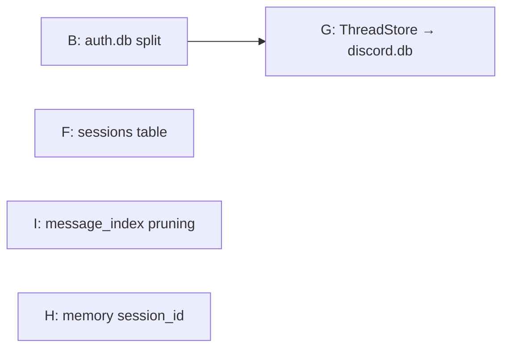

## Source

GitHub issue #417 — "Persistence layer: 10 architectural findings (DB overload, session durability, deprecated schema)". Originally 10 findings; 3 fixed prior to issue creation (1, 3, 10), 2 fixed since (D: session persistence to disk via `cli_sessions.json` in bd3d739/118bb83; E: removed `_session_file_exists()` guard in f5cb07e). **5 remain open: B, F, G, H, I.**

Note: D (resume pointer survives restart) and F (sessions as first-class entities) are distinct problems. D solved the data durability gap — `_resume_session_ids` now persists to `~/.lyra/cli_sessions.json` and rehydrates on startup. F addresses the schema gap — sessions are still implicit (inferred from turn rows), with no lifecycle tracking, no `last_active_at`, and no efficient session queries. F is a schema enrichment that gives the persistence layer proper session semantics; D is the operational fix that keeps resume working today.

## Problem

Lyra's persistence layer has 5 unresolved architectural issues:

1. **auth.db domain overload (B)** — 5 unrelated stores (AuthStore, AgentStore, CredentialStore, ThreadStore, PrefsStore) share one SQLite file. Schema migrations risk all domains; WAL contention across 5 connections. Verified in `multibot_stores.py:50-69`.

2. **Implicit sessions (F)** — No `pool_sessions` table in `turns.db`. Sessions are inferred from turn history via index scans (`get_last_session()` at `turn_store.py:176`). Session metadata (lifecycle, resume count) is lost.

3. **ThreadStore in auth.db (G)** — `discord_threads` table is platform-specific but lives in the auth domain. Only the Discord adapter uses it (`discord_threads.py:16-72`). Blocked by B.

4. **Memory vault session_id gap (H)** — `upsert_session()` in `memory_upserts.py:57-74` receives `session_id` but doesn't pass it as queryable metadata to roxabi-vault.

5. **message_index.db unbounded growth (I)** — `cleanup_older_than()` exists (`message_index.py:70-79`) but is never called. Index grows monotonically.

### Migration infrastructure

No migration framework exists. Stores use idempotent DDL (`CREATE TABLE IF NOT EXISTS`) + additive `ALTER TABLE` statements with error suppression for "duplicate column". Data migrations are manual one-off methods (e.g., `_populate_343()`, `_rebuild_346()` in AgentStore). This pattern works but requires discipline — each finding's migration must be self-contained and idempotent.

## Outcome

- `auth.db` contains only auth grants; agent config, credentials, and prefs live in `config.db`; Discord state in `discord.db`
- Sessions are first-class entities in `turns.db` with explicit lifecycle tracking
- Memory entries are traceable to their source session
- `message_index.db` self-prunes on startup
- Each change ships as an independent, backward-compatible PR

## Appetite

All 5 findings in one concentrated push. Each finding is its own PR, merged sequentially where dependencies exist.

## Shapes

### Shape 1: Parallel PRs with sub-issues

Each finding ships as a standalone PR via a sub-issue. Only one hard dependency: B → G. All others are independent and run in parallel across separate worktrees.

**B (auth.db split) — highest-risk PR:** Create `config.db` (agents, bot_agent_map, agent_runtime_state, bot_secrets, user_prefs). Migrate data via one-time idempotent script. Update `multibot_stores.py` connection paths. Keep `auth.db` for grants only. Migration guard on startup: if `config.db` doesn't exist, run migration from `auth.db` and log a warning (not silent fallback). **Requires full stop → migrate → start cycle** — not a hot migration. A write to AgentStore/PrefsStore between copy and connection-path switch would land in the old file and be lost. Verify `_populate_343()`/`_rebuild_346()` idempotency on the copied database. Ensure `config.db` lands in the same `vault_dir` as `auth.db` (preserves `keyring.key` path for CredentialStore).

**G (ThreadStore → discord.db):** After B lands, move `discord_threads` to `discord.db` owned by the Discord adapter. Adapter creates its own connection; Hub passes `session_id` via `platform_meta` instead of querying ThreadStore directly.

**F (sessions table):** Add `pool_sessions` table to TurnStore DDL. Write session row on new session start, update `last_active_at` on each turn. Backfill from existing `conversation_turns` data. Wire `get_last_session()` to query `pool_sessions` instead of scanning turns. Independent of B — touches only `turns.db`.

**I (message_index pruning):** Call `cleanup_older_than(days)` during startup in `multibot.py`. Add `message_index_retention_days` to `config.toml` with 90-day default. Higher operational priority than H — unbounded disk growth on a 24/7 production machine.

**H (memory session_id) — lowest stakes, safe to defer:** Add `session_id` as a queryable metadata field (not just the record identifier) in `upsert_session()` call. Non-breaking, additive. Primarily a debugging aid, not a user-facing reliability improvement.

**Execution waves:**
- **Wave 1 (parallel):** I (smallest) + F (sessions table) + B (auth.db split) — 3 worktrees, 3 PRs
- **Wave 2 (after B merges):** G (ThreadStore move)
- **Wave 3 (any time):** H (metadata addition)

**Trade-offs:**
- Pro: Each PR is small, reviewable, independently rollback-able
- Pro: 3 findings ship in parallel — faster than sequential
- Pro: Matches the "independently mergeable" constraint perfectly
- Con: B is a large, high-risk PR (~6 files, migration script, stop/start required)

**Rough scope:** L (5 sub-issue PRs, ~15-20 files touched total, but wave 1 parallelism shortens wall-clock time)

### Shape 2: Two-phase batch

**Phase 1 (arch core):** Single PR for F + B + G together. One migration script handles all three schema changes atomically. Stores bundle gets a `MigrationRunner` that detects current schema version and applies pending migrations.

**Phase 2 (hygiene):** Single PR for H + I. Independent of Phase 1.

**Trade-offs:**
- Pro: 2 PRs instead of 5 — faster review cycle
- Pro: F + B + G are conceptually linked; testing them together catches integration issues
- Con: Large PR for Phase 1 (~12 files, multiple schema changes)
- Con: Rollback of Phase 1 is all-or-nothing
- Con: Harder to bisect if something breaks post-merge

**Rough scope:** M-L (2 PRs, same ~15-20 files but batched)

### Shape 3: Incremental with shim layer

Add a `StoreRegistry` abstraction that maps logical store names to database paths. Initially all stores point to `auth.db` (status quo). Then incrementally change the registry to point stores at their target databases. Migration happens lazily on first access: if target DB is empty, copy data from source.

**Trade-offs:**
- Pro: Zero-downtime by design — shim handles migration transparently
- Pro: Can ship the registry first, then flip stores one by one
- Con: Adds permanent abstraction layer (shim) for a one-time migration
- Con: Lazy migration adds complexity to every store's `connect()` path
- Con: Over-engineered for a personal project with a single production instance

**Rough scope:** L-XL (registry abstraction + per-store migration + cleanup of shim after migration completes)

## Fit Check

**Shape 1 (Parallel PRs with sub-issues) is the clear winner.**

Shape 3 is eliminated — a StoreRegistry abstraction is over-engineered for a single-instance personal project. The lazy migration adds permanent complexity for a one-time operation.

Shape 2 is viable but violates the "independently mergeable" constraint from the frame. A combined F+B+G PR changes connection targets across `StoreBundle` in `multibot_stores.py` which opens 5 connections sequentially — a partial failure (e.g., `config.db` schema succeeds but `discord.db` fails) leaves the system in an inconsistent state with no clean rollback. The benefit (2 vs 5 PRs) doesn't outweigh the risk.

Shape 1 fits all constraints: each PR is independently mergeable, B includes a migration guard with startup warning, and only B → G requires strict ordering. Wave 1 (I + F + B) runs in parallel across worktrees, cutting wall-clock time significantly.

**Recommended execution order:**

B → G is the only hard dependency chain. F, I, and H are fully independent — they can ship before, after, or in parallel with B → G. Recommended start order: **I** (smallest, immediate operational value for 24/7 production), then **F** and **B** in parallel, then **G** (after B merges), then **H** (lowest stakes, safe to defer if the push runs long).

### Files impacted

| Finding | Files | Change type |
|---------|-------|-------------|
| B | `multibot_stores.py`, `agent_store.py`, `credential_store.py`, `prefs_store.py`, `bootstrap/config.py` | Connection paths + migration script + stop/start deployment |
| G | `thread_store.py`, `discord_threads.py`, `multibot_wiring.py`, `multibot_stores.py` | Move store + adapter owns connection |
| F | `turn_store.py`, `cli_pool.py`, `multibot_stores.py` | DDL + new methods + wiring |
| I | `message_index.py`, `multibot.py`, `bootstrap/config.py` | Add startup call + config key |
| H | `memory_upserts.py` | Add `session_id` to metadata dict |
