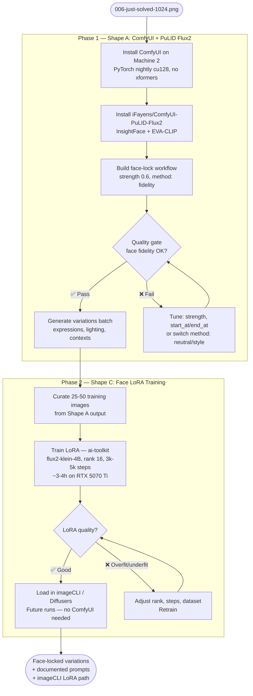

## Source

Issue #419 — "feat: implement PuLID Flux2 face locking for Lyra avatar"

> Implement zero-shot face locking using PuLID Flux2 to generate consistent Lyra avatar variations
> with the same locked identity. Avatar finalist: `brand/concepts/avatar-final/006-just-solved-1024.png`.

## Problem

Generating new Lyra avatar variations from the finalized candidate produces face identity drift: each
Diffusers run re-samples a slightly different face even from the same prompt. The finalized avatar
(`006-just-solved-1024.png`, generated with `flux2-klein`, 1024×1024) needs to serve as a face anchor
for future variations — different expressions, lighting, and contexts — while keeping the same person.

**Current stack:** imageCLI — HuggingFace Diffusers (flux2-klein, flux1-dev, flux1-schnell, sd35),
Python 3.12, no ComfyUI present. PuLID is not installed. No face-locking mechanism exists.

**Critical constraint:** No standalone Python PuLID API exists for Flux2-klein.
`iFayens/ComfyUI-PuLID-Flux2` is a ComfyUI-only custom node (no pip package, no Diffusers adapter).
The canonical upstream (`ToTheBeginning/PuLID`) targets Flux.1-dev. The only non-ComfyUI Python path
(`nunchaku/pipeline_flux_pulid`) requires 4-bit Nunchaku quantisation, not `Flux2KleinPipeline`, and
involves a separate model conversion step. ComfyUI is currently the only practical path.

**Blackwell caveat:** RTX 5070 Ti uses CUDA sm_120 — requires PyTorch nightly cu128 (or cu130+),
not stable PyTorch. xformers must NOT be installed (silently downgrades PyTorch). First-run PTX JIT
compilation takes 30+ minutes. Python 3.11–3.12 required.

## Outcome

A repeatable, documented workflow where:
1. `006-just-solved-1024.png` is the face reference.
2. New generations (expression / lighting / context variations) preserve Lyra's face identity,
   using `flux2-klein` as the base model (or explicitly documenting any substitution).
3. Prompt patterns and VRAM budget are documented in portable `.md` files, not locked inside a
   node editor.
4. A fallback path exists if zero-shot quality proves insufficient.

## Appetite

1 short cycle — ~2 days: 0.5d setup, 0.5d evaluation, 0.5d generation run, 0.5d documentation.
Setup and evaluation carry the highest variance — ComfyUI WSL2/CUDA path alignment and face-lock
quality tuning can each expand by 0.5d in adverse conditions.

---

## Face-lock Model Landscape (2025–2026)

Researched alternatives beyond PuLID for Flux-based face identity preservation:

| Model | Flux support | Face fidelity | Prompt adherence | VRAM | Notes |
|-------|-------------|---------------|-----------------|------|-------|
| **PuLID Flux2** (`iFayens`) | ✅ Flux2-klein "Best" | Highest | Medium | ~14–16 GB w/ Klein | Only Flux2-klein-native option |
| **InstantID** (InstantX) | ⚠️ Experimental | High | Good | Unknown (high) | Squinted-eye artifacts; good angles; mirrors source pose |
| **IP-Adapter FaceID** (InstantX) | ✅ Flux.1-dev | Medium | Best | Lowest | Fastest; 5-10% fidelity sacrifice |
| **ACE++** (Alibaba, Feb 2025) | ✅ Flux.1-Fill-dev | High (inpainting) | Good | Moderate | Best for obstructed faces + bg swap; different use case |
| **HyperLoRA** | Limited | Medium | Best | Low | Best text adherence; weakest identity |

**Verdict:** `iFayens/ComfyUI-PuLID-Flux2` remains the correct choice. No other tool explicitly
targets Flux2-klein with identity locking. ACE++ is worth a separate evaluation if the use case
shifts toward inpainting/background replacement.

**PuLID Flux2 settings guidance (from community + repo):**
- Recommended strength: **0.6** (range 0–5, default 1). Higher = more rigid identity, less prompt adherence.
- Three methods: `fidelity` (strong lock), `neutral` (balanced), `style` (softer).
- `start_at` / `end_at` sliders: control which denoising steps receive injection. Narrowing to mid-steps
  (e.g. 0.0–0.6) can improve prompt adherence while retaining face lock.
- Known issue: training scripts removed from the node due to instability (v0.5.0).

---

## Shapes

### Shape A: ComfyUI + PuLID Flux2 node (recommended primary)

Install ComfyUI on Machine 2 alongside imageCLI. Install `iFayens/ComfyUI-PuLID-Flux2` custom node.
Build a face-lock workflow: load `flux2-klein` + PuLID attention injection, feed
`006-just-solved-1024.png` as the face reference, generate variations.

ComfyUI manages model loading, VRAM orchestration, and the generation loop. Workflows are JSON files.
Output is separate from imageCLI — no `.md` prompt integration.

**Trade-offs:**
- Pro: Only well-documented face-lock path for flux2-klein. Node explicitly targets Flux2-klein "Best."
- Pro: Visual workflow editor useful for iterating strength vs prompt adherence. Rich community
  workflows to reference.
- Pro: Zero code changes to imageCLI.
- Con: Parallel toolchain — two separate image gen stacks on Machine 2.
- Con: Workflows are JSON, not `.md` prompt files. Prompt patterns must be captured in portable `.md`
  files alongside ComfyUI JSON to avoid locking knowledge inside the node editor.
- Con: No CLI integration — manual node-editor interaction required per run.
- Con: Only one workload can hold the GPU at a time — ComfyUI and imageCLI must not run concurrently
  (OOM). Operator discipline or a lockfile required.
- Con: Machine 2-bound — peaks at ~14–16 GB VRAM. Cannot run on Machine 1 (RTX 3080, 10 GB).
- Con: Blackwell WSL2 setup friction — PyTorch nightly cu128, no xformers, 30+ min first JIT compile.

**Rough scope:** M (0.5d install + config, 0.5d workflow design, 0.5d eval + generation)

---

### Shape B: PuLID as imageCLI engine extension

Add a `pulid-flux2` engine to imageCLI. Accept `--reference-image path` parameter. Under the hood,
inject PuLID face attention into the Diffusers `Flux2KleinPipeline`, using the standalone
Python PuLID-Flux library (or a port thereof).

Keeps everything in imageCLI: `.md` prompt files, consistent CLI UX, single toolchain.

**Trade-offs:**
- Pro: Single toolchain. `.md` prompt format preserved. CLI-native, scriptable, batch-able.
- Pro: Consistent with imageCLI extension pattern (new engine = new file in `engines/`).
- Con: **No standalone Python API exists.** `iFayens/ComfyUI-PuLID-Flux2` is ComfyUI-only — no pip
  package, no Diffusers adapter, no published Python interface. Implementing Shape B means porting
  ComfyUI node internals (EVA02-CLIP-L extraction + InsightFace pipeline + PuLID attention injection
  into transformer double blocks) into imageCLI. This is an unmaintained internal fork of a
  rapidly-evolving upstream, not a wrapper.
- Con: VRAM peaks at ~14–16 GB total (flux2-klein ~12 GB + EVA02-CLIP ~1 GB + PuLID safetensors
  ~0.5 GB + activation peaks ~1.5 GB during identity injection). At the 16 GB ceiling — OOM risk
  above 1024×1024.

**Rough scope:** XL (blocked until spike confirms feasibility; very likely not worth pursuing vs Shape A)

---

### Shape C: Face LoRA training (ai-toolkit — long-term complement)

Train a face-identity LoRA using ai-toolkit on Machine 2. Use ComfyUI face-locked outputs as the
training dataset (resolves the chicken-and-egg dependency). Load LoRA into imageCLI or ComfyUI for
future runs.

**Dataset requirements (researched):**

| Dimension | Recommendation |
|-----------|---------------|
| **Image count** | 25–50 curated images (floor: 20; sweet spot: 40–50) |
| **Head angles** | ≥5 distinct: front, ¾ left, ¾ right, profile, slight up/down |
| **Expressions** | ≥4: neutral, subtle smile, full smile, serious/focused |
| **Lighting** | ≥4: soft studio, natural window, hard rim, low-key |
| **Distance** | Mix: tight portrait (head+shoulders) + medium (waist up) + 1-2 full body |
| **Background** | Varied — prevents background leakage into identity |
| **What to avoid** | Near-duplicate frames, watermarks, heavy filters, accessories that occlude face |
| **Captions** | Unique trigger word + `photo of [trigger]`. Do NOT describe facial features. Caption dropout ~0.05 |

**Training config (ai-toolkit on RTX 5070 Ti, 16GB GDDR7):**

| Parameter | Value |
|-----------|-------|
| Base model | `flux2-klein-4B` ← not 9B (needs 32GB+), not flux1-dev (too big for 16GB BF16) |
| Resolution | 1024×1024 |
| LoRA rank | 16 (start); 32 if underfitting; 8 if collapsing |
| Steps | 3,000–5,000 (face identity; 50–90 repeats/image) |
| Quantization | 4-bit BnB (nf4) — gets model to ~9 GB base footprint |
| Memory tricks | `--gradient_checkpointing`, `--cache_latents`, `--use_8bit_adam`, pre-compute text embeddings |
| Trainer | **ai-toolkit (ostris)** — explicit 16GB flux2-klein-4B guide; most active for Flux2 |

**Training time on RTX 5070 Ti (estimated):**
- RTX 5070 Ti ≈ 30% faster than RTX 4090 in Flux workflows
- RTX 4090 baseline: ~700 steps / 41 min (QLoRA, 512×768)
- Extrapolated 5070 Ti: ~700 steps / ~30 min → **3,000 steps ≈ 2h, 5,000 steps ≈ 3–4h**
- LoRA output size: ~100 MB

**Known issue:** As of early 2026, LoRA loading in ComfyUI for Flux2-klein-4B has a bug where LoRAs
"have very weak/no visible effect" at strength 1.0 (ComfyUI issue #11975). This is actively being
patched. Loading via Diffusers/imageCLI may be more stable.

**Trade-offs:**
- Pro: Highest face fidelity. Once trained, LoRA is deterministic across prompts.
- Pro: No runtime overhead from face encoder. Runs entirely within imageCLI / Diffusers — removes
  ComfyUI dependency long-term.
- Pro: Chicken-and-egg resolved: Shape A generates the diverse face-locked images that become the
  training dataset.
- Con: Requires 25–50 curated training images first (generated via Shape A).
- Con: 3–4h training run, ~100 MB storage. Risk of overfitting if dataset lacks diversity.
- Con: LoRA locks to face at training time — adjustments require retraining.
- Con: ComfyUI LoRA loading bug for Flux2-klein still being patched (use imageCLI/Diffusers path).

**Rough scope:** M (sequenced after Shape A; ~0.5d dataset prep + 0.5d training + 0.5d evaluation)

**Note:** Shape C is a **long-term complement**, not merely a fallback. The sequence is:
Shape A generates variations + training dataset → Shape C trains LoRA → future runs operate
entirely within imageCLI, no ComfyUI needed.

---

## Fit Check

**Recommended path: Shape A now → Shape C sequenced after.**

Shape A (ComfyUI) is the only practical path today:
- Sole well-documented face-lock solution for `flux2-klein`. No standalone Python alternative exists.
- Setup cost is modest (~0.5d). Isolated from imageCLI — no code changes needed.
- Parallel-toolchain concern is acceptable for an offline brand asset workflow.
- GPU mutex (one workload at a time) managed by operator discipline / lockfile.

Shape B (imageCLI engine) deferred indefinitely — no Python API to wrap. Revisit only if upstream
publishes a Diffusers adapter for Flux2-klein.

Shape C (LoRA) sequenced after Shape A. Shape A output becomes training data. Long-term, Shape C
removes the ComfyUI dependency entirely and restores single-toolchain operation.

**VRAM note:** ComfyUI + flux2-klein + PuLID peaks at **~14–16 GB** (at Machine 2's ceiling).
OOM mitigations: cap resolution at 1024×1024; use FP8/GGUF Klein weights in ComfyUI if available;
disable `torch.compile`; enable `--lowvram`. Machine 1 (RTX 3080, 10 GB) cannot run this workload.

### Files impacted

| Area | What changes |
|------|-------------|
| `brand/prompts/avatar-final/` | New face-locked variation prompt `.md` files |
| `brand/concepts/avatar-final/` | New generated variation images |
| `brand/AVATAR-PLAYBOOK.md` | Face-lock workflow, best prompt patterns, LoRA training notes |
| ComfyUI install (new) | `~/ComfyUI/` on Machine 2 |
| imageCLI | No changes for Shape A; LoRA loading additions for Shape C |
