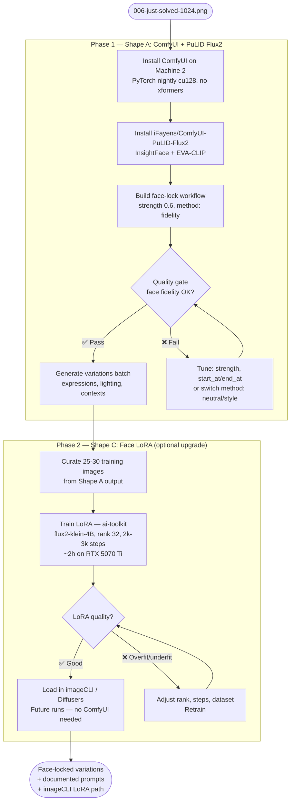

## Source

Issue #419 — "feat: implement PuLID Flux2 face locking for Lyra avatar"

> Implement zero-shot face locking using PuLID Flux2 to generate consistent Lyra avatar variations
> with the same locked identity. Avatar finalist: `brand/concepts/avatar-final/006-just-solved-1024.png`.

## Problem

Generating new Lyra avatar variations from the finalized candidate produces face identity drift: each
Diffusers run re-samples a slightly different face even from the same prompt. The finalized avatar
(`006-just-solved-1024.png`, generated with `flux2-klein`, 1024×1024) needs to serve as a face anchor
for future variations — different expressions, lighting, and contexts — while keeping the same person.

**Current stack:** imageCLI — HuggingFace Diffusers (flux2-klein, flux1-dev, flux1-schnell, sd35),
Python 3.12, no ComfyUI present. PuLID is not installed. No face-locking mechanism exists.

**Critical constraint:** No standalone Python PuLID API exists for Flux2-klein.
`iFayens/ComfyUI-PuLID-Flux2` is a ComfyUI-only custom node (no pip package, no Diffusers adapter).
The canonical upstream (`ToTheBeginning/PuLID`) targets Flux.1-dev. The only non-ComfyUI Python path
(`nunchaku/pipeline_flux_pulid`) requires 4-bit Nunchaku quantisation, not `Flux2KleinPipeline`, and
involves a separate model conversion step. ComfyUI is currently the only practical path.

**Blackwell caveat:** RTX 5070 Ti uses CUDA sm_120 — requires PyTorch nightly cu128 (or cu130+),
not stable PyTorch. xformers must NOT be installed (silently downgrades PyTorch). First-run PTX JIT
compilation takes 30+ minutes. Python 3.11–3.12 required. **Pop!_OS (native Linux) removes all
WSL2-specific friction** — CUDA installs directly via apt/runfile, ComfyUI runs without bridging,
`localhost:8188` works directly. Blackwell driver requirements still apply regardless of OS.

## Outcome

A repeatable, documented workflow where:
1. `006-just-solved-1024.png` is the face reference.
2. New generations (expression / lighting / context variations) preserve Lyra's face identity,
   using `flux2-klein` as the base model (or explicitly documenting any substitution).
3. Prompt patterns and VRAM budget are documented in portable `.md` files, not locked inside a
   node editor.
4. A fallback path exists if zero-shot quality proves insufficient.

## Appetite

1 short cycle — ~2 days: 0.5d setup, 0.5d evaluation, 0.5d generation run, 0.5d documentation.
Setup and evaluation carry the highest variance — ComfyUI WSL2/CUDA path alignment and face-lock
quality tuning can each expand by 0.5d in adverse conditions.

---

## Face-lock Model Landscape (2025–2026)

Researched alternatives beyond PuLID for Flux-based face identity preservation:

| Model | Flux support | Face fidelity | Prompt adherence | VRAM | Notes |
|-------|-------------|---------------|-----------------|------|-------|
| **PuLID Flux2** (`iFayens`) | ✅ Flux2-klein "Best" | Highest | Medium | ~14–16 GB w/ Klein | Only Flux2-klein-native option |
| **InstantID** (InstantX) | ⚠️ Experimental | High | Good | Unknown (high) | Squinted-eye artifacts; good angles; mirrors source pose |
| **IP-Adapter FaceID** (InstantX) | ✅ Flux.1-dev | Medium | Best | Lowest | Fastest; 5-10% fidelity sacrifice |
| **ACE++** (Alibaba, Feb 2025) | ✅ Flux.1-Fill-dev | High (inpainting) | Good | Moderate | Best for obstructed faces + bg swap; different use case |
| **HyperLoRA** | Limited | Medium | Best | Low | Best text adherence; weakest identity |

**Verdict:** `iFayens/ComfyUI-PuLID-Flux2` remains the correct choice. No other tool explicitly
targets Flux2-klein with identity locking. ACE++ is worth a separate evaluation if the use case
shifts toward inpainting/background replacement.

**PuLID Flux2 settings guidance (from community + repo):**
- Recommended strength: **0.6** (range 0–5, default 1). Higher = more rigid identity, less prompt adherence.
- Three methods: `fidelity` (strong lock), `neutral` (balanced), `style` (softer).
- `start_at` / `end_at` sliders: control which denoising steps receive injection. Narrowing to mid-steps
  (e.g. 0.0–0.6) can improve prompt adherence while retaining face lock.
- Known issue: training scripts removed from the node due to instability (v0.5.0).

---

## Shapes

### Shape A: ComfyUI + PuLID Flux2 node (recommended primary)

Install ComfyUI on Machine 2 alongside imageCLI. Install `iFayens/ComfyUI-PuLID-Flux2` custom node.
Build a face-lock workflow: load `flux2-klein` + PuLID attention injection, feed
`006-just-solved-1024.png` as the face reference, generate variations.

ComfyUI manages model loading, VRAM orchestration, and the generation loop. Workflows are JSON files.
Output is separate from imageCLI — no `.md` prompt integration.

**Trade-offs:**
- Pro: Only well-documented face-lock path for flux2-klein. Node explicitly targets Flux2-klein "Best."
- Pro: Visual workflow editor useful for iterating strength vs prompt adherence. Rich community
  workflows to reference.
- Pro: Zero code changes to imageCLI.
- Con: Parallel toolchain — two separate image gen stacks on Machine 2.
- Con: Workflows are JSON, not `.md` prompt files. Prompt patterns must be captured in portable `.md`
  files alongside ComfyUI JSON to avoid locking knowledge inside the node editor.
- Con: No CLI integration — manual node-editor interaction required per run.
- Con: Only one workload can hold the GPU at a time — ComfyUI and imageCLI must not run concurrently
  (OOM). Operator discipline or a lockfile required.
- Con: Machine 2-bound — peaks at ~14–16 GB VRAM. Cannot run on Machine 1 (RTX 3080, 10 GB).
- Con: Blackwell setup friction — PyTorch nightly cu128 required (sm_120), no xformers, 30+ min first JIT compile. Pop!_OS removes WSL2-specific friction; native CUDA install is cleaner.

**Rough scope:** M (0.5d install + config, 0.5d workflow design, 0.5d eval + generation)

---

### Shape B: PuLID as imageCLI engine extension

Add a `pulid-flux2` engine to imageCLI. Accept `--reference-image path` parameter. Under the hood,
inject PuLID face attention into the Diffusers `Flux2KleinPipeline`, using the standalone
Python PuLID-Flux library (or a port thereof).

Keeps everything in imageCLI: `.md` prompt files, consistent CLI UX, single toolchain.

**Trade-offs:**
- Pro: Single toolchain. `.md` prompt format preserved. CLI-native, scriptable, batch-able.
- Pro: Consistent with imageCLI extension pattern (new engine = new file in `engines/`).
- Con: **No standalone Python API exists.** `iFayens/ComfyUI-PuLID-Flux2` is ComfyUI-only — no pip
  package, no Diffusers adapter, no published Python interface. Implementing Shape B means porting
  ComfyUI node internals (EVA02-CLIP-L extraction + InsightFace pipeline + PuLID attention injection
  into transformer double blocks) into imageCLI. This is an unmaintained internal fork of a
  rapidly-evolving upstream, not a wrapper.
- Con: VRAM peaks at ~14–16 GB total (flux2-klein ~12 GB + EVA02-CLIP ~1 GB + PuLID safetensors
  ~0.5 GB + activation peaks ~1.5 GB during identity injection). At the 16 GB ceiling — OOM risk
  above 1024×1024.

**Rough scope:** XL (blocked until spike confirms feasibility; very likely not worth pursuing vs Shape A)

---

### Shape C: Face LoRA training (ai-toolkit — long-term complement, optional)

Train a face-identity LoRA using ai-toolkit. Use Shape A outputs as training dataset. Load LoRA
into imageCLI or ComfyUI for future runs.

**Shape A is a valid permanent workflow — Shape C is an upgrade, not a requirement.** The break-even
is roughly 10–15 generated images of the same subject; any ongoing avatar campaign exceeds it.

| | Shape A — PuLID | Shape C — LoRA |
|---|---|---|
| Per generation | ~45–90s (face encoder overhead) | Normal Flux speed (~30–60s) |
| VRAM | ~14–16 GB (at ceiling) | ~12–13 GB (comfortable) |
| Face fidelity | "Same person" to human eyes | ~97% identity recognition |
| Pose variation | Stiff — mirrors reference angle | Free — any angle |
| Hair variation | Very sticky to reference | Free |
| Heavy stylization (anime, illustration) | Weakens noticeably | Holds well |
| Maintenance | Zero | Zero (after training) |
| When to choose | Bootstrap; low volume; rapid iteration | Ongoing campaign; style diversity; max fidelity |

**Dataset: 25–30 images, diversity beats quantity.**
16 well-curated images can outperform 110 near-duplicates. Practical floor: ~15 images.

| Dimension | Target | Why |
|-----------|--------|-----|
| Head angles | ≥5: front, ¾L, ¾R, profile, slight tilt | 3D face geometry coverage |
| Expressions | ≥4: neutral, subtle smile, full smile, serious | Expression ≠ identity |
| Lighting | ≥4: soft studio, natural window, hard rim, low-key | Prevents lighting leakage |
| Distance | Mix portrait + medium + 1–2 full body | Scale independence |
| Background | Varied | Prevents BG leakage into trigger |
| Avoid | Near-duplicates, watermarks, face-occluding accessories | Dedup with perceptual hash |

**Caption strategy — the #1 quality lever (more impactful than image count):**
- Format: `"a photo of lyraface, [expression], [lighting], [background]"`
- Describe **everything changeable**: expression, lighting, hair color, clothing, BG
- Describe **nothing about the face** (bone structure, eye shape, jaw) — leave un-described so
  face features bind tightly to the trigger word
- Caption dropout: 0.05 — random drops build inference robustness
- Use natural language prose, not SD-style tags (Flux was trained on prose)
- Example: LoRA trained on 22 photos all wearing glasses, "glasses" never captioned → correctly
  generates without glasses when prompted. Identity captured, accessories not.

**Training config (ai-toolkit, RTX 5070 Ti, 16GB, Pop!_OS):**

| Parameter | Value | Note |
|-----------|-------|------|
| Base | `flux2-klein-4B` | Only model that trains comfortably in 16GB |
| Resolution | 1024×1024 | Standard; drop to 896 if OOM at rank 64 |
| LoRA rank | **32** | Face sweet spot — 16 too soft, 64 overfits small datasets |
| linear_alpha | 32 | alpha = rank is Flux standard |
| Steps | **2,000–3,000** | ~25 images; peak typically at 60–75% of total |
| Checkpoint saves | every 250 steps | Always pick best checkpoint — final step ≠ best |
| Learning rate | **1e-4 exactly** | Flux2 hypersensitive — 2e-4 destroys images |
| Optimizer | AdamW 8-bit | 75% optimizer VRAM reduction |
| Quantization | 4-bit BnB (nf4) | Gets transformer to ~9 GB |
| `cache_latents_to_disk` | true | Unloads VAE, saves ~2 GB |
| `gradient_checkpointing` | true | Standard for 16GB |
| `sample_steps` | 8 | Klein Base uses 8-step inference, not 20–30 |
| `weight_decay` | 0.01 | Prevents weight collapse specific to Flux2 |

**Training time on RTX 5070 Ti:** 2,000 steps ≈ **~1.5h** · 3,000 steps ≈ **~2h** · output ~50 MB

**Checkpoint selection:** Evaluate steps 1,500 / 2,000 / 2,500 / 3,000 with these 4 test prompts:
1. `"a photo of lyraface, neutral expression"` — baseline identity
2. `"a photo of lyraface, smiling, outdoor"` — expression variation
3. `"lyraface looking to the left"` — pose variation (reveals rigidity)
4. `"anime illustration of lyraface"` — style transfer resistance

**Common failure modes:**
- **Identity baking:** Every output identical regardless of prompt → earlier checkpoint, fewer steps
- **Identity leak:** Accessories/BG from training bleed into outputs → better captions
- **Anatomical distortion:** Eyes misaligned, jaw warped at high steps → use step 2,000–2,500
- **Learning rate disaster:** Never use LR > 1e-4 with Flux2. Do not copy SD1.5/SDXL configs.

**Known issue:** ComfyUI LoRA loading for Flux2-klein-4B currently buggy (ComfyUI #11975 — LoRAs
show no effect at strength 1.0). Use imageCLI/Diffusers to load the trained LoRA.

**Trade-offs:**
- Pro: ~97% identity recognition; free pose/hair variation; normal Flux speed; comfortable VRAM
- Pro: Runs entirely in imageCLI — removes ComfyUI dependency long-term
- Pro: Shape A output resolves the chicken-and-egg dependency
- Con: Requires ~25–30 curated images and ~2h training first
- Con: Face baked at training time — significant change requires retraining

**Rough scope:** M (sequenced after Shape A: ~0.5d curation + ~2h training + ~0.5d eval)

**Note:** Shape C is a **long-term complement**, not a replacement. Sequence:
Shape A (one-time) → generates variations + training dataset → Shape C trains LoRA (~2h) →
future runs in imageCLI, no ComfyUI, no VRAM ceiling.

---

## Fit Check

**Recommended path: Shape A now → Shape C sequenced after.**

Shape A (ComfyUI) is the only practical path today:
- Sole well-documented face-lock solution for `flux2-klein`. No standalone Python alternative exists.
- Setup cost is modest (~0.5d). Isolated from imageCLI — no code changes needed.
- Parallel-toolchain concern is acceptable for an offline brand asset workflow.
- GPU mutex (one workload at a time) managed by operator discipline / lockfile.

Shape B (imageCLI engine) deferred indefinitely — no Python API to wrap. Revisit only if upstream
publishes a Diffusers adapter for Flux2-klein.

Shape C (LoRA) sequenced after Shape A. Shape A output becomes training data. Long-term, Shape C
removes the ComfyUI dependency entirely and restores single-toolchain operation.

**VRAM note:** ComfyUI + flux2-klein + PuLID peaks at **~14–16 GB** (at Machine 2's ceiling).
OOM mitigations: cap resolution at 1024×1024; use FP8/GGUF Klein weights in ComfyUI if available;
disable `torch.compile`; enable `--lowvram`. Machine 1 (RTX 3080, 10 GB) cannot run this workload.

### Files impacted

| Area | What changes |
|------|-------------|
| `brand/prompts/avatar-final/` | New face-locked variation prompt `.md` files |
| `brand/concepts/avatar-final/` | New generated variation images |
| `brand/AVATAR-PLAYBOOK.md` | Face-lock workflow, best prompt patterns, LoRA training notes |
| ComfyUI install (new) | `~/ComfyUI/` on Machine 2 |
| imageCLI | No changes for Shape A; LoRA loading additions for Shape C |
