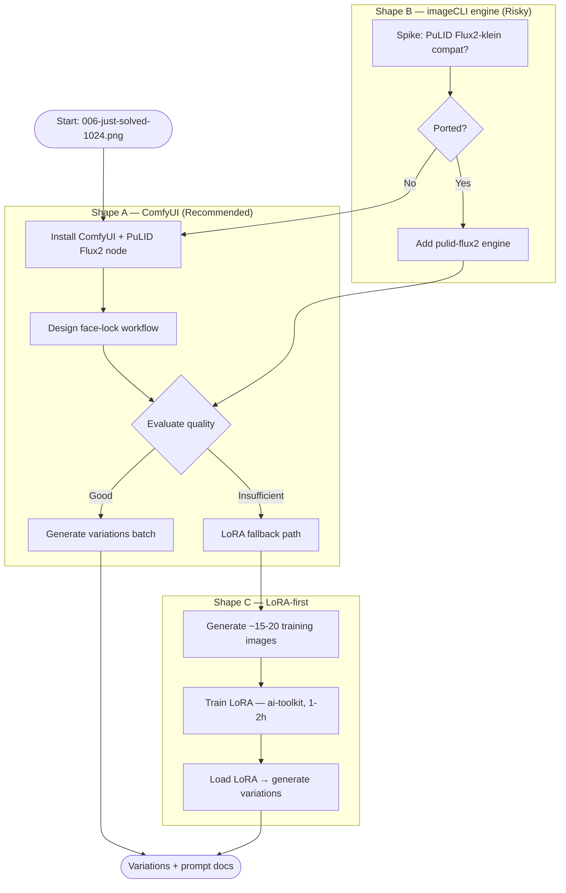

## Source

Issue #419 — "feat: implement PuLID Flux2 face locking for Lyra avatar"

> Implement zero-shot face locking using PuLID Flux2 to generate consistent Lyra avatar variations
> with the same locked identity. Avatar finalist: `brand/concepts/avatar-final/006-just-solved-1024.png`.

## Problem

Generating new Lyra avatar variations from the finalized candidate produces face identity drift: each
Diffusers run re-samples a slightly different face even from the same prompt. The finalized avatar
(`006-just-solved-1024.png`, generated with `flux2-klein`, 1024×1024) needs to serve as a face anchor
for future variations — different expressions, lighting, and contexts — while keeping the same person.

**Current stack:** imageCLI — HuggingFace Diffusers (flux2-klein, flux1-dev, flux1-schnell, sd35),
Python 3.12, no ComfyUI present. PuLID is not installed. No face-locking mechanism exists.

**Critical constraint:** No standalone Python PuLID API exists for Flux2-klein.
`iFayens/ComfyUI-PuLID-Flux2` is a ComfyUI-only custom node (no pip package, no Diffusers adapter).
The canonical upstream (`ToTheBeginning/PuLID`) targets Flux.1-dev. The only non-ComfyUI Python path
(`nunchaku/pipeline_flux_pulid`) requires 4-bit Nunchaku quantisation, not `Flux2KleinPipeline`, and
involves a separate model conversion step. ComfyUI is currently the only practical path.

## Outcome

A repeatable, documented workflow where:
1. `006-just-solved-1024.png` is the face reference.
2. New generations (expression / lighting / context variations) preserve Lyra's face identity,
   using `flux2-klein` as the base model (or explicitly documenting any substitution).
3. Prompt patterns and VRAM budget are documented in portable `.md` files, not locked inside a
   node editor.
4. A fallback path exists if zero-shot quality proves insufficient.

## Appetite

1 short cycle — ~2 days: 0.5d setup, 0.5d evaluation, 0.5d generation run, 0.5d documentation.
Setup and evaluation carry the highest variance — ComfyUI WSL2/CUDA path alignment and face-lock
quality tuning can each expand by 0.5d in adverse conditions.

---

## Shapes

### Shape A: ComfyUI + PuLID Flux2 node (as proposed)

Install ComfyUI on Machine 2 alongside imageCLI. Install `iFayens/ComfyUI-PuLID-Flux2` custom node.
Build a face-lock workflow: load `flux2-klein` + PuLID attention injection, feed
`006-just-solved-1024.png` as the face reference, generate variations.

ComfyUI manages model loading, VRAM orchestration, and the generation loop. Workflows are JSON files.
Output is separate from imageCLI — no `.md` prompt integration.

**Trade-offs:**
- Pro: Best-tested path for Flux2-klein + PuLID. The node explicitly targets Flux2. ComfyUI's model
  caching and VRAM management are mature. Rich community workflows to reference.
- Pro: Visual workflow editor useful for iterating on face-lock strength vs prompt adherence trade-off.
- Pro: Zero code changes to imageCLI.
- Con: Parallel toolchain — two separate image gen stacks on Machine 2. ComfyUI is ~2GB install + deps.
- Con: Workflows are JSON, not `.md` prompt files. Prompt patterns must be captured in portable `.md`
  files alongside ComfyUI JSON to avoid locking knowledge inside the node editor.
- Con: No CLI integration — manual node-editor interaction required per run.
- Con: Only one workload can hold the GPU at a time — ComfyUI and imageCLI must not run concurrently
  (OOM). A simple lockfile or operator discipline is required.
- Con: Machine 2-bound — this workload peaks at ~14–16 GB VRAM and cannot run on Machine 1
  (RTX 3080, 10 GB) without switching to a lower-VRAM model variant.

**Rough scope:** M (0.5d install + config, 0.5d workflow design, 0.5d eval + generation)

---

### Shape B: PuLID as imageCLI engine extension

Add a `pulid-flux2` engine to imageCLI. Accept `--reference-image path` parameter. Under the hood,
inject PuLID face attention into the Diffusers `Flux2KleinPipeline`, using the standalone
Python PuLID-Flux library (or a port thereof).

Keeps everything in imageCLI: `.md` prompt files, consistent CLI UX, single toolchain.

**Trade-offs:**
- Pro: Single toolchain. `.md` prompt format preserved. CLI-native, scriptable, batch-able.
- Pro: Consistent with imageCLI extension pattern (new engine = new file in `engines/`).
- Con: **No standalone Python API exists.** `iFayens/ComfyUI-PuLID-Flux2` is ComfyUI-only — no pip
  package, no Diffusers adapter, no published Python interface. Implementing Shape B means porting
  ComfyUI node internals (EVA02-CLIP-L extraction + InsightFace pipeline + PuLID attention injection
  into transformer double blocks) into imageCLI. This is an unmaintained internal fork of a
  rapidly-evolving upstream, not a wrapper.
- Con: VRAM peaks at ~14–16 GB total (flux2-klein ~12 GB + EVA02-CLIP ~1 GB + PuLID safetensors
  ~0.5 GB + activation peaks ~1.5 GB during identity injection). At the 16 GB ceiling — OOM risk
  above 1024×1024.

**Rough scope:** XL (blocked until spike confirms feasibility; very likely not worth pursuing vs Shape A)

---

### Shape C: LoRA face training (ai-toolkit, skip zero-shot)

Train a face-identity LoRA using ai-toolkit on Machine 2. Provide ~15-20 diverse reference
images (would need to generate these first). Training time ~1–2h. Load LoRA in imageCLI
(if diffusers LoRA loading is supported for flux2-klein) or in ComfyUI.

**Trade-offs:**
- Pro: Highest face fidelity. Once trained, LoRA is deterministic and works across prompts.
- Pro: No runtime overhead from face encoder during inference. Runs entirely within imageCLI /
  Diffusers — removes the ComfyUI dependency long-term.
- Con: Requires generating a diverse set of training images first (we have only 1 finalist —
  need ~15-20 diverse crops/angles). Chicken-and-egg — but Shape A naturally solves this: use
  ComfyUI face-locked variations as the LoRA training dataset.
- Con: Training time (1–2h), storage (~100MB LoRA), risk of overfitting on sparse reference data.
- Con: LoRA locks to a specific face at training time — hard to adjust without retraining.

**Rough scope:** M (but sequenced after Shape A generates training data)

**Note:** Shape C is a **long-term complement**, not merely a fallback. Shapes A and C are
sequenced, not mutually exclusive: A generates the variations and training data → C trains the LoRA
→ future runs no longer need ComfyUI.

---

## Fit Check

**Recommended path: Shape A now → Shape C later (sequenced, not mutually exclusive).**

Shape A (ComfyUI) is the only practical path today:
- `iFayens/ComfyUI-PuLID-Flux2` is the sole well-documented face-lock path for `flux2-klein`.
  No standalone Python alternative exists without porting ComfyUI internals.
- Setup cost is modest (~0.5d). ComfyUI stack is isolated — zero impact on imageCLI.
- Parallel-toolchain concern is real but acceptable for an offline brand asset workflow.
  GPU mutex (one workload at a time) is managed by operator discipline / lockfile.

Shape B (imageCLI engine) is deferred indefinitely. The primary blocker is the absence of any
standalone Python PuLID-Flux2 API — not just compatibility risk. Revisit only if the upstream
publishes a Diffusers adapter for Flux2-klein.

Shape C (LoRA) is sequenced after Shape A. Shape A generates the face-locked variations that
become the LoRA training dataset, resolving the chicken-and-egg dependency. Once the LoRA is
trained, future avatar runs can operate entirely within imageCLI without ComfyUI.

**VRAM note:** ComfyUI + flux2-klein + PuLID face encoder peaks at **~14–16 GB** (at the 16 GB
ceiling on Machine 2). Mitigations for OOM: cap resolution at 1024×1024, use FP8/GGUF Klein
weights in ComfyUI if available, disable `torch.compile`, enable `--lowvram` mode. Machine 1
(RTX 3080, 10 GB) cannot run this workload.

### Files impacted

| Area | What changes |
|------|-------------|
| `~/projects/lyra/brand/prompts/avatar-final/` | New face-locked variation prompt files |
| `brand/concepts/avatar-final/` | New generated variation images |
| `brand/AVATAR-PLAYBOOK.md` | Document face-lock workflow + best prompt patterns |
| ComfyUI install (new) | `~/ComfyUI/` or `/opt/ComfyUI/` on Machine 2 |
| imageCLI | No changes (Shape A path) |
