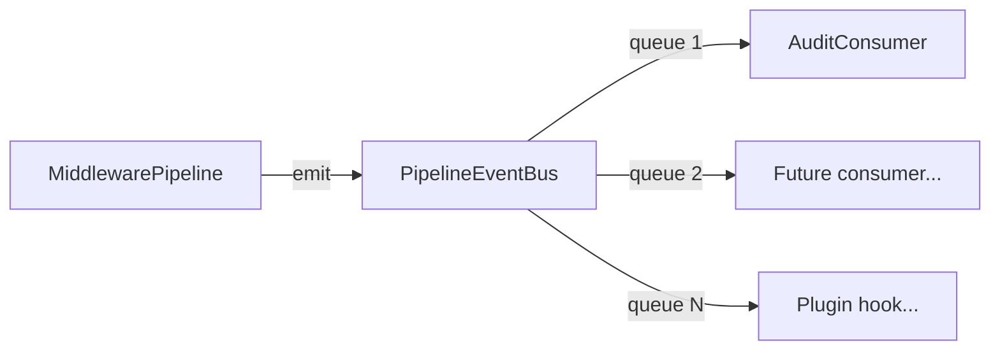
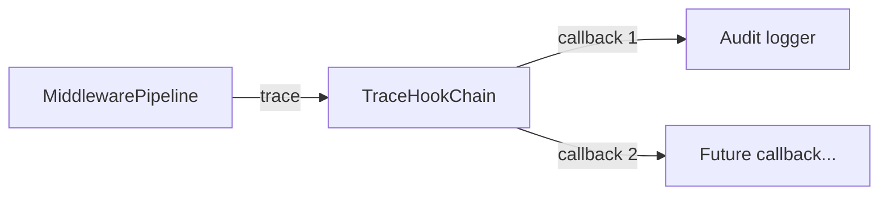

## Source

GitHub issue #432 — "feat(hub): event bus for pipeline telemetry, audit & plugin hooks". Motivated by #431 (middleware chain) creating well-defined middleware seams with no structured way to observe them.

## Problem

The middleware pipeline (#431) processes messages through 6 sequential stages, each with clear entry/exit points. Today, the only observability at these seams is `TraceHook` — a single synchronous callback (`Callable[..., None]`) that's not even wired in production (`hub.py:285` builds the pipeline without a trace_hook). Debugging "why was this message dropped?" requires grepping unstructured logs. There's no way for external code to react to pipeline decisions without coupling directly to middleware internals.

An EventBus was previously built (PR #260, issue #44) and removed in the simplification audit (ADR-025 F-10) because its only downstream effect was log messages — `EventAggregator` consumed events and called `log.info`/`log.warning`. The singleton pattern (`get_event_bus()`) also created a hidden dependency on Hub initialization order. ADR-025 F-10 set a clear reintroduction condition: "when a real monitoring consumer (SSE, metrics, alerting) is needed, reintroduce the bus with DI instead of a singleton."

This implementation meets that bar: `AuditConsumer` produces structured JSON audit trails (not just log-level deduplication), and the bus is designed from day one for the concrete consumers listed in #432 (pipeline metrics #274, real-time dashboard SSE #337, trace propagation #270). The bus uses constructor injection (no singleton), addressing ADR-025's DI requirement directly. Note: `events.py` (56 LOC of monitoring event dataclasses from the old bus) still exists with no active consumers — the new `pipeline_events.py` is a separate hierarchy scoped to pipeline telemetry, not a replacement for monitoring events.

## Outcome

Pipeline events are observable as typed, structured data at every middleware seam. An audit logger runs as the first consumer, producing structured JSON traces for debugging. The bus is injectable (not a global singleton), fire-and-forget (never blocks the pipeline), and extensible (new consumers — including external plugin code — subscribe without touching middleware internals). Zero behaviour change to message processing. The bus does introduce a new long-running task in `run_lifecycle()` (AuditConsumer), adding a startup/teardown surface — but this follows the same task pattern used by hub, audio pipeline, and health server.

## Appetite

1-week cycle. Core implementation is ~150 LOC across 3 new files + ~20 LOC of wiring changes. For calibration: `middleware.py` (the pipeline runner from #431) is 143 LOC; the new files are comparable in density — event dataclasses (~40 LOC), bus (~30 LOC), audit consumer (~30 LOC), plus tests (~50 LOC).

## Shapes

### Shape 1: Typed EventBus with per-subscriber queues (issue's design)

New `PipelineEventBus` class with `asyncio.Queue` fan-out per subscriber. Typed frozen dataclasses for events (`MessageReceived`, `StageCompleted`, `MessageDropped`, etc.). Bus is injected into `MiddlewarePipeline` via constructor, emits at each middleware seam. `AuditConsumer` subscribes and logs structured JSON.

**Trade-offs:**
- Pro: Type-safe events — each event is a frozen dataclass with explicit fields, making consumers self-documenting
- Pro: Per-subscriber queues with `put_nowait` — slow consumers are isolated, pipeline never blocks
- Pro: Clean injection via constructor — no global singleton (ADR-022 lesson learned)
- Pro: Matches the issue's design exactly — no interpretation gap
- Con: New abstraction layer (bus + event hierarchy) — more files to maintain
- Con: Subscriber queues accumulate if consumer is slow; `QueueFull` drops events. Mitigated by: (a) configurable `maxsize` per subscriber (default 1000), (b) `emit()` logs a warning counter on drop (not per-event — rate-limited to avoid log spam), (c) consumer task crash must be detected and logged by the bus or the `run_lifecycle()` task-done callback

**Rough scope:** M

### Shape 2: Evolve existing TraceHook into multi-subscriber fan-out

Instead of a new EventBus, extend the existing `TraceHook` (`message_pipeline.py:31`) to support multiple subscribers. Replace the single `Callable[..., None]` with a `TraceHookChain` that fans out to N callbacks. Keep the `(stage, event, **payload)` signature — no new dataclass hierarchy.

**Trade-offs:**
- Pro: Reuses existing infrastructure — TraceHook is already called at every decision point in both `MessagePipeline` and `MiddlewarePipeline`
- Pro: Zero new classes beyond `TraceHookChain` — minimal surface area
- Pro: Synchronous — no queue management, no async complexity
- Con: Untyped — `**payload` has no schema; consumers must guess/cast fields (regression from issue's typed events)
- Con: Synchronous — if a consumer does I/O (like the audit logger writing to a file), it blocks the pipeline
- Con: No backpressure — a slow synchronous consumer directly impacts pipeline latency
- Con: Doesn't match the issue's design — would need to justify divergence

**Rough scope:** S

### Shape 3: Middleware-emitting into a typed EventBus via the TraceHook bridge

Hybrid: keep the `TraceHook` signature as the emission interface, but wire it to a typed `PipelineEventBus` that converts `(stage, event, **payload)` into typed dataclasses and fans out asynchronously. The TraceHook becomes the bridge between the synchronous middleware world and the async consumer world.

**Trade-offs:**
- Pro: Reuses existing trace points — no need to modify middleware stages or `PipelineContext`
- Pro: Typed events on the consumer side — consumers work with dataclasses
- Pro: Bridge is synchronous (TraceHook contract) but bus is async — pipeline never blocks
- Con: Bridge layer adds indirection — must map `(stage, event, **payload)` to typed dataclasses (fragile string matching)
- Con: Two abstractions to understand (TraceHook + EventBus) — cognitive overhead
- Con: TraceHook points fundamentally cannot express `StageCompleted` — it requires `duration_ms` (elapsed time across a middleware stage), but TraceHook fires at discrete points with no timing context. The bridge would need to track start/end times itself, duplicating the timing logic that belongs in the pipeline runner. This is not just a naming mismatch — it's a data incompatibility that makes Shape 3 unable to fully satisfy the Outcome without also modifying middleware stages (defeating the "reuse existing trace points" advantage)

**Rough scope:** M

## Fit Check

**Shape 1 is the clear fit.** It matches the issue's design, satisfies all constraints (fire-and-forget, injectable, backpressure via drop), and produces clean typed events that consumers can rely on. The extra files (~3 new) are justified by the typed contract.

**Shape 2 is eliminated** because synchronous fan-out violates the "never block the pipeline" constraint. The audit logger needs async I/O (structured logging with potential file writes), and even if the stdlib logger is synchronous today, future consumers (dashboard SSE, metrics export) require async.

**Shape 3 is eliminated** for two reasons. First, the bridge layer is fragile — `(stage, event, **payload)` → typed dataclass mapping requires string matching on stage/event names, which breaks silently on rename. Second, and more fundamentally, TraceHook lacks the data needed for key events: `StageCompleted` requires `duration_ms` (elapsed time spanning an entire middleware stage), which TraceHook's fire-at-a-point model cannot express. The bridge would need its own timing logic, defeating the "reuse existing trace points" advantage.

### Key codebase findings

| Finding | Implication |
|---------|------------|
| `Hub.run()` builds pipeline without `trace_hook` | TraceHook is unused in production — bus coexists. TraceHook remains the test/debug instrumentation path; EventBus is the production observability path. Future contributors should add pipeline observability via events, not trace hooks |
| `MiddlewarePipeline.__init__` already accepts `trace_hook` param | Injection point exists — add `event_bus` as second optional param |
| `PipelineContext.trace()` is synchronous, called at every decision point | Existing trace points document where events should be emitted — use as guide |
| `build_default_pipeline()` is the only pipeline factory | Single place to thread the bus through |
| `run_lifecycle()` creates tasks for hub, audio, health, adapters | AuditConsumer task wires in here — same pattern as existing tasks |
| `message_pipeline.py` has both `MessagePipeline` (old) and `middleware.py` has `MiddlewarePipeline` (new, #431) | Events should be emitted from `MiddlewarePipeline` only — the old class is kept for compatibility but the new one drives routing |
| ADR-025 F-10 removed the old EventBus singleton; `events.py` (monitoring dataclasses) still exists with no consumers | New `pipeline_events.py` is a separate hierarchy scoped to pipeline telemetry. Old `events.py` is untouched — cleanup is a separate concern |
| `_log_task_failure` callback in `multibot_wiring.py` used for Discord tasks | Same pattern should be applied to AuditConsumer task for crash detection |

### Files impacted

| File | Change |
|------|--------|
| `src/lyra/core/hub/pipeline_events.py` | **New** — frozen dataclass event hierarchy |
| `src/lyra/core/hub/event_bus.py` | **New** — `PipelineEventBus` with fan-out queues |
| `src/lyra/core/hub/audit_consumer.py` | **New** — structured JSON audit logger |
| `src/lyra/core/hub/middleware.py` | Add `event_bus` param to `MiddlewarePipeline` + `build_default_pipeline()`. Emit events at middleware seam boundaries: before first stage (`MessageReceived`), after each stage completes/short-circuits (`StageCompleted`/`MessageDropped`), after terminal stage (`PoolSubmitted`/`ResponseReady`) |
| `src/lyra/core/hub/hub.py` | Accept optional `PipelineEventBus` in `Hub.__init__`, pass to `build_default_pipeline()` in `run()` |
| `src/lyra/bootstrap/multibot_wiring.py` | Wire bus + audit consumer in `run_lifecycle()` |
| `tests/core/test_pipeline_event_bus.py` | **New** — bus + consumer tests |
