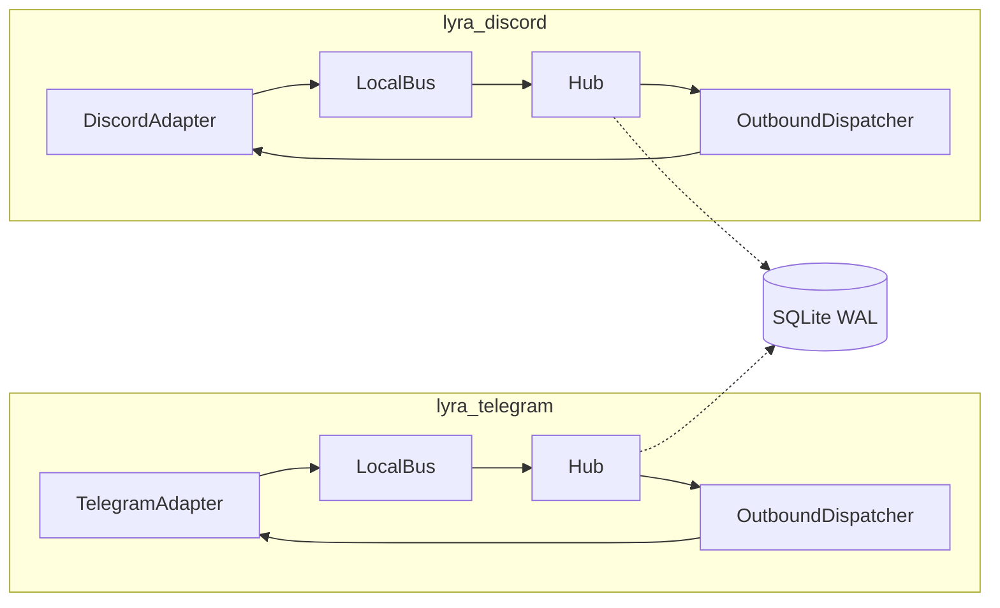
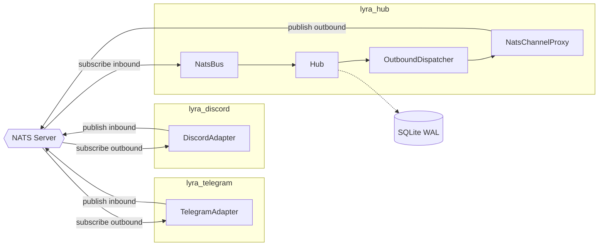

## Source

Epic #445 Slice C4 — extract Hub into a standalone process communicating with adapters via NatsBus. Blockers #455 (NatsBus) and #456 (trust re-resolution) are merged. Proactive: no bottleneck yet, but the path is clear.

## Problem

> **C4 scope:** This issue delivers the standalone `lyra_hub` process only. Adapters remain embedded (their own Hub + LocalBus) until C5 (#458) rewires them. Between C4 merge and C5 merge, `lyra_hub` is testable but not used in production — adapters still embed their own Hub.

Hub is embedded per-adapter process (ADR-021 Phase 1b). Each `lyra_telegram` / `lyra_discord` process creates its own Hub instance with a `LocalBus`. This causes:

1. **State loss on adapter restart** — restarting an adapter destroys its Hub, killing all in-memory pools, conversation state, and in-flight messages. Users see repeated greetings and dropped responses.
2. **Resource duplication** — 2× Hub instances, each with its own pool registry, agent instances, memory manager, and SQLite connections.
3. **No cross-platform state** — pools are siloed per process. Future features (multi-agent orchestration #63, unified history) require a shared Hub.

### Current architecture (embedded)

### Target architecture (after C4+C5)

## Outcome

- `lyra hub` starts a standalone Hub process connected to NATS via NatsBus
- Hub reads inbound messages from NATS subjects, processes them through the existing pipeline, and publishes outbound messages back to NATS
- Embedded mode (`lyra start --adapter all`) continues to work with LocalBus — zero regression
- C4 is testable end-to-end: a test can publish an InboundMessage to NATS, the standalone Hub processes it, and the outbound appears on the correct NATS subject
- Adapters are NOT rewired — they keep their embedded Hub until C5

## Appetite

No hard deadline — ship when ready, quality over speed.

**Estimated scope:** ~200–300 LOC new code across 2 new files (`hub_standalone.py`, `nats_channel_proxy.py`), ~30 LOC modifications to existing files (`hub.py` constructor, `cli.py` command, lifecycle extraction). Plus integration tests (~150 LOC). Comparable to #455 (NatsBus, ~200 LOC core + ~300 LOC tests).

## Prior art: NatsBus implementation (#455)

The NatsBus implementation (#455, merged 2026-03-30) established patterns that constrain this work:

- **Subject naming:** `lyra.inbound.{platform.value}.{bot_id}` — outbound should mirror: `lyra.outbound.{platform.value}.{bot_id}`
- **Single `bot_id` per NatsBus instance:** `NatsBus.__init__(nc, bot_id, item_type)` binds to one `bot_id`. Multi-bot configs require one NatsBus per bot or a design extension (see Shape 1 key decisions).
- **Serialization:** `_serialize.py` handles dataclasses, Enums, datetime, bytes, nested types. Strips callables from dict fields (platform_meta pattern). Already tested against `InboundMessage`.
- **Register-before-start constraint:** `NatsBus.register()` raises `RuntimeError` after `start()`. Bootstrap must wire all platforms before calling `bus.start()`.
- **Staging queue:** single `asyncio.Queue` fed by all platform subscriptions — Hub.run() consumes from this queue identically to LocalBus.

## Shapes

### Shape 1: Bus Injection + NatsChannelProxy

**Core idea:** Make Hub accept an injected `Bus[T]` instead of hardcoding `LocalBus`. For outbound, create a `NatsChannelProxy` that implements the `ChannelAdapter` Protocol by publishing to NATS outbound subjects instead of calling platform SDKs.

**Changes:**

| File | Change |
|------|--------|
| `core/hub/hub.py` | Constructor accepts optional `inbound_bus: Bus[InboundMessage]` and `inbound_audio_bus: Bus[InboundAudio]`. Falls back to `LocalBus` when not provided (backward compat). |
| `nats/nats_channel_proxy.py` | New. Implements `ChannelAdapter` Protocol. `send()` serializes `OutboundMessage` → publishes to `lyra.outbound.{platform}.{bot_id}`. `send_streaming()` publishes `RenderEvent` chunks. |
| `bootstrap/hub_standalone.py` | New. Parallel to `multibot.py`. Creates `NatsBus`, `NatsChannelProxy` per platform, wires Hub, opens stores, runs lifecycle. No adapter SDK imports. |
| `cli.py` | New `lyra hub` command invoking standalone bootstrap. |
| `bootstrap/multibot_lifecycle.py` | Extract shared lifecycle logic (signal handling, health server, shutdown) into reusable helpers. Prerequisite for `hub_standalone.py` to avoid duplicating the watchdog/signal/teardown pattern. |

**Trade-offs:**
- Pro: Existing `OutboundDispatcher` works unchanged — it calls `adapter.send()` on the proxy.
- Pro: Hub class change is minimal (2 optional constructor params with backward-compatible defaults).
- Pro: `NatsChannelProxy` is a clean seam — easy to test in isolation.
- Pro: Embedded mode is completely unaffected (no bus arg = LocalBus, no proxy = real adapter).
- Con: `NatsChannelProxy.send_streaming()` must serialize `RenderEvent` async iterators over NATS — requires a streaming chunk sub-protocol (one NATS message per chunk, `done` flag).
- Con: Audio dispatch (`render_audio`, `render_audio_stream`, `render_voice_stream`) needs proxy methods. Can stub with logging + warning initially (audio over NATS is a C5/later concern).

**Rough scope:** L (~500 LOC including tests)

### Shape 2: Standalone Bootstrap with Outbound Bus

**Core idea:** Instead of proxying outbound through `ChannelAdapter`, introduce a symmetric `OutboundBus` concept. Hub publishes outbound messages to an `OutboundBus` (NatsBus for standalone, direct dispatch for embedded). This replaces `OutboundDispatcher` in standalone mode.

**Changes:**

| File | Change |
|------|--------|
| `core/hub/hub.py` | Constructor accepts `inbound_bus`, plus new `outbound_bus: OutboundBus | None`. When set, `dispatch_response()` publishes to outbound_bus instead of routing through OutboundDispatcher. |
| `core/outbound_bus.py` | New Protocol: `put(platform, bot_id, outbound)`. `NatsOutboundBus` publishes to `lyra.outbound.{platform}.{bot_id}`. |
| `core/hub/hub_outbound.py` | All `dispatch_*` methods gain a branch: if `outbound_bus` set, serialize and publish. Affects `dispatch_response`, `dispatch_streaming`, `dispatch_audio`, `dispatch_audio_stream`, `dispatch_voice_stream`, `dispatch_attachment` (6 methods). |
| `bootstrap/hub_standalone.py` | New. Creates NatsBus (inbound) + NatsOutboundBus (outbound), wires Hub. |
| `cli.py` | New `lyra hub` command. |

**Trade-offs:**
- Pro: Symmetric design — inbound and outbound both go through Bus abstractions.
- Pro: No fake adapter objects — cleaner conceptually.
- Con: Conditional branching in 6 `dispatch_*` methods in `hub_outbound.py`.
- Con: Breaks the current "OutboundDispatcher owns circuit breaker + retry" guarantee — standalone Hub loses retry/CB logic on outbound unless OutboundBus reimplements it.
- Con: OutboundDispatcher's scope locking, retry, circuit breaker logic is valuable and tested. Bypassing it means reimplementing or losing it.
- Con: Streaming dispatch (async iterators) over an OutboundBus adds the same serialization complexity as Shape 1 but without reusing OutboundDispatcher.

**Rough scope:** XL (~800+ LOC — reimplementing retry/CB in OutboundBus)

### Shape 3: Hub Mode Enum (Embedded vs Standalone)

**Core idea:** Add a `HubMode` enum. Hub constructor takes a `mode` parameter. In `EMBEDDED` mode, creates LocalBus internally (current behavior). In `STANDALONE` mode, requires NatsBus and NatsChannelProxy injection. Mode-conditional logic in constructor only — runtime paths converge.

**Changes:** Same files as Shape 1, plus a `HubMode` enum in `hub.py`. Constructor branches on mode to determine bus creation vs injection.

**Trade-offs:**
- Pro: Explicit mode makes the intent clear in code.
- Con: Mode enums tend to accumulate conditional logic over time.
- Con: Same implementation as Shape 1 with extra ceremony — the enum adds no real value since the mode is determined by which bootstrap path creates the Hub.
- Con: Hub shouldn't know about "modes" — it should be mode-agnostic, operating on injected dependencies.

**Rough scope:** L (same as Shape 1 with slight overhead)

## Fit Check

**Shape 1 (Bus Injection + NatsChannelProxy) is the best fit.** Rationale:

1. **Minimal Hub changes** — 2 optional constructor params with backward-compatible defaults. Hub remains mode-agnostic. No conditional branching in runtime paths.

2. **Reuses OutboundDispatcher** — the existing retry, circuit breaker, scope locking, and queue logic all work unchanged. The proxy is just a different `ChannelAdapter` implementation. This is a significant advantage over Shape 2, which loses all that battle-tested logic.

3. **Protocol-driven** — `NatsChannelProxy` satisfies `ChannelAdapter` Protocol structurally. No inheritance, no mode flags, no conditional dispatch. Clean dependency injection.

4. **Testable** — standalone Hub can be tested with a mock NATS connection. NatsChannelProxy can be tested in isolation. Integration test: publish InboundMessage to NATS → verify OutboundMessage appears on outbound subject.

5. **Shape 2 eliminated** — too invasive. Conditional branching in 6 dispatch methods, loses OutboundDispatcher guarantees, and the OutboundBus abstraction adds complexity without reusing existing tested code.

6. **Shape 3 eliminated** — identical to Shape 1 in implementation but adds an unnecessary mode enum. Hub shouldn't be mode-aware.

### Key design decisions for Shape 1

1. **NATS subject naming (outbound):** `NatsChannelProxy.send()` publishes to `lyra.outbound.{platform.value}.{bot_id}`. Mirrors the inbound convention from NatsBus (#455). Streaming uses `lyra.outbound.stream.{platform.value}.{bot_id}.{msg_id}` with envelope `{seq, event_type, payload, done}`. Receiver (future C5 adapter) reassembles into `AsyncIterator[RenderEvent]`.

2. **Audio methods:** Stub with logging + warning in C4. `render_audio()`, `render_audio_stream()`, `render_voice_stream()` log a warning and return (no `NotImplementedError` — Hub must not crash). Full audio-over-NATS is a C5 concern.

3. **Multi-bot `bot_id` granularity:** `NatsBus` takes one `bot_id` at construction, subscribing to `lyra.inbound.{platform}.{bot_id}`. A multi-bot standalone Hub (2 Telegram bots + 1 Discord bot) needs multiple subscription paths. Two options: **(a)** one shared `NatsBus` that accepts multiple `register(platform, bot_id)` calls — requires extending `NatsBus` to key subscriptions by `(platform, bot_id)` instead of just `platform`; **(b)** one `NatsBus` per `bot_id`, all fanning into a shared staging queue. Option (a) is cleaner — a single bus, one staging queue, and the subscription key change is small. **Decision deferred to spec.**

4. **`_on_dispatched` callback loss:** `OutboundMessage.metadata` may contain `_on_dispatched` (a callable used for reply-threading). `_serialize.py` strips callables on serialization. In standalone mode, `OutboundDispatcher` fires the callback after `NatsChannelProxy.send()` returns (NATS publish success) — not after actual platform delivery. This means `reply_message_id` is written back on Hub-side publish, not on adapter-side send. Acceptable for C4; C5 must implement a callback-over-NATS mechanism for correct reply-threading.

5. **Iterator drain on failure:** `NatsChannelProxy.send_streaming()` must drain the `AsyncIterator[RenderEvent]` on NATS publish failure (same pattern as `OutboundDispatcher._dispatch_item` lines 294-296). Prevents generator leaks. Log the error; do not re-raise.

6. **Register-before-start ordering:** `hub_standalone.py` must call `hub.register_adapter()` (which calls `bus.register()`) before `bus.start()`. NatsBus raises `RuntimeError` if `register()` is called after `start()`. Same ordering exists in embedded mode (`multibot_lifecycle.py` starts buses after all wiring).

7. **InboundAudio bus:** In C4, use a `LocalBus` for `inbound_audio_bus` (not NatsBus). No audio publisher exists on NATS yet. The LocalBus idles harmlessly with no registered platforms. Audio-over-NATS is a C5 concern.

8. **Stores:** Standalone Hub opens the same SQLite stores (auth.db, config.db, turns.db, etc.) with WAL mode. Same vault_dir. No store changes needed.

9. **Health server:** Standalone Hub runs the same health endpoint. When no adapters are connected (C4-C5 window), health should report `"adapters": 0` so operators can distinguish "Hub running, no adapters connected" from "Hub broken."

10. **Lifecycle extraction:** `multibot_lifecycle.py` refactor (extract signal handling, watchdog, teardown) is a prerequisite for `hub_standalone.py` — not a side-task. Without it, `hub_standalone.py` duplicates ~40 lines of lifecycle boilerplate.

### Files impacted

| File | Impact | Notes |
|------|--------|-------|
| `core/hub/hub.py` | Modify | Accept optional `inbound_bus` + `inbound_audio_bus` injection |
| `nats/nats_channel_proxy.py` | New | `ChannelAdapter` impl publishing to NATS outbound subjects |
| `bootstrap/hub_standalone.py` | New | Standalone Hub bootstrap (parallel to multibot.py) |
| `cli.py` | Modify | Add `lyra hub` subcommand |
| `bootstrap/multibot_lifecycle.py` | Refactor | Extract reusable lifecycle helpers (signal handling, shutdown) |
| `nats/nats_bus.py` | Possibly modify | Extend `register()` for multi-bot `(platform, bot_id)` keying |
| `nats/_serialize.py` | Possibly modify | Ensure OutboundMessage + RenderEvent serialization works |
| `config.py` or `config.toml` | Minor | Standalone Hub config section (NATS URL, subjects prefix) |

### Risks

| Risk | Impact | Mitigation |
|------|--------|------------|
| Multi-bot NatsBus — single `bot_id` doesn't fit multi-bot configs | Standalone Hub can't serve multiple bots | Extend NatsBus to key subscriptions by (platform, bot_id); decision in spec |
| Streaming RenderEvent serialization (async iterators over NATS) | Outbound streaming broken in standalone mode | Prototype chunk protocol early; fallback to buffered non-streaming send |
| `_on_dispatched` callback fires on NATS publish, not platform delivery | Reply-threading writes `reply_message_id` too early | Acceptable for C4; C5 must implement callback-over-NATS |
| Audio dispatch not implemented in proxy | Audio features silent in standalone mode | Explicit stub + warning log; audio-over-NATS is C5 scope |
| C4-C5 window: operator starts `lyra_hub` alongside embedded adapters | Idle Hub, adapters use their own embedded Hub — could be mistaken for broken deployment | Health endpoint reports `"adapters": 0`; document that `lyra_hub` is inert until C5 |
| SQLite WAL concurrent access from embedded + standalone Hub | DB corruption if both run on same vault_dir simultaneously | Startup lockfile check (`~/.lyra/hub.lock`) — refuse to start if lock held by another Hub process |
| Hub constructor signature change breaks tests | Test failures | Default params preserve backward compat; existing tests pass without changes |
| Lifecycle refactor blocks `hub_standalone.py` | Can't write standalone bootstrap without duplicating code | Do lifecycle extraction first as a preparatory commit |
