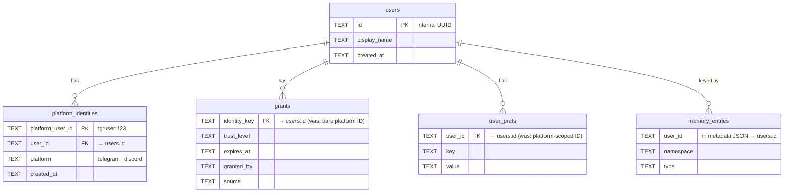
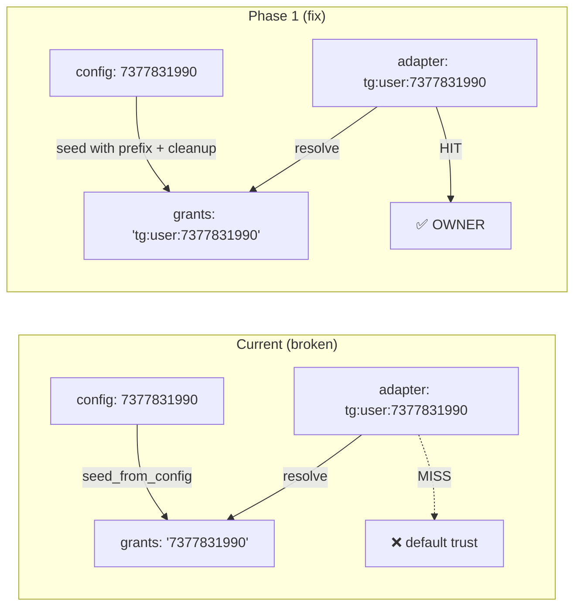
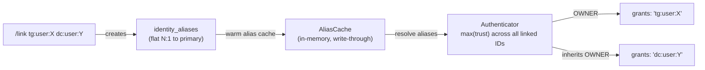

## Source

Issue #472 — triggered by commit `96ac94b` (C3 — trust re-resolution on Hub side, #456). Owner's trust grant is missed because `seed_from_config()` stores bare IDs (`"7377831990"`) while Hub-side resolution receives prefixed IDs (`"tg:user:7377831990"`) from adapters. The actual outcome depends on the bot's `default` config: if `default = "blocked"` (production config), the owner is hard-blocked; if `default = "public"`, the owner gets degraded public access but loses OWNER privileges.

## Problem

Two distinct problems with different urgencies:

### Problem 1: C3 trust regression (P0 — production broken)

`seed_from_config()` (`auth_store.py:141-178`) stores bare numeric IDs from config: `"7377831990"`. After C3 moved auth to the Hub, adapters send prefixed IDs: `"tg:user:7377831990"`. `AuthStore.check()` does exact string match — cache miss — falls to the bot's configured default trust level.

The `is_admin` check works correctly by design: `[admin].user_ids` stores prefixed IDs (`"tg:user:7377831990"`), enforced by `_ADMIN_ID_PATTERN` (`config.py:208`), and `authenticator.resolve()` compares against these directly. But the stored OWNER grant in `auth.db` is invisible.

### Problem 2: Identity fragmentation (P1 — foundational gap)

Even with consistent ID formatting, Lyra has no concept of "a person." Each platform identity is standalone:

| Store | Key format | Scope | Impact |
|-------|-----------|-------|--------|
| `grants` (auth.db) | Bare IDs from config seed | Per platform-bot | Trust doesn't follow users cross-platform |
| `user_prefs` (config.db) | Prefixed (`tg:user:X`) | Per platform identity | Prefs invisible across platforms |
| Memory entries (roxabi-vault) | Prefixed in `metadata.user_id` | Per agent namespace + user | Conversation context siloed |
| Pool routing | `pool_id` embeds prefixed `user_id` in groups | Per scope | Group pools user-scoped correctly, but no cross-platform link |

**Downstream consumers of `msg.user_id`:**
- `ResolveTrustMiddleware` → `authenticator.resolve(uid)` → `auth_store.check(uid)` — **broken by P1**
- `RateLimitMiddleware` → keys by `RoutingKey(platform, bot_id, scope_id)` — not affected by C3
- `Pool.append()` → captures `user_id` on first message — not affected by C3 (consistent within platform)
- `SessionSnapshot.user_id` → flows to all memory writes — not affected by C3 (consistent within platform)
- `AudioPipeline` → `prefs_store.get_prefs(msg.user_id)` — not affected by C3 (consistent within platform)
- `PoolManager` → TTL eviction, session flush — uses `pool_id`, not `user_id` directly

## Outcome

What success looks like:

1. Owner can message Lyra on both Telegram and Discord and be recognized as OWNER
2. Same person on N platforms has one trust level, one set of prefs, and one memory context — regardless of which platform they use
3. Config seeding produces correct grants for all platforms without requiring operators to know prefixed ID format
4. Existing data in auth.db, config.db, and roxabi-vault is preserved through migration

## Appetite

2-week cycle, delivered as a single pass (all 3 phases in one PR). Tier F-full — seed fix, alias table, `/link` command, prefs/memory alias resolution all ship together.

## Shapes

### Shape 1: Prefix-at-Seed (minimal fix)

Fix `seed_from_config()` to prefix IDs using the section name: `"telegram"` → `"tg:user:"`, `"discord"` → `"dc:user:"`. All stores continue to key by platform-prefixed ID. No new tables, no cross-platform linking. This shape also serves as Phase 1 of Shape 3.

**Migration note:** The SQL conflict guard in `seed_from_config()` (`WHERE grants.expires_at IS NOT NULL`) means permanent grants (seeded with `expires_at=NULL`) are never overwritten by subsequent seeds. A re-seed with prefixed IDs will insert new rows but leave stale bare-ID rows in place. Phase 1 must include a one-time cleanup: delete grants where `identity_key` lacks a platform prefix.

**Trade-offs:**
- Pro: Smallest change (~20 lines + cleanup migration), fixes the C3 regression immediately
- Pro: Zero risk to prefs, memory, pool routing
- Con: Trust still fragmented — OWNER on Telegram ≠ OWNER on Discord (separate grants)
- Con: Prefs and memory remain siloed — no cross-platform continuity
- Con: Doesn't address Problem 2 — kicks it down the road to C4/memory work

**Rough scope:** S — 1 file changed, 1 cleanup migration, tests

### Shape 2: Internal User ID (full identity layer)

New `users` table (internal UUID) + `platform_identities` table (N:1 mapping). All stores re-keyed by internal user ID. Config seeding creates user + platform identity. `/link` command for self-service cross-platform linking.

**Resolution protocol:** Every `msg.user_id` (platform-prefixed) is resolved to an internal user ID before reaching any store. New `IdentityResolver` sits in middleware or as a Hub service.

**Trade-offs:**
- Pro: Solves the full problem — one person, one trust level, one set of prefs, one memory
- Pro: Clean foundation for NATS (C4) — internal ID is transport-agnostic
- Pro: Config stays simple (`owner_users = [123]`) — seeding creates the full mapping
- Pro: `/link` enables users to unify their identities across platforms
- Con: Large scope — touches auth_store, prefs_store, memory, pool, middleware, config seeding
- Con: Migration complexity — existing platform-keyed data needs re-keyed (3 stores + roxabi-vault metadata JSON)
- Con: Memory migration is non-trivial — `json_extract(metadata, '$.user_id')` queries embedded in SQL
- Con: Risk of subtle bugs during transition (dual-key period)
- Con: Overkill if the only active user is the owner on 2 platforms

**Rough scope:** L — 15+ files, 3 store migrations, new middleware, new CLI command, new tables

### Shape 3: Platform-Prefixed Keys + Alias Table (incremental)

Fix seed to use prefixed IDs (like Shape 1). Add a lightweight `identity_aliases` table that maps platform IDs to a "primary" identity (flat N:1, no transitive chains — prevents alias cycles by design). Stores remain keyed by platform-prefixed ID, but lookups go through an alias resolution layer that can return "all IDs for this person."

**Phase 1 — Fix seed + prefix (days 1-2):**

Immediate C3 fix. Trust works per-platform. Includes cleanup migration for stale bare-ID rows.

**Phase 2 — Alias table + `/link` command (days 3-7):**

Alias table + `/link` command. Trust cascades: highest trust wins across linked identities (with BLOCKED exception — see unresolved concerns). Alias cache warmed at startup, write-through on `/link`.

**Phase 3 — Prefs and memory alias resolution (days 8-10):**

Prefs and memory queries expand to cover all linked identities: resolve all platform IDs linked to the requesting user, then union-query across them. For prefs, this adds one alias cache lookup (in-memory, no I/O) per `get_prefs()`. For memory, `recall()` expands `json_extract(metadata,'$.user_id')=?` to `IN (?, ?, ...)` covering all aliases, and `concept_namespace` (`f"{namespace}:{user_id}"`) queries are issued for each alias and merged in Python.

**Key technical constraint:** `AuthStore.check()` is synchronous (pure cache read, no I/O). Alias resolution must not break this contract. Solution: `IdentityStore` warms an alias cache at `connect()` time (parallel to `AuthStore._warm_cache()`), and `/link` writes through to both DB and live cache — matching the existing `AuthStore.upsert()` pattern.

**Trade-offs:**
- Pro: Sliceable — Phase 1 ships immediately, Phases 2-3 are additive
- Pro: No existing store schema changes (aliases are a new table, not a migration)
- Pro: Prefs and memory continue working as-is until Phase 3
- Pro: Config stays simple — seed layer adds prefixes
- Pro: Alias resolution is a thin in-memory lookup — at current scale (1 owner, 2 platforms), the alias table has ~2 rows; performance concern is negligible
- Con: Alias table is an indirection layer — queries become "get all aliases for X, check each"
- Con: Trust cascade logic needs careful design (BLOCKED escalation — see unresolved concerns)
- Con: Phase 3 memory expansion interacts with FTS5 namespace keying in roxabi-vault — `concept_namespace` is `"{ns}:{user_id}"`, so cross-alias concept sharing requires multiple searches merged in Python
- Con: Not as clean as Shape 2 — platform-prefixed IDs remain the primary key forever
- Con: `is_admin` check (`authenticator.py:143`) is not alias-aware — secondary platform ID gets OWNER trust via alias cascade but `is_admin=False` unless explicitly added to `[admin].user_ids`. Phase 2 must address this.

**Rough scope:** M — Phase 1: S, Phase 2: M (new table + command + resolution + admin alias), Phase 3: M (prefs + memory alias lookup)

## Files Impacted

| File | Domain | Shape 1 | Shape 2 | Shape 3 |
|------|--------|---------|---------|---------|
| `core/stores/auth_store.py` | Auth | ✓ seed fix + bare-ID cleanup | ✓ re-key to internal ID | P1: seed fix + bare-ID cleanup, P2: alias-aware resolve |
| `core/authenticator.py` | Auth | — | ✓ resolve via internal ID | ✓ alias-aware resolve |
| `core/stores/prefs_store.py` | Prefs | — | ✓ re-key to internal ID | Phase 3: alias lookup |
| `core/memory.py` | Memory | — | ✓ re-key to internal ID | Phase 3: alias lookup |
| `core/memory_upserts.py` | Memory | — | ✓ re-key to internal ID | Phase 3: alias lookup |
| `core/hub/hub.py` | Hub | — | ✓ identity resolution middleware | ✓ alias resolution hook |
| `core/hub/middleware_stages.py` | Hub | — | ✓ new IdentityMiddleware | — |
| `core/message.py` | Message | — | ✓ add `internal_user_id` field | — |
| `core/pool/pool.py` | Pool | — | ✓ capture internal ID | — |
| `bootstrap/multibot.py` | Bootstrap | ✓ seed call | ✓ seed + user creation | ✓ seed call |
| `bootstrap/multibot_wiring.py` | Bootstrap | — | ✓ wire identity resolver | — |
| `config.py` | Config | — | — | — |
| `core/identity.py` | Identity | — | ✓ extend with internal ID | — |
| `core/stores/identity_store.py` | Identity | — | ✓ new file | ✓ new file (alias table) |
| `commands/link_command.py` | Commands | — | ✓ new file | ✓ new file (Phase 2) |

## Fit Check

**Shape 1 (Prefix-at-Seed)** solves Problem 1 (C3 regression) completely but leaves Problem 2 (identity fragmentation) untouched. It is the correct **first slice** regardless of which full shape we pick — Shape 3 Phase 1 is identical to Shape 1.

**Shape 2 (Internal User ID)** is the architecturally clean solution but oversized for a 2-week cycle. The migration across 3 stores (especially roxabi-vault metadata JSON) carries real risk. The internal UUID also means every downstream consumer must change from `msg.user_id` to `msg.internal_user_id` — a blast radius that touches pool routing, session lifecycle, memory, and prefs. With a single active user on 2 platforms, this is premature. For NATS compatibility: Shape 2's internal UUID would be slightly cleaner for distributed identity resolution, but Shape 3's alias model composes identically — alias resolution happens at the Hub before messages hit the bus, so NatsBus consumers see the same resolved trust regardless of approach.

**Shape 3 (Prefixed Keys + Alias Table)** fits the constraints:
- **Sliceable:** Phase 1 (auth fix) ships in 1-2 days — unblocks production
- **Incremental:** Phases 2-3 add cross-platform linking without re-keying existing stores
- **Backward-compatible:** No schema migrations for existing tables — aliases are additive
- **NATS-compatible:** Alias resolution happens Hub-side before bus dispatch; platform-prefixed IDs work the same over LocalBus and NatsBus
- **Scale-appropriate:** At current scale (1 owner, 2 platforms), alias table has ~2 rows — performance concerns are negligible
- **Appetite:** Phase 1 = S, Phase 2 = M, Phase 3 = M — fits within 2-week cycle

**Recommended: Shape 3** with Phase 1 as the critical first slice.

**Unresolved concerns (must resolve in spec):**
1. **Trust cascade with BLOCKED identities:** "Highest trust wins" is the proposal for OWNER vs TRUSTED. But if `tg:user:X` is explicitly BLOCKED and `dc:user:Y` is TRUSTED, max-wins would un-block the user via their Discord identity — an escalation path. Two options: (a) prevent `/link` when either side is BLOCKED, or (b) exclude BLOCKED from max-wins (BLOCKED identity doesn't contribute to the max, but doesn't suppress it from other identities). This is a security decision — recommend option (a) for simplicity. Must be encoded in spec acceptance criteria.
2. **`is_admin` alias awareness:** `authenticator.py:143` checks `user_id in _admin_user_ids` by exact match. After Phase 2 alias linking, a user's secondary platform ID gets OWNER trust via alias cascade but `is_admin=False` unless that specific platform ID is in `[admin].user_ids`. Phase 2 must either make the admin check alias-aware or document that `[admin].user_ids` must list all platform IDs explicitly.
3. **Memory alias expansion (Phase 3):** roxabi-vault stores `user_id` in metadata JSON and uses `concept_namespace = f"{ns}:{user_id}"` for FTS5 scoping. Cross-alias memory sharing requires multiple namespace queries merged in Python. This is implementable but more complex than a simple `IN` clause — must be designed explicitly in the Phase 3 spec.
4. **Bus flooding:** After C3, blocked users consume bus queue slots before `TrustGuardMiddleware` filters them. Phase 1 fixes the trust check so legitimate users aren't blocked, but doesn't add pre-Bus filtering. Current mitigation: bounded per-platform queues (100/platform) + staging queue (500) + rate limiting already implemented in `RateLimitMiddleware`. This is sufficient for the solo-user scenario. If abuse becomes observable in production, a lightweight adapter-side blocklist (platform ID set, no auth logic) can be added as a follow-up — not part of this cycle.
