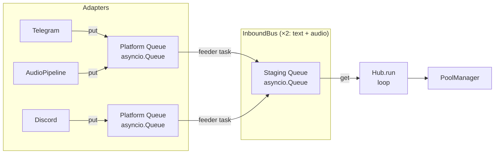

## Source

GitHub issue #48: "feat: Bus abstraction — extract LocalBus/NatsBus interface from asyncio.Queue"
Part of Phase 2 NATS introduction (#60), blocks #50 (NatsBus).

## Problem

Hub and adapters depend directly on `InboundBus` (a concrete class backed by `asyncio.Queue`) for inbound message routing. Swapping to distributed messaging (NATS) requires changing every call site. There is no interface contract — only a concrete implementation.

The contract boundary was never enforced: `Hub.bus` (line 129) returns the raw `asyncio.Queue[InboundMessage]` staging queue, bypassing the per-platform queue layer entirely. This leaked internal is used in 16 call sites across 9 test files plus `demo.py` as the primary injection point (`hub.bus.put(msg)`, `hub.bus.empty()`). The leak is evidence that the abstraction boundary doesn't exist — tests depend on the implementation, not an interface.

**Current topology (discovered):**



Hub owns **two** `InboundBus` instances — `inbound_bus: InboundBus[InboundMessage]` (text) and `inbound_audio_bus: InboundBus[InboundAudio]` (audio). Both share the same class, differing only in their generic type parameter.

**Key call sites (8 files, production):**

| File | Usage | Bus |
|------|-------|----|
| `hub/hub.py:86-95` | Creates both `InboundBus` instances | text + audio |
| `hub/hub.py:129-130` | `bus` property leaks raw `_staging` queue | text |
| `hub/hub.py:168-173` | `register_adapter()` → `.register()` on both buses | text + audio |
| `hub/hub.py:287,296` | `run()` → `.get()` + `.task_done()` | text |
| `adapters/_shared.py:97-98` | `push_to_hub_guarded()` → `.put(platform, msg)` | text |
| `audio_pipeline.py:255` | Re-enqueues transcribed audio → `.put()` | text (re-enqueue) |
| `bootstrap/multibot_wiring.py:213,270` | Lifecycle `.start()` / `.stop()` | text + audio |
| `bootstrap/health.py:55` | `.registered_platforms()` | text |

**Test call sites (16 calls, 9 files) via `hub.bus`:**

| Pattern | Count | Files |
|---------|-------|-------|
| `hub.bus.put(msg)` | 14 | test_hub_routing, test_hub_circuit_streaming, test_hub_circuit_fast_fail, test_hub_tts_dispatch, test_command_router_detection, test_command_router_special, test_hub_streaming, test_message_pipeline_guards, test_health_endpoint_status |
| `hub.bus.empty()` | 2 | test_hub_routing |
| `hub.bus.put()` + `.join()` | 2 | demo.py |

## Outcome

Hub is decoupled from its queue implementation. The inbound message path can be replaced without modifying Hub internals or any adapter call site. Both text and audio buses conform to the same generic interface. NatsBus (#50) can be implemented against that interface independently.

## Appetite

**M** — Protocol extraction and rename only. Config toggle and NatsBus are deferred to #50.

## Shapes

### Shape 1: Protocol over existing API (thin wrap)

Rename `InboundBus` → `LocalBus`. Extract a `Bus[T]` Protocol matching the current surface:

```python
class Bus(Protocol[T]):
    def register(self, platform: Platform, maxsize: int = 100) -> None: ...
    def put(self, platform: Platform, item: T) -> None: ...
    async def get(self) -> T: ...
    def task_done(self) -> None: ...
    async def start(self) -> None: ...
    async def stop(self) -> None: ...
    def qsize(self, platform: Platform) -> int: ...
    def staging_qsize(self) -> int: ...
    def registered_platforms(self) -> frozenset[Platform]: ...
```

Hub types to `Bus[InboundMessage]` and `Bus[InboundAudio]` instead of concrete `InboundBus[T]`. `inbound_audio_bus.py` requires no change — it's a thin alias over `InboundBus[InboundAudio]` which becomes `LocalBus[InboundAudio]`.

**Trade-offs:**
- Pro: Minimal blast radius (~8 production files), zero regression risk, preserves all backpressure semantics
- Pro: Follows existing project patterns (Protocol-based, like `ChannelAdapter`, `PoolContext`, `Guard`)
- Pro: `Bus[T]` is generic — covers both text and audio bus instances with one Protocol
- Con: `put()` is synchronous (`put_nowait` internally) — NatsBus (#50) publish is inherently async, forcing NatsBus to buffer locally or change the Protocol signature at that point
- Con: `platform`-aware API leaks local topology into the interface (NATS uses subjects for routing, not per-platform queues)

**Rough scope:** M

### Shape 2: NATS-native publish/subscribe Bus

Define Bus with NATS-style semantics as the issue body suggests:

```python
class Bus(ABC):
    async def publish(self, subject: str, data: bytes) -> None: ...
    async def subscribe(self, subject: str, queue: str, handler: Callable) -> None: ...
```

`LocalBus` internally maps subjects to `asyncio.Queue` instances. Hub.run() becomes handler-based instead of pull-loop.

**Trade-offs:**
- Pro: Clean NATS fit — NatsBus (#50) maps 1:1 to `nats.py` client
- Pro: Industry-standard messaging pattern
- Con: **Major refactor** — Hub.run() pull-loop must become push-based handler dispatch
- Con: Backpressure model changes fundamentally (queue-full → subject-level flow control)
- Con: `bytes` serialization requirement forces InboundMessage marshalling at every call site
- Con: Loses per-platform queue isolation that prevents cross-platform starvation
- Con: NATS subjects are string-keyed subscriptions — `Platform` as a first-class routing dimension has no structural equivalent, requiring synthetic subjects like `inbound.telegram`

**Rough scope:** XL

### Shape 3: Dual-layer — Transport protocol under InboundBus

Keep `InboundBus` as the Hub-facing layer (unchanged API). Introduce a lower-level `Transport` Protocol underneath:

```python
class Transport(Protocol[T]):
    async def send(self, channel: str, item: T) -> None: ...
    async def receive(self, channel: str) -> T: ...
    async def start(self) -> None: ...
    async def stop(self) -> None: ...
```

`LocalTransport` = asyncio.Queue (current behavior). `NatsTransport` = NATS subscription. InboundBus delegates to Transport for actual I/O while keeping its per-platform feeder topology.

**Trade-offs:**
- Pro: Hub code unchanged — InboundBus API stays identical
- Con: Extra indirection layer adds complexity for a problem that may not need it
- Con: Per-platform feeder tasks become redundant with NATS (NATS handles fan-in natively)
- Con: Two abstractions to maintain instead of one
- Con: `Transport.receive(channel)` still bakes a channel/platform concept into the lower layer — NATS uses subscription callbacks, not a per-channel receive loop, so the "clean NATS swap" promise is weaker than it appears

**Rough scope:** L

## Fit Check

**Shape 2 is eliminated.** The blast radius is XL — rewriting Hub.run() from pull to push, changing backpressure semantics, and adding serialization overhead contradicts the "zero regression" constraint. It's the right end-state for a full NATS migration but wrong for this step.

**Shape 3 is eliminated.** The dual-layer adds indirection that won't pay off — when NatsBus arrives (#50), the per-platform feeder topology in InboundBus becomes redundant anyway. The Transport interface also doesn't deliver on its NATS promise since NATS subscriptions are callback-based, not pull-based.

**Shape 1 is the fit.** It's a pure refactor with minimal blast radius. The Protocol matches existing patterns (`ChannelAdapter`, `PoolContext`). The sync `put` vs async NATS publish tension is real but deferred to #50 — when we know what NATS actually needs, we can evolve the Protocol with a concrete use case rather than speculating now.

### `Protocol[T]` typing note

`Protocol[T]` is valid Python 3.12+ and works with Pyright/mypy. `LocalBus` (currently `InboundBus`) already inherits `Generic[T]`, so structural matching works. One concern: `asyncio.Queue` is invariant in `T`, so the Protocol methods must exactly match the variance implied by usage. This is resolvable but needs verification during implementation.

### Decision: `hub.bus` property migration strategy

`hub.bus` returns raw `asyncio.Queue[InboundMessage]` and is used in 16 test call sites + `demo.py`. Two options:

1. **Keep as backward-compat shim** — `hub.bus` remains, returns `asyncio.Queue`, documented as deprecated. Tests unchanged. Protocol is clean.
2. **Migrate tests** — replace `hub.bus.put(msg)` with `hub.inbound_bus.put(platform, msg)` across all test files. Remove the leaky property.

**Recommended: Option 2 (migrate tests).** The property is a contract violation. Migrating 16 call sites is mechanical and eliminates the leak. `hub.bus.empty()` calls (2 sites) can be replaced with `hub.inbound_bus.staging_qsize() == 0`.

### Decision: `register()` invariant

`InboundBus.register()` raises `RuntimeError` if called after `start()` (lines 78-83). This behavioral invariant is part of the contract but not enforceable via Protocol signatures. A future NatsBus could add subscriptions dynamically without this restriction. Acceptable for now — the Protocol captures the type surface, and the invariant is documented. #50 can relax it if needed.

### Files impacted

| File | Change |
|------|--------|
| `core/inbound_bus.py` | Rename class → `LocalBus`, add `Bus` Protocol |
| `core/hub/hub.py` | Type to `Bus[T]`, remove `hub.bus` property |
| `adapters/_shared.py` | Type annotation update (if any) |
| `audio_pipeline.py` | Type annotation update (if any) |
| `bootstrap/multibot_wiring.py` | Import rename |
| `bootstrap/health.py` | Import rename (if direct) |
| `tests/` (9 files) | Migrate `hub.bus.put(msg)` → `hub.inbound_bus.put(platform, msg)` |
| `demo.py` | Same migration |
