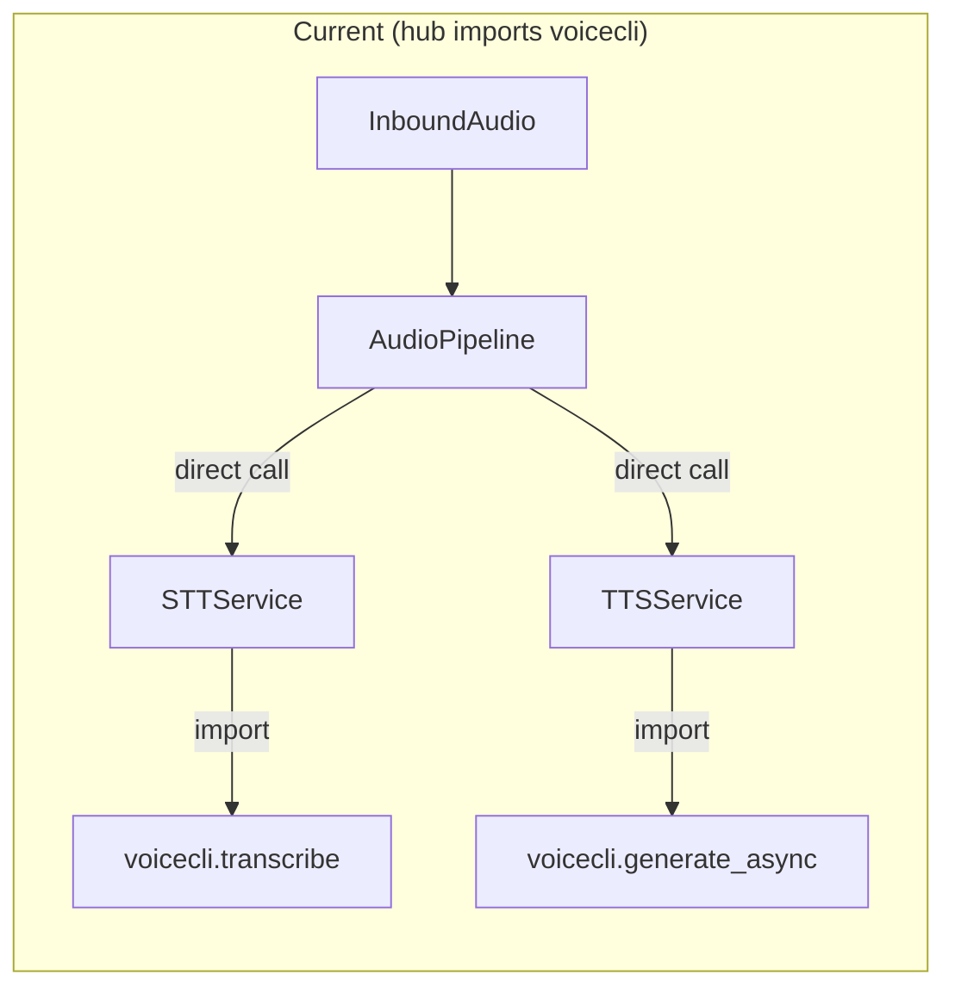
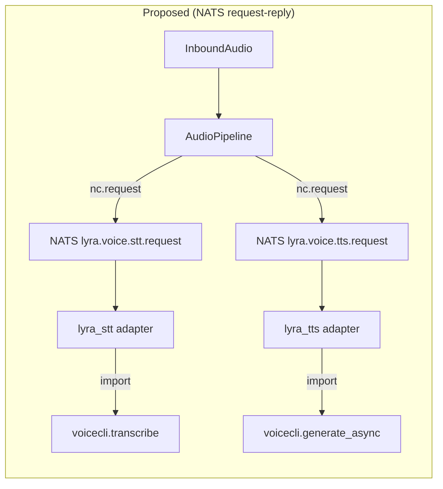

## Source

GitHub issue #518 — "refactor(voice): decouple STT/TTS from hub into independent NATS adapter services". Triggered by Telegram adapter crash on 2026-04-04 when STT daemon was stopped and voicecli fell back to in-process ~2 GB Whisper model loading.

## Problem

The hub process (`lyra_hub`) directly imports `voicecli` through two service wrappers:

- `STTService` (`src/lyra/stt/__init__.py`) — calls `voicecli.transcribe()` inside `asyncio.to_thread()` at line 70
- `TTSService` (`src/lyra/tts/__init__.py`) — calls `voicecli.generate_async()` at line 271

Both are initialized in `voice_overlay.py:init_stt()` / `init_tts()` and injected into `Hub.__init__()` via `hub_standalone.py:258-259`. The hub then passes them to `_resolve_agents()` which threads them through to every agent instance.

**Current call chain (STT):**
```
AudioPipeline._process_audio_item() → self._hub._stt.transcribe(tmp)
  → STTService._transcribe_sync() → voicecli.transcribe()
    → checks SOCKET_PATH → daemon up? use daemon : load model in-process
```

**Current call chain (TTS):**
```
AudioPipeline.synthesize_and_dispatch_audio() → self._hub._tts.synthesize()
  → TTSService.synthesize() → voicecli.generate_async()
```

When voicecli daemons are down, the in-process fallback loads ~2 GB models, occupying the thread pool and starving concurrent I/O threads. This causes Telegram polling timeouts that affect **all users** — a single voice message from one user can degrade text conversations for every active user on the hub. The cross-user blast radius is the highest-severity aspect of this incident.

**Critical prerequisite — audio-over-NATS (C5):** In three-process NATS mode, `InboundAudio` is placed onto a `LocalBus` inside the adapter process (`adapter_standalone.py:106`) but the hub's `inbound_audio_bus` is a *separate* `LocalBus` (`hub_standalone.py:163`). These are different processes — audio never crosses the NATS boundary to reach the hub. `NatsChannelProxy.render_audio()` at line 160 drops audio silently with a "C5" comment. **This means audio/voice messages are currently non-functional in three-process production mode.** This issue must include routing `InboundAudio` over NATS from platform adapters to the hub as a prerequisite, or scope it as a separate blocking dependency (C5).

## Outcome

- **User:** A voice message that fails never causes other users' conversations to stall or fail. A user sending a voice message when STT is down receives a polite, timely response (not a timeout or silence).
- **Operator:** Restarting or taking down voice infrastructure does not require a hub restart or cause an observable outage for text users. Voice adapters are independently restartable (`make lyra-stt reload`).
- **TTS degradation:** When the TTS adapter is down, a voice-mode response falls back to text-only delivery (not silent failure) — the current `synthesize_and_dispatch_audio()` swallows exceptions and logs, which means the user receives nothing. This needs a text fallback path.

## Appetite

1-week cycle. The ADR is accepted, the design is detailed, and the existing adapter pattern provides a reference implementation. Revised scope: ~18 files (6 new, 12 modified) once agent type annotations and infra files are included.

Deployment is order-safe: deploying adapters first changes nothing; deploying hub first activates graceful degradation. `start.sh --all` and `Makefile register` target need updating to include the two new programs. The `stt_unsupported` vs `stt_unavailable` user-facing messages should be distinct — "not configured" vs "temporarily down" are meaningfully different.

## Shapes

### Shape 1: NATS Request-Reply Adapters (ADR-039)

Two new supervisor processes (`lyra_stt`, `lyra_tts`) subscribe to `lyra.voice.stt.request` / `lyra.voice.tts.request` using NATS core request-reply. Hub sends requests with `nc.request()`, adapters respond to the reply-to inbox. Hub-side thin clients (`NatsSttClient`, `NatsTtsClient`) implement `STTProtocol` / `TtsProtocol` so `AudioPipeline` code changes are minimal.

**Trade-offs:**
- Pro: Mirrors the existing Telegram/Discord adapter pattern exactly. Hub never imports voicecli. Simple — `nc.request()` / `nc.publish(reply_to)` is 2 API calls per direction.
- Pro: Audio bytes as base64 in JSON is consistent with existing `_serialize.py` (which already handles `bytes → b64:` encoding).
- Con: Two new supervisor processes to manage. Base64 adds ~33% size overhead (negligible at 10–40 KB per voice message).

**Rough scope:** M (6 new files, 12 modified — expanded after expert review)

### Shape 2: Hub-Internal Subprocess Isolation

Keep voice processing in the hub but fork a subprocess for each transcription/synthesis call. Communicate via pipes or shared memory. No new NATS subjects.

**Trade-offs:**
- Pro: No new processes to manage in supervisor. No NATS topology changes.
- Con: Complex subprocess lifecycle management inside the hub. Does NOT fix the architectural issue — hub still imports voicecli. Crash in subprocess can leave orphaned resources. Not consistent with the adapter pattern. Operational opacity — voice failures hidden inside hub logs.

**Rough scope:** M (fewer files, but higher complexity and risk)

### Shape 3: Lazy-Import with Circuit Breaker

Keep the current architecture but wrap voicecli imports in a lazy loader with a circuit breaker. If daemon socket is absent, immediately fail (no in-process fallback). Add timeout guards around model loading.

**Trade-offs:**
- Pro: Minimal code change (~3 files). No new processes.
- Con: Band-aid — hub still imports voicecli, still coupled at startup. Circuit breaker adds complexity for a problem better solved by removing the dependency. Does not enable independent voice adapter management.

**Rough scope:** S (small change, but does not solve the structural problem)

## Fit Check

**Shape 1 (NATS Request-Reply)** is the clear winner. It:

1. **Eliminates** the structural coupling — hub never imports voicecli.
2. **Mirrors** a proven pattern — Telegram/Discord adapters already work this way.
3. **Enables** independent operational control — `make lyra-stt reload` without touching hub (new targets, separate from voicecli's `make stt`).
4. **Provides** graceful degradation by design — NATS timeout → `STTUnavailableError` → polite error reply.

Shape 2 is eliminated: higher complexity for the same scope, doesn't fix the architectural issue, and introduces a novel subprocess pattern that doesn't exist elsewhere in the codebase.

Shape 3 is eliminated: treats the symptom (crash on model load) without fixing the cause (hub imports voicecli). Would need to be revisited every time voicecli's behavior changes.

### Architecture Diagram: Current vs. Proposed





### Files Impacted

| File | Change | Domain |
|------|--------|--------|
| `src/lyra/stt/__init__.py` | Add `STTProtocol`, `STTUnavailableError`, `TtsUnavailableError` | voice |
| `src/lyra/tts/__init__.py` | Add `TtsProtocol` | voice |
| `src/lyra/nats/nats_stt_client.py` | **New** — hub-side NATS client wrapping `nc.request()` | nats |
| `src/lyra/nats/nats_tts_client.py` | **New** — hub-side NATS client wrapping `nc.request()` | nats |
| `src/lyra/bootstrap/stt_adapter_standalone.py` | **New** — NATS subscribe loop + STTService | bootstrap |
| `src/lyra/bootstrap/tts_adapter_standalone.py` | **New** — NATS subscribe loop + TTSService | bootstrap |
| `src/lyra/bootstrap/voice_overlay.py` | Replace `init_stt`/`init_tts` with `init_nats_stt`/`init_nats_tts` | bootstrap |
| `src/lyra/bootstrap/hub_standalone.py` | Remove voicecli import path; use NATS clients; wire audio-over-NATS | bootstrap |
| `src/lyra/bootstrap/agent_factory.py` | Change `STTService`/`TTSService` type annotations → `STTProtocol`/`TtsProtocol` | bootstrap |
| `src/lyra/agents/anthropic_agent.py` | Change `stt`/`tts` parameter type → protocol | agents |
| `src/lyra/agents/simple_agent.py` | Change `stt`/`tts` parameter type → protocol | agents |
| `src/lyra/core/audio_pipeline.py` | Catch `STTUnavailableError`; add TTS text fallback on `TtsUnavailableError` | core |
| `src/lyra/core/hub/hub.py` | Change `_stt`/`_tts` type annotations → protocol | core |
| `src/lyra/core/hub/hub_outbound.py` | Change `_tts` type annotation → protocol | core |
| `deploy/supervisor/conf.d/lyra_stt.conf` | **New** supervisor program (`startsecs=5`) | infra |
| `deploy/supervisor/conf.d/lyra_tts.conf` | **New** supervisor program (`startsecs=5`) | infra |
| `supervisor/scripts/run_stt_adapter.sh` | **New** launch script (path matches existing scripts) | infra |
| `supervisor/scripts/run_tts_adapter.sh` | **New** launch script (path matches existing scripts) | infra |
| `Makefile` | Add `lyra-stt`/`lyra-tts` targets; update `register` target | infra |

### Risks & Mitigations

| Risk | Likelihood | Mitigation |
|------|-----------|------------|
| **Audio never reaches hub in 3-process mode (C5 blocker)** | Confirmed | Include `InboundAudio`-over-NATS routing as prerequisite or in-scope work |
| NATS message size limit for large audio | Low (10–40 KB, limit 1 MB) | Monitor; chunk if exceeded |
| Request timeout too short for slow TTS inference | Medium | Configurable timeouts (30s TTS, 60s STT); log with request_id |
| Agent factory holds concrete `STTService` refs | High | Change type annotations in `agent_factory.py`, `anthropic_agent.py`, `simple_agent.py` to use protocol |
| `AgentTTSConfig` serialization across NATS boundary | Medium | Flatten all TTS config fields into `TtsRequest` JSON schema; `NatsTtsClient.synthesize()` extracts from `AgentTTSConfig` and serializes, adapter reconstructs as kwargs |
| TTS silent failure — user receives nothing | High | Add text fallback in `synthesize_and_dispatch_audio()` when `TtsUnavailableError` is raised |
| `make stt`/`make tts` target name collision with voicecli | Medium | Use `make lyra-stt`/`make lyra-tts` for NATS adapters; document disambiguation |
| `stt_unsupported` vs `stt_unavailable` ambiguity | Low | Add distinct `stt_unavailable` message key — "temporarily down" vs "not configured" |
| Existing tests mock STTService directly | Medium | Tests continue to work since protocol is structural; add protocol-level tests |

### Unresolved Decisions

| Decision | Options | Note |
|----------|---------|------|
| C5 audio-over-NATS: include in scope or separate issue? | (a) Include as prerequisite slice (b) File separate blocking issue | Determines if this is 1 week or needs 2 slices |
| Do agents use NATS client or retain direct voicecli? | (a) Agents use protocol (NATS client) — consistent (b) Pass `None` — agents don't call STT/TTS directly from turns | Need to verify if `self._stt.transcribe()` in agents is actually reachable |
