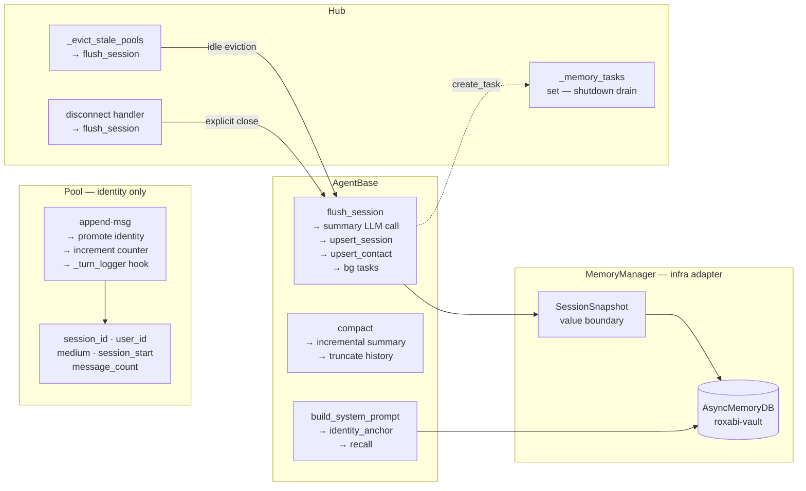

## Source

Issue #83: *"feat(memory): Lyra agent integration — identity anchor, session lifecycle, L0 compaction"*
Parent epic #9: Memory layer Phase 1 (L0 + L3).
Frame: `artifacts/frames/83-memory-agent-integration-frame.mdx`

## Problem

Lyra is fully stateless between sessions. Three concrete gaps:

1. **Pool has no identity** — `Pool.__init__` takes only `pool_id` and `agent_name`. No `user_id`, no `medium`, no `session_id`. Nothing to key a session record on.
2. **AgentBase never writes to L3** — `flush_session()` does not exist. `config.system_prompt` is a static string loaded at boot from TOML. It cannot evolve.
3. **No memory pillars** — no storage for contacts, concepts, preferences, or past session summaries. `AsyncMemoryDB` is installed and schema-ready; nothing calls it from the agent process.

Current codebase state:
- `Pool` holds `history: list[InboundMessage]`, `sdk_history: deque[dict]`, `_last_active: float` (monotonic). TODO comment on compaction strategy.
- `AgentBase` has `config.system_prompt: str` (static) and abstract `process()`.  No memory hooks.
- `InboundMessage` already carries `user_id: str` and `platform: str` — identity data is present in messages, just not promoted to Pool.
- Hub creates pools via `get_or_create_pool(pool_id, agent_name)` — no identity info passed. Evicts idle pools after `POOL_TTL = 3600s` via `_evict_stale_pools()`.
- `MessageDebouncer.merge()` uses `replace(last, ...)` — metadata from most recent message. **Identity is safe:** `pool_id` is derived from `(platform, bot_id, user_id)`, so all buffered messages necessarily share the same `user_id`. No race.
- `roxabi_vault.AsyncMemoryDB` has `upsert_session()`, `save_entry()`, `search()`, `NamespacedReader/Writer` — fully ready.

## Outcome

After this issue:
- Every Pool carries `session_id`, `user_id`, `medium`, `session_start`, `message_count`.
- On session flush (Hub eviction after idle TTL or explicit disconnect), a session record is upserted in L3 with an LLM-generated summary.
- The identity anchor is seeded from TOML on first boot and retrieved from L3 on subsequent boots.
- `recall()` is triggered by `build_system_prompt()` — the first async call at session start. It injects `[MEMORY]` + `[PREFERENCES]` blocks when prior records exist (no-op for new users with empty L3).
- Contact records are upserted per user at session start.
- Concepts and preferences are extracted (via LLM background tasks registered in Hub) on flush.

## Appetite

1 sprint (~5 days). XL / κ=8 — multi-domain, new architecture. F-full implementation.

## Shapes

### Shape A: `MemoryManager` + `SessionSnapshot` value boundary

Introduce `src/lyra/core/memory.py` with a `MemoryManager` class that owns one `AsyncMemoryDB` per agent process. `AgentBase` gains `_memory: MemoryManager | None` (injected at construction, opt-in).

**Boundary design — `SessionSnapshot` value object:**

```python
@dataclass(frozen=True)
class SessionSnapshot:
    session_id: str
    user_id: str
    medium: str
    agent_namespace: str
    session_start: datetime
    session_end: datetime
    message_count: int
    source_turns: int
```

`MemoryManager` takes `SessionSnapshot` (and plain str/int values), **never `Pool`** directly.
This keeps `MemoryManager` a pure infra adapter with zero core domain imports — testable with no Pool construction.

**Key API:**
```python
class MemoryManager:
    async def connect(self) -> None
    async def close(self) -> None

    # Identity anchor
    async def get_identity_anchor(self, namespace: str) -> str | None
    async def save_identity_anchor(self, namespace: str, text: str) -> None

    # Session
    async def upsert_session(self, snap: SessionSnapshot, summary: str) -> None

    # Contact
    async def upsert_contact(self, user_id: str, medium: str, namespace: str) -> None

    # Recall — called at session start by build_system_prompt()
    async def recall(self, user_id: str, namespace: str,
                     first_msg: str = "", token_budget: int = 1000) -> str

    # Background extraction — called from flush via create_task()
    async def extract_concepts(self, snap: SessionSnapshot, summary: str) -> None
    async def extract_preferences(self, snap: SessionSnapshot, summary: str) -> None
```

**AgentBase additions:**

```python
async def build_system_prompt(self, pool: Pool) -> str
    # 1. get_identity_anchor() — seed from TOML on first boot, retrieve from L3 after
    # 2. recall(pool.user_id, ..., pool.history[0].text) → [MEMORY] + [PREFERENCES] block
    # 3. return composed prompt

async def compact(self, pool: Pool) -> None
    # Triggered when pool.sdk_history token count > 80% context window
    # LLM call: incremental summary (includes prior summary)
    # Truncate: pool.sdk_history = [SystemMessage(summary)] + tail

async def flush_session(self, pool: Pool, reason: str) -> None
    # 1. Build SessionSnapshot from pool fields
    # 2. LLM call: generate session summary (synchronous — must complete before flush)
    # 3. upsert_session(snap, summary)
    # 4. upsert_contact(pool.user_id, ...)
    # 5. asyncio.create_task(extract_concepts(...)) — registered in Hub._memory_tasks
    # 6. asyncio.create_task(extract_preferences(...)) — registered in Hub._memory_tasks
```

**Pool changes** (identity fields only — no vault imports, no asyncio tasks):

```python
# New fields in Pool.__init__:
self.session_id: str = str(uuid.uuid4())
self.user_id: str = ""              # populated by first message via append()
self.medium: str = ""               # populated by first message via append()
self.session_start: datetime = datetime.now(UTC)
self.message_count: int = 0
self._turn_logger: Callable[[str, InboundMessage], Awaitable[None]] | None = None
```

`Pool.append(msg)` — new mutator called from `_process_one`:
- Promotes `user_id` and `medium` from `msg` on first call
- Increments `message_count`
- Calls `_turn_logger` callback if set (for #67)

**Idle timer and flush trigger — owned by Hub, not Pool:**

Hub's `_evict_stale_pools()` already runs on each `get_or_create_pool()` call. Extend it:

```python
def _evict_stale_pools(self) -> None:
    now = time.monotonic()
    to_evict = [
        pool_id for pool_id, pool in self.pools.items()
        if pool.is_idle and (now - pool.last_active) > self._pool_ttl
    ]
    for pool_id in to_evict:
        pool = self.pools.pop(pool_id)
        agent = self.get_agent(pool.agent_name)
        if agent is not None:
            task = asyncio.create_task(agent.flush_session(pool, "idle"))
            self._memory_tasks.add(task)
            task.add_done_callback(self._memory_tasks.discard)
```

Hub also calls `flush_session(pool, "end")` on explicit adapter disconnect.

**Background task registry — shutdown safety:**

Hub gains `_memory_tasks: set[asyncio.Task]` (same pattern as `AsyncMemoryDB._background_tasks`).
On graceful shutdown, Hub awaits all pending memory tasks before closing:

```python
async def shutdown(self) -> None:
    if self._memory_tasks:
        await asyncio.gather(*self._memory_tasks, return_exceptions=True)
```

This prevents data loss (concept/preference extraction) on clean restart or SIGTERM.

**10h idle threshold — rationale:**

The `POOL_TTL` (currently 3600s / 1h) is the eviction threshold. Two separate thresholds are warranted:
- `POOL_TTL = 3600s` (1h) — evict idle pools from memory (existing)
- `FLUSH_TTL = 36000s` (10h) — flush session to L3 before eviction (new)

In practice, since `FLUSH_TTL > POOL_TTL`, every eviction triggers a flush. The "10h" value in the issue is the max session duration before an implicit close — it ensures sessions from a day-long idle don't accumulate. This is configurable via `Hub(flush_ttl=...)`.

Edge case: if `flush_session()` fires mid-LLM-call (LLM turn in progress), `pool.is_idle` is `False` and eviction is skipped — the pool remains until the turn completes. No conflict.

**user_id isolation:**

`MemoryManager` enforces isolation at the query level: every `AsyncMemoryDB` call passes `namespace=agent_namespace` AND every `save_entry()` / `upsert_session()` stores `user_id` in `metadata`. All retrieval methods filter by both. No cross-namespace leakage is possible without explicitly bypassing `MemoryManager`.

**Trade-offs:**
- Pro: `MemoryManager` is pure infra — testable with mock DB, no Pool import
- Pro: Single DB connection per agent process (not per pool)
- Pro: DI via `_memory: MemoryManager | None` — zero-cost when disabled
- Pro: Hub owns flush trigger and task registry — clean separation, no callback soup in Pool
- Pro: Background task registry prevents data loss on shutdown
- Con: New module (`memory.py`) + new value type (`SessionSnapshot`)
- Con: Hub gains more responsibilities (flush trigger + task registry)

**Rough scope:** XL

---

### Shape B: Inline in `AgentBase`

`AgentBase` owns `AsyncMemoryDB` directly. All methods live on `AgentBase`.

**Trade-offs:**
- Pro: fewer files
- Con: `agent.py` is already 500+ lines — adding 4 pillars pushes to ~900 lines, violating ADR-019 / issue #196
- Con: `AsyncMemoryDB` in `__init__` makes unit tests heavier (must mock vault open/close)
- Con: idle timer must live somewhere — either Pool (callback soup) or Hub (same as Shape A anyway)

**Rough scope:** L (less boilerplate, but messier architecture)

---

### Shape C: Phased — session record first, pillars in a follow-up

Phase 1a (this issue): Pool identity + identity anchor + flush_session with session record only.
Phase 1b (new child issue): contacts, concepts, preferences, recall.

**Trade-offs:**
- Pro: smaller first PR, unblocks #67 sooner
- Con: Lyra has no "memory" until Phase 1b — recall() and preferences still missing
- Con: two PRs for marginal size reduction; total work identical
- Con: 4 pillars were explicitly added to #83 to ship together

**Rough scope:** M (1a) + L (1b)

---

## Fit Check

**Shape A is recommended.** Shape B violates ADR-019. Shape C delays the user-visible benefit for no architectural gain.

Shape A resolves all review findings:
- `MemoryManager` takes `SessionSnapshot` (value type), not `Pool` — fully decoupled and testable
- Idle timer owned by Hub via extended `_evict_stale_pools()` — no contradiction with Pool fields
- Hub `_memory_tasks` registry prevents background task data loss on shutdown
- `user_id` identity safety confirmed: `MessageDebouncer.merge()` uses last-message metadata, but all messages in a pool share the same `user_id` by `pool_id` construction



### Files impacted

| File | Change |
|------|--------|
| `src/lyra/core/pool.py` | Add identity fields + `append()` mutator |
| `src/lyra/core/agent.py` | Add `build_system_prompt()`, `compact()`, `flush_session()`, inject `_memory` |
| `src/lyra/core/memory.py` | **New** — `MemoryManager` + `SessionSnapshot` |
| `src/lyra/core/hub.py` | Extend `_evict_stale_pools()` + `_memory_tasks` registry + shutdown drain |
| `src/lyra/agents/*.toml` | Verify `memory_namespace` present |
| `tests/test_memory_manager.py` | **New** — unit tests (mock AsyncMemoryDB) |
| `tests/test_pool.py` | Extend for identity fields + `append()` |
| `tests/test_agent.py` | Extend for `build_system_prompt()`, `flush_session()` |
| `tests/test_hub.py` | Extend for flush-on-eviction + task registry |
