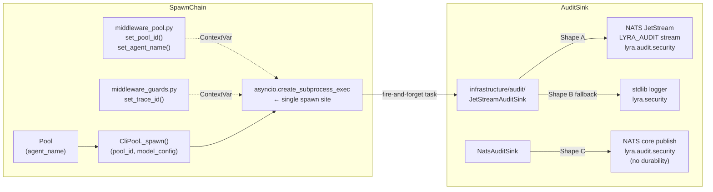

## Source

> `skip_permissions` flag in `core/cli/cli_protocol.py:78-79` appends
> `--dangerously-skip-permissions` to every CLI spawn. No audit trail connects
> unrestricted turn ↔ agent ↔ message. Accountability gap if agent misbehaves.
> — Issue #855 / quality audit §P0 #5

## Problem

**Single spawn point.** `asyncio.create_subprocess_exec` is called once, in
`cli_pool_worker.py:_spawn()`. The `build_cmd()` call inside `_spawn()` is where
`skip_permissions` is silently applied. Every spawned process (unrestricted or
not) enters the world without emitting a structured record.

**Contextual fields available at spawn time:**

| Field | Source | Notes |
|-------|--------|-------|
| `pool_id` | `_spawn(pool_id=...)` | already present |
| `skip_permissions` | `model_config.skip_permissions` | already present |
| `tools` | `model_config.tools` | already present |
| `model` | `model_config.model` | already present |
| `trace_id` | `TraceContext.get_trace_id()` | ContextVar set by `middleware_guards.py` |
| `agent_name` | NOT in `_spawn()` | lives at `Pool.agent_name`, one layer up |

**`agent_name` threading decision.** Propagating `agent_name` through `_spawn()`
requires changing 4 method signatures across 3 architectural layers
(`Pool.submit` → `ClaudeCliDriver.stream/complete` → `CliPool.send` → `_spawn`).
The canonical solution is a `TraceContext._agent_name` ContextVar — identical
pattern to `_pool_id` which is set in `middleware_pool.py:92` right where
`ctx.binding.pool_id` is resolved. `ctx.binding.agent_name` is available at the
same site. `TraceContext.get_agent_name()` is then readable inside `_spawn()`
with no signature changes.

**Import layer constraint.** Per `.importlinter` `clean-architecture-layers`:
`lyra.core` ← `lyra.nats` ← `lyra.infrastructure`. `lyra.core` cannot import
`nats-py` directly. The JetStream sink must live at `lyra.infrastructure.audit`,
not `lyra.core.audit`. `lyra.core.audit` may hold a protocol + the `SecurityEvent`
schema (pure Pydantic, no NATS import) only.

**JetStream is not used anywhere.** NATS core pub/sub is in use. Zero `js.`,
`add_stream`, or `JetStreamContext` calls exist in lyra or roxabi-nats. This is
the first proposed JetStream use. NATS server must have `jetstream {}` block
enabled — this needs to be verified/added to embedded NATS config.

**Existing audit is log-only.** `audit_consumer.py` logs pipeline events as
structured JSON to stdlib. No durable storage, no replay, no external
queryability.

## Outcome

Every CLI subprocess spawn emits a `SecurityEvent` with: `pool_id`,
`agent_name`, `skip_permissions`, `tools_allowlist`, `tools_restricted`,
`trace_id` (via `ContractEnvelope`), `model`, `pid`, `timestamp`. Events land on
JetStream `lyra.audit.security` with durable retention independent of app logs.
"Who ran unrestricted and when" is a one-query question regardless of log
rotation.

## Appetite

1-week cycle. Schema + sink + adoption is well-scoped. The main unknown is
JetStream stream provisioning — particularly idempotent `add_stream()` behaviour
when the `LYRA_AUDIT` stream exists with a different config.

## Shapes

### Shape A — JetStream durable stream

`SecurityEvent(ContractEnvelope)` in `roxabi-contracts/audit/` →
`lyra.infrastructure.audit.JetStreamAuditSink` publishes to NATS subject
`lyra.audit.security` via JetStream → `LYRA_AUDIT` stream provisioned at
bootstrap startup.

**Emit site:** `cli_pool_worker.py:_spawn()` — after successful process
creation:
```python
task = asyncio.create_task(sink.emit(event))
self._audit_tasks.discard  # done-callback removes from set
self._audit_tasks.add(task)
task.add_done_callback(self._audit_tasks.discard)
```
Task anchored to `_audit_tasks: set` on the `CliPool` instance — prevents GC
collection before completion. `sink.emit()` wraps publish in `try/except` and
logs at WARNING on failure — never propagates to caller.

**Schema:**
```python
class SecurityEvent(ContractEnvelope):
    # trace_id, issued_at, contract_version inherited from ContractEnvelope
    kind: Literal["cli.subprocess.spawned"]
    pool_id: str
    agent_name: str
    skip_permissions: bool       # True = --dangerously-skip-permissions active
    tools_restricted: bool       # True = explicit allowlist; False = all tools
    tools_allowlist: list[str]   # empty when tools_restricted=False
    model: str
    pid: int
```

**JetStream stream provisioning:**
```python
# lyra.infrastructure.audit.jetstream_sink — on startup
await js.add_stream(StreamConfig(
    name="LYRA_AUDIT",
    subjects=["lyra.audit.>"],
    retention=RetentionPolicy.LIMITS,
    storage=StorageType.FILE,
    max_age=90 * 86400,   # 90-day retention
    max_bytes=1 * 1024**3, # 1 GiB cap
    duplicate_window=60,
))
```
Idempotency: wrap `add_stream` in `try/except BadRequestError` and call
`update_stream` when the stream already exists. If config mismatch (e.g. different
`max_age`), log a WARNING and continue — don't abort startup. Fall back to
structured log emit if JetStream provisioning fails entirely.

**`agent_name` threading — ContextVar approach:**
```python
# middleware_pool.py:92 (alongside existing set_pool_id call)
token_pid = TraceContext.set_pool_id(ctx.binding.pool_id)
token_an = TraceContext.set_agent_name(ctx.binding.agent_name)  # new
```
`_spawn()` reads `TraceContext.get_agent_name()` — zero signature changes
to `CliPool.send`, `ClaudeCliDriver`, or `Pool.submit`.

**Module placement:**
- `packages/roxabi-contracts/src/roxabi_contracts/audit/__init__.py` — `SecurityEvent`
- `src/lyra/core/audit/__init__.py` — `AuditSink` protocol (optional; may be inline)
- `src/lyra/infrastructure/audit/__init__.py` + `jetstream_sink.py` — concrete sink
- Sink injected into `CliPool.__init__(audit_sink: AuditSink | None = None)`

**Trade-offs:**
- Pro: durable events survive restarts; independently retained; SIEM/alerting
  attach as plain NATS subscribers; `lyra.audit.>` supports future event types;
  aligns with issue proposal; NATS 3.x on prod has built-in JetStream
- Pro: fire-and-forget with task anchoring is safe and doesn't block spawn path
- Con: first JetStream use — new infra pattern; NATS server `jetstream {}` must
  be enabled; `add_stream` idempotency under config mismatch is a genuine risk

**Rough scope:** L — 9 files (3 new + 6 modified)

---

### Shape B — Structured log event

`SecurityEvent` dataclass (stdlib only) in `src/lyra/core/audit/` →
`AuditEmitter.emit()` logs to `lyra.security` logger as structured JSON via
existing `TraceIdFilter` + `JsonFormatter`.

**Trade-offs:**
- Pro: zero new infrastructure; consistent with `AuditConsumer` pattern; no
  NATS dependency
- Con: not durable (log rotation); not queryable from outside; security events
  and debug logs share the same sink and retention policy; doesn't satisfy the
  stated P1-security durability requirement

**Rough scope:** S — 3 files

---

### Shape C — NATS core publish + log fallback

`SecurityEvent(ContractEnvelope)` in `roxabi-contracts/audit/` →
`lyra.infrastructure.audit.NatsAuditSink` publishes to `lyra.audit.security` via
`nc.publish()` (not JetStream). Falls back to structured log when not connected.

Future JetStream upgrade: replace `nc.publish()` with `js.publish()` — the nats-py
API is `js = nc.jetstream()` on the same connection object, a one-line change.

**Trade-offs:**
- Pro: schema identical to Shape A — migration to Shape A is additive; no
  JetStream infra now
- Con: not durable; consumers miss events during restart windows; adds NATS
  coupling to spawn path without achieving the durability goal
- Con: middle ground that satisfies neither "zero infra" nor "durable" — worse
  than both alternatives for their respective use cases

**Rough scope:** M — 6 files

---

## Fit Check



**Shape B eliminated:** log-only doesn't satisfy durability. P1-security issues
require a forensic trail independent of log rotation.

**Shape C eliminated:** core NATS publish costs the same NATS coupling as Shape A
without achieving durability. The marginal complexity of JetStream over core
publish is minimal — `nc.jetstream()` returns a `JetStreamContext` on the same
connection, `js.publish()` has the same signature as `nc.publish()`. There is no
benefit to deferring.

**Shape A selected.** NATS 3.x on prod includes built-in JetStream. Sink is
injected into `CliPool` — no import layer violation. `agent_name` via ContextVar
avoids signature cascade. Fire-and-forget with task anchoring is safe.

### Files impacted

| File | Status | Change |
|------|--------|--------|
| `packages/roxabi-contracts/src/roxabi_contracts/audit/__init__.py` | New | `SecurityEvent` Pydantic model |
| `packages/roxabi-contracts/src/roxabi_contracts/__init__.py` | Modified | re-export `SecurityEvent` |
| `src/lyra/core/trace.py` | Modified | add `_agent_name` ContextVar + `get/set/reset_agent_name()` |
| `src/lyra/core/hub/middleware/middleware_pool.py` | Modified | call `TraceContext.set_agent_name()` at line 92 |
| `src/lyra/infrastructure/audit/__init__.py` | New | module init |
| `src/lyra/infrastructure/audit/jetstream_sink.py` | New | `JetStreamAuditSink`: provision stream, emit, task anchoring, fallback |
| `src/lyra/core/cli/cli_pool_worker.py` | Modified | read ContextVars, call `sink.emit()`, anchor task in `_audit_tasks` set |
| `src/lyra/core/cli/cli_pool.py` | Modified | accept `audit_sink` kwarg, hold `_audit_tasks: set` |
| `src/lyra/bootstrap/lifecycle/bootstrap_lifecycle.py` | Modified | provision `LYRA_AUDIT` stream + inject sink into CliPool |
| `src/lyra/bootstrap/standalone/hub_standalone.py` | Modified | same |

### Open questions resolved

| Question | Answer |
|----------|--------|
| Where does `agent_name` come from at spawn? | `TraceContext` ContextVar set in `middleware_pool.py:92` |
| Import layer compliance? | Sink in `lyra.infrastructure.audit`; only schema in `lyra.core.audit` (none actually) |
| `create_task` GC hazard? | Anchor in `_audit_tasks: set[Task]` on CliPool; done-callback removes |
| Who provisions the stream? | Bootstrap startup, both entry points; idempotent with `update_stream` fallback |
| JetStream not enabled (dev)? | Sink falls back to structured log at WARNING — operator is notified |
| Config mismatch on restart? | `add_stream` → catch `BadRequestError` → `update_stream` → WARNING if mismatch |
| Single spawn site confirmed? | Yes — `cli_pool_worker.py:_spawn()` only |
| `tools_allowlist: [] = all tools` ambiguity? | Resolved by `tools_restricted: bool` field — explicit, unambiguous |
