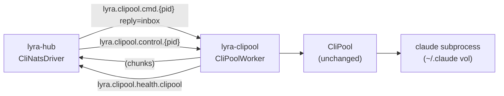

## Source

Issue #941: "Extract CliPool into dedicated container with NATS protocol"
> `container-split.md` defines the target 3-container topology. Today Hub→CliPool is
> in-process (stdio, method calls). This issue extracts CliPool into a dedicated container
> communicating with Hub over NATS.

## Problem

The in-process `Hub → CliPool` link is the last unresolved boundary in the 3-container split.
`ClaudeCliDriver` calls `CliPool.send()` / `CliPool.send_streaming()` as direct method calls
inside the hub container. Consequences:

- `~/.claude/` must be mounted into the hub container — wrong security boundary (hub has no
  business with Claude session files)
- CliPool can't be restarted, updated, or scaled independently of the hub
- `_resume_session_ids` (in-memory dict, `pool_id → cli_session_id`) is lost on hub restart —
  active sessions mid-conversation lose resume context and restart cold on the next turn

## Outcome

Hub communicates with CliPool exclusively via NATS (`lyra.clipool.cmd.<pool_id>` /
ephemeral reply inbox). CliPool and its `~/.claude/` volume run in a dedicated container.
Session resume continuity is preserved across hub restarts — verified by restarting the hub
mid-conversation and confirming the next turn resumes the correct Claude session without
starting cold.

## Appetite

~3 weeks. Multi-domain: contracts (new `cli/` domain), hub driver (new `CliNatsDriver`),
worker service (new `CliPoolWorker`), quadlet unit (new), bootstrap wiring (edit).
All pieces have clear templates; primary unknowns are streaming protocol design and unified-mode
bootstrap wiring.

## Shapes

### Shape 1: Thin CLI worker wrapping CliPool — new `CliNatsDriver` on hub

**Structure:**

```
Hub: ClaudeCliDriver → [REMOVED]
Hub: CliNatsDriver (new, same LlmProvider interface)
  publish → lyra.clipool.cmd.<pool_id>    (CliCmdPayload, reply=inbox)
  sub     ← <ephemeral inbox>             (CliChunkEvent stream)
  pub/sub ↔ lyra.clipool.control.<pool_id>(CliControlCmd / CliControlAck)

CliPoolWorker (new, subclasses NatsAdapterBase):
  primary subject: lyra.clipool.cmd.*     (wildcard; NatsAdapterBase.__init__ subject param)
  queue_group: ""                         (no queue group — per-pool affinity, single worker)
  sub  → lyra.clipool.control.*          (via _extra_subjects())
  pub  → msg.reply (ephemeral inbox)     (fan chunks back to hub)
  owns CliPool internally (unchanged)
```

**Streaming reply — ephemeral inbox (not fixed subject):**
`NatsLlmDriver` already implements this: hub creates an ephemeral inbox (`nc.new_inbox()`),
subscribes to it, publishes `CliCmdPayload` with `reply=inbox`, worker fans chunks to
`msg.reply`. The architecture doc lists `lyra.clipool.reply.<pool_id>` as the reply subject —
this is a documentation error; fixed subjects break isolation when two concurrent turns exist
for the same pool. The spec must update `container-split.md` to reflect inbox semantics.

**Hub-side (`CliNatsDriver`, ~150 LOC):**
- Implements same interface as `ClaudeCliDriver`: `complete()`, `stream()`, `reset()`,
  `resume_and_reset()`, `switch_cwd()`, `is_alive()`, `link_lyra_session()`
- `stream()` → ephemeral inbox pattern from `NatsLlmDriver._stream_gen()` (template)
- `complete()` → `nc.request()` with `stream=false` payload
- Control ops → `lyra.clipool.control.<pool_id>` request-reply
- `is_alive(pool_id)` → `_worker_freshness` dict; freshness threshold 60s (2× heartbeat interval)

**Worker-side (`CliPoolWorker`, ~250 LOC):**
- Subclasses `NatsAdapterBase`; `subject = "lyra.clipool.cmd.*"` (wildcard as primary subject),
  `queue_group = ""` (not competing with other workers)
- On cmd message: extract `pool_id` from subject, call `self._pool.send_streaming(pool_id, ...)`,
  fan `LlmEvent` objects to `msg.reply`
- `session_id` forwarded in a dedicated chunk (event_type=`session_id`) on first occurrence
  (from `system/init` event) and re-emitted on `result` event
- Subscribes `lyra.clipool.control.*` via `_extra_subjects()` for `reset`, `resume_and_reset`,
  `switch_cwd`; replies with ack
- Heartbeat: publishes `lyra.clipool.health.clipool` every 30s (same interval as LLM workers)

**Wire format (new `cli/` domain in `roxabi-contracts`):**
```python
# lyra.clipool.cmd.<pool_id>  (published with reply=inbox)
class CliCmdPayload(ContractEnvelope):
    pool_id: str
    lyra_session_id: str
    text: str
    model_cfg: dict
    system_prompt: str
    resume_session_id: str | None   # from TurnStore — hub's responsibility to look up

# Reply messages to ephemeral inbox — multiple per turn
class CliChunkEvent(ContractEnvelope):
    pool_id: str
    event_type: Literal["text", "tool_use", "session_id", "result", "error"]
    text: str | None
    session_id: str | None          # populated only on event_type=session_id
    is_error: bool
    done: bool

# lyra.clipool.control.<pool_id>
class CliControlCmd(ContractEnvelope):
    pool_id: str
    op: Literal["reset", "resume_and_reset", "switch_cwd"]
    session_id: str | None
    cwd: str | None

class CliControlAck(ContractEnvelope):
    pool_id: str
    ok: bool
    resumed: bool | None

# lyra.clipool.health.clipool  (push from worker, 30s interval)
class CliHeartbeat(ContractEnvelope):
    worker_id: str
    pool_count: int
```

**Session persistence across boundary:**
- Worker emits `event_type=session_id` chunk → Hub's `CliNatsDriver` fires existing
  `_persist_cli_session` callback → TurnStore updated on hub side
- `_resume_session_ids` dict stays inside `CliPoolWorker`; hub sends `resume_session_id`
  in `CliCmdPayload` (looked up from TurnStore before dispatch — same lookup that was done
  before passing `--resume` to the in-process pool)

**Migration / cutover:**
- `_resume_session_ids` is lost at hub restart today (same as post-migration). Active sessions
  in the in-memory dict at cutover time will restart cold — this is already the failure mode
  on any hub crash. Acceptable; no special migration protocol needed beyond a maintenance window
  (drain active turns, then restart).

**Trade-offs:**
- Pro: Clean per-pool routing matching architecture doc; CliPool internals unchanged; full
  `NatsAdapterBase` + `NatsLlmDriver` templates reused
- Pro: `CliNatsDriver` is drop-in replacement for `ClaudeCliDriver` (same interface)
- Pro: Session ID forwarding is explicit in wire protocol
- Con: Wildcard primary subject (`lyra.clipool.cmd.*`) means `NatsAdapterBase` handles dispatch;
  the base class `_extra_subjects()` hook is present but this is the first use of a wildcard as
  the primary subject — minor integration risk, confirmed supported in `adapter_base.py:110`

**Rough scope:** L

---

### Shape 2: Reconfigure `NatsLlmDriver` to cover CliPool

Reuse `NatsLlmDriver` (hub-side) and the llm-worker pattern; extend wire format with `session_id`.

**Eliminated:** `NatsLlmDriver` uses queue group (`lyra.llm.request`) — all workers compete
for messages. CliPool needs per-`pool_id` routing; queue group semantics are incompatible.
Adding `reset`, `resume_and_reset`, `switch_cwd` to `lyra.llm.request` also conflates
semantically distinct concerns.

---

### Shape 3: Stateless per-message CLI launcher

Each NATS message spawns a fresh `claude --resume <session_id>` subprocess, waits, replies.

**Eliminated:** Cold-spawn latency on every turn; discards idle-TTL eviction, warm-process
optimisation, and all CliPool session/lifecycle logic.

---

## Fit Check



Shape 1 is the only viable approach. Implementation surface:

| Component | Action | Template |
|-----------|--------|----------|
| `roxabi-contracts` `cli/` domain | New: `models.py` + `subjects.py` | `voice/` or `image/` pattern |
| `src/lyra/llm/drivers/cli_nats.py` | New: `CliNatsDriver` (~150 LOC) | `nats_driver.py` |
| `src/lyra/adapters/clipool/worker.py` | New: `CliPoolWorker` (~250 LOC) | `NatsAdapterBase` + `CliPool` |
| `deploy/quadlet/lyra-clipool.container` | New: Quadlet unit | `lyra-hub.container` — move `~/.claude` mounts |
| `deploy/quadlet/lyra-hub.container` | Edit: remove `~/.claude` mounts | — |
| `src/lyra/bootstrap/` | Edit: wire `CliNatsDriver`; unified mode asyncio task | existing bootstrap |
| `docs/architecture/container-split.md` | Edit: fix reply subject (inbox, not fixed) | — |

**Infrastructure constraints (must be in spec):**
- **NATS nkey:** New `lyra-nkey-clipool-worker` nkey pair required. Add to
  `deploy/nats/nats-container.conf` auth block; provision via `make quadlet-secrets-install`.
  Hard blocker — container cannot connect to NATS without it.
- **Startup order:** `After=lyra-hub.service` (no `Requires=`) — same pattern as
  telegram/discord; CliPool reconnects on its own; hub restart must not cascade to clipool.
- **Volume exclusion:** `lyra-data.volume` (`~/.lyra/`) must NOT be mounted in clipool.
  Add explicit comment in quadlet to prevent cargo-cult copy.
- **CPU quota:** Claude subprocesses are CPU-intensive; start uncapped or `CPUQuota=400%`
  (vs hub's `200%`). Flag as tuning item.
- **Image:** Reuse `ghcr.io/roxabi/lyra:staging` with `lyra adapter clipool` entrypoint.
  No new Dockerfile or image build required.

**`lyra start` unified mode:**
Two options for the in-process bootstrap:
1. Start `CliPoolWorker` as a background asyncio task alongside embedded NATS, wire hub to
   use `CliNatsDriver` pointing at local NATS — consistent, single code path **(recommended)**
2. Keep `ClaudeCliDriver` for unified mode, `CliNatsDriver` for prod — dual code paths, tech debt

Option 1: `_bootstrap_hub_standalone()` must not instantiate `CliPool` directly;
`hub.cli_pool` reference is removed; `CliPoolWorker` owns the pool. Bootstrap wiring
decision point (flag or always-NATS) must be explicit — cannot create `CliPool` twice.
