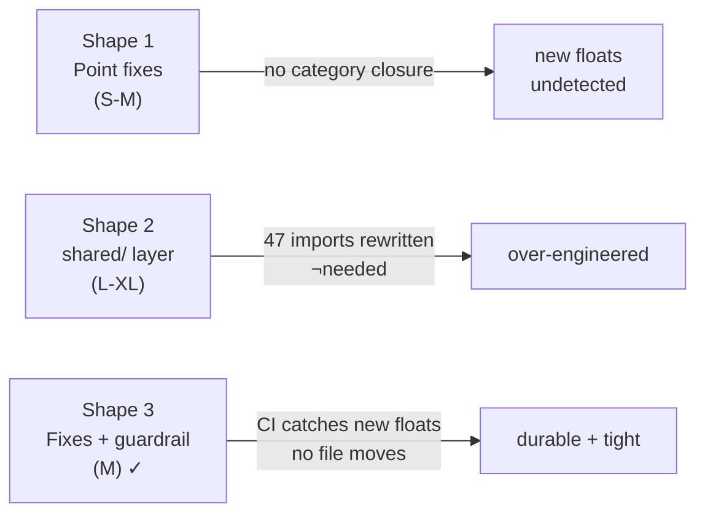

## Source

> "We have a bigger and bigger code base + modules. Can we better handle that? Can we improve code base structure, folder structure etc" — user, 2026-04-27.
> Full audit commissioned → 5 concrete violations found → issue #977 opened.

## Problem

The Lyra codebase has grown to 50+ modules but the structural enforcement hasn't kept pace. Five violations of the declared hexagonal architecture were found during a full audit:

1. **Kernel inversion** — `core/agent/agent.py:18` imports `from lyra.commands import PLUGINS_DIR`. Domain layer (`core`) depends on application layer (`commands`) — the hexagon is inverted at this import site.

2. **Circular package dependency** — `roxabi-nats` imports `roxabi-contracts` (production). `roxabi-contracts/voice/testing.py` and `image/testing.py` import `roxabi_nats.connect` (test harness). An extras group (`roxabi-contracts[testing]`) already exists and `roxabi-nats` is declared as an optional dep — but the import in `testing.py` is unconditional (hard import at module top), creating a real circular dep at import resolution time.

3. **Floating modules with no layer ownership** — 8 modules at `src/lyra/` root sit outside the `.importlinter` layers contract: `obs/`, `stt/`, `tts/`, `errors.py`, `config.py`, `integrations/`, `monitoring/`, `agent_cmd/`. No rules govern who may import them, from which layer, or which direction.

4. **Quality gates blind to `packages/`** — `tools/qg.conf` sets `QG_FILE_ROOT=src/` and `QG_FOLDER_ROOT=src/`. `packages/roxabi-nats/src/` and `packages/roxabi-contracts/src/` have no file-length or folder-size enforcement. `roxabi-nats/_serialize.py` is 318 lines, unchecked.

5. **23 `core→infrastructure` exemptions** — all exempted via `ignore_imports` in `.importlinter`, all TYPE_CHECKING-only, all tied to the active stores migration (#935). Not independently actionable in this issue.

## Outcome

- Zero import paths from `core` to layers above it in the hierarchy
- All modules in `src/lyra/` have a declared layer position with enforceable import rules
- A new floating module added in the future fails the quality gate without manual intervention
- `packages/roxabi-nats/src/` and `packages/roxabi-contracts/src/` covered by file-length and folder-size gates
- `PLUGINS_DIR` reachable from `core` without crossing a layer boundary

## Appetite

1–2 sprints. Shape decision determines whether this is an M (1 sprint) or L (2 sprints).

## Shapes

### Shape 1: Surgical point fixes only

Fix each violation with minimum disruption. No new namespaces, no file moves.

- Move `PLUGINS_DIR` into `lyra.core` (e.g., `lyra.core.paths`) so `core/agent/agent.py` no longer crosses a layer boundary
- For circular dep: accept it as-is — the extras group already exists, the import is an intentional tripwire pattern (documented in `image/testing.py`), and it is test-only. Flag for revisit if packages are ever published to PyPI independently
- Add individual `forbidden` contracts in `.importlinter` for each of the 8 floating modules, specifying which layers may import them
- Extend `stack.yml` quality gate roots to include `packages/roxabi-nats/src/` and `packages/roxabi-contracts/src/`

**Trade-offs:**
- Pro: minimal churn, zero import rewrites across the codebase, low risk
- Con: does not close the category — a new floating module added tomorrow inherits no enforcement. Forbidden contracts name specific modules; they don't gate new ones. The "growing codebase" problem is addressed for today's state only.

**Rough scope:** S–M (8–12 files: `core/agent/agent.py`, `cli_setup.py`, `.importlinter`, `stack.yml`, 2 exemption files)

---

### Shape 2: Introduce `shared/` layer + physical relocation

Create `src/lyra/shared/` and move all 8 floating modules there. Register `shared` as a declared layer below `core` in `.importlinter`.

- New namespace: `lyra.shared` contains `obs`, `stt`, `tts`, `errors`, `config`, `integrations`, `monitoring`, `agent_cmd`
- All ~47 import sites across `src/lyra/` updated from `lyra.obs` → `lyra.shared.obs`, etc.
- `.importlinter` gains `lyra.shared` as a bottom layer (no upward imports allowed)
- Fix kernel inversion and extend quality gates as in Shape 1

**Trade-offs:**
- Pro: structural, durable, future-proofs the namespace
- Con: ~47 import sites rewritten, high churn, risk of merge conflicts with active branches, no architectural gain over Shape 1 + guardrail for the floating-module problem. File moves do not change actual dependency flow — `.importlinter` contracts achieve the same enforcement without moving anything.

**Rough scope:** L–XL (40–60 files)

---

### Shape 3: Surgical fixes + importlinter closed-namespace guardrail ← Recommended

Same as Shape 1, but closes the category gap with a structural guardrail: explicitly declare every floating module as a recognized layer in `.importlinter` with precise inbound/outbound contracts. Any new unregistered module that imports from or is imported by a declared layer will fail the import-linter check.

Concretely:
- Add a new `[importlinter:contract:shared-modules]` `independence` or `layers` contract that enumerates `lyra.obs | lyra.stt | lyra.tts | lyra.errors | lyra.config | lyra.integrations | lyra.monitoring | lyra.agent_cmd` and declares them as a recognized group that `core` and above may import, but that may not import from `core` or any layer above it
- The layer contract itself becomes the documentation: any new module not listed fails CI immediately
- All other fixes identical to Shape 1

**Trade-offs:**
- Pro: durable (CI catches new violations), right-sized (no file moves), enforceable, M scope
- Con: `.importlinter` config grows — but it's already complex; one more contract block is manageable

**Rough scope:** M (same 8–12 files as Shape 1, + 15–20 lines in `.importlinter`)

## Fit Check

**Shape 1** is eliminated because it does not close the category — the "growing codebase" trigger in the frame is precisely the concern that Shape 1 ignores.

**Shape 2** is eliminated by the constraint that no file moves are needed to achieve enforcement. `.importlinter` contracts achieve the same structural guarantee without touching import sites. The 40–60 file churn is not justified by the outcome.

**Shape 3** is selected. It delivers the outcome durably at M scope. The one residual open question — circular dep in `roxabi-contracts[testing]` — is accepted as-is for the workspace context; an explicit acceptance criterion is added if independent PyPI publication becomes a requirement.

### Files impacted (Shape 3)

| File | Change |
|------|--------|
| `src/lyra/core/agent/agent.py` | Update import: `lyra.commands.PLUGINS_DIR` → `lyra.core.paths.PLUGINS_DIR` |
| `src/lyra/cli_setup.py` | Same import update |
| `src/lyra/commands/__init__.py` | Remove `PLUGINS_DIR` export (or keep as re-export for backwards compat during transition) |
| `src/lyra/core/paths.py` | New file: defines `PLUGINS_DIR` constant |
| `.importlinter` | Add `[importlinter:contract:shared-modules]` contract for 8 floating modules |
| `stack.yml` | Add `packages/roxabi-nats/src/` and `packages/roxabi-contracts/src/` to quality gate roots |
| `tools/qg.conf` | Re-generated from `stack.yml` after edit |
| `tools/file_exemptions.txt` | Remove stale `command_router.py` exemption (file now 297 lines, under limit) |

**Out of scope for #977:** the 23 `core→infrastructure` exemptions — tracked via #935. The new `shared-modules` contract must not conflict with those exemptions; it is additive only.
