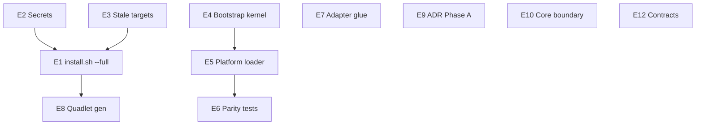

# Epic — Architecture Simplification & Operational Convergence

> **Status:** filed on GitHub — parent [#1928](https://github.com/Roxabi/roxabi-factory/issues/1928)
> **Owner:** mickael
> **Created:** 2026-06-17
> **Updated:** 2026-06-17 (post-review: architect + axial-drift + devops)
> **Audit source:** architecture review 2026-06-17 + structural review 2026-06-10
> **Related shipped work:** #1578 (`make converge` + autoupdate — Shape 2 landed; first-boot collapse incomplete)
> **Child issues:** 12 (E1–E12). E9 = Phase A only. E11 = follow-up linked #1812/#1813.
> **SSoT doc:** this file — update when children merge or scope shifts.

---

## TL;DR

Lyra's **stage-axis architecture holds** (ADR-073): adapters are thin, inbound stages are centralized, packages are factory-agnostic. The remaining complexity tax is concentrated in three places:

1. **Operational fragmentation** — first-boot still requires 4+ overlapping commands; `install.sh` alone **does not install Telegram/Discord** (no `.container` without render); stale Makefile secrets target disagrees with `install.sh`.
2. **Dual wiring topologies** — `factory start` (unified) and the 9-process production layout maintain parallel bootstrap paths (~5.9k LOC in `src/factory/bootstrap/`) that have already proven they can diverge.
3. **Boundary debt** — 163 `except Exception` sites vs ADR-073 target ≤30 (trigger fired); 9 `ignore_imports` in `.importlinter`; infra-in-core pockets (`core/cli/`, `memory_schema.py`).

This epic collapses manual deploy steps into one bootstrap verb, unifies secrets installation, deduplicates bootstrap/wiring, extracts remaining adapter glue for N+1 platform readiness, and resolves ADR-073 broad-catch policy (Phase A).

**Appetite:** 4 weeks (O1–O7 + E4–E7). E9 Phase B (burn-down 163→50) and E10 are P2 non-blocking for epic closure.

**Outcome:** One first-boot command; `converge` unchanged but documented as distinct from `bootstrap`; new platform adapter needs **<80 lines** platform-specific glue; unified/standalone parity guarded by resource-level contract tests; ADR broad-catch policy decided and recorded.

---

## Review consensus (2026-06-17)

| Reviewer | Verdict |
|----------|---------|
| Architect | APPROVE WITH CHANGES |
| Axial-drift | SAFE WITH GUARDS |
| DevOps | SHIP WITH FIXES |

**Already shipped (remove from scope):**
- `check_secrets_drift.sh` in CI (`.github/workflows/ci.yml`)
- `OutboundDispatcher._queue` bounded (`maxsize=50`, drop-oldest) — `outbound_dispatcher.py`
- Audio unified/standalone parity — `wiring_helpers.py` starts `start_audio_consumer`
- SanitizedError multi-site policy — already in ADR-073 amendment

**Critical ops fact:** `./deploy/install.sh` copies only `*.container` static files. TG/DC exist only as `.container.tmpl` — **adapters are absent** if operator skips `make quadlet-install`.

**Rule:** `make converge` stays on `quadlet-install NO_RESTART=1` + subsets. `make bootstrap` / `install.sh --full` = first-boot only.

---

## Problem

### 1. Manual deploy steps are incident fuel

Production auto-convergence (`make converge` + three timers) works. First-boot and recovery paths do not:

| Smell | Evidence |
|-------|----------|
| `install.sh` does not render `.tmpl` | `install.sh:313-317`; only `factory-telegram.container.tmpl` / `factory-discord.container.tmpl` exist |
| Stale secrets target | `Makefile:205-223` missing 6 secrets vs `deploy/generated/secrets-manifest.sh` |
| Deprecated NATS setup | `make nats-setup` → `deploy/nats/setup.sh` (host NATS retired, still executable) |
| Manual service starts | `install.sh:348` defers restart; omits `factory-omp` in message |
| Manual JetStream bootstrap | `bootstrap_streams.py` not in install/converge; runbook manual step |
| Doc/implementation drift | `quadlet-install.md:52`, `deploy/CLAUDE.md:111` say conditional `quadlet-install`; `factory-quadlet-sync.sh` runs `make converge` |
| Triple secret-bootstrap | `provision.sh`, `install.sh`, `Makefile` |
| `full-deploy` / remote `deploy` | Still call `quadlet-secrets-install` (`Makefile:275`) |

### 2. Dual topology = proven divergence vector

| Mode | Entry | Wiring path |
|------|-------|-------------|
| Dev/local | `factory start` | `unified.py` → `wiring_helpers.py` |
| Production | 9 containers | `standalone/*` + `standalone_*.py` + `wire_bot_common` |

**Asymmetry to decide explicitly:** `hub_standalone.py` provisions audit/jobs/active-jobs KV/DLQ; `unified.py` provisions audio stream/KV only. E4 `HubProvisioner` must document this — not silently extend unified.

Bootstrap: **53 files, ~5,906 LOC**.

### 3. Adapter glue duplication blocks platform #3

Thin glue (~30–40 lines per concern): typing shims, inbound context, `_validate_inbound` twins, pipeline singletons, Discord oversize hardcoded English.

### 4. Layer boundary debt

| Trigger | Committed | Measured | Status |
|---------|-----------|----------|--------|
| `boundary-broad-catch` ≤30 | ADR-073 | **163 / 97 files** | **FIRED** |
| `wiring-bootstrap-deps` ≤30 | ADR-073 | **27** markers (0 in bootstrap/) | Under threshold |
| TYPE_CHECKING exemptions | ADR-048 | **9** `ignore_imports` entries | In progress |
| `OutboundDispatcher._queue` | docs | **Bounded (50)** | **DONE** |
| SanitizedError sites | ADR-073 | 10 documented sites | **DONE** (ADR amended) |

### 5. Config & secrets quadruple SSoT

`quadlet.toml` + `secrets-policy.toml` + `generated/secrets-manifest.sh` + `acl-matrix.json`. Bot tokens (`factory-bot-*`) remain dynamic via render — out of manifest by design.

### 6. Hors scope ops-critical (documented, not in epic closure)

- Schema-floor deploys (timer-off + coordinated restart)
- GHCR `podman login` on fresh host
- `factory bot secret install` per bot (separate onboarding runbook)
- voiceCLI first-boot (`converge.sh` handles on prod host)
- `factory-blobstore-sweep.timer`

---

## Outcome (epic-level acceptance criteria)

- [ ] **O1 — One bootstrap verb:** `install.sh --full` / `make bootstrap` = secrets → render → copy → timers → NATS wait → `bootstrap_streams.py` → optional `--start`. Prereqs documented: nkeys, `config.toml`, GHCR, `factory bot secret install`.
- [ ] **O2 — Secrets installer unification:** `quadlet-secrets-install` → `install.sh --secrets-only`; `provision.sh` delegates; all callers audited (`full-deploy`, docs).
- [ ] **O3 — Bootstrap DRY kernel:** `require_nats_url()`, `connect_nats_or_exit()`, `run_standalone_worker()`, `HubProvisioner` (scoped), platform loader via **hook registry** (not `if platform ==`).
- [ ] **O4 — Wiring parity:** Contract tests assert **resource parity** (audio consumer, outbound listener, typing, stream/KV) — not structural identity. Exclusions documented: `wait_for_hub`, embedded NATS, hub-only audit/jobs/DLQ.
- [ ] **O5 — Adapter glue kit:** Platform #3 needs wire parser, formatter, API calls only.
- [ ] **O6 — ADR broad-catch policy:** Phase A decision recorded (burn-down vs re-baseline). Phase B optional follow-up.
- [ ] **O7 — Quadlet generator:** Parameterized adapter template + shared fragments.
- [ ] **O8 — No stale deploy docs:** nats-setup, conditional quadlet-sync, wrong secrets target — fixed across runbooks + `deploy/CLAUDE.md` + systemd unit descriptions.

---

## Non-goals

- Replacing Podman Quadlet
- Merging `:staging` / `:staging-svc` images
- Full `except Exception` elimination
- Agent secret broker (`artifacts/analyses/agent-secret-broker.md` — separate epic)
- E11 RuntimePort (coupled #1812/#1813 — child tracked, not blocking closure)
- E9 Phase B burn-down 163→50 (separate issue if chosen)
- Changing `make converge` to call `install.sh --full`

---

## Child issues (12)

| ID | GitHub | Title | Wave | Blocked by |
|----|--------|-------|------|------------|
| E1 | [#1933](https://github.com/Roxabi/roxabi-factory/issues/1933) | Collapse first-boot to `install.sh --full` | W2 | E2, E3 |
| E2 | [#1929](https://github.com/Roxabi/roxabi-factory/issues/1929) | Unify secrets installer | W1 | — |
| E3 | [#1930](https://github.com/Roxabi/roxabi-factory/issues/1930) | Retire stale deploy targets + doc drift | W1 | — |
| E4 | [#1934](https://github.com/Roxabi/roxabi-factory/issues/1934) | Bootstrap shared kernel | W2 | — |
| E5 | [#1935](https://github.com/Roxabi/roxabi-factory/issues/1935) | Platform bot loader (hook registry) | W3 | E4 |
| E6 | [#1936](https://github.com/Roxabi/roxabi-factory/issues/1936) | Wiring parity contract tests | W3 | E4, E5 |
| E7 | [#1931](https://github.com/Roxabi/roxabi-factory/issues/1931) | Adapter glue kit | W1 | — |
| E8 | [#1938](https://github.com/Roxabi/roxabi-factory/issues/1938) | Quadlet template generator | W4 | E1 ✓ |
| E9 | [#1937](https://github.com/Roxabi/roxabi-factory/issues/1937) | ADR broad-catch Phase A | W3 | — |
| E10 | [#1939](https://github.com/Roxabi/roxabi-factory/issues/1939) | Core boundary cleanup | W4 | — |
| E11 | [#1940](https://github.com/Roxabi/roxabi-factory/issues/1940) | RuntimePort extraction (follow-up) | — | #1812/#1813 |
| E12 | [#1932](https://github.com/Roxabi/roxabi-factory/issues/1932) | Clipool subjects → contracts | W1 | — |

> Native `blocked_by` (via `issue-triage` / GraphQL): #1933←{#1929,#1930}, #1935←#1934, #1936←{#1934,#1935}, #1938←#1933.

---

### E1 — Collapse first-boot to `install.sh --full`

**Priority:** P0 · **Size:** M · **Type:** feat · **Lane:** infra

**Problem:** First-boot requires install + quadlet-install + manual starts + bootstrap_streams. `install.sh` alone leaves **no TG/DC units**.

**Scope:**

1. Extend `deploy/install.sh`:
   - Render `.container.tmpl` via `tools/render_quadlet.py`
   - Parity with `quadlet-install`: stale unit rm, jetstream `chmod 0700`, optional `quadlet-install-verify.sh`
   - Wait for NATS health → `deploy/nats/bootstrap_streams.py` (creates `factory-events` / `factory-metrics` only — hub remains SSoT for audio/jobs per ADR-079)
   - `--start`: ordered start including **`factory-omp`** (9 containers)
   - `--full`: secrets + render + copy + streams + timers + optional start
   - `--dry-run`: print planned steps
2. `make bootstrap` → `./deploy/install.sh --full`
3. Document prereqs: nkeys (`factory-acl genkeys --ack-external-distribution`), `config.toml`, GHCR reachable, `factory bot secret install`
4. **Do not change** `converge.sh` (stays `quadlet-install NO_RESTART=1`)

**Blocked by:** E2, E3

---

### E2 — Unify secrets installer; fix Makefile drift

**Priority:** P0 · **Size:** S · **Type:** fix · **Lane:** infra

**Problem:** `make quadlet-secrets-install` missing 6 secrets vs manifest.

**Missing from Makefile:** `factory-nats-blobstore`, `factory-nats-turn-writer`, `factory-nats-omp`, `factory_blobstore_token`, `factory-litellm-key` (+ generated blobstore).

**Scope:**

1. `Makefile` `quadlet-secrets-install` → `./deploy/install.sh --secrets-only`
2. `provision.sh` L396–461 → delegate to `install.sh --secrets-only`
3. Audit callers: `full-deploy`, `deploy` remote, docs
4. ~~CI drift check~~ already in `ci.yml` — verify only

**Blocks:** E1

---

### E3 — Retire deprecated deploy targets and fix doc drift

**Priority:** P0 · **Size:** S · **Type:** chore · **Lane:** infra

**Scope:**

1. Replace `make nats-setup` with cold-path wrapper (`factory-acl genkeys --ack-external-distribution` or documented equivalent for container NATS)
2. `deploy/nats/setup.sh` → exit 1 + migration message
3. Fix: `docs/runbooks/quadlet-install.md`, `deploy/CLAUDE.md` (timer table L111), `docs/GETTING-STARTED.md`, `docs/DEPLOYMENT.md`, `install.sh` error strings
4. `deploy/systemd/factory-quadlet-sync.service` Description → reflects `make converge`
5. `full-deploy` / `deploy`: deprecate with exit 1 or redirect to converge

**Blocks:** E1

---

### E4 — Bootstrap shared kernel

**Priority:** P1 · **Size:** M · **Type:** refactor · **Lane:** core

**Scope:**

1. `bootstrap/infra/nats_bootstrap.py` — `require_nats_url()`, `connect_nats_or_exit()`
2. `bootstrap/infra/worker_bootstrap.py` — clipool/omp skeleton
3. `bootstrap/infra/hub_provisioner.py` — **scoped:**
   - `provision_audio(js)` — shared hub_standalone + unified
   - `provision_hub_services(js)` — audit/jobs/active-jobs/DLQ — **hub_standalone only** (documented; do not add to unified silently)
4. Align `__main__.py` with `cli._boot()`
5. Avoid new imports of adapters private symbols — prefer public/protocol surfaces

**Blocks:** E5

**Axial guard:** grep CI — `ensure_stream`/`ensure_kv` for audio only from hub/unified/hub_provisioner.

---

### E5 — Platform bot loader (hook registry)

**Priority:** P1 · **Size:** M · **Type:** refactor · **Lane:** core

**Scope:**

1. `PlatformBootstrapHooks` Protocol — per-platform: teardown_fn, pre_wire hooks (DC: thread store, watch_channels; TG: webhook tuple)
2. `load_platform_bots(platform, raw_config, nc, hooks)` — no monolithic `if platform ==` beyond dispatch to registry
3. `bootstrap_platform_standalone(nc, platform, raw_config, hooks)` — setup → `wait_for_hub(nc)` once → teardown
4. Thin `standalone_telegram.py` / `standalone_discord.py` (<80 LOC target)

**Blocked by:** E4 · **Blocks:** E6

**Axial guard:** exactly one `wait_for_hub` per standalone platform; never in unified.

---

### E6 — Unified/standalone wiring parity contract tests

**Priority:** P1 · **Size:** S · **Type:** test · **Lane:** core

**Scope:**

1. `tests/bootstrap/test_wiring_parity.py` — mock call counts on:
   - `start_audio_consumer` per bot
   - `NatsOutboundListener` per bot
   - `TypingListener` per bot (or equivalent typing wiring)
   - `HubProvisioner.provision_audio` (unified + hub path)
2. Parity matrix in `src/factory/bootstrap/CLAUDE.md`:

| Resource | Unified | Standalone | Notes |
|----------|---------|------------|-------|
| Audio stream/KV | hub/unified | hub_standalone | ADR-079 sole-provisioner |
| Audio consumer | wiring_helpers | wire_bot_common | |
| `wait_for_hub` | ✗ | ✓ per platform | ADR-079 S3 |
| Audit/jobs/DLQ | ✗ (hub container) | hub_standalone | intentional |

**Blocked by:** E4, E5

---

### E7 — Adapter glue kit extraction

**Priority:** P1 · **Size:** S · **Type:** refactor · **Lane:** adapters

**Scope:** `typing_shim.py`, `inbound_context.py`, `inbound_pipeline.py` (resettable in tests, not opaque global), `platform_meta.py`, Discord oversize i18n, `nats/_constants.py`.

**Axial guards:**
- No `factory.inbound` imports from new shared modules
- `run_inbound_guarded` must **net-zero** increase in `except Exception` count (remove TG/DC duplicates)
- Trust stays `PUBLIC` at adapter ingress

**Parallel-safe** with E4/E5.

---

### E8 — Quadlet template generator + adapter template merge

**Priority:** P2 · **Size:** M · **Type:** feat · **Lane:** infra

**Scope:** `common_fragments` in `quadlet.toml`, extend `render_quadlet.py`, merge TG/DC → `factory-adapter.container.tmpl`, snapshot test byte-identical render, `quadlet-lint` CI.

**Blocked by:** E1

---

### E9 — ADR broad-catch Phase A (policy + gates)

**Priority:** P2 · **Size:** S · **Type:** refactor · **Lane:** core

**Scope (Phase A only):**

1. Decision issue: burn-down toward ≤30 vs re-baseline with taxonomy (boundary vs bug-mask) — amend ADR-073
2. Pre-push `str(exc)` gate in bus-bound paths (script exists in CI — extend to pre-push if missing)
3. ~~Bound OutboundDispatcher queue~~ **DONE — out of scope**

**Phase B (optional separate issue):** core/inbound burn-down 163→50 — not required for epic closure.

---

### E10 — Core boundary cleanup

**Priority:** P2 · **Size:** M · **Type:** refactor · **Lane:** core

**Scope:** Protocol-only Hub/Agent constructors; move `json_agent_store`, `memory_schema` to infrastructure; DI `ProcessorRegistry`; reduce `ignore_imports` to ≤3; re-export shim **max 1 release** with dated removal ticket.

---

### E11 — RuntimePort extraction (follow-up, non-blocking)

**Priority:** P3 · **Size:** M · **Type:** refactor · **Linked:** #1812, #1813

Extract `RuntimePort` when runtime selection lands. Not required for epic closure.

---

### E12 — Clipool subjects → roxabi-contracts

**Priority:** P3 · **Size:** S · **Type:** feat · **Lane:** contracts

Replace literals in 4+ files: `clipool_worker.py`, `llm_client.py`, `hub_llm_client.py`, `cli_pool_codec.py`. Link #1793 taxonomy family.

---

## Dependency graph

## Wave schedule

| Wave | Issues | Notes |
|------|--------|-------|
| W1 | E2, E3, E7, E12 | Safe on M1; won't break converge |
| W2 | E1, E4 | E1 after E2/E3 |
| W3 | E5, E6, E9 | |
| W4 | E8, E10 | E8 after E1 |

E11 on #1812/#1813 timeline.

## Quick wins (W1)

| # | Action | Issue |
|---|--------|-------|
| Q1 | Delegate `quadlet-secrets-install` → `install.sh --secrets-only` | E2 |
| Q2 | Replace `nats-setup` + fail-hard `setup.sh` | E3 |
| Q3 | Fix doc drift (CLAUDE.md, runbook, systemd Description) | E3 |
| Q4 | Extract `require_nats_url()` | E4 |
| Q5 | Discord oversize i18n | E7 |
| Q6 | `nats/_constants.py` | E7 |

## Metrics

| Metric | Baseline | Target |
|--------|----------|--------|
| First-boot commands | 4+ | 1 |
| Deploy Makefile targets (primary) | 9+ overlapping | `converge` + `bootstrap` |
| Bootstrap LOC | ~5,906 | ~4,500 |
| Secrets install paths | 3 | 1 |
| `except Exception` | 163 | policy decided (Phase A) |
| `ignore_imports` | 9 | ≤3 (E10) |

## References

- `artifacts/analyses/architecture-structural-review-2026-06-10.md`
- `artifacts/analyses/1578-collapse-deploy-atomic-analysis.mdx`
- `docs/ARCHITECTURE.md`
- `deploy/converge.sh`, `deploy/install.sh`
- #1578, #1284, #1793, #1812, #1813

## GitHub

- **Parent epic:** [#1928](https://github.com/Roxabi/roxabi-factory/issues/1928)
- **Children:** #1929–#1940 (12 sub-issues linked via GitHub sub-issues API)
- **Native blocked_by:** #1933←{#1929,#1930}, #1935←#1934, #1936←{#1934,#1935}, #1938←#1933 (set via `bun triage.ts set --blocked-by`)

---

*Last updated: 2026-06-17 — filed on GitHub after tri-expert review.*