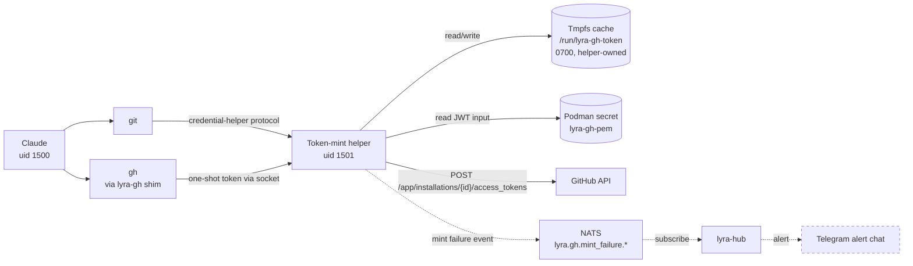
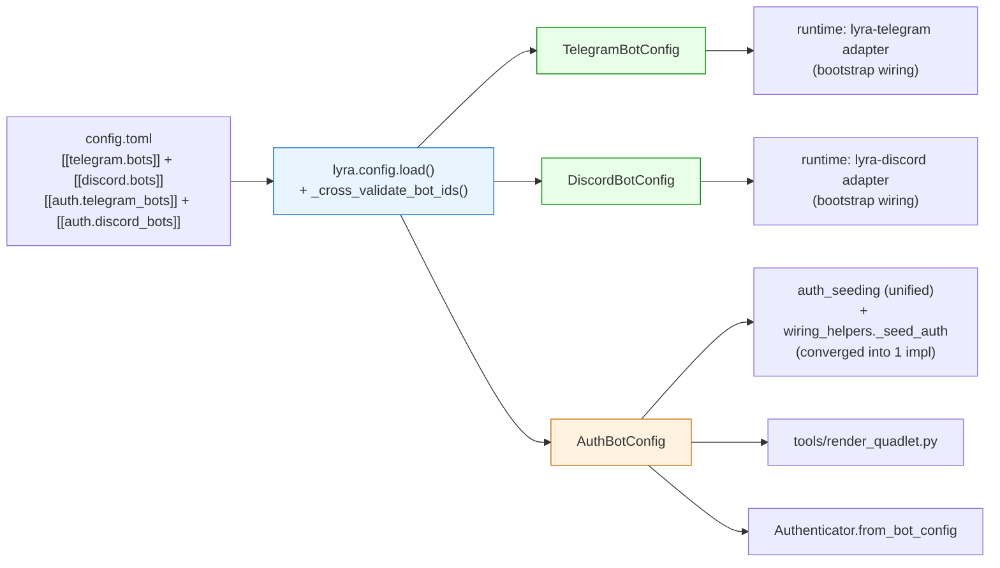

--- Result 1 (score: 0.590) ---
File: docs/architecture/adr/074-bot-credential-delivery-podman-secrets.mdx:120-133 [markdown]
## Consequences

### Positive

- Fits ADR-055 Quadlet credential-store pattern — bot secrets join nkeys and NATS auth tokens
  in the same `type=mount` Podman secret plane; no second credential mechanism.
- Per-bot rotation: `lyra bot secret install <platform> <bot_id>` + `make <svc> restart` —
  operator does not touch `config.db` or any encryption key.
- `config.db` mount is stripped from adapter `.container` files; adapters have no read access
  to the broader configuration DB (reduced blast radius on adapter container compromise).
- Adapter bootstrap is simpler: one `Path.read_text()` per bot vs. DB open + Fernet decrypt.
- `~/.lyra/keyring.key` is safe to remove once `LyraKeyring` has no remaining consumers (all
  adapter-path imports removed; any surviving consumers in `config.db` sibling stores must be
  documented in `src/lyra/infrastructure/CLAUDE.md` before deletion).

--- Result 2 (score: 0.590) ---
File: artifacts/specs/1057-bot-token-podman-secrets-spec.mdx:111-126 [markdown]
## Breadboard

### Affordances

| ID | Affordance | Surface |
|---|---|---|
| U1 | `lyra bot secret install <platform> <bot_id> [--from-env VAR] [--webhook-from-env VAR]` | CLI |
| U2 | `lyra bot secret rm <platform> <bot_id>` | CLI |
| U3 | `lyra bot secret list` | CLI |
| U4 | `lyra bot secret migrate` | CLI (one-shot) |
| N1 | Adapter bootstrap reads `/run/secrets/bot_token-<bot_id>` (+ optional `bot_webhook-<bot_id>`) | bootstrap path |
| N2 | Quadlet `Secret=` line(s) per bot in `.container` | deploy/quadlet |
| S1 | Drop `bot_secrets` DDL from `CredentialStore.connect` | schema |
| S2 | Delete `CredentialStore` class file | code |
| S3 | Delete `LyraKeyring` iff no `config.db` sibling-store consumer remains; otherwise retain + document scope | code |
| S4 | Strip `~/.lyra/config.db` mount from adapter `.container` | deploy/quadlet |

--- Result 3 (score: 0.586) ---
File: docs/architecture/adr/074-bot-credential-delivery-podman-secrets.mdx:28-41 [markdown]
This layer was deleted in #1057 (Phase 3 of Epic #1049, shared-state migration). The rationale:

- The DB-at-rest encryption requires a master key (`keyring.key`); the key is itself a secret
  that must be delivered to every adapter container, widening the attack surface.
- Per-bot rotation required a DB write + adapter restart — no native per-secret granularity.
- Config.db was already mounted read-only in adapter containers; the credential path was the
  last non-read-only consumer.
- Podman secrets are already the delivery mechanism for NATS nkeys and NATS auth tokens in the
  Lyra Quadlet ecosystem (ADR-055). Extending the same pattern to bot tokens avoids a second
  credential plane.

Issue #1057 replaces the credential layer with Podman secrets mounted into each adapter
container at bootstrap. The spec (`artifacts/specs/1057-bot-token-podman-secrets-spec.mdx`)
defines the full data model, CLI affordances, migration command, and success criteria.

--- Result 4 (score: 0.586) ---
File: artifacts/specs/1078-github-app-identity-spec.mdx:122-150 [markdown]
### Consumer map



--- Result 5 (score: 0.585) ---
File: docs/architecture/messaging.md:326-330 [markdown]
## See also

- Security & ACLs → `/home/mickael/projects/lyra/docs/architecture/security-routing.md` (covers ADR-051, 064, 046, 057, 069)
- Cross-project contracts → `/home/mickael/projects/lyra/docs/architecture/contracts.md` (covers ADR-045, 049, 052)
- LLM streaming pipeline → `/home/mickael/projects/lyra/docs/architecture/llm-streaming.md` (covers ADR-032, 070)

--- Result 6 (score: 0.584) ---
File: artifacts/audits/1078-token-isolation-audit.mdx:22-26 [markdown]
| I-5 | PEM unreadable to uid 1500 | ✓ | `Secret=lyra-gh-pem,type=mount,target=gh-app.pem,mode=0400,uid=1501,gid=1501` |
| I-6 | JWT signing rejects non-RSA / password-protected keys | ✓ | `helper.py:87-92` — `load_pem_private_key(raw, password=None)` + `isinstance(key, RSAPrivateKey)` guard. |
| I-7 | install_id numeric-validated before URL composition | ✓ | `helper.py:205-208` — `_INSTALL_ID_RE` match before any HTTP call; raises `ValueError`. |
| I-8 | Rate-cap honoured under burst | ✓ | `refresh.py:mint_capped` — fast-path cache → `async with lock` → re-check → `await rate_limiter.wait()`. Test `test_refresh_and_caps` asserts 12 concurrent calls = 1 GitHub hit. |
| I-9 | Token never logged | ✓ | All `log.*` call sites in helper.py / dispenser.py / refresh.py log only metadata (subject, exc, machine, reason) — never `token` or `password`. Shells never `echo $TOKEN`; only metadata error messages. |

--- Result 7 (score: 0.584) ---
File: docs/architecture/adr/archive/054-credential-store-and-uid-rework.mdx:70-74 [markdown]
### 5. File-based credentials delivered via Podman secrets (revised)

**Revision (2026-04-24, post-cutover):** the first Phase 1 cutover attempt failed with `failed to setup loop device for .../deploy/nats/auth.conf` from the NATS container. Root cause: Quadlet `.volume` units wrapping a single file (`Type=bind` + `Device=%h/.lyra/nkeys/auth.conf`) trigger Podman's loop-device code path, which expects a block device or directory. Four units were affected: `lyra-nats-auth.volume` + three nkey-seed volumes (`lyra-nkey-{hub,telegram-adapter,discord-adapter}.volume`).

**Resolution:** replace the four file-wrapping `.volume` units with Podman secrets. Each secret is imported from `~/.lyra/nkeys/` via `make quadlet-secrets-install` (calls `podman secret create --replace`), and consumed by containers with `Secret=<name>,type=mount,target=<filename>,mode=0400[,uid=1500,gid=1500]`. Podman mounts each secret as a tmpfs file at `/run/secrets/<filename>` — no loop device involved.

--- Result 8 (score: 0.583) ---
File: artifacts/1145-cluster-D-deploy-streaming-audit.md:297-308 [markdown]
### ADR-054 — Quadlet Credential-Store and UID Rework

**Body status:** Accepted. Supersedes ADR-053 Decisions 4+5.

**Normative claims:**
- D1: `lyra-data.volume` as bind-mount of `%h/.lyra`.
- D2: `UserNS=keep-id` in all three containers (replacing `User=lyra`).
- D3: Adapter data mount `:z` without `:ro`.
- D4: `telegram.env.example` and `discord.env.example` deleted; `hub.env.example` retained.
- D5: File-based credentials via Podman secrets (`type=mount`).

**Code check:**

--- Result 9 (score: 0.583) ---
File: artifacts/plans/1330-v8-http-fronted-blobstore-plan.mdx:154-165 [markdown]
| T9 .importlinter + root CLAUDE.md hygiene | 2 files | bounded | 3 | — |
| T10 V2 RED-GATE | pytest + lint-imports | bounded | 3 | — |
| T11 V3 audit + readiness tests | 1 test file | bounded | 4 | — |
| T12 BlobAuditEvent contract | 2 files | bounded | 3 | — |
| T13 BlobAuditSink + serve.py startup wiring | 2 files | judgmental | 6 | — |
| T14 V3 RED-GATE | pytest + nats sub smoke | bounded | 3 | — |
| T15 conftest on_m1 + integration marker + cross-host test scaffold | 2 files + pyproject | bounded | 4 | — |
| T16 lyra-blobstore.container + env example | 2 files | judgmental | 5 | — |
| T17 quadlet.toml + deploy/CLAUDE.md + secret provisioning | 3 files | judgmental | 5 | — |
| T18 security review of auth + secret | read-only | bounded | 4 | — |
| T19 V4 RED-GATE (integration on M₁ + M₂ smoke) | live test | judgmental | 5 | — |
| T20 src/lyra/blobstore/CLAUDE.md + root CLAUDE.md hygiene row | 2 files | bounded | 3 | — |

--- Result 10 (score: 0.583) ---
File: src/lyra/tools/gh_token/dispenser.py:1-24 [python]
"""Unix socket dispenser for the lyra-gh token-mint helper.

Listens on /run/lyra-gh-token/dispenser.sock (mode 0660, group
lyra-tokenuser) and serves git-credential protocol responses. The dispenser
is the IPC seam between the helper-uid daemon (1501) and the Claude-uid
client (1500); they share the lyra-tokenuser group (gid 1502) so the
credential helper / lyra-gh shim can connect, but the cache file
/run/lyra-gh-token/token.json (mode 0600) remains unreadable to uid 1500.

Protocol (per https://git-scm.com/docs/git-credential#IOFMT):
  Client sends one line: "get\\n" or "peek\\n"
  Server responds:
    username=x-access-token\\n
    password=<token>\\n
    \\n
  Anything else → server writes "error=unsupported request\\n" and closes.
"""

from __future__ import annotations

import asyncio
import logging
import os
from datetime import datetime, timezone

--- Result 11 (score: 0.582) ---
File: artifacts/plans/1057-bot-token-podman-secrets-plan.mdx:476-483 [markdown]
#### T11 — Clean remaining CredentialStore consumers + docstrings

- **Files:**
  - `src/lyra/cli_bot.py` — remove `_make_store`, the top-level imports, and update `migrate` (T6) to read from the now-deleted CredentialStore. Migrate command becomes a no-op stub that prints "migrate already completed; this command is a no-op post-slice 3" (or is deleted entirely — see DP point in spec edge cases). Recommended: DELETE the `migrate` subcommand since slice 3 follows slice 2 by definition.
  - `src/lyra/cli_setup.py` — remove `cred_store` parameter + CredentialStore/LyraKeyring imports; replace L101 `creds = await cred_store.get_full(...)` with `creds = _load_bot_token("telegram", bot_id)` (use helper from T9 or inline it).
  - `src/lyra/config.py` — update 5 docstring lines that mention `CredentialStore` to reference `/run/secrets/bot_token-<bot_id>` instead.
- **Verify:** `grep -rF "CredentialStore" src/lyra/ | grep -v "git\|__pycache__" | wc -l` → 0
- **Expected:** 0 matches

--- Result 12 (score: 0.582) ---
File: artifacts/frames/1362-v8-1-hardening-cleanup-frame.mdx:1-13 [markdown]
---
title: V8.1 hardening + cleanup pass (parking-lot from PR #1358)
issue: 1362
status: approved
tier: F-lite
date: 2026-05-25
---

## Problem

PR #1358 (closes #1330 — V8 HTTP-fronted BlobStore) shipped the production service. The `/code-review` Phase 3 multi-domain pass surfaced 12 non-structural items that were not blocking — flagged by a single agent, or below the confidence threshold, or design tradeoffs rather than bugs. Letting them rot in a PR comment violates the "drain the parking-lot" pattern that keeps review-debt from accumulating across sprints.

The list spans three buckets:

--- Result 13 (score: 0.582) ---
File: artifacts/analyses/quality-audit-2026-05-26/AUDIT-SUMMARY.md:232-234 [markdown]
| Security posture | 15 | 10 | No critical runtime vulns; 1 High (audio path traversal). Residual risks are config-time (env paths, NATS ACL over-permission #1293) and operational (PII in logs, log injection). GH token dispenser is mature (0600 cache, 15-min TTL, abuse limiter). |
| Code smell density | 15 | 8 | 242 findings; god classes persist (`Hub`, `OutboundRouter`, `PoolManager`, `OutboundEmitter`); 167-line dispatch function; 124-line config setter; significant DRY violations in packages and tests. No 300-line file exemptions violated in `src/lyra/`, but 2 package files exceed cap without exemption. |
| Type safety coverage | 15 | 11 | Strong in core: near 100 % public return types, 2 `# type: ignore` in hub, 0 `cast()` / `assert isinstance()`. Gaps: file-level pyright suppression in bootstrap (`wiring_helpers`), 34 `Any` in `roxabi_nats/_serialize`, duck-typed `object` for TTS/router. |

--- Result 14 (score: 0.581) ---
File: tests/nats/test_gen_nkeys_acls.sh:223-235 [bash]
# ── #715 / ADR-051 — per-identity inbox prefix assertions ────────────────────
# For each lyra-owned identity the generated auth.conf MUST contain the
# scoped prefix form and MUST NOT contain the bare wildcard in any allow-list.
#
# Scope:
#   Lyra-owned (narrowed this PR): hub, telegram-adapter, discord-adapter,
#                                   tts-adapter, stt-adapter
#   Satellite (out of scope this PR, unchanged): voice-tts, voice-stt, image-worker
#
# Lowercase _inbox.<identity>.> is required for tts-adapter and stt-adapter
# because both rows carried _inbox.> defensively (nats-py case sensitivity).

LYRA_IDENTITIES=(hub telegram-adapter discord-adapter tts-adapter stt-adapter)

--- Result 15 (score: 0.580) ---
File: docs/architecture/security-routing.md:1-22 [markdown]
# Lyra — Security, Routing & Memory Isolation

> Reference document. Last updated: 2026-05-09.
> **Status**: #auth (#151 ✅), #routing (#152 ✅), #commands ✅ (CommandParser shipped), #memory-isolation — partially implemented (user_id partition active in prefs_store; full MemoryEntry metadata schema not yet applied).

---

## Overview

4 domains that together ensure an authorized user receives the correct response, from the correct agent, on the correct channel, with isolated memory.

```
[Channel] → Authenticator + GuardChain  (who may speak?)
          → CommandParser               (what action?)
          → Bus → Router                (which agent / pool?)
                  → ComplexityEstimator → LLMConfig   (which model?)
                  → Agent → MemoryManager (absolute user_id filter)
                          → RoutingContext (correct bot + correct channel)
          → Adapter (verifies routing before send)
```

---

--- Result 16 (score: 0.580) ---
File: artifacts/analyses/quality-audit-2026-05-26/security/P05-adapters.md:15-16 [markdown]
| `src/lyra/tools/gh_token/helper.py` | 87 | Low | `JWTSigner` calls `serialization.load_pem_private_key(raw, password=None)`, which rejects password-protected PEMs. This forces operators to store the private key unencrypted at rest. | Support an optional `LYRA_GH_PEM_PASSWORD` env var; pass it as `password=password.encode()` when present, preserving backward compatibility for unencrypted PEMs. |
| `src/lyra/adapters/clipool/clipool_worker.py` | 156 | Low | `heartbeat_payload` exposes `len(self._pool._entries)` over the NATS heartbeat subject. While the subject is restricted, this leaks internal operational state (pool size) without an opt-out. | Remove `pool_count` from the default heartbeat payload or gate it behind an explicit `CLIPOOL_HEARTBEAT_VERBOSE=1` flag. |

--- Result 17 (score: 0.579) ---
File: artifacts/specs/1369-quadlet-bot-secret-render-spec.mdx:195-199 [markdown]
- [ ] **A7** — `docs/QUADLET-DEPLOYMENT.md` "Bot credentials" section contains exactly these subsections (verifiable by header check):
  - (a) **No manual splicing** — explicit statement that fragment-paste workflow is gone; tracked templates are pure
  - (b) **Bot onboarding** — exact sequence `lyra bot secret install <platform> <bot_id>` → edit `~/.lyra/config.toml` `[[auth.<platform>_bots]]` → `make quadlet-install` → `systemctl --user restart lyra-<platform>`
  - (c) **CI guard** — references `tools/check_quadlet_template_purity.sh` + `make quadlet-lint`
  - (d) **Multi-host caveat** — note that Syncthing-synced `config.toml` enumerates all bots on all hosts; each host must have the matching Podman secrets installed before enabling the adapter unit (or the adapter will fail at restart with `secret not found`)

--- Result 18 (score: 0.579) ---
File: artifacts/specs/1412-share-pydantic-bot-config-spec.mdx:159-178 [markdown]
### Consumer map



--- Result 19 (score: 0.579) ---
File: artifacts/plans/1057-bot-token-podman-secrets-plan.mdx:651-661 [markdown]
|---|---|---|---|
| T8 | tester-A | T17 | RED adapter /run/secrets/ tests (token, webhook, missing-file) |
| T9 | backend-dev-A | T8 | GREEN adapter_standalone.py rewrite (both telegram+discord blocks) |
| T10 | backend-dev-A | T9 | DELETE credential_store.py + remove from __init__.py + bootstrap_stores.py cred_store block |
| T11 | backend-dev-A | T10 | Clean cli_bot.py/_make_store + cli_setup.py/cred_store param + config.py docstrings |
| T12 | devops-A | T9 | Update lyra-telegram.container (add Secret= lines, strip config.db) |
| T13 | devops-A | T12 | Update lyra-discord.container (mirror) |
| T14 | doc-writer-A | T11 | docs/CONFIGURATION.md ## Bot credentials section |
| T15 | doc-writer-A | T14 | src/lyra/infrastructure/CLAUDE.md cleanup |
| T18 | tester-A | T10, T11 | DELETE tests/core/test_credential_store.py + cleanup test_bot_commands.py |
| T16 | tester-A | T11, T12, T13, T18 | RED-GATE V3: multi-bot e2e + no config.db read for credentials |

--- Result 20 (score: 0.579) ---
File: docs/DEPLOYMENT.md:25-35 [markdown]
│   ├── lyra-clipool.container
│   ├── lyra-nats.container
│   ├── lyra-gh-helper.container
│   ├── lyra-gh.pod
│   └── lyra-*.volume
├── config: ~/projects/lyra/config.toml
├── credentials: ~/.lyra/config.db (bot config) + Podman secrets (bot tokens)
├── nkey seeds: ~/.lyra/nkeys/*.seed
├── Podman secrets: lyra-nats-auth, lyra-nats-hub, lyra-nats-telegram, lyra-nats-discord, lyra-nats-clipool
└── logs: journalctl --user -u lyra-hub
```

--- Result 1 (score: 0.574) ---
File: artifacts/specs/1145-adr-consolidation-spec.mdx:80-85 [markdown]
| Consumer | Reads | When | Status |
|---|---|---|---|
| Contributors / IDE | `adr/*.mdx` | Browsing decisions | This issue |
| Fumadocs sidebar | `meta.json` | Doc rendering | This issue |
| `grep` link-check (slice 4) | both dirs | Validation | This issue |
| roxabi-* mirrors | live set as template | Future | Out of scope |

--- Result 2 (score: 0.573) ---
File: artifacts/specs/1494-migrate-adapters-core-wiring-deps-spec.mdx:88-94 [markdown]
## Breadboard

| ID | Affordance (site) | Handler | Removes |
|---|---|---|---|
| A1 | adapters/ Category-A sites (~8) | collapse → `*Deps`, update callers | ~8 markers |
| A2 | core/ Category-A sites (~14) | collapse → `*Deps`/reuse, update callers | ~14 markers |
| A3 | Category-D reserve (llm/nats/integrations, ~8) | collapse only if A1+A2 leave count >30 | margin |

--- Result 3 (score: 0.569) ---
File: artifacts/specs/1150-clipool-agent-identity-spec.mdx:98-107 [markdown]
## Breadboard

### Affordance map

| ID | Affordance | Handler | Data source | Notes |
|---|---|---|---|---|
| N1 | Envelope fields `agent_name`, `agent_email` | `CliCmdPayload` in `packages/roxabi-contracts/src/roxabi_contracts/cli/models.py` | hub | additive minor contract bump (¬security-bearing — auth still owned by GitHub App) |
| N2 | Hub publish path stamps agent identity | hub's clipool LLM driver `src/lyra/nats/cli_nats_driver.py` (publish call site) | `BotAgentStore` + agent row from `~/.lyra/auth.db` | resolve once at publish time |
| S1 | Worker passes fields through | `CliPoolNatsWorker._handle_cmd_streaming` / `_handle_cmd_blocking` in `src/lyra/adapters/clipool/clipool_worker.py` | `CliCmdPayload` | wire `cmd.agent_name`/`agent_email`/`lyra_session_id` into `send`/`send_streaming` |
| S2 | `CliPool.send` / `send_streaming` accept identity kwargs | `src/lyra/core/cli/cli_pool.py`, `cli_pool_streaming.py` | call site

--- Result 4 (score: 0.568) ---
File: artifacts/analyses/493-tool-system-narrative-pt6.md:39-43 [markdown]
Il y a aussi un terme qui a flotté un jour dans une conversation : « lightpool ». Personne ne sait exactement ce qu'il voulait dire. Probablement une confusion avec clipool, le pool de processus Claude qu'on connaît bien. Peut-être une idée en gestation qui n'a pas encore trouvé son contour. Ce mystère-là mérite d'être élucidé avant qu'il devienne une fausse certitude dans les échanges.

Et puis il y a le passage concret, opérationnel : aller du pool partagé actuel vers les instances Quadlet à arobase — ces unités nommées, isolées, une par canal. Ce chemin est tracé, mais le valider sur un prototype avant de le déployer partout est la précaution qui s'impose. On ne bascule pas une topologie de production sur une intuition, même bien fondée.

Ces portes n'obscurcissent pas ce qu'on a vu. Elles indiquent simplement où la promenade continue.

--- Result 5 (score: 0.568) ---
File: artifacts/plans/1067-voice-blobref-workers-plan.mdx:124-150 [markdown]
### Budget — per task

| Task | Items | Class | Est. ops | Split? |
|---|---|---|---|---|
| T1 | 1 | bounded | 3 | — |
| T2 | 1 | bounded | 3 | — |
| T3 | 1 | bounded | 3 | — |
| T4 | 1 | bounded | 3 | — |
| T5 | 1 | bounded | 2 | — |
| T6 | 1 | bounded | 2 | — |
| T7 | 2 | bounded | 3 | — |
| T8 | 1 | bounded | 2 | — |
| T9 | 1 | bounded | 3 | — |
| T10 | 1 | bounded | 3 | — |
| T11 | 1 | bounded | 3 | — |
| T12 | 1 | bounded | 2 | — |
| T13 | 1 | trivial | 1 | — |

**Total estimated ops: 31**

### Budget — per agent instance

| Instance | Tasks | Σ ops | Subjects | Split? |
|---|---|---|---|---|
| backend-dev-A | T1-T6 | 16 | voice | — |
| tester-A | T7-T12 | 16 | testing | — |
| doc-writer-A | T13 | 1 | docs | — |

--- Result 6 (score: 0.568) ---
File: docs/memory-system/04-consolidation-nightly.md:30-46 [markdown]
## Repo de référence
- **kitfunso/hippo-memory** (decay & sleep cycle) – https://github.com/kitfunso/hippo-memory
- **garrytan/gbrain** (reconciliation et nightly job)

**Ce qu'on change** :
- Approche **push** depuis le Raw du jour uniquement (au lieu de tout scanner à chaque fois)
- Decay temporel appliqué en temps réel (background) + recalcul massif nightly
- File de validation humaine pour les cas ambigus (score 0.6-0.85)
- Régénération incrémentale des Compiled Truth uniquement sur les entités impactées

---

**Points clés à retenir :**
- Le Raw Layer reste **immuable** : le job ne fait que lire et dériver.
- 95 % du travail se fait en arrière-plan → l'utilisateur ne voit jamais de latence.
- Même si le job plante, on peut tout rejouer depuis le Raw.
- Le decay et le renforcement se produisent ici (voir 07).

--- Result 7 (score: 0.567) ---
File: artifacts/plans/1150-clipool-agent-identity-plan.mdx:143-162 [markdown]
### Budget

| Task | Items | Class | Est. ops | Split? |
|------|-------|-------|----------|--------|
| T1 contract fields + CHANGELOG | 2 | bounded | 4 | — |
| T2 CliPool.send/send_streaming signatures | 2 | judgmental | 6 | — |
| T3 `_spawn` post-filter env merge | 1 | judgmental | 6 | — |
| T4 worker wires identity through | 2 | bounded | 4 | — |
| T5 contract tests | 1 | bounded | 3 | — |
| T6 hub publish (cli_nats `_build_cmd_payload`) | 1 | judgmental | 6 | — |
| T7 prepare-commit-msg hook script | 1 | bounded | 4 | — |
| T8 `[core] hooksPath` in git.config.tmpl | 1 | trivial | 2 | — |
| T9 Dockerfile COPY + chmod | 1 | bounded | 3 | — |
| T10 docs/agent-management.md update | 1 | bounded | 4 | — |
| T11 hook smoke test | 1 | judgmental | 6 | — |
| T12 V2 env-merge tests | 3 | judgmental | 9 | — |
| T13 V3 hub publish test | 1 | bounded | 4 | — |
| T14 E2E `git log` AC SC#6 | 1 | judgmental | 8 | — |

**Total estimated ops: 69**

--- Result 8 (score: 0.567) ---
File: artifacts/specs/1415-feat-bots-lyra-bot-cli-verbs-spec.mdx:137-149 [markdown]
## Breadboard

### Affordance table

| ID | Affordance | Handler | Store | Notes |
|----|-----------|---------|-------|-------|
| U1 | `lyra agent telegram list` | `telegram/list_cmd.py` | BotStore.get_all() | Filter by platform |
| U2 | `lyra agent telegram show <bot_id>` | `telegram/show_cmd.py` | BotStore.get() | Full field dump |
| U3 | `lyra agent telegram add <bot_id>` | `telegram/add_cmd.py` | BotStore.upsert() | --agent, --webhook-enabled, etc. |
| U4 | `lyra agent telegram edit <bot_id>` | `telegram/edit_cmd.py` | BotStore.get() → upsert() | Interactive prompt |
| U5 | `lyra agent telegram patch <bot_id>` | `telegram/patch_cmd.py` | BotStore.get() → upsert() | --field value |
| U6 | `lyra agent telegram remove <bot_id>` | `telegram/remove_cmd.py` | BotStore.delete() | --yes flag, cascade bot_agent_map |
| U7 | `lyra agent telegram assign <bot_id>` | `telegram/assign_cmd.py` | BotStore.upsert() | --agent required |

--- Result 9 (score: 0.567) ---
File: artifacts/analyses/1482-fiabilite-outbound-audio-analysis.mdx:42-56 [markdown]
## Appetite

1-week cycle. Audio-first; do not boil the ocean on all outbound types.

## Existing precedent (the spine to copy)

`TurnPublisher` is the in-repo α-pattern (ADR-075) and the template:

| Concern | Turns (exists) | Outbound audio (today) |
|---|---|---|
| Publish | `js.publish(SUBJECTS.turn_write)` + await PubAck (`transport/turn_publisher.py:60`) | `nc.publish()` fire-and-forget |
| Stream | `LYRA_TURNS` WorkQueue, `lyra.turns.>`, dup-window 60s (`stream_setup.py:37`) | **none** for `lyra.outbound.>` |
| Consumer | `turn-writer-v1` durable pull, AckExplicit, AckWait 60s, MaxDeliver 5 (`stream_setup.py:59`) | core `nc.subscribe()`, no ack |
| Idempotency | dup-window + DB `UNIQUE(platform, message_id)` | **none** |
| Subject contract | `roxabi_contracts.turns.SUBJECTS` | f-string in 2 places, no contract |

--- Result 10 (score: 0.566) ---
File: artifacts/plans/1377-feat-typing-t2-pool-adapters-integration-plan.mdx:124-145 [markdown]
### Budget — per task

| Task | Items | Class | Est. ops | Split? |
|------|-------|-------|----------|--------|
| T1 | 2 | bounded | 3 | — |
| T2 | 1 | bounded | 2 | — |
| T3 | 1 | judgmental | 4 | — |
| T4 | 1 | bounded | 2 | — |
| T5 | 1 | bounded | 2 | — |
| T6 | 2 | bounded | 3 | — |
| T7 | 1 | judgmental | 4 | — |
| T8 | 4 | bounded | 8 | — |
| T9 | 3 | bounded | 6 | — |
| T10 | 1 | bounded | 2 | — |
| T11 | 1 | judgmental | 4 | — |
| T12 | 1 | bounded | 2 | — |
| T13 | 2 | judgmental | 6 | — |
| T14 | 1 | bounded | 2 | — |
| T15 | 1 | trivial | 1 | — |
| T16 | 1 | judgmental | 4 | — |

**Total estimated ops: 53**

--- Result 11 (score: 0.566) ---
File: docs/memory-system/06-execution-model.md:52-68 [markdown]
### Flux typique d'une conversation (chronologique)

1. **Synchrone** : Utilisateur envoie message → Main Orchestrator
2. **Synchrone** : Orchestrateur fait recherche multi-stratégie → injection Compiled Truth + faits (decay appliqué)
3. **Synchrone** : Orchestrateur génère la réponse
4. **Asynchrone** : Message écrit dans Raw Layer
5. **Asynchrone (event-triggered)** : Retain Job se lance automatiquement
6. **Asynchrone** : Entity Resolution → Graph Update + Decay
7. **CRON (nuit)** : Nightly Job fait le nettoyage, decay global et régénérations

---

**Points clés à retenir :**
- L'utilisateur ne voit **que** la partie synchrone (très rapide).
- Tout le travail de mémoire (Retain, Graph, Decay, Compiled Truth) est **invisible** et asynchrone.
- Le Raw Layer reste la seule source de vérité : même si un job background plante, tout est rejouable.
- Le decay temporel (07) est appliqué principalement dans les jobs asynchrones et nightly.

--- Result 12 (score: 0.566) ---
File: artifacts/plans/1561-non-audio-ingest-v1-hardening-follow-ups-plan.mdx:102-124 [markdown]
### Budget — per task

| Task | Items | Class | Est. ops | Split? |
|------|-------|-------|----------|--------|
| T1 | 1 | bounded | 3 | — |
| T2 | 3 | bounded | 3 | — |
| T3 | 1 | trivial | 1 | — |
| T4 | 1 | bounded | 3 | — |
| T5 | 5 | judgmental | 6 | — |
| T6 | 1 | judgmental | 6 | — |
| T7 | 1 | bounded | 3 | — |
| T8 | 1 | bounded | 3 | — |
| T9 | 1 | judgmental | 6 | — |
| T10 | 1 | bounded | 3 | — |
| T11 | 1 | judgmental | 6 | — |
| T12 | 1 | bounded | 3 | — |
| T13 | 1 | bounded | 3 | — |
| T14 | 1 | judgmental | 5 | — |
| T15 | 1 | judgmental | 5 | — |
| T16 | 1 | judgmental | 5 | — |
| T17 | 1 | judgmental | 5 | — |

**Total estimated ops: 62**

--- Result 13 (score: 0.563) ---
File: artifacts/specs/1283-phase-6-bootstrap-wiring-simplification-via-di-spec.mdx:117-126 [markdown]
## Breadboard

| ID | Affordance | Handler | Data |
|----|-----------|---------|------|
| B1 | `lyra hub` CLI | `standalone/hub_standalone.py` | `BuildHubDeps` + `RegisterAgentsDeps` |
| B2 | `lyra adapter telegram` CLI | `standalone/adapter_standalone.py` | `TelegramWiringDeps` |
| B3 | `lyra adapter discord` CLI | `standalone/adapter_standalone.py` | `DiscordWiringDeps` |
| B4 | `lyra adapter clipool` CLI | `standalone/clipool_standalone.py` | `WireAdaptersDeps` |
| B5 | `lyra start` unified | `lifecycle/bootstrap_lifecycle.py` | all deps |
| B6 | Health endpoint | `infra/health.py` | `Hub` |

--- Result 14 (score: 0.562) ---
File: artifacts/plans/1331-turnstore-alpha-refactor-plan.mdx:127-133 [markdown]
## Agents

| Instance | Tasks | Subject | Notes |
|---|---|---|---|
| doc-writer-A | T1, T32 | docs | ADR-075 + CLAUDE.md hygiene |
| backend-dev-A | T2, T3, T4, T5 | contracts | roxabi-contracts/turns/ package |
| backend-dev-B | T6, T7 | publisher | TurnPublisher transport wrapper |

--- Result 15 (score: 0.562) ---
File: artifacts/analyses/493-tool-system-narrative-pt1.md:65-69 [markdown]
C'est cette élégance-là — un moule, des empreintes — qui nous permet de tenir la promesse de la section précédente : un seul harness, N agents, isolation propre. On verra à la section §11 comment les clés et les serrures viennent compléter ce tableau ; pour l'instant, retiens juste qu'on a deux primitives en place : un harness amnésique et un moule à instances. Sur ces deux primitives, on va maintenant pouvoir poser les outils.

---

*Fin de la Partie 1. La Partie 2 ouvrira la porte du rayon des outils : les quatre couches superposées, la distinction worker ≠ tool, et la frontière qui n'existe pas pour le LLM.*

--- Result 16 (score: 0.562) ---
File: artifacts/analyses/493-tool-system-narrative-pt3.md:23-23 [markdown]
Cette approche s'inspire de deux sources : Claude Code, qui normalise les outils derrière une interface stable quelle que soit leur origine, et smolagents, qui pousse la même idée — un registre d'outils, un seul chemin d'exécution. Le point commun entre ces deux référentiels, c'est qu'ils ont tous les deux reconnu que la frontière interne/externe est réelle pour l'infrastructure — déploiement, latence, observabilité — mais qu'elle ne doit pas remonter jusqu'à la surface cognitive du modèle.

--- Result 17 (score: 0.561) ---
File: artifacts/specs/1280-phase-3-inbound-stages-spec.mdx:252-262 [markdown]
## Breadboard

### Stage affordances (new — `src/lyra/inbound/`)

| ID | Affordance | Module | Handler signature | Reads | Writes |
|---|---|---|---|---|---|
| S1 | Define WireParser Protocol | `wire_parser.py` | `class WireParser(Protocol)` + `parse(raw, ctx) -> InboundMessage \| None` | — | — |
| S2 | Telegram wire parser impl | `wire_parser_telegram.py` | `class TelegramWireParser` calling existing `telegram_normalize` | aiogram msg | `InboundMessage` |
| S3 | Discord wire parser impl | `wire_parser_discord.py` | `class DiscordWireParser` calling existing `discord_normalize` | discord msg | `InboundMessage` |
| S4 | Router decision logic | `router.py` | `class Router` with `decide(msg, router_ctx) -> RouteDecision` (sync, pure) | `InboundMessage`, `RouterCtx` | — |
| S5 | SessionBuilder generic | `session_builder.py` | `class SessionBuilder` with `build(msg, session_ctx) -> InboundMessage`

--- Result 18 (score: 0.560) ---
File: artifacts/analyses/493-tool-system-narrative-pt2.md:7-11 [markdown]
### L0a — ce qui tient dans la paume

La première couche, L0a, c'est le fond du rayon. Ce sont les outils built-in, compilés directement dans le binaire du harness. Quand le LLM décide d'exécuter `bash`, ou de lire un fichier, ou d'appeler `web_fetch`, ou de publier sur un sujet NATS, ou d'invoquer l'outil `gh` — il n'y a aucune découverte, aucun appel réseau, aucun IPC. Le code s'exécute dans le même process, à côté du dispatcher, en mémoire partagée. La latence est proche de zéro. Tu tiens l'outil dans la paume, littéralement.

Ce groupe est volontairement petit. `bash`, `file_read`, `file_write`, `web_fetch`, `nats_publish` et `gh` : voilà ce qui appartient à L0a. Six outils, six primitives. Chacun fait une seule chose et la fait vite. Leur force vient de leur légèreté — ils ne nécessitent aucun démon, aucun Quadlet, aucun satellite. Ils existent tant que le harness existe.

--- Result 19 (score: 0.560) ---
File: tests/conftest.py:46-64 [python]
# ---------------------------------------------------------------------------

_LOAD_BOT_TOKEN_PATH = "lyra.bootstrap.credentials.load_bot_token"

# ---------------------------------------------------------------------------
# Health endpoint shared constants
# ---------------------------------------------------------------------------

HEALTH_SECRET = "test-health-secret"

# Timeout constants for event-based coordination
TIMEOUT_FAST = 0.5  # In-memory operations
TIMEOUT_IO = 2.0  # Single network round-trip
TIMEOUT_SLOW = 5.0  # Multi-step coordination, CI variance buffer


async def yield_once() -> None:
    """Yield control to the event loop once. Replaces asyncio.sleep(0)."""
    await asyncio.sleep(0)

--- Result 20 (score: 0.559) ---
File: artifacts/specs/1284-phase-7-adr-architecture-docs-cleanup-spec.mdx:105-114 [markdown]
## Breadboard

Affordances = doc surfaces touched; handler = edit; data = code SSoT verified against.

| ID | Surface | Edit | Verified against |
|----|---------|------|------------------|
| **A. BlobStore** ||||
| A1 | `storage.md` | `/health`→`/healthz`; delete `/blobs/{store_key}/exists` row; add ADR-082 to archive table; add `BlobStorePort`/`HttpBlobStoreAdapter`/`from_store_ref` paragraph | `blobstore/serve.py` (handler routes), `core/ports/blobstore.py`, ADR-082 |
| A2 | `CONFIGURATION.md` | "hub process" → "each adapter process (Telegram, Discord) + unified" for `init_blobstore()` | `standalone_telegram.py`, `standalone_discord.py`, `unified.py` |
| A3 | `adr/067` | remove `FsBlobStore.exists()` clause + `dedup: bool` from HTTP put() response

--- Result 21 (score: 0.559) ---
File: artifacts/plans/1587-bootstrap-wiring-shrink-4-files-plan.mdx:170-199 [markdown]
### Budget — per task

| Task | Items | Class | Est. ops | Split? |
|------|-------|-------|----------|--------|
| T1 | 1 | bounded | 3 | — |
| T2 | 1 | bounded | 3 | — |
| T3 | 1 | bounded | 3 | — |
| T4 | 1 | trivial | 2 | — |
| T5 | 11 | bounded | 3 | — |
| T6 | 13 | bounded | 3 | — |
| T7 | 1 | bounded | 3 | — |
| T8 | 3 | bounded | 3 | — |
| T9 | 1 | bounded | 3 | — |
| T10 | 1 | trivial | 2 | — |
| T11 | 1 | bounded | 3 | — |
| T12 | 1 | trivial | 2 | — |
| T13 | 1 | bounded | 3 | — |
| T14 | 1 | bounded | 3 | — |
| T15 | 1 | bounded | 3 | — |
| T16 | 1 | bounded | 3 | — |
| T17 | 1 | bounded | 3 | — |
| T18 | 1 | bounded | 3 | — |
| T19 | 4 | trivial | 1 | — |
| T20 | 1 | trivial | 1 | — |
| T21 | 1 | trivial | 2 | — |
| T22 | 1 | trivial | 1 | — |
| T23 | 1 | trivial | 1 | — |
| T24 | 1 | trivial | 1 | — |

**Total estimated ops: 53**

--- Result 22 (score: 0.559) ---
File: docs/memory-system/00-summary.md:24-28 [markdown]
| **04-consolidation-nightly.md** | Job de Consolidation Nocturne | Transformation automatique du Raw → Graph + Compiled Truth | Cœur du maintien de la mémoire |
| **05-agent-usage.md** | Utilisation par les Agents | Règles précises d'accès à la mémoire (orchestrateur vs sub-agents) | Isolation et performance |
| **06-execution-model.md** | Modèle d'Exécution (Synchrone / Asynchrone) | Flux Input/Output et timing de chaque composant | Architecture d'exécution |
| **07-decay-mechanism.md** | Mécanisme de Decay (Oubli Temporel) | Oubli progressif inspiré Ebbinghaus + renforcement | Maintien de la pertinence à long terme |
| **08-implementation-prompts.md** | Prompts d'Implémentation LLM | Tous les prompts versionnés du pipeline | Cohérence et reproductibilité |

--- Result 23 (score: 0.559) ---
File: CHANGELOG.md:108-112 [markdown]
* **dep-graph:** milestone-first layout with lane columns ([965041e](https://github.com/Roxabi/lyra/commit/965041e09bf5640d32463ce4619d6c012b75e317))
* **dep-graph:** milestone-first layout with lane columns ([5ea324b](https://github.com/Roxabi/lyra/commit/5ea324b563984b9cba00c3e6306c13b70aa605ec))
* **dep-graph:** multi-repo support — meta.repos[] + uniform {repo, issue} refs ([#719](https://github.com/Roxabi/lyra/issues/719)) ([f0fa335](https://github.com/Roxabi/lyra/commit/f0fa335479f5b0d554a45749305579f5982217f1))
* **deploy:** autodeploy roxabi-* repos via pull-only sync ([f5cdfaa](https://github.com/Roxabi/lyra/commit/f5cdfaa149fe208161649ef3bc6192764d5b380e))
* **deploy:** graceful CliPool drain on shutdown ([ff13e8c](https://github.com/Roxabi/lyra/commit/ff13e8c505167e83cf242d24c4dcff75f93c6f80))

--- Result 24 (score: 0.559) ---
File: artifacts/specs/1540-blobstore-driven-port-spec.mdx:125-133 [markdown]
## Breadboard

| ID | Affordance | Handler | Data |
|----|------------|---------|------|
| N1 | `BlobStorePort.put(data, *, mime, source, filename?, platform_ref?, platform_message_id?)` (exact mirror of `HttpBlobStore.put`, ADR-067-locked) | `HttpBlobStoreAdapter.put` → `HttpBlobStore.put` → `from_store_ref` → PENDING-guard | → wire `BlobRef` |
| N2 | `BlobStorePort.get(store_key)` | `HttpBlobStoreAdapter.get` → `HttpBlobStore.get` | → `bytes` |
| N3 | `BlobStorePort.exists(content_hash)` | `HttpBlobStoreAdapter.exists` → `HttpBlobStore.exists` | → wire `BlobRef \| None` |
| N4 | `roxabi_contracts.BlobRef.from_store_ref(store_ref: Any)` | `model_validate(model_dump(exclude={id,is_sentinel}))` | storage → wire `BlobRef` |
| N5 | `init_blobstore() -> BlobStorePort` factory | reads `LYRA_BLOBSTORE_URL` + token-at-startup; constructs adapter | env → adapter |

--- Result 25 (score: 0.559) ---
File: artifacts/plans/1415-feat-bots-lyra-bot-cli-verbs-plan.mdx:97-118 [markdown]
### Budget — per task

| Task | Items | Class | Est. ops | Split? |
|------|-------|-------|----------|--------|
| T1 Package init | 1 | trivial | 1 | — |
| T2 Shared helpers | 2 | bounded | 3 | — |
| T3 Command handlers | 9 | judgmental | 6 | — |
| T4 Telegram app | 1 | bounded | 2 | — |
| T5 Discord app | 1 | bounded | 2 | — |
| T6 CLI wiring | 1 | bounded | 2 | — |
| T7 Tests telegram | 9 | exploratory | 10 | — |
| T8 Tests discord | 9 | bounded | 3 | — |

**Total estimated ops: 29**

### Budget — per agent instance

| Instance | Tasks | Σ ops | Subjects | Split? |
|----------|-------|-------|----------|--------|
| backend-dev-A | T1-T6 | 16 | cli | — |
| tester-A | T7 | 10 | testing | — |
| tester-B | T8 | 3 | testing | — |

--- Result 26 (score: 0.558) ---
File: artifacts/plans/1540-blobstore-driven-port-plan.mdx:105-124 [markdown]
### Budget — per task

| Task | Items | Class | Est. ops | Split? |
|------|-------|-------|----------|--------|
| T1 parity+conv tests | 2 files | judgmental | 6 | — |
| T2 from_store_ref + bump | 2 files | bounded | 4 | — |
| T3 port+adapter tests | 2 files | judgmental | 6 | — |
| T4 BlobStorePort | 2 files | bounded | 4 | — |
| T5 HttpBlobStoreAdapter | 1 file | judgmental | 6 | — |
| T6 init_blobstore | 1 file | bounded | 4 | — |
| T7 BuildHubDeps field | 3 files | judgmental | 6 | — |
| T8 ctor + wiring threading | 5 files | judgmental | 10 | — |
| T9 migrate _shared_audio | 1 file | judgmental | 6 | — |
| T10 migrate tg/dc audio | 2 files | judgmental | 6 | — |
| T11 delete factory | 2 files | bounded | 4 | — |
| T12 regression test | 1 file | bounded | 4 | — |
| T13 docs | 3 files | bounded | 5 | — |
| G1–G4 gates | run tests | trivial | 2 ea | — |

**Total estimated ops: ~89** (no task > 50).

--- Result 27 (score: 0.558) ---
File: tests/adapters/test_discord_edge.py:303-310 [python]
# ---------------------------------------------------------------------------
# Empty text edge case
# ---------------------------------------------------------------------------


# ---------------------------------------------------------------------------
# F5 — DiscordAdapter.close() must NOT call thread_store.close()
# ---------------------------------------------------------------------------

--- Result 28 (score: 0.558) ---
File: artifacts/analyses/493-tool-system-narrative-pt3.md:9-9 [markdown]
Prends imageCLI comme exemple concret, parce qu'il rend la chose très tangible. imageCLI est un seul worker — une seule unité déployée, un seul processus qui tourne en arrière-boutique. Et pourtant, il expose plusieurs outils distincts : générer une image, lister les moteurs disponibles, annuler une génération en cours. Trois gestes différents, trois objets dans la main. Mais une seule main. Le LLM, quand il décide d'agir, ne voit jamais le worker. Il voit l'outil — il voit l'objet tendu, pas la main qui le tient. Le worker reste en coulisses, invisible au modèle, silencieux derrière le rideau.

--- Result 29 (score: 0.558) ---
File: artifacts/specs/1175-quality-debt-dismantle-spec.mdx:87-99 [markdown]
## Breadboard

### Affordances (T = tool, D = doc, R = registry, M = marker rewrite)

| ID | Affordance | Handler | Data | Type |
|---|---|---|---|---|
| T1 | `tools/audit_quality_debt.py` | scan + emit + warn | reads src/, configs, registry; writes `artifacts/quality-debt-report.json` | tool (simplified) |
| T2 | `tools/classify_quality_debt.py` | one-shot reclassifier | reads ex-POLICY markers; rewrites to DEBT:slug | tool (gains `--migrate-policy`) |
| T3 | `make quality-debt-report` | invokes T1 | exits 0 | makefile target |
| D1 | `docs/debt-tracking.md` | rendered docs | grammar + workflow + registry conventions | doc (renamed from quality-policy.md) |
| R1 | `artifacts/debt/<cluster>.md` × 8 | registry files | frontmatter + sections | data |
| M1 | inline marker rewrites in `src/lyra/` | one-shot bulk via T2 | `POLICY:<tag>` → `DEBT:<slug>` | code edit |
| X1 | `tools/check_quality_debt_ratchet.sh` | — | deleted | removal |

--- Result 30 (score: 0.558) ---
File: artifacts/analyses/493-tool-system-narrative-plan.md:92-102 [markdown]
**Rôle narratif** : décomposer L0a / L0b / L1 / L2 / L3 avec des images concrètes — c'est la section la plus longue.

**Messages clés** :
- **L0a built-in** : ce qui tient dans la main de l'agent — `bash`, `file_*`, `gh`, `web_fetch`, `nats_publish/request`. Instantané, sans IPC.
- **L0b remote** : ce qui est à portée de fil — voix, image, LLM, Postiz, XCLI. NATS porte le geste.
- **L1 macro** : la séquence chorégraphiée — `scrape → résumé → vault.add`. Déterministe, sans LLM intermédiaire.
- **L2 skill** : la partition glissée dans le prompt système — l'agent apprend à enchaîner les outils de plus bas niveau.
- **L3 sub-agent** : un harness qui appelle un autre harness, contexte isolé, retourne un résumé vers le parent.
- Pour le LLM, les cinq couches sont identiques — le transport varie en silence sous la surface.

**Ancres lexicales** : ce qu'on saisit, ce qu'on tend, l'enchaînement, la partition, l'écho, la chorégraphie, la poignée commune.

--- Result 31 (score: 0.558) ---
File: artifacts/analyses/493-tool-system-narrative-pt1.md:11-17 [markdown]
C'est comme un atelier où quatre artisans travaillent dans la même pièce, chacun à son établi, chacun avec son patois pour désigner les mêmes objets. Tant que chacun reste dans son coin, ça tient. Mais le jour où l'un d'eux demande un marteau à un autre, on s'aperçoit qu'ils ne pointent pas vers la même chose.

L'idée de ce qui suit, c'est de poser le plan de l'atelier. Pas un nouveau dessin — juste la mise au propre de ce qui existe déjà, recadré pour qu'on parle d'une seule voix. On va monter sur la mezzanine, embrasser l'ensemble, redescendre objet par objet, ouvrir les portes, suivre les flux, regarder les serrures. À la fin, tu devrais pouvoir prendre n'importe quelle pièce et savoir précisément où elle se range, ce qu'elle touche, et à quoi elle sert.

Le ton restera léger, mais ce qu'on regarde est sérieux. C'est la fondation sur laquelle tout le reste va s'empiler. Si elle n'est pas droite, tout penche.

---

--- Result 32 (score: 0.557) ---
File: artifacts/plans/1284-phase-7-adr-architecture-docs-cleanup-plan.mdx:165-181 [markdown]
## Task IDs

<!-- Generated by /plan. Used by /implement to resume tasks on session restart. -->
- T1: 13 — stage-narrative (DW-A)
- T2: 14 — adapters (DW-A, ←T1)
- T3: 15 — messaging (DW-A, ←T2)
- T4: 16 — blobstore (DW-B)
- T5: 17 — blobstore (DW-B)
- T6: 18 — blobstore (DW-B)
- T7: 19 — audio-adr (DW-D)
- T8: 20 — ingest-adr (DW-D)
- T9: 21 — adr-status (DW-D)
- T10: 22 — meta-json (DW-D)
- T11: 23 — root-claude (DW-C)
- T12: 24 — subdir-claude (DW-C)
- T13: 25 — cli-ops (DW-C)
- T14: 26 — gate (tester-A, ←T1..T13)

--- Result 33 (score: 0.557) ---
File: artifacts/specs/1045-job-envelope-result-progress-spec.mdx:133-140 [markdown]
## Breadboard

| Affordance | Subject | Model | Producer → Consumer |
|-----------|---------|-------|---------------------|
| N1 — submit job | `lyra.jobs.<job_name>` | `JobEnvelope` | caller → worker (JetStream durable) |
| N2 — reply result | `reply_to` (ephemeral inbox) | `JobResult` | worker → caller (core req-reply) |
| N3 — stream progress | `lyra.progress.<job_id>` | `JobProgress` | worker → subscriber (pub/sub, best-effort) |
| N4 — resolve subjects | `jobs_submit(name)` / `jobs_result(id)` / `jobs_progress(id)` | — | `subjects.py` helper functions |

--- Result 34 (score: 0.557) ---
File: artifacts/analyses/493-tool-system-narrative-pt6.md:23-27 [markdown]
Le harness émet des événements vers le hub. Le hub diffuse vers l'adaptateur Telegram. L'adaptateur pousse la réponse à l'utilisateur. Telegram affiche le message.

Quelques secondes se sont écoulées. Chaque pièce a joué sa note, à son moment, dans un seul flux continu. L'adaptateur a traduit, le hub a assemblé, le harness a orchestré, le dispatcher a routé, le worker a produit, le blobstore a reçu, le LLM a bouclé. Aucune pièce ne savait tout faire — chacune savait exactement ce qu'elle avait à faire. C'est la récompense des sections précédentes : comprendre chaque rôle séparément, c'est ce qui rend le flux lisible d'un bout à l'autre.

---

--- Result 35 (score: 0.557) ---
File: artifacts/plans/1578-collapse-deploy-atomic-plan.mdx:95-116 [markdown]
### Budget — per task

| Task | Items | Class | Est. ops | Split? |
|------|-------|-------|----------|--------|
| T1 deploy-common.sh | 1 | bounded | 3 | — |
| T2 make converge | 1 | judgmental | 6 | — |
| T3 restart list | 1 | trivial | 1 | — |
| T4 sync script | 1 | bounded | 3 | — |
| T5 sync service PATH | 1 | trivial | 1 | — |
| T6 post-autoupdate script | 1 | judgmental | 5 | — |
| T7 post-autoupdate service | 1 | bounded | 2 | — |
| T8 post-autoupdate timer | 1 | trivial | 1 | — |
| T9 failure service | 1 | bounded | 2 | — |
| T10 quadlet-sync-install | 1 | bounded | 2 | — |
| T11 deprecate targets | 1 | trivial | 1 | — |
| T12 update docs | 1 | bounded | 2 | — |
| T13 remove labels | 1 | trivial | 2 | — |
| T14 verify converge | 1 | bounded | 3 | — |
| T15 verify idempotency | 1 | bounded | 2 | — |
| T16 verify flock | 1 | bounded | 2 | — |
| T17 verify change detection | 1 | bounded | 2 | — |
| T18 verify PATH | 1 | bounded | 2 | — |

--- Result 36 (score: 0.557) ---
File: docs/architecture/adr/055-quadlet-ecosystem-conventions.mdx:298-309 [markdown]
### D7 — Home for shared infra: Lyra repo is the home

**Options:**

| Option | Description | Assessment |
|---|---|---|
| A. `roxabi-production` | Existing repo; cross-project scope | Wrong domain — video showcase project; naming is misleading |
| B. `roxabi-boilerplate` | Existing repo; holds scaffold templates | Wrong domain — SaaS Next.js scaffold; infra units are unrelated content |
| C. New `roxabi-infra` repo | Explicit scope; no single-project ownership | Requires a new repo with its own CI, deploy tooling, and documentation; defers Phase 4 on repo setup work; ignores the origin relationship |
| D. Lyra repo | Ecosystem origin; infra already lives here | No new repo; no rename; correct ownership by origin |

**Chosen:** Option D — Lyra repo is the home for shared infra.

--- Result 37 (score: 0.557) ---
File: artifacts/analyses/493-tool-system-narrative-pt6.md:17-21 [markdown]
La demande sort du LLM et tombe dans le dispatcher. Le dispatcher est uniforme — c'est la même pièce pour tous les outils, celle qu'on a vue en Partie 3. Il consulte le SDK, qui connaît le chemin : cette demande part par NATS Micro vers le worker imageCLI. Le message traverse le bus, arrive au worker, et l'image se génère.

Une fois générée, l'image est déposée dans le blobstore. Et c'est là que quelque chose de discret se passe : ce qui revient dans la réponse, ce n'est pas l'image elle-même — c'est sa référence, un `blob_ref`, une adresse légère qui dit où trouver la chose sans transporter la chose. Le fil NATS ne porte pas des mégaoctets, il porte des pointeurs.

Le harness reçoit cette réponse et la rejette dans le LLM. C'est le deuxième tour de la boucle. Le LLM voit maintenant que l'image existe, que la demande a été satisfaite, et il produit la réponse en texte — la phrase que l'utilisateur attend.

--- Result 38 (score: 0.557) ---
File: artifacts/analyses/493-tool-system-narrative-pt1.md:61-63 [markdown]
L'image qu'il faut garder en tête, c'est celle du moule à madeleines. Un seul moule, plusieurs empreintes, chacune unique mais cuite au même four, avec la même pâte. L'isolation est physique : un agent ne peut pas lire les volumes d'un autre, ne peut pas signer avec la clé d'un autre, ne peut pas usurper son identité. Mais on ne paie pas la duplication du binaire. La maintenance d'un harness pour tous, l'identité propre à chacun.

Et tout ce qui décide vraiment de ce qu'un agent peut faire — sa personnalité, sa liste d'outils, son modèle de LLM, son persona, son ton de voix — vit dans le fichier d'environnement, posé sur le disque, versionné dans git, audité par n'importe qui qui ouvre le repo. C'est lisible, c'est traçable, c'est révocable d'un commit. Si demain on veut retirer un outil à un agent, on édite son env file, on relance son service, c'est fait. Pas de migration de base de données, pas de redéploiement du binaire, pas de coordination entre équipes.

--- Result 39 (score: 0.557) ---
File: artifacts/analyses/archive/meta-json-validation.md:13-36 [markdown]
## Separator syntax check

**Official Fumadocs syntax** (confirmed from `fumadocs.dev` docs and source):
- Plain separator: `"---"`
- Labeled separator: `"---Label---"`
- Labeled + icon: `"---[Icon]Label---"`

Source: https://www.fumadocs.dev/docs/headless/page-conventions
Source: https://github.com/fuma-nama/fumadocs/blob/dev/apps/docs/content/docs/headless/page-conventions.mdx

**What we wrote:**

```json
"---Messaging & NATS---",
"---LLM, Streaming & Agents---",
"---Adapters---",
...
```

**Verdict: COMPATIBLE**

The `---Label---` pattern is exactly the documented syntax for labeled sidebar
separators. Fumadocs renders them as visual section dividers with the label text.
No error or warning is expected.

--- Result 40 (score: 0.556) ---
File: artifacts/analyses/493-tool-system-narrative-plan.md:19-39 [markdown]
## Audience & format

| | |
|---|---|
| Lecteur | Toi, lu à voix haute / transmis à quelqu'un qui découvre |
| Durée | 15-20 min |
| Forme | Prose légère, aucune liste à puces dans le texte, aucun tableau, métaphores filées |
| Posture | Calme, profond, friendly — pas un manuel, pas un cours |

## Notes de style

| Aspect | Choix |
|---|---|
| Langue | Français |
| Personne | « Tu » singulier — on est ensemble dans l'atelier |
| Phrases | Courtes à moyennes, peu de subordonnées en cascade |
| Métaphores filées | Atelier / strate / pouls / clés — ne pas mélanger dix métaphores |
| À éviter | Acronymes sans explication, listes nues, jargon corporate |
| À garder | Quelques termes techniques (NATS, Quadlet, JSON Schema) — nommés une fois, expliqués, puis utilisés |

---

--- Result 41 (score: 0.556) ---
File: artifacts/plans/1482-fiabilite-outbound-audio-plan.mdx:112-131 [markdown]
### Budget — per task

| Task | Items | Class | Est. ops | Split? |
|------|-------|-------|----------|--------|
| T1 contracts subject helper | 2 | bounded | 4 | — |
| T2 render_audio js.publish | 1 | judgmental | 6 | — |
| T3 notif helper + i18n | 2 | bounded | 5 | — |
| T4 stream_setup (stream+consumer+kv) | 3 | judgmental | 10 | — |
| T5 JetStreamAudioConsumer | 1 | exploratory | 14 | — |
| T6 publish-fail notif wiring | 1 | bounded | 4 | — |
| T7 ACL grants + regen | 2 | judgmental | 8 | — |
| T8 bootstrap compose | 1 | judgmental | 8 | — |
| T9 slice-1 tests | 5 | judgmental | 18 | — |
| T10 KV dedup swap | 1 | judgmental | 6 | — |
| T11 monitoring metrics+alerts | 3 | judgmental | 10 | — |
| T12 slice-2 tests | 2 | judgmental | 10 | — |
| T13 ADR + CLAUDE.md | 2 | bounded | 6 | — |
| T14 deploy runbook | 1 | bounded | 4 | — |

**Total estimated ops: ~113**

--- Result 42 (score: 0.556) ---
File: docs/architecture/adr/archive/066-unified-worker-error-envelope-nats-reply-contracts.mdx:197-202 [markdown]
### Neutral

- **`is_error` / `ok` redundancy** — `worker_error is not None ⇒ not ok` is an invariant we accept as duplicated truth. The cost of removing the booleans (rewriting `@model_validator` invariants and breaking pattern-match consumers) outweighs the typing-elegance gain.
- **Telemetry backend = structured logs** for now. If OTel (#667) lands first, a counter backend swap becomes the natural integration point; the counters' shape (`{code, domain}` labels) is OTel-compatible.
- **Cross-repo coordination is deferred to P4.** voiceCLI / imageCLI pin `roxabi-contracts` by tag in their `pyproject.toml`; their adoption is a separate set of PRs in those repos. The wire format remains compatible during the gap (`extra="ignore"`).
- **`NatsLlmDriver` predates `NatsDriverBase`** and carries duplicate heartbeat logic. P2 touches `nats_driver.py` for `worker_error` only; the refactor toward `NatsDriverBase` is flagged for P3 and not undertaken here.

--- Result 43 (score: 0.556) ---
File: artifacts/analyses/493-tool-system-narrative-pt6.md:29-33 [markdown]
## 13. L'horizon : ce qui reste à voir

On est maintenant dans la lumière du seuil. Derrière toi, l'atelier avec toutes ses pièces en place, ses circuits qu'on peut suivre du regard. Devant toi, quelques portes encore fermées — pas des murs, des portes. Il est honnête de les nommer.

La première concerne le moteur interne du harness. Tout ce qu'on a décrit — la boucle, les tours, la gestion des outils — suppose un moteur qui orchestre ces étapes. Mais ce moteur n'est pas encore choisi. LangGraph est sur la table, qui apporte des garanties de graphe et de reprise. Une boucle maison légère est aussi envisagée, plus simple, plus directement contrôlable. Et Hermes — le fork de Nous Research qui vit dans cet écosystème — pourrait jouer ce rôle. Un prototype tranchera. C'est la bonne façon de décider : on ne choisit pas un moteur sur le papier, on le fait tourner.

--- Result 44 (score: 0.556) ---
File: artifacts/specs/1379-gen-nkeys-fail-loud-external-seeds-spec.mdx:313-315 [markdown]
→ **Rationale** : la classification précise est mécanique (lecture des quadlets, secrets, paths) ; faire l'audit avant la PR évite un revert. Documenter le mapping final dans le commit message Slice 1.

→ **Trade-off** : si une identité (e.g. `monitor`) est ambiguë, on peut lui donner `status=retired` ou `deploy` absent en v3 (validation skip), à condition de documenter la raison.

--- Result 45 (score: 0.555) ---
File: docs/architecture/architecture-patterns.md:142-149 [markdown]
```
┌─────────────────────────────────────────────────────────────────┐
│                         PLUGINS                                 │
│   LLM Drivers │ Channels │ Storage │ Commands │ Skills │ Tools │
└────────────────────────────┬────────────────────────────────────┘
                             │
┌────────────────────────────▼────────────────────────────────────┐
│                         KERNEL                                  │

--- Result 46 (score: 0.555) ---
File: docs/memory-system/00-summary.md:17-24 [markdown]
## Les 8 composantes principales

| Fichier | Nom | Rôle principal | Type |
|--------|-----|----------------|------|
| **01-raw-layer.md** | Raw Layer (Couche Immuable) | Stockage append-only de **tout** ce qui se passe | Source de vérité |
| **02-knowledge-graph.md** | Knowledge Graph + Vector Store | Cerveau structuré, recherche rapide, relations + temporalité | Lecture/écriture intelligente |
| **03-compiled-truth.md** | Compiled Truth (Markdown) | Synthèses propres, concises et lisibles par l'humain et les agents | Injection prioritaire dans les prompts |
| **04-consolidation-nightly.md** | Job de Consolidation Nocturne | Transformation automatique du Raw → Graph + Compiled Truth

--- Result 47 (score: 0.555) ---
File: artifacts/specs/1335-delete-dead-tool-display-code-spec.mdx:105-114 [markdown]
## Breadboard

Deletion-only spec — "affordances" map to dead surfaces; "handler" = edit operation; "wires-to" = files touched.

| ID | Dead surface | Handler (edit) | Files touched |
|---|---|---|---|
| D1 | `StreamProcessor._accumulate*` + accumulator fields (`_files`, `_bash`, `_web_fetches`, `_agent_calls`, `_silent_reads`, `_silent_greps`, `_silent_globs`) + `_has_any_tool_events` + `config` constructor param | Remove methods, fields, constructor param, `ToolDisplayConfig` import; drop `self._accumulate(event)` call | `src/lyra/core/processors/stream_processor.py` |
| D2 | `emit_tool_recap` param in `build_streaming_capture()` | Remove param from signature | `src/lyra/core/pool/pool_processor_streaming.py` |
| D3 | `_emit_tool_recap` computation + pass-through | Remove `_cfg.show_tool_recap` derivation + arg | `src/lyra/core/pool/pool_processor_exec.py` |
| D4 | `SimpleAgent.tool_display_config` constructor + storage + pass-through

--- Result 48 (score: 0.555) ---
File: docs/memory-system/REFERENCES.md:1-10 [markdown]
# References — Memory System

| Repo | GitHub | Fichiers | Rôle |
|------|--------|----------|------|
| **garrytan/gbrain** | https://github.com/garrytan/gbrain | 01, 03, 04, 05, 08 | Structure Raw Layer, Compiled Truth, nightly reconciliation, prompts |
| **vectorize-io/hindsight** | https://github.com/vectorize-io/hindsight | 02 | Knowledge Graph + Vector Store (base technique) |
| **kitfunso/hippo-memory** | https://github.com/kitfunso/hippo-memory | 04, 07, 08 | Decay mechanism, sleep cycle, nightly consolidation job |
| **OpenClaw/Hermes** | (lien non fourni) | 05 | Orchestrateur principal style Hermes — isolation sub-agents |

**garrytan/gbrain** est la référence dominante (Raw Layer, Compiled Truth, reconciliation, prompts).

--- Result 49 (score: 0.555) ---
File: CONTRIBUTING.md:205-230 [markdown]
## Workpack-style task files (multi-hour agent runs)

For any plan with 3 or more tasks, split the plan into a workpack — a directory of small,
self-contained files that an agent can execute sequentially without human input.

### When to use a workpack

| Situation | Use workpack? |
|-----------|---------------|
| 1–2 task plan, ≤30 min estimated | No — keep the single `.mdx` plan file |
| 3+ task plan, any estimated length | Yes |
| Expected run time > 1 hour | Yes |
| Unattended overnight / CI run | Yes |

### Directory layout

```
artifacts/plans/<issue>/
  rules.md        # agent behavior contract: autonomy, error handling, quality, commits
  scope.md        # one-paragraph goal, deliverables, out-of-scope, task table
  task-0001.md    # one logical unit: context + action + files changed + expected outcome + commit
  task-0002.md
  ...
```

The `<issue>` directory name uses the GitHub issue number (e.g., `401`).

--- Result 50 (score: 0.555) ---
File: docs/memory-system/07-decay-mechanism.md:76-87 [markdown]
### 4. Synthèse des Déclencheurs

| Action                          | Type                | Fréquence          | Ce qui est impacté              |
|---------------------------------|---------------------|--------------------|---------------------------------|
| Mise à jour d'une relation      | Background          | À chaque événement | `weight_temporal`               |
| Rappel d'une entité             | Background          | À chaque recherche | `memory_strength`               |
| Nouveau Raw                     | Event-triggered     | Immédiat           | Renforcement + Retain           |
| Nightly Consolidation           | CRON                | Toutes les nuits   | Decay global + consolidation    |

---

**Points clés à retenir :**

--- Result 1 (score: 0.584) ---
File: artifacts/analyses/1278-fix-cycle-consensus.mdx:1-20 [markdown]
---
title: "PR #1288 Fix Cycle — Expert Consensus"
issue: 1278
status: consensus-reached
date: 2026-05-20
panel: architect, security-auditor, backend-dev
confidence: high
---

## Problem

`/code-review` on PR #1288 (issue #1278 Phase 1 NATS Transport refactor) produced 12 findings. 4 blockers (B1-B4) auto-applied in commit `17e54cb4`. 7 remained pending 1b1 decision. User requested consensus across applied fixes + remaining items.

## Panel

| α | Focus |
|---|-------|
| architect | layer separation, maintainability, scope discipline |
| security-auditor | sanitization, attack surface, compliance (#1212) |
| backend-dev | impl quality, type discipline, async semantics |

--- Result 2 (score: 0.578) ---
File: artifacts/analyses/quality-audit-2026-05-26/AUDIT-SUMMARY.md:40-42 [markdown]
- **Key debt items:** ADR-048 protocol coverage stalled at ~44 % in the hub; 140 tech-debt annotations (zero TODO/FIXME/HACK/XXX — good hygiene); two stale closed-epic phase references (#753); one live transitional placeholder (`b""` in STT, tracked by #1067); both P0 critical issues fixed on 2026-05-27 (#1424 refine blocking loop, #1425 runtime_config hotspot).

---

--- Result 3 (score: 0.573) ---
File: artifacts/plans/1163-quality-debt-drain-plan.mdx:263-271 [markdown]
#### T9 — fixer-A — open PR

- **Description:** Run `/pr` skill — auto-detects branch + issue. Title: `feat(quality): #1163 drain pass — POLICY/DEBT classification`.
- **Body must mention:** drain-queue cleared; new DEBT slugs created (list); `wiring--` typo fixed; baseline regenerated with cutover_date preserved.
- **Verify:** `gh pr view --json url,state,title` returns the new PR with state=OPEN and link to issue #1163.
- **Time estimate:** 10 min.
- **Spec trace:** SC-8.
- **Phase:** GREEN.
- **Difficulty:** 2.

--- Result 4 (score: 0.571) ---
File: artifacts/analyses/665-litellm-cleanup-consensus.mdx:18-25 [markdown]
```
lyra hub → backend = "nats" → NATS → llmCLI worker → LiteLLM lib → [Ollama, llama.cpp, …]
```

That reshapes findings #2 (add `"nats"` to `_VALID_BACKENDS`) and #3 (`"ollama"` is dangling
just like `"litellm"` was) from out-of-scope nitpicks into the coherent completion of what
this PR started. The panel was asked to settle the scope of THIS PR — concrete patches,
ordered for `/fix`.

--- Result 5 (score: 0.569) ---
File: artifacts/analyses/493-tool-system-narrative-pt2.md:7-11 [markdown]
### L0a — ce qui tient dans la paume

La première couche, L0a, c'est le fond du rayon. Ce sont les outils built-in, compilés directement dans le binaire du harness. Quand le LLM décide d'exécuter `bash`, ou de lire un fichier, ou d'appeler `web_fetch`, ou de publier sur un sujet NATS, ou d'invoquer l'outil `gh` — il n'y a aucune découverte, aucun appel réseau, aucun IPC. Le code s'exécute dans le même process, à côté du dispatcher, en mémoire partagée. La latence est proche de zéro. Tu tiens l'outil dans la paume, littéralement.

Ce groupe est volontairement petit. `bash`, `file_read`, `file_write`, `web_fetch`, `nats_publish` et `gh` : voilà ce qui appartient à L0a. Six outils, six primitives. Chacun fait une seule chose et la fait vite. Leur force vient de leur légèreté — ils ne nécessitent aucun démon, aucun Quadlet, aucun satellite. Ils existent tant que le harness existe.

--- Result 6 (score: 0.566) ---
File: artifacts/analyses/1277-stage-axis-refactor-strategy.mdx:1-15 [markdown]
---
title: "Stage-axis decomposition — global integration layer refactor strategy"
description: "Root-cause analysis of the recurring small-fix cascade pattern observed 2026-05-19 and the architectural pivot to stage-axis decomposition. Reference document for Epic #1277 and Phases 1-7 (#1278-#1284)."
issue: 1277
tier: F-full
date: 2026-05-20
---

## Source

> "Aujourd'hui, on a corrigé plein de petits issues, mais à chaque fois qu'on a corrigé une petite issue, on se retrouvait dans la situation où ça a recréé plein d'autres petits issues."
>
> — Trigger of the deep-dive investigation, 2026-05-19 evening

This document captures the full root-cause analysis, architectural decisions, and rollout strategy from the investigation conversation 2026-05-19 → 2026-05-20. It is the **reference document** for Epic #1277 and all 7 phase issues (#1278-#1284). The Epic body is a condensed summary; this artifact is the exhaustive analytical record.

--- Result 7 (score: 0.565) ---
File: artifacts/analyses/493-tool-system-narrative-pt2.md:45-49 [markdown]
### La surface, toujours la même

Si tu fais un pas en arrière et que tu regardes ce rayon dans son ensemble, quelque chose frappe. Ces quatre couches — l'outil in-process, l'outil distant, la séquence macro, la skill injectée, le sous-agent récursif — ont toutes exactement le même contour visible pour le LLM : un nom, une description en prose, un schéma JSON de paramètres. Le modèle n'a pas de capteur pour distinguer ce qui va s'exécuter en mémoire de ce qui va traverser le réseau. Il n'a pas de capteur pour savoir si derrière la poignée il y a une ligne de code ou un autre harness complet.

C'est délibéré. L'abstraction est totale côté modèle, et la complexité est entièrement portée par le dispatcher — cet aiguilleur silencieux qui lit le type de l'outil, vérifie les droits, valide le schéma, et décide du transport sans consulter le LLM.

--- Result 8 (score: 0.562) ---
File: artifacts/frames/1349-turnwriter-cleanups-frame.mdx:52-61 [markdown]
## Complexity

**Tier: F-lite** — clear scope, single domain (turn-writer + adjacent infra/docs), no unknowns, ~7 files, all items pre-specified in the issue body.

Signals observed:
- ≤10 files touched across `deploy/quadlet/`, `src/lyra/infrastructure/turn_writer/`, `deploy/nats/acl-matrix.json`, `docs/architecture/messaging.mdx`, `tests/integration/`.
- Single semantic domain (TurnWriter cleanup).
- Zero new architecture decisions; zero new patterns introduced.
- All 6 fixes have named target files and explicit acceptance language in the issue body.
- One drift-surfaced rewording (S1) — handled inline in `/spec`.

--- Result 9 (score: 0.561) ---
File: artifacts/analyses/493-tool-system-narrative-pt4.md:13-13 [markdown]
Sans ce plancher, chaque satellite réécrit les mêmes vingt lignes. Lyra copie-colle les mêmes schémas Pydantic, voiceCLI les redéfinit de son côté, imageCLI fait de même — et six mois plus tard, cinq versions dérivent en silence. C'est ce qu'on appelle le drift N×M : le nombre de paires hub-satellite multiplie la surface de désaccord potentiel. La revue d'axe a validé ce risque explicitement. La réponse, c'est cette source unique, importée par tous.

--- Result 10 (score: 0.559) ---
File: artifacts/analyses/493-tool-system-narrative-pt1.md:47-49 [markdown]
Et il faut bien comprendre l'autre dimension : il n'y a qu'un seul binaire harness. Un seul. La même image de conteneur, le même code, partout. Ce qui change d'un agent à l'autre, ce n'est jamais le code du harness — c'est sa configuration au moment de l'instanciation. Même corps, identités différentes. C'est le point qui nous emmène directement à la section suivante.

---

--- Result 11 (score: 0.559) ---
File: artifacts/analyses/493-tool-system-narrative-pt5.md:21-21 [markdown]
La clé elle-même — la NKey, cette signature cryptographique qui prouve qu'on est bien qui on dit être — est stockée comme un secret Podman, monté en fichier dans le conteneur via un tmpfs. `type=mount`, dans le jargon Quadlet. Jamais une variable d'environnement, jamais une valeur dans une variable que n'importe quel sous-processus pourrait lire en inspectant son propre environnement. Le fichier est posé à un endroit précis, lu au démarrage, et c'est tout. La clé ne circule pas — elle est rangée dans son coffre, et on s'en sert sur place.

--- Result 12 (score: 0.559) ---
File: artifacts/specs/1162-quality-debt-invariant-spec.mdx:276-287 [markdown]
### Classification + Cap

T3 sorts UNTAGGED sites into `fix_class`:

| fix_class | Rule | Bucket |
|---|---|---|
| `easy` | fix ≤ 10 LOC, single file, no test changes, deterministic POLICY map | REFACTOR-NOW |
| `medium` | fix 10–50 LOC, single domain, may touch tests | DEBT registry |
| `hard` | multi-file ∨ arch shift ∨ new abstraction | DEBT registry (own entry) |
| `needs_review` | F401 with ambiguous POLICY; AST/usage inspection required | DEBT registry (flagged) |

Cap of 30 applies **only to `easy` sites entering REFACTOR-NOW**. Overflow `easy` spills to DEBT preserving `fix_class: easy` (P2a/P2b still picks them off cheaply).

--- Result 13 (score: 0.558) ---
File: artifacts/analyses/1292-acl-scope-consensus.mdx:45-49 [markdown]
### Trade-offs

- **Security debt accumulates** — accepted because the blast radius is bounded to availability impact in the current threat model
- **SDK coupling fragility deferred** — accepted because the proper fix (CI gate) belongs in the hardening epic, not in PR #1292
- **Pattern consistency preserved** — workers and adapters both carry the broad grant until the holistic tightening lands

--- Result 14 (score: 0.557) ---
File: artifacts/analyses/audit-2026-05-18/03-mutualisation.md:35-39 [markdown]
- **Sites**: `nats/nats_llm_client.py:112-121`, `nats/nats_tts_client.py:106-118`, `nats/nats_stt_client.py:118-130`, `nats/nats_image_client.py:100-112`
- **Constat** (lecture manuelle): les 4 classes ont exactement la même structure `start()`/`stop()` : guard `if self._hb_sub is None`, `nc.subscribe(SUBJECTS.xxx_heartbeat, cb=self._on_heartbeat)`, unsubscribe + set-None. Seule la constante de sujet diffère.
- **Pourquoi mutualisable**: invariant commun — "un client NATS worker possède exactement 1 subscription heartbeat, idempotente au start/stop". Aucune divergence de politique d'erreur ou de timeout entre les 4.
- **Cible proposée**: `packages/roxabi-nats/` — `NatsWorkerClientBase` avec `start(subject)` / `stop()` + abstract `_on_heartbeat_data(data: dict) -> None`.
- **Recommandation**: Extraire la base class dans `roxabi-nats` (côte à côte avec `NatsDriverBase` existant). Les 4 clients in-tree héritent + injectent le sujet via `__init__`.

--- Result 15 (score: 0.557) ---
File: artifacts/frames/1179-quality-debt-tooling-polish-frame.mdx:41-45 [markdown]
## Complexity

**Tier: S** — single tool file (`tools/classify_quality_debt.py`), single concept (regex → list-aware YAML parsing), no architectural decisions. Fix is ~20 LOC change + 1 regression test.

Signals observed: ≤3 files, single domain (`tools/`), no unknowns, no new patterns. Original F-lite call was based on the full 12-item scope; Option C narrowing inverts that to S.

--- Result 16 (score: 0.557) ---
File: artifacts/analyses/493-tool-system-narrative-plan.md:128-138 [markdown]
## §8 — Les contrats partagés (le plancher invisible)

**Rôle narratif** : présenter `roxabi-contracts/tools/` + `roxabi-tools-sdk` comme infra commune.

**Messages clés** :
- `roxabi-contracts/tools/` = les formes-types : `InProcessTool`, `RemoteTool`, `ToolResult`, `ToolManifest`, `ToolHints`.
- `roxabi-tools-sdk` = la plomberie : adaptateur NATS Micro, middleware identité, registry client en heartbeat-TTL.
- Une seule vérité, importée par tous les satellites — fin du drift N×M (axial-validé).
- Sans ce plancher, chaque tool ré-écrit les mêmes vingt lignes — et cinq versions divergent en six mois.

**Ancres lexicales** : le plancher, la fondation, le câblage caché, les conduits, ce qui porte le poids, la chape.

--- Result 17 (score: 0.556) ---
File: artifacts/specs/1330-v8-http-fronted-blobstore-spec.mdx:333-339 [markdown]
- Rewiring downstream issue consumers (#1066, #1067, #1308) — V8 ships the surface; consumers land in their own issues.
- Move of `src/lyra/blobstore/` under `infrastructure/` — kept peer-of-adapters per Framing B (see §Context). Refactor triggers if a 2nd HTTP service process lands; three-strikes will surface drift.
- Grafana dashboard / alerting rules for `disk_used_pct` — V8 emits the metric; ops watches it ad-hoc via `nats sub` + Prometheus, same as other Quadlet services.

## Ambiguity Budget

Zero `[NEEDS CLARIFICATION]` items. All Phase 1 decisions are pre-resolved by the analysis and ADRs.

--- Result 18 (score: 0.556) ---
File: docs/architecture/adr/067-blobstore-abstraction-flat-fs-content-addressed.mdx:272-277 [markdown]
### Negative

- v1 is single-host. Cross-host transport (e.g., STT on M₁ + TTS on M₂) requires a backend swap before it can work.
- Single-disk failure = total blob loss for v1. Acceptable only because data is stated as re-collectable; this constraint is now load-bearing on the ADR and must be revisited if that assumption changes.
- Adapters must implement eager download + SHA-256 hashing on ingress — a small per-platform cost.
- Yet-another internal interface to maintain (`BlobStore`), although a deliberately small one.

--- Result 19 (score: 0.556) ---
File: artifacts/1145-cluster-B-nats-contracts-audit.md:398-406 [markdown]
**Fix 2 status:** ADR-062 Fix 2 introduced explicit hand-written `_inbox.hub.>` grants. ADR-064
then superseded Fix 2 with declarative derivation. ADR-062 frontmatter `supersedes: "ADR-062 (Fix 2
— explicit _inbox.hub.> grants)"` is stated in ADR-064's header.

**T1 merge recommendation: MERGE-INTO ADR-045.**
**Re-verification:** ADR-062's core decision (lowercase normalization) is a concrete ACL/connect-site
rule, not just SDK documentation. It is referenced by ADR-051 as the case convention fix, and by
ADR-064 as the base from which Fix 2 was superseded. The lowercase normalization rule belongs in
the NATS security posture, not purely in SDK documentation.

--- Result 20 (score: 0.556) ---
File: artifacts/frames/1280-phase-3-inbound-stages-frame.mdx:13-13 [markdown]
Empirically, this duplication is what the strategy doc (`artifacts/analyses/1277-stage-axis-refactor-strategy.mdx` §4) identifies as the root cause of the small-fix cascade observed 2026-05-19: bug-class in one stage → N adapter files to patch → drift between platforms → next discovery → repeat. Inbound is targeted by five DEBT slugs per Epic #1277 / strategy doc §8: `adapter-dispatch-complexity` (2 sites, drained by P3), `adapter-magic-constants` (4 sites, drained by P3), `complexity-residual` (25 sites total, partial P3 drain incl. Discord `handle_message`), `wiring-bootstrap-deps` (84 sites total, partial P3 contribution on adapter wiring), `defensive-narrow-payloads` (26 sites total, partial P3 contribution shared with P2+P5).

--- Result 21 (score: 0.555) ---
File: artifacts/specs/1101-typed-reasoning-events-spec.mdx:263-267 [markdown]
| U4 | `LlmEvent` Union widens to include `ThinkingLlmEvent` | `core/messaging/events.py` — Union update + `__all__` export | type alias |
| U5 | Parser tracks open thinking content-block index | `cli_streaming_parser.__init__` — `self._open_thinking_index: int \| None = None` | per-instance state |
| U6 | Parser opens thinking state on `content_block_start` | `parse_line` — branch on `content_block.type == "thinking"`; record `index`; no event emit | state-only |
| U7 | Parser emits `ThinkingLlmEvent` on `thinking_delta` | `parse_line` — branch on `delta.type == "thinking_delta"`; emit if `index == self._open_thinking_index`; field name `thinking` | text chunk |
| U8 | Parser ignores `signature_delta` | `parse_line` — branch on `delta.type == "signature_delta"`; drop (signature is API-replay metadata) | no event |

--- Result 22 (score: 0.553) ---
File: deploy/CLAUDE.md:75-79 [markdown]
## Atomic deploy — `make converge`

`make converge` (→ `deploy/converge.sh`) is the **atomic, idempotent, change-gated** local
deploy verb for M₁. It reconciles the running system with the desired state declared in
`staging` (lyra + optionally voiceCLI) without operator intervention.

--- Result 23 (score: 0.553) ---
File: artifacts/analyses/493-tool-system-narrative-pt2.md:27-27 [markdown]
C'est une forme de composition qui se distingue clairement de ce que fait le LLM quand il enchaîne des outils librement. Là, l'enchaînement est codé, testé, reproductible. Le LLM délègue la chorégraphie à quelque chose de plus fiable que lui-même pour cette tâche précise.

--- Result 24 (score: 0.553) ---
File: artifacts/plans/1163-quality-debt-drain-plan.mdx:1-14 [markdown]
---
title: "Plan: Quality-debt drain pass — REFACTOR-NOW + first DEBT batch (P2a)"
issue: 1163
spec: artifacts/specs/1163-quality-debt-drain-spec.mdx
complexity: 5/10
tier: F-lite
generated: 2026-05-11
---

## Summary

Drive `make quality-debt-report` to exit 0 in `src/` by classifying every UNTAGGED row as POLICY (existing vocab) or DEBT (new registry slug), with parallel fixer agents working disjoint directory clusters in isolated worktrees. Final step rebaselines and ships.

## Architecture

--- Result 25 (score: 0.553) ---
File: artifacts/analyses/1361-review-1b1-consensus.mdx:33-39 [markdown]
### Rationale (unanimous APPLY items)

W2/W3/W4 are direct reinforcements of the PR's central invariants (rootless contract, 3-state machine correctness, controlled fail-fast vs. crash). All are mechanical fixes (1-2 lines each). The cost of skipping is silent false-positives in future regressions. N3 is a 1-line spec correctness fix.

### Rationale (W5 DEFER)

The `systemctl --user restart lyra-nats` branch is the exact recovery-from-#1331 path, so verifying it end-to-end has high diagnostic value. But: the Makefile syntax + per-state flow ARE covered by existing unit tests and the M₂ smoke. The actual `restart` invocation requires a live `lyra-nats.service` (M₁ only) or a systemd-in-container CI rig (medium effort, doesn't exercise `type=mount` secret refresh). All 3 panelists agreed: not a merge blocker.

--- Result 26 (score: 0.552) ---
File: artifacts/frames/1149-safe-directory-idmap-frame.mdx:57-65 [markdown]
## Complexity

**Tier: F-lite** — clear scope (2 files changed, 1 new doc), single domain (deploy/infra), no unknowns. Migration step is mechanical (chown sweep + daemon-reload). Verification has a real prod component (M₁ smoke test) but is bounded.

Signals:
- Files touched: `deploy/quadlet/lyra-clipool.container`, `deploy/lyra-gh/git.config.tmpl`, new `docs/ops/quadlet-idmap-migration.md`.
- Single domain: container deploy / git ownership surface.
- No new patterns to invent — idmap is a documented Podman 5.x feature.
- Issue label: `size:F-lite` (confirms).

--- Result 27 (score: 0.551) ---
File: artifacts/analyses/1278-fix-cycle-consensus.mdx:43-49 [markdown]
### Rationale

- **S1 wins majority (2-1)**: security-auditor flags as Low (in-process TOCTOU, not exploitable) but defers to backend-dev. Both impl experts agree the fix is trivial (3 lines) and the race is a real lifecycle hazard on shutdown under active heartbeat traffic. Cost-of-fix << cost-of-defer.
- **S2 unanimous defer**: clean fix requires moving `worker_registry` out of `lyra.nats`, which is structural and crosses Phase 1 boundary. Current `ignore_imports` workaround with DEBT tag is honest.
- **S3 wins majority (2-1)**: codec→client inversion will fail importlinter once `lyra.transport` is layered in Phase 2; better fix now (small) than future regression unpick.
- **S4/S5/S6 win majority (2-1)**: small independent fixes; security has no objection, just no security stake.
- **B5 win majority**: trim image_client via S3 (move ImageGenParams to codec); exempt llm_client (88L borderline) and llm_codec (170L spec-acknowledged for non-trivial wire shape).

--- Result 28 (score: 0.550) ---
File: artifacts/frames/1279-outbound-stage-extraction-frame.mdx:53-60 [markdown]
- ≥3 sibling-fix PRs land on outbound bus-bound bug-classes (broad-catch, str(exc) leak, payload defensives) across telegram/discord/emitter sites — i.e. the cascade producer survived the refactor; OR
- Per-platform formatter files re-grow past 250 lines (indicating concerns leaked back into per-target files); OR
- A new outbound platform (Slack/Matrix) integration would still require >250 LOC of duplicated stage logic instead of composing existing stages.

Any of these falsifies the premise: the stage-axis pivot for outbound didn't actually change the axis of decomposition; we paid a refactor cost without changing growth from multiplicative to additive.

**Simplest alternative:**
Keep `telegram_outbound.py` + `discord_outbound.py` + `_shared_streaming_emitter.py` as-is. Dedup the broad-catch pattern via a single shared utility (`_handle_outbound_exc(exc)`). Migrate the 29 `str(exc)` sites to that utility. Land in 2–3 days as a normal F-lite "fix" without restructuring.

--- Result 29 (score: 0.549) ---
File: artifacts/analyses/493-tool-system-narrative-pt1.md:11-17 [markdown]
C'est comme un atelier où quatre artisans travaillent dans la même pièce, chacun à son établi, chacun avec son patois pour désigner les mêmes objets. Tant que chacun reste dans son coin, ça tient. Mais le jour où l'un d'eux demande un marteau à un autre, on s'aperçoit qu'ils ne pointent pas vers la même chose.

L'idée de ce qui suit, c'est de poser le plan de l'atelier. Pas un nouveau dessin — juste la mise au propre de ce qui existe déjà, recadré pour qu'on parle d'une seule voix. On va monter sur la mezzanine, embrasser l'ensemble, redescendre objet par objet, ouvrir les portes, suivre les flux, regarder les serrures. À la fin, tu devrais pouvoir prendre n'importe quelle pièce et savoir précisément où elle se range, ce qu'elle touche, et à quoi elle sert.

Le ton restera léger, mais ce qu'on regarde est sérieux. C'est la fondation sur laquelle tout le reste va s'empiler. Si elle n'est pas droite, tout penche.

---

--- Result 30 (score: 0.549) ---
File: artifacts/analyses/493-tool-system-narrative-pt1.md:61-63 [markdown]
L'image qu'il faut garder en tête, c'est celle du moule à madeleines. Un seul moule, plusieurs empreintes, chacune unique mais cuite au même four, avec la même pâte. L'isolation est physique : un agent ne peut pas lire les volumes d'un autre, ne peut pas signer avec la clé d'un autre, ne peut pas usurper son identité. Mais on ne paie pas la duplication du binaire. La maintenance d'un harness pour tous, l'identité propre à chacun.

Et tout ce qui décide vraiment de ce qu'un agent peut faire — sa personnalité, sa liste d'outils, son modèle de LLM, son persona, son ton de voix — vit dans le fichier d'environnement, posé sur le disque, versionné dans git, audité par n'importe qui qui ouvre le repo. C'est lisible, c'est traçable, c'est révocable d'un commit. Si demain on veut retirer un outil à un agent, on édite son env file, on relance son service, c'est fait. Pas de migration de base de données, pas de redéploiement du binaire, pas de coordination entre équipes.

--- Result 31 (score: 0.549) ---
File: artifacts/plans/1145-adr-consolidation-plan.mdx:164-174 [markdown]
#### T2 [P] [doc-writer-B] — Fix ADR-017 collision

- **Files:** `docs/architecture/adr/017-srp-violations-and-remediation-strategy.mdx` (rename), `docs/architecture/adr/017-coupling-hotspots-and-decoupling-strategy.mdx` (untouched), meta.json edits deferred to T8
- **Snippet shape:** `git mv 017-srp-violations-and-remediation-strategy.mdx <NNN>-srp-violations-and-remediation-strategy.mdx` where NNN comes from T1 audit
- **Verify:** `ls docs/architecture/adr/017*.mdx | wc -l`
- **Expected:** `1`
- **Time:** 5 min
- **Spec trace:** S2, SC-2
- **Phase:** GREEN
- **Difficulty:** 1
- **Parallel-safe:** Y

--- Result 32 (score: 0.548) ---
File: artifacts/plans/1163-quality-debt-drain-plan.mdx:196-230 [markdown]
#### T6 — fixer-A — create new DEBT registry files + tag remaining UNTAGGED

- **Files:** `artifacts/debt/<new-slug>.md` (one per cluster surfaced by T5), edits to source files for the still-UNTAGGED sites to point at the new slugs.
- **Per slug file:**
  ```
  ---
  slug: <slug>
  status: open
  created: 2026-05-11
  drain_slice: "#1163"
  parent_slice: "#1162"
  rules: [<rule(s)>]
  sites: see artifacts/quality-debt-report.json
  fix_class: easy|medium|hard
  ---

  # <slug>

  ## Pattern
  <what the pattern is and why it is debt rather than POLICY>

  ## Sites
  <path:line list, or "see report">

  ## Drain plan
  <how to fix>

  ## Notes
  Created 2026-05-11 in #1163 drain pass (P2a).
  ```
- **Verify:** every `DEBT:<slug>` in `src/` has a matching `artifacts/debt/<slug>.md` with `status: open` (audit re-run shows zero "DEBT references missing registry" errors).
- **Time estimate:** 30–45 min.
- **Spec trace:** SC-5.
- **Phase:** GREEN.
- **Difficulty:** 3.

--- Result 33 (score: 0.547) ---
File: docs/architecture/workers-tooling.md:18-22 [markdown]
### Workers & lifecycle

#### CliPool cwd resolution

`_LYRA_ROOT` is resolved via a `pyproject.toml` anchor walk (`_find_project_root()`), not a fixed `.parent.parent...` chain. The anchor pattern is robust to file moves and editable installs; it fails loudly at import time if no `pyproject.toml` is found. The fixed parent-chain pattern is prohibited in any path-resolution code that must survive layout changes. `SimpleAgent.__init__` annotates `config` as `Agent` (not `AgentBase.__class__`). → ADR-004

--- Result 34 (score: 0.547) ---
File: artifacts/analyses/1362-v8-1-hardening-cleanup-consensus.mdx:1-24 [markdown]
---
title: "PR #1364 residual findings — Expert Consensus"
issue: 1362
status: consensus-reached
date: 2026-05-26
panel: architect, devops, product-lead
confidence: high
---

## Problem

PR #1364 (V8.1 BlobStore hardening cleanup) received a first auto-applied commit
draining B1 (Tailscale guard env scope), B2 (BlobAuditSink dead exception),
and N1 (dead `_conn_ro`). 6 residual review findings remain (N2-N7). N5 was
auto-resolved by the B2 fix. The panel evaluated whether each remaining finding
warrants in-PR action, deferral to a follow-up issue, or skip.

## Panel

| Agent | Focus |
|-------|-------|
| architect | encapsulation, layer boundaries, Protocol v2 readiness |
| devops | Quadlet correctness, audit forensic completeness, package release hygiene |
| product-lead | scope discipline, parking-lot drain principle, F-lite tier shape |

--- Result 35 (score: 0.547) ---
File: artifacts/frames/1171-classifier-refinement-iter-3-frame.mdx:31-47 [markdown]
## Out of Scope

- Re-architecting the classifier engine or rule plug-in model.
- Migrating to a different annotation grammar (per `feedback_annotation_grammar_portability.md`, file-type compatibility unchanged).
- Expanding the policy vocabulary beyond the one new `module-level-patch` row.
- Touching `audit_quality_debt.py` scope or exit-code semantics (locked by `feedback_audit_exit_codes_in_gates.md`).

## Complexity

**Tier: F-lite** — clear scope, single domain (`tools/classify_quality_debt.py` + tests + `docs/quality-policy.md`), no new architecture, no unknowns. Three discrete items with explicit fix recipes already in the issue body.

Signals observed:
- Issue label `size:F-lite`
- Single domain: classifier tool + its tests
- All three items have prescriptive fix designs
- Pre-merge verification step is mechanical (audit count diff)
- No new arch, no cross-cutting concerns

--- Result 36 (score: 0.545) ---
File: artifacts/plans/1163-quality-debt-drain-plan.mdx:77-81 [markdown]
- **Cutover deadline** in baseline JSON: 2026-05-18. Today: 2026-05-11. Soft mode currently active (CI warns, never blocks).
- **Existing POLICY vocab** (`docs/quality-policy.md`): `boundary`, `typer-default`, `decorator-registered`, `re-export`, `module-level-patch`, `wiring`, `migration-sequence`, `protocol-private`, `defensive-narrow`.
- **Existing DEBT slugs** (4, all `status: open`, drain_slice=#1163): `file-exemptions`, `folder-exemptions`, `importlinter-adr048-transition`, `importlinter-shared-modules-transitive`.
- **Worktree convention**: `.claude/worktrees/1163-quality-debt-drain-*` (one per parallel fixer, `isolation: "worktree"` on each Agent call — memory `feedback_parallel_fixers_need_isolated_worktrees`).
- **Pre-commit/CI**: `.pre-commit-config.yaml` runs ruff format + audit; if `uv.lock` regen trips, `UV_FROZEN=1` before push.

--- Result 37 (score: 0.545) ---
File: docs/ops/nats-acl-inbox-case-postmortem.md:389-393 [markdown]
#### Why-chain 5: Cross-repo coupling and latent gen-nkeys.sh bug

**5A — Hub-spoke coupling (Fix 2):** Fix 2 requires each responder to name _inbox.hub.> in its publish ACL. This encodes a cross-identity dependency that looks structurally identical to a namespace grant — no schema field identifies it as a topology dependency. A hub identity rename or second requester requires manual updates to all responder ACLs with no tooling to find them.

**5B — voicecli coordination (Fix 1):** `voice-tts` and `voice-stt` identities live in `acl-matrix.json` (lyra repo) but their connect-site configuration lives in voicecli (separate repo, separate release cycle). Deploying Fix 1 in lyra while voicecli still uses uppercase produces an identical outage for voice-tts and voice-stt. The lyra `acl-matrix.json` can be updated and `auth.conf` regenerated with no CI gate preventing partial rollout.

--- Result 38 (score: 0.544) ---
File: artifacts/plans/1163-quality-debt-drain-plan.mdx:149-159 [markdown]
#### T2 [P] — fixer-B — adapters cluster (~41 UNTAGGED)

- **Files:** `src/lyra/adapters/**/*.py`. Read-only refs as T1.
- **Heuristics:** BLE001 in adapter entry points → POLICY:boundary; PLR0913 in factory/wiring helpers → POLICY:wiring; C901 in dispatcher → POLICY:wiring or DEBT; PLR2004 (magic numbers) → likely DEBT clusters; I001 (import sort) → refactor (re-sort imports, no tag).
- **Verify:** UNTAGGED count under `src/lyra/adapters/` = 0.
- **Time estimate:** 45–60 min.
- **Spec trace:** SC-1, SC-5, SC-6.
- **Phase:** GREEN.
- **Difficulty:** 4.

#### T3 [P] — fixer-C — bootstrap + cli*.py + drain-queue + wiring-- fix

--- Result 39 (score: 0.544) ---
File: artifacts/frames/1349-turnwriter-cleanups-frame.mdx:24-31 [markdown]
## Constraints

- **Single PR, opportunistic merge** — issue body explicitly bundles all 6 items: "small enough to bundle into a single PR."
- **No new arch decisions** — these are review findings from a merged PR; the design boundary is fixed.
- **S1 wording must refresh** — apply against current `HealthCmd=grep -q turn-writer /proc/1/cmdline`, not the issue's stale `pgrep -f`.
- **S3 public-API replacement** — must use only documented `JetStreamContext` methods; verify against `nats-py` public surface before edit.
- **S7 strict assertion restoration** — depends on PR #1347's W4 fix (`_on_resume_fn` asserted in hub bootstrap) — verify that wire is still present.
- **Stage-axis refactor (Epic #1277) active** — must not pull turn-writer further into legacy patterns; treat `infrastructure/turn_writer/` as already inbound-axis-clean (single writer, ADR-075).

--- Result 40 (score: 0.544) ---
File: docs/architecture/adr/081-architecture-inventory-semantic-code-oracle.mdx:30-38 [markdown]
## Options Considered

### Option A: Patch the textual resolver symptom-by-symptom
- **Pros:** smallest diff; no new file.
- **Cons:** stays heuristic by design — each fix addresses one symptom while leaving the approximate foundation intact. Issues #1532 and #1533 would each re-hand-roll a resolver, producing parallel-path drift with no shared authority.

### Option B: Reuse an external tool (ccc / GitNexus / code-graph-ai)
- **Pros:** no new in-tree code.
- **Cons:** wrong tool class — ranked retrieval ≠ exact existence check. All three are out-of-process and require cold-start index builds; none has NATS-subject awareness. Integration overhead exceeds building, and coverage would be lower. The retrieval ladder reserves these tools for the semantic rung, not the exact rung.

--- Result 41 (score: 0.543) ---
File: artifacts/analyses/1045-jobs-contracts-review-consensus.mdx:1-28 [markdown]
---
title: "jobs contracts review findings — Expert Consensus"
issue: 1045
status: consensus-reached
date: 2026-05-05
panel: architect, security-auditor, backend-dev
confidence: high
---

## Problem

PR #1071 final review produced 11 open findings (0 blockers, 7 suggestions, 2 informational, 2 praise)
across `_nats_utils.py`, `jobs/models.py`, `jobs/subjects.py`, `tests/test_jobs_models.py`, and
`jobs/fixtures.py`. Panel resolves the long-term fix strategy for each finding before `/fix` applies them.

## Panel

| Agent | Focus |
|-------|-------|
| architect | arch soundness, maintainability, ADR compliance, evolvability |
| security-auditor | input validation design, injection surface, trust boundaries |
| backend-dev | Python/Pydantic v2 patterns, API design, test coverage |

## Consensus

| F | Finding | Decision | Vote |
|---|---------|----------|------|
| F1 | `validate_nats_subject` calls `validate_job_token` on post-split segments

--- Result 42 (score: 0.543) ---
File: tools/snapshots/1279-outbound-baseline.txt:33-36 [text]
## Sibling-fix PR baseline reference (from spec frame Premise Validity)
# Pre-PR cascade: #1212→#1215→#1219→#1252→#1253→#1256 (5 sibling-fixes for str(exc)
# leak class observed 2026-05-19). 6m comparison target: 0 sibling-fixes on
# outbound bus-bound bug-classes (broad-catch, str(exc), payload defensives).

--- Result 43 (score: 0.543) ---
File: artifacts/analyses/1105-claude-oauth-injection-consensus.mdx:120-125 [markdown]
## Next

- `/fix` to apply the hygiene items in PR #1106 (chmod+shred, forwarding test, accepted-risk comment) — **applied**
- ADR-071 — **landed in this PR** (`docs/architecture/adr/071-clipool-claude-oauth-token-mechanism.mdx`)
- Podman verification preflight tracked in #1108 — must run before next prod cutover; ADR-071 is amended in place when outcome is known
- Open backlog issue: "evaluate Anthropic SDK migration to remove CLI auth layer" (Theme C, no current trigger)

--- Result 44 (score: 0.543) ---
File: docs/architecture/adr/archive/018-intermediate-turns-typing-indicator-and-provider-protocol-evolution.mdx:104-127 [markdown]
## Options Considered

### Option A: Fix all six issues in this PR

**Pros:** Clean state entering Phase 2.
**Cons:** Large surface area; delays merging a feature that already works in
the common case.

### Option B: Ship as-is, file follow-up issues for each finding (chosen)

**Pros:** Feature ships now. Each fix is independently scoped and testable.
The issues are ranked by Phase 2 impact so they can be addressed in priority
order.
**Cons:** Codebase is transiently inconsistent between fixes.

### Option C: Revert `on_intermediate` to a streaming response bus design

**Pros:** Naturally decouples read loop from dispatch; eliminates Issues 1, 3,
and 6 in one move.
**Cons:** Requires rearchitecting the callback chain before Phase 2. The bus
approach adds complexity (queue management, consumer task lifecycle) that is
unjustified until a second driver needs intermediate turns.

---

--- Result 45 (score: 0.542) ---
File: src/lyra/obs/CLAUDE.md:1-23 [markdown]
# CLAUDE.md — lyra.obs

## Role

`ObservabilityProvider` abstraction over OTel / Langfuse / NoOp backends.
Defines the Protocol + dataclasses (`ObsTrace`, `ObsSpan`, `ObsCapabilities`)
and ships a `NoOpObsProvider` default.

## Status: scaffolding — ¬dead code

0 runtime consumers exist in `src/lyra/` today. This is **intentional** — the
module is advance infrastructure for the Langfuse integration planned in #1235.

**A Claude seeing "0 imports entrants" must not propose deletion.** This is
roadmap investment, not legacy. Any removal or structural change requires
explicit user approval (roadmap decision).

## PII contract

`obs/base.py` imposes: callers **must** scrub PII, credentials, and raw user
content before passing values via `metadata`, `input_data`, `output_data`, or
`error`. Backend implementations must not log these fields at INFO+ without
explicit opt-in. ∀ future consumer must respect this contract.

--- Result 46 (score: 0.542) ---
File: artifacts/specs/1162-quality-debt-invariant-spec.mdx:97-136 [markdown]
        +FixClass fix_class
        +date created
        +int parent_slice
        +str drain_slice
        +str adr
        +int gh_issue
    }
    class DebtStatus {
        <<enumeration>>
        open
        draining
        drained
    }
    class FixClass {
        <<enumeration>>
        easy
        medium
        hard
        needs_review
    }
    class QualityDebtReport {
        +datetime generated_at
        +list~QualityDebtSite~ sites
        +list~DebtRegistryEntry~ registry
        +dict counts_by_rule_bucket_slug
        +int total_untagged
        +list~str~ stale_references
    }
    class Baseline {
        +str generated_by
        +date cutover_date
        +dict counts_by_rule_bucket_slug
    }
    class DrainQueueEntry {
        +str rule
        +str path
        +int line
        +FixClass fix_class
        +int fix_loc_estimate
        +str debt_slug

--- Result 47 (score: 0.541) ---
File: packages/roxabi-contracts/README.md:33-39 [markdown]
### Why `matchDatasources: ["git-refs"]` is mandatory

Renovate resolves git-sourced `uv` pins through the **`git-refs`** datasource, NOT the default `pypi` datasource. Omit this field and the rule silently does not fire — Renovate matches nothing, no PR is opened, and the pin stays stale indefinitely. This is the single most common misconfiguration; prominent so it is not repeated.

### Why both packages in one rule

`roxabi-nats` (transport) and `roxabi-contracts` (schemas) form a single coordinated SDK. Grouping them under `groupName: "roxabi sdk"` prevents partial upgrades — e.g., bumping `roxabi-contracts` past a `CONTRACT_VERSION` migration while leaving `roxabi-nats` on an older release, which would produce a version mismatch at envelope parse time. One grouped PR per week per satellite keeps the two coordinates in lockstep.

--- Result 48 (score: 0.541) ---
File: artifacts/plans/1336-wire-tool-display-config-phase-b-plan.mdx:194-207 [markdown]
| T14 (lazy accum in run) | 1 method refactor | judgmental | 4 | — |
| T15 (base.send_streaming injection) | 1 line | bounded | 3 | — |
| T16 (TelegramAdapter __init__) | 1 kwarg | bounded | 3 | — |
| T17 (DiscordAdapter __init__) | 1 kwarg | bounded | 3 | — |
| T18 (RED-GATE Slice 2) | 3 checks + 2 greps | judgmental | 4 | — |
| T19 (Slice 3 integration tests) | 4 paths × 2 platforms | exploratory | 12 | — |
| T20 (wired bootstrap — 2 callsites) | 2 kwarg threads + 1 loader call | judgmental | 5 | — |
| T21 (standalone bootstrap — 2 callsites) | 2 kwarg threads + 1 loader call (+ raw_config plumbing) | judgmental | 6 | — |
| T22 (outbound/CLAUDE.md) | §State+recap helpers rewrite | judgmental | 4 | — |
| T23 (adapters/CLAUDE.md) | path references | bounded | 2 | — |
| T24 (file P3 follow-up issue) | 1 `gh issue create` | bounded | 2 | — |
| T25 (final RED-GATE) | 8 acc criteria + 4 quality gates | exploratory | 12 | — |

**Total estimated ops: 117**

--- Result 49 (score: 0.541) ---
File: artifacts/plans/1162-quality-debt-invariant-plan.mdx:329-339 [markdown]
- For F401 sites needing AST inspection: emits `fix_class: needs_review` (excluded from 80% denominator)
- `--apply` flag:
  - Edits inline comment suffix in src/ files (preserves existing comment content)
  - Auto-creates `artifacts/debt/<slug>.md` skeleton for each new DEBT cluster (frontmatter + ## Pattern / ## Sites / ## Drain plan / ## Notes stub bodies)
  - Updates `artifacts/debt/INDEX.md` table
  - Writes `artifacts/quality-debt-drain-queue.json` with REFACTOR-NOW entries (cap 30 `easy`)
- `--dry-run` (default): produces TSV preview
- Verify: `uv run pytest tests/tools/test_classifier.py -v` all pass; `uv run python tools/classify_quality_debt.py --dry-run | head` shows table
- Expected: all RED tests pass; classification ratio in report ≥ 0.80
- Estimate: 60 min
- Ref: spec § "Classification + Cap", § "Tools T3"

--- Result 50 (score: 0.541) ---
File: deploy/scripts/rotate-gh-key.sh:1-13 [bash]
#!/usr/bin/env bash
# Lyra GitHub App PEM rotation — replaces the lyra-gh-pem Podman secret and
# restarts the helper container that mounts it.
#
# Sidecar Pod design (post #1078): the PEM is consumed only by lyra-gh-helper
# (uid 1501). lyra-clipool reads tokens via the dispenser socket, never the PEM,
# so it does NOT need to restart for a key rotation. The downtime budget covers
# the helper restart window during which the dispenser socket is briefly absent.
#
# WARNING: in-flight git/gh operations that already hold a minted token continue
# uninterrupted. New token requests during the helper restart window get
# ECONNREFUSED on the dispenser socket. Retry-on-rotate is the caller's
# responsibility — this script does NOT drain in-flight operations.

--- Result 1 (score: 0.608) ---
File: docs/architecture/security-routing.md:188-190 [markdown]
### Security event audit

`CliPool` subprocess spawns (carrying `skip_permissions`, tools allowlist, model, PID, pool_id, agent_name) are audited via a port/adapter split that respects import layer boundaries. `AuditSink` is a `Protocol` defined in `lyra.core.cli` — the port. `JetStreamAuditSink` in `lyra.infrastructure.audit` is the concrete adapter; it publishes `SecurityEvent` (a `roxabi-contracts` Pydantic model) to the `LYRA_AUDIT` JetStream stream (`lyra.audit.>`, FILE storage, 90-day retention, 1 GiB cap). When JetStream is unavailable, the sink falls back to the lyra.security logger without crashing the runtime. Both `hub_standalone.py` and the unified `lyra start` bootstrap (`wiring_helpers.py:309`) wire the sink. → ADR-057

--- Result 2 (score: 0.608) ---
File: artifacts/analyses/quality-audit-2026-05-26/architecture/P02-inbound.md:21-24 [markdown]
| File | Line | Severity | Description | Recommendation |
|------|------|----------|-------------|--------------|
| `.importlinter` | — | **High** | `lyra.inbound` is not listed in any contract (layers, forbidden, independence). Bidirectional `adapters → inbound` (telegram/discord inbound) + `inbound → adapters` (`dispatcher.py:8`) is unenforced. | Add `lyra.inbound` to the `clean-architecture-layers` contract. Position it between `lyra.adapters` and `lyra.core` (or adjacent to `lyra.outbound`). |
| `dispatcher.py` | 8 | **High** | Runtime import `from lyra.adapters.shared._shared import push_to_hub_guarded`. This is an `inbound → adapters` upward layer violation. | Move `push_to_hub_guarded` to `lyra.core.messaging.bus` or `lyra.transport` (it bridges inbound bus + circuit breaker, not adapter-specific). Or define a port in `core/ports/inbound.py`. |

--- Result 3 (score: 0.606) ---
File: src/lyra/core/processors/stream_tool.py:34-49 [python]
# where any subscriber can read it. Mirror the ``RunErrorRenderEvent``
# discipline: secure-by-default — redact unless explicitly safe.
#
# Rationale (per #1131 iter-2 review): an inclusion list of "sensitive" names
# leaves any future tool (MCP servers, ``WebFetch`` to a metadata endpoint,
# third-party plugins) leaking credentials unredacted. The allowlist below
# names tools that return path-only / structural data — never file content,
# shell output, or arbitrary network responses. Everything else is redacted
# by default. Slice 5 (#1102) is the natural place to refine with a per-tool
# ``is_sensitive: bool`` flag if richer rendering is needed.
_NON_SENSITIVE_TOOL_NAMES: frozenset[str] = frozenset(
    {"glob", "grep", "ls", "todoread", "todowrite"}
)
_MAX_CONTENT_BYTES = 65_536
_REDACTED_PLACEHOLDER = "[redacted — tool output suppressed for security]"
_TRUNCATED_SENTINEL = "…[truncated]"

--- Result 4 (score: 0.605) ---
File: docs/architecture/target-architecture.md:296-315 [markdown]
## Driver Stack

Three drivers implement `LlmProvider`:

| Driver | Backend | Streaming | Auth |
|--------|---------|-----------|------|
| `ClaudeCliDriver` | Claude Code subprocess | ✅ native NDJSON stream | `oauth_only` |
| NatsLlmDriver | Remote LLM worker over NATS | ✅ ephemeral inbox | `nats` |
| CliNatsDriver | Hub-side dispatch to claude-cli over NATS | ✅ ephemeral inbox | `nats` |

### Decorator Stack

```
CircuitBreakerDecorator → SmartRoutingDecorator → RetryDecorator → Driver
```

Each decorator wraps an `LlmProvider` and implements the same protocol.
Stack assembled in `bootstrap/` during startup — not in `llm/`.

---

--- Result 5 (score: 0.604) ---
File: artifacts/analyses/audit-2026-05-18/02-hexagonal.md:131-139 [markdown]
## Hors scope / non vérifié

- `bootstrap/wiring/bootstrap_wiring.py`, `bootstrap/lifecycle/`, `bootstrap/standalone/` : non lus en détail pour vérifier absence de logique métier (bootstrap/factory couvert partiellement).
- `nats_llm_client.py` lignes 416-628 (`_stream_gen` complet) : lu en début, structure vérifiée, logique détaillée non exhaustivement auditée.
- `infrastructure/audit/jetstream_sink.py` : présence confirmée, contenu non lu.
- `core/cli/` (14 fichiers) : non audités pour domain leaks — potentiel de logique métier dans `cli_pool_session.py` (session management).
- `adapters/telegram/`, `adapters/discord/` rendering logic : potentiel domain leak (→ A2 selon cartographie question A2-1).
- `packages/roxabi-nats/`, `packages/roxabi-contracts/` : hors scope importlinter, non audités pour conformité hexagonale interne.
- `uv run lint-imports` : non re-exécuté dans cette session (cartographie confirme 0 violations en baseline — considéré valide).

--- Result 6 (score: 0.603) ---
File: artifacts/analyses/quality-audit-2026-05-26/security/P06-bootstrap.md:1-16 [markdown]
# Security Audit — Partition P06 (bootstrap)
**Date:** 2026-05-26
**Scope:** `src/lyra/bootstrap/**/*.py` + contextual files (`tools/gh_token/`, `deploy/nats/`)
**Auditor:** Claude Code
**Prior audit (2026-05-18):** Hexagonal conformance, duplication, dead-code — excluded unless regressed.

---

### Summary
- **4 medium path-traversal gaps** from unvalidated env-var-derived paths (`LYRA_VAULT_DIR`, `LYRA_AGENT_STORE_PATH`, `LYRA_TURNS_DB`, `LYRA_RUN_SECRETS_DIR` in non-prod). `config.py`’s trusted-base helper is itself bypassable via `$HOME` manipulation.
- **NATS transport exposure:** container config binds `0.0.0.0` without TLS; local dev config disables auth entirely. Broad `$JS.API.>` grants in `auth.conf` violate least-privilege (tracked in #1293).
- **No hardcoded secrets or credential leaks.** GH-token helper architecture is sound, but has a Unix-socket permission race and an unvalidated PEM path.

---

### Findings

--- Result 7 (score: 0.603) ---
File: src/lyra/llm/CLAUDE.md:72-94 [markdown]
## Decorator stack

```
CircuitBreakerDecorator → RetryDecorator → Driver
```

Stack assembled in `bootstrap/`, not in `llm/`. Order matters: circuit-breaker wraps
outermost, retry wraps the driver.

`LlmClient` carries its own CB via `WorkerPoolClient`; at wiring sites it is wrapped only
by `RetryDecorator`. `CircuitBreakerDecorator` is reserved for `ClaudeCliDriver`.

## LlmEvent

`LlmEvent` union defined in `lyra.core.messaging.events` (text, thinking, tool-use
deltas, tool-result, terminal result). Read source for current members.

Import from `lyra.core.messaging.events` — `lyra.llm` does **not** re-export these
(would obscure the canonical location from `import-linter`).

## SmartRoutingConfig

`SmartRoutingConfig` lives in `lyra.core.agent.agent_config`. Validator rejects `enabled = true` on all backends. Keep `enabled = false` (default).

--- Result 8 (score: 0.603) ---
File: artifacts/analyses/audit-2026-05-18/04-simplification.md:119-130 [markdown]
## Quick wins (≤1h chacun)

- **Supprimer `smart_routing_protocol.py`** : 0 callers, 0 tests directs, 0 risque.
- **Supprimer `llm/smart_routing.py`** : 5 lignes de docstring, 0 callers. Faire en même PR que le point ci-dessus.
- **Ajouter `agent_cmd/` dans le tableau CLAUDE.md racine** : édition documentation pure, aucun risque.
- **Retirer `PlatformCallbacks.edit_trace`** : champ vestigial documenté #1214, impact ≤3 fichiers adapters.
- **Renommer `src/lyra/config/` en `src/lyra/data/`** : 1-2 sites de chargement TOML à mettre à jour.
- **Harmoniser `tests/integrations/` → `tests/integration/`** : mise à jour `pyproject.toml` testpaths + 1 mv.

## Fausses pistes écartées

- **`JetStreamAuditSink` (103 LOC)** — initialement suspect (isolé dans `infrastructure/audit/`). Câblé dans `hub_standalone.py:166` et `wiring_helpers.py:309`. Tests complets (`test_jetstream_audit_provision.py`, `test_cli_spawn_audit.py`). Actif en production. Pas un candidat à la suppression.

--- Result 9 (score: 0.602) ---
File: artifacts/specs/1540-blobstore-driven-port-spec.mdx:125-133 [markdown]
## Breadboard

| ID | Affordance | Handler | Data |
|----|------------|---------|------|
| N1 | `BlobStorePort.put(data, *, mime, source, filename?, platform_ref?, platform_message_id?)` (exact mirror of `HttpBlobStore.put`, ADR-067-locked) | `HttpBlobStoreAdapter.put` → `HttpBlobStore.put` → `from_store_ref` → PENDING-guard | → wire `BlobRef` |
| N2 | `BlobStorePort.get(store_key)` | `HttpBlobStoreAdapter.get` → `HttpBlobStore.get` | → `bytes` |
| N3 | `BlobStorePort.exists(content_hash)` | `HttpBlobStoreAdapter.exists` → `HttpBlobStore.exists` | → wire `BlobRef \| None` |
| N4 | `roxabi_contracts.BlobRef.from_store_ref(store_ref: Any)` | `model_validate(model_dump(exclude={id,is_sentinel}))` | storage → wire `BlobRef` |
| N5 | `init_blobstore() -> BlobStorePort` factory | reads `LYRA_BLOBSTORE_URL` + token-at-startup; constructs adapter | env → adapter |

--- Result 10 (score: 0.602) ---
File: artifacts/analyses/1293-pr1296-runbook-findings-consensus.mdx:109-131 [markdown]
### Cross-cutting

- **B2 ↔ W5** coupled: B2 scopes `nats-regen-authconf` to auth-only, which
  changes what the wrapper's outer `quadlet-secrets-install` would have done.
  Apply B2 before W5.
- **W4 + N1** = same edit (Makefile lines 289–292).
- **W2 ↔ W3**: W2 corrects the SSoT runbook; W3 points to it from
  `deploy/CLAUDE.md`. Apply W2 first.

### Not in scope (raised by panel, deferred)

- **HealthCmd on `lyra-nats.container`** (B1 long-term fix) — would replace
  the `is-active --wait` poll with proper readiness. Tracked in postmortem-
  remaining item 4 (#1293 epic surface).
- **`status: retired` for `acl-matrix.json` identities** — separate hardening
  surface, postmortem-remaining item 3.
- **Audit-trail log for rotations** — out of scope; raised by security.

## Next

Apply all 8 edits in the order above on the PR #1296 branch
(`fix/1293-runbook-restart-not-hup`), commit as a follow-up to
`6d4cd0da`, push.

--- Result 11 (score: 0.601) ---
File: artifacts/analyses/harness-epic-consolidated.md:36-51 [markdown]
## 1. Trajectory — how we got here

```
1. Investigation question (user):
   "Why does a bot wired to llmCLI only (no clipool) fail to display tool usage?"
   → Found: legacy NatsLlmDriver read chunk["text"], llmCLI emits chunk["delta"].
     Wire-format mismatch. Tool-use chunks not emitted by llmCLI by design.

2. Investigation pivot (user):
   "Nevermind, we said llmCLI runs through a harness like clipool — do we have
    anything started around that?"
   → Found two epics covering the same surface:
       #987  feat: deprecate Anthropic API — llmCLI NATS backend + HarnessCLI
       #633  epic(arch): lyra_harness — agentic envelope as standalone NATS service
     Both partially-specified, overlapping, framed around the Anthropic OAuth
     incident rather than long-term architecture.

--- Result 12 (score: 0.601) ---
File: artifacts/frames/1158-clipool-git-audit-response-frame.mdx:109-116 [markdown]
## Out of Scope

- The 3 already-shipped audit fixes: SSH→HTTPS rewrite (`32a3ca37`), TTL safety belt (`d5933e3c`), and the unrecovered third fix — closed, not re-litigated.
- Recovering the original audit document — not checked in; reconstruction abandoned by user decision.
- Other Roxabi Quadlet adopters (forge, intel) — they inherit the idmap pattern this epic establishes, but their own migration is out of scope for #1158.
- Replacing the bind-mount architecture (e.g., switching to git push/pull for agent code access) — explicitly considered and rejected; bind mount is the chosen UX.
- Path-based confinement layered on top of identity-based trust (e.g., "agent X can only touch repos under /projects/A") — a different architectural concern, not this audit.
- Reconstructing or filing tickets for the remaining untracked audit gaps — user decision to ignore.

--- Result 13 (score: 0.601) ---
File: artifacts/specs/1150-clipool-agent-identity-spec.mdx:98-107 [markdown]
## Breadboard

### Affordance map

| ID | Affordance | Handler | Data source | Notes |
|---|---|---|---|---|
| N1 | Envelope fields `agent_name`, `agent_email` | `CliCmdPayload` in `packages/roxabi-contracts/src/roxabi_contracts/cli/models.py` | hub | additive minor contract bump (¬security-bearing — auth still owned by GitHub App) |
| N2 | Hub publish path stamps agent identity | hub's clipool LLM driver `src/lyra/nats/cli_nats_driver.py` (publish call site) | `BotAgentStore` + agent row from `~/.lyra/auth.db` | resolve once at publish time |
| S1 | Worker passes fields through | `CliPoolNatsWorker._handle_cmd_streaming` / `_handle_cmd_blocking` in `src/lyra/adapters/clipool/clipool_worker.py` | `CliCmdPayload` | wire `cmd.agent_name`/`agent_email`/`lyra_session_id` into `send`/`send_streaming` |
| S2 | `CliPool.send` / `send_streaming` accept identity kwargs | `src/lyra/core/cli/cli_pool.py`, `cli_pool_streaming.py` | call site

--- Result 14 (score: 0.601) ---
File: tests/outbound/test_emitter_config_threading.py:196-220 [python]
# ---------------------------------------------------------------------------
# Helper: intercept edit_tool_recap at the emitter level
# ---------------------------------------------------------------------------


def _patch_edit_tool_recap(adapter) -> AsyncMock:
    """Monkey-patch the formatter so we can capture edit_tool_recap calls.

    The emitter's _fmt.edit_tool_recap is our observation point. We wrap it
    after _make_emitter is called via a patched send_streaming.
    """
    mock = AsyncMock()
    original_make_emitter = adapter._make_emitter

    def patched_make_emitter(original_msg, outbound):
        emitter = original_make_emitter(original_msg, outbound)
        emitter._fmt.edit_tool_recap = mock
        # Also patch edit_tool_recap on trace placeholder side
        return emitter

    adapter._make_emitter = patched_make_emitter
    return mock


# ===========================================================================

--- Result 15 (score: 0.600) ---
File: tools/code_inventory.py:1-27 [python]
#!/usr/bin/env python3
"""Semantic oracle for codebase symbol/module/subject resolution.

Provides CodeInventory.build() which performs a single AST-based pass over
src/**/*.py and packages/*/src/**/*.py to collect:
  - modules: set of dotted module names (lyra.core.hub, roxabi_nats.connect, …)
  - symbols: dict mapping bare name → set of defining module paths
  - subjects: frozenset of NATS subject literals and wildcard patterns

Used by check_doc_drift.py to replace textual regex guessing with semantic
resolution.  Stdlib-only: ast, builtins, json, pathlib, re.

Exit-code contract for build() callers: if syntax_errors is non-empty, the
caller should exit 2 (script broke — scanned source has parse errors).
"""

from __future__ import annotations

import ast
import builtins
import json
import re
import sys
from pathlib import Path
from typing import Literal

# ---------------------------------------------------------------------------

--- Result 16 (score: 0.599) ---
File: artifacts/analyses/audit-2026-05-18/02-hexagonal.md:121-129 [markdown]
## Faux positifs écartés

- **11 exemptions TYPE_CHECKING `core → infrastructure`** : toutes vérifiées fichier par fichier — strictement sous `if TYPE_CHECKING:`, zéro import runtime. Non-violations.
- **`processor_registry → integrations` (transitive)** : exemption `.importlinter` correcte ; `integrations/base.py` n'importe que stdlib — pas de couplage upward réel.
- **`agent_cmd → core`** : peut ressembler à une violation shared-floating, mais `agent_cmd` est une CLI applicative dont dépendre de `core` est architecturalement correct.
- **`OutboundListener` dans `adapters/shared/`** : port adapters-interne, ne monte pas vers `core` — pas une violation hexagonale.
- **`monitoring/__main__.py → core.logging_setup`** : autorisé par le contract `shared-modules-upper-boundary` (core n'est pas dans la liste forbid). Faible.

---

--- Result 17 (score: 0.599) ---
File: artifacts/analyses/quality-audit-2026-05-26/architecture/P06-bootstrap.md:1-7 [markdown]
# Architecture Audit — P06 Bootstrap (`src/lyra/bootstrap/**/*.py`)

Date: 2026-05-26
Base audit: 2026-05-18 (prior audit left `bootstrap/wiring/`, `bootstrap/lifecycle/`, `bootstrap/standalone/` unaudited)
Scope: NEW or CHANGED code since 2026-05-18 + gaps explicitly left unaudited

---

--- Result 18 (score: 0.599) ---
File: artifacts/specs/1057-bot-token-podman-secrets-spec.mdx:111-126 [markdown]
## Breadboard

### Affordances

| ID | Affordance | Surface |
|---|---|---|
| U1 | `lyra bot secret install <platform> <bot_id> [--from-env VAR] [--webhook-from-env VAR]` | CLI |
| U2 | `lyra bot secret rm <platform> <bot_id>` | CLI |
| U3 | `lyra bot secret list` | CLI |
| U4 | `lyra bot secret migrate` | CLI (one-shot) |
| N1 | Adapter bootstrap reads `/run/secrets/bot_token-<bot_id>` (+ optional `bot_webhook-<bot_id>`) | bootstrap path |
| N2 | Quadlet `Secret=` line(s) per bot in `.container` | deploy/quadlet |
| S1 | Drop `bot_secrets` DDL from `CredentialStore.connect` | schema |
| S2 | Delete `CredentialStore` class file | code |
| S3 | Delete `LyraKeyring` iff no `config.db` sibling-store consumer remains; otherwise retain + document scope | code |
| S4 | Strip `~/.lyra/config.db` mount from adapter `.container` | deploy/quadlet |

--- Result 19 (score: 0.598) ---
File: artifacts/specs/1283-phase-6-bootstrap-wiring-simplification-via-di-spec.mdx:117-126 [markdown]
## Breadboard

| ID | Affordance | Handler | Data |
|----|-----------|---------|------|
| B1 | `lyra hub` CLI | `standalone/hub_standalone.py` | `BuildHubDeps` + `RegisterAgentsDeps` |
| B2 | `lyra adapter telegram` CLI | `standalone/adapter_standalone.py` | `TelegramWiringDeps` |
| B3 | `lyra adapter discord` CLI | `standalone/adapter_standalone.py` | `DiscordWiringDeps` |
| B4 | `lyra adapter clipool` CLI | `standalone/clipool_standalone.py` | `WireAdaptersDeps` |
| B5 | `lyra start` unified | `lifecycle/bootstrap_lifecycle.py` | all deps |
| B6 | Health endpoint | `infra/health.py` | `Hub` |

--- Result 20 (score: 0.598) ---
File: artifacts/analyses/quality-audit-2026-05-26/security/P10-packages.md:29-33 [markdown]
| Defensively skip or coerce non-string keys before applying the allowlist filter. |
| `packages/roxabi-nats/src/roxabi_nats/_serialize.py` | 34 | Low | `_hints_cache` is an unbounded `dict` with no eviction path. A long-running process deserializing many unique dataclass/resolver pairs can grow memory without limit. | Cap the cache with `functools.lru_cache` or an explicit `maxsize` bound. |
| `src/lyra/tools/gh_token/dispenser.py` | — | Low | No audit event is emitted on token dispensation. A leaked token cannot be traced to a specific request, app_id, or timestamp. | Emit a structured log line (or `SecurityEvent`-style record) on every successful dispense: timestamp, app_id hash, and client uid; mask the token value. |

---

--- Result 21 (score: 0.597) ---
File: artifacts/specs/1192-codec-registry-v2-cutover-spec.mdx:138-147 [markdown]
## Breadboard

### Surface elements (affordances)

| ID | Affordance | Type | Handler |
|----|-----------|------|---------|
| C-1 | `NatsRenderEventCodec._registry: dict[type, CodecBranch]` | code | builds in `__init__` |
| C-2 | `CodecBranch` dataclass | code | `event_type: str`, `encode_fn`, `decode_fn`, `schema_version`, `is_done_default` |
| C-3 | `encode(event)` registry lookup + invoke | code | runtime type → branch → call |
| C-4 | `decode(event_type, payload, counter)` registry lookup + per-branch try/except | code | string → branch → wrapped call |

--- Result 22 (score: 0.597) ---
File: docs/architecture/adr/071-clipool-claude-oauth-token-mechanism.mdx:64-68 [markdown]
### 4. Bootstrap and rotation — manual, annual

- Bootstrap (1×): `claude setup-token > ~/.lyra/claude-oauth.tok` on an interactive workstation, then `make quadlet-secrets-install` (or `CLAUDE_OAUTH_TOKEN_PATH=… deploy/provision.sh`) creates the Podman secret. The provision path validates 0600 mode, strips trailing newlines, and shreds the source file after secret creation.
- Rotation: `deploy/scripts/rotate-claude-oauth.sh /path/to/new.tok` — same pattern, plus `systemctl --user restart lyra-clipool.service` to pick up the new env var binding.
- TTL: 1 year. No upstream programmatic revocation API ([anthropics/claude-code#34198](https://github.com/anthropics/claude-code/issues/34198) open). Stolen token = up to 1y exposure window.

--- Result 23 (score: 0.597) ---
File: artifacts/1145-cluster-D-deploy-streaming-audit.md:395-405 [markdown]
**Code check:**
- `src/lyra/core/cli/audit_sink.py:1,10` — `AuditSink(Protocol)` exists. Confirmed.
- `src/lyra/infrastructure/audit/__init__.py:3` → imports `JetStreamAuditSink`. Confirmed.
- `src/lyra/infrastructure/audit/jetstream_sink.py:19` → `_SUBJECT_PREFIX = "lyra.audit.security"`.
  Confirmed.
- `packages/roxabi-contracts/src/roxabi_contracts/__init__.py:12` → `from .audit import SecurityEvent`.
  Confirmed.
- `src/lyra/core/cli/cli_pool.py:80` → `audit_sink: AuditSink | None = None`. Confirmed.
- `src/lyra/bootstrap/factory/wiring_helpers.py:309` → `audit_sink = JetStreamAuditSink()` — wired
  in unified bootstrap. This resolves the ADR's "known gap in issue #855" for unified bootstrap.
- `src/lyra/bootstrap/standalone/hub_standalone.py:166` → also wires `JetStreamAuditSink`.

--- Result 24 (score: 0.597) ---
File: artifacts/analyses/1190-codec-review-findings-consensus.mdx:71-87 [markdown]
## Dissent

Security-auditor noted "no security surface" on #6 and #8 — recorded as **abstention** on direct relevance, not opposition to the chosen action. Action items align with architect + backend-dev.

## Implementation Notes

For PR #1190 follow-up commit (still in `/fix` 1b1 walkthrough):
1. **#6** — append one sentence to `encode()` docstring at `src/lyra/nats/render_event_codec.py:88-94`:
   > "Text v2 lifecycle events (`TextStartRenderEvent`, `TextDeltaRenderEvent`, `TextEndRenderEvent`, `TextChunkRenderEvent`) always yield `is_done=False`."
2. **#7** — add one test to `TestRenderEventCodecTextTriplet` (or a new tiny class) at `tests/nats/test_render_event_codec.py`:
   ```python
   def test_encode_rejects_non_render_event(self) -> None:
       codec = NatsRenderEventCodec()
       with pytest.raises(Exception):
           codec.encode(object())  # pyright: ignore[reportArgumentType]
   ```
3. **#4 + #8** — no code change on this PR; trust the #1102 split.

--- Result 25 (score: 0.596) ---
File: artifacts/analyses/1293-pr1296-iter2-findings-consensus.mdx:30-33 [markdown]
| F1 | Replace `@test -d "$(LYRA_NKEYS_DIR)"` (line 290) with `@test -s "$(LYRA_NKEYS_DIR)/auth.conf"` placed immediately before `podman secret create`. Post-genkeys size-check is strictly stronger than `test -f` (catches zero-byte writes per security's corrupt-write concern) AND fixes the placement (guard now precedes the operation it protects). Drop pre-genkeys `test -d` as redundant — `lyra-acl` exits non-zero on missing dir; `make` aborts. |
| F2 | Add one-line comment above the rollback `make quadlet-secrets-install`: full reinstall is intentional (rollback = atomic restore of all secrets), not a bug introduced by the iter-1 B2 scoping. |
| F3 | Rename `$(PROD)` → `$(DEPLOY_HOST)` in the postmortem-remaining `nats-rotate-secrets` snippet. `$(DEPLOY_HOST)` is the canonical defined variable used by `full-deploy`, `remote`, and other remote recipes. |
| F4 | No action. Historical bare-metal rollout step in a closed ADR; editing post-hoc rewrites a completed migration record. |

--- Result 26 (score: 0.596) ---
File: docs/ops/nkey-rotation.md:329-335 [markdown]
## 9. Cross-References

- [ADR-046](../architecture/adr/046-nkey-provisioning-declarative-authconf.mdx) — declarative provisioning invariants, `--regen-authconf` semantics, `lyra ops verify` (Invariant 5)
- [#561](https://github.com/Roxabi/lyra/issues/561) — parent epic (NATS nkey provisioning)
- [#714](https://github.com/Roxabi/lyra/issues/714) — per-role ACL rework
- [`deploy/nats/gen-nkeys.sh`](../../deploy/nats/gen-nkeys.sh) — seed generation and auth.conf rendering
- [`tools/check-nats-acls.sh`](../../tools/check-nats-acls.sh) — ACL violation detector used in Step 6.1

--- Result 27 (score: 0.596) ---
File: artifacts/analyses/quality-audit-2026-05-26/tech-debt/P08-llm-agents-commands.md:1-8 [markdown]
# P08 Tech-Debt Audit — LLM, Agents, Commands, AgentCmd

**Date:** 2026-05-27
**Scope:** `src/lyra/llm/**/*.py`, `src/lyra/agents/**/*.py`, `src/lyra/commands/**/*.py`, `src/lyra/agent_cmd/**/*.py`
**Files:** 29
**Prior audit:** 2026-05-18 (hexagonal conformance, mutualisation, simplification) — regressions not re-reported unless new.

---

--- Result 28 (score: 0.596) ---
File: artifacts/plans/1420-deprecate-runtime-toml-bots-plan.mdx:109-129 [markdown]
### Budget — per task

| Task | Items | Class | Est. ops | Split? |
|---|---|---|---|---|
| T1 RED roster test | 1 | judgmental | 5 | — |
| T2 multibot_config_from_store | 1 | judgmental | 5 | — |
| T3 auth_seeding swap + error text | 1 | bounded | 3 | — |
| T4 wiring_helpers swap + error text | 1 | bounded | 3 | — |
| T5 RED-GATE roster verify | 1 | bounded | 2 | — |
| T6 RED warning test | 1 | bounded | 3 | — |
| T7 warn_deprecated_bot_sections | 1 | judgmental | 5 | — |
| T8 RED-GATE warning verify | 1 | trivial | 2 | — |
| T9 RED seed-validator test | 1 | bounded | 3 | — |
| T10 _merge_bots extra=forbid | 1 | judgmental | 5 | — |
| T11 Deprecated[...] markers | 1 | bounded | 3 | — |
| T12 RED-GATE seed verify | 1 | trivial | 2 | — |
| T13 guardrail script + stack wire | 1 | judgmental | 5 | — |
| T14 docs Deprecation Timeline | 1 | bounded | 3 | — |
| T15 CHANGELOG + issue update | 1 | bounded | 3 | — |

**Total estimated ops: 52**

--- Result 29 (score: 0.596) ---
File: artifacts/analyses/audit-2026-05-18/01-cartography.md:166-174 [markdown]
- `src/lyra/infrastructure/audit/` (103 LOC, `jetstream_sink.py`) est un sous-module infrastructure isolé non mentionné dans le CLAUDE.md infrastructure — `src/lyra/infrastructure/audit/jetstream_sink.py`

- `tests/integration/` et `tests/integrations/` coexistent — `integration` contient des tests e2e command sessions/pipeline/reasoning ; `integrations` contient supervisor/systemctl/vault — confusion potentielle sur la convention — `tests/integration/` vs `tests/integrations/`

- `src/lyra/obs/` (199 LOC) n'a pas de CLAUDE.md et n'apparaît pas dans le tableau CLAUDE.md racine malgré être listé comme "shared floating" dans `.importlinter` — `src/lyra/obs/`

- `src/lyra/core/stores/` (7 fichiers = protocoles + `json_agent_store.py`) coexiste avec `src/lyra/infrastructure/stores/` (15 fichiers = implémentations SQLite) — boundary ADR-048 en cours de migration — voir DEBT:importlinter-adr048-transition

---

--- Result 30 (score: 0.596) ---
File: artifacts/plans/1330-v8-http-fronted-blobstore-plan.mdx:314-322 [markdown]
### Slice V3 — Audit + readiness wiring

#### T11 [RED] `tester-B` · subject: audit

- **File:** `tests/blobstore/test_audit.py` (new — covers both audit + readiness)
- **Description:** Verify `BlobAuditEvent` JSON shape; verify `BlobAuditSink.emit()` publishes to `lyra.audit.blobs.{op}` against a fake NATS client; verify `_degraded=True` falls back to `lyra.security` logger when `nc=None`; verify startup wiring publishes `blobstore.ready=true` to `lyra-state` KV after `provision()`.
- **Verify:** RED (sink module not created yet).
- **Spec trace:** S2, S3, K1, SC-Code-8, SC-Code-9, SC-Obs-3, SC-Obs-4.
- **Difficulty:** 3

--- Result 31 (score: 0.595) ---
File: src/lyra/obs/CLAUDE.md:25-34 [markdown]
## Layer

`obs` is a shared floating module (`.importlinter`: `shared-modules-independence`
active). It must not import from its peers: `errors`, `config`, `integrations`,
`monitoring`, `agent_cmd`.

## Known asymmetry

`ObsCapabilities.async_flush: bool` is declared but no `flush()` method exists
on the Protocol. Intentionally deferred — address when wiring Langfuse.

--- Result 32 (score: 0.595) ---
File: artifacts/specs/1331-turnstore-alpha-refactor-spec.mdx:123-130 [markdown]
## Breadboard

### Affordances

| ID | Element | Layer | Handler |
|---|---|---|---|
| A0 | **ADR-075** — TurnWriter subscriber-writer sublayer, authorising `infrastructure/turn_writer/` | docs | `docs/architecture/adr/075-turn-writer-subscriber.mdx` |
| N1 | Subject `lyra.turns.write` | NATS / contracts | `roxabi_contracts.turns.SUBJECTS.turn_write` |

--- Result 33 (score: 0.595) ---
File: docs/architecture/adr/071-clipool-claude-oauth-token-mechanism.mdx:110-112 [markdown]
### Re-verification recipe (run after Podman version bumps on M₁)

The recipe is idempotent — the leading teardown removes any orphan state from a previously-interrupted run, so re-running from the top is always safe. If adapting this for a real token (rather than the throwaway `TEST_VALUE_42`), shred the source file immediately after `podman secret create` (the rotate script does this at `rotate-claude-oauth.sh:45`).

--- Result 34 (score: 0.595) ---
File: docs/architecture/contracts.md:39-50 [markdown]
### roxabi-contracts (shared schemas)

`packages/roxabi-contracts/` is a second uv workspace subpackage. It ships Pydantic models,
subject string constants, synthetic test fixtures, and in-process test doubles for every
Lyra-owned cross-project NATS domain. Satellites import the same typed models the hub publishes
against — drift between publisher and subscriber becomes a type error, not a silent wire mismatch.

Live submodules as of v0.1.0+: `voice/` (TTS + STT subjects, models, fixtures, `FakeTtsWorker`/
`FakeSttWorker`), `image/` (generate + heartbeat subjects, 750 KB base64 ceiling, path
sanitization allowlist), `errors.py` (`WorkerError` unified error envelope with code namespace
registry, adopted on `TtsResponse`, `SttResponse`, `ImageResponse`, `LlmResponse`,
`CliChunkEvent`, `LlmChunkEvent`), plus `cli/`, `llm/`, `jobs/`, `gh/`, `audit/` submodules.

--- Result 35 (score: 0.595) ---
File: artifacts/analyses/quality-audit-2026-05-26/security/P10-packages.md:23-24 [markdown]
| `packages/roxabi-nats/src/roxabi_nats/_serialize.py` | 54-80 | Medium | `deserialize()` / `deserialize_dict()` lack any payload size limit, despite `ContractEnvelope` docstring (ADR-049 §Trust Model) claiming a "pre-validation byte-size gate" is enforced there. | Implement `MAX_PAYLOAD_BYTES` (e.g., 1 MiB aligned with NATS `max_payload`) and reject oversized `data` before `json.loads`. Update ADR-049 if the gate is intentionally removed. |
| `src/lyra/tools/gh_token/helper.py` | 86 | Medium | `JWTSigner` reads the GitHub App PEM private key without checking file permissions. A world-readable PEM allows any local user to mint installation tokens. | Add `O_NOFOLLOW` + `os.fstat` permission check (reject `mode & 0o077`) before reading, mirroring `roxabi_nats.connect._read_nkey_seed`. |

--- Result 36 (score: 0.595) ---
File: docs/memory-system/07-decay-mechanism.md:57-64 [markdown]
- **Background** : à chaque rappel ou nouvelle mention
- **CRON Nightly** : recalcul global de toutes les entités + éventuel "sleep cycle"

**Effet sur le Compiled Truth :**
- Si `memory_strength` < **0.35** → le Compiled Truth de cette entité **n'est plus injecté automatiquement** (sauf demande explicite)
- Seule la version la plus récente reste dans le Markdown, mais elle perd de la priorité dans les recherches

---

--- Result 37 (score: 0.595) ---
File: artifacts/specs/706-per-role-nkeys-acls-spec.mdx:59-67 [markdown]
| `_inbox.turn-writer.>` | — | — | — | — | — | — | — | — | — | — | — | PUB+SUB | — |
| `_inbox.voice-client.>` | — | — | — | PUB | PUB | — | — | — | — | — | SUB | — | — |
| `_inbox.voice-stt.>` | — | — | — | — | SUB | — | — | — | — | — | — | — | — |
| `_inbox.voice-tts.>` | — | — | — | SUB | — | — | — | — | — | — | — | — | — |
| `lyra.audit.>` | PUB | — | — | — | — | — | — | — | — | — | — | — | PUB |
| `lyra.clipool.cmd` | PUB | — | — | — | — | — | — | — | SUB | — | — | — | — |
| `lyra.clipool.control` | PUB | — | — | — | — | — | — | — | SUB | — | — | — | — |
| `lyra.clipool.heartbeat` | SUB | — | — | — | — | — | — | — | PUB | — | — | — | — |
| `lyra.event.>` | PUB | PUB | PUB | — | — | — | — | — | PUB | SUB | — | — | — |

--- Result 38 (score: 0.595) ---
File: artifacts/frames/1349-turnwriter-cleanups-frame.mdx:1-11 [markdown]
---
title: TurnWriter post-#1331 cleanups (robustness + docs)
issue: 1349
status: approved
tier: F-lite
date: 2026-05-26
---

## Problem

PR #1347 (TurnStore α-refactor, hub → writer-subscriber split, closed #1331) merged with 6 non-blocking review suggestions deferred via `/fix` walkthrough. Three of them are latent operational risks — Quadlet false-green (S1), silent NATS error swallowing (S2), private-API coupling that breaks on dep upgrade (S3) — and three are doc/test debt that erodes the value of the just-shipped wiring (S4, S5, S7). Cost-of-doing is low (~7 files, single domain, ~1 PR) and known; cost-of-carrying compounds on the next prod incident or `nats-py` bump.

--- Result 39 (score: 0.595) ---
File: artifacts/specs/1281-phase-4-llm-codec-thinning-spec.mdx:204-212 [markdown]
## Breadboard

### Affordances (new — `src/lyra/llm/` + `src/lyra/transport/`)

| ID | Affordance | Type | Notes |
|---|---|---|---|
| C1 | `src/lyra/llm/codec.py` `LlmCodec` | Protocol | Defines `encode`, `decode`, `decode_chunk`, **`encode_control`**, **`set_session_store`** signatures. The two new methods support control-plane re-homing. |
| C2 | `src/lyra/llm/cli_nats_codec.py` `CliNatsCodec` | Concrete | Body == current `llm_codec.py` body + added `encode_control(cmd: CliControlCmd) -> bytes` (extracted from `CliNatsDriver._build_control_payload`) + `set_session_store(store) -> None` (stores the `_CliSessionStore` Protocol-typed handle for envelope session-id injection). |
| L1 | `src/lyra/llm/llm_client.py` `LlmClient` (expanded) | Modified | Adds 6 control-plane methods (`set_turn_store`, `link_lyra_session`, `unlink

--- Result 40 (score: 0.595) ---
File: docs/architecture/adr/archive/053-deployment-topology-and-container-hardening.mdx:87-99 [markdown]
### 3. Image digest pinning (supply-chain hardening)

`localhost/lyra:latest` is a floating tag. A `podman load` of a tampered image silently replaces it; the next service restart then runs the compromised image with live NATS nkeys and adapter tokens in scope.

**Enforcement pattern:**

> ⚠️ **Implementation note (#1035):** `scripts/deploy-quadlet.sh` was retired before this enforcement was implemented. The digest pinning below describes the original design intent. Current deploy path is `podman auto-update` (GHCR); manual path is `make full-deploy`.

1. Post-build: ~~`scripts/deploy-quadlet.sh`~~ captures the image ID immediately after `podman build`:
   ```
   podman inspect --format '{{.Id}}' localhost/lyra:latest > .image-digest
   ```
2. Pre-restart: the script reads `.image-digest` and compares it against the running image ID. If they differ, the script aborts with a non-zero exit and prints a diagnostic. The operator must re-run the build to reconcile.

--- Result 41 (score: 0.595) ---
File: artifacts/specs/1057-bot-token-podman-secrets-spec.mdx:135-137 [markdown]
- **U4** → for each `bot_secrets` row → decrypt via existing `LyraKeyring` → invoke U1 path → exit non-zero on any failure.
- **N1** → `Path("/run/secrets/bot_token-" + bot_id).read_text().strip()` at bootstrap; webhook is `Path("/run/secrets/bot_webhook-" + bot_id)` if present (`.exists()` check, then read). Token-file absence raises `BootstrapError`; webhook absence is silent (matches today's nullable behavior).
- **N2** → new Makefile target `quadlet-bot-secrets-render` (separate from `quadlet-secrets-install`, which handles nkeys/auth/gh-pem). It calls `podman secret ls --filter name=lyra-bot- --format '{{.Name}}'`, emits the corresponding `Secret=` lines into `deploy/quadlet/lyra-<platform>.container`, then prompts the operator to `make <svc> restart`. The active bot list source is **Podman's own secret store** — never `config.db`, which is the entire point of the migration.

--- Result 42 (score: 0.595) ---
File: artifacts/plans/1057-bot-token-podman-secrets-plan.mdx:384-402 [markdown]
### Slice 3 — Adapter cutover + cleanup

#### T8 — RED: tests for adapter reading from `/run/secrets/`

- **File:** `tests/test_bootstrap_credential_resolution.py`, `tests/test_bootstrap_missing_credentials.py`
- **Snippet:**
  ```python
  # test_bootstrap_credential_resolution.py — REWRITE:
  def test_adapter_reads_token_from_run_secrets(tmp_path, monkeypatch):
      run_secrets = tmp_path / "run-secrets"; run_secrets.mkdir()
      (run_secrets / "bot_token-mybot").write_text("ABC123")
      monkeypatch.setenv("LYRA_RUN_SECRETS_DIR", str(run_secrets))  # test-only override
      # bootstrap → assert token "ABC123" passed to TelegramAdapter
  def test_adapter_reads_webhook_when_present(...): ...

  # test_bootstrap_missing_credentials.py — REWRITE:
  def test_adapter_raises_when_token_file_missing(tmp_path, monkeypatch):
      # bootstrap with no /run/secrets/bot_token-* → BootstrapError naming the expected path
  ```

--- Result 43 (score: 0.594) ---
File: artifacts/plans/1547-blobstore-consumption-hardening-plan.mdx:43-52 [markdown]
    URL --> INIT --> ADP --> HS
    HS -. raises .-> BErr
    BErr -. caught by .-> ADP
    ADP -. re-raises .-> CErr
    P -. consumers catch .-> CErr
    INIT -.->|http + non-loopback| WARN["log.warning (cleartext token)"]

    style WARN stroke:#d80,stroke-width:2px
    style CErr stroke:#0a0,stroke-width:2px
```

--- Result 44 (score: 0.594) ---
File: artifacts/frames/1336-wire-tool-display-config-phase-b-frame.mdx:52-61 [markdown]
## Complexity

**Tier: F-full** — Multi-domain (outbound + adapters/shared + bootstrap + tests + docs), introduces a new structural decision (canonical home of `ToolRecapAccumulator`), and resolves a known circular-import via refactor.

Signals observed:
- 10+ files affected (per issue Scope table)
- Architectural decision required: outbound/ vs adapters/shared/ home for `ToolRecapAccumulator`
- Cross-cutting wiring change touching `OutboundAdapterBase` (consumed by both platforms)
- `size:F-full` label on the GitHub issue
- Two reviewer agents flagged this as the correct landing (axial + architect) — implies non-trivial design space

--- Result 45 (score: 0.594) ---
File: artifacts/analyses/2026-05-18-audit-remaining.md:45-50 [markdown]
| 2.3 | `SessionToolsProtocol` localisation | F-lite | **À re-classifier** sous nouvelle taxonomie (Cockburn/Fowler, PR #1241) AVANT décision : si capability externe → `core/ports/` ; si collaboration interne → role interface inline avec sub-domain consommateur |
| 4.3 | `_parse_*_timeout()` consolidation | X-lite | Helper utility, plusieurs callsites — extraction vers helper commun |
| 4.4 | `_DEFAULT_NATS_URL` ×2 | quick win S | Const dédupliquée — 1 fichier source |
| 5.1 | `nats_llm_client._build_request()` extraction | F-lite | **À débattre** : contradiction A1/A2 dans audit (A1 = extract vers `lyra/llm/llm_request_builder.py`, A2 = inline). Arbitrage audit = extract, mais user à valider |
| 6.1 | 5 stores sans Protocol | F-lite | Déjà tracké `DEBT:importlinter-adr048-transition` — couvert par dette existante, ¬ nouveau ticket |
| 7.1 | `render_event_codec` exemption | S | Dépend de S4 #1192 (review-fix strategy) — bloqué jusqu'à résolution amont |

--- Result 46 (score: 0.594) ---
File: artifacts/1145-cluster-A-arch-layering-audit.md:164-182 [markdown]
- **Decision:** FULL-ARCHIVE

- **superseded_by:** ADR-059 (architectural remediation canon) + code reality

- **Evidence:**

  - Body preamble: "Superseded by #666."
  - V-01 (`Hub.run()` monolith): Hub decomposed into `hub/middleware/`, `hub/pipeline/`,
    `hub/outbound/` sub-packages. `hub.py` is 209 lines. Fix executed beyond original plan.
  - V-03 (adapter streaming/rendering): `src/lyra/adapters/shared/_shared_streaming_emitter.py`,
    `_shared_streaming_state.py` exist as extracted streaming concerns. Fix executed.
  - V-06 (STT duplication): The `AnthropicAgent` that originally held the STT duplication
    is removed (#666). Remaining `simple_agent.py` uses `STTError`/`STTNoiseError` from
    `simple_agent_prompts.py`. The SRP violation that motivated this finding no longer
    applies to the current codebase.
  - All 7 violations documented here were either fixed or rendered moot by #666. The ADR
    as a guidance document is superseded by ADR-059.

---

--- Result 47 (score: 0.594) ---
File: artifacts/analyses/audit-2026-05-18/01-cartography.md:192-199 [markdown]
### A3 — Simplification (over-engineering, dead code)

1. `src/lyra/core/smart_routing_protocol.py` (0 imports entrants) — dead code confirmé ou usage indirect (duck typing, `isinstance` check dans llm/) ?
2. `bootstrap/factory/wiring_helpers.py` (410 LOC, exempté) — est-il un agrégateur légitime ou un God module mélange de préoccupations ?
3. `src/lyra/infrastructure/infra/jetstream_sink.py` — rôle exact et usage ; pourquoi isolé dans `infrastructure/audit/` plutôt que `infrastructure/stores/` ?
4. Les 6 fichiers CLI racine (`cli_voice_smoke.py`, `cli_ops.py`, `cli.py`, `cli_agent.py`, etc.) — y a-t-il duplication de setup Typer/options entre eux ?

---

--- Result 48 (score: 0.594) ---
File: artifacts/analyses/493-tool-system-narrative-pt5.md:27-31 [markdown]
Ce qui garantit que cette règle tient, c'est l'endroit où la vérification est implémentée. Il n'y a pas une copie de cette logique dans chaque outil, pas une réimplémentation par satellite. Il y a un seul endroit — la bibliothèque SDK, le `roxabi-nats` dont on a vu le rôle dans la partie précédente. La revue d'axe a explicitement exigé cette unicité. Un seul code de serrure, un seul endroit à auditer, un seul endroit où mettre à jour la logique si le modèle de permission évolue. Les outils font confiance à la bibliothèque pour poser la bonne serrure. Ils n'ont pas à la fabriquer eux-mêmes.

---

*Dans la partie suivante, on va prendre un message au départ et le suivre pas à pas jusqu'à sa destination — voir l'ensemble de ce chemin d'un seul tenant, et entrouvrir l'horizon de ce qui vient après.*

--- Result 49 (score: 0.594) ---
File: artifacts/specs/1567-refactor-acl-unify-subject-covered-3-copies-single-token-nats-semantics-spec.mdx:89-96 [markdown]
## Breadboard

| Affordance | Handler | Data |
|------------|---------|------|
| `subject_covered(subject, grants)` | `_effective.py` | NATS subject + grant list |
| `lyra-check-flows` | `gen_nkeys.py:_cmd_check_flows` → `_flow_errors` | `acl-matrix.json` |
| `lyra-check-acl-retired` | `gen_nkeys.py:_check_retired` | `acl-matrix.json` |
| `check_request_reply_flows.py` | `main()` | `acl-matrix.json` |

--- Result 50 (score: 0.594) ---
File: artifacts/audits/1078-token-isolation-audit.mdx:65-65 [markdown]
| 2026-05-06 | Descope AC#11 (App permissions = exactly 3) to a follow-up — `lyra-harness` ships with 17 permissions for v1; trim tracked in Roxabi/lyra#1094. | T19's "verify permissions" gate was satisfied loosely (App created, perms inspected) but not strictly tightened to the 3 spec'd. Solo-dev judgment: token isolation invariants I-1/I-2/I-3 hold regardless of App scope (a leaked token is still capability-bounded by the App, just to a wider blast radius). Trimming requires GitHub UI action + re-acceptance — not a code change. Out of scope to block #1078 v1 ship. | Token compromise incident (urgent), OR a feature concretely needs a non-spec'd scope (re-evaluate then), OR compliance / least-privilege audit ask. |

--- Result 1 (score: 0.606) ---
File: src/lyra/core/lifecycle/session_lifecycle.py:182-187 [python]
        except Exception:  # noqa: BLE001  — DEBT:boundary-broad-catch# top-level boundary
            log.warning(
                "preference extraction failed for session %s",
                snap.session_id,
                exc_info=True,
            )

--- Result 2 (score: 0.603) ---
File: src/lyra/core/tts_dispatch.py:280-297 [python]
        except TtsSynthesisError as _tts_exc:
            log.warning(
                "TTS synthesis error for msg id=%s: code=%s msg=%s detail=%s"
                " — notifying user",
                msg.id,
                _tts_exc.code,
                _tts_exc.message,
                _tts_exc.detail,
            )
            _notif_text = f"⚠️ Voice synthesis failed: {_tts_exc.message}"
        except Exception as _tts_exc:
            log.exception(
                "TTS synthesis failed (msg id=%s) — notifying user",
                msg.id,
            )
            _notif_text = "⚠️ Voice synthesis failed."
        else:
            return

--- Result 3 (score: 0.597) ---
File: src/lyra/bootstrap/infra/lockfile.py:59-75 [python]
            except ProcessLookupError:
                # PID no longer alive — stale lockfile, safe to overwrite
                log.warning(
                    "Stale lockfile found (PID %d not running) — overwriting", pid
                )
            except PermissionError:
                # PID exists but we can't signal it — treat as alive
                sys.exit(
                    f"Hub is already running (PID {pid}, permission denied). "
                    f"Remove {lf} if the process is stale."
                )
        except (ValueError, OSError) as exc:
            log.warning("Could not read lockfile %s (%s) — overwriting", lf, exc)

    lf.parent.mkdir(parents=True, exist_ok=True)
    lf.write_text(str(os.getpid()))
    atexit.register(release_lockfile)

--- Result 4 (score: 0.588) ---
File: tests/core/test_outbound_dispatch_retry.py:218-245 [python]
# ---------------------------------------------------------------------------
# Streaming exclusion
# ---------------------------------------------------------------------------


async def test_streaming_excluded_from_retry() -> None:
    """Streaming errors are not retried; adapter called exactly once."""
    adapter = _make_adapter()
    adapter.send_streaming = AsyncMock(side_effect=ConnectionError("timeout"))
    circuit = _make_circuit()
    msg = make_dispatcher_msg()

    async def chunks() -> AsyncIterator[str]:
        yield "chunk1"

    result = await _send_with_retry(
        platform_name="telegram",
        adapter=adapter,
        circuit=circuit,
        kind="streaming",
        msg=msg,
        payload=chunks(),
        outbound=OutboundMessage.from_text("hi"),
    )

    assert isinstance(result, ConnectionError)
    adapter.send_streaming.assert_awaited_once()
    circuit.record_success.assert_not_called()

--- Result 5 (score: 0.588) ---
File: src/lyra/core/lifecycle/session_lifecycle.py:146-151 [python]
        except Exception:  # noqa: BLE001  — DEBT:boundary-broad-catch# top-level boundary
            log.warning(
                "concept extraction failed for session %s",
                snap.session_id,
                exc_info=True,
            )

--- Result 6 (score: 0.586) ---
File: tests/tools/test_gh_shells.py:193-195 [python]
# ═══════════════════════════════════════════════════════════════════════════════
# B — store is a no-op
# ═══════════════════════════════════════════════════════════════════════════════

--- Result 7 (score: 0.583) ---
File: src/lyra/bootstrap/standalone/audio_consumer_bootstrap.py:108-115 [python]
    except Exception:
        log.exception(
            "audio_consumer_bootstrap: audio consumer failed to start"
            " (platform=%s bot_id=%s) — audio degraded, text unaffected",
            platform,
            bot_id,
        )
        return NullAudioConsumer()

--- Result 8 (score: 0.582) ---
File: tests/core/test_session_commands_bypass.py:235-246 [python]
# ---------------------------------------------------------------------------
# Test 5 — agent without _session_tools skips the processor pipeline entirely
# ---------------------------------------------------------------------------


class TestAgentWithoutSessionToolsSkipsProcessors:
    """When an agent has no _session_tools, the registry is never consulted."""

    async def test_command_msg_skips_processor_when_no_session_tools(self) -> None:
        """If agent._session_tools is absent, the LLM receives the raw command text."""
        # Arrange — agent intentionally has no _session_tools attribute
        received_texts: list[str] = []

--- Result 9 (score: 0.582) ---
File: src/lyra/core/memory/memory_schema.py:90-96 [python]
    except Exception:  # noqa: BLE001  — DEBT:boundary-broad-catch# top-level boundary
        log.warning(
            "schema compat migration failed; database may be in inconsistent state",
            exc_info=True,
        )
    finally:
        await db.execute("PRAGMA foreign_keys = ON")

--- Result 10 (score: 0.582) ---
File: src/lyra/outbound/error_handler.py:1-20 [python]
"""OutboundErrorHandler — single broad-catch site for outbound boundaries.

Wraps platform-side exceptions into SanitizedError (type(exc).__name__ only,
never str(exc)) and routes them via Result[T, SanitizedError]. Replaces the
13 ad-hoc `except Exception:  # noqa: BLE001` sites that used to live in
OutboundEmitter (Phase 2 of stage-axis refactor, #1279).
"""

from __future__ import annotations

import logging
from collections.abc import Awaitable, Callable
from typing import TYPE_CHECKING, TypeVar

from lyra.transport._result import Err, Ok, Result, SanitizedError

if TYPE_CHECKING:
    pass

log = logging.getLogger(__name__)

--- Result 11 (score: 0.581) ---
File: src/lyra/monitoring/checks_audio.py:230-239 [python]
    except Exception as exc:  # noqa: BLE001 — DEBT:boundary-broad-catch
        return CheckResult(
            name="audio:stream_usage",
            passed=False,
            detail=type(exc).__name__,
            timestamp=now,
        )

    streams: list[dict] = data.get("streams") or []
    stream_data = next((s for s in streams if s.get("name") == _STREAM_NAME), None)

--- Result 12 (score: 0.580) ---
File: tests/scripts/test_fake_isolation.py:41-57 [python]
# ── (b) contract guard ────────────────────────────────────────────────────────


def test_importlinter_contract_has_no_ignore_imports() -> None:
    """Regression guard: tests-fakes-isolation contract must have no ignore_imports.

    The exemption `scripts._modes -> tests.fakes.nkey_provider` was removed in
    this PR (N6).  Any re-addition would silently bypass the isolation guarantee.
    Checks only the target contract block — not other contracts that legitimately
    carry ignore_imports.
    """
    config_path = REPO_ROOT / ".importlinter"
    config_text = config_path.read_text()

    # Parse with configparser, scoped to the target section.
    parser = configparser.ConfigParser()
    parser.read_string(config_text)

--- Result 13 (score: 0.580) ---
File: src/lyra/infrastructure/turn_writer/stream_setup.py:95-120 [python]
    """Create or update durable consumer turn-writer-v1 idempotently.

    Checks consumer_info first; creates if NotFoundError. If the consumer
    already exists the config is left as-is (nats-py add_consumer on an
    existing durable returns the existing info, effectively a no-op for
    matching configs).
    """
    cfg = _consumer_config()
    try:
        await js.consumer_info(STREAM_NAME, CONSUMER_NAME)
        log.debug("turn-writer: consumer %s already exists", CONSUMER_NAME)
    except NotFoundError:
        try:
            await js.add_consumer(STREAM_NAME, config=cfg)
            log.info(
                "turn-writer: consumer %s created on stream %s",
                CONSUMER_NAME,
                STREAM_NAME,
            )
        except nats.errors.Error:
            log.exception(
                "turn-writer: consumer %s add failed on stream %s",
                CONSUMER_NAME,
                STREAM_NAME,
            )
            raise

--- Result 14 (score: 0.578) ---
File: src/lyra/core/tts_dispatch.py:193-211 [python]
        assert self._hub._tts is not None  # caller guarantees this
        _notif_text: str = ""
        try:
            lang: str | None = None
            voice: str | None = None

            if self._hub._prefs_store is not None:
                try:
                    prefs = await self._hub._prefs_store.get_prefs(msg.user_id)
                except Exception:  # noqa: BLE001  — DEBT:boundary-broad-catch# top-level boundary
                    log.warning(
                        "PrefsStore.get_prefs() failed for user %s — "
                        "falling back to detected language",
                        msg.user_id,
                        exc_info=True,
                    )
                    lang = msg.language
                else:
                    # Language resolution

--- Result 15 (score: 0.577) ---
File: packages/roxabi-contracts/tests/test_jobs_models.py:137-168 [python]
# test_extra_ignore
# ---------------------------------------------------------------------------


@pytest.mark.parametrize(
    ("model", "payload"),
    [
        pytest.param(
            JobEnvelope,
            {**sample_job_envelope, "unknown_field": "surprise"},
            id="JobEnvelope-extra",
        ),
        pytest.param(
            JobResult,
            {**sample_job_result_ok, "unknown_field": "surprise"},
            id="JobResult-extra",
        ),
        pytest.param(
            JobProgress,
            {**sample_job_progress, "unknown_field": "surprise"},
            id="JobProgress-extra",
        ),
    ],
)
def test_extra_ignore(model: type[BaseModel], payload: dict[str, Any]) -> None:
    """Unknown fields are silently ignored (extra='ignore') and absent from output."""
    # Arrange / Act
    inst = model.model_validate(payload)
    dumped = inst.model_dump()

    # Assert
    assert "unknown_field" not in dumped

--- Result 16 (score: 0.577) ---
File: src/lyra/core/hub/middleware/middleware_stt.py:134-148 [python]
        except Exception as exc:
            if isinstance(exc, STTNoiseError):
                log.info("STT noise for msg id=%s: %s", msg.id, exc)
                await self._dispatch_error(hub, msg, "stt_noise")
                _STT_STAGE_OUTCOMES["noise"] += 1
                return _DROP
            if isinstance(exc, STTUnavailableError):
                log.warning("STT unavailable for msg id=%s: %s", msg.id, exc)
                await self._dispatch_error(hub, msg, "stt_unavailable")
                _STT_STAGE_OUTCOMES["unavailable"] += 1
                return _DROP
            log.exception("STT failed for msg id=%s", msg.id)
            await self._dispatch_error(hub, msg, "stt_failed")
            _STT_STAGE_OUTCOMES["failed"] += 1
            return _DROP

--- Result 17 (score: 0.577) ---
File: tests/integration/test_crash_recovery.py:45-74 [python]
NATS_SERVER_AVAILABLE = shutil.which("nats-server") is not None
LSOF_AVAILABLE = shutil.which("lsof") is not None

skip_unless_nats = pytest.mark.skipif(
    not NATS_SERVER_AVAILABLE,
    reason=(
        "requires nats-server binary (install for full crash-recovery coverage); "
        "run: apt install nats-server OR brew install nats-server"
    ),
)

skip_unless_lsof = pytest.mark.skipif(
    not LSOF_AVAILABLE,
    reason=(
        "requires lsof + a running lyra-turn-writer process; "
        "run in deploy validation, not the unit suite"
    ),
)

# ---------------------------------------------------------------------------
# Shared helpers (mirror test_writer.py conventions)
# ---------------------------------------------------------------------------

_PLATFORM = "telegram"
_USER_ID = "u:crash:1"
_TRACE_ID = "trace-crash-001"


def _now() -> datetime:
    return datetime.now(UTC)

--- Result 18 (score: 0.577) ---
File: tests/scripts/test_parity_e2e.py:281-313 [python]
@pytest.mark.skipif(
    not NATS_PY_AVAILABLE,
    reason="nats-py not installed — skipping live connection test",
)
def test_clipool_worker_can_connect(
    nats_server: NatsServerEndpoints, rendered_auth_conf: Path
) -> None:
    """clipool-worker identity connects to nats-server using its registered seed."""
    import asyncio

    import nats

    seed_str = (rendered_auth_conf / "clipool-worker.seed").read_text().strip()

    async def _connect() -> None:
        nc = await nats.connect(
            nats_server.client_url,
            nkeys_seed_str=seed_str,
        )
        await nc.drain()

    asyncio.run(_connect())


@pytest.mark.skipif(
    not NATS_PY_AVAILABLE,
    reason="nats-py not installed — skipping live ACL test",
)
def test_hub_publish_acl_enforced(
    nats_server: NatsServerEndpoints, rendered_auth_conf: Path
) -> None:
    """hub: allowed publish succeeds; denied publish triggers Permissions Violation."""
    import asyncio

--- Result 19 (score: 0.576) ---
File: packages/roxabi-contracts/tests/test_blob_ref_parity.py:169-181 [python]
    """BlobRef.model_validate raises ValidationError when storage-only fields present.

    This is the falsifiable guard for the exclude={"id", "is_sentinel"} call inside
    from_store_ref.  The test constructs the full storage dump (with id and
    is_sentinel) and passes it DIRECTLY to model_validate — i.e. without the
    exclude= filter — asserting that extra="forbid" on the wire model rejects it.

    If extra="forbid" were removed from BlobRef, this test would pass the validate
    call and the assertion below would fail, catching the regression.

    Deleting exclude= from from_store_ref (without removing extra="forbid") would
    make from_store_ref itself raise ValidationError at runtime — caught by
    test_from_store_ref_returns_wire_blob_ref above.

--- Result 20 (score: 0.576) ---
File: src/lyra/nats/nats_channel_proxy.py:195-204 [python]
            except Exception as exc:  # noqa: BLE001 — bus boundary, type sanitized
                log.warning(
                    "NatsChannelProxy: NATS publish failed during streaming,"
                    " stream_id=%r type=%s — draining iterator",
                    original_msg.id,
                    type(exc).__name__,
                )
                await publish_stream_error(self._nc, subject, original_msg.id)
                async for _ in events:
                    pass

--- Result 21 (score: 0.576) ---
File: src/lyra/core/pool/pool_processor_exec.py:81-103 [python]
        except asyncio.CancelledError:
            _cancelled = True
            raise
        except Exception as exc:
            log.exception("unhandled error in pool %s: %s", pool.pool_id, exc)
            _reply = pool._msg("generic", GENERIC_ERROR_REPLY)
            await _safe_dispatch(msg, Response(content=_reply), pool)
            pool._ctx.record_circuit_failure(exc)
            log.warning(
                "agent failed: agent=%s pool=%s error=%s",
                pool.agent_name,
                pool.pool_id,
                str(exc)[:200],
            )
        finally:
            if not _cancelled:
                log.info(
                    "agent idle: agent=%s pool=%s",
                    pool.agent_name,
                    pool.pool_id,
                )
    finally:
        TraceContext.reset_agent_name(token_an)

--- Result 22 (score: 0.576) ---
File: tests/transport/test_result_types.py:158-172 [python]
        """All-control-char input scrubs to a whitespace-only message.

        Contract note: ``"".join(c if c.isprintable() else " " for c in raw)``
        substitutes each control char with a single space. The fallback
        ``scrubbed or "model_error"`` only fires when ``scrubbed`` is empty —
        whitespace-only strings are truthy, so the fallback is skipped. This
        test locks the current behavior so a future caller cannot silently
        rely on a "non-empty visible content" invariant that ``from_message``
        does not guarantee. (Security boundary unchanged: no exception text
        leaks; the result is just a whitespace-only banner.)
        """
        # Arrange -- 10 NUL bytes; all non-printable
        raw = "\x00" * 10

        # Act

--- Result 23 (score: 0.575) ---
File: tests/adapters/nats/test_outbound_audio_delivery.py:403-427 [python]
@pytest.mark.anyio
async def test_sc4_js_publish_guard_deleted_would_skip_notification() -> None:
    """Negative: if the except block is deleted, nc.publish is never called.

    This test fails when the error-handling branch in render_audio is removed —
    proving the guard is non-tautological.
    """
    # Arrange
    nc = _make_nc()
    js = nc.jetstream()
    # Simulate success — guard present means notification NOT triggered on success
    js.publish = AsyncMock(return_value=MagicMock())

    proxy = NatsChannelProxy(nc=nc, platform=Platform.TELEGRAM, bot_id="main")
    inbound = _make_inbound("sc4-guard-success")
    audio = OutboundAudio(blob_ref=make_test_blobref(b"\x01"), mime_type="audio/ogg")

    # Act: successful publish
    await proxy.render_audio(audio, inbound)

    # Assert: on success, the fallback notification path must NOT fire
    nc.publish.assert_not_awaited()


# ---------------------------------------------------------------------------

--- Result 24 (score: 0.575) ---
File: src/lyra/monitoring/checks_audio.py:127-136 [python]
    except Exception as exc:  # noqa: BLE001 — DEBT:boundary-broad-catch
        return CheckResult(
            name="audio:consumer_lag",
            passed=False,
            detail=type(exc).__name__,
            timestamp=now,
        )

    streams: list[dict] = data.get("streams") or []
    stream_data = next((s for s in streams if s.get("name") == _STREAM_NAME), None)

--- Result 25 (score: 0.573) ---
File: tests/adapters/telegram/test_telegram_nonaudio_ingest.py:307-327 [python]
# ---------------------------------------------------------------------------
# Test 5: sticker exclusion — static included, animated + video excluded
# ---------------------------------------------------------------------------


def _make_sticker_msg(
    file_id: str = "sticker_001",
    file_size: int = 512,
    *,
    is_animated: bool = False,
    is_video: bool = False,
) -> SimpleNamespace:
    """Telegram message carrying a sticker."""
    base = _make_base_msg()
    base.sticker = SimpleNamespace(
        file_id=file_id,
        file_size=file_size,
        is_animated=is_animated,
        is_video=is_video,
    )
    return base

--- Result 26 (score: 0.573) ---
File: packages/roxabi-contracts/scripts/check_codes_sync.py:58-67 [python]
# ---------------------------------------------------------------------------

# Matches a non-header, non-separator table row.
# Codes use dot-notation: e.g. ``transport.timeout``, ``worker.crash``.
# The pattern anchors on a leading lowercase letter (or digit) followed by
# any word chars / dots — deliberately excludes the literal header cell
# ``code`` only when it's surrounded by pipes with ``retryable`` next, but
# relying on the ``(true|false)`` capture in column 2 is the real filter:
# the header row has ``retryable`` there (not ``true``/``false``) so it
# falls through cleanly.  Separator rows (``|---|...``) also don't match.

--- Result 27 (score: 0.572) ---
File: tests/adapters/telegram/test_telegram_voice_ingest.py:186-209 [python]
# ---------------------------------------------------------------------------
# T3-4: download failure early return — pipeline never awaited
# ---------------------------------------------------------------------------


@pytest.mark.asyncio
async def test_tg_download_failed_reply_no_pipeline(
    tmp_path: Path,
) -> None:
    """When _download_audio raises a non-ValueError exception, handler must:
    (a) send the audio_download_failed reply via adapter.bot.send_message, and
    (b) NOT await _pipeline.run.

    Negative-test contract: if the early `return` after the except-Exception branch
    were deleted, _pipeline.run would be awaited and assert_not_awaited() fails.
    """
    adapter = _make_adapter()
    msg = _make_voice_msg()

    mock_pipeline = MagicMock()
    mock_pipeline.run = AsyncMock(return_value=None)

    with (
        patch("lyra.adapters.telegram.telegram_inbound._pipeline", mock_pipeline)

--- Result 28 (score: 0.570) ---
File: tests/core/test_pool_observer.py:271-296 [python]
# Error path / try-except coverage (#FindingH)
# ---------------------------------------------------------------------------


class TestLogTurnAsyncErrorPath:
    @pytest.mark.anyio
    async def test_error_does_not_propagate(
        self, caplog: pytest.LogCaptureFixture
    ) -> None:
        """log_turn_async: TurnPublisher exception is caught, does not raise."""
        import logging

        obs = _make_observer()
        publisher = MagicMock()
        publisher.publish_log_turn = AsyncMock(side_effect=RuntimeError("NATS error"))
        obs.register_turn_publisher(publisher)

        with caplog.at_level(logging.ERROR, logger="lyra.core.pool.pool_observer"):
            # Act — must not raise
            await obs.log_turn_async(
                TurnLogDeps(
                    role="user", platform="telegram", user_id="alice", content="hello"
                )
            )

        assert any("turn_publisher write failed" in r.message for r in caplog.records)

--- Result 29 (score: 0.570) ---
File: src/lyra/core/messaging/messages.py:30-48 [python]
class MessageManager:
    """TOML-backed message template registry with i18n support.

    Resolution order for get(key, platform, **kwargs):
      1. adapters.{platform}.{lang}.{key}  — platform + language match
      2. adapters.{platform}.en.{key}      — platform match, EN fallback
      3. errors.{lang}.{key}               — global key, active language
      4. errors.en.{key}                   — global key, EN fallback
      5. _FALLBACKS[key]                   — hardcoded safety net (never raises)
    """

    def __init__(self, path: str | Path, language: str = "en") -> None:
        self.language = language
        try:
            with open(path, "rb") as f:
                self._templates: dict[str, Any] = tomllib.load(f)
        except (tomllib.TOMLDecodeError, OSError):
            log.warning("Failed to load messages.toml at %s — using fallbacks", path)
            self._templates: dict[str, Any] = {}

--- Result 30 (score: 0.570) ---
File: tests/integration/test_crash_recovery.py:288-306 [python]
# ---------------------------------------------------------------------------
# T2 — JetStream redelivery (skipped without nats-server)
# ---------------------------------------------------------------------------


@skip_unless_nats
@pytest.mark.anyio
async def test_jetstream_redelivery_on_no_ack() -> None:
    """SC-8: JetStream redelivers messages when the writer exits without acking.

    Requires a running nats-server with JetStream enabled (-js flag).
    The test starts a short-AckWait consumer, publishes 5 log_turn events,
    then stops the writer before any ack. After AckWait expires, restarting
    the writer must receive all 5 messages and write them without duplicates.

    Skipped: nats-server binary not found on PATH. Install nats-server and
    re-run with NATS_URL set to reach the live server.
    """
    # Implementation intentionally deferred: requires a real JetStream server

--- Result 1 (score: 0.596) ---
File: src/lyra/tools/gh_token/rate_limit.py:11-37 [python]
from __future__ import annotations

import asyncio
import logging
import time
from typing import Callable

log = logging.getLogger(__name__)


class RateLimiter:
    """Abuse floor: enforce a minimum interval between consecutive mint calls.

    Acts as a last-resort guard against pathological churn — if mint() is
    called more than once per ~10 s, something is misbehaving. Normal usage
    (lazy dispenser with 15-min TTL) will never reach this floor.

    Concurrent awaiters are serialised: only one passes at a time, and
    each must wait ``min_interval_s`` seconds since the previous release
    before proceeding.

    Args:
        min_interval_s: Minimum seconds between successive :meth:`mark`
            calls.  Default 10 s — hitting it means something is wrong.
        clock: Callable that returns a monotonic float (seconds).
            Inject ``fake_clock.now`` in tests to advance virtual time.
    """

--- Result 2 (score: 0.585) ---
File: src/lyra/llm/CLAUDE.md:52-70 [markdown]
## Timeout responsibility

`LlmClient` does **not** enforce a per-turn wall-clock deadline. This is intentional.

| Layer | What is guaranteed | What is NOT guaranteed |
|-------|-------------------|----------------------|
| `NatsTransport` | Per-chunk liveness (`default_timeout=300s`) — no silent hangs between chunks | Upper bound on total turn duration |
| `LlmClient` | Nothing beyond what the transport enforces | Any turn-level SLA |

Per-turn wall-clock is a scheduling policy; the consumer defines what a "turn" is and
what SLA applies. Wrap calls in `asyncio.timeout` when a deadline is required:

```python
async with asyncio.timeout(budget_seconds):
    async for event in provider.stream(...):
        ...
```

Per-turn wall-clock deadline responsibility belongs to the caller.

--- Result 3 (score: 0.572) ---
File: src/lyra/cli_voice_smoke.py:136-159 [python]
    sub_tts = await nc.subscribe(SUBJECTS.tts_heartbeat, cb=on_tts)
    sub_stt = await nc.subscribe(SUBJECTS.stt_heartbeat, cb=on_stt)
    try:
        deadline = asyncio.get_event_loop().time() + wait_seconds
        while asyncio.get_event_loop().time() < deadline:
            if "tts" in seen and "stt" in seen:
                break
            await asyncio.sleep(0.25)
    finally:
        await sub_tts.unsubscribe()
        await sub_stt.unsubscribe()

    missing = [side for side in ("tts", "stt") if side not in seen]
    if missing:
        typer.echo("")
        typer.echo(
            f"FAIL: no voicecli-prefixed heartbeat on {missing} within "
            f"{wait_seconds:.0f}s — only lyra satellites are answering "
            f"(observed: {seen or 'none'}). Cutover may be silently incomplete.",
            err=True,
        )
        raise typer.Exit(1)

    typer.echo(f" ok (tts={seen['tts']}, stt={seen['stt']})")

--- Result 4 (score: 0.563) ---
File: src/lyra/infrastructure/stores/message_index_kv.py:1-32 [python]
"""NATS KV-backed message-to-session index for reply-to resume (#1059).

Phase 5 of #1049: replaces SQLite message_index.db with a NATS KV bucket
``lyra-msg-index``. TTL is configured at bucket creation time (retention_days
→ seconds). NATS handles expiry natively — no manual cleanup.
"""

from __future__ import annotations

import logging
from typing import TYPE_CHECKING, Literal

import nats.errors
from nats.js.api import KeyValueConfig, StorageType
from nats.js.errors import BadRequestError, KeyNotFoundError

if TYPE_CHECKING:
    from nats.js.client import JetStreamContext
    from nats.js.kv import KeyValue

log = logging.getLogger(__name__)

KV_BUCKET = "lyra-msg-index"


def _kv_config(retention_days: int) -> KeyValueConfig:
    ttl_seconds = float(retention_days * 24 * 60 * 60)
    return KeyValueConfig(
        bucket=KV_BUCKET,
        ttl=ttl_seconds,
        storage=StorageType.FILE,
    )

--- Result 5 (score: 0.556) ---
File: src/lyra/infrastructure/turn_writer/writer.py:1-35 [python]
"""TurnWriter — JetStream subscriber that persists turn events to SQLite.

Consumes `lyra.turns.write` and dispatches per-kind handlers. Each handler
implements its own idempotence strategy (UNIQUE constraint catch, INSERT OR
IGNORE, high-water mark + processed_events catch).

ADR-075 authorises this sublayer.
"""

from __future__ import annotations

import asyncio
import logging
from datetime import UTC, datetime
from typing import TYPE_CHECKING

import nats.errors

from lyra.infrastructure.stores.turn_store import TurnStore
from roxabi_contracts.turns import (
    EndSessionPayload,
    IncrementResumeCountPayload,
    LogTurnPayload,
    SetCliSessionPayload,
    StartSessionPayload,
    TurnWriteEvent,
)

if TYPE_CHECKING:
    from nats.js.client import JetStreamContext

log = logging.getLogger(__name__)

_FETCH_BATCH = 10
_FETCH_TIMEOUT = 5.0  # seconds — short to keep the loop responsive

--- Result 6 (score: 0.556) ---
File: src/lyra/infrastructure/stores/identity_alias_store.py:53-72 [python]
_CODE_LENGTH = 6
_DEFAULT_TTL_SECONDS = 300


# ---------------------------------------------------------------------------
# Helpers
# ---------------------------------------------------------------------------


def _sha256(text: str) -> str:
    return hashlib.sha256(text.encode()).hexdigest()


def _utc_now() -> datetime:
    return datetime.now(timezone.utc)


# ---------------------------------------------------------------------------
# Store
# ---------------------------------------------------------------------------

--- Result 7 (score: 0.555) ---
File: src/lyra/tools/gh_token/daemon.py:1-9 [python]
"""Daemon entrypoint for the lyra-gh token-mint helper.

Runs the dispenser (Unix-socket server) in a single asyncio event loop.
Token refresh is lazy — the dispenser mints on demand when the cached token
TTL drops below 15 min. There is no background refresh loop.

Designed to be launched as the main process of a sidecar Quadlet container
(or via `python -m lyra.tools.gh_token.daemon`) running as uid 1501 —
separate from Claude's uid 1500.

--- Result 8 (score: 0.554) ---
File: src/lyra/tools/gh_token/helper.py:94-116 [python]
    def sign(self, app_id: str, *, now: datetime) -> str:
        """Produce a RS256 JWT valid for 9 minutes (GitHub max is 10 min).

        Includes 60s clock-skew back-date on *iat*.
        """
        ts = int(now.timestamp())
        header: dict[str, str] = {"alg": "RS256", "typ": "JWT"}
        claims: dict[str, Any] = {
            "iat": ts - 60,
            "exp": ts + 540,
            "iss": app_id,
        }

        header_b64 = _b64url(json.dumps(header, separators=(",", ":")).encode())
        payload_b64 = _b64url(json.dumps(claims, separators=(",", ":")).encode())
        signing_input = f"{header_b64}.{payload_b64}".encode()

        sig_bytes = self._private_key.sign(
            signing_input,
            padding.PKCS1v15(),
            hashes.SHA256(),
        )
        return f"{header_b64}.{payload_b64}.{_b64url(sig_bytes)}"

--- Result 9 (score: 0.554) ---
File: src/lyra/tools/gh_token/rate_limit.py:1-18 [python]
"""Abuse-floor rate limiter for the gh_token helper.

Provides RateLimiter — a min-interval gate that exists solely to catch
pathological mint churn (e.g., a buggy dispenser that mints on every read).
It is NOT a brake on legitimate demand: with 15-min token TTLs and normal
usage the floor is never hit. The ~10 s default means hitting it is a signal
that something is wrong. When the floor fires, a WARNING is emitted so the
condition is visible in logs.
"""

from __future__ import annotations

import asyncio
import logging
import time
from typing import Callable

log = logging.getLogger(__name__)

--- Result 10 (score: 0.553) ---
File: src/lyra/tools/gh_token/rate_limit.py:50-67 [python]
    async def wait(self) -> None:
        """Block until ``min_interval_s`` has elapsed since the last :meth:`mark`.

        Concurrent callers queue behind an internal lock so only one
        passes through at a time.
        """
        async with self._lock:
            remaining = self._min_interval - (self._clock() - self._last_release)
            if remaining > 0:
                log.warning(
                    "RateLimiter abuse floor stalled %.2fs (pathological mint churn)",
                    remaining,
                )
                await asyncio.sleep(remaining)

    def mark(self) -> None:
        """Record a release at the current clock time."""
        self._last_release = self._clock()

--- Result 11 (score: 0.552) ---
File: src/lyra/nats/keepalive.py:37-59 [python]
    while True:
        await asyncio.sleep(KEEPALIVE_INTERVAL_S)
        if time.monotonic() - last_publish_box[0] >= KEEPALIVE_INTERVAL_S:
            ka_seq = seq_box[0]
            seq_box[0] += 1
            chunk = {
                "stream_id": stream_id,
                "seq": ka_seq,
                "event_type": KEEPALIVE_EVENT_TYPE,
                "payload": {},
                "done": False,
            }
            try:
                await nc.publish(
                    subject,
                    json.dumps(chunk, ensure_ascii=False).encode("utf-8"),
                )
                log.debug("keepalive published stream_id=%s seq=%d", stream_id, ka_seq)
            except nats.errors.Error:
                log.warning(
                    "NatsChannelProxy: failed to publish keepalive for stream_id=%r",
                    stream_id,
                )

--- Result 12 (score: 0.550) ---
File: src/lyra/tools/gh_token/dispenser.py:98-110 [python]
    # ── internal ──────────────────────────────────────────────────────────────

    async def _resolve_token(self) -> InstallationToken:
        """Return a token with ≥ MIN_TOKEN_TTL_SECONDS remaining.

        Fast path (no lock): cached token with TTL ≥ 15 min → return directly.
        Slow path (under self._lock): cache miss or TTL < 15 min → re-check
        inside lock (thundering-herd guard) → abuse-floor wait → mint → cache → return.
        """
        now = datetime.now(tz=timezone.utc)
        cached = self._cache.read()
        if cached is not None and not cached.is_near_expiry(now, MIN_TOKEN_TTL_SECONDS):
            return cached

--- Result 13 (score: 0.549) ---
File: src/lyra/monitoring/checks_varz.py:8-34 [python]
import shutil
from datetime import datetime, timezone

import httpx

from .models import CheckResult

log = logging.getLogger(__name__)


def check_disk(path: str, min_free_gb: int) -> CheckResult:
    """Check if free disk space exceeds minimum threshold."""
    now = datetime.now(timezone.utc)
    usage = shutil.disk_usage(path)
    free_gb = usage.free / (1024**3)
    passed = free_gb >= min_free_gb
    return CheckResult(
        name="disk",
        passed=passed,
        detail=f"free={free_gb:.1f}GB, min={min_free_gb}GB",
        timestamp=now,
    )


def check_disk_pct(path: str, warning_pct: int, critical_pct: int) -> CheckResult:
    """Check disk usage percentage against warning and critical thresholds."""
    now = datetime.now(timezone.utc)

--- Result 14 (score: 0.548) ---
File: src/lyra/blobstore/_handlers.py:48-68 [python]
    """Best-effort audit; never raises — audit failure must not break a request."""
    sink = getattr(app.state, "audit_sink", None)
    if sink is None:
        return
    try:
        event = BlobAuditEvent(
            contract_version=CONTRACT_VERSION,
            trace_id=str(uuid4()),
            issued_at=datetime.now(UTC),
            op=op,
            result=result,
            store_key=store_key,
            content_hash=content_hash,
            size=size,
            source=source,
            subject="service:lyra-blobstore",
            kind="blobs.op",
        )
        await sink.emit(event)
    except Exception:  # noqa: BLE001
        pass

--- Result 15 (score: 0.546) ---
File: src/lyra/tools/gh_token/dispenser.py:36-61 [python]
from lyra.tools.gh_token.rate_limit import RateLimiter

log = logging.getLogger(__name__)

_MAX_LINE_BYTES = 32

# Tokens with less than this many seconds remaining are considered near-expiry
# and will trigger a fresh mint. 15 min provides a safe buffer for long-running
# git operations well within the 1-hour token lifetime.
MIN_TOKEN_TTL_SECONDS = 900


class Dispenser:
    """Async Unix socket server that vends git-credential protocol responses.

    Constructed with injected cache/signer/http so tests can stub all I/O.

    Concurrent mints are serialised by a single ``asyncio.Lock``. A
    ``RateLimiter`` acts as an abuse floor (default 10 s): hitting it indicates
    pathological mint churn — normal 15-min TTL usage never reaches the floor.
    """

    def __init__(  # noqa: PLR0913 — DEBT:wiring-bootstrap-deps
        self,
        cache: TokenCache,
        signer: JWTSigner

--- Result 16 (score: 0.545) ---
File: src/lyra/data/messages.toml:44-54 [toml]
[adapters.discord.fr]
backpressure_ack    = "Traitement de ta requête\u2026"
circuit_open_ack    = "Je suis temporairement surchargé, réessaie dans un instant."
stream_placeholder  = "\u2026"
stream_interrupted  = " [réponse interrompue]"

[notifications.en]
idle_eviction       = "Session timed out after inactivity."

[notifications.fr]
idle_eviction       = "Session expirée après inactivité."

--- Result 17 (score: 0.545) ---
File: src/lyra/core/lifecycle/circuit_breaker.py:143-167 [python]
        self._probe_in_flight = False
        self._failure_count += 1
        now = time.monotonic()

        if self._state == CircuitState.HALF_OPEN:
            self._state = CircuitState.OPEN
            self._opened_at = now
            log.warning(
                "circuit state change: name=%s %s -> %s",
                self.name,
                CircuitState.HALF_OPEN.value,
                CircuitState.OPEN.value,
            )
        elif self._state == CircuitState.CLOSED:
            if self._failure_count >= self.failure_threshold:
                self._state = CircuitState.OPEN
                self._opened_at = now
                log.warning(
                    "circuit state change: name=%s %s -> %s",
                    self.name,
                    CircuitState.CLOSED.value,
                    CircuitState.OPEN.value,
                )
        elif self._state == CircuitState.OPEN:
            self._opened_at = now  # reset the recovery timer

--- Result 18 (score: 0.545) ---
File: src/lyra/outbound/_reasoning_accum.py:32-60 [python]
@dataclass
class ReasoningAccumulator:
    """Accumulates streaming reasoning text for a single turn.

    Owns the truncate + throttle logic previously duplicated verbatim across
    TelegramFormatter and DiscordFormatter.

    ``clock`` is injectable for unit-test control (default: ``time.monotonic``).

    Usage::

        self._reasoning = ReasoningAccumulator()
        # In edit_reasoning:
        text, should_edit = self._reasoning.process(event)
        if should_edit and text is not None:
            await <platform_edit>(trace_obj, self.dim_italic(text))
    """

    clock: Callable[[], float] = field(default_factory=lambda: time.monotonic)

    _accum: str = field(default="", init=False)
    _last_edit: float | None = field(default=None, init=False)

    def process(
        self,
        event: ReasoningStartRenderEvent
        | ReasoningDeltaRenderEvent
        | ReasoningEndRenderEvent,
    ) -> tuple[str | None, bool]:

--- Result 19 (score: 0.545) ---
File: src/lyra/monitoring/__init__.py:1-15 [python]
"""Monitoring package — Python module retained for spec reference.

The host-timer units (lyra-monitor.{service,timer}) have been removed from
deploy/. This module remains as the canonical health-probe implementation
(`python -m lyra.monitoring`) and a reference for Monitoring v2 (#1035).
"""

import warnings

warnings.warn(
    "lyra.monitoring is deprecated — superseded by Monitoring v2 (#1035). "
    "This package will be removed when v2 lands.",
    DeprecationWarning,
    stacklevel=1,
)

--- Result 20 (score: 0.542) ---
File: src/lyra/core/cli/cli_pool_lifecycle.py:60-78 [python]
        deadline = asyncio.get_event_loop().time() + timeout
        while True:
            inflight = [pid for pid, e in self._entries.items() if e._lock.locked()]
            if not inflight:
                return
            remaining = deadline - asyncio.get_event_loop().time()
            if remaining <= 0:
                log.warning(
                    "CliPool drain timeout — %d turn(s) still in-flight: %s",
                    len(inflight),
                    inflight,
                )
                return
            log.info(
                "CliPool draining — %d turn(s) in-flight, %.0fs remaining…",
                len(inflight),
                remaining,
            )
            await asyncio.sleep(1.0)
No results found.

--- Result 1 (score: 0.750) ---
File: src/lyra/bootstrap/wiring/standalone_telegram.py:178-183 [python]
    # ADR-079 S3: wait_for_hub is a load-bearing barrier — it MUST precede
    # start_audio_consumer (called inside _wire_bot). The hub sets hub.ready only
    # after ensure_stream + ensure_kv complete, so this call guarantees stream + KV
    # exist before any adapter bind/consume attempt. Moving it after the loop would
    # reintroduce the cold-boot race (BucketNotFoundError / missing-stream).
    await wait_for_hub(nc)

--- Result 2 (score: 0.740) ---
File: src/lyra/bootstrap/wiring/standalone_discord.py:222-247 [python]
    # ADR-079 S3: wait_for_hub is a load-bearing barrier — it MUST precede
    # start_audio_consumer (called inside _wire_bot). The hub sets hub.ready only
    # after ensure_stream + ensure_kv complete, so this call guarantees stream + KV
    # exist before any adapter bind/consume attempt. Moving it after the loop would
    # reintroduce the cold-boot race (BucketNotFoundError / missing-stream).
    await wait_for_hub(nc)

    for bot_cfg in dc_multi_cfg.bots:
        bot_id = bot_cfg.bot_id
        if bot_id not in dc_creds:
            continue
        token = dc_creds[bot_id]

        try:
            wired = await _wire_bot(bot_cfg, token)
        except Exception:
            await _close_dc_wired("dc-wired", wired_dc)
            await dc_thread_store.close()
            await dc_turn_store.close()
            raise

        wired_dc.append(wired)
        log.info(
            "adapter_standalone: Discord bot_id=%s ready (NATS mode)",
            bot_id,
        )

--- Result 3 (score: 0.695) ---
File: tests/bootstrap/test_hub_standalone_readiness.py:235-253 [python]
        """ensure_stream and ensure_kv awaited before announce_hub_ready (ADR-079 S3).

        Records the call order of ensure_stream, ensure_kv, and announce_hub_ready
        via side_effect callbacks, then asserts the ordering invariant.
        The test stops immediately after announce_hub_ready to avoid running the
        full hub lifecycle.
        """
        monkeypatch.setenv("NATS_URL", "nats://localhost:4222")
        raw_config = _test_config()
        mock_nc, fake_open_stores = _make_hub_stubs()

        call_order: list[str] = []

        async def _record_ensure_stream(*_a, **_kw):
            call_order.append("ensure_stream")

        async def _record_ensure_kv(*_a, **_kw):
            call_order.append("ensure_kv")
            return MagicMock()

--- Result 4 (score: 0.695) ---
File: packages/roxabi-nats/tests/test_readiness.py:322-347 [python]
# ---------------------------------------------------------------------------
# TestWaitForHubKV — T4: KV read paths in wait_for_hub
# ---------------------------------------------------------------------------


@requires_nats_server
class TestWaitForHubKV:
    async def test_kv_immediate_returns_true(
        self, nc_js: NATS, nats_server_jetstream_url: str
    ) -> None:
        """wait_for_hub returns True immediately when hub.ready is already set."""
        # Arrange — hub writes the key first
        await announce_hub_ready(nc_js)

        # Act — adapter connects and probes
        adapter_nc = await nats.connect(nats_server_jetstream_url)
        try:
            result = await wait_for_hub(adapter_nc, timeout=5.0)
        finally:
            if adapter_nc.is_connected:
                await adapter_nc.drain()

        # Assert
        assert result is True

    async def test_kv_watch_returns_true_after_key_written

--- Result 5 (score: 0.689) ---
File: docs/ops/nats-authconf-update.md:148-152 [markdown]
Reversing steps 2–3 (adapters before hub) will cause adapters to hit `wait_for_hub`
indefinitely until the hub starts and announces ready — harmless but will delay startup.
With the new ACL (CREATE grants removed from adapters), any adapter that bypasses
`wait_for_hub` and tries to create the stream directly would receive a NATS permission
violation.

--- Result 6 (score: 0.688) ---
File: packages/roxabi-nats/tests/test_adapter_base.py:1188-1205 [python]
# T8 — wait_ready opt-out (#1147)
# ---------------------------------------------------------------------------


class TestWaitReadyOptOut:
    """T8 — wait_ready flag controls whether _wait_ready() / wait_for_hub is called."""

    def _make_adapter(self, *, wait_ready: bool = True) -> _ConcreteAdapter:
        return _ConcreteAdapter(
            subject="lyra.inbound.telegram.main",
            queue_group="telegram_workers",
            envelope_name="InboundMessage",
            schema_version=1,
            wait_ready=wait_ready,
        )

    @pytest.mark.asyncio
    async def test_wait_for_hub_called_when_wait_ready_true(self) -> None

--- Result 7 (score: 0.682) ---
File: packages/roxabi-nats/tests/test_readiness.py:130-149 [python]
# ---------------------------------------------------------------------------
# TestReadinessTimeout — SC-2: wait_for_hub gives up and logs WARNING
# ---------------------------------------------------------------------------


@requires_nats_server
class TestReadinessTimeout:
    async def test_wait_for_hub_returns_false_on_timeout(self, nc: NATS) -> None:
        """wait_for_hub returns False when no responder and timeout expires."""
        # Arrange — no responder subscribed; use a short timeout to keep the test fast

        # Act
        result = await wait_for_hub(nc, timeout=0.5)

        # Assert
        assert result is False

    async def test_wait_for_hub_logs_warning_on_timeout(
        self, nc: NATS, caplog: pytest.LogCaptureFixture
    ) -> None

--- Result 8 (score: 0.676) ---
File: docs/architecture/adr/009-generic-error-reply-placement-and-simple-agent-hub-coupling.mdx:33-37 [markdown]
- `hub.py` is the **coordinator** — it owns the bus, the adapter registry, bindings, rate limiting, and dispatch. It should not be a source of shared UI strings consumed by agent implementations.
- Any future agent that needs the same fallback string will repeat the `from lyra.core.hub import GENERIC_ERROR_REPLY` pattern, entrenching hub as a dependency of the agent layer.
- If `hub.py` ever imports from `agents/` (e.g., to reference a registered agent type), a real circular import forms.

The constant itself (`"Something went wrong. Please try again."`) is a UI primitive — a user-facing fallback string — with no inherent relationship to hub coordination logic. It was placed in `hub.py` for convenience (ADR-006 required the hub's `run()` loop to emit it) and then imported from there by `SimpleAgent`.

--- Result 9 (score: 0.676) ---
File: tests/bootstrap/test_hub_standalone_readiness.py:57-82 [python]
# ---------------------------------------------------------------------------
# Test
# ---------------------------------------------------------------------------


class TestHubStandaloneReadinessOrdering:
    def test_announce_hub_ready_called_before_start_readiness_responder(
        self,
    ) -> None:
        """announce_hub_ready() must be called before start_readiness_responder().

        Reads the source of _bootstrap_hub_standalone and asserts that
        announce_hub_ready appears earlier in the function body than
        start_readiness_responder.

        This test is RED until #1012 wires announce_hub_ready.
        """
        # Arrange — locate the source module
        hub_standalone_path = (
            Path(__file__).parents[2]
            / "src"
            / "lyra"
            / "bootstrap"
            / "standalone"
            / "hub_standalone.py"
        )

--- Result 10 (score: 0.670) ---
File: artifacts/analyses/quality-audit-2026-05-26/code-smells/T06-package-tests.md:13-14 [markdown]
| `packages/roxabi-nats/tests/test_readiness.py` | 367, 460 | Medium | `asyncio.sleep(0.2)` used to create a race between `wait_for_hub` and `announce_hub_ready`. Timing-sensitive and may flake under CI load. | Replace with an `asyncio.Event` or barrier: start the probe, wait for it to reach the watch path (e.g. via a monkeypatched hook), then announce. |
| `packages/roxabi-nats/tests/test_adapter_base.py` | 1101, 1267 | Medium | `asyncio.sleep(0.01)` used to let `run()` reach heartbeat-task creation before `stop.set()`. Fragile on slow runners. | Inject a synchronization event into `run()` (or monkeypatch `asyncio.create_task`) so the test waits for the exact state transition. |

--- Result 11 (score: 0.670) ---
File: docs/architecture/messaging.md:314-316 [markdown]
- Any gap in `seq` or timeout waiting for the next chunk is treated as fatal `STREAM_ABORTED` — no reorder buffer.
- Hub is the sole creator of the `lyra-state` KV bucket; adapters must not provision it.
- Control-plane subjects (`lyra.hub.command.*`) must remain deny-listed until a dedicated ADR approves their payloads.

--- Result 12 (score: 0.665) ---
File: packages/roxabi-nats/src/roxabi_nats/readiness.py:146-169 [python]
async def _open_kv_with_retry(js: object, deadline: float) -> KeyValue | None:
    """Wait for hub to provision the lyra-state bucket, retrying on absence.

    Returns the open KeyValue handle, or None when the deadline expires before
    the bucket appears. Raises on errors other than BucketNotFoundError (e.g.
    ServiceUnavailableError when JetStream is disabled).
    """
    from nats.js.errors import BucketNotFoundError

    while True:
        try:
            return await js.key_value("lyra-state")  # type: ignore[union-attr]
        except BucketNotFoundError:
            remaining = deadline - time.monotonic()
            if remaining <= 0.5:
                return None
            await asyncio.sleep(0.5)


async def wait_for_hub(
    nc: NATS,
    *,
    timeout: float = PROBE_TIMEOUT_S,
) -> bool:

--- Result 13 (score: 0.664) ---
File: tests/bootstrap/test_bootstrap_audio_consumer.py:662-671 [python]
    assert "wait_for_hub" in call_order, "wait_for_hub was never called"
    assert "start_audio_consumer" in call_order, "start_audio_consumer was never called"
    wfh_idx = call_order.index("wait_for_hub")
    sac_idx = call_order.index("start_audio_consumer")
    assert wfh_idx < sac_idx, (
        f"wait_for_hub (pos {wfh_idx}) must precede start_audio_consumer "
        f"(pos {sac_idx}) — ADR-079 S3 ordering invariant violated. "
        "This indicates the pre-B1 regression: move wait_for_hub before the "
        "wiring loop in standalone_telegram.py."
    )

--- Result 14 (score: 0.662) ---
File: docs/architecture/messaging.md:241-254 [markdown]
### Hub readiness probe

On startup the hub writes `hub.ready = b"true"` to the `lyra-state` JetStream KV bucket
via `announce_hub_ready(nc)`. Adapters probe via `wait_for_hub(nc)`: immediate
`kv.get("hub.ready")`, falling back to `kv.watch("hub.ready")` if the key is absent.
The key persists across adapter restarts — adapters starting after the hub see the key
immediately. If JetStream is unavailable, the probe degrades gracefully (WARNING log,
adapter starts anyway). The hub is the sole creator of the `lyra-state` bucket; adapters
that encounter `BucketNotFoundError` log a WARNING and return False rather than racing
to provision. The legacy `start_readiness_responder` on `lyra.system.ready` remains for
identities with `allow_responses: true` (health endpoints, CLI tools) but is no longer
part of the adapter startup path.

→ ADR-065

--- Result 15 (score: 0.661) ---
File: tests/core/test_hub_tts_dispatch.py:148-170 [python]
# ---------------------------------------------------------------------------
# S4 — T18: Hub accepts prefs_store=None
# S5 — T22-T25: Pref resolution in synthesize_and_dispatch_audio
# ---------------------------------------------------------------------------


def _make_msg_with_language(language: str | None) -> InboundMessage:
    """Build an InboundMessage with a specific language field."""
    base = make_inbound_message(platform="telegram", bot_id="main", user_id="tg:user:1")
    return dataclasses.replace(base, language=language)


def _make_mock_prefs_store(tts_language: str, tts_voice: str = "agent_default"):
    """Return a mock PrefsStore that returns fixed UserPrefs."""
    mock_store = MagicMock()

    class _FakePrefs:
        def __init__(self):
            self.tts_language = tts_language
            self.tts_voice = tts_voice

    mock_store.get_prefs = AsyncMock(return_value=_FakePrefs())
    return mock_store

--- Result 16 (score: 0.661) ---
File: artifacts/plans/1521-audio-axial-migration.md:155-179 [markdown]
### Before → after: hub_standalone.py (insertion point)

The hub already calls `nc.jetstream()` indirectly via internal stores or proxies.
Find the first available `js` handle or create one explicitly:

Before (around line 157):
```python
        await announce_hub_ready(nc)
```

After:
```python
        # Provision shared audio infrastructure before signalling readiness.
        # Adapters block on wait_for_hub; stream + KV are guaranteed to exist
        # when they connect. Idempotent: safe on every hub restart. ADR-079.
        from lyra.infrastructure.outbound_audio.stream_setup import (
            ensure_kv,
            ensure_stream,
        )
        _audio_js = nc.jetstream()
        await ensure_stream(_audio_js)
        await ensure_kv(_audio_js)

        await announce_hub_ready(nc)
```

--- Result 17 (score: 0.661) ---
File: tests/bootstrap/test_bootstrap_audio_consumer.py:733-742 [python]
    assert "wait_for_hub" in call_order, "wait_for_hub was never called"
    assert "start_audio_consumer" in call_order, "start_audio_consumer was never called"
    wfh_idx = call_order.index("wait_for_hub")
    sac_idx = call_order.index("start_audio_consumer")
    assert wfh_idx < sac_idx, (
        f"wait_for_hub (pos {wfh_idx}) must precede start_audio_consumer "
        f"(pos {sac_idx}) — ADR-079 S3 ordering invariant violated. "
        "This indicates the pre-B1 regression: move wait_for_hub before the "
        "wiring loop in standalone_discord.py."
    )

--- Result 18 (score: 0.659) ---
File: deploy/nats/acl-matrix.json:108-136 [json]
MSG.GET is required to complete the wait_for_hub probe. Mirrors the INFO+MSG.GET pairing established for KV_lyra_outbound_audio_sent.",
      "allow_responses": false,
      "groups": ["audio-consumer"],
      "publish": [
        "lyra.inbound.discord.>",
        "lyra.system.ready",
        "lyra.turns.write",
        "lyra.event.>",
        "lyra.metric.>",
        "$JS.API.DIRECT.GET.LYRA_STATE.hub.ready",
        "$JS.API.INFO",
        "$JS.API.CONSUMER.CREATE.*",
        "$JS.API.STREAM.INFO.KV_lyra-state",
        "$JS.API.STREAM.MSG.GET.KV_lyra-state"
      ],
      "subscribe": [
        "lyra.outbound.discord.>",
        "lyra.outbound.audio.>",
        "lyra.typing.discord.>",
        "_inbox.discord-adapter.>",
        "_inbox.discord-adapter.*.*",
        "$KV.lyra-state.>"
      ],
      "deploy": { "type": "container", "secret": "lyra-nats-discord" }
    },
    "voice-tts": {
      "status": "active",
      "created_at": "2026-04-21",
      "owner": "voicecli",

--- Result 19 (score: 0.658) ---
File: packages/roxabi-nats/tests/test_adapter_base.py:1204-1231 [python]
    @pytest.mark.asyncio
    async def test_wait_for_hub_called_when_wait_ready_true(self) -> None:
        """wait_for_hub is invoked during run() when wait_ready=True (default)."""
        # Arrange
        adapter = self._make_adapter(wait_ready=True)
        stop = asyncio.Event()
        stop.set()

        mock_nc = AsyncMock()
        mock_nc.is_connected = True
        mock_nc.subscribe = AsyncMock()
        mock_nc.drain = AsyncMock()
        mock_nc.close = AsyncMock()

        with (
            patch(
                "roxabi_nats.adapter_base.nats_connect",
                new=AsyncMock(return_value=mock_nc),
            ),
            patch(
                "roxabi_nats.adapter_base.wait_for_hub",
                new=AsyncMock(return_value=True),
            ) as mock_wait,
        ):
            await adapter.run("nats://localhost:4222", stop=stop)

        # Assert — hub readiness probe must have been called
        mock_wait.assert_awaited_once()

--- Result 20 (score: 0.656) ---
File: artifacts/1145-cluster-A-arch-layering-audit.md:86-93 [markdown]
### ADR-009 — GENERIC_ERROR_REPLY placement / simple_agent → hub coupling

- **Decision:** KEEP-LIVE-ACCURATE

- **Evidence:**

  - `GENERIC_ERROR_REPLY` lives in `src/lyra/core/messaging/message.py:16` — exactly
    where ADR-009 Option B prescribes.
