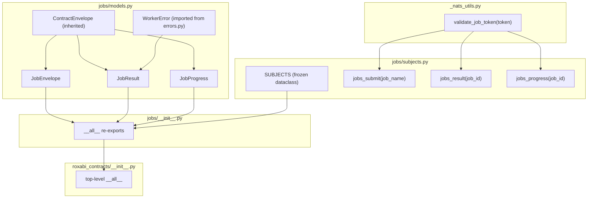
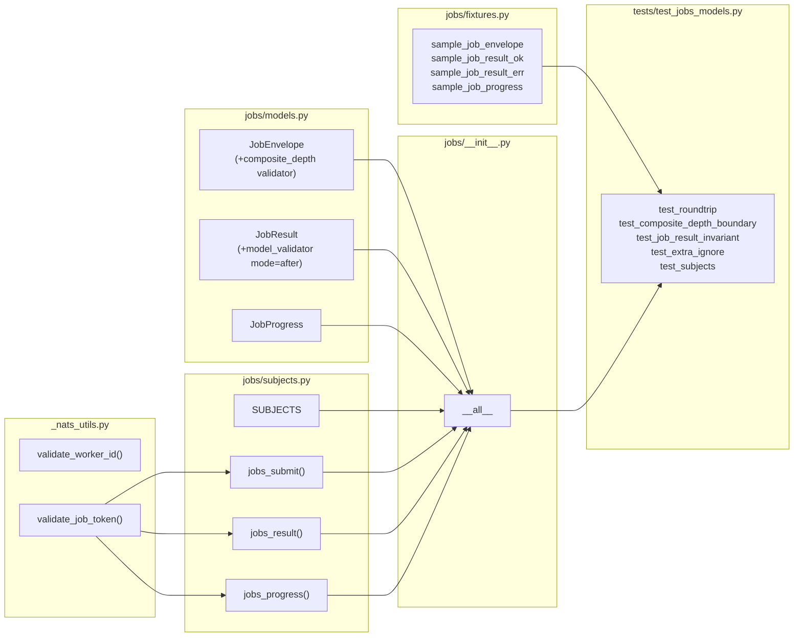

## Summary

Add a `jobs/` subdomain module to `roxabi-contracts` containing `JobEnvelope`, `JobResult`,
and `JobProgress` — the wire-format contracts for the `lyra.jobs.*` / `lyra.results.*` /
`lyra.progress.*` NATS bus introduced by epic #1044. Pattern mirrors `voice/`, `image/`, `llm/`.

## Architecture

### Data Flow



### File × Function Map



## Agents

| Agent | Tasks | Files |
|-------|-------|-------|
| backend-dev-A | T1→T2→T3→T4→T5→T7→T8→T10 | `_nats_utils.py`, `jobs/models.py`, `jobs/subjects.py`, `jobs/fixtures.py`, `jobs/__init__.py`, `roxabi_contracts/__init__.py`, `pyproject.toml` |
| tester-A | T6 | `tests/test_jobs_models.py` |
| doc-writer-A | T9 | `README.md` |

## Wave Structure

4 waves, max 2 parallel agents. Elapsed ~4 hours vs ~6 sequential.

| Wave | Trigger | Agents | Tasks |
|------|---------|--------|-------|
| 1 | start | 1 | backend-dev-A: T1→T2→T3→T4→T5 |
| 2 | Wave 1 done | 2 ∥ | backend-dev-A: verify RED-GATE S1 · tester-A: T6 |
| 3 | T6 done | 1 | backend-dev-A: T7 (verify RED-GATE S2 after) |
| 4 | RED-GATE S2 | 2 ∥ | backend-dev-A: T8→T10 · doc-writer-A: T9 |

## Micro-Tasks

### S1 — Module Scaffold + Models (RED phase)

---
**T1** `[RED]` `[parallel-safe: Y]`
Add `validate_job_token` to `_nats_utils.py`

- **File:** `packages/roxabi-contracts/src/roxabi_contracts/_nats_utils.py`
- **Agent:** backend-dev-A
- **Spec trace:** SC-7
- **Slice:** S1
- **Difficulty:** 1
- **Time:** 3 min
- **Snippet:**
  ```python
  _SAFE_JOB_TOKEN_RE = re.compile(r"[A-Za-z0-9._-]+")

  def validate_job_token(token: str) -> None:
      """Validate a job_name or job_id for NATS subject safety.
      Dots allowed (namespacing: vault.add-from-url); * and > rejected."""
      if not _SAFE_JOB_TOKEN_RE.fullmatch(token):
          raise ValueError(
              f"job token must match [A-Za-z0-9._-]+ (got {token!r}); "
              "NATS wildcard characters (* >) and spaces are rejected"
          )
  ```
- **Verify:** `cd packages/roxabi-contracts && uv run python -c "from roxabi_contracts._nats_utils import validate_job_token; validate_job_token('vault.add-from-url'); print('ok')"`
- **Expected:** `ok`

---
**T2** `[RED]` `[parallel-safe: Y]`
Create `jobs/models.py` — bare model classes, no validators

- **File:** `packages/roxabi-contracts/src/roxabi_contracts/jobs/models.py`
- **Agent:** backend-dev-A
- **Spec trace:** SC-2, SC-5, SC-6
- **Slice:** S1
- **Difficulty:** 2
- **Time:** 5 min
- **Snippet:**
  ```python
  from __future__ import annotations
  from typing import Any, Annotated, Literal, Self
  from pydantic import StringConstraints, field_validator, model_validator, Field
  from roxabi_contracts.envelope import ContractEnvelope
  from roxabi_contracts.errors import WorkerError

  class JobEnvelope(ContractEnvelope):
      job_id: Annotated[str, StringConstraints(min_length=1)]
      job_name: Annotated[str, StringConstraints(min_length=1)]
      payload: dict[str, Any]
      reply_to: Annotated[str, StringConstraints(min_length=1)]
      parent_job_id: str | None = None
      composite_depth: int = 0  # validator added in T7

  class JobResult(ContractEnvelope):
      job_id: Annotated[str, StringConstraints(min_length=1)]
      status: Literal["success", "error"]
      data: dict[str, Any] | None = None
      error: WorkerError | None = None  # model_validator added in T7

  class JobProgress(ContractEnvelope):
      job_id: Annotated[str, StringConstraints(min_length=1)]
      step: Annotated[str, StringConstraints(min_length=1)]
      pct: float | None = None
      detail: dict[str, Any] | None = None
  ```
- **Verify:** `cd packages/roxabi-contracts && uv run python -c "from roxabi_contracts.jobs.models import JobEnvelope, JobResult, JobProgress; print('ok')"`
- **Expected:** `ok`

---
**T3** `[RED]` `[parallel-safe: N — needs T1]`
Create `jobs/subjects.py` — SUBJECTS dataclass + 3 helpers

- **File:** `packages/roxabi-contracts/src/roxabi_contracts/jobs/subjects.py`
- **Agent:** backend-dev-A
- **Spec trace:** SC-8, SC-9
- **Slice:** S1
- **Difficulty:** 2
- **Time:** 5 min
- **Snippet:**
  ```python
  from dataclasses import dataclass
  from roxabi_contracts._nats_utils import validate_job_token

  @dataclass(frozen=True, slots=True)
  class _Subjects:
      """Frozen namespace for jobs-domain subjects. Empty at v0.4.0; callers use helpers."""
      pass

  SUBJECTS = _Subjects()

  def jobs_submit(job_name: str) -> str:
      validate_job_token(job_name)
      return f"lyra.jobs.{job_name}"

  def jobs_result(job_id: str) -> str:
      validate_job_token(job_id)
      return f"lyra.results.{job_id}"

  def jobs_progress(job_id: str) -> str:
      validate_job_token(job_id)
      return f"lyra.progress.{job_id}"
  ```
- **Verify:** `cd packages/roxabi-contracts && uv run python -c "from roxabi_contracts.jobs.subjects import jobs_submit, jobs_result, jobs_progress; print(jobs_submit('vault.add-from-url'))"`
- **Expected:** `lyra.jobs.vault.add-from-url`

---
**T4** `[RED]` `[parallel-safe: N — needs T2]`
Create `jobs/fixtures.py` — sample payloads for tests

- **File:** `packages/roxabi-contracts/src/roxabi_contracts/jobs/fixtures.py`
- **Agent:** backend-dev-A
- **Spec trace:** SC-1
- **Slice:** S1
- **Difficulty:** 1
- **Time:** 3 min
- **Snippet:**
  ```python
  """Test fixtures for roxabi_contracts.jobs. Pure dicts — no NATS imports."""
  from datetime import datetime, timezone

  _ENV = {
      "contract_version": "1",
      "trace_id": "tst-jobs-trace",
      "issued_at": datetime(2026, 5, 4, tzinfo=timezone.utc),
  }

  sample_job_envelope: dict = {
      **_ENV,
      "job_id": "job-uuid-1234",
      "job_name": "vault.add-from-url",
      "payload": {"url": "https://example.com"},
      "reply_to": "_INBOX.abc123",
  }

  sample_job_result_ok: dict = {
      **_ENV,
      "job_id": "job-uuid-1234",
      "status": "success",
      "data": {"stored": True},
  }

  sample_job_result_err: dict = {
      **_ENV,
      "job_id": "job-uuid-1234",
      "status": "error",
      "error": {"code": "worker.crash", "message": "scraper failed", "retryable": True},
  }

  sample_job_progress: dict = {
      **_ENV,
      "job_id": "job-uuid-1234",
      "step": "fetching",
      "pct": 25.0,
  }
  ```
- **Verify:** `cd packages/roxabi-contracts && uv run python -c "from roxabi_contracts.jobs.fixtures import sample_job_envelope; print('ok')"`
- **Expected:** `ok`

---
**T5** `[RED]` `[parallel-safe: N — needs T2, T3, T4]`
Create `jobs/__init__.py` — public API with `__all__`

- **File:** `packages/roxabi-contracts/src/roxabi_contracts/jobs/__init__.py`
- **Agent:** backend-dev-A
- **Spec trace:** SC-1
- **Slice:** S1
- **Difficulty:** 1
- **Time:** 2 min
- **Snippet:**
  ```python
  """Jobs-domain NATS contract surface."""
  from roxabi_contracts.jobs.models import JobEnvelope, JobResult, JobProgress
  from roxabi_contracts.jobs.subjects import (
      SUBJECTS, jobs_submit, jobs_result, jobs_progress,
  )

  __all__ = [
      "JobEnvelope", "JobResult", "JobProgress",
      "SUBJECTS", "jobs_submit", "jobs_result", "jobs_progress",
  ]
  ```
- **Verify:** `cd packages/roxabi-contracts && uv run python -c "from roxabi_contracts.jobs import JobEnvelope, JobResult, JobProgress; print('ok')"`
- **Expected:** `ok`

---
**RED-GATE S1** — S1 complete when T5 verify passes cleanly.

---

### S2 — Validation + Tests (RED → GREEN)

---
**T6** `[RED]` `[parallel-safe: Y — needs RED-GATE S1]`
Write `tests/test_jobs_models.py` — full test suite (RED: composite_depth + invariant tests FAIL until T7)

- **File:** `packages/roxabi-contracts/tests/test_jobs_models.py`
- **Agent:** tester-A
- **Spec trace:** SC-10, SC-11
- **Slice:** S2
- **Difficulty:** 3
- **Time:** 8 min
- **Pattern:** `packages/roxabi-contracts/tests/test_voice_models.py`
- **Covers:**
  - `test_roundtrip` — parametrized over all 3 models: `model_dump_json → model_validate_json → equal`
  - `test_composite_depth_boundary` — depth 0 ok, depth 3 ok, depth 4 raises `ValidationError`
  - `test_job_result_invariant` — success+error raises, error+no WorkerError raises, success+data ok
  - `test_extra_ignore` — unknown field silently dropped (inherited from ContractEnvelope)
  - `test_subjects` — `jobs_submit('vault.add-from-url')` == `"lyra.jobs.vault.add-from-url"`; wildcard `'*'` raises ValueError
- **Verify:** `cd packages/roxabi-contracts && uv run pytest tests/test_jobs_models.py -v 2>&1 | tail -20`
- **Expected:** `test_roundtrip` passes (no validators yet); `test_composite_depth_boundary` and `test_job_result_invariant` FAIL (expected RED)

---
**T7** `[GREEN]` `[parallel-safe: N — needs T6]`
Add validators to `jobs/models.py` to make RED tests GREEN

- **File:** `packages/roxabi-contracts/src/roxabi_contracts/jobs/models.py`
- **Agent:** backend-dev-A
- **Spec trace:** SC-3, SC-4
- **Slice:** S2
- **Difficulty:** 2
- **Time:** 5 min
- **Snippet:**
  ```python
  # In JobEnvelope — add after composite_depth field:
  @field_validator("composite_depth")
  @classmethod
  def _validate_depth(cls, v: int) -> int:
      if not (0 <= v <= 3):
          raise ValueError(f"composite_depth must be 0–3, got {v}")
      return v

  # In JobResult — add after error field:
  @model_validator(mode="after")
  def _enforce_status_invariant(self) -> Self:
      if self.status == "error" and self.error is None:
          raise ValueError("JobResult with status='error' must carry a WorkerError")
      if self.status == "success" and self.error is not None:
          raise ValueError("JobResult with status='success' must not carry error")
      return self
  ```
- **Verify:** `cd packages/roxabi-contracts && uv run pytest tests/test_jobs_models.py -v 2>&1 | tail -10`
- **Expected:** all tests pass

---
**RED-GATE S2** — S2 complete when `uv run pytest tests/test_jobs_models.py` exits 0.

---

### S3 — Re-export + Docs + Version Bump (GREEN phase)

---
**T8** `[GREEN]` `[parallel-safe: Y — needs RED-GATE S2]`
Update top-level `roxabi_contracts/__init__.py` to re-export jobs models

- **File:** `packages/roxabi-contracts/src/roxabi_contracts/__init__.py`
- **Agent:** backend-dev-A
- **Spec trace:** SC-12
- **Slice:** S3
- **Difficulty:** 1
- **Time:** 2 min
- **Snippet:**
  ```python
  from .jobs import JobEnvelope, JobProgress, JobResult
  # add to __all__: "JobEnvelope", "JobProgress", "JobResult"
  ```
- **Verify:** `cd packages/roxabi-contracts && uv run python -c "import roxabi_contracts; print(roxabi_contracts.JobEnvelope)"`
- **Expected:** `<class 'roxabi_contracts.jobs.models.JobEnvelope'>`

---
**T9** `[GREEN]` `[parallel-safe: Y — needs RED-GATE S2]`
Update `README.md` — add `jobs/` domain section with subject table

- **File:** `packages/roxabi-contracts/README.md`
- **Agent:** doc-writer-A
- **Spec trace:** SC-13
- **Slice:** S3
- **Difficulty:** 1
- **Time:** 3 min
- **Content:** Add section after existing domain docs: domain name, 3 subjects, purpose, import example

---
**T10** `[GREEN]` `[parallel-safe: Y — needs T8]`
Bump `pyproject.toml` version `0.3.0 → 0.4.0`

- **File:** `packages/roxabi-contracts/pyproject.toml`
- **Agent:** backend-dev-A
- **Spec trace:** SC-14
- **Slice:** S3
- **Difficulty:** 1
- **Time:** 1 min
- **Verify:** `grep 'version' packages/roxabi-contracts/pyproject.toml`
- **Expected:** `version = "0.4.0"`

---

## Consistency Report

| Metric | Count |
|--------|-------|
| Spec criteria covered | 14/14 |
| Micro-tasks | 10 (+ 2 RED-GATE sentinels) |
| Uncovered criteria | 0 |
| Untraced tasks | 0 |

## Task Seeding Blueprint

<!-- Used by /implement to seed TaskCreate calls on session start. -->

### Wave 1 — no deps, 1 agent

| Task | Agent instance | blockedBy | Subject |
|------|---------------|-----------|---------|
| T1 | backend-dev-A | — | Add validate_job_token to _nats_utils.py |
| T2 | backend-dev-A | T1 | Create jobs/models.py bare model classes |
| T3 | backend-dev-A | T2 | Create jobs/subjects.py SUBJECTS + helpers |
| T4 | backend-dev-A | T2 | Create jobs/fixtures.py sample payloads |
| T5 | backend-dev-A | T3,T4 | Create jobs/__init__.py exports |
| RED-GATE-S1 | backend-dev-A | T5 | Verify: from roxabi_contracts.jobs import JobEnvelope passes |

### Wave 2 — after RED-GATE S1, 2 agents ∥

| Task | Agent instance | blockedBy | Subject |
|------|---------------|-----------|---------|
| T6 | tester-A | RED-GATE-S1 | Write tests/test_jobs_models.py full suite (RED) |

### Wave 3 — after T6, 1 agent

| Task | Agent instance | blockedBy | Subject |
|------|---------------|-----------|---------|
| T7 | backend-dev-A | T6 | Add validators to jobs/models.py (GREEN) |
| RED-GATE-S2 | backend-dev-A | T7 | Verify: pytest tests/test_jobs_models.py passes |

### Wave 4 — after RED-GATE S2, 2 agents ∥

| Task | Agent instance | blockedBy | Subject |
|------|---------------|-----------|---------|
| T8 | backend-dev-A | RED-GATE-S2 | Update roxabi_contracts/__init__.py re-exports |
| T9 | doc-writer-A | RED-GATE-S2 | Update README.md jobs domain section |
| T10 | backend-dev-A | T8 | Bump pyproject.toml 0.3.0 → 0.4.0 |

## Task IDs

<!-- Generated by /plan. Used by /implement to resume tasks on session restart. -->
- T1: 10 — Add validate_job_token to _nats_utils.py
- T2: 11 — Create jobs/models.py — bare model classes
- T3: 12 — Create jobs/subjects.py — SUBJECTS + 3 helper functions
- T4: 13 — Create jobs/fixtures.py — sample payloads for tests
- T5: 14 — Create jobs/__init__.py — module public API
- RED-GATE-S1: 15 — RED-GATE S1 — verify jobs module import
- T6: 16 — Write tests/test_jobs_models.py — full test suite (RED)
- T7: 17 — Add validators to jobs/models.py — GREEN phase
- RED-GATE-S2: 18 — RED-GATE S2 — verify all test_jobs_models tests pass
- T8: 19 — Update roxabi_contracts/__init__.py — re-export jobs models
- T9: 20 — Update README.md — add jobs domain section
- T10: 21 — Bump pyproject.toml version 0.3.0 → 0.4.0
