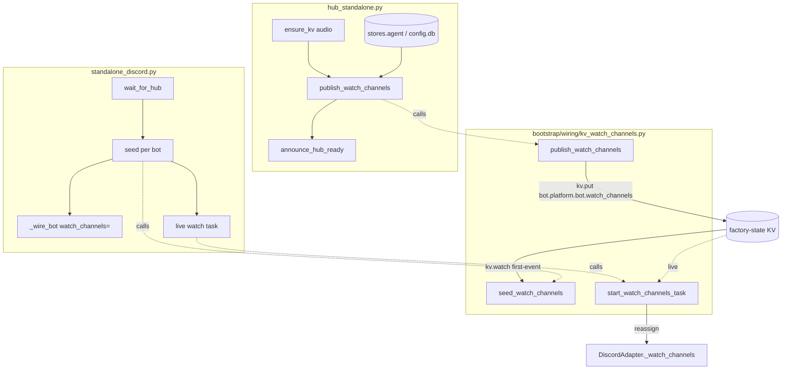
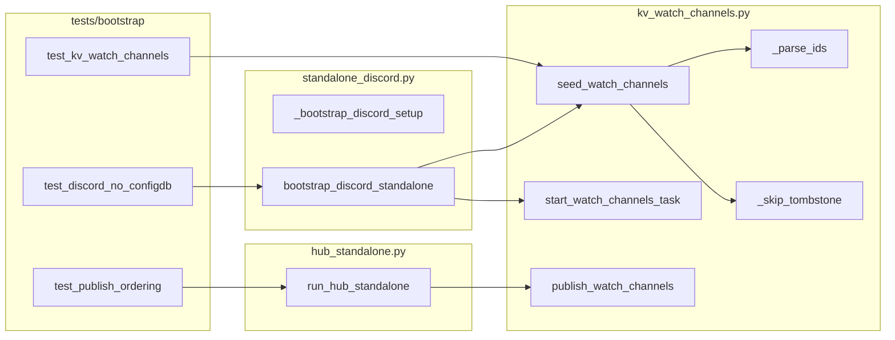

## Summary

Replace the standalone Discord adapter's `config.db` `watch_channels` read with a shared,
platform-agnostic NATS-KV seed-and-watch helper; the hub publishes each bot's `watch_channels` to
`factory-state` at boot. Zero ACL change; volume-drop + CLI live-write deferred to #1721/#1720.

## Architecture

## Agents

| Agent instance | Tasks | Files |
|----------------|-------|-------|
| backend-dev-A | T1, T4 | `kv_watch_channels.py` (helper), `standalone_discord.py` |
| backend-dev-B | T3 | `kv_watch_channels.py` (publish fn), `hub_standalone.py` |
| tester-A | T2, T5 | `tests/bootstrap/test_kv_watch_channels.py`, `tests/bootstrap/test_discord_kv_wiring.py` |
| devops-A | T6 | `tools/check_volumes_table.sh`, `.claude/stack.yml`, `docs/architecture/deployment.md` |

## Wave Structure

3 waves, max 3 parallel agents. Elapsed ~half-day vs ~1 day sequential.

| Wave | Trigger | Agents | Tasks |
|------|---------|--------|-------|
| 1 | start | 2 ∥ | backend-dev-A: T1 · devops-A: T6 |
| 2 | Wave 1 (T1) done | 3 ∥ | tester-A: T2 · backend-dev-B: T3 · backend-dev-A: T4 |
| 3 | Wave 2 (T3,T4) done | 1 | tester-A: T5 |

### Budget — per task

| Task | Items | Class | Est. ops | Split? |
|------|-------|-------|----------|--------|
| T1 helper | 1 | judgmental | 8 | — |
| T2 helper tests | 4 | bounded | 9 | — |
| T3 publisher + wire | 1 | judgmental | 8 | — |
| T4 discord wiring | 1 | judgmental | 9 | — |
| T5 integration tests | 3 | judgmental | 10 | — |
| T6 lint + docs | 1 | judgmental | 8 | — |

**Total estimated ops: 52** (across 4 instances).

### Budget — per agent instance

| Instance | Tasks | Σ ops | Subjects | Split? |
|----------|-------|-------|----------|--------|
| backend-dev-A | T1, T4 | 17 | kv-read | — |
| backend-dev-B | T3 | 8 | kv-publish | — |
| tester-A | T2, T5 | 19 | kv-read, integ | — |
| devops-A | T6 | 8 | lint | — |

## Consistency Report

Covered: SC1→T4 · SC2→T2/T5 · SC3→T2 · SC4→T1/T2/T3 · SC5→T1/T4 · SC6→T5(assert)/all · SC7→T5 · SC8→T6.
8/8 acceptance criteria traced. No untraced tasks. No exemptions.

## Micro-Tasks

### T1 — Shared KV watch_channels helper  [backend-dev-A · kv-read · GREEN · diff 3]
**File:** `src/factory/bootstrap/wiring/kv_watch_channels.py` (NEW)
Implement:
- `async def seed_watch_channels(js, platform, bot_id, *, timeout=2.0) -> frozenset[int]` — `kv =
  js.key_value("factory-state")`; `watcher = await kv.watch(f"bot.{platform}.{bot_id}.watch_channels")`;
  await first non-`None` entry within `asyncio.timeout`; tombstone (`entry.operation` ∈ {DEL,PURGE})
  or `None`/timeout → `frozenset()`; else `_parse_ids(json.loads(entry.value))`. Mirror
  `readiness.py:_kv_watch_for_ready` (126-143) for the watcher idiom; `await watcher.stop()` in finally.
- `async def start_watch_channels_task(js, platform, bot_id, on_update) -> asyncio.Task` — long-lived
  watcher; on each non-tombstone entry call `on_update(frozenset(...))`. Returns the task for teardown.
- `_parse_ids(raw) -> frozenset[int]` (skip non-int, reuse the `int(ch)` guard from current
  `standalone_discord.py:55-64`); `_skip_tombstone(entry) -> bool`.
**Verify:** `uv run python -c "import factory.bootstrap.wiring.kv_watch_channels"` · `uv run ruff check src/factory/bootstrap/wiring/kv_watch_channels.py`

### T2 — Helper unit tests  [tester-A · kv-read · RED→GREEN · diff 2]  (blockedBy T1)
**File:** `tests/bootstrap/test_kv_watch_channels.py` (NEW)
Cases: (a) first-event with `value=b"[1,2]"` → `frozenset({1,2})`; (b) first entry `None` then timeout →
`frozenset()`; (c) entry `operation="PURGE"` → `frozenset()` (no `json.loads(b"")`); (d) `value=b'["x",3]'`
→ `frozenset({3})` (bad id skipped). Mock `js.key_value(...).watch(...)` to yield async entries.
**Verify:** `uv run pytest tests/bootstrap/test_kv_watch_channels.py -q`

### T3 — Hub boot publisher  [backend-dev-B · kv-publish · GREEN · diff 3]  (blockedBy T1)
**Files:** `kv_watch_channels.py` (add `publish_watch_channels`), `hub_standalone.py`
- `async def publish_watch_channels(js, agent_store, bots: list[tuple[str,str]]) -> None` — for each
  `(platform, bot_id)`, read `agent_store.get_bot_settings(platform, bot_id).get("watch_channels", [])`,
  `kv.put(f"bot.{platform}.{bot_id}.watch_channels", json.dumps(ids).encode())` into `factory-state`.
- In `hub_standalone.py`: after the audio `ensure_kv(_audio_js)` block (~line 172) and **before**
  `announce_hub_ready(nc)` (line 180), enumerate configured discord (and any platform) bots from
  `raw_config`/`stores.agent` and call `publish_watch_channels(nc.jetstream(), stores.agent, bots)`.
**Verify:** `uv run ruff check src/factory/bootstrap/standalone/hub_standalone.py` · `uv run pyright src/factory/bootstrap/wiring/kv_watch_channels.py`

### T4 — Wire Discord to KV, drop config.db  [backend-dev-A · kv-read · GREEN · diff 4]  (blockedBy T1)
**File:** `src/factory/bootstrap/wiring/standalone_discord.py`
- Remove the `AgentStore(db_path=vault_dir / "config.db")` open + `get_bot_settings` loop from
  `_bootstrap_discord_setup` (lines 46-69); that function returns only `(dc_multi_cfg, dc_creds)`.
- After `await wait_for_hub(nc)` (line 194), build `dc_bot_watch_channels` per bot via
  `seed_watch_channels(js, "discord", bot_id)`; keep the `_wire_bot` `watch_channels=` kwarg sourced
  from it.
- Start `start_watch_channels_task(js, "discord", bot_id, lambda s, a=adapter_dc: setattr(a, "_watch_channels", s))`
  per bot; collect tasks; cancel them in `_bootstrap_discord_teardown`/close paths.
- Drop the now-unused `AgentStore` import.
**Verify:** `grep -c "config.db" src/factory/bootstrap/wiring/standalone_discord.py` → `0` · `uv run ruff check src/factory/bootstrap/wiring/standalone_discord.py`

### T5 — Integration tests  [tester-A · integ · GREEN · diff 3]  (blockedBy T3, T4)
**File:** `tests/bootstrap/test_discord_kv_wiring.py` (NEW)
- assert `_bootstrap_discord_setup` opens no `AgentStore`/`config.db` (patch `AgentStore` → raise on init).
- assert discord seeds `_watch_channels` from a mocked KV value.
- assert hub `publish_watch_channels` is invoked before `announce_hub_ready` (call-order spy).
- assert `deploy/nats/acl-matrix.json` unchanged: `git diff --stat origin/staging -- deploy/nats/acl-matrix.json` empty.
**Verify:** `uv run pytest tests/bootstrap/test_discord_kv_wiring.py -q`

### T6 — Falsification lint + doc-drift fix  [devops-A · lint · GREEN · diff 3]
**Files:** `tools/check_volumes_table.sh` (NEW), `.claude/stack.yml`, `docs/architecture/deployment.md`
- `check_volumes_table.sh`: parse the Volumes table in `deployment.md` and the `Volume=` lines in
  `deploy/quadlet/*.container*`; exit non-zero on mismatch (model on existing `tools/check_*.sh`).
- Register under `stack.yml` `quality_gates:` (`stage: pre-push`).
- Fix `deployment.md:146` (claims per-file binds while quadlets mount the whole `factory-data.volume`)
  so the gate is green; reflect current reality (volume still adapter-mounted).
**Verify:** `bash tools/check_volumes_table.sh` (exit 0) · inject a bogus `Volume=` line → exit ≠ 0 → revert.

## Task Seeding Blueprint

<!-- Used by /implement to seed TaskCreate calls. T{n} | agent-instance | blockedBy | subject. -->

### Wave 1 — no deps, 2 agents ∥

| Task | Agent instance | blockedBy | Subject |
|------|---------------|-----------|---------|
| T1 | backend-dev-A | — | kv-read |
| T6 | devops-A | — | lint |

### Wave 2 — after T1, 3 agents ∥

| Task | Agent instance | blockedBy | Subject |
|------|---------------|-----------|---------|
| T2 | tester-A | T1 | kv-read |
| T3 | backend-dev-B | T1 | kv-publish |
| T4 | backend-dev-A | T1 | wiring |

### Wave 3 — after T3,T4

| Task | Agent instance | blockedBy | Subject |
|------|---------------|-----------|---------|
| T5 | tester-A | T3, T4 | integ |

## Task IDs

<!-- Generated by /plan. Used by /implement to resume tasks on session restart. -->
- T1: 11 — kv-read (backend-dev-A)
- T2: 13 — kv-read (tester-A)
- T3: 14 — kv-publish (backend-dev-B)
- T4: 15 — wiring (backend-dev-A)
- T5: 16 — integ (tester-A)
- T6: 12 — lint (devops-A)
