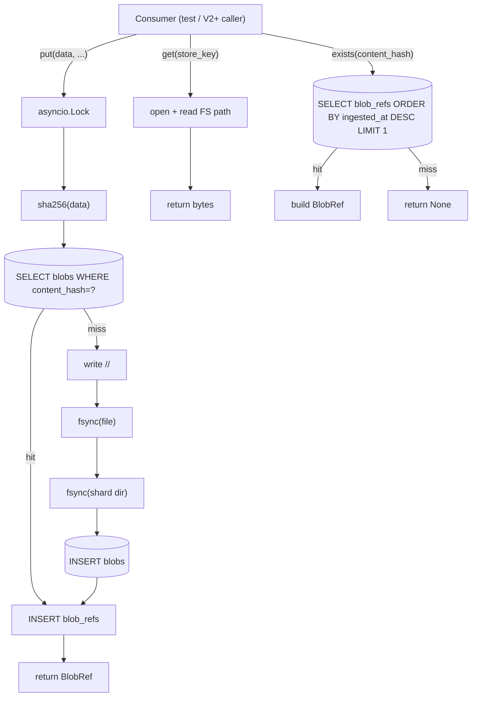
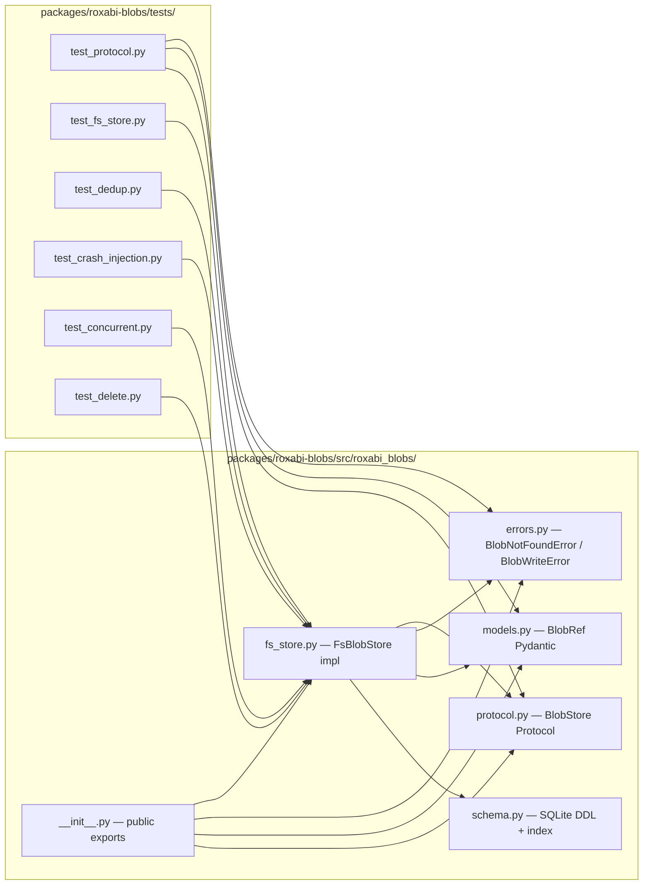

## Summary

Ship `packages/roxabi-blobs/` as a uv workspace member exposing a `BlobStore` Protocol + `FsBlobStore` impl (Flat-FS + SQLite, content-addressed, async). 15 micro-tasks + 3 RED-GATE sentinels across 4 waves; backend-dev + tester + devops single-instance.

## Architecture

### Data flow



### File × Function map



## Agents

| Agent | Tasks | Files |
|---|---|---|
| backend-dev | 10 | `src/roxabi_blobs/*.py`, `pyproject.toml`, `README.md`, `CLAUDE.md` |
| tester | 6 | `tests/*.py` |
| devops | 1 | root `pyproject.toml` workspace registration |

## Wave Structure

4 waves, max 2 parallel agents. Elapsed ~3 days vs ~5 sequential.

| Wave | Trigger | Agents | Tasks |
|---|---|---|---|
| 1 | start | 2 ∥ | devops: T1 · backend-dev: T2 |
| 2 | Wave 1 done | 2 ∥ | backend-dev: T3 · tester: T4 → RED-GATE-V1a (T5) |
| 3 | Wave 2 + RED-GATE-V1a green | 1 sequential | backend-dev: T6 → T7 → T8 → T9 → T10 → T11 → RED-GATE-V1b (T12) |
| 4 | Wave 3 + RED-GATE-V1b green | 1 agent ∥ tasks | tester: T13 [P] T14 [P] T15 [P] T16 [P] T17 → RED-GATE-V1c (T18) |

### Budget

| Task | Items | Class | Est. ops | Split? |
|---|---|---|---|---|
| T1 workspace register | 1 file edit | bounded | 3 | — |
| T2 package scaffold | 4 files | bounded | 4 | — |
| T3 types layer | 3 files | judgmental | 5 | — |
| T4 test_protocol | 1 file | bounded | 3 | — |
| T6 schema | 1 file | bounded | 3 | — |
| T7 fs_store skeleton | 1 file | bounded | 3 | — |
| T8 put impl | 1 file edit | judgmental | 6 | — |
| T9 get impl | 1 file edit | trivial | 2 | — |
| T10 exists impl | 1 file edit | bounded | 3 | — |
| T11 delete impl | 1 file edit | judgmental | 5 | — |
| T13 test_fs_store | 1 file | judgmental | 5 | — |
| T14 test_dedup | 1 file | bounded | 3 | — |
| T15 test_crash_injection | 1 file | judgmental | 6 | — |
| T16 test_concurrent | 1 file | judgmental | 5 | — |
| T17 test_delete | 1 file | bounded | 3 | — |

**Total estimated ops: ~63** — no force-split required.

## Consistency Report

- **Spec criteria covered:** 8/8 (every `- [ ]` from spec §Success Criteria mapped to ≥1 task)
- **Spec affordances covered:** N1, N2, N3, N4, N5, S1, S2, S3 — all touched
- **Untraced tasks:** 0
- **Exemptions:** none

| Spec SC# | Task(s) |
|---|---|
| SC#1 workspace + imports | T1, T2, RED-GATE-V1a (T5) |
| SC#2 Protocol + impl 4 methods | T3, T7–T11 |
| SC#3 WAL + schema | T6, T7 |
| SC#4 sha256 dedup 5× | T8, T14 |
| SC#5 write order fsync(file)+fsync(dir) | T8, T15 |
| SC#6 asyncio.Lock concurrent | T7, T16 |
| SC#7 get + BlobNotFoundError | T9, T13 |
| SC#8 exists ORDER BY latest | T10, T13 |
| SC#9 delete signature + tested + not called | T11, T17 |
| SC#10 ≥90% coverage incl. delete | RED-GATE-V1c (T18) |
| SC#11 no file >300 LOC | enforced by quality_gates at /validate |

## Micro-Tasks

### V1a — Package skeleton

#### T1 — Register workspace member · devops · [P]
- **File:** `pyproject.toml` (root)
- **Snippet:**
  ```toml
  [tool.uv.workspace]
  members = ["packages/roxabi-nats", "packages/roxabi-contracts", "packages/roxabi-blobs"]

  [tool.uv.sources]
  roxabi-blobs = { workspace = true }
  ```
  Plus add `"packages/roxabi-blobs/tests"` to `[tool.pytest.ini_options].testpaths`.
- **Verify:** `uv sync 2>&1 | grep -i "roxabi-blobs"`
- **Expected:** package recognized as workspace member (no error)
- **Est:** 2 min · **Diff:** 1 · **Slice:** V1a · **Phase:** GREEN · **Trace:** SC#1

#### T2 — Package scaffold · backend-dev · [P]
- **Files:**
  - `packages/roxabi-blobs/pyproject.toml` (hatchling, deps: `pydantic>=2`, `aiosqlite>=0.20`)
  - `packages/roxabi-blobs/src/roxabi_blobs/__init__.py` (re-exports)
  - `packages/roxabi-blobs/src/roxabi_blobs/py.typed` (empty marker)
  - `packages/roxabi-blobs/README.md` (1-paragraph stub)
  - `packages/roxabi-blobs/CLAUDE.md` (invariants per pattern)
- **Snippet (pyproject):** mirror `packages/roxabi-nats/pyproject.toml` shape — `[build-system] hatchling`, `[tool.hatch.build.targets.wheel] packages = ["src/roxabi_blobs"]`
- **Verify:** `test -f packages/roxabi-blobs/pyproject.toml && test -d packages/roxabi-blobs/src/roxabi_blobs`
- **Expected:** scaffold files exist
- **Est:** 5 min · **Diff:** 2 · **Slice:** V1a · **Phase:** GREEN · **Trace:** SC#1

#### T3 — Types layer (protocol + models + errors) · backend-dev
- **Files:**
  - `packages/roxabi-blobs/src/roxabi_blobs/errors.py` — `BlobNotFoundError(Exception)`, `BlobWriteError(Exception)`, `BlobConsistencyError(Exception)`
  - `packages/roxabi-blobs/src/roxabi_blobs/models.py` — `BlobRef(BaseModel)` per ADR-067 §BlobRef envelope
  - `packages/roxabi-blobs/src/roxabi_blobs/protocol.py` — `class BlobStore(Protocol)` with 4 `async def` methods (put/get/exists/delete) per ADR-067 §Interface
- **Snippet (protocol):**
  ```python
  from typing import Protocol, runtime_checkable
  from .models import BlobRef

  @runtime_checkable
  class BlobStore(Protocol):
      async def put(self, data: bytes, *, mime: str, source: str,
                    filename: str | None = None,
                    platform_ref: str | None = None,
                    platform_message_id: str | None = None) -> BlobRef: ...
      async def get(self, store_key: str) -> bytes: ...
      async def exists(self, content_hash: str) -> BlobRef | None: ...
      async def delete(self, blob_ref_id: int) -> None: ...
  ```
- **Verify:** `uv run python -c "from roxabi_blobs import BlobStore, BlobRef, BlobNotFoundError, BlobWriteError; print('ok')"`
- **Expected:** `ok`
- **Est:** 8 min · **Diff:** 2 · **Slice:** V1a · **Phase:** GREEN · **Trace:** SC#2

#### T4 — Protocol conformance tests · tester · [P with T3]
- **File:** `packages/roxabi-blobs/tests/test_protocol.py`
- **Snippet:** assert `isinstance(FsBlobStore, BlobStore)` won't work pre-T7 — instead use `typing.get_type_hints` + manual signature comparison; assert `BlobRef` schema matches ADR-067 fields exactly.
- **Verify:** `uv run pytest packages/roxabi-blobs/tests/test_protocol.py -v`
- **Expected:** all pass
- **Est:** 6 min · **Diff:** 2 · **Slice:** V1a · **Phase:** RED→GREEN · **Trace:** SC#2

#### T5 — RED-GATE V1a — uv sync + imports
- **Verify:**
  ```bash
  uv sync && \
  uv run python -c "from roxabi_blobs import BlobStore, BlobRef, BlobNotFoundError, BlobWriteError, BlobConsistencyError; print('ok')" && \
  uv run pytest packages/roxabi-blobs/tests/test_protocol.py
  ```
- **Expected:** `ok` + pytest green
- **Est:** 1 min · **Diff:** 1 · **Slice:** V1a · **Phase:** RED-GATE · **Trace:** SC#1, SC#2

### V1b — FsBlobStore impl

#### T6 — Schema · backend-dev
- **File:** `packages/roxabi-blobs/src/roxabi_blobs/schema.py`
- **Snippet:** `SCHEMA_SQL` string with `CREATE TABLE blobs (content_hash TEXT PRIMARY KEY, mime TEXT, size INTEGER, store_path TEXT, first_seen_at TEXT)`, `CREATE TABLE blob_refs (id INTEGER PRIMARY KEY, content_hash TEXT NOT NULL REFERENCES blobs(content_hash), source TEXT NOT NULL, platform_ref TEXT, platform_message_id TEXT, filename TEXT, ingested_at TEXT NOT NULL)`, `CREATE INDEX idx_blob_refs_hash_ingested ON blob_refs(content_hash, ingested_at DESC)`. PRAGMA journal_mode=WAL, busy_timeout=5000.
- **Verify:** `uv run python -c "import sqlite3, tempfile; from roxabi_blobs.schema import SCHEMA_SQL; db=sqlite3.connect(':memory:'); db.executescript(SCHEMA_SQL); print(db.execute(\"SELECT name FROM sqlite_master WHERE type='table'\").fetchall())"`
- **Expected:** `[('blobs',), ('blob_refs',)]`
- **Est:** 6 min · **Diff:** 2 · **Slice:** V1b · **Phase:** GREEN · **Trace:** SC#3

#### T7 — FsBlobStore skeleton · backend-dev
- **File:** `packages/roxabi-blobs/src/roxabi_blobs/fs_store.py`
- **Snippet:** `class FsBlobStore` — `__init__(root, db_path=None)` resolves paths; `_lock = asyncio.Lock()`; `__aenter__` opens `aiosqlite` conn, applies `SCHEMA_SQL`, sets WAL + busy_timeout; `__aexit__` closes; stub methods for `put`/`get`/`exists`/`delete` raising `NotImplementedError`.
- **Verify:** `uv run python -c "import asyncio, tempfile; from pathlib import Path; from roxabi_blobs.fs_store import FsBlobStore; asyncio.run((lambda: FsBlobStore(Path(tempfile.mkdtemp())).__aenter__())()) ; print('ok')"`
- **Expected:** opens cleanly
- **Est:** 8 min · **Diff:** 3 · **Slice:** V1b · **Phase:** GREEN · **Trace:** SC#2, SC#3

#### T8 — put implementation · backend-dev
- **File edit:** `packages/roxabi-blobs/src/roxabi_blobs/fs_store.py`
- **Snippet:** inside `async with self._lock`: compute `content_hash = hashlib.sha256(data).hexdigest()`; SELECT FROM blobs; on miss: `fpath = root/sha[:2]/sha`; `mkdir parents=True exist_ok=True`; write bytes via `os.open(O_CREAT|O_WRONLY) + os.write + os.fsync(fd) + os.close`; `os.fsync(dir_fd)` on shard dir; INSERT blobs; INSERT blob_refs (always); build & return BlobRef.
- **Verify:** unit test in T13; smoke: `pytest packages/roxabi-blobs/tests/test_fs_store.py -k test_put_then_get -v`
- **Expected:** test passes after T13 lands
- **Est:** 12 min · **Diff:** 4 · **Slice:** V1b · **Phase:** GREEN · **Trace:** SC#4, SC#5, SC#6

#### T9 — get implementation · backend-dev
- **File edit:** `fs_store.py`
- **Snippet:** `try: with open(store_key, 'rb') as f: return f.read() except FileNotFoundError: raise BlobNotFoundError(store_key)`
- **Verify:** smoke in T13
- **Est:** 3 min · **Diff:** 1 · **Slice:** V1b · **Phase:** GREEN · **Trace:** SC#7

#### T10 — exists implementation · backend-dev
- **File edit:** `fs_store.py`
- **Snippet:** SELECT FROM blob_refs WHERE content_hash=? ORDER BY ingested_at DESC LIMIT 1, joined with blobs row to assemble `BlobRef`; return None if absent.
- **Verify:** smoke in T13
- **Est:** 5 min · **Diff:** 2 · **Slice:** V1b · **Phase:** GREEN · **Trace:** SC#8

#### T11 — delete implementation · backend-dev
- **File edit:** `fs_store.py`
- **Snippet:** under `async with self._lock`: SELECT content_hash + store_path via JOIN; DELETE blob_refs WHERE id=?; if `COUNT(*) FROM blob_refs WHERE content_hash=? == 0` → DELETE blobs WHERE content_hash=? + `os.unlink(store_path)`.
- **Verify:** smoke in T17
- **Est:** 8 min · **Diff:** 3 · **Slice:** V1b · **Phase:** GREEN · **Trace:** SC#9

#### T12 — RED-GATE V1b — round-trip smoke
- **Verify:**
  ```bash
  uv run pytest packages/roxabi-blobs/tests/test_fs_store.py::test_put_then_get -v && \
  uv run pytest packages/roxabi-blobs/tests/test_fs_store.py::test_exists -v
  ```
- **Expected:** both green (depends on T13 stub of these test names)
- **Est:** 2 min · **Diff:** 1 · **Slice:** V1b · **Phase:** RED-GATE · **Trace:** SC#2

### V1c — Test suite + coverage

#### T13 — test_fs_store happy path · tester · [P]
- **File:** `packages/roxabi-blobs/tests/test_fs_store.py`
- **Snippet:** `async def test_put_then_get(tmp_path)`, `async def test_exists`, `async def test_exists_missing`, `async def test_get_missing_raises`, `async def test_blob_ref_envelope_fields`.
- **Verify:** `uv run pytest packages/roxabi-blobs/tests/test_fs_store.py -v`
- **Expected:** 5 tests green
- **Est:** 10 min · **Diff:** 3 · **Slice:** V1c · **Phase:** GREEN · **Trace:** SC#2, SC#7, SC#8

#### T14 — test_dedup 5× same blob · tester · [P]
- **File:** `packages/roxabi-blobs/tests/test_dedup.py`
- **Snippet:** put same bytes 5 times with 5 different sources → assert 1 row in `blobs`, 5 rows in `blob_refs`, 1 file on FS, all 5 returned refs share `content_hash`.
- **Verify:** `uv run pytest packages/roxabi-blobs/tests/test_dedup.py -v`
- **Expected:** green
- **Est:** 6 min · **Diff:** 2 · **Slice:** V1c · **Phase:** GREEN · **Trace:** SC#4

#### T15 — test_crash_injection — write ordering · tester · [P]
- **File:** `packages/roxabi-blobs/tests/test_crash_injection.py`
- **Snippet:** subprocess fork that calls put + `os.kill(os.getpid(), SIGKILL)` between fsync and INSERT (mock the lock via monkeypatch); assert in parent process that FS file exists at correct shard path AND `blobs` table either has the row (clean) OR doesn't (orphan recoverable by future reconciler). Negative test: skip dir-fsync → simulate dir-block-loss → reconciler can't find the file (regression sentinel).
- **Verify:** `uv run pytest packages/roxabi-blobs/tests/test_crash_injection.py -v`
- **Expected:** green; negative test marked `xfail` to catch regression
- **Est:** 12 min · **Diff:** 4 · **Slice:** V1c · **Phase:** GREEN · **Trace:** SC#5

#### T16 — test_concurrent — asyncio.Lock · tester · [P]
- **File:** `packages/roxabi-blobs/tests/test_concurrent.py`
- **Snippet:** spawn 50 coroutines all calling `store.put(same_bytes, ...)`; await all; assert 1 file + 1 `blobs` row + 50 `blob_refs` rows; no `aiosqlite.OperationalError`.
- **Verify:** `uv run pytest packages/roxabi-blobs/tests/test_concurrent.py -v`
- **Expected:** green
- **Est:** 8 min · **Diff:** 3 · **Slice:** V1c · **Phase:** GREEN · **Trace:** SC#6

#### T17 — test_delete · tester · [P]
- **File:** `packages/roxabi-blobs/tests/test_delete.py`
- **Snippet:** put same blob 2× → 2 refs; delete 1 → file remains, `blobs` row remains, 1 `blob_refs` row remains; delete the other → file gone, `blobs` row gone, 0 `blob_refs` rows.
- **Verify:** `uv run pytest packages/roxabi-blobs/tests/test_delete.py -v`
- **Expected:** green
- **Est:** 6 min · **Diff:** 2 · **Slice:** V1c · **Phase:** GREEN · **Trace:** SC#9

#### T18 — RED-GATE V1c — coverage ≥90%
- **Verify:**
  ```bash
  uv run pytest packages/roxabi-blobs --cov=roxabi_blobs --cov-report=term-missing --cov-fail-under=90 -v
  ```
- **Expected:** all green; coverage ≥90% (includes `delete` paths)
- **Est:** 2 min · **Diff:** 1 · **Slice:** V1c · **Phase:** RED-GATE · **Trace:** SC#10

## Reference Patterns

Patterns to mirror (read during T2/T6/T7):

| Pattern | Reference file |
|---|---|
| Package scaffold + hatchling | `packages/roxabi-nats/pyproject.toml` |
| `src/<pkg>/` + `py.typed` layout | `packages/roxabi-nats/src/roxabi_nats/` |
| `errors.py` style | `packages/roxabi-nats/src/roxabi_nats/errors.py` |
| `Protocol` + `runtime_checkable` shape | `packages/roxabi-nats/src/roxabi_nats/adapter_base.py` |
| pytest conftest + asyncio_mode | `packages/roxabi-nats/tests/conftest.py` |
| CLAUDE.md per-package invariants pattern | `packages/roxabi-nats/CLAUDE.md` |

## Task Seeding Blueprint

<!-- /implement seeds these as TaskCreate calls. Format: T{n} | agent-instance | blockedBy | subject -->

### Wave 1 — no deps, 2 agents ∥

| Task | Agent instance | blockedBy | Subject |
|---|---|---|---|
| T1 | devops-A | — | Register `packages/roxabi-blobs` as uv workspace member |
| T2 | backend-dev-A | — | Scaffold `packages/roxabi-blobs/{pyproject,README,CLAUDE,src/__init__,py.typed}` |

### Wave 2 — after Wave 1, 2 agents ∥

| Task | Agent instance | blockedBy | Subject |
|---|---|---|---|
| T3 | backend-dev-A | T1,T2 | Types layer — `errors.py`, `models.py` (BlobRef), `protocol.py` (BlobStore Protocol) |
| T4 | tester-A | T2 | `test_protocol.py` — Protocol shape + BlobRef schema conformance |
| T5 | backend-dev-A | T3,T4 | RED-GATE V1a — `uv sync` + imports + protocol tests green |

### Wave 3 — after Wave 2 (RED-GATE-V1a green), 1 agent sequential

| Task | Agent instance | blockedBy | Subject |
|---|---|---|---|
| T6 | backend-dev-A | T5 | `schema.py` — SQLite DDL (blobs + blob_refs + index, WAL, BUSY_TIMEOUT=5000) |
| T7 | backend-dev-A | T6 | `fs_store.py` skeleton — class, `__aenter__/__aexit__`, asyncio.Lock, stubs |
| T8 | backend-dev-A | T7 | `put` impl — sha256, file→fsync(file)→fsync(dir)→INSERT, dedup, under lock |
| T9 | backend-dev-A | T7 | `get` impl — open + read + raise `BlobNotFoundError` |
| T10 | backend-dev-A | T7 | `exists` impl — `ORDER BY ingested_at DESC LIMIT 1` + BlobRef build |
| T11 | backend-dev-A | T7 | `delete` impl — ref count + unlink at zero |
| T12 | backend-dev-A | T8,T9,T10,T11 | RED-GATE V1b — round-trip put/get/exists smoke green |

### Wave 4 — after Wave 3 (RED-GATE-V1b green), 1 tester ∥ tasks

| Task | Agent instance | blockedBy | Subject |
|---|---|---|---|
| T13 | tester-A | T12 | `test_fs_store.py` — put/get/exists happy path + edge cases |
| T14 | tester-A | T12 | `test_dedup.py` — 5× same blob → 1 file + 1 blobs + 5 blob_refs |
| T15 | tester-A | T12 | `test_crash_injection.py` — kill simulation, fsync-dir regression sentinel |
| T16 | tester-A | T12 | `test_concurrent.py` — 50 coroutines + asyncio.Lock |
| T17 | tester-A | T12 | `test_delete.py` — 2 refs, delete 1 then 2 cycle |
| T18 | tester-A | T13,T14,T15,T16,T17 | RED-GATE V1c — `pytest --cov-fail-under=90` green |

## Task IDs

<!-- Generated by /plan. Used by /implement to resume tasks on session restart. -->
- T1: #11 — Register roxabi-blobs as uv workspace member
- T2: #12 — Scaffold packages/roxabi-blobs/ skeleton
- T3: #13 — Types layer (errors + models + protocol)
- T4: #14 — test_protocol.py Protocol conformance
- T5: #15 — RED-GATE V1a (uv sync + imports + protocol tests)
- T6: #16 — schema.py SQLite DDL
- T7: #17 — fs_store.py skeleton (class + async ctx + Lock)
- T8: #18 — put impl (sha256, fsync ordering, dedup, lock)
- T9: #19 — get impl
- T10: #20 — exists impl (ORDER BY latest)
- T11: #21 — delete impl (ref count + unlink at zero)
- T12: #22 — RED-GATE V1b (round-trip smoke)
- T13: #23 — test_fs_store.py happy path + edges
- T14: #24 — test_dedup.py (5× same blob)
- T15: #25 — test_crash_injection.py (write ordering)
- T16: #26 — test_concurrent.py (50 coroutines + Lock)
- T17: #27 — test_delete.py (ref count cycle)
- T18: #28 — RED-GATE V1c (≥90% coverage)

## Open Issues / Risks

- **aiosqlite vs sqlite3 in thread executor:** plan assumes `aiosqlite>=0.20`. If introducing aiosqlite is too heavy a new dep, fallback = stdlib `sqlite3` wrapped in `asyncio.to_thread`. Decision deferred to T6/T7 implementation; either is consistent with the spec.
- **Crash-injection test (T15) cross-platform:** `os.kill(SIGKILL)` is POSIX-only. Acceptable for Linux-only target (M₁/M₂ both Pop!_OS/Ubuntu).
- **Coverage gate strictness:** `--cov-fail-under=90` is binary. If coverage lands at 88% on first pass, decide between (a) add tests or (b) lower gate to 85% with note. Default = add tests.
