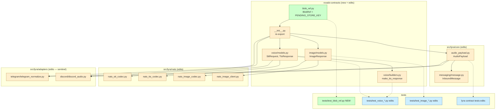
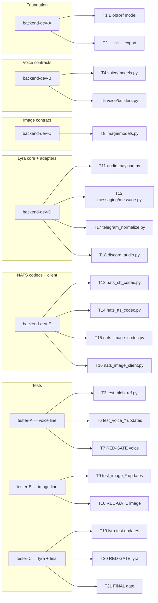

## Summary

Atomic, single-PR refactor of `roxabi-contracts` + `src/lyra/{core,nats,adapters}/` consumer files. Introduces `BlobRef` primitive + `PENDING_STORE_KEY` sentinel constant. Removes `audio_b64` / `audio_bytes` / `image_b64` / `file_path` inline-bytes fields. 21 micro-tasks across 8 agent instances; ~5 critical-path beats; coordinated cross-repo merge with voiceCLI#144 + imageCLI#97.

## Architecture

### Data flow



### Agent × File map



## Agents

| Agent instance | Type | Tasks | Files |
|---|---|---|---|
| backend-dev-A | backend-dev | T1, T2 | `packages/roxabi-contracts/src/roxabi_contracts/{blob_ref.py,__init__.py}` |
| backend-dev-B | backend-dev | T4, T5 | `packages/roxabi-contracts/src/roxabi_contracts/voice/{models.py,builders.py}` |
| backend-dev-C | backend-dev | T8 | `packages/roxabi-contracts/src/roxabi_contracts/image/models.py` |
| backend-dev-D | backend-dev | T11, T12, T17, T18 | `src/lyra/core/{audio_payload.py,messaging/message.py}`, `src/lyra/adapters/{telegram/telegram_normalize.py,discord/discord_audio.py}` |
| backend-dev-E | backend-dev | T13, T14, T15, T16 | `src/lyra/nats/{nats_stt_codec.py,nats_tts_codec.py,nats_image_codec.py,nats_image_client.py}` |
| tester-A | tester | T3, T6, T7 | `packages/roxabi-contracts/tests/{test_blob_ref.py,test_voice_*.py}` |
| tester-B | tester | T9, T10 | `packages/roxabi-contracts/tests/test_image_*.py` |
| tester-C | tester | T19, T20, T21 | lyra contract tests + final QA gates |

## Wave Structure

7 waves, max 5 parallel agents. Critical path: T1 → T4 → T5 → T6 → T7 → T13/T14 → T19 → T20 → T21 (≈ 9 sequential beats on voice/lyra line).

| Wave | Trigger | Agents | Tasks |
|---|---|---|---|
| 1 | start | 1 | backend-A: T1 |
| 2 | T1 done | 5 ∥ | backend-A: T2 · backend-B: T4 · backend-C: T8 · backend-D: T11 · tester-A: T3 |
| 3 | T4 / T8 / T11 done | 4 ∥ | backend-B: T5 · backend-D: T12→T17→T18 (chained) · tester-A: T6 (after T5) · tester-B: T9 |
| 4 | T6 / T9 done | 2 ∥ | tester-A: T7 (RED-GATE voice) · tester-B: T10 (RED-GATE image) |
| 5 | T7 / T10 done | 1 | backend-E: T13→T14→T15→T16 (chained — sequential within E) |
| 6 | T18 / T16 done | 1 | tester-C: T19 |
| 7 | T19 done | 1 | tester-C: T20 (RED-GATE lyra) → T21 (final QA) |

### Budget

| Task group | Items | Class | Est. ops | Split? |
|---|---|---|---|---|
| T1 BlobRef model + sentinel | 1 | bounded | 3 | — |
| T2 export | 1 | trivial | 1 | — |
| T3, T6, T9 test edits | 3 | bounded | 3×3=9 | — |
| T4, T8, T11 model edits | 3 | judgmental | 3×5=15 | — |
| T5 builders | 1 | bounded | 3 | — |
| T7, T10, T20 RED-GATEs | 3 | trivial | 3×1=3 | — |
| T12 messaging compile check | 1 | trivial | 1 | — |
| T13–T16 NATS codecs/client | 4 | judgmental | 4×5=20 | — |
| T17, T18 adapter sentinel | 2 | judgmental | 2×5=10 | — |
| T19 lyra test updates | 1 | judgmental | 5 | — |
| T21 final QA gate | 1 | bounded | 3 | — |

**Total estimated ops: ~73.** No task exceeds 6 ops (max threshold 50) — no force-splits.

## Consistency Report

- Acceptance criteria: 8 / 8 covered
  - SC-1 BlobRef + PENDING_STORE_KEY → T1, T2, T3
  - SC-2 Voice contracts purged → T4, T5, T6, T7
  - SC-3 Image contract purged → T8, T9, T10
  - SC-4 AudioPayload purged → T11, T19
  - SC-5 Lyra wire codecs + adapters updated → T13–T18
  - SC-6 No shim introduced → covered by grep in T7/T10/T20/T21
  - SC-7 Quality gates green → T21
  - SC-8 Cross-repo atomicity → T21 (verification step)
- Affordances (N1–N13): all mapped to a task — see micro-tasks below
- Slices (W1/W2/W3): all 3 covered with their own RED-GATE (T7/T10/T20)
- Untraced: 0 / Uncovered: 0 / Exemptions: 0

## Micro-Tasks

### Slice W1 — BlobRef foundation + voice contracts

**T1 — Create `BlobRef` Pydantic model + `PENDING_STORE_KEY` constant** [P (Wave 1, blocks all)]
- File: `packages/roxabi-contracts/src/roxabi_contracts/blob_ref.py` (NEW)
- Agent: backend-dev-A
- Phase: GREEN · Difficulty: 2/5 · Time: 5min
- Spec trace: SC-1, N1, N13
- Skeleton:
  ```python
  from __future__ import annotations
  from datetime import datetime
  from pydantic import BaseModel, ConfigDict, Field

  PENDING_STORE_KEY = "__pending__"

  class BlobRef(BaseModel):
      model_config = ConfigDict(frozen=True, extra="forbid")
      store_key: str
      content_hash: str
      mime: str
      size: int
      source: str
      filename: str | None = None
      platform_ref: str | None = None
      platform_message_id: str | None = None
      created_at: datetime = Field(default_factory=lambda: datetime.now(tz=UTC))
  ```
- Verify: `python -c "from roxabi_contracts.blob_ref import BlobRef, PENDING_STORE_KEY; print(PENDING_STORE_KEY)"` → `__pending__`
- Expected: import succeeds, prints sentinel

**T2 — Re-export `BlobRef` + `PENDING_STORE_KEY` from `roxabi_contracts` package**
- File: `packages/roxabi-contracts/src/roxabi_contracts/__init__.py`
- Agent: backend-dev-A
- Phase: GREEN · Difficulty: 1/5 · Time: 2min
- BlockedBy: T1
- Spec trace: SC-1, N1, N13
- Verify: `python -c "from roxabi_contracts import BlobRef, PENDING_STORE_KEY"` → no error
- Expected: top-level import succeeds

**T3 — Unit tests for BlobRef + sentinel detection** [P with T2]
- File: `packages/roxabi-contracts/tests/test_blob_ref.py` (NEW)
- Agent: tester-A
- Phase: GREEN · Difficulty: 2/5 · Time: 8min
- BlockedBy: T1
- Spec trace: SC-1
- Covers: round-trip, frozen-ness, extra="forbid" rejection, `PENDING_STORE_KEY` constant, sentinel-comparison example
- Verify: `uv run pytest packages/roxabi-contracts/tests/test_blob_ref.py -q`
- Expected: all tests pass

**T4 — Update `voice/models.py`: SttRequest + TtsResponse field rename + invariant** [P with T8, T11]
- File: `packages/roxabi-contracts/src/roxabi_contracts/voice/models.py`
- Agent: backend-dev-B
- Phase: GREEN · Difficulty: 3/5 · Time: 8min
- BlockedBy: T1
- Spec trace: SC-2, N2, N3
- Changes:
  - `SttRequest`: remove `audio_b64`, add `blob_ref: BlobRef`
  - `TtsResponse`: remove `audio_b64`, add `blob_ref: BlobRef | None`, update `_enforce_success_invariant` (raises when `ok=True` ∧ `blob_ref is None`)
- Verify: `grep "audio_b64" packages/roxabi-contracts/src/roxabi_contracts/voice/models.py` → 0
- Expected: no hits

**T5 — Update `voice/builders.py`: builder signature**
- File: `packages/roxabi-contracts/src/roxabi_contracts/voice/builders.py`
- Agent: backend-dev-B
- Phase: GREEN · Difficulty: 2/5 · Time: 5min
- BlockedBy: T4
- Spec trace: SC-2, N6
- Changes: rename `audio_b64` param → `blob_ref: BlobRef | None` in `make_tts_response` (+ any other builders touching the field)
- Verify: `grep "audio_b64" packages/roxabi-contracts/src/roxabi_contracts/voice/builders.py` → 0
- Expected: no hits

**T6 — Update voice tests** (`test_voice_models.py`, `test_voice_builders.py`, `test_voice_extra_ignore.py`)
- Files: 3 voice test files
- Agent: tester-A
- Phase: GREEN · Difficulty: 3/5 · Time: 10min
- BlockedBy: T4, T5
- Spec trace: SC-2
- Changes: replace `audio_b64=...` with `blob_ref=BlobRef(...)`; add assertion that `SttRequest(audio_b64=...)` raises `ValidationError`; add assertion that `TtsResponse(ok=True)` without `blob_ref` raises
- Verify: `uv run pytest packages/roxabi-contracts/tests/test_voice_*.py -q`
- Expected: all pass

**T7 — RED-GATE voice contracts** [RED-GATE]
- Agent: tester-A
- Phase: RED-GATE · Difficulty: 1/5 · Time: 2min
- BlockedBy: T1, T2, T3, T4, T5, T6
- Spec trace: SC-2, W1 slice demo
- Verify:
  ```bash
  uv run pytest packages/roxabi-contracts/tests/test_voice_*.py packages/roxabi-contracts/tests/test_blob_ref.py -q && \
  ! grep -rE "audio_b64" packages/roxabi-contracts/src/roxabi_contracts/voice/{models,builders}.py
  ```
- Expected: pytest green AND no `audio_b64` hits → gate passes

### Slice W2 — Image contract

**T8 — Update `image/models.py`: ImageResponse field rename + XOR validator removal** [P with T4]
- File: `packages/roxabi-contracts/src/roxabi_contracts/image/models.py`
- Agent: backend-dev-C
- Phase: GREEN · Difficulty: 3/5 · Time: 8min
- BlockedBy: T1
- Spec trace: SC-3, N4
- Changes:
  - Remove `image_b64`, `file_path` fields
  - Remove XOR validator (`payload_set = image_b64 XOR file_path`)
  - Add `blob_ref: BlobRef | None`
  - Update success invariant: raises when `ok=True` ∧ `blob_ref is None`
- Verify: `grep -E "image_b64|file_path" packages/roxabi-contracts/src/roxabi_contracts/image/models.py` → 0
- Expected: no hits

**T9 — Update image tests**
- File: `packages/roxabi-contracts/tests/test_image_models.py`
- Agent: tester-B
- Phase: GREEN · Difficulty: 2/5 · Time: 6min
- BlockedBy: T8
- Spec trace: SC-3
- Changes: replace `image_b64=...` / `file_path=...` with `blob_ref=BlobRef(...)`; assert `ImageResponse(ok=True)` without `blob_ref` raises
- Verify: `uv run pytest packages/roxabi-contracts/tests/test_image_*.py -q`
- Expected: all pass

**T10 — RED-GATE image contract** [RED-GATE]
- Agent: tester-B
- Phase: RED-GATE · Difficulty: 1/5 · Time: 2min
- BlockedBy: T8, T9
- Spec trace: SC-3, W2 slice demo
- Verify:
  ```bash
  uv run pytest packages/roxabi-contracts/tests/test_image_*.py -q && \
  ! grep -rE "image_b64|file_path" packages/roxabi-contracts/src/roxabi_contracts/image/models.py
  ```
- Expected: pytest green AND no hits → gate passes

### Slice W3 — Lyra consumers (atomic with W1+W2)

**T11 — Update `audio_payload.py`: AudioPayload field rename** [P with T4, T8]
- File: `src/lyra/core/audio_payload.py`
- Agent: backend-dev-D
- Phase: GREEN · Difficulty: 2/5 · Time: 5min
- BlockedBy: T1
- Spec trace: SC-4, N5
- Changes: remove `audio_bytes: bytes`, add `blob_ref: BlobRef` (positional first field in frozen dataclass)
- Verify: `grep "audio_bytes" src/lyra/core/audio_payload.py` → 0
- Expected: no hits

**T12 — Compile check on `messaging/message.py`**
- File: `src/lyra/core/messaging/message.py`
- Agent: backend-dev-D
- Phase: GREEN · Difficulty: 1/5 · Time: 2min
- BlockedBy: T11
- Spec trace: SC-5
- Changes: typically zero — `InboundMessage.audio: AudioPayload | None` already type-references AudioPayload; verify no callsites assume `audio_bytes`
- Verify: `uv run pyright src/lyra/core/messaging/message.py`
- Expected: 0 errors

**T13 — Update `nats_stt_codec.py`: swap `audio_b64` → `blob_ref` encode/decode**
- File: `src/lyra/nats/nats_stt_codec.py`
- Agent: backend-dev-E
- Phase: GREEN · Difficulty: 3/5 · Time: 8min
- BlockedBy: T7 (voice contracts must be green)
- Spec trace: SC-5, N7
- Verify: `grep "audio_b64" src/lyra/nats/nats_stt_codec.py` → 0 ∧ `uv run pyright src/lyra/nats/nats_stt_codec.py` clean
- Expected: no hits, no type errors

**T14 — Update `nats_tts_codec.py`: swap `audio_b64` → `blob_ref` encode/decode**
- File: `src/lyra/nats/nats_tts_codec.py`
- Agent: backend-dev-E
- Phase: GREEN · Difficulty: 3/5 · Time: 8min
- BlockedBy: T13 (chain on E)
- Spec trace: SC-5, N8
- Verify: `grep "audio_b64" src/lyra/nats/nats_tts_codec.py` → 0 ∧ pyright clean
- Expected: no hits, no type errors

**T15 — Update `nats_image_codec.py`: swap `image_b64`/`file_path` → `blob_ref`**
- File: `src/lyra/nats/nats_image_codec.py`
- Agent: backend-dev-E
- Phase: GREEN · Difficulty: 3/5 · Time: 8min
- BlockedBy: T10 (image contract must be green), T14 (chain on E)
- Spec trace: SC-5, N9
- Verify: `grep -E "image_b64|file_path" src/lyra/nats/nats_image_codec.py` → 0 ∧ pyright clean
- Expected: no hits, no type errors

**T16 — Update `nats_image_client.py`: conservative field rename**
- File: `src/lyra/nats/nats_image_client.py`
- Agent: backend-dev-E
- Phase: GREEN · Difficulty: 2/5 · Time: 5min
- BlockedBy: T15
- Spec trace: SC-5, N10
- Constraint: NO structural refactor (#1308 owns the stage-axis rewrite). Smallest possible diff.
- Verify: `grep -E "image_b64|file_path" src/lyra/nats/nats_image_client.py` → 0 ∧ pyright clean
- Expected: no hits, no type errors

**T17 — Update `telegram_normalize.py`: AudioPayload construction with sentinel**
- File: `src/lyra/adapters/telegram/telegram_normalize.py`
- Agent: backend-dev-D
- Phase: GREEN · Difficulty: 3/5 · Time: 8min
- BlockedBy: T11 (AudioPayload ready)
- Spec trace: SC-5, N11
- Changes: replace `audio=AudioPayload(audio_bytes=...)` with `audio=AudioPayload(blob_ref=BlobRef(store_key=PENDING_STORE_KEY, content_hash="", mime=..., size=..., source="telegram", platform_ref=telegram_file_id, ...))`
- Verify: `grep -E "audio_bytes" src/lyra/adapters/telegram/telegram_normalize.py` → 0 ∧ `grep "PENDING_STORE_KEY" src/lyra/adapters/telegram/telegram_normalize.py` → ≥1
- Expected: no `audio_bytes` hits, sentinel used

**T18 — Update `discord_audio.py`: symmetric with T17**
- File: `src/lyra/adapters/discord/discord_audio.py`
- Agent: backend-dev-D
- Phase: GREEN · Difficulty: 3/5 · Time: 8min
- BlockedBy: T17 (chain on D)
- Spec trace: SC-5, N12
- Changes: same shape as T17, source="discord"
- Verify: same grep pattern, `discord` source
- Expected: no `audio_bytes` hits, sentinel used

**T19 — Update lyra contract-touching tests**
- Files: discover via `grep -rl "audio_b64\|audio_bytes\|image_b64" src/lyra/ tests/ 2>/dev/null` (if any beyond what was already covered)
- Agent: tester-C
- Phase: GREEN · Difficulty: 3/5 · Time: 10min
- BlockedBy: T11, T17, T18, T13, T14, T15, T16
- Spec trace: SC-7
- Changes: any pytest fixture/helper that constructs deprecated payloads must be updated
- Verify: `grep -rE "audio_b64|audio_bytes|image_b64" src/lyra/ tests/ 2>/dev/null | grep -v "blob_ref"` → 0 hits in source/tests
- Expected: no hits

**T20 — RED-GATE lyra side** [RED-GATE]
- Agent: tester-C
- Phase: RED-GATE · Difficulty: 1/5 · Time: 3min
- BlockedBy: T11, T12, T13, T14, T15, T16, T17, T18, T19
- Spec trace: SC-5, SC-7, W3 slice demo
- Verify:
  ```bash
  uv run pyright src/lyra/core/ src/lyra/nats/ src/lyra/adapters/ && \
  uv run pytest src/lyra/ -q && \
  ! grep -rE "audio_b64|audio_bytes|image_b64" src/lyra/{nats,adapters,core}/
  ```
- Expected: pyright clean, pytest exit 0, grep no hits

**T21 — FINAL gate** [RED-GATE]
- Agent: tester-C
- Phase: RED-GATE · Difficulty: 2/5 · Time: 5min
- BlockedBy: T7, T10, T20
- Spec trace: SC-6, SC-7, SC-8
- Verify:
  ```bash
  # SC-6 no shim
  ! grep -rE "DeprecationWarning|legacy_audio" packages/roxabi-contracts/src/

  # SC-7 quality gates green
  uv run pytest packages/roxabi-contracts/ -q && \
  uv run pytest src/lyra/ -q && \
  uv run pyright packages/roxabi-contracts/ src/lyra/core/ src/lyra/nats/ src/lyra/adapters/

  # SC-8 cross-repo atomicity (verification, not blocker — surface state at merge time)
  gh issue view Roxabi/voiceCLI#144 --json state --jq '.state'
  gh issue view Roxabi/imageCLI#97 --json state --jq '.state'
  ```
- Expected: SC-6 no hits, SC-7 all green, SC-8 reports current state (must both be CLOSED at lyra merge time per spec)

## Task Seeding Blueprint

<!-- Used by /implement to seed TaskCreate calls on session start.
     Format: T{n} | agent-instance | blockedBy | subject
     blockedBy refs T-numbers within this list (not session task IDs).
     Seed in wave order; within a wave all rows are parallel (∥). -->

### Wave 1 — no deps, 1 agent

| Task | Agent instance | blockedBy | Subject |
|---|---|---|---|
| T1 | backend-dev-A | — | Create BlobRef Pydantic model + PENDING_STORE_KEY constant |

### Wave 2 — after T1, 5 agents ∥

| Task | Agent instance | blockedBy | Subject |
|---|---|---|---|
| T2 | backend-dev-A | T1 | Re-export BlobRef + PENDING_STORE_KEY from roxabi_contracts |
| T3 | tester-A | T1 | Unit tests for BlobRef + sentinel detection |
| T4 | backend-dev-B | T1 | Update voice/models.py — SttRequest + TtsResponse field rename + invariant |
| T8 | backend-dev-C | T1 | Update image/models.py — ImageResponse field rename + XOR removal |
| T11 | backend-dev-D | T1 | Update audio_payload.py — AudioPayload field rename |

### Wave 3 — after Wave 2, 4 agents ∥

| Task | Agent instance | blockedBy | Subject |
|---|---|---|---|
| T5 | backend-dev-B | T4 | Update voice/builders.py — builder signature rename |
| T9 | tester-B | T8 | Update test_image_models.py |
| T12 | backend-dev-D | T11 | Compile-check messaging/message.py for AudioPayload consumer |
| T17 | backend-dev-D | T12 | Update telegram_normalize.py — AudioPayload sentinel construction |

### Wave 4 — after Wave 3, 4 agents ∥

| Task | Agent instance | blockedBy | Subject |
|---|---|---|---|
| T6 | tester-A | T4,T5 | Update voice tests — test_voice_*.py trio |
| T10 | tester-B | T8,T9 | RED-GATE image contract |
| T18 | backend-dev-D | T17 | Update discord_audio.py — symmetric AudioPayload sentinel |

### Wave 5 — after Wave 4, 2 agents ∥

| Task | Agent instance | blockedBy | Subject |
|---|---|---|---|
| T7 | tester-A | T4,T5,T6 | RED-GATE voice contracts |
| T15 | backend-dev-E | T10 | Update nats_image_codec.py — image_b64/file_path swap |

### Wave 6 — after Wave 5, 1 agent

| Task | Agent instance | blockedBy | Subject |
|---|---|---|---|
| T13 | backend-dev-E | T7,T15 | Update nats_stt_codec.py — audio_b64 swap (chain on E after T15) |

### Wave 7 — after Wave 6, 1 agent

| Task | Agent instance | blockedBy | Subject |
|---|---|---|---|
| T14 | backend-dev-E | T13 | Update nats_tts_codec.py — audio_b64 swap (chain on E) |

### Wave 8 — after Wave 7, 1 agent

| Task | Agent instance | blockedBy | Subject |
|---|---|---|---|
| T16 | backend-dev-E | T14,T15 | Update nats_image_client.py — conservative field rename (chain on E) |

### Wave 9 — after all GREEN tasks, 1 agent

| Task | Agent instance | blockedBy | Subject |
|---|---|---|---|
| T19 | tester-C | T11,T12,T13,T14,T15,T16,T17,T18 | Update lyra contract-touching tests |

### Wave 10 — after T19, 1 agent

| Task | Agent instance | blockedBy | Subject |
|---|---|---|---|
| T20 | tester-C | T19 | RED-GATE lyra side |

### Wave 11 — final, 1 agent

| Task | Agent instance | blockedBy | Subject |
|---|---|---|---|
| T21 | tester-C | T7,T10,T20 | FINAL gate — SC-6/SC-7/SC-8 |

## Task IDs

<!-- Seeded by /plan via TaskCreate. /implement re-attaches by T-number → task ID. -->
- T1: 13 — Create BlobRef Pydantic model + PENDING_STORE_KEY constant
- T2: 14 — Re-export BlobRef + PENDING_STORE_KEY from roxabi_contracts package
- T3: 15 — Unit tests for BlobRef + sentinel detection
- T4: 16 — Update voice/models.py — SttRequest + TtsResponse field rename + invariant
- T5: 17 — Update voice/builders.py — builder signature rename
- T6: 18 — Update voice tests — test_voice_*.py trio
- T7: 19 — RED-GATE voice contracts
- T8: 20 — Update image/models.py — ImageResponse field rename + XOR removal
- T9: 21 — Update test_image_models.py
- T10: 22 — RED-GATE image contract
- T11: 23 — Update audio_payload.py — AudioPayload field rename
- T12: 24 — Compile-check messaging/message.py for AudioPayload consumer
- T13: 25 — Update nats_stt_codec.py — audio_b64 swap
- T14: 26 — Update nats_tts_codec.py — audio_b64 swap
- T15: 27 — Update nats_image_codec.py — image_b64/file_path swap
- T16: 28 — Update nats_image_client.py — conservative field rename
- T17: 29 — Update telegram_normalize.py — AudioPayload sentinel construction
- T18: 30 — Update discord_audio.py — symmetric AudioPayload sentinel
- T19: 31 — Update lyra contract-touching tests
- T20: 32 — RED-GATE lyra side
- T21: 33 — FINAL gate — SC-6/SC-7/SC-8 verification
