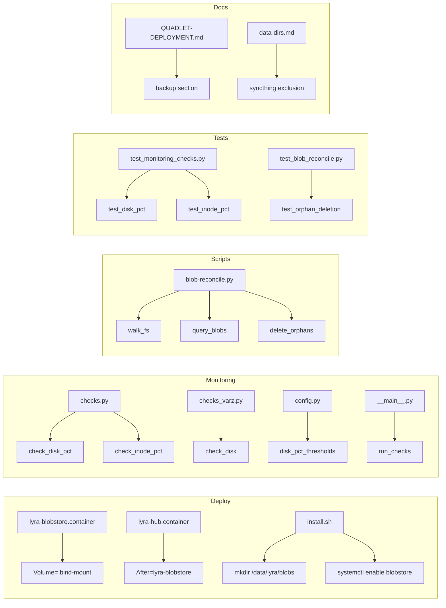

## Summary

6 slices, ~18 micro-tasks, 4 agent instances. Ops-deploy domain only. F-lite: no Breadboard/Slices skip, but analysis skipped. All changes extend existing infrastructure (Quadlet, monitoring, deploy scripts).

## Architecture

### Data flow

```mermaid
flowchart TD
    subgraph Host
        H1[fstab / systemd .mount] --> H2[/data/lyra/blobs]
        H2 --> |noatime| H3[noatime + nodiratime]
    end
    subgraph Container
        C1[lyra-blobstore.container] --> C2[Volume=/data/lyra/blobs:/home/lyra/.lyra/blobstore]
        C2 --> C3[FsBlobStore]
        C3 --> C4[index.sqlite]
        C3 --> C5[sha256/]
    end
    subgraph Monitoring
        M1[check_disk_pct] --> M2[shutil.disk_usage]
        M3[check_inode_pct] --> M4[os.statvfs]
        M2 --> M5[CheckResult]
        M4 --> M5
    end
    subgraph Reconciler
        R1[scripts/blob-reconcile.py] --> R2[walk /data/lyra/blobs]
        R2 --> R3[query blobs.store_path]
        R3 --> R4[age-gate mtime > 1h]
        R4 --> R5[delete orphans]
    end
    H2 --> C1
    H2 --> M1
    H2 --> R1
```

### File × Function map



## Bootstrap Context

- F-lite: analysis skipped, frame used directly.
- All dependencies closed (#1330, #1067, #1063).
- `lyra-blobstore.container` already exists (V8 #1330) — only needs Volume= line update.
- `deploy/quadlet.toml` already has `[component.blobstore]`.
- Monitoring Layer 1/2 already exists — only adding new checks.

## Agents

| Agent | Task count | Files | Subject |
|---|---|---|---|
| devops-A | 6 | Quadlet units, deploy scripts | deploy, quadlet |
| devops-B | 4 | docs, reconciler script | docs, fs |
| backend-dev-A | 5 | monitoring checks | monitoring |
| tester-A | 3 | monitoring tests, reconciler tests | testing |

## Wave Structure

2 waves, max 4 parallel agents. Elapsed ~1 day vs ~3 days sequential.

| Wave | Trigger | Agents | Tasks |
|---|---|---|---|
| 1 | start | devops-A, devops-B, backend-dev-A, tester-A | devops-A: T1-T4,T8 · devops-B: T5-T7 · backend-dev-A: T9-T12 · tester-A: idle |
| 2 | Wave 1 done | devops-A, devops-B, backend-dev-A, tester-A | devops-A: T16 · devops-B: T15 · backend-dev-A: T17 · tester-A: T13-T14,T18 |

### Budget — per task

| Task | Items | Class | Est. ops | Split? |
|---|---|---|---|---|
| T1: Update blobstore container Volume | 1 | bounded | 2 | — |
| T2: Add hub After= blobstore | 1 | bounded | 2 | — |
| T3: Update install.sh mkdir blobstore | 1 | bounded | 2 | — |
| T4: Update install.sh systemctl enable | 1 | bounded | 2 | — |
| T5: Create docs/data-dirs.md | 1 | bounded | 2 | — |
| T6: Amend QUADLET-DEPLOYMENT.md backup | 1 | bounded | 2 | — |
| T7: Add noatime host docs | 1 | bounded | 2 | — |
| T8: Commit deploy changes | 1 | trivial | 1 | — |
| T9: Add check_disk_pct | 1 | bounded | 3 | — |
| T10: Add check_inode_pct | 1 | bounded | 3 | — |
| T11: Add config fields | 1 | bounded | 2 | — |
| T12: Wire checks in run_checks | 1 | bounded | 2 | — |
| T13: Write monitoring tests | 2 | judgmental | 5 | — |
| T14: Write reconciler tests | 1 | judgmental | 4 | — |
| T15: Create scripts/blob-reconcile.py | 1 | bounded | 3 | — |
| T16: Final docs commit | 1 | trivial | 1 | — |
| T17: Verify all monitoring checks pass | 1 | bounded | 2 | — |
| T18: Full test suite | 1 | bounded | 3 | — |

**Total estimated ops: 43**

### Budget — per agent instance

| Instance | Tasks | Σ ops | Subjects | Split? |
|---|---|---|---|---|
| devops-A | T1-T4, T8, T16 | 10 | deploy, quadlet | — |
| devops-B | T5-T7, T15 | 9 | docs, fs | — |
| backend-dev-A | T9-T12, T17 | 12 | monitoring | — |
| tester-A | T13-T14, T18 | 12 | testing | — |

## Consistency Report

| Check | Result |
|---|---|
| SC coverage | 11/11 criteria traced to tasks |
| Breadboard coverage | 8/8 affordances traced to slices |
| Untraced | 0 |
| Exemptions | 0 |

## Micro-Tasks

### Slice S1 — Volume mount + mount options

#### T1 — Update `lyra-blobstore.container` Volume line
- **Description:** Change `Volume=%h/.lyra/blobstore:/home/lyra/.lyra/blobstore:z` to `Volume=/data/lyra/blobs:/home/lyra/.lyra/blobstore:z`
- **File:** `deploy/quadlet/lyra-blobstore.container`
- **Verify:** `grep "Volume=/data/lyra/blobs" deploy/quadlet/lyra-blobstore.container`
- **Expected output:** non-empty
- **Time:** 2 min
- **Agent:** devops-A
- **Subject:** quadlet
- **Spec trace:** SC-1, SC-2
- **Phase:** RED

### Slice S2 — Hub startup ordering

#### T2 — Add `After=lyra-blobstore.service` to `lyra-hub.container`
- **Description:** Add `After=lyra-blobstore.service` and `Requires=lyra-blobstore.service` to `[Unit]` section
- **File:** `deploy/quadlet/lyra-hub.container`
- **Verify:** `grep "After=lyra-blobstore.service" deploy/quadlet/lyra-hub.container`
- **Expected output:** non-empty
- **Time:** 2 min
- **Agent:** devops-A
- **Subject:** quadlet
- **Spec trace:** SC-3
- **Phase:** RED

### Slice S3 — Monitoring: disk/inode % checks

#### T9 — Add `check_disk_pct()` function
- **Description:** Implement `check_disk_pct(path, warning_pct, critical_pct)` using `shutil.disk_usage()` and `os.statvfs()`
- **File:** `src/lyra/monitoring/checks_varz.py`
- **Code snippet:**
  ```python
  def check_disk_pct(path: str, warning_pct: float, critical_pct: float) -> CheckResult:
      usage = shutil.disk_usage(path)
      total = usage.total
      used = usage.used
      pct = (used / total) * 100 if total else 0
      # ...
  ```
- **Verify:** `python -c "from lyra.monitoring.checks_varz import check_disk_pct; print(check_disk_pct('/tmp', 60, 70))"`
- **Expected output:** `CheckResult` object with correct fields
- **Time:** 5 min
- **Agent:** backend-dev-A
- **Subject:** monitoring
- **Spec trace:** SC-6
- **Phase:** RED

#### T10 — Add `check_inode_pct()` function
- **Description:** Implement `check_inode_pct(path, warning_pct, critical_pct)` using `os.statvfs()`
- **File:** `src/lyra/monitoring/checks_varz.py`
- **Code snippet:**
  ```python
  def check_inode_pct(path: str, warning_pct: float, critical_pct: float) -> CheckResult:
      st = os.statvfs(path)
      total = st.f_files
      free = st.f_ffree
      pct = ((total - free) / total) * 100 if total else 0
      # ...
  ```
- **Verify:** `python -c "from lyra.monitoring.checks_varz import check_inode_pct; print(check_inode_pct('/tmp', 60, 70))"`
- **Expected output:** `CheckResult` object with correct fields
- **Time:** 5 min
- **Agent:** backend-dev-A
- **Subject:** monitoring
- **Spec trace:** SC-7
- **Phase:** RED

#### T11 — Add monitoring config fields for blobstore path and thresholds
- **Description:** Add `blobstore_disk_path`, `blobstore_disk_warning_pct`, `blobstore_disk_critical_pct`, `blobstore_inode_warning_pct`, `blobstore_inode_critical_pct` to `MonitoringConfig`
- **File:** `src/lyra/monitoring/config.py`
- **Verify:** `python -c "from lyra.monitoring.config import MonitoringConfig; c = MonitoringConfig(blobstore_disk_path='/data/lyra/blobs'); print(c.blobstore_disk_path)"`
- **Expected output:** `/data/lyra/blobs`
- **Time:** 3 min
- **Agent:** backend-dev-A
- **Subject:** monitoring
- **Spec trace:** SC-6, SC-7
- **Phase:** RED

#### T12 — Wire new checks into `run_checks()`
- **Description:** Add calls to `check_disk_pct` and `check_inode_pct` in `run_checks()` with config values
- **File:** `src/lyra/monitoring/checks.py`
- **Verify:** `grep -n "check_disk_pct\|check_inode_pct" src/lyra/monitoring/checks.py`
- **Expected output:** non-empty
- **Time:** 3 min
- **Agent:** backend-dev-A
- **Subject:** monitoring
- **Spec trace:** SC-6, SC-7
- **Phase:** RED

#### T13 — Write tests for disk/inode percentage checks
- **Description:** Add tests for `check_disk_pct` and `check_inode_pct` using tmpfs or mock
- **File:** `tests/test_monitoring_checks_varz.py` (new)
- **Verify:** `uv run pytest tests/test_monitoring_checks_varz.py -v`
- **Expected output:** All tests pass
- **Time:** 8 min
- **Agent:** tester-A
- **Subject:** testing
- **Spec trace:** SC-6, SC-7
- **Phase:** RED
- **blockedBy:** T9, T10, T11

### Slice S4 — Orphan reconciler script

#### T15 — Create `scripts/blob-reconcile.py`
- **Description:** Implement orphan reconciler: walk FS, query `blobs` table, skip mtime < 1h, delete orphans
- **File:** `scripts/blob-reconcile.py` (new)
- **Code snippet:**
  ```python
  #!/usr/bin/env python3
  import os, sqlite3, argparse
  from pathlib import Path

  def reconcile(blob_dir: Path, db_path: Path, dry_run: bool) -> dict:
      # walk sha256/ subdir
      # query blobs.store_path
      # skip mtime < 3600
      # delete orphans
      # return report
  ```
- **Verify:** `python scripts/blob-reconcile.py --dry-run /data/lyra/blobs ~/.lyra/blobstore/index.sqlite`
- **Expected output:** JSON report with `files_removed` and `bytes_reclaimed`
- **Time:** 10 min
- **Agent:** devops-B
- **Subject:** fs, sqlite
- **Spec trace:** SC-8
- **Phase:** RED
- **blockedBy:** T1

#### T14 — Write tests for blob-reconcile.py
- **Description:** Create test harness with temp dir and in-memory SQLite
- **File:** `tests/test_blob_reconcile.py` (new)
- **Verify:** `uv run pytest tests/test_blob_reconcile.py -v`
- **Expected output:** All tests pass
- **Time:** 8 min
- **Agent:** tester-A
- **Subject:** testing
- **Spec trace:** SC-8
- **Phase:** RED
- **blockedBy:** T15

### Slice S5 — Backup runbook

#### T6 — Amend `docs/QUADLET-DEPLOYMENT.md` backup section
- **Description:** Add note that `/data/lyra/blobs` is the canonical host path and `~/.lyra/blobstore` is the container view. No procedure changes needed — existing backup steps already use `index.sqlite`.
- **File:** `docs/QUADLET-DEPLOYMENT.md`
- **Verify:** `grep -n "/data/lyra/blobs" docs/QUADLET-DEPLOYMENT.md`
- **Expected output:** non-empty
- **Time:** 3 min
- **Agent:** devops-B
- **Subject:** docs
- **Spec trace:** SC-9
- **Phase:** RED

### Slice S6 — Syncthing exclusion + deploy enable

#### T3 — Update `install.sh` to create `/data/lyra/blobs` dir
- **Description:** Add `mkdir -p /data/lyra/blobs` (or warn if not a mount point) in install.sh
- **File:** `deploy/install.sh`
- **Verify:** `grep -n "/data/lyra/blobs" deploy/install.sh`
- **Expected output:** non-empty
- **Time:** 3 min
- **Agent:** devops-A
- **Subject:** deploy
- **Spec trace:** SC-4
- **Phase:** RED

#### T4 — Update `install.sh` to enable `lyra-blobstore.service`
- **Description:** Add `systemctl --user enable lyra-blobstore.service` after daemon-reload
- **File:** `deploy/install.sh`
- **Verify:** `grep -n "enable lyra-blobstore" deploy/install.sh`
- **Expected output:** non-empty
- **Time:** 2 min
- **Agent:** devops-A
- **Subject:** deploy
- **Spec trace:** SC-5
- **Phase:** RED

#### T5 — Create `docs/data-dirs.md`
- **Description:** Document all data directories including Syncthing exclusions. List `/data/lyra/blobs/` as excluded.
- **File:** `docs/data-dirs.md` (new)
- **Verify:** `test -f docs/data-dirs.md && grep "Syncthing" docs/data-dirs.md`
- **Expected output:** non-empty
- **Time:** 5 min
- **Agent:** devops-B
- **Subject:** docs
- **Spec trace:** SC-10
- **Phase:** RED

#### T7 — Add host-level mount documentation
- **Description:** Document `noatime` + `nodiratime` requirement in `docs/QUADLET-DEPLOYMENT.md` or `docs/DEPLOYMENT.md`
- **File:** `docs/QUADLET-DEPLOYMENT.md`
- **Verify:** `grep -n "noatime" docs/QUADLET-DEPLOYMENT.md`
- **Expected output:** non-empty
- **Time:** 3 min
- **Agent:** devops-B
- **Subject:** docs
- **Spec trace:** SC-1
- **Phase:** RED

#### T16 — Final commit for all deploy/docs changes
- **Description:** Commit all deploy, docs, and script changes
- **File:** `deploy/install.sh`, `deploy/quadlet/*.container`, `docs/*`, `scripts/*`
- **Verify:** `git log --oneline -1`
- **Expected output:** commit message includes "deploy"
- **Time:** 2 min
- **Agent:** devops-B
- **Subject:** deploy
- **Spec trace:** SC-1, SC-10
- **Phase:** RED-GATE
- **blockedBy:** T1, T2, T3, T4, T5, T6, T7, T15

#### T17 — Verify all monitoring checks pass
- **Description:** Run `python -m lyra.monitoring` and verify new checks appear in output
- **File:** `src/lyra/monitoring/__main__.py`
- **Verify:** `uv run python -m lyra.monitoring --help` or check with mock config
- **Expected output:** No errors, checks run successfully
- **Time:** 3 min
- **Agent:** backend-dev-A
- **Subject:** monitoring
- **Spec trace:** SC-6, SC-7
- **Phase:** RED-GATE
- **blockedBy:** T9, T10, T11, T12

#### T18 — Full test suite
- **Description:** Run `uv run pytest` and verify all tests pass
- **File:** all tests
- **Verify:** `uv run pytest`
- **Expected output:** All tests pass
- **Time:** 5 min
- **Agent:** tester-A
- **Subject:** testing
- **Spec trace:** SC-11
- **Phase:** RED-GATE
- **blockedBy:** T13, T14, T17

## Task Seeding Blueprint

### Wave 1 — no deps, 4 agents ∥

| Task | Agent instance | blockedBy | Subject |
|------|---------------|-----------|---------|
| T1 | devops-A | — | quadlet |
| T2 | devops-A | — | quadlet |
| T3 | devops-A | — | deploy |
| T4 | devops-A | — | deploy |
| T5 | devops-B | — | docs |
| T6 | devops-B | — | docs |
| T7 | devops-B | — | docs |
| T8 | devops-A | — | deploy |
| T9 | backend-dev-A | — | monitoring |
| T10 | backend-dev-A | — | monitoring |
| T11 | backend-dev-A | — | monitoring |
| T12 | backend-dev-A | — | monitoring |
| T13 | tester-A | T9, T10, T11 | testing |
| T14 | tester-A | T15 | testing |
| T15 | devops-B | T1 | fs, sqlite |

### Wave 2 — after Wave 1, 4 agents ∥

| Task | Agent instance | blockedBy | Subject |
|------|---------------|-----------|---------|
| T16 | devops-B | T1, T2, T3, T4, T5, T6, T7, T15 | deploy |
| T17 | backend-dev-A | T9, T10, T11, T12 | monitoring |
| T18 | tester-A | T13, T14, T17 | testing |

## Task IDs

<!-- Generated by /plan. Used by /implement to resume tasks on session restart. -->
- T1: task#13 — quadlet
- T2: task#14 — quadlet
- T3: task#15 — deploy
- T4: task#16 — deploy
- T5: task#17 — docs
- T6: task#18 — docs
- T7: task#19 — docs
- T8: task#20 — deploy
- T9: task#21 — monitoring
- T10: task#22 — monitoring
- T11: task#23 — monitoring
- T12: task#24 — monitoring
- T13: task#25 — testing
- T14: task#26 — testing
- T15: task#27 — fs, sqlite
- T16: task#28 — deploy
- T17: task#29 — monitoring
- T18: task#30 — testing
