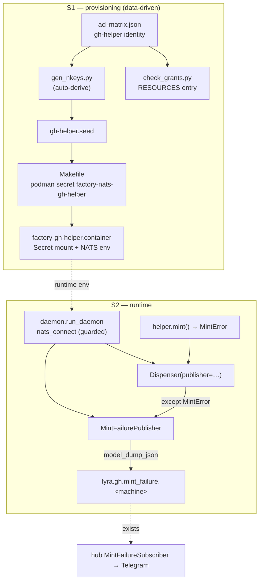
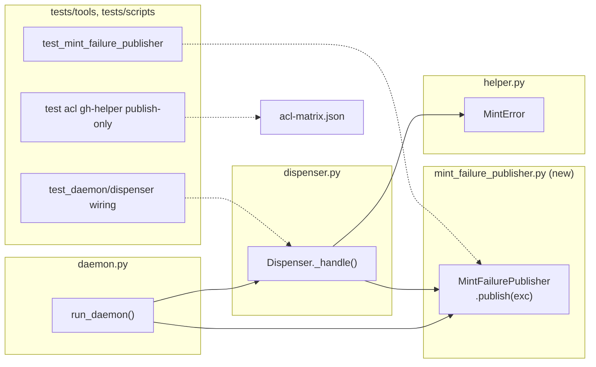

## Summary

Provision a publish-only `gh-helper` NATS identity and wire the token-mint helper to emit a
`MintFailureEvent` on `lyra.gh.mint_failure.<machine>` for every `MintError`, best-effort, without
ever degrading token minting. Two slices: S1 infra/provisioning (devops), S2 publisher + wiring
+ tests (backend-dev, tester).

## Architecture

## Agents

| Agent | Instance | Tasks | Files |
|-------|----------|-------|-------|
| devops | devops-A | T1–T4 | acl-matrix.json, gen_nkeys.py (verify), check_grants.py, Makefile, factory-gh-helper.container |
| backend-dev | backend-dev-A | T5–T8 | mint_failure_publisher.py (new), daemon.py, dispenser.py, helper.py |
| tester | tester-A | T9–T11 | tests/tools/, tests/scripts/ |

## Wave Structure

4 waves, max 3 parallel agents. Elapsed ~½ day vs ~1 day sequential.

| Wave | Trigger | Agents | Tasks |
|------|---------|--------|-------|
| 1 | start | 2 ∥ | devops-A: T1 · backend-dev-A: T5→T8 |
| 2 | Wave 1 done | 3 ∥ | devops-A: T2→T3→T4 · backend-dev-A: T7 · tester-A: T9, T11 |
| 3 | T7 + infra done | 2 ∥ | backend-dev-A: T6 · devops-A: **RG-S1** |
| 4 | T6 done | 1 | tester-A: T10 → **RG-S2** (final gates) |

### Budget — per task

| Task | Items | Class | Est. ops | Split? |
|------|-------|-------|----------|--------|
| T1 acl identity + hub note | 1 file | judgmental | 5 | — |
| T2 gen_nkeys verify + check_grants entry | 2 | judgmental | 6 | — |
| T3 Makefile secret line | 1 | bounded | 3 | — |
| T4 quadlet mount + env | 1 | bounded | 3 | — |
| T5 publisher module (new) | 1 | judgmental | 6 | — |
| T6 daemon wiring (guarded connect) | 1 | judgmental | 6 | — |
| T7 dispenser ctor + publish call | 1 | bounded | 4 | — |
| T8 helper TODO cleanup | 1 | trivial | 2 | — |
| T9 publisher unit tests | 1 | judgmental | 6 | — |
| T10 dispenser/daemon wiring tests | 1 | judgmental | 6 | — |
| T11 acl least-privilege test | 1 | bounded | 4 | — |

**Total estimated ops: ~51**

### Budget — per agent instance

| Instance | Tasks | Σ ops | Subjects | Split? |
|----------|-------|-------|----------|--------|
| devops-A | T1,T2,T3,T4 | 17 | provisioning | — (1 subject, 4 tasks ≤ cap) |
| backend-dev-A | T5,T6,T7,T8 | 18 | mint-publish, cleanup | — (2 subjects, 4 tasks ≤ cap) |
| tester-A | T9,T10,T11 | 16 | mint-publish, acl | — (2 subjects, 3 tasks) |

No splits required.

## Consistency Report

8/8 success criteria covered. Trace below. No untraced tasks. No exemptions.

| SC | Tasks |
|----|-------|
| SC-Identity | T1, (T2 verify) |
| SC-Provisioning | T3, T4 |
| SC-Publish-on-failure | T5, T6, T7 |
| SC-Subject-match (smoke) | T9 |
| SC-Best-effort-isolation | T5 (swallow), T6 (guarded connect), T10 |
| SC-Least-privilege | T2 (check_grants), T11 |
| SC-Cleanup | T8 |
| SC-Gates | RG-S1, RG-S2 |

## Reference Patterns (inject into agents)

- **Best-effort publish shape:** `src/factory/transport/typing_publisher.py:75-83` — `try: nc.publish(subj, event.model_dump_json().encode()); except Exception: log.warning(...)`. Mirror exactly (incl. `# noqa: BLE001` + inline justification).
- **Same-contract serialize/deserialize:** `src/factory/adapters/nats/mint_failure_subscriber.py:70` deserializes via `MintFailureEvent.model_validate_json(msg.data)` → publisher MUST serialize with `event.model_dump_json().encode("utf-8")` (symmetric).
- **`nats_connect` usage:** `src/factory/bootstrap/standalone/hub_standalone.py:56-75` — `from roxabi_nats import nats_connect`; URL from `NATS_URL`; seed auto-read from `NATS_NKEY_SEED_PATH`.
- **Subject helper:** `roxabi_contracts.gh.subjects.gh_mint_failure(machine)` → `lyra.gh.mint_failure.<machine>`.

## Micro-Tasks

### Slice S1 — Identity + provisioning (devops-A)

**T1 — Add `gh-helper` identity to acl-matrix.json** · `deploy/nats/acl-matrix.json` · `[P:N]` · subject: provisioning · SC-Identity · V1 · RED→GREEN · diff 2
- Add identity key `gh-helper`: `status:"active"`, `created_at:"2026-06-02"`, `owner:"lyra"`, `description`, `allow_responses:false`, `publish:["lyra.gh.mint_failure.>"]`, `subscribe:[]`, `deploy:{"type":"container","secret":"factory-nats-gh-helper"}`.
- Update hub `notes`: replace the "publisher identity is not yet declared … TODO T4" clause with "publisher declared by #1082 (gh-helper)".
- Verify: `python3 -c "import json;d=json.load(open('deploy/nats/acl-matrix.json'));print(d['identities']['gh-helper'])"`
- Expect: identity dict prints with publish-only grant + deploy field.

**T2 — Verify gen_nkeys auto-derivation + add check_grants RESOURCES entry** · `scripts/check_grants.py` · `[P:N]` · subject: provisioning · SC-Identity/Least-privilege · V1 · blockedBy T1 · diff 2
- Run `uv run python scripts/gen_nkeys.py genkeys --template-only` → confirm a `gh-helper` block is emitted.
- Add a `RESOURCES` entry asserting `gh-helper` covers publish subject `lyra.gh.mint_failure.>` (match existing tuple shape).
- Verify: `uv run python scripts/check_grants.py` → `check-grants: OK`.

**T3 — Add Makefile secret line** · `Makefile` (`quadlet-secrets-install`) · `[P:N]` · subject: provisioning · SC-Provisioning · V1 · blockedBy T1 · diff 1
- After the `factory-nats-clipool` line add: `@podman secret create --replace factory-nats-gh-helper "$(FACTORY_NKEYS_DIR)/gh-helper.seed"`.
- (Do NOT add turn-writer/blobstore — pre-existing gap, out of scope.)
- Verify: `grep -n factory-nats-gh-helper Makefile`.

**T4 — Add Secret mount + NATS env to helper container** · `deploy/quadlet/factory-gh-helper.container` · `[P:N]` · subject: provisioning · SC-Provisioning · V1 · blockedBy T1 · diff 2
- Add under `[Container]`: `Secret=factory-nats-gh-helper,type=mount,target=factory-nats-gh-helper.seed,uid=1501,gid=1501,mode=0400`; `Environment=NATS_URL=nats://factory-nats:4222`; `Environment=NATS_NKEY_SEED_PATH=/run/secrets/factory-nats-gh-helper.seed`; `Environment=FACTORY_MACHINE=roxabituwer`.
- Verify: `grep -nE "factory-nats-gh-helper|NATS_URL|FACTORY_MACHINE" deploy/quadlet/factory-gh-helper.container`.

**RG-S1 (RED-GATE, devops-A)** · blockedBy T2,T3,T4
- `uv run python scripts/gen_nkeys.py genkeys --template-only | grep gh-helper` && `uv run python scripts/check_grants.py` && (`make quadlet-lint` if present). All green.

### Slice S2 — Publisher + wiring + tests (backend-dev-A, tester-A)

**T5 — Create MintFailurePublisher** · `src/factory/tools/gh_token/mint_failure_publisher.py` (new) · `[P:Y]` · subject: mint-publish · SC-Publish/Best-effort · V2 · RED→GREEN · diff 3
- Class `MintFailurePublisher(nc, machine: str)`. `async def publish(self, exc: MintError) -> None`:
  build `MintFailureEvent(machine=self._machine, reason=_reason_label(exc), http_status=exc.http_status, retries=exc.retries)`; `subject = gh_mint_failure(self._machine)`; `await self._nc.publish(subject, event.model_dump_json().encode("utf-8"))`.
- `_reason_label(exc)`: `f"github_api_{exc.http_status}"` if `http_status is not None` else `"network_error"`.
- Wrap publish body in `try/except Exception as exc: log.warning("mint_failure_publisher: publish failed: %s", exc)  # noqa: BLE001 — best-effort, must not break minting`.
- Verify: `uv run python -c "from factory.tools.gh_token.mint_failure_publisher import MintFailurePublisher"`.

**T7 — Dispenser: accept publisher + publish on MintError** · `src/factory/tools/gh_token/dispenser.py` · `[P:N]` · subject: mint-publish · SC-Publish · V2 · blockedBy T5 · diff 2
- Add ctor param `publisher: "MintFailurePublisher | None" = None`; store on `self`.
- In the `except MintError as exc:` block (after existing `log.warning` + `writer.write(b"error=mint failed\n")`): `if self._publisher is not None: await self._publisher.publish(exc)`.
- Verify: `grep -n "publisher" src/factory/tools/gh_token/dispenser.py`.

**T6 — daemon: guarded NATS connect + inject publisher** · `src/factory/tools/gh_token/daemon.py` · `[P:N]` · subject: mint-publish · SC-Publish/Best-effort · V2 · blockedBy T5,T7 · diff 4
- In `run_daemon`: read `NATS_URL`, `FACTORY_MACHINE` (default `socket.gethostname()`, validate via `validate_job_token`, fallback `"unknown"`).
- If `NATS_URL` unset → `log.info("mint-failure publishing disabled — no NATS_URL")`, `publisher=None`.
- Else `try: nc = await nats_connect(NATS_URL, ...); publisher = MintFailurePublisher(nc, machine) except Exception as exc: log.warning("mint-failure NATS connect failed: %s", exc); nc=None; publisher=None  # noqa: BLE001 — must not crash (BindsTo pod teardown)`.
- Pass `publisher=publisher` to `Dispenser(...)`. On shutdown `finally`: if `nc`: `await nc.drain()`/`close()`.
- Verify: `uv run pyright src/factory/tools/gh_token/daemon.py`.

**T8 — Remove TODO(T4) from helper.py** · `src/factory/tools/gh_token/helper.py` · `[P:Y]` · subject: cleanup · SC-Cleanup · V2 · diff 1
- Delete module-docstring line 11 (`TODO(T4): …`) and edit the `MintError` docstring (line ~55) to drop the "for T4's failure-event path" phrasing.
- Verify: `! grep -n "TODO(T4)\|T4's failure-event" src/factory/tools/gh_token/helper.py`.

**T9 — Publisher unit tests (subject-match + swallow)** · `tests/tools/test_mint_failure_publisher.py` (new) · `[P:Y]` · subject: mint-publish · SC-Subject-match/Best-effort · V2 · blockedBy T5 · diff 3
- Test: forced `MintError(reason, 401, 0)` → publisher publishes to subject == `gh_mint_failure(machine)` (assert prefix `lyra.gh.mint_failure.`), payload deserializes via `MintFailureEvent.model_validate_json` with `reason=="github_api_401"`, `http_status==401`.
- Test: network case (`http_status=None`) → `reason=="network_error"`.
- Test: fake NC whose `publish` raises → `publish()` returns without raising (swallow).
- Verify: `uv run pytest tests/tools/test_mint_failure_publisher.py -q`.

**T10 — Dispenser/daemon wiring tests** · `tests/tools/test_gh_token_helper.py` (extend) · `[P:N]` · subject: mint-publish · SC-Best-effort · V2 · blockedBy T6,T7 · diff 3
- Test: Dispenser with a spy publisher → `MintError` path calls `publisher.publish(exc)` exactly once; socket reply still `error=mint failed`.
- Test: Dispenser with `publisher=None` → MintError path serves error reply, no crash.
- Verify: `uv run pytest tests/tools/test_gh_token_helper.py -q`.

**T11 — ACL least-privilege test** · `tests/scripts/test_acl_gh_helper.py` (new, or extend `tests/scripts/test_genkeys_modes.py`) · `[P:Y]` · subject: acl · SC-Least-privilege · V1/V2 · blockedBy T1 · diff 2
- Parse `acl-matrix.json` → assert `identities["gh-helper"]["publish"] == ["lyra.gh.mint_failure.>"]` and `subscribe == []`.
- Verify: `uv run pytest tests/scripts/test_acl_gh_helper.py -q`.

**RG-S2 (RED-GATE, final)** · blockedBy T6,T8,T9,T10,T11
- `uv run ruff check . && uv run ruff format --check . && uv run pyright && uv run pytest tests/tools tests/scripts -q && uv run import-linter`. All green.

## Task Seeding Blueprint

<!-- Used by /implement. T{n} | agent-instance | blockedBy | subject. blockedBy refs T-numbers. -->

### Wave 1 — no deps, 2 agents ∥

| Task | Agent instance | blockedBy | Subject |
|------|---------------|-----------|---------|
| T1 | devops-A | — | provisioning |
| T5 | backend-dev-A | — | mint-publish |
| T8 | backend-dev-A | — | cleanup |

### Wave 2 — after Wave 1, 3 agents ∥

| Task | Agent instance | blockedBy | Subject |
|------|---------------|-----------|---------|
| T2 | devops-A | T1 | provisioning |
| T3 | devops-A | T1 | provisioning |
| T4 | devops-A | T1 | provisioning |
| T7 | backend-dev-A | T5 | mint-publish |
| T9 | tester-A | T5 | mint-publish |
| T11 | tester-A | T1 | acl |

### Wave 3 — after T7 + infra, 2 agents ∥

| Task | Agent instance | blockedBy | Subject |
|------|---------------|-----------|---------|
| T6 | backend-dev-A | T5, T7 | mint-publish |
| RG-S1 | devops-A | T2, T3, T4 | provisioning |

### Wave 4 — after T6, final gate

| Task | Agent instance | blockedBy | Subject |
|------|---------------|-----------|---------|
| T10 | tester-A | T6, T7 | mint-publish |
| RG-S2 | tester-A | T6, T8, T9, T10, T11 | gates |

## Task IDs

<!-- Generated by /plan. Used by /implement to resume tasks on session restart. -->
- T1: 12 — provisioning (devops-A)
- T5: 13 — mint-publish (backend-dev-A)
- T8: 14 — cleanup (backend-dev-A)
- T2: 15 — provisioning (devops-A)
- T3: 16 — provisioning (devops-A)
- T4: 17 — provisioning (devops-A)
- T7: 18 — mint-publish (backend-dev-A)
- T9: 19 — mint-publish (tester-A)
- T11: 20 — acl (tester-A)
- T6: 21 — mint-publish (backend-dev-A)
- RG-S1: 22 — provisioning (devops-A)
- T10: 23 — mint-publish (tester-A)
- RG-S2: 24 — gates (tester-A)
